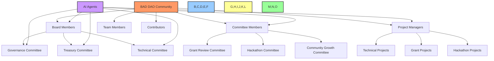
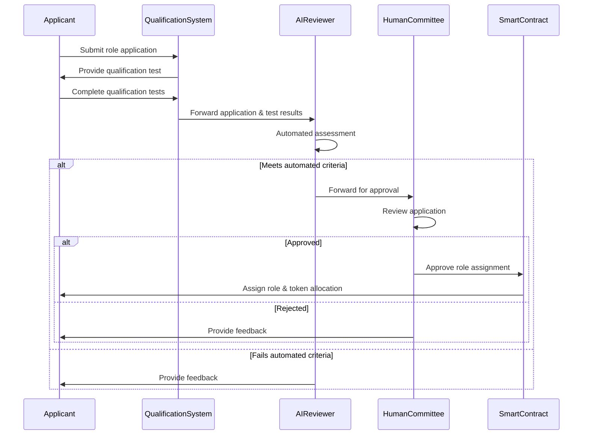
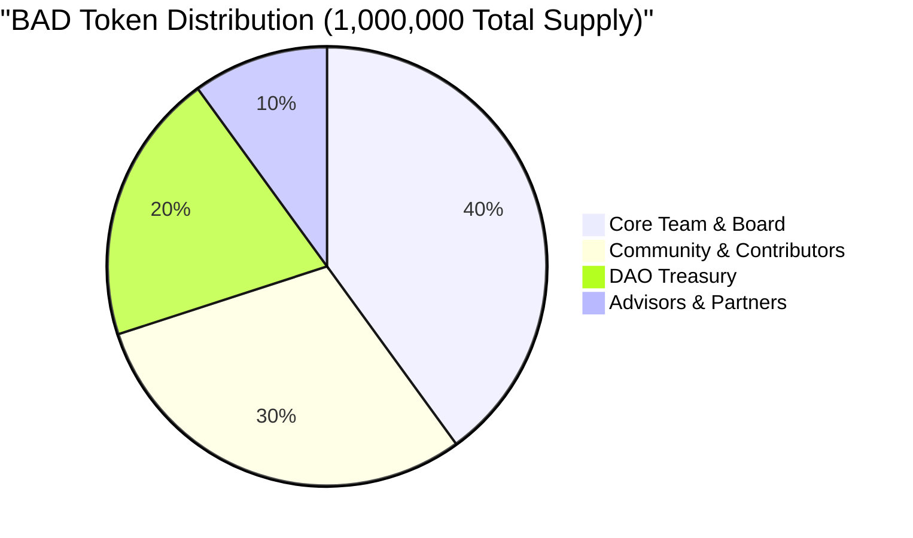
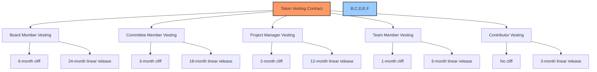
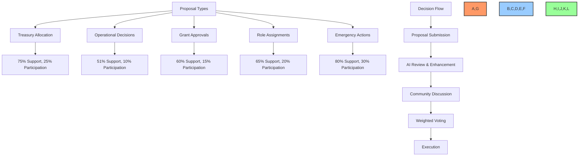
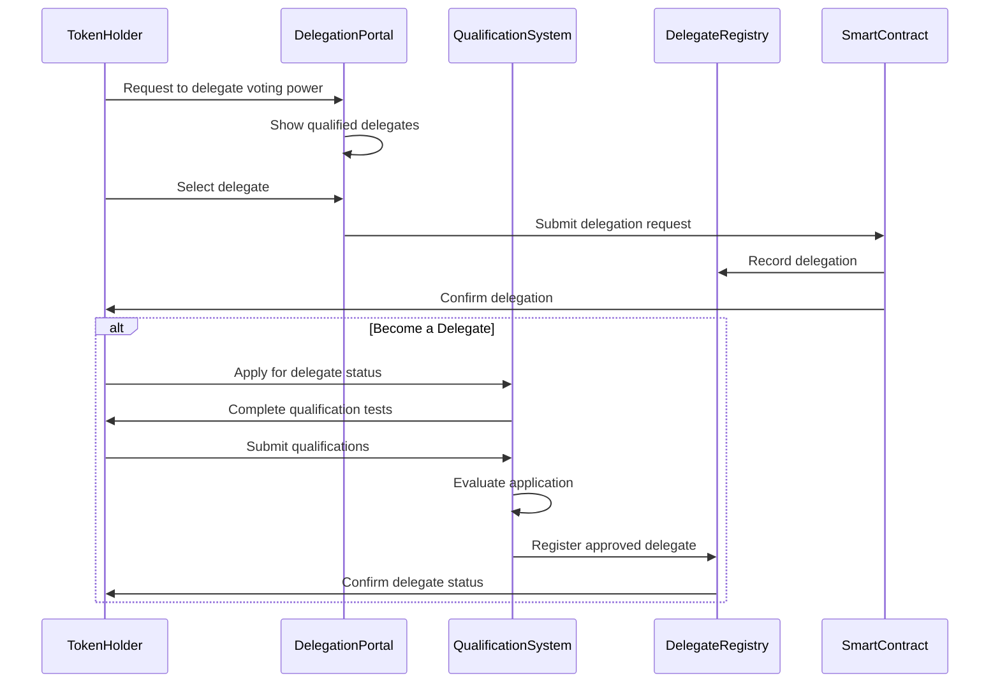
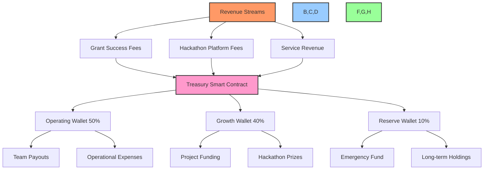
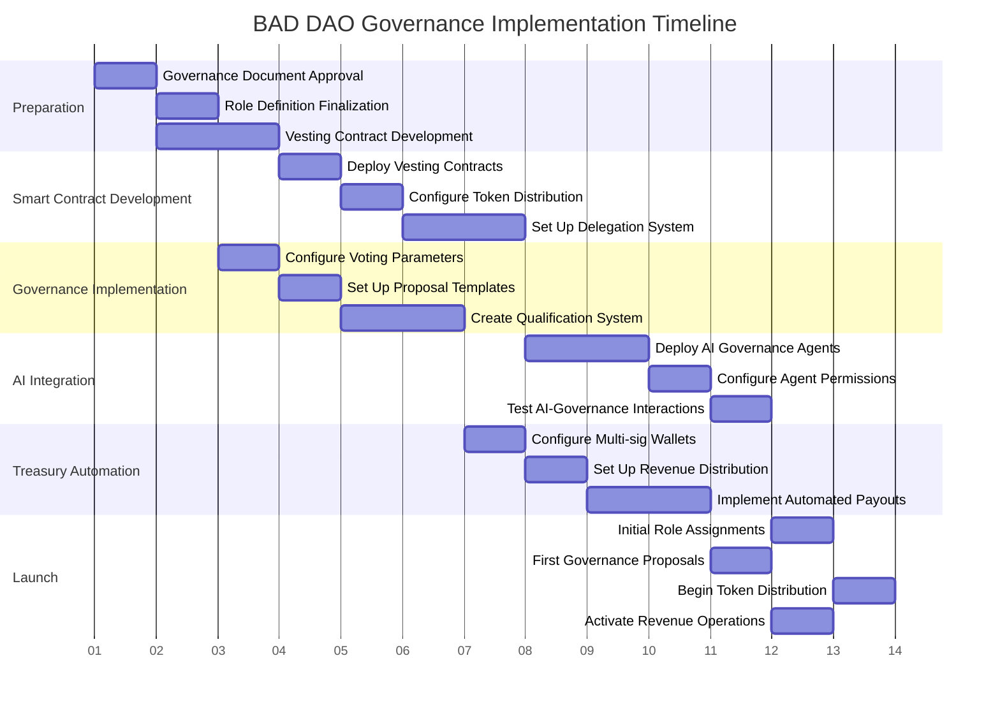

# 🏛️ BAD DAO Vesting, Governance & Delegation Proposal

## 📋 Table of Contents
- [🔍 Overview](#overview)
- [🎯 Objectives](#objectives)
- [👥 Organizational Roles & Structure](#organizational-roles--structure)
- [🪙 Token Distribution & Vesting Strategy](#token-distribution--vesting-strategy)
- [🗳️ Governance Mechanisms](#governance-mechanisms)
- [🔄 Delegation Process](#delegation-process)
- [🤖 AI Integration in Governance](#ai-integration-in-governance)
- [💰 Treasury Management & Automation](#treasury-management--automation)
- [📅 Implementation Timeline](#implementation-timeline)
- [📊 Key Performance Indicators](#key-performance-indicators)

## 🔍 Overview

This proposal outlines the comprehensive vesting, governance, and delegation framework for the BAD DAO. Building on our existing Aragon-based infrastructure and BAD governance token, this document establishes the organizational roles, token distribution strategy, qualification processes, and automated workflows necessary to create a self-sustaining, AI-enhanced decentralized autonomous organization focused on revenue generation through grant writing and hackathon participation.

With our 14-day implementation timeline in mind, this proposal prioritizes essential functionality while establishing a foundation for future enhancements. The framework emphasizes automated decision-making processes, qualification-based role assignment, and transparent treasury management to minimize gatekeeping and enable autonomous operations.

## 🎯 Objectives

1. Define clear organizational roles with associated responsibilities and voting power
2. Establish transparent token vesting and distribution mechanisms
3. Create systematic qualification processes for each organizational role
4. Implement delegation mechanisms for voting power optimization
5. Integrate AI agents into governance workflows for enhanced automation
6. Establish treasury management automation for revenue operations
7. Design scalable governance mechanisms that can evolve with the organization

## 👥 Organizational Roles & Structure

### Organizational Hierarchy

### Role Definitions & Responsibilities

| Role | Responsibilities | Required Qualifications | Token Allocation | Voting Power |
|------|------------------|-------------------------|------------------|--------------|
| **Board Member** | Strategic direction, major proposal approval, treasury oversight | Advanced DAO experience, technical expertise, proven track record | 50,000 BAD (24-month vesting) | 20x base voting weight |
| **Committee Member** | Specialized domain governance, proposal review, implementation oversight | Domain expertise, previous governance experience | 25,000 BAD (18-month vesting) | 10x base voting weight |
| **Project Manager** | Project execution, team coordination, deliverable management | Project management experience, technical understanding | 15,000 BAD (12-month vesting) | 5x base voting weight |
| **Team Member** | Task execution, technical implementation | Relevant technical skills, proven contribution history | 5,000 BAD (6-month vesting) | 2x base voting weight |
| **Contributor** | Specific task completion, community participation | Successful contribution application | 1,000 BAD (3-month vesting) | 1x base voting weight |
| **AI Agent** | Automated decision-making, workflow management, treasury operations | Programmatic qualification based on performance metrics | N/A (programmatic allocation) | Variable based on assigned function |

### Role Qualification Process

#### Board Member Qualification
1. **Application Requirements**:
   - Proven experience in DAO governance or similar organizations
   - Technical expertise relevant to BAD DAO operations
   - Vision statement for DAO development
   - References from recognized community members

2. **Qualification Process**:
   - Technical assessment (80% passing threshold)
   - Governance simulation exercise
   - Community presentation
   - AI-driven interview assessment
   - Existing board member voting (75% approval required)

#### Committee Member Qualification
1. **Application Requirements**:
   - Domain expertise in committee area
   - Previous governance or management experience
   - Contribution history to the DAO or similar projects
   - Specific skills assessment based on committee focus

2. **Qualification Process**:
   - Domain knowledge assessment (75% passing threshold)
   - Committee-specific problem-solving exercise
   - AI-driven application review
   - Board member approval (60% approval required)

#### Project Manager Qualification
1. **Application Requirements**:
   - Project management experience
   - Technical understanding of relevant domain
   - Communication and leadership assessment
   - Previous project delivery evidence

2. **Qualification Process**:
   - Project management simulation
   - Technical assessment (70% passing threshold)
   - Team leadership evaluation
   - AI-driven skills mapping
   - Committee approval (60% approval required)

#### Team Member Qualification
1. **Application Requirements**:
   - Technical skill assessment in relevant domain
   - Portfolio of previous work
   - Commitment statement
   - Team compatibility assessment

2. **Qualification Process**:
   - Technical skills test (70% passing threshold)
   - Code quality assessment (for technical roles)
   - AI-driven skill verification
   - Project manager approval

#### Contributor Qualification
1. **Application Requirements**:
   - Basic skill verification
   - Contribution proposal
   - Time commitment statement

2. **Qualification Process**:
   - Basic qualification quiz (60% passing threshold)
   - Micro-task completion assessment
   - AI community fit analysis
   - Automated approval based on criteria

## 🪙 Token Distribution & Vesting Strategy

### Token Allocation Overview

### Role-Based Token Distribution

| Role Category | Total Allocation | Members | Tokens Per Member | Vesting Schedule |
|---------------|------------------|---------|------------------|------------------|
| Board Members | 200,000 BAD | 4 | 50,000 BAD | 24-month linear vesting, 6-month cliff |
| Committee Members | 150,000 BAD | 6 | 25,000 BAD | 18-month linear vesting, 3-month cliff |
| Project Managers | 150,000 BAD | 10 | 15,000 BAD | 12-month linear vesting, 2-month cliff |
| Team Members | 100,000 BAD | 20 | 5,000 BAD | 6-month linear vesting, 1-month cliff |
| Contributors | 100,000 BAD | 100 | 1,000 BAD | 3-month linear vesting, no cliff |
| Future Allocation | 300,000 BAD | - | - | Reserved for future distribution |

### Vesting Implementation

### Vesting Contract Technical Requirements

1. **Smart Contract Specifications**:
   - ERC-20 compatible vesting contract
   - Role-based vesting schedules
   - Linear release after cliff period
   - Emergency pause functionality (requires 80% board approval)
   - Automatic monthly release to eligible wallets

2. **Vesting Implementation Process**:
   - Deploy vesting contract with predefined schedules
   - Assign vesting schedules based on role qualification
   - Implement automatic monthly token release
   - Require governance approval for any schedule modifications
   - Provide dashboard for vesting status monitoring

3. **Vesting Conditions**:
   - Continued active participation in the DAO
   - Meeting role-specific key performance indicators
   - Compliance with DAO charter and code of conduct
   - Quarterly performance review by AI and committee

## 🗳️ Governance Mechanisms

### Decision-Making Framework

### Proposal Types & Requirements

| Proposal Type | Description | Support Threshold | Participation Minimum | Voting Duration | Creation Threshold |
|---------------|-------------|------------------|------------------------|----------------|-------------------|
| Treasury Allocation | Requests for funding over $5,000 | 75% | 25% | 72 hours | 10,000 BAD |
| Operational Decisions | Day-to-day operational changes | 51% | 10% | 48 hours | 1,000 BAD |
| Grant Approvals | Funding for grant applications | 60% | 15% | 48 hours | 5,000 BAD |
| Role Assignments | Approval of new board/committee members | 65% | 20% | 72 hours | 5,000 BAD |
| Emergency Actions | Critical security or operational issues | 80% | 30% | 24 hours | 20,000 BAD |

### Proposal Submission Process

1. **Proposal Creation**:
   - Token holder drafts proposal using template
   - AI assistant reviews for completeness and clarity
   - Proposal requires minimum BAD token stake
   - Automated categorization based on content

2. **Discussion Phase**:
   - 48-hour discussion period before voting
   - AI-moderated discussion forum
   - Automated summary of key points and concerns
   - Opportunity for proposal amendments

3. **Voting Phase**:
   - Weighted voting based on role and token holdings
   - Anonymous voting option available
   - Real-time voting analytics
   - Early execution if outcome is mathematically guaranteed

4. **Execution Phase**:
   - Automated execution for approved proposals
   - Smart contract integration for treasury actions
   - Audit log of all executed proposals
   - Implementation task creation and assignment

## 🔄 Delegation Process

### Delegation Mechanics

### Delegate Qualification Process

1. **Basic Requirements**:
   - Minimum 5,000 BAD tokens held
   - Activity history in the DAO (minimum 3 months)
   - Successfully passed role-specific qualification
   - No code of conduct violations

2. **Qualification Steps**:
   - Governance knowledge assessment (75% passing threshold)
   - Voting history analysis by AI
   - Public delegate statement submission
   - Community rating above 4.0/5.0
   - Committee approval for specialized delegation areas

3. **Delegate Types**:
   - **Technical Delegate**: Focus on technical proposals and implementations
   - **Treasury Delegate**: Specialization in financial decisions
   - **Grant Delegate**: Expertise in evaluating grant proposals
   - **Community Delegate**: Representing general community interests
   - **Project Delegate**: Focus on project management and execution

### Delegation Restrictions & Safeguards

1. **Delegation Limits**:
   - Maximum 100,000 BAD tokens delegated to a single delegate
   - Delegate must maintain minimum 5,000 personal tokens
   - Delegation expires after 3 months (requires renewal)
   - Instant revocation option for delegators

2. **Delegation Monitoring**:
   - AI-powered monitoring of delegate voting patterns
   - Automatic alerts for abnormal voting behavior
   - Quarterly delegate performance reports
   - Community feedback mechanism for delegates

3. **Delegation Incentives**:
   - Additional 0.5% voting weight for active delegates
   - Special delegate badge on community platform
   - Priority access to DAO events and information
   - Delegate compensation for high participation (500 BAD per month)

## 🤖 AI Integration in Governance

### AI Agent Roles & Responsibilities

```mermaid
graph TD
    A[AI Governance Agents] --> B[Proposal Assistant]
    A --> C[Treasury Monitor]
    A --> D[Qualification Verifier]
    A --> E[Voting Analyzer]
    A --> F[Emergency Response Agent]
    A --> G[Proposal Generator]
    A --> H[Task Manager]
    A --> I[Strategic Advisor]
    
    B --> B1[Proposal formatting]
    B --> B2[Impact analysis]
    B --> B3[Similar proposal detection]
    
    C --> C1[Transaction monitoring]
    C --> C2[Budget tracking]
    C --> C3[Financial reporting]
    
    D --> D1[Application review]
    D --> D2[Skill assessment]
    D --> D3[Qualification testing]
    
    E --> E1[Voting pattern analysis]
    E --> E2[Participation monitoring]
    E --> E3[Result verification]
    E --> E4[Active Voting]
    
    F --> F1[Threat detection]
    F --> F2[Circuit breaker activation]
    F --> F3[Emergency response coordination]
    
    G --> G1[Daily proposal generation]
    G --> G2[Objective alignment analysis]
    G --> G3[Community need detection]
    
    H --> H1[Task breakdown creation]
    H --> H2[Subtask assignment]
    H --> H3[Progress tracking]
    
    I --> I1[Roadmap optimization]
    I --> I2[Growth opportunity identification]
    I --> I3[Risk assessment]
    
    style A fill:#f96,stroke:#333,stroke-width:2px
    style B,C,D,E,F,G,H,I fill:#9cf,stroke:#333,stroke-width:2px
```

### AI Decision-Making Framework

1. **Autonomous Decision Tiers**:
   - **Tier 1** (Full Autonomy): Routine operational decisions, basic contributor approvals, standard reporting
   - **Tier 2** (Semi-Autonomous): Budget allocations under $1,000, content moderation, qualification testing
   - **Tier 3** (Recommendation Only): Major treasury actions, role assignments above contributor level, governance changes

2. **AI Voting Rights**:
   - AI agents receive limited voting rights for specific decision categories
   - Maximum 10% of total voting power allocated to AI agents
   - AI voting must follow programmatic rules approved by governance
   - Quarterly review of AI voting patterns by Technical Committee
   - AI may vote on all proposals, including those it generates
   - AI votes count toward quorum requirements
   - Each AI governance agent must maintain a public voting record with rationale
   - AI agents may submit comments and analysis during proposal discussion phase
   - AI voting weight is amplified for operational proposals (15%) and reduced for constitutional changes (5%)
   - AI voting patterns are regularly audited for bias and alignment with DAO objectives
   - AI votes are recorded on-chain with transparent rationale for decision
   - AI voting power can be adjusted through governance proposals
   - AI agents cannot vote on proposals to modify their own voting rights or permissions

3. **AI Proposal Generation**:
   - AI must generate minimum 2 daily proposals aligned with organizational objectives
   - AI-generated proposals require approval from at least 3 qualified human roles before voting begins
   - AI-generated proposals must include comprehensive impact analysis and risk assessment
   - AI must demonstrate alignment with DAO objectives for each proposal
   - AI proposal categories include: operational improvements, resource allocation, technical implementations, governance refinements
   - AI proposals must include detailed implementation plans with task breakdowns and resource requirements
   - Each AI proposal must reference relevant historical data and precedents
   - AI must track proposal performance metrics after implementation
   - Proposals must include clear success metrics and evaluation criteria
   - Proposals must include estimated resource requirements and timeline
   - Technical proposals must include security considerations and audit requirements
   - Financial proposals must include ROI analysis and opportunity cost assessment
   - Each proposal must be tagged with relevant strategic objectives and KPIs
   - Generate diverse proposal types across technical, financial, and community domains
   - Perform competitive analysis to suggest strategic improvements
   - Create counter-proposals when beneficial to organizational objectives
   - Generate contingency plans for high-risk proposals
   - Maintain proposal database with searchable history and outcomes

4. **AI Proposal Voting Requirements**:
   - AI-generated proposals require at least 3 human votes from qualified roles to pass
   - AI may contribute its own vote to its generated proposals
   - Special designation in governance dashboard for AI-generated proposals
   - Expedited voting timeline option for routine AI-generated proposals (24hr vs standard 5 days)
   - Increased documentation requirements for AI-generated proposals
   - AI voting power is limited to 10% of total voting power for any proposal
   - AI votes are recorded on-chain with transparent rationale for decision
   - AI voting patterns are regularly audited for bias and alignment with DAO objectives
   - AI voting power can be adjusted through governance proposals
   - AI agents cannot vote on proposals to modify their own voting rights

5. **Task Management Integration**:
   - AI continually generates and manages tasks aligned with DAO objectives
   - Tasks are broken down into subtasks with clear acceptance criteria
   - AI assigns tasks based on role qualifications and availability
   - Progress tracking with automated reminders and blocker identification
   - Performance metrics collected to improve future task allocation
   - AI automatically creates subtasks from approved proposals
   - Task prioritization based on strategic importance and dependencies
   - Real-time dashboards for task progress visualization
   - Stakeholder alerts about approaching deadlines and potential risks
   - Integration with project management tools and collaboration platforms
   - Analyze team capacity and optimize resource allocation
   - Identify skill gaps and recommend training or recruitment
   - Generate automated documentation from completed tasks
   - Provide intelligent task recommendations based on individual roles
   - Maintain historical task database for improved estimation accuracy
   - Integrate with AI proposal generator to ensure alignment with strategic objectives
   - Generate regular progress reports with completion metrics
   - Create automated retrospective analysis for completed task groups
   - Implement dynamic reprioritization based on changing organizational needs
   - Provide early warning system for at-risk objectives

6. **Proposal Generator Agent**:
   - **Training Data**: Strategic objectives and roadmap, historical proposals and outcomes, technical documentation, community feedback, market trends and competitive analysis, governance participation metrics, treasury allocation history, protocol performance data, competitor analysis, user feedback and sentiment analysis
   - **Functions**: Automatically generate governance proposals (minimum 2 daily), align proposals with DAO objectives, identify improvement opportunities
   - **Integration Points**: Strategic roadmap, organization objectives, development pipeline, governance metrics
   - **Permissions**: Can submit proposals directly to governance system, requires human review before final submission
   - **Constraints**: Proposals must align with DAO constitution and objectives
   - **Key Functions**:
     - `generateDailyProposals()`: Create minimum 2 daily proposals aligned with objectives
     - `createImplementationPlan(proposalId)`: Develop detailed execution plan
     - `trackPerformanceMetrics(proposalId)`: Monitor proposal effectiveness
     - `adaptGenerationStrategy()`: Refine proposal creation based on historical data
     - `generateTaskBreakdown(proposalId)`: Create hierarchical task structures
     - `performImpactAnalysis(proposalId)`: Assess potential outcomes and side effects
     - `generateCounterProposal(proposalId)`: Create alternative approach when beneficial
     - `prioritizeProposalQueue()`: Order proposals by strategic importance
     - `identifyGovernanceGaps()`: Flag areas needing governance attention
     - `generateVotingRecommendation(proposalId)`: Provide analysis-based voting guidance
     - `estimateImplementationResources(proposalId)`: Calculate required resources
     - `monitorProposalOutcomes()`: Track results of implemented proposals
     - `generateImprovedVariants(proposalId)`: Suggest refinements to existing proposals
     - `analyzeImplementationRisks(proposalId)`: Identify potential execution challenges
   - **Generation Capabilities**: Creates proposals across operational, technical, financial, and governance domains; analyzes organizational data to identify improvement opportunities; monitors proposal implementation; provides progress reports
   - **Optimization Features**: Adapts proposal strategy based on historical outcomes; prioritizes proposals based on strategic importance; flags high-impact proposals for special attention

7. **Task Manager Agent**:
   - **Training Data**: Project management best practices, historical task completion data, team capacity and expertise profiles, dependency relationships, resource allocation models, organizational structure and roles, skill matrix and competency models, historical velocity and productivity metrics, communication patterns and collaboration data, tool usage and adoption metrics
   - **Functions**: Break down objectives into actionable tasks, assign tasks based on role qualifications, track progress, identify blockers
   - **Integration Points**: Project management system, contributor profiles, role qualifications database
   - **Permissions**: Can create and assign tasks, monitor progress, suggest reassignments, cannot approve completed work
   - **Key Functions**:
     - `createTaskHierarchy(objectiveId)`: Break down objectives into tasks
     - `assignOptimalResources(taskId)`: Match tasks to qualified roles
     - `trackProgress(taskId)`: Monitor task completion status
     - `identifyBlockers(taskId)`: Flag potential obstacles
     - `prioritizeTasks()`: Arrange tasks by importance and dependencies
     - `generateStatusReports()`: Create regular progress updates
     - `calculateResourceRequirements(objectiveId)`: Estimate needed capacity
     - `predictCompletionTimelines(taskId)`: Forecast realistic deadlines
     - `recommendSkillDevelopment(roleId)`: Suggest training based on task requirements
     - `optimizeWorkDistribution()`: Balance workload across team members
     - `generateAutomationOpportunities()`: Identify tasks suitable for automation
     - `performRiskAnalysis(taskId)`: Assess completion risks and mitigations
     - `createKnowledgeRepository()`: Document lessons from completed tasks
     - `generateTeamConfiguration(objectiveId)`: Suggest optimal team composition
     - `monitorTeamHealth()`: Track workload balance and potential burnout

8. **AI Voting Agent**:
   - **Training Data**: Governance constitution and principles, historical voting patterns and outcomes, economic and technical impact assessments, strategic objectives and roadmap, professional governance best practices, community sentiment analysis, protocol performance data, previous proposal performance, security and risk assessments, market and competitive analysis
   - **Functions**: Analyze proposals, determine voting decisions, explain rationale, track voting effectiveness
   - **Integration Points**: Governance system, proposal database, strategic objectives, treasury data
   - **Permissions**: Can cast votes, submit proposal analyses, cannot modify voting rules
   - **Key Functions**: 
     - `analyzeProposalAlignment(proposalId)`: Evaluate alignment with strategic objectives
     - `calculateOrgBenefit(proposalId)`: Assess proposed changes against organizational KPIs
     - `evaluateImplementationRisks(proposalId)`: Identify potential execution challenges
     - `analyzeResourceRequirements(proposalId)`: Assess feasibility given available resources
     - `determineVote(proposalId)`: Generate evidence-based voting decision
     - `explainVoteRationale(voteId)`: Provide detailed reasoning for voting decisions
     - `trackVotingOutcomes()`: Monitor effectiveness of voting decisions
     - `generateVotingStrategy()`: Develop approach to proposal evaluation
     - `detectVotingAnomalies()`: Identify unusual voting patterns or potential governance attacks
     - `performVotingSimulation(proposalId)`: Model potential outcomes of voting scenarios

## 💰 Treasury Management & Automation

### Automated Treasury Workflows

### Revenue Distribution Automation

1. **Revenue Collection Workflow**:
   - Smart contract receives all project revenue in USDT
   - Incoming funds are categorized by source (grants, hackathons, services)
   - AI treasury agent verifies transaction source and amount
   - Funds are automatically allocated based on revenue type

2. **Distribution Percentages**:

| Revenue Source | Operating Wallet | Growth Wallet | Reserve Wallet |
|----------------|------------------|---------------|----------------|
| Grant Success Fees | 60% | 30% | 10% |
| Hackathon Platform Fees | 50% | 40% | 10% |
| Service Revenue | 70% | 20% | 10% |

3. **Automated Payout System**:
   - Team member payouts executed via smart contract based on:
     - Role-based base compensation
     - Project completion bonuses
     - Contribution metrics
   - Requires multi-signature approval for amounts over $5,000
   - Weekly automatic distribution for amounts under threshold
   - Transparent payout ledger accessible to all members

### Treasury Security Measures

1. **Multi-signature Requirements**:
   - Operating Wallet: 3/5 signers (2 board members, 1 committee member, 2 AI agents)
   - Growth Wallet: 3/5 signers (2 board members, 2 committee members, 1 AI agent)
   - Reserve Wallet: 4/6 signers (3 board members, 2 committee members, 1 AI agent)

2. **Transaction Limits**:
   - AI-only approval: Up to $500
   - Single board member + AI: Up to $2,000
   - Multiple signatures: Required for larger amounts
   - Weekly spending limits by category
   - Cooling period for transactions over $10,000

3. **Treasury Monitoring**:
   - 24/7 AI monitoring of all wallets
   - Anomaly detection for unusual transaction patterns
   - Daily balance and transaction reports
   - Quarterly treasury audit by external provider
   - Emergency freeze mechanism for suspicious activity

## 📅 Implementation Timeline

### Implementation Phases

1. **Phase 1: Foundation (Days 1-3)**
   - Approve governance framework document
   - Finalize role definitions and qualifications
   - Develop and deploy vesting contract
   - Configure token distribution parameters

2. **Phase 2: Core Systems (Days 4-7)**
   - Set up delegation system
   - Configure voting parameters for each proposal type
   - Create qualification testing system
   - Implement role application workflow

3. **Phase 3: Automation (Days 8-11)**
   - Deploy AI governance agents
   - Configure treasury automation
   - Set up revenue distribution workflows
   - Implement automated payout system

4. **Phase 4: Launch (Days 12-14)**
   - Assign initial roles based on qualification
   - Begin token distribution according to vesting schedule
   - Submit first governance proposals
   - Activate revenue operations

## 📊 Key Performance Indicators

### Governance Effectiveness Metrics

1. **Participation Metrics**:
   - Voting participation rate (target: >30% of tokens)
   - Proposal submission rate (target: 5+ per month)
   - Delegate utilization (target: >40% of tokens delegated)
   - Role application rate (target: 2x available positions)

2. **Operational Efficiency**:
   - Proposal processing time (target: <5 days)
   - Treasury transaction execution time (target: <24 hours)
   - Role qualification completion rate (target: >65%)
   - AI agent decision accuracy (target: >90%)

3. **Financial Performance**:
   - Revenue growth rate (target: 15% monthly)
   - Treasury diversification (target: <40% in any single asset)
   - Operational expense ratio (target: <30% of revenue)
   - Project funding success rate (target: >60%)

### Regular Review & Adjustment

1. **Weekly Reviews**:
   - AI-generated governance performance reports
   - Participation and voting pattern analysis
   - Revenue and treasury status updates
   - Project status and funding updates

2. **Monthly Governance Meeting**:
   - Review of governance performance metrics
   - Assessment of role distribution and needs
   - Adjustment of qualification requirements as needed
   - Proposal of governance process improvements

3. **Quarterly System Audit**:
   - Comprehensive review of governance system
   - Security audit of treasury operations
   - Assessment of token distribution effectiveness
   - Review of delegation patterns and effectiveness

---

*This proposal document provides the framework for implementing the BAD DAO's vesting, governance, and delegation systems. Upon approval, this framework will be implemented according to the 14-day timeline outlined above, enabling the BAD DAO to begin revenue-generating operations with a fully automated governance system.* 