# 🏛️ BAD DAO Governance Framework Proposal

**Date**: June 3, 2023  
**Author**: BAD DAO Core Team  
**Version**: 1.0  
**Status**: 🟡 Draft for Review  

## 📋 Table of Contents
- [🔍 Executive Summary](#-executive-summary)
- [🎯 Objectives](#-objectives)
- [🏛️ Governance Structure](#️-governance-structure)
  - [👥 Role Definitions](#-role-definitions)
  - [🤖 AI Governance Agents](#ai-governance-agents)
  - [🗳️ AI Voting Participation](#ai-voting-participation)
- [💰 Token Vesting Strategy](#token-vesting-strategy)
- [🤝 Delegation System](#delegation-system)
- [🏦 Treasury Management](#treasury-management)
- [📝 Proposal Process](#proposal-process)
- [🛠️ Technical Implementation](#technical-implementation)
- [📅 Implementation Timeline](#-implementation-timeline)
- [📊 Success Metrics](#success-metrics)
- [📚 Appendices](#-appendices)

## 🔍 Executive Summary

The BAD DAO Governance Framework establishes a decentralized decision-making structure that balances community participation with operational efficiency. This proposal outlines a comprehensive governance model designed to evolve over time, gradually increasing decentralization while maintaining security and functionality.

```mermaid
graph TD
    A[🏛️ BAD DAO Governance] --> B[🗳️ Voting Mechanism]
    A --> C[💰 Token Economics]
    A --> D[📝 Proposal System]
    A --> E[🔒 Security Controls]
    A --> F[🔄 Evolution Path]
    
    B --> B1[⛓️ On-chain Voting]
    B --> B2[👥 Role-based Access]
    B --> B3[📊 Quorum Requirements]
    
    C --> C1[📈 Token Distribution]
    C --> C2[🎯 Incentive Structure]
    C --> C3[⚖️ Voting Power Calculation]
    
    D --> D1[📤 Submission]
    D --> D2[💬 Discussion]
    D --> D3[🗳️ Voting]
    D --> D4[🚀 Implementation]
    
    E --> E1[🚨 Emergency Protocol]
    E --> E2[🔑 Multi-sig Controls]
    E --> E3[🧪 Audit Requirements]
    
    F --> F1[📝 Framework Revision]
    F --> F2[🌐 Decentralization Milestones]
    F --> F3[📈 Continuous Improvement]
    
    style A fill:#f96,stroke:#333,stroke-width:2px
    style B,C,D,E,F fill:#9cf,stroke:#333,stroke-width:2px
    style B1,B2,B3,C1,C2,C3,D1,D2,D3,D4,E1,E2,E3,F1,F2,F3 fill:#fff,stroke:#333,stroke-width:1px
```

The framework leverages the BAD token as the primary governance instrument, with varying proposal types requiring different quorum and approval thresholds. The system incorporates time-weighted voting, delegation capabilities, and specialized governance roles to ensure both broad participation and domain expertise in decision-making.

## 🎯 Objectives

The BAD DAO Governance Framework aims to:

1. Create a sustainable and effective decision-making structure
2. Align incentives between different stakeholder groups
3. Enable broad participation while maintaining expertise-driven decisions
4. Establish clear accountability and responsibility channels
5. Leverage AI to enhance governance efficiency and objectivity
6. Ensure fair token distribution with appropriate vesting mechanisms
7. Automate routine governance functions to reduce overhead

## 🏛️ Governance Structure

### 👥 Role Definitions

```mermaid
graph TD
    A[👥 BAD DAO Community] --> B[👑 Core Team]
    A --> C[🛠️ Contributors]
    A --> D[🧑‍💼 Delegates]
    A --> E[👤 Community Members]
    
    B --> B1[⚖️ Enhanced Voting Weight]
    B --> B2[🚨 Emergency Action Rights]
    B --> B3[⚙️ Parameter Control]
    
    C --> C1[🗳️ Standard Voting Rights]
    C --> C2[📝 Proposal Submission]
    C --> C3[👥 Specialized Work Groups]
    
    D --> D1[📊 Delegated Voting Power]
    D --> D2[🎁 Delegation Rewards]
    D --> D3[🤝 Delegation Coalitions]
    
    E --> E1[🗳️ Basic Voting Rights]
    E --> E2[🔄 Delegation Options]
    E --> E3[👥 Participation Rights]
    
    style A fill:#f96,stroke:#333,stroke-width:2px
    style B,C,D,E fill:#9cf,stroke:#333,stroke-width:2px
    style B1,B2,B3,C1,C2,C3,D1,D2,D3,E1,E2,E3 fill:#fff,stroke:#333,stroke-width:1px
```

#### 🔶 Core Team

The Core Team consists of founding contributors with deep knowledge of the project's technical and operational aspects. They are responsible for strategic direction, critical technical decisions, and emergency responses.

**Responsibilities**:
- Setting technical roadmap and strategic initiatives
- Maintaining core infrastructure and security
- Managing emergency response procedures
- Guiding overall DAO direction and priorities

**Rights**:
- Enhanced voting weight (1.5x) on technical proposals
- Ability to initiate emergency actions (with multi-sig approval)
- Control over critical protocol parameters
- Direct treasury allocation rights up to 1% without full governance vote

#### 🔷 Contributors

Contributors are active participants who regularly contribute to the project's development, operations, or community building.

**Responsibilities**:
- Delivering on specific project contributions
- Participating regularly in governance decisions
- Providing domain expertise
- Supporting community education and onboarding

**Rights**:
- Standard voting rights proportional to tokens held
- Ability to submit funded proposals
- Access to contributor-specific bounties and incentives
- Participation in specialized working groups

#### 🔹 Delegates

Delegates are trusted community members who accumulate voting power through delegation from token holders. They serve as governance specialists who actively research and vote on proposals.

**Responsibilities**:
- Thorough analysis of all proposals in their domain
- Regular voting participation (minimum 80% of proposals)
- Publishing voting rationales and decision frameworks
- Maintaining communication with delegators

**Rights**:
- Voting with delegated voting power
- Enhanced visibility in governance forums
- Delegation rewards from the incentive system
- Ability to form delegate coalitions

#### 👤 Community Members

All token holders who participate in the ecosystem as users, voters, or delegators.

**Responsibilities**:
- Due diligence when voting or delegating
- Participation in community discussions
- Providing feedback on proposals and protocol development

**Rights**:
- Basic voting rights proportional to tokens held
- Ability to delegate voting power
- Proposal submission rights
- Participation in governance discussion

### 🤖 AI Governance Agents

```mermaid
graph TD
    A[🤖 AI Governance Agents] --> B[🔍 Proposal Analyzer]
    A --> C[📊 Voting Recommendation]
    A --> D[💹 Treasury Oversight]
    A --> E[✨ Proposal Generator]
    A --> F[📋 Task Management]
    A --> G[🗳️ AI Voting Agent]
    
    B --> B1[📝 Analysis Reports]
    B --> B2[⚠️ Risk Assessment]
    B --> B3[📈 Impact Evaluation]
    
    C --> C1[👍 Voting Recommendations]
    C --> C2[💡 Rationale Explanation]
    C --> C3[📜 Historical Comparison]
    
    D --> D1[🔄 Transaction Monitoring]
    D --> D2[🚨 Anomaly Detection]
    D --> D3[📊 Portfolio Optimization]
    
    E --> E1[📅 Daily Proposals]
    E --> E2[📝 Implementation Plans]
    E --> E3[📋 Task Breakdowns]
    
    F --> F1[🌲 Task Hierarchies]
    F --> F2[👥 Resource Assignment]
    F --> F3[📈 Progress Tracking]
    
    G --> G1[⚖️ Evidence-based Voting]
    G --> G2[🔍 Alignment Analysis]
    G --> G3[📝 Voting Rationale]
    
    style A fill:#f96,stroke:#333,stroke-width:2px
    style B,C,D,E,F,G fill:#9cf,stroke:#333,stroke-width:2px
    style B1,B2,B3,C1,C2,C3,D1,D2,D3,E1,E2,E3,F1,F2,F3,G1,G2,G3 fill:#fff,stroke:#333,stroke-width:1px
```

#### 🔍 Proposal Analyzer Agent

**Purpose**: Provide objective analysis of proposals for technical feasibility, economic impact, and alignment with DAO objectives.

**Capabilities**:
- Evaluate proposal completeness against standardized rubric
- Identify potential conflicts with existing systems or governance
- Estimate economic and technical impacts
- Flag high-risk elements for human review

#### 📊 Voting Recommendation Agent

**Purpose**: Generate data-driven recommendations based on proposal analysis and historical governance patterns.

**Capabilities**:
- Analyze proposals against DAO constitution and principles
- Generate standardized scoring across evaluation criteria
- Identify precedent from similar historical proposals
- Produce recommendation reports accessible to all token holders

#### 💹 Treasury Oversight Agent

**Purpose**: Monitor treasury activities, suggest optimizations, and ensure compliance with established parameters.

**Capabilities**:
- Real-time monitoring of treasury movements
- Detection of anomalous transactions or patterns
- Portfolio balance optimization recommendations
- Regular financial health reporting

#### ✨ Proposal Generator Agent

**Purpose**: Maintain development velocity by continuously generating governance proposals.

**Capabilities**:
- Generate minimum 2 daily proposals aligned with organizational objectives
- Create comprehensive implementation plans for each proposal
- Track proposal performance metrics
- Adapt proposal strategy based on historical outcomes
- Flag high-impact proposals for special attention
- Break down proposals into actionable tasks and subtasks
- Prioritize proposals based on strategic importance and resource availability
- Analyze organizational data to identify improvement opportunities
- Monitor proposal implementation and provide progress reports
- Generate diverse proposal types across technical, financial, and community domains
- Perform competitive analysis to suggest strategic improvements
- Create counter-proposals when beneficial to organizational objectives
- Generate contingency plans for high-risk proposals
- Maintain proposal database with searchable history and outcomes

**Requirements for Generated Proposals**:
- All AI-generated proposals require review and approval by at least 3 qualified human roles before submission
- AI-generated proposals must include comprehensive impact analysis and risk assessment
- Proposals must align with documented strategic objectives
- Implementation plans must include detailed task breakdowns and resource requirements
- Proposals must reference relevant historical data and precedents
- Each proposal must include success metrics and evaluation criteria
- Proposals must include estimated resource requirements and timeline
- Technical proposals must include security considerations and audit requirements
- Financial proposals must include ROI analysis and opportunity cost assessment
- Each proposal must be tagged with relevant strategic objectives and KPIs

#### 📋 Task Management System

**Purpose**: Break down objectives into actionable tasks and manage implementation.

**Capabilities**:
- Create detailed task hierarchies from high-level objectives
- Assign tasks based on role qualifications and expertise
- Track progress and identify potential blockers
- Generate performance metrics and completion reports
- Automate routine administrative tasks
- Prioritize tasks based on strategic importance and dependencies
- Automatically generate subtasks from approved proposals
- Integrate with project management tools and collaboration platforms
- Provide real-time dashboards for task progress visualization
- Alert stakeholders about approaching deadlines and potential risks
- Analyze team capacity and optimize resource allocation
- Identify skill gaps and recommend training or recruitment
- Generate automated documentation from completed tasks
- Provide intelligent task recommendations based on individual roles
- Maintain historical task database for improved estimation accuracy
- Integrate with AI proposal generator to ensure alignment with strategic objectives
- Generate regular progress reports with completion metrics
- Create automated retrospective analysis for completed task groups
- Implement dynamic reprioritization based on changing organizational needs
- Provide early warning system for at-risk objectives

### 🗳️ AI Voting Participation

```mermaid
flowchart TD
    A[🤖 AI Proposal Created] --> B{👥 Human Review}
    B -->|❌ Rejected| C[🔄 Revision Process]
    C --> A
    B -->|✅ Approved by 3+ qualified humans| D[📤 Submit for Voting]
    D --> E[⏱️ Voting Period]
    E --> F{📊 Vote Counting}
    F -->|✅ Passed| G[🚀 Implementation]
    F -->|❌ Failed| H[📂 Archive]
    
    subgraph "🤖 AI Voting Actions"
        I[🔍 AI Analyzes Proposal]
        J[⚖️ AI Determines Vote Position]
        K[📝 AI Provides Vote Rationale]
        L[🗳️ AI Casts Vote]
    end
    
    E --> I
    I --> J
    J --> K
    K --> L
    L --> F
    
    style A fill:#f96,stroke:#333,stroke-width:2px
    style B,F fill:#ff9,stroke:#333,stroke-width:2px
    style C,D,E,G,H fill:#9cf,stroke:#333,stroke-width:2px
    style I,J,K,L fill:#c9f,stroke:#333,stroke-width:2px
```

**Rules for AI Voting**:
- AI agents may participate in voting on all proposals, including self-generated ones
- AI voting power is limited to 10% of total voting power
- AI votes follow programmatic rules approved by governance
- AI-generated proposals require at least 3 human votes from qualified roles to pass
- Special designation in governance interfaces for AI-generated proposals
- Expedited voting timeline available for routine AI-generated proposals (24hr vs standard 5 days)
- AI votes are recorded on-chain with transparent rationale for decision
- AI voting patterns are regularly audited for bias and alignment with DAO objectives
- AI voting power can be adjusted through governance proposals
- AI agents cannot vote on proposals to modify their own voting rights
- Each AI governance agent must maintain a public voting record with rationale
- AI agents may submit comments and analysis during proposal discussion phase
- AI voting weight is amplified for operational proposals and reduced for constitutional changes

## 💰 Token Vesting Strategy

### 📊 Token Allocation


| 👥 Role | 📊 Allocation Percentage | 🔢 Total Tokens | 🎯 Purpose |
|------|----------------------|--------------|---------|
| Core Team | 15% | 15,000,000 | Align long-term incentives for founding team |
| Contributors | 10% | 10,000,000 | Reward ongoing project contributions |
| Early Adopters | 5% | 5,000,000 | Reward early community support |
| Treasury | 40% | 40,000,000 | Fund ongoing development and operations |
| Community | 30% | 30,000,000 | Ensure broad distribution and participation |

### ⏱️ Vesting Schedules


**🔶 Core Team Vesting**:
- 36-month vesting period
- 6-month cliff
- Linear monthly vesting thereafter
- Revocable upon departure with governance approval

**🔷 Contributor Vesting**:
- 24-month vesting period
- 3-month cliff
- Linear monthly vesting
- Role-specific accelerated vesting based on contribution milestones

**👥 Early Adopter Vesting**:
- 12-month vesting period
- No cliff
- Linear monthly vesting

**🏦 Treasury**:
- No vesting (controlled by governance)
- Subject to spending limits and time-locks

**🌐 Community**:
- Immediate availability
- Subject to participation incentives and staking rewards

## 🤝 Delegation System

### 🔄 Delegation Mechanics

```mermaid
sequenceDiagram
    participant 👤 TokenHolder
    participant 📜 DelegationContract
    participant 🧑‍💼 Delegate
    participant 🏛️ GovernanceSystem
    
    👤 TokenHolder->>📜 DelegationContract: Delegate Voting Power
    📜 DelegationContract->>📜 DelegationContract: 🔒 Lock Delegation (7-day minimum)
    📜 DelegationContract->>🧑‍💼 Delegate: Increase Delegate Voting Power
    🧑‍💼 Delegate->>🏛️ GovernanceSystem: Vote on Proposals
    🏛️ GovernanceSystem->>📜 DelegationContract: Record Voting Activity
    📜 DelegationContract->>👤 TokenHolder: Calculate Delegation Rewards
    📜 DelegationContract->>🧑‍💼 Delegate: Calculate Delegate Rewards
    
    alt 🔄 Revocation
        👤 TokenHolder->>📜 DelegationContract: Request Delegation Revocation
        📜 DelegationContract->>📜 DelegationContract: ⏱️ Wait for Lock Period
        📜 DelegationContract->>🧑‍💼 Delegate: Decrease Delegate Voting Power
        📜 DelegationContract->>👤 TokenHolder: Return Full Voting Power
    end
```

The delegation system enables token holders to delegate their voting power to specialized delegates without transferring token ownership.

**Key Features**:
- Time-locked delegation with minimum 7-day commitment
- Performance-based delegation incentives (0.5-2% APY)
- Maximum delegation cap per delegate (5% of total supply)
- Delegate reputation system based on participation and voting alignment
- Ability to split delegation among multiple delegates

### 🎁 Delegation Incentives

To encourage active delegation and expert governance participation:

1. **🏆 Delegate Rewards**: Active delegates receive rewards from the governance incentive pool based on:
   - Number of tokens delegated to them
   - Participation rate in governance votes
   - Longevity of service as delegate
   - Community feedback scores

2. **💎 Delegator Rewards**: Token holders who delegate receive:
   - Base APY for delegation (0.2%)
   - Performance bonus when delegates vote according to proposals that pass
   - Loyalty bonuses for long-term delegation to the same delegate

3. **⚠️ Slashing Conditions**: Delegates may face reduced rewards or reputation penalties for:
   - Missing critical votes
   - Voting against overwhelming consensus without explanation
   - Acting against documented delegate principles

## 🏦 Treasury Management

### 🤖 Automated Treasury Functions

```mermaid
graph TD
    A[💰 Treasury Funds] --> B[🔄 Recurring Payments]
    A --> C[📊 Revenue Distribution]
    A --> D[⚖️ Treasury Rebalancing]
    
    B --> B1[👨‍💼 Core Team Compensation]
    B --> B2[🛠️ Infrastructure Costs]
    B --> B3[🏆 Contributor Rewards]
    B --> B4[🎁 Ecosystem Grants]
    
    C --> C1[⚙️ Operations: 50%]
    C --> C2[💻 Development: 30%]
    C --> C3[🌍 Community: 15%]
    C --> C4[🚨 Emergency: 5%]
    
    D --> D1[💲 Stablecoins: 40%]
    D --> D2[🪙 Native Tokens: 30%]
    D --> D3[💎 Blue-chips: 20%]
    D --> D4[📈 Investments: 10%]
    
    style A fill:#f96,stroke:#333,stroke-width:2px
    style B,C,D fill:#9cf,stroke:#333,stroke-width:2px
    style B1,B2,B3,B4,C1,C2,C3,C4,D1,D2,D3,D4 fill:#fff,stroke:#333,stroke-width:1px
```

The treasury will implement automated functions to reduce governance overhead:

1. **💸 Recurring Payments**: Automatic execution of approved recurring payments for:
   - Core team compensation
   - Infrastructure costs
   - Contributor rewards
   - Ecosystem grants

2. **📈 Revenue Distribution**: Automatic allocation of incoming revenue:
   - 50% to operational treasury
   - 30% to development fund
   - 15% to community rewards
   - 5% to emergency reserves

3. **⚖️ Treasury Rebalancing**: Automated maintenance of target allocation ratios between:
   - Stable assets (USDC, DAI) - 40%
   - Protocol native tokens - 30%
   - Blue-chip crypto assets (ETH, BTC) - 20%
   - High-potential investments - 10%

### 🔒 Treasury Governance Controls

1. **💰 Spending Limits**:
   - Core team: Up to 1% of treasury per month without full governance
   - Working groups: Predetermined budgets with milestone-based releases
   - Emergency fund: Up to 2% with multi-sig approval for critical issues

2. **⏱️ Time-Locks**:
   - 24-hour delay for transactions under 1% of treasury
   - 72-hour delay for transactions between 1-5% of treasury
   - 7-day delay for transactions over 5% of treasury

3. **👁️ Oversight Mechanisms**:
   - Quarterly treasury audits
   - Real-time dashboard for treasury movements
   - AI monitoring for anomalous transactions

## 📝 Proposal Process

### 📋 Proposal Types

```mermaid
graph TD
    A[📝 Proposal Types] --> B[🔧 Core Protocol Changes]
    A --> C[💰 Treasury Allocations]
    A --> D[📜 Governance Updates]
    A --> E[👥 Working Group Formation]
    
    B --> B1[🔢 70% Approval]
    B --> B2[📊 15% Quorum]
    B --> B3[⏱️ 7-day Time-lock]
    
    C --> C1[🔢 60% Approval]
    C --> C2[📊 10% Quorum]
    C --> C3[⏱️ 3-7 day Time-lock]
    
    D --> D1[🔢 75% Approval]
    D --> D2[📊 20% Quorum]
    D --> D3[⏱️ 14-day Time-lock]
    
    E --> E1[🔢 55% Approval]
    E --> E2[📊 5% Quorum]
    E --> E3[⏱️ 2-day Time-lock]
    
    style A fill:#f96,stroke:#333,stroke-width:2px
    style B,C,D,E fill:#9cf,stroke:#333,stroke-width:2px
    style B1,B2,B3,C1,C2,C3,D1,D2,D3,E1,E2,E3 fill:#fff,stroke:#333,stroke-width:1px
```

1. **🔧 Core Protocol Changes**: Modifications to core smart contracts or protocol parameters
   - Requires: 70% approval, minimum 15% quorum
   - Time-lock: 7 days

2. **💰 Treasury Allocations**: Requests for funding from treasury
   - Requires: 60% approval, minimum 10% quorum
   - Time-lock: 3 days for amounts under 1% of treasury, 7 days for larger amounts

3. **📜 Governance Updates**: Changes to governance process or parameters
   - Requires: 75% approval, minimum 20% quorum
   - Time-lock: 14 days

4. **👥 Working Group Formation**: Establishment of focused contributor teams
   - Requires: 55% approval, minimum 5% quorum
   - Time-lock: 2 days

### 🔄 Proposal Lifecycle

```mermaid
sequenceDiagram
    participant 👤 Proposer
    participant 💬 Forum
    participant 🤖 AI
    participant 🏛️ Governance
    participant 💰 Treasury
    participant 💻 Technical
    
    Note over 👤 Proposer,💻 Technical: 📝 Discussion Phase (7 days)
    👤 Proposer->>💬 Forum: Submit Draft Proposal
    💬 Forum->>🤖 AI: Request Analysis
    🤖 AI->>💬 Forum: Provide Recommendations
    💬 Forum->>👤 Proposer: Community Feedback
    👤 Proposer->>💬 Forum: Revisions
    
    Note over 👤 Proposer,💻 Technical: 📤 Formal Submission
    👤 Proposer->>🏛️ Governance: Submit On-chain
    🏛️ Governance->>🏛️ Governance: Verify Token Threshold
    
    Note over 👤 Proposer,💻 Technical: 🗳️ Voting Period (5 days)
    🏛️ Governance->>🏛️ Governance: Open Voting
    🏛️ Governance->>🏛️ Governance: Track Results
    
    Note over 👤 Proposer,💻 Technical: ⏱️ Time-Lock Period
    🏛️ Governance->>🏛️ Governance: Enforce Time-lock
    
    Note over 👤 Proposer,💻 Technical: 🚀 Execution
    🏛️ Governance->>💰 Treasury: Execute Treasury Actions
    🏛️ Governance->>💻 Technical: Implement Protocol Changes
    💻 Technical->>🏛️ Governance: Verify Implementation
```

1. **💬 Discussion Phase** (7 days):
   - Initial proposal submission to forum
   - Community feedback and discussion
   - AI agent analysis and recommendation
   - Revisions by proposer

2. **📤 Formal Submission**:
   - Finalized proposal submitted on-chain
   - Requires minimum token threshold (0.1% of supply) or delegate sponsorship

3. **🗳️ Voting Period** (5 days):
   - On-chain voting by token holders and delegates
   - Live results and analytics

4. **⏳ Time-Lock Period**:
   - Variable duration based on proposal type
   - Final review period for security or implementation concerns

5. **🚀 Execution**:
   - Automatic execution through governance contract
   - Implementation verification by technical committee

## 🛠️ Technical Implementation

### 📜 Smart Contracts

```mermaid
graph TD
    A[🏛️ BAD Governance System] --> B[📜 BADGovernor]
    A --> C[⏳ BADVesting]
    A --> D[💰 BADTreasury]
    A --> E[🔄 BADDelegation]
    
    B --> B1[⚖️ Voting Power Calculation]
    B --> B2[📝 Proposal Lifecycle]
    B --> B3[🔢 Vote Counting]
    
    C --> C1[📅 Vesting Schedules]
    C --> C2[⏱️ Cliff Functionality]
    C --> C3[🔙 Revocation Logic]
    
    D --> D1[🔑 Multi-sig Security]
    D --> D2[💸 Automated Payments]
    D --> D3[📊 Treasury Management]
    
    E --> E1[📝 Delegation Registry]
    E --> E2[🎁 Reward Distribution]
    E --> E3[⭐ Reputation System]
    
    style A fill:#f96,stroke:#333,stroke-width:2px
    style B,C,D,E fill:#9cf,stroke:#333,stroke-width:2px
    style B1,B2,B3,C1,C2,C3,D1,D2,D3,E1,E2,E3 fill:#fff,stroke:#333,stroke-width:1px
```

1. **📃 BADGovernor**: Core governance contract extending OpenZeppelin Governor
   - Custom voting power calculation with time-weighting
   - Delegation tracking and rewards distribution
   - Proposal lifecycle management

2. **⏳ BADVesting**: Token vesting contract for core team and contributors
   - Schedule-based vesting with cliff functionality
   - Revocation capabilities with governance approval
   - Milestone-based acceleration options

3. **💰 BADTreasury**: Treasury management contract
   - Multi-sig security for large transactions
   - Automated payment scheduling
   - Balance management and rebalancing

4. **🔄 BADDelegation**: Delegation registry and incentive distribution
   - Delegation tracking and history
   - Reward calculation and distribution
   - Reputation scoring system

### 🔌 Integration Requirements

- **🖥️ Frontend**: Governance dashboard with proposal creation, voting, and delegation interfaces
- **🔄 Backend**: PostgreSQL database for governance metrics and off-chain data
- **📊 Analytics**: Data pipeline for governance participation and effectiveness metrics
- **🤖 AI Systems**: Integration points for AI governance agents

## 📅 Implementation Timeline


1. **🚀 Phase 1: Core Infrastructure** (Weeks 1-2)
   - Deploy governance token contract with vesting capabilities
   - Implement basic governance voting mechanisms
   - Deploy initial treasury management contract

2. **🔄 Phase 2: Delegation System** (Weeks 3-4)
   - Implement delegation registry
   - Deploy delegation incentive mechanisms
   - Launch delegate reputation system

3. **🤖 Phase 3: Automation & AI** (Weeks 5-6)
   - Integrate treasury automation functions
   - Deploy initial AI governance agents
   - Implement automated reporting systems

4. **🧪 Phase 4: Refinement & Launch** (Weeks 7-8)
   - Community testing and feedback incorporation
   - Security audits and optimizations
   - Full governance system launch

## 📊 Success Metrics

The effectiveness of this governance framework will be measured by:

1. **👥 Participation Metrics**:
   - Percentage of token supply actively voting or delegated
   - Number of unique addresses participating in governance
   - Delegate diversity and distribution

2. **⚡ Efficiency Metrics**:
   - Time from proposal submission to execution
   - Treasury operation costs as percentage of total value
   - Governance overhead for routine decisions

3. **🎯 Outcome Metrics**:
   - Protocol growth and adoption metrics
   - Community sentiment analysis
   - Governance decision quality (measured by outcome alignment with stated goals)

## 📚 Appendices

### 📑 Appendix A: Governance Parameters

| Parameter | Value | Description |
|-----------|-------|-------------|
| Proposal Threshold | 0.1% of supply | Minimum tokens required to submit proposal |
| Quorum Base | 10% | Minimum participation for standard proposals |
| Quorum Critical | 20% | Minimum participation for critical proposals |
| Voting Period | 5 days | Standard duration for voting |
| Time-lock Minimum | 2 days | Minimum delay for execution |
| Time-lock Maximum | 14 days | Maximum delay for critical changes |
| Delegation Minimum | 7 days | Minimum delegation period |
| Core Team Multiplier | 1.5x | Voting weight multiplier for core team |
| Delegate Cap | 5% | Maximum supply delegatable to single delegate |
| Treasury Spend Limit | 1% | Maximum treasury spend without full governance |

### 📝 Appendix B: Role Qualification Requirements

#### 🔶 Core Team Qualification

- Minimum 12 months direct project experience
- Holding minimum 100,000 BAD tokens in locked governance contract
- Successful completion of governance qualification process
- Multi-sig key holder requirements
- Minimum 30 hours per week commitment to project

#### 🔷 Contributor Qualification

- Minimum 5 successful proposals or contributions
- Holding minimum 25,000 BAD tokens
- Community reputation score ≥ 85%
- Technical expertise verification
- Minimum 10 hours per week commitment to project

#### 🔹 Delegate Qualification

- Minimum 50,000 BAD tokens staked in delegation contract
- Successful completion of delegation training
- Established track record of participation
- Published delegation principles and voting framework
- Regular communication commitment with delegators

### 🤖 Appendix C: AI Agent Specifications

Detailed technical specifications for the proposed AI governance agents:

#### 🔍 Proposal Analyzer Agent

**Training Data**:
- Historical proposals and outcomes
- Technical documentation
- Protocol specifications
- Governance constitution

**Key Functions**:
- `analyzeProposal(proposalId)`: Generate comprehensive analysis report
- `checkFeasibility(proposalId)`: Technical feasibility assessment
- `estimateImpact(proposalId)`: Economic and protocol impact estimation
- `flagRisks(proposalId)`: Identify potential risks or conflicts

#### 📊 Voting Recommendation Agent

**Training Data**:
- Historical voting patterns
- Proposal outcomes and impact data
- Governance principles
- Expert voting rationales

**Key Functions**:
- `generateRecommendation(proposalId)`: Create voting recommendation
- `explainRationale(proposalId)`: Provide reasoning for recommendation
- `compareToHistory(proposalId)`: Compare to similar historical proposals
- `generateMinorityView(proposalId)`: Present alternative perspective

#### 💹 Treasury Oversight Agent

**Training Data**:
- Treasury transaction history
- Market data
- Protocol revenue patterns
- Best practices for treasury management

**Key Functions**:
- `monitorTransactions()`: Real-time transaction monitoring
- `detectAnomalies()`: Identify unusual patterns
- `recommendBalancing()`: Portfolio rebalancing suggestions
- `generateFinancialReport()`: Regular financial status reporting

#### ✨ Proposal Generator Agent

**Training Data**:
- Strategic objectives and roadmap
- Historical proposals and outcomes
- Technical documentation
- Community feedback
- Market trends and competitive analysis
- Governance participation metrics
- Treasury allocation history
- Protocol performance data
- Competitor analysis
- User feedback and sentiment analysis

**Key Functions**:
- `generateDailyProposals()`: Create minimum 2 daily proposals aligned with objectives
- `createImplementationPlan(proposalId)`: Develop detailed execution plan
- `trackPerformanceMetrics(proposalId)`: Monitor proposal effectiveness
- `adaptGenerationStrategy()`: Refine proposal creation based on historical data
- `generateTaskBreakdown(proposalId)`: Create hierarchical task structures
- `performImpactAnalysis(proposalId)`: Assess potential outcomes and side effects
- `generateCounterProposal(proposalId)`: Create alternative approach when beneficial
- `prioritizeProposalQueue()`: Order proposals by strategic importance
- `identifyGovernanceGaps()`: Flag areas needing governance attention
- `generateVotingRecommendation(proposalId)`: Provide analysis-based voting guidance
- `estimateImplementationResources(proposalId)`: Calculate required resources
- `monitorProposalOutcomes()`: Track results of implemented proposals
- `generateImprovedVariants(proposalId)`: Suggest refinements to existing proposals
- `analyzeImplementationRisks(proposalId)`: Identify potential execution challenges

#### 📋 Task Management Agent

**Training Data**:
- Project management best practices
- Historical task completion data
- Team capacity and expertise profiles
- Dependency relationships
- Resource allocation models
- Organizational structure and roles
- Skill matrix and competency models
- Historical velocity and productivity metrics
- Communication patterns and collaboration data
- Tool usage and adoption metrics

**Key Functions**:
- `createTaskHierarchy(objectiveId)`: Break down objectives into tasks
- `assignOptimalResources(taskId)`: Match tasks to qualified roles
- `trackProgress(taskId)`: Monitor task completion status
- `identifyBlockers(taskId)`: Flag potential obstacles
- `prioritizeTasks()`: Arrange tasks by importance and dependencies
- `generateStatusReports()`: Create regular progress updates
- `calculateResourceRequirements(objectiveId)`: Estimate needed capacity
- `predictCompletionTimelines(taskId)`: Forecast realistic deadlines
- `recommendSkillDevelopment(roleId)`: Suggest training based on task requirements
- `optimizeWorkDistribution()`: Balance workload across team members
- `generateAutomationOpportunities()`: Identify tasks suitable for automation
- `performRiskAnalysis(taskId)`: Assess completion risks and mitigations
- `createKnowledgeRepository()`: Document lessons from completed tasks
- `generateTeamConfiguration(objectiveId)`: Suggest optimal team composition
- `monitorTeamHealth()`: Track workload balance and potential burnout

#### 🗳️ AI Voting Agent

**Training Data**:
- Governance constitution and principles
- Historical voting patterns and outcomes
- Economic and technical impact assessments
- Strategic objectives and roadmap
- Professional governance best practices
- Community sentiment analysis
- Protocol performance data
- Previous proposal performance
- Security and risk assessments
- Market and competitive analysis

**Key Functions**:
- `analyzeProposalAlignment(proposalId)`: Evaluate alignment with strategic objectives
- `calculateOrgBenefit(proposalId)`: Assess proposed changes against organizational KPIs
- `evaluateImplementationRisks(proposalId)`: Identify potential execution challenges
- `analyzeResourceRequirements(proposalId)`: Assess feasibility given available resources
- `determineVote(proposalId)`: Generate evidence-based voting decision
- `explainVoteRationale(voteId)`: Provide detailed reasoning for voting decisions
- `trackVotingOutcomes()`: Monitor effectiveness of voting decisions
- `generateVotingStrategy()`: Develop approach to proposal evaluation
- `detectVotingAnomalies()`: Identify unusual voting patterns or potential governance attacks
- `performVotingSimulation(proposalId)`: Model potential outcomes of voting scenarios

## 📊 Voting Power Calculation


Voting power in the BAD DAO is calculated through a combination of token ownership, time-weighted holding, role multipliers, and delegation behaviors.

### ⏱️ Time-Weighted Voting


Time-weighted voting incentivizes long-term commitment to the protocol by increasing voting power based on token holding duration:

- Tokens held for 30+ days: 1.2x voting power
- Tokens held for 90+ days: 1.5x voting power
- Tokens held for 180+ days: 2.0x voting power

This mechanism reduces the influence of short-term token holders and rewards long-term stakeholders who are more likely to vote in the best interest of the protocol's future.

### 📈 Delegation System


The delegation system allows token holders to transfer their voting power to specialized delegates without transferring token ownership. This creates an efficient division of labor where token holders can maintain their governance rights while delegating the active participation to experts who specialize in governance activities.

## 🚨 Emergency Response System

```mermaid
flowchart TD
    A[🚨 Security Incident Detected] --> B{⚖️ Severity Assessment}
    B -->|🔴 Critical| C[🔑 Activate Emergency Multi-sig]
    B -->|🟠 High| D[👑 Core Team Assessment]
    B -->|🟡 Medium| E[📝 Standard Proposal]
    
    C --> F[🛠️ Emergency Action]
    C --> G[⏱️ 24hr Time-locked Execution]
    
    F --> H[⏸️ Protocol Pause]
    F --> I[🔧 Parameter Adjustment]
    F --> J[📤 Contract Upgrade]
    
    G --> K[📢 Community Notification]
    G --> L[🔍 Post-Action Review]
    
    D --> M{🗳️ Core Team Vote}
    M -->|✅ Pass| N[⚡ Expedited Action]
    M -->|❌ Fail| E
    
    N --> O[⏲️ 48hr Time-locked Execution]
    
    E --> P[🏛️ Standard Governance Process]
    
    subgraph "🔴 Critical Response"
        C
        F
        G
        H
        I
        J
        K
        L
    end
    
    subgraph "🟠 High Severity Response"
        D
        M
        N
        O
    end
    
    style A fill:#f96,stroke:#333,stroke-width:2px
    style B fill:#ff9,stroke:#333,stroke-width:2px
    style C,D,E fill:#9cf,stroke:#333,stroke-width:2px
    style F,G,M,N,O,P fill:#9cf,stroke:#333,stroke-width:2px
    style H,I,J fill:#f66,stroke:#333,stroke-width:2px
    style K,L fill:#9f9,stroke:#333,stroke-width:2px
```

The emergency response system enables rapid action in case of critical security incidents or protocol emergencies, while maintaining appropriate controls and transparency.

### 🔐 Security Controls & Safeguards

```mermaid
graph TD
    A[🔐 Security Safeguards] --> B[🔑 Multi-sig Requirements]
    A --> C[⏱️ Time-lock Mechanisms]
    A --> D[📊 Graduated Security Thresholds]
    A --> E[🛑 Circuit Breakers]
    
    B --> B1[👥 3/5 Multi-sig for <1% Treasury]
    B --> B2[👥 4/7 Multi-sig for 1-5% Treasury]
    B --> B3[👥 5/9 Multi-sig for >5% Treasury]
    
    C --> C1[⏰ 24hr for Critical Changes]
    C --> C2[⏰ 48hr for High Impact Changes]
    C --> C3[⏰ 72hr for Treasury >1%]
    
    D --> D1[⚙️ Parameter Adjustment Limits]
    D --> D2[📈 Gradual Value Change Gates]
    D --> D3[⏳ Rate-limiting for Changes]
    
    E --> E1[💸 Value Flow Circuit Breakers]
    E --> E2[🔧 Parameter Change Limits]
    E --> E3[📊 Activity Surge Protection]
    
    style A fill:#f96,stroke:#333,stroke-width:2px
    style B,C,D,E fill:#9cf,stroke:#333,stroke-width:2px
    style B1,B2,B3,C1,C2,C3,D1,D2,D3,E1,E2,E3 fill:#fff,stroke:#333,stroke-width:1px
```

The protocol implements multiple security controls to protect against both technical exploits and governance attacks:

1. **🔑 Multi-signature Requirements**: Different treasury thresholds require different levels of multi-sig approval
2. **⏳ Time-lock Mechanisms**: All critical changes include appropriate time delays before execution
3. **📊 Graduated Security Thresholds**: Security controls that scale with potential impact
4. **🛑 Circuit Breakers**: Automatic protection mechanisms that trigger on unusual activity

## 📋 Role Qualification Requirements


Each role within the BAD DAO has specific qualification requirements to ensure participants have the appropriate expertise, commitment, and stake in the protocol's success.

## 🏆 Bounty System

```mermaid
flowchart TD
    A[🏆 Bounty System] --> B[📝 Bounty Creation]
    A --> C[👤 Bounty Assignment]
    A --> D[✅ Work Verification]
    A --> E[💰 Reward Distribution]
    
    B --> B1[👑 Core Team Bounties]
    B --> B2[🌍 Community-Proposed Bounties]
    B --> B3[🤖 Auto-generated Bounties]
    
    C --> C1[🔄 Self-Assignment]
    C --> C2[👉 Direct Assignment]
    C --> C3[🏁 Competitive Bidding]
    
    D --> D1[👥 Peer Review]
    D --> D2[👮 Core Team Verification]
    D --> D3[⚙️ Automated Testing]
    
    E --> E1[⚡ Immediate Payment]
    E --> E2[📊 Milestone-based Release]
    E --> E3[🪙 Token-based Rewards]
    
    B1 --> F[🎯 Strategic Priorities]
    B2 --> G[👥 Community Needs]
    B3 --> H[📈 Protocol Analytics]
    
    C1 --> I[🔍 Qualification Check]
    C2 --> J[🧠 Expertise Matching]
    C3 --> K[⚖️ Proposal Comparison]
    
    D1 --> L[🌐 Community Validation]
    D2 --> M[🛡️ Quality Assurance]
    D3 --> N[🧪 Test Suite Execution]
    
    E1 --> O[🔹 Small Tasks]
    E2 --> P[🔷 Complex Projects]
    E3 --> Q[🔗 Long-term Alignment]
    
    style A fill:#f96,stroke:#333,stroke-width:2px
    style B,C,D,E fill:#9cf,stroke:#333,stroke-width:2px
    style B1,B2,B3,C1,C2,C3,D1,D2,D3,E1,E2,E3 fill:#fff,stroke:#333,stroke-width:1px
    style F,G,H,I,J,K,L,M,N,O,P,Q fill:#efe,stroke:#333,stroke-width:1px
```

The bounty system incentivizes community contributions by offering rewards for completing specific tasks. Bounties can range from technical development to content creation, community management, and other activities that benefit the protocol.

## 💯 Reputation System

```mermaid
graph TD
    A[💯 Reputation System] --> B[🔄 Reputation Sources]
    A --> C[⚙️ Reputation Effects]
    A --> D[📉 Decay Mechanism]
    A --> E[✅ Verification System]
    
    B --> B1[✨ Contribution Quality]
    B --> B2[🗳️ Governance Participation]
    B --> B3[📊 Delegation Performance]
    B --> B4[🏆 Bounty Completion]
    
    C --> C1[🔑 Role Qualification]
    C --> C2[📈 Voting Power Boost]
    C --> C3[💰 Treasury Access]
    C --> C4[🌟 Delegation Attractiveness]
    
    D --> D1[📅 30-day Activity Check]
    D --> D2[⚠️ 90-day Penalty Phase]
    D --> D3[🔄 180-day Reset Threshold]
    
    E --> E1[👥 Peer Validation]
    E --> E2[📏 Objective Metrics]
    E --> E3[⛓️ On-chain Activity]
    
    style A fill:#f96,stroke:#333,stroke-width:2px
    style B,C,D,E fill:#9cf,stroke:#333,stroke-width:2px
    style B1,B2,B3,B4,C1,C2,C3,C4,D1,D2,D3,E1,E2,E3 fill:#fff,stroke:#333,stroke-width:1px
```

The reputation system creates incentives for positive contributions and consistent participation in the ecosystem. Reputation scores influence eligibility for roles, voting power adjustments, and delegation attractiveness.

## 💹 Economic Alignment

```mermaid
graph LR
    A[💹 Economic Alignment Mechanisms] --> B[📈 Staking Incentives]
    A --> C[💰 Fee Distribution]
    A --> D[⚙️ Validator Economics]
    A --> E[🤝 Delegation Rewards]
    
    B --> B1[📊 APY Boost with Lock Duration]
    B --> B2[📊 Compound Staking Returns]
    B --> B3[🏛️ Governance Power Scaling]
    
    C --> C1[💸 Protocol Fee Collection]
    C --> C2[🏦 Treasury Allocation]
    C --> C3[🧑‍🤝‍🧑 Staker Distribution]
    C --> C4[🛠️ Contributor Rewards]
    
    D --> D1[🎯 Validator Rewards]
    D --> D2[⚠️ Slashing Penalties]
    D --> D3[🚀 Performance Incentives]
    
    E --> E1[💼 Delegate Commission]
    E --> E2[🧑‍🤝‍🧑 Delegator Rewards]
    E --> E3[⭐ Delegation Performance Bonus]
    
    C1 --> F[💲 0.1% Protocol Fee]
    F --> G[📊 Fee Distribution]
    G --> H[💰 40% Treasury]
    G --> I[💰 30% Stakers]
    G --> J[💰 20% Contributors]
    G --> K[💰 10% Delegates]
    
    style A fill:#f96,stroke:#333,stroke-width:2px
    style B,C,D,E fill:#9cf,stroke:#333,stroke-width:2px
    style B1,B2,B3,C1,C2,C3,C4,D1,D2,D3,E1,E2,E3 fill:#fff,stroke:#333,stroke-width:1px
    style F,G fill:#f99,stroke:#333,stroke-width:1px
    style H,I,J,K fill:#9f9,stroke:#333,stroke-width:1px
```

The economic structure aligns incentives across different stakeholders, ensuring sustainable growth and fair value distribution. Protocol fees and rewards are distributed to various participants based on their contributions and stake in the system. 