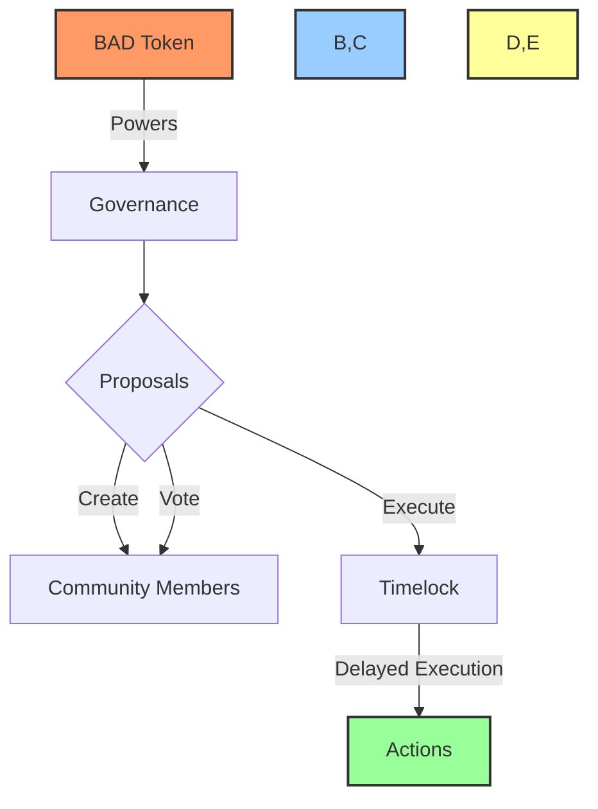
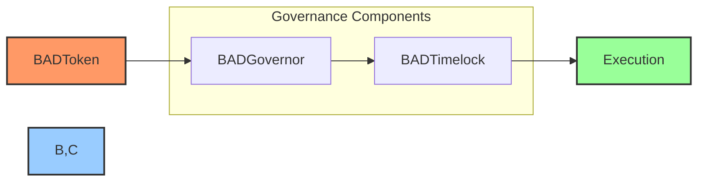

# BAD# 🏛️ BAD DAO Project

## 📋 Table of Contents
- [🔍 Overview](#-overview)
- [🏗️ Architecture](#-architecture)
- [💻 Technology Stack](#-technology-stack)
- [🚀 Getting Started](#-getting-started)
- [📊 Project Status](#-project-status)
- [🧪 Testing](#-testing)
- [📝 Documentation](#-documentation)
- [👥 Contributing](#-contributing)

## 🔍 Overview

BAD DAO is a decentralized autonomous organization built on the Base network. It leverages smart contracts to enable community governance through proposal creation, voting, and execution of approved decisions.



## 🏗️ Architecture

The BAD DAO consists of three core components:

### 🔷 BADToken
- ERC20 token with voting capabilities
- Supports vote delegation
- Snapshot mechanism for governance
- Initial supply: 100 million tokens

### 🔶 BADGovernor
- Manages proposal lifecycle
- Handles voting mechanisms
- Integrates with timelock for security
- Configurable governance parameters

### 🔷 BADTimelock
- Enforces delay before execution
- Provides security against malicious proposals
- Role-based access control



## 💻 Technology Stack

### 🔗 Blockchain
- **Network**: Base (Layer 2 on Ethereum)
- **Testnet**: Base Goerli
- **Smart Contracts**: Solidity 0.8.20
- **Framework**: Hardhat
- **Libraries**: OpenZeppelin 4.9.3

### 🖥️ Frontend
- **Framework**: React 18
- **Web3 Integration**: ethers.js 6.x
- **UI**: Tailwind CSS
- **State Management**: React Context API, Redux

### 🗄️ Backend & Database
- **Database**: PostgreSQL
- **Hosting**: AWS RDS
- **API**: REST API for proposal data
- **Indexing**: Event listeners for on-chain data

## 🚀 Getting Started

### 📋 Prerequisites
- Node.js 16.x or higher
- npm or yarn
- MetaMask or compatible Web3 wallet

### 🔧 Installation

```bash
# Clone the repository
git clone https://github.com/PowerBridge-ai/BAD.git
cd BAD

# Install dependencies
npm install

# Compile contracts
npx hardhat compile

# Run tests
npx hardhat test

# Deploy contracts (to local network)
npx hardhat run scripts/deploy/01_deploy_token.js
npx hardhat run scripts/deploy/02_deploy_timelock.js
npx hardhat run scripts/deploy/03_deploy_governor.js
npx hardhat run scripts/deploy/04_setup_roles.js

# Start frontend
cd frontend
npm install
npm start
```

## 📊 Project Status

Current project completion: 23%

### 📈 Task Progress
- ✅ BADToken implementation and testing
- ✅ Wallet connection in frontend
- ✅ Basic token display UI
- ✅ BADGovernor and BADTimelock contracts
- 🟡 Governance tests (85% complete)
- 🟡 Token transfer UI 
- 🟡 Voting delegation UI
- 🔴 Deployment scripts for Base network
- 🔴 Frontend proposal and voting interfaces
- 🔴 Security audit

## 🧪 Testing

```bash
# Run all tests
npx hardhat test

# Run specific test file
npx hardhat test test/token/BADToken.test.js

# Run tests with coverage report
npx hardhat coverage
```

## 📝 Documentation

Comprehensive documentation is available in the docs directory:

- [📘 Smart Contracts](/docs/contracts/): Detailed explanation of contract functionality
- [🏗️ Architecture](/docs/architecture/): System design and security considerations
- [📚 Guides](/docs/guides/): Deployment and usage instructions
- [🔄 Development](/docs/dev/): Developer notes and technical details

## 👥 Contributing

We welcome contributions to the BAD DAO project! Please follow these steps:

1. Fork the repository
2. Create a feature branch (`git checkout -b feature/amazing-feature`)
3. Commit your changes (`git commit -m 'Add some amazing feature'`)
4. Push to the branch (`git push origin feature/amazing-feature`)
5. Open a Pull Request

## 📄 License

This project is licensed under the MIT License - see the LICENSE file for details.

## 📞 Contact

For questions or support, please reach out to the team at [GitHub](https://github.com/PowerBridge-ai).