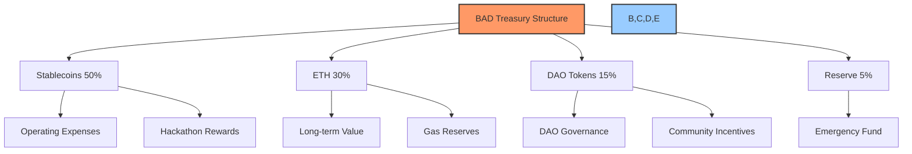
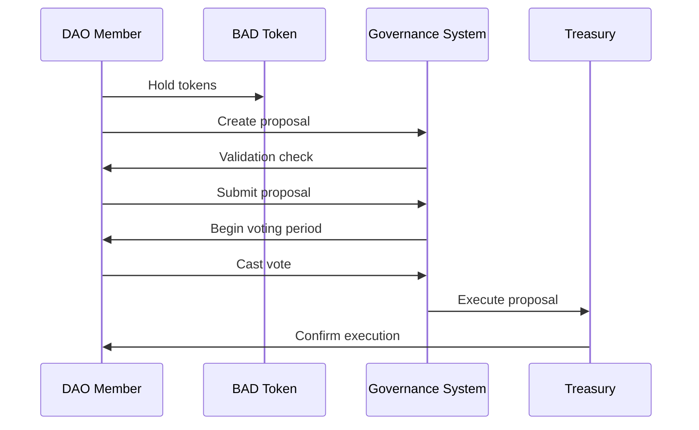

# 🏗️ Build a DAO (BAD) - Aragon Integration Guide

## 📋 Table of Contents
- [🔍 Overview](#overview)
- [🎯 Objectives](#objectives)
- [🏦 Treasury Configuration](#treasury-configuration)
- [🗳️ Voting System Setup](#voting-system-setup)
- [⏱️ 14-Day Implementation Timeline](#14-day-implementation-timeline)
- [🔐 Security Considerations](#security-considerations)
- [🔄 Integration with Revenue Streams](#integration-with-revenue-streams)
- [📈 Scaling Strategy](#scaling-strategy)

## 🔍 Overview

Read file: docs/AI-development-dao-launch-2.0.md

Read file: docs/AI-development-dao-launch-2.0.md

Search files...

Ran tool
The BAD (Build a DAO) DAO is designed to operate as a lean, bootstrap-ready organization for revenue generation and project incubation, focusing on two key AI-driven products: a Grant & Proposal Writing Studio and a Hackathon Discovery platform. Based on the project requirements and Aragon's capabilities, this guide outlines the essential steps to set up your treasury and governance structure.

## 🎯 Objectives

1. Create a tokenized governance platform using Aragon
2. Configure treasury management for bootstrap financing
3. Set up optimal voting mechanisms for decision-making
4. Structure the DAO for the 14-day implementation timeline
5. Integrate with the AI Grant Concierge and Hackathon Discovery systems

## 🏦 Treasury Configuration

Read file: docs/core/hackathon-integration.md
### 🏦 Treasury Setup



#### 1. Initial Treasury Allocation

For the bootstrap phase, configure Aragon's treasury with:

- **🔹 Operating Wallet**: For daily expenses and operations (40% of funds)
  - Primarily stablecoins (USDC/DAI)
  - Minimum 2-month runway based on minimal viable expenses

- **🔹 Growth Wallet**: For funding initial projects (40% of funds)
  - Mix of stablecoins and ETH
  - Allocated for Grant Studio development and initial Hackathon prizes

- **🔹 Treasury Reserve**: For long-term sustainability (20% of funds)
  - ETH and stablecoins
  - Locked for at least 12 months

#### 2. Revenue Streams Integration

Configure smart contracts to automatically allocate incoming revenue:

- **🔹 Grant Success Fees**: 60% to operations, 30% to growth, 10% to reserve
- **🔹 Hackathon Platform Fees**: 50% to operations, 40% to growth, 10% to reserve
- **🔹 Service Revenue**: 70% to operations, 20% to growth, 10% to reserve

#### 3. Token Economics

Token distribution should align with bootstrap needs:

- **🔹 Initial Supply**: 1,000,000 BAD tokens
- **🔹 Distribution**:
  - 40% - Core team (vested over 24 months)
  - 30% - Community (for governance participation)
  - 20% - Treasury (for operations and incentives)
  - 10% - Initial advisors and partners

## 🗳️ Voting System Setup



### 1. Token Configuration

Create a governance token using Aragon's platform with these parameters:

- **Token Name**: BAD Token
- **Token Symbol**: BAD
- **Token Type**: ERC-20 Governance Token
- **Initial Supply**: 1,000,000 BAD

### 2. Voting Parameters

Set up the voting system with these optimal settings for rapid decision-making:

- **🔹 Support Threshold**: 60% (percentage of votes needed for approval)
- **🔹 Minimum Participation**: 15% (percentage of total tokens that must vote)
- **🔹 Voting Duration**: 72 hours maximum (with early execution)
- **🔹 Proposal Creation**: Minimum 1,000 BAD tokens to create proposals
- **🔹 Early Execution**: Enabled (proposals pass as soon as threshold is met)

### 3. Voting Categories

Create specialized voting templates for different proposal types:

- **🔹 Treasury Allocation** (≥75% support, 25% participation)
- **🔹 Grant Approvals** (≥60% support, 15% participation)
- **🔹 Operational Decisions** (≥51% support, 10% participation)
- **🔹 Emergency Actions** (≥80% support, 30% participation, 24-hour voting)

## ⏱️ 14-Day Implementation Timeline

```mermaid
gantt
    title 14-Day BAD DAO Implementation
    dateFormat  YYYY-MM-DD
    section Setup
    Aragon DAO Creation            :a1, day 1, 1d
    Token Distribution             :a2, after a1, 1d
    Treasury Configuration         :a3, after a2, 1d
    section Integration
    AI Grant System Connection     :b1, day 3, 2d
    Hackathon Discovery Setup      :b2, after b1, 2d
    Smart Contract Deployment      :b3, after b2, 2d
    section Operations
    Initial Proposals              :c1, day 8, 1d
    Revenue Generation Start       :c2, after c1, 3d
    Community Onboarding          :c3, after c2, 2d
    section Review
    System Testing                 :d1, day 13, 1d
    Security Audits               :d2, after d1, 1d
```

### Day 1-2: DAO Creation & Setup
- Create Aragon DAO on Ethereum
- Configure token parameters
- Set up initial treasury wallets

### Day 3-7: Systems Integration
- Connect AI Grant Concierge to DAO treasury
- Set up Hackathon Discovery API endpoints
- Deploy smart contracts for revenue allocation

### Day 8-12: Operations Launch
- Submit first funding proposals
- Begin revenue generation activities
- Onboard initial community members

### Day 13-14: Testing & Review
- Complete system testing
- Conduct security audit
- Launch official operations

## 🔐 Security Considerations

### Treasury Security
- Use multi-signature wallets requiring at least 3 of 5 signers
- Implement spending limits per transaction
- Set up treasury alerts for large transactions

### Smart Contract Safety
- Use time locks for major treasury changes (24-hour minimum)
- Implement gradual token unlocking mechanism
- Create circuit breakers for emergency situations

### Access Control
- Implement role-based access control (RBAC)
- Set up separate admin keys for each major system component
- Establish an emergency multi-sig for critical situations

## 🔄 Integration with Revenue Streams

### AI Grant Concierge Integration
- Configure Aragon to accept proposal submissions from the AI system
- Set up automated treasury allocations for approved grants
- Implement tracking for success fees from funded proposals

### Hackathon Discovery Integration
- Create a dedicated Aragon vault for hackathon prize funds
- Implement voting templates for hackathon project approval
- Connect event system to DAO notifications for opportunity alerts

## 📈 Scaling Strategy

As the DAO grows beyond the bootstrap phase:

1. Transition from token-based to hybrid governance (reputation + tokens)
2. Implement specialized working groups with delegated autonomy
3. Create subDAOs for each major product line
4. Scale governance model to support increased participation

## 🚀 Next Steps

1. Create the Aragon DAO following the configuration in this guide
2. Configure token distribution to core team and initial community
3. Set up the first funding proposals for the AI Grant Concierge
4. Begin active solicitation of hackathon opportunities
