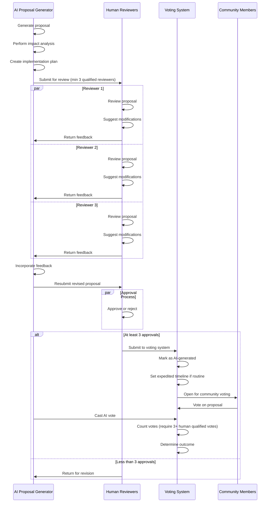
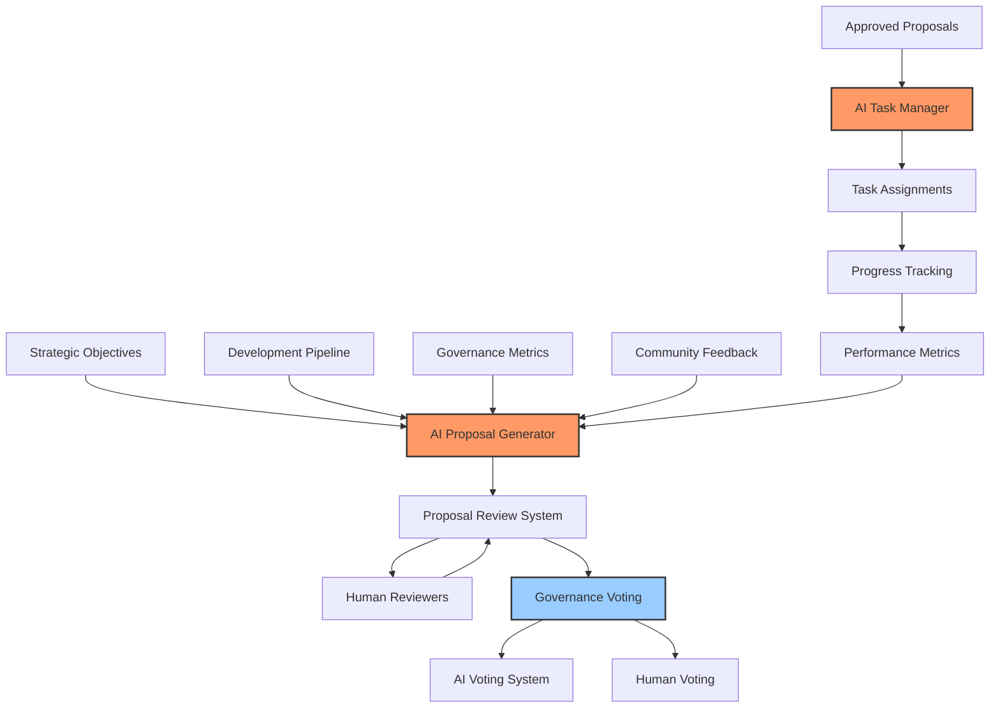

# BAD DAO Development Notes

## Technical Specifications

### Network Information
- **Primary Network**: Base
- **Testnet**: Base Goerli
- **Block Explorer**: [Basescan](https://basescan.org)
- **Gas Token**: ETH (Layer 2 cost is ~0.1-5% of Ethereum mainnet)
- **Deployment Cost**: <$10 for token and governance suite

### Development Environment
- **Solidity Version**: 0.8.20
- **Framework**: Hardhat
- **Testing Framework**: Chai/Mocha
- **OpenZeppelin Version**: 4.9.3
- **Node Version**: 16.x
- **Frontend**: React 18
- **Web3 Integration**: ethers.js 6.x
- **UI Framework**: Tailwind CSS

## Smart Contract Architecture

### BAD Token
```solidity
// SPDX-License-Identifier: MIT
pragma solidity ^0.8.20;

import "@openzeppelin/contracts/token/ERC20/extensions/ERC20Votes.sol";
import "@openzeppelin/contracts/access/Ownable.sol";

contract BADToken is ERC20Votes, Ownable {
    // Token implementation with governance capabilities
    // Includes snapshot functionality for voting
    // Allows delegation for governance power
    // Manages token supply and distribution
}
```

Key Features:
- ERC20 with voting capabilities
- Snapshot mechanism for vote counting
- Delegation of voting power
- Initial supply: 100 million tokens
- Decimal places: 18
- Token symbol: BAD

### Governance System

#### BADGovernor
```solidity
// SPDX-License-Identifier: MIT
pragma solidity ^0.8.20;

import "@openzeppelin/contracts/governance/Governor.sol";
import "@openzeppelin/contracts/governance/extensions/GovernorSettings.sol";
import "@openzeppelin/contracts/governance/extensions/GovernorCountingSimple.sol";
import "@openzeppelin/contracts/governance/extensions/GovernorVotes.sol";
import "@openzeppelin/contracts/governance/extensions/GovernorTimelockControl.sol";

contract BADGovernor is 
    Governor, 
    GovernorSettings, 
    GovernorCountingSimple, 
    GovernorVotes, 
    GovernorTimelockControl 
{
    // Governance implementation
    // Manages proposals, voting, and execution
    // Integrates with timelock for delayed execution
}
```

#### TimelockController
```solidity
// SPDX-License-Identifier: MIT
pragma solidity ^0.8.20;

import "@openzeppelin/contracts/governance/TimelockController.sol";

// Standard OpenZeppelin TimelockController with custom configuration
// Enforces delay period before execution
// Secures governance system against sudden changes
```

### Governance Parameters
- Voting delay: 1 day (7200 blocks)
- Voting period: 5 days (36000 blocks)
- Proposal threshold: 1% of total supply
- Quorum: 4% of total supply
- Timelock delay: 2 days (14400 blocks)

### AI Governance System

#### ProposalGeneratorAI
```solidity
// SPDX-License-Identifier: MIT
pragma solidity ^0.8.20;

import "@openzeppelin/contracts/access/AccessControl.sol";
import "@openzeppelin/contracts/governance/utils/IVotes.sol";

interface IBADGovernor {
    function propose(
        address[] memory targets,
        uint256[] memory values,
        bytes[] memory calldatas,
        string memory description
    ) external returns (uint256);
}

contract ProposalGeneratorAI is AccessControl {
    bytes32 public constant AI_PROPOSER_ROLE = keccak256("AI_PROPOSER_ROLE");
    bytes32 public constant HUMAN_REVIEWER_ROLE = keccak256("HUMAN_REVIEWER_ROLE");
    
    IBADGovernor public governor;
    IVotes public token;
    
    uint256 public proposalsPerDay = 2;
    uint256 public requiredHumanApprovals = 3;
    
    mapping(uint256 => bool) public isAIGeneratedProposal;
    mapping(uint256 => mapping(address => bool)) public humanApprovals;
    mapping(uint256 => uint256) public proposalApprovalCount;
    
    event AIProposalCreated(uint256 indexed proposalId, string description);
    event HumanApprovalSubmitted(uint256 indexed proposalId, address indexed reviewer);
    event ProposalSubmittedToGovernance(uint256 indexed proposalId);
    
    constructor(address _governor, address _token) {
        governor = IBADGovernor(_governor);
        token = IVotes(_token);
        _setupRole(DEFAULT_ADMIN_ROLE, msg.sender);
    }
    
    function generateProposal(
        address[] memory targets,
        uint256[] memory values,
        bytes[] memory calldatas,
        string memory description,
        string memory rationale,
        string memory impactAnalysis
    ) external onlyRole(AI_PROPOSER_ROLE) returns (uint256) {
        // Implementation for AI proposal generation
        // Stores proposal details and metadata
        // Requires human approvals before submission
    }
    
    function approveProposal(uint256 proposalId) external onlyRole(HUMAN_REVIEWER_ROLE) {
        // Implementation for human approval process
        // Tracks approval count
        // Submits to governance when threshold reached
    }
    
    function submitToGovernance(uint256 proposalId) internal {
        // Implementation for submitting approved proposals
        // Registers as AI-generated in governance system
    }
}
```

#### AIVotingSystem
```solidity
// SPDX-License-Identifier: MIT
pragma solidity ^0.8.20;

import "@openzeppelin/contracts/access/AccessControl.sol";
import "@openzeppelin/contracts/governance/utils/IVotes.sol";

interface IGovernorWithAI {
    function castVote(uint256 proposalId, uint8 support) external returns (uint256);
    function castVoteWithReason(uint256 proposalId, uint8 support, string calldata reason) external returns (uint256);
}

contract AIVotingSystem is AccessControl {
    bytes32 public constant AI_VOTER_ROLE = keccak256("AI_VOTER_ROLE");
    bytes32 public constant GOVERNANCE_MANAGER_ROLE = keccak256("GOVERNANCE_MANAGER_ROLE");
    
    IGovernorWithAI public governor;
    IVotes public token;
    
    uint256 public aiVotingPowerPercentage = 10; // 10% of total
    mapping(uint256 => bool) public aiHasVoted;
    mapping(uint256 => string) public aiVoteRationales;
    
    event AIVoteCast(uint256 indexed proposalId, uint8 support, string rationale);
    event AIVotingPowerUpdated(uint256 newPercentage);
    
    constructor(address _governor, address _token) {
        governor = IGovernorWithAI(_governor);
        token = IVotes(_token);
        _setupRole(DEFAULT_ADMIN_ROLE, msg.sender);
    }
    
    function castAIVote(uint256 proposalId, uint8 support, string calldata rationale) external onlyRole(AI_VOTER_ROLE) {
        // Implementation for AI voting
        // Records vote and rationale
        // Enforces voting power limitations
    }
    
    function getAIVotingPower() public view returns (uint256) {
        // Calculate AI voting power based on percentage
        // of total token supply
    }
    
    function updateAIVotingPower(uint256 newPercentage) external onlyRole(GOVERNANCE_MANAGER_ROLE) {
        // Update AI voting power percentage
        // Maximum 10%
    }
}
```

#### TaskManagementSystem
```solidity
// SPDX-License-Identifier: MIT
pragma solidity ^0.8.20;

import "@openzeppelin/contracts/access/AccessControl.sol";

contract TaskManagementSystem is AccessControl {
    bytes32 public constant TASK_MANAGER_ROLE = keccak256("TASK_MANAGER_ROLE");
    bytes32 public constant TASK_ASSIGNEE_ROLE = keccak256("TASK_ASSIGNEE_ROLE");
    
    struct Task {
        uint256 id;
        string description;
        address assignee;
        uint256 deadline;
        bool completed;
        uint256 parentTaskId; // 0 if top-level task
        uint256[] subtaskIds;
        uint256 proposalId; // If generated from proposal
    }
    
    mapping(uint256 => Task) public tasks;
    uint256 public nextTaskId = 1;
    
    event TaskCreated(uint256 indexed taskId, string description, address assignee);
    event TaskCompleted(uint256 indexed taskId);
    event SubtaskAdded(uint256 indexed parentTaskId, uint256 indexed subtaskId);
    
    constructor() {
        _setupRole(DEFAULT_ADMIN_ROLE, msg.sender);
    }
    
    function createTask(
        string calldata description,
        address assignee,
        uint256 deadline,
        uint256 parentTaskId,
        uint256 proposalId
    ) external onlyRole(TASK_MANAGER_ROLE) returns (uint256) {
        // Implementation for task creation
        // Support for subtasks and proposal linking
    }
    
    function completeTask(uint256 taskId) external {
        // Implementation for task completion
        // Validation of assignee or admin role
    }
    
    function generateTasksFromProposal(
        uint256 proposalId,
        string calldata proposalDescription
    ) external onlyRole(TASK_MANAGER_ROLE) {
        // Automatically generate tasks from proposal content
        // Create task hierarchy based on proposal structure
    }
}
```

## Database Schema

### Proposal Metadata
```sql
CREATE TABLE proposals (
    proposal_id VARCHAR(66) PRIMARY KEY,
    title VARCHAR(100) NOT NULL,
    description TEXT NOT NULL,
    proposer VARCHAR(42) NOT NULL,
    start_block INT NOT NULL,
    end_block INT NOT NULL,
    status VARCHAR(20) NOT NULL,
    created_at TIMESTAMP DEFAULT CURRENT_TIMESTAMP
);

CREATE TABLE proposal_actions (
    id SERIAL PRIMARY KEY,
    proposal_id VARCHAR(66) REFERENCES proposals(proposal_id),
    target_address VARCHAR(42) NOT NULL,
    value NUMERIC(78,0) DEFAULT 0,
    signature VARCHAR(100),
    calldata BYTEA,
    execution_order INT NOT NULL
);

CREATE TABLE votes (
    id SERIAL PRIMARY KEY,
    proposal_id VARCHAR(66) REFERENCES proposals(proposal_id),
    voter VARCHAR(42) NOT NULL,
    support SMALLINT NOT NULL,
    weight NUMERIC(78,0) NOT NULL,
    reason TEXT,
    voted_at TIMESTAMP DEFAULT CURRENT_TIMESTAMP,
    UNIQUE(proposal_id, voter)
);

### AI Governance Tables
```sql
CREATE TABLE ai_proposals (
    id SERIAL PRIMARY KEY,
    proposal_id VARCHAR(66) NOT NULL,
    generation_timestamp TIMESTAMP DEFAULT CURRENT_TIMESTAMP,
    rationale TEXT NOT NULL,
    impact_analysis TEXT NOT NULL,
    risk_assessment TEXT NOT NULL,
    implementation_plan TEXT NOT NULL,
    resource_requirements TEXT NOT NULL,
    historical_precedents TEXT,
    success_metrics TEXT NOT NULL,
    status VARCHAR(20) NOT NULL DEFAULT 'pending_approval',
    FOREIGN KEY (proposal_id) REFERENCES proposals(proposal_id)
);

CREATE TABLE ai_proposal_approvals (
    id SERIAL PRIMARY KEY,
    proposal_id VARCHAR(66) NOT NULL,
    reviewer VARCHAR(42) NOT NULL,
    approved BOOLEAN NOT NULL,
    approval_timestamp TIMESTAMP DEFAULT CURRENT_TIMESTAMP,
    comments TEXT,
    FOREIGN KEY (proposal_id) REFERENCES proposals(proposal_id),
    UNIQUE(proposal_id, reviewer)
);

CREATE TABLE ai_votes (
    id SERIAL PRIMARY KEY,
    proposal_id VARCHAR(66) NOT NULL,
    support SMALLINT NOT NULL,
    voting_power NUMERIC(78,0) NOT NULL,
    rationale TEXT NOT NULL,
    vote_timestamp TIMESTAMP DEFAULT CURRENT_TIMESTAMP,
    FOREIGN KEY (proposal_id) REFERENCES proposals(proposal_id)
);

CREATE TABLE tasks (
    id SERIAL PRIMARY KEY,
    description TEXT NOT NULL,
    assignee VARCHAR(42),
    deadline TIMESTAMP,
    completed BOOLEAN DEFAULT false,
    completion_timestamp TIMESTAMP,
    parent_task_id INTEGER REFERENCES tasks(id),
    proposal_id VARCHAR(66) REFERENCES proposals(proposal_id),
    created_by VARCHAR(20) NOT NULL, -- 'human' or 'ai'
    priority INTEGER DEFAULT 3, -- 1 (highest) to 5 (lowest)
    created_at TIMESTAMP DEFAULT CURRENT_TIMESTAMP
);

CREATE TABLE task_dependencies (
    id SERIAL PRIMARY KEY,
    dependent_task_id INTEGER NOT NULL REFERENCES tasks(id),
    dependency_task_id INTEGER NOT NULL REFERENCES tasks(id),
    UNIQUE(dependent_task_id, dependency_task_id)
);
```

## Frontend Architecture

### Component Structure
```
/src
  /components
    /common
      Button.jsx
      Card.jsx
      Modal.jsx
      Spinner.jsx
    /layout
      Header.jsx
      Footer.jsx
      Sidebar.jsx
    /token
      TokenBalance.jsx
      TransferForm.jsx
      DelegationForm.jsx
    /governance
      ProposalList.jsx
      ProposalCard.jsx
      ProposalDetail.jsx
      VotingInterface.jsx
      ProposalForm.jsx
    /wallet
      WalletConnect.jsx
      NetworkSwitch.jsx
    /ai-governance
      AIProposalGenerator.jsx
      AIProposalReview.jsx
      AIProposalList.jsx
      AIVoteDisplay.jsx
      AIPerformanceMetrics.jsx
      TaskManagement.jsx
      TaskList.jsx
      TaskDetail.jsx
      TaskAssignment.jsx
      TaskDependencyGraph.jsx
```

### State Management
- React Context API for global state
- Redux for complex state management
- Web3 provider context for blockchain interaction

### API Integration
```javascript
// Web3 Service for contract interaction
export class Web3Service {
  constructor(provider) {
    this.provider = provider;
    this.signer = provider.getSigner();
    this.tokenContract = new ethers.Contract(
      TOKEN_ADDRESS, 
      TOKEN_ABI, 
      this.signer
    );
    this.governorContract = new ethers.Contract(
      GOVERNOR_ADDRESS,
      GOVERNOR_ABI,
      this.signer
    );
  }
  
  // Token methods
  async getBalance(address) {...}
  async transfer(to, amount) {...}
  async delegate(delegatee) {...}
  
  // Governance methods
  async getProposals() {...}
  async createProposal(targets, values, calldatas, description) {...}
  async castVote(proposalId, support) {...}
  async execute(proposalId) {...}
}
```

## Performance Considerations

### Smart Contract Gas Optimization
- Minimize storage usage
- Batch operations where possible
- Use calldata instead of memory for function parameters
- Remove unnecessary modifiers
- Use packed storage slots

### Frontend Performance
- Implement code splitting
- Use React.memo for expensive components
- Lazy load components
- Implement virtual scrolling for long lists
- Cache blockchain data locally

## Security Measures

### Smart Contract Security
- Follow OpenZeppelin best practices
- Implement access control
- Use reentrancy guards
- Add emergency pause functionality
- Limit token minting capabilities
- Implement proper owner management

### Frontend Security
- Implement proper input validation
- Use secure wallet connection methods
- Handle transaction errors gracefully
- Implement proper error boundaries
- Validate transaction parameters

## Testing Strategy

### Smart Contract Testing
- Unit tests for all contracts
- Integration tests for contract interactions
- Fuzz testing for edge cases
- Gas optimization tests
- Slither and Mythril static analysis

### Frontend Testing
- Component unit tests with React Testing Library
- Integration tests with Cypress
- Mock blockchain provider for testing
- End-to-end tests for critical flows
- Contract mocking for frontend testing

## Deployment Workflow

### Contract Deployment
1. Deploy BADToken contract
2. Deploy TimelockController
3. Deploy BADGovernor with token and timelock addresses
4. Set up roles on TimelockController
5. Verify contracts on Basescan
6. Test governance flow end-to-end

```bash
# Example deployment commands
npx hardhat run scripts/deploy.js --network base_goerli
npx hardhat verify --network base_goerli <CONTRACT_ADDRESS> <CONSTRUCTOR_ARGS>
```

### Frontend Deployment
1. Build React application
2. Deploy to IPFS or Vercel
3. Set up CI/CD pipeline
4. Configure environment variables
5. Test network connectivity

```bash
# Frontend deployment
npm run build
npx vercel deploy --prod
```

## Technical Decisions Log

### 2023-08-15
- Selected Base network due to lower gas costs and Ethereum compatibility
- Chose OpenZeppelin contracts for governance to ensure security and standardization
- Decided to use ERC20Votes extension for token to enable on-chain governance
- Selected Hardhat over Truffle for development due to better plugin ecosystem

### 2023-08-18
- Implemented snapshot-based voting instead of traditional balance-based voting
- Decided on 1% proposal threshold to balance accessibility and spam prevention
- Chose 5-day voting period to give community sufficient time to participate
- Implemented 2-day timelock to provide security without excessive delays

## Configuration Details

### Hardhat Configuration
```javascript
module.exports = {
  solidity: {
    version: "0.8.20",
    settings: {
      optimizer: {
        enabled: true,
        runs: 200
      }
    }
  },
  networks: {
    hardhat: {},
    base_goerli: {
      url: "https://goerli.base.org",
      accounts: [process.env.PRIVATE_KEY],
      chainId: 84531
    },
    base: {
      url: "https://mainnet.base.org",
      accounts: [process.env.PRIVATE_KEY],
      chainId: 8453
    }
  },
  etherscan: {
    apiKey: {
      base: process.env.ETHERSCAN_API_KEY,
      baseGoerli: process.env.ETHERSCAN_API_KEY
    },
    customChains: [
      {
        network: "base",
        chainId: 8453,
        urls: {
          apiURL: "https://api.basescan.org/api",
          browserURL: "https://basescan.org"
        }
      },
      {
        network: "baseGoerli",
        chainId: 84531,
        urls: {
          apiURL: "https://api-goerli.basescan.org/api",
          browserURL: "https://goerli.basescan.org"
        }
      }
    ]
  }
};
```

### Frontend Configuration
```javascript
// config.js
export const config = {
  networks: {
    base: {
      chainId: "0x2105", // 8453 in hex
      chainName: "Base",
      nativeCurrency: {
        name: "Ethereum",
        symbol: "ETH",
        decimals: 18
      },
      rpcUrls: ["https://mainnet.base.org"],
      blockExplorerUrls: ["https://basescan.org"]
    },
    baseGoerli: {
      chainId: "0x14a33", // 84531 in hex
      chainName: "Base Goerli",
      nativeCurrency: {
        name: "Ethereum",
        symbol: "ETH",
        decimals: 18
      },
      rpcUrls: ["https://goerli.base.org"],
      blockExplorerUrls: ["https://goerli.basescan.org"]
    }
  },
  contracts: {
    mainnet: {
      tokenAddress: "0x...",
      governorAddress: "0x...",
      timelockAddress: "0x..."
    },
    testnet: {
      tokenAddress: "0x...",
      governorAddress: "0x...",
      timelockAddress: "0x..."
    }
  }
};
```

## Development Commands

### Smart Contract Development
```bash
# Installation
npm install

# Compile contracts
npx hardhat compile

# Run tests
npx hardhat test

# Deploy contracts
npx hardhat run scripts/deploy.js --network base_goerli

# Verify contracts
npx hardhat verify --network base_goerli <CONTRACT_ADDRESS> <CONSTRUCTOR_ARGS>

# Run local node
npx hardhat node

# Deploy to local node
npx hardhat run scripts/deploy.js --network localhost
```

### Frontend Development
```bash
# Installation
cd frontend
npm install

# Start development server
npm run dev

# Build for production
npm run build

# Run tests
npm test

# Run linting
npm run lint

# Deploy to Vercel
npx vercel deploy
```

## Database Commands
```bash
# Connect to database (using PGPASSWORD for security)
PGPASSWORD=ATI123#4567 psql -h localhost -U postgres -d bad_dao

# Create tables
PGPASSWORD=ATI123#4567 psql -h localhost -U postgres -d bad_dao -f scripts/schema.sql

# Backup database
PGPASSWORD=ATI123#4567 pg_dump -h localhost -U postgres -d bad_dao > backup.sql

# Restore database
PGPASSWORD=ATI123#4567 psql -h localhost -U postgres -d bad_dao < backup.sql
```

## Ongoing Development Notes

### Known Issues
- Token delegation UI needs improvement for better UX
- Governance proposal descriptions need markdown support
- Transaction confirmation modals need better error handling
- Contract verification script needs enhancement for complex contracts

### Planned Improvements
- Implement subgraph for efficient data indexing
- Add multiple language support
- Implement dark mode
- Add transaction history
- Enhance mobile responsiveness
- Add proposal execution simulation

# Technical Implementation Notes

## AI Governance Integration

### AI Proposal Generator Technical Implementation

```javascript
// AI Proposal Generator Architecture
class AIProposalGenerator {
  constructor(
    strategicObjectives,
    developmentPipeline,
    governanceMetrics,
    communityFeedback
  ) {
    this.strategicObjectives = strategicObjectives;
    this.developmentPipeline = developmentPipeline;
    this.governanceMetrics = governanceMetrics;
    this.communityFeedback = communityFeedback;
    this.proposalQueue = [];
    this.minimumDailyProposals = 2;
  }

  async generateDailyProposals() {
    // Analyze current state
    const currentState = await this.analyzeCurrentState();
    
    // Identify gaps and opportunities
    const opportunities = this.identifyOpportunities(currentState);
    
    // Generate proposals based on prioritized opportunities
    const generatedProposals = opportunities
      .sort((a, b) => b.impact - a.impact)
      .slice(0, Math.max(this.minimumDailyProposals, opportunities.length))
      .map(opportunity => this.createProposal(opportunity));
    
    // Route for human review
    return this.routeForReview(generatedProposals);
  }

  async analyzeCurrentState() {
    // Implementation details for state analysis
  }

  identifyOpportunities(currentState) {
    // Algorithm to identify improvement opportunities
  }

  createProposal(opportunity) {
    return {
      title: `Proposal: ${opportunity.title}`,
      description: opportunity.description,
      impactAnalysis: this.generateImpactAnalysis(opportunity),
      implementationPlan: this.generateImplementationPlan(opportunity),
      resourceRequirements: this.estimateResources(opportunity),
      alignmentScore: this.calculateAlignmentScore(opportunity),
      riskAssessment: this.assessRisks(opportunity),
      type: opportunity.type,
      generatedBy: 'AI Proposal Generator v1.0',
      timestamp: Date.now(),
      status: 'pending_review'
    };
  }

  routeForReview(proposals) {
    // Route proposals to qualified reviewers based on proposal type
  }
}
```

### AI Voting System Integration

```solidity
// SPDX-License-Identifier: MIT
pragma solidity ^0.8.0;

/**
 * @title AIGovernanceVoting
 * @dev Manages AI voting rights within the governance system
 */
contract AIGovernanceVoting {
    address public aiAgentRegistry;
    uint256 public aiVotingPowerCap = 10; // 10% of total voting power
    
    mapping(address => bool) public registeredAIAgents;
    mapping(uint256 => mapping(address => bool)) public aiVotes;
    mapping(uint256 => bool) public aiGeneratedProposals;
    mapping(uint256 => uint256) public humanVoteCount;
    
    event AIVoteCast(address indexed aiAgent, uint256 indexed proposalId, bool support);
    event AIProposalRegistered(uint256 indexed proposalId, address indexed aiGenerator);
    event HumanVoteRegistered(uint256 indexed proposalId, address indexed voter);
    
    modifier onlyRegisteredAI() {
        require(registeredAIAgents[msg.sender], "Only registered AI agents can perform this action");
        _;
    }
    
    modifier onlyAIRegistry() {
        require(msg.sender == aiAgentRegistry, "Only AI registry can perform this action");
        _;
    }
    
    /**
     * @dev Register an AI-generated proposal
     * @param proposalId The ID of the proposal
     */
    function registerAIProposal(uint256 proposalId) external onlyRegisteredAI {
        aiGeneratedProposals[proposalId] = true;
        emit AIProposalRegistered(proposalId, msg.sender);
    }
    
    /**
     * @dev Cast an AI vote on a proposal
     * @param proposalId The ID of the proposal
     * @param support Whether the AI supports the proposal
     */
    function castAIVote(uint256 proposalId, bool support) external onlyRegisteredAI {
        aiVotes[proposalId][msg.sender] = support;
        emit AIVoteCast(msg.sender, proposalId, support);
    }
    
    /**
     * @dev Register a human vote on a proposal
     * @param proposalId The ID of the proposal
     */
    function registerHumanVote(uint256 proposalId) external {
        // In practice, this would be called by the main voting contract after verification
        humanVoteCount[proposalId]++;
        emit HumanVoteRegistered(proposalId, msg.sender);
    }
    
    /**
     * @dev Check if an AI-generated proposal has enough human votes to pass
     * @param proposalId The ID of the proposal
     * @return Whether the proposal has enough human votes
     */
    function hasRequiredHumanVotes(uint256 proposalId) external view returns (bool) {
        if (!aiGeneratedProposals[proposalId]) {
            return true; // Not an AI proposal, so this check doesn't apply
        }
        
        return humanVoteCount[proposalId] >= 3; // Require at least 3 human votes
    }
}
```

### AI Task Management System

```typescript
// Task Management System Architecture

interface Task {
  id: string;
  title: string;
  description: string;
  status: 'pending' | 'assigned' | 'in_progress' | 'blocked' | 'completed' | 'verified';
  assignee?: string;
  requiredRole: string;
  requiredSkills: string[];
  estimatedEffort: number; // in hours
  priority: 'low' | 'medium' | 'high' | 'critical';
  createdBy: string;
  createdAt: number;
  dependencies: string[]; // IDs of dependent tasks
  subtasks: Task[];
  parentTask?: string;
  deadline?: number;
  objective: string; // ID of the related strategic objective
}

class AITaskManager {
  private tasks: Map<string, Task>;
  private contributors: Map<string, Contributor>;
  private objectives: Map<string, Objective>;
  
  constructor() {
    this.tasks = new Map();
    this.contributors = new Map();
    this.objectives = new Map();
  }
  
  public createTaskHierarchy(objective: Objective): Task[] {
    // Algorithm to break down objective into hierarchical tasks
    const mainTasks: Task[] = [];
    
    // Analyze objective and create main tasks
    const taskCategories = this.analyzeObjective(objective);
    
    for (const category of taskCategories) {
      const mainTask = this.createTask({
        title: `${category.name} for ${objective.title}`,
        description: category.description,
        requiredRole: category.primaryRole,
        requiredSkills: category.primarySkills,
        priority: this.determinePriority(category, objective),
        objective: objective.id
      });
      
      // Generate subtasks
      mainTask.subtasks = this.generateSubtasks(mainTask, category);
      
      // Set dependencies between subtasks
      this.setDependencies(mainTask.subtasks);
      
      mainTasks.push(mainTask);
    }
    
    // Set dependencies between main tasks
    this.setDependencies(mainTasks);
    
    return mainTasks;
  }
  
  private generateSubtasks(parentTask: Task, category: TaskCategory): Task[] {
    // Break down main task into subtasks
  }
  
  private analyzeObjective(objective: Objective): TaskCategory[] {
    // Analyze objective to determine task categories
  }
  
  private setDependencies(tasks: Task[]): void {
    // Determine dependencies between tasks
  }
  
  public assignTasks(): void {
    // Algorithm to assign tasks to qualified contributors
  }
  
  public trackProgress(): TaskProgressReport {
    // Generate progress report for all tasks
  }
  
  public identifyBlockers(): BlockerReport {
    // Identify blocked tasks and reasons
  }
}
```

## AI Proposal Review Process



## Integration Architecture



## Technical Requirements

1. **AI Proposal Generation**
   - Integration with strategic objectives database
   - Access to development pipeline metrics
   - Natural language generation capabilities
   - Anomaly detection for governance patterns
   - Impact analysis framework

2. **AI Voting Implementation**
   - On-chain vote recording
   - Vote power limitation enforcement
   - Human vote validation
   - Secure AI agent authentication
   - Integration with main governance contracts

3. **Task Management System**
   - Task breakdown algorithms
   - Resource estimation capabilities
   - Skills-based assignment logic
   - Progress tracking with automation
   - Blocker detection and resolution suggestions

## Development Roadmap

1. **Phase 1: Core System Implementation**
   - Design AI proposal generator architecture
   - Implement human review process
   - Create basic task management system
   - Develop AI voting rights management

2. **Phase 2: Integration & Testing**
   - Integrate systems with existing governance
   - Develop monitoring and analytics
   - Create testing framework with simulated governance
   - Implement security auditing mechanisms

3. **Phase 3: Deployment & Refinement**
   - Deploy with limited capabilities
   - Gather performance metrics
   - Implement feedback loops
   - Gradual capability expansion based on performance 

## API Endpoints

### AI Governance API
```
// AI Proposal Endpoints
GET    /api/ai/proposals               # List all AI-generated proposals
POST   /api/ai/proposals               # Create new AI proposal
GET    /api/ai/proposals/:id           # Get AI proposal details
POST   /api/ai/proposals/:id/approve   # Approve AI proposal
GET    /api/ai/proposals/metrics       # Get AI proposal performance metrics
GET    /api/ai/proposals/daily         # Get today's AI-generated proposals

// AI Voting Endpoints
POST   /api/ai/vote                    # Cast AI vote
GET    /api/ai/vote/:proposalId        # Get AI vote for proposal
GET    /api/ai/voting-power            # Get current AI voting power

// Task Management Endpoints
GET    /api/tasks                      # List all tasks
POST   /api/tasks                      # Create new task
GET    /api/tasks/:id                  # Get task details
PUT    /api/tasks/:id                  # Update task
POST   /api/tasks/:id/complete         # Mark task as complete
GET    /api/tasks/proposal/:proposalId # Get tasks for proposal
POST   /api/tasks/generate             # Generate tasks from proposal
GET    /api/tasks/dependencies/:id     # Get task dependencies
``` 