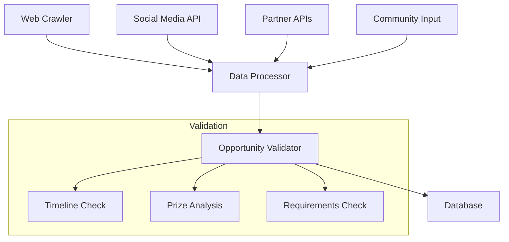
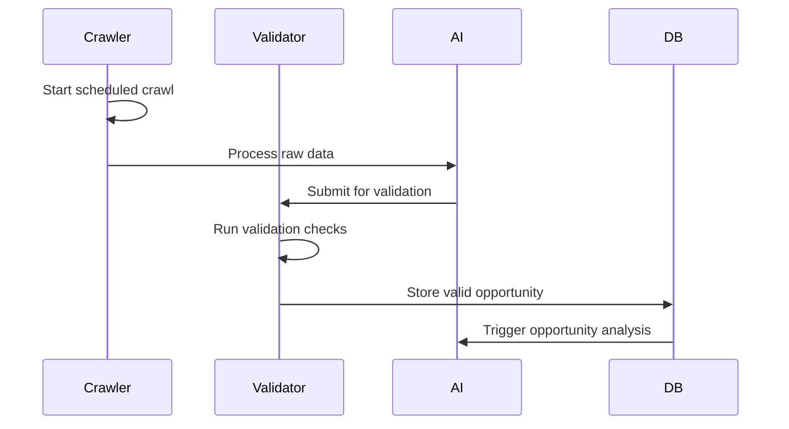
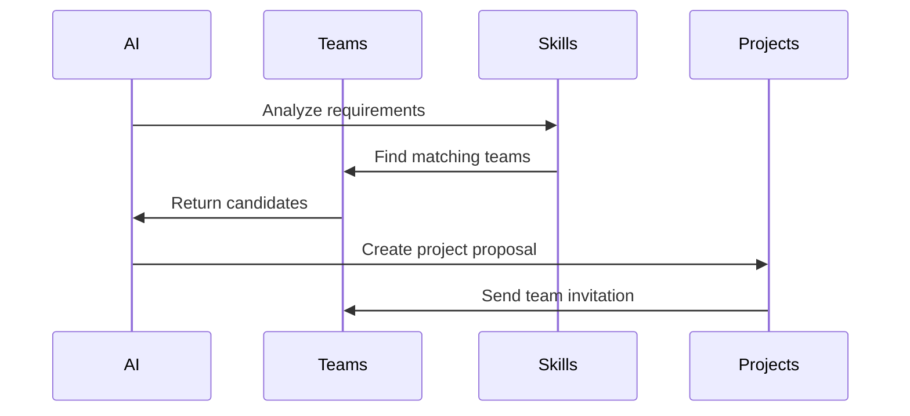

# Hackathon Integration System

## Overview
The hackathon integration system is an AI-driven platform component that autonomously discovers, evaluates, and manages hackathon opportunities within a 14-day window for both participation and payout periods.

## System Architecture

### 1. Discovery Engine


## Core Components

### 1. Web Crawler Service
```typescript
interface CrawlerConfig {
    sources: {
        url: string;
        type: 'devpost' | 'gitcoin' | 'custom';
        selectors: {
            title: string;
            description: string;
            prize: string;
            deadline: string;
            requirements: string;
        };
    }[];
    schedule: {
        frequency: number; // in minutes
        maxConcurrent: number;
    };
}

class HackathonCrawler {
    private config: CrawlerConfig;
    private queue: Queue<CrawlJob>;
    
    async crawl(): Promise<HackathonData[]> {
        // Implementation
    }
    
    private async processPage(url: string): Promise<HackathonData> {
        // Implementation
    }
}
```

### 2. Opportunity Validator
```typescript
interface ValidationCriteria {
    minPrize: number;
    maxTimeframe: number;
    requiredTech: string[];
    teamSize: {
        min: number;
        max: number;
    };
}

class OpportunityValidator {
    private criteria: ValidationCriteria;
    
    async validate(
        opportunity: HackathonData
    ): Promise<ValidationResult> {
        const checks = await Promise.all([
            this.validateTimeframe(opportunity),
            this.validatePrize(opportunity),
            this.validateRequirements(opportunity),
            this.validateFeasibility(opportunity)
        ]);
        
        return this.computeValidationResult(checks);
    }
}
```

### 3. Project Management System
```typescript
interface ProjectTemplate {
    name: string;
    description: string;
    timeline: {
        planning: number;
        development: number;
        testing: number;
        submission: number;
    };
    resources: {
        team: TeamRequirement[];
        technical: TechRequirement[];
        infrastructure: InfraRequirement[];
    };
}

class ProjectManager {
    async createFromHackathon(
        hackathon: HackathonData,
        template: ProjectTemplate
    ): Promise<Project> {
        // Implementation
    }
    
    async trackProgress(
        project: Project
    ): Promise<ProjectStatus> {
        // Implementation
    }
}
```

## Workflow Sequences

### 1. Discovery Process


### 2. Team Matching


## Integration Points

### 1. API Endpoints
```typescript
// Hackathon routes
router.get('/api/hackathons', async (req, res) => {
    const filters = req.query;
    const opportunities = await HackathonService.find(filters);
    res.json(opportunities);
});

router.post('/api/hackathons/validate', async (req, res) => {
    const { opportunity } = req.body;
    const result = await ValidationService.validate(opportunity);
    res.json(result);
});
```

### 2. Event System
```typescript
interface HackathonEvents {
    'hackathon.discovered': HackathonData;
    'hackathon.validated': ValidationResult;
    'hackathon.teamMatched': TeamMatch;
    'hackathon.projectCreated': Project;
    'hackathon.submitted': Submission;
}

class EventEmitter<T> {
    private handlers: Map<keyof T, Function[]>;
    
    emit<K extends keyof T>(event: K, data: T[K]): void {
        // Implementation
    }
    
    on<K extends keyof T>(event: K, handler: (data: T[K]) => void): void {
        // Implementation
    }
}
```

## Data Models

### 1. Hackathon Schema
```typescript
interface Hackathon {
    id: string;
    source: {
        platform: string;
        url: string;
        discoveredAt: Date;
    };
    details: {
        title: string;
        description: string;
        prize: {
            amount: number;
            currency: string;
            distribution: PrizeDistribution[];
        };
        timeline: {
            start: Date;
            submission: Date;
            judging: Date;
            results: Date;
        };
    };
    requirements: {
        technical: string[];
        team: TeamRequirement[];
        submission: SubmissionRequirement[];
    };
    validation: {
        status: ValidationStatus;
        score: number;
        checks: ValidationCheck[];
        updatedAt: Date;
    };
}
```

### 2. Project Schema
```typescript
interface HackathonProject {
    id: string;
    hackathon: string;
    team: {
        id: string;
        members: TeamMember[];
        roles: TeamRole[];
    };
    timeline: {
        created: Date;
        milestones: Milestone[];
        submission: Date;
    };
    repository: {
        url: string;
        branch: string;
        commits: CommitSummary[];
    };
    submission: {
        status: SubmissionStatus;
        files: SubmissionFile[];
        demo: DemoInfo;
        feedback: FeedbackEntry[];
    };
}
```

## AI Integration

### 1. Opportunity Analysis
```python
class OpportunityAnalyzer:
    def __init__(self, model: str = "gpt-4"):
        self.model = model
        self.history = []
    
    async def analyze_opportunity(
        self,
        hackathon: HackathonData
    ) -> Analysis:
        # Analyze prize value
        prize_analysis = await self.analyze_prize_value(
            hackathon.prize
        )
        
        # Analyze requirements
        req_analysis = await self.analyze_requirements(
            hackathon.requirements
        )
        
        # Analyze competition
        comp_analysis = await self.analyze_competition(
            hackathon.platform,
            hackathon.category
        )
        
        return self.compile_analysis(
            prize_analysis,
            req_analysis,
            comp_analysis
        )
```

### 2. Project Generator
```python
class ProjectGenerator:
    def __init__(self, templates: List[ProjectTemplate]):
        self.templates = templates
    
    async def generate_project(
        self,
        hackathon: HackathonData,
        team: TeamData
    ) -> Project:
        # Select appropriate template
        template = await self.select_template(
            hackathon.requirements
        )
        
        # Generate project structure
        structure = await self.generate_structure(
            template,
            hackathon
        )
        
        # Create timeline
        timeline = await self.create_timeline(
            hackathon.deadline,
            template.phases
        )
        
        return self.create_project(
            structure,
            timeline,
            team
        )
```

## Monitoring & Analytics

### 1. Performance Metrics
```typescript
interface HackathonMetrics {
    discovery: {
        crawled: number;
        validated: number;
        accepted: number;
        rejected: number;
    };
    participation: {
        teams: number;
        submissions: number;
        wins: number;
        totalPrize: number;
    };
    efficiency: {
        averageTimeToSubmit: number;
        successRate: number;
        teamSatisfaction: number;
    };
}
```

### 2. Reporting System
```typescript
class AnalyticsReporter {
    async generateReport(
        timeframe: TimeRange
    ): Promise<AnalyticsReport> {
        const metrics = await this.collectMetrics(timeframe);
        const insights = await this.analyzeMetrics(metrics);
        const recommendations = await this.generateRecommendations(
            insights
        );
        
        return {
            metrics,
            insights,
            recommendations,
            timestamp: new Date()
        };
    }
}
```

## Security Measures

### 1. Data Protection
```typescript
class SecurityManager {
    private readonly encryptionKey: string;
    
    async encryptSensitiveData(
        data: SensitiveData
    ): Promise<EncryptedData> {
        // Implementation
    }
    
    async validateSubmission(
        submission: HackathonSubmission
    ): Promise<ValidationResult> {
        // Implementation
    }
}
```

### 2. Access Control
```typescript
const hackathonPermissions = {
    VIEW_OPPORTUNITIES: 'hackathon:view',
    CREATE_PROJECT: 'hackathon:create',
    SUBMIT_PROJECT: 'hackathon:submit',
    MANAGE_TEAMS: 'hackathon:teams',
    VIEW_ANALYTICS: 'hackathon:analytics',
};

class PermissionManager {
    async checkPermission(
        user: User,
        permission: string
    ): Promise<boolean> {
        // Implementation
    }
}
```

## Error Handling

### 1. Error Types
```typescript
enum HackathonError {
    CRAWL_FAILED = 'CRAWL_FAILED',
    VALIDATION_FAILED = 'VALIDATION_FAILED',
    SUBMISSION_FAILED = 'SUBMISSION_FAILED',
    TEAM_MATCH_FAILED = 'TEAM_MATCH_FAILED',
}

class HackathonErrorHandler {
    async handleError(
        error: HackathonError,
        context: ErrorContext
    ): Promise<void> {
        // Implementation
    }
}
```

### 2. Recovery Procedures
```typescript
class RecoveryManager {
    async recoverFromFailure(
        failure: FailureType,
        context: RecoveryContext
    ): Promise<RecoveryResult> {
        // Implementation
    }
}
``` 