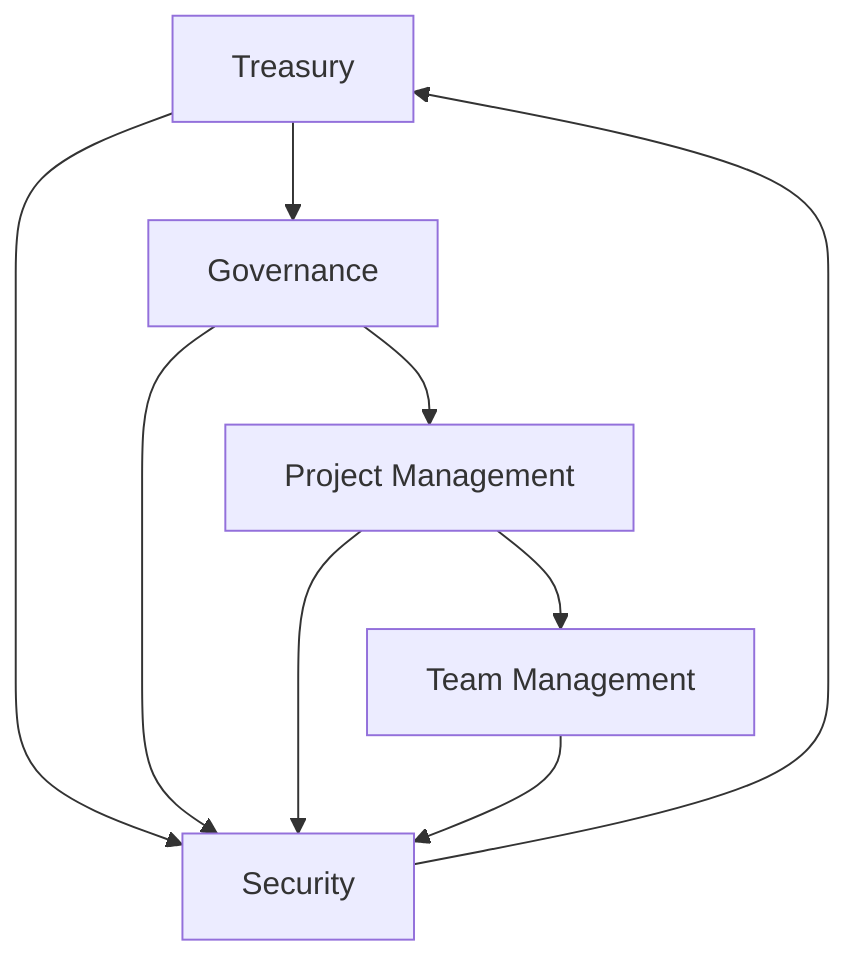

# Smart Contract Architecture

## Overview
The smart contract system forms the backbone of the Web4.0 incubator platform, managing treasury operations, governance, and project lifecycle through a series of interconnected contracts.

## Core Contract Components

### 1. 📊 Treasury Management
```solidity
// Core treasury interface
interface ITreasury {
    function allocateFunds(address project, uint256 amount) external;
    function releasePayout(address recipient, uint256 amount) external;
    function lockFunds(uint256 amount, uint256 duration) external;
    function getBalance() external view returns (uint256);
}
```

### 2. 🏛️ Governance System
```solidity
// Governance interface
interface IGovernance {
    function proposeAction(bytes32 actionHash, string description) external;
    function vote(uint256 proposalId, bool support) external;
    function executeProposal(uint256 proposalId) external;
    function getProposalStatus(uint256 proposalId) external view returns (Status);
}
```

### 3. 🎯 Project Management
```solidity
// Project management interface
interface IProjectManagement {
    function createProject(string name, uint256 deadline) external;
    function assignTeam(uint256 projectId, address[] team) external;
    function submitDeliverable(uint256 projectId, string deliverable) external;
    function validateProject(uint256 projectId) external returns (bool);
}
```

### 4. 🤝 Team Management
```solidity
// Team management interface
interface ITeamManagement {
    function registerMember(address member, string role) external;
    function createTeam(address[] members) external returns (uint256);
    function assignProject(uint256 teamId, uint256 projectId) external;
    function updateMemberStatus(address member, Status status) external;
}
```

### 5. 🔐 Security & Validation
```solidity
// Security interface
interface ISecurity {
    function validateTransaction(bytes32 txHash) external returns (bool);
    function auditContract(address contract) external returns (Report);
    function checkCompliance(address target) external view returns (bool);
    function reportIncident(bytes32 incidentHash) external;
}
```

## Contract Interactions

### Flow Diagram


## Security Measures

### Access Control
```solidity
// Role-based access control
contract AccessControl {
    bytes32 public constant ADMIN_ROLE = keccak256("ADMIN_ROLE");
    bytes32 public constant MANAGER_ROLE = keccak256("MANAGER_ROLE");
    bytes32 public constant MEMBER_ROLE = keccak256("MEMBER_ROLE");
    
    function grantRole(bytes32 role, address account) external;
    function revokeRole(bytes32 role, address account) external;
    function hasRole(bytes32 role, address account) external view returns (bool);
}
```

### Transaction Validation
```solidity
// Transaction validator
contract TransactionValidator {
    function validateTransaction(
        address sender,
        address recipient,
        uint256 amount,
        bytes calldata data
    ) external returns (bool);
}
```

## Treasury Operations

### Fund Management
```solidity
// Fund management contract
contract FundManager {
    function allocate(address recipient, uint256 amount) external;
    function release(address recipient, uint256 amount) external;
    function lock(uint256 amount, uint256 duration) external;
    function invest(address strategy, uint256 amount) external;
}
```

### Payment Processing
```solidity
// Payment processor
contract PaymentProcessor {
    function processPayout(address recipient, uint256 amount) external;
    function batchPayout(address[] recipients, uint256[] amounts) external;
    function schedulePayment(address recipient, uint256 amount, uint256 time) external;
}
```

## Project Lifecycle

### 1. Project Creation
```solidity
struct Project {
    uint256 id;
    string name;
    uint256 deadline;
    Status status;
    address[] team;
    uint256 budget;
}
```

### 2. Team Assignment
```solidity
struct Team {
    uint256 id;
    address[] members;
    mapping(address => Role) roles;
    uint256 projectId;
}
```

### 3. Milestone Tracking
```solidity
struct Milestone {
    uint256 id;
    string description;
    uint256 deadline;
    Status status;
    uint256 payment;
}
```

## Implementation Guidelines

### 1. Contract Deployment
1. Deploy access control
2. Deploy treasury
3. Deploy governance
4. Deploy project management
5. Deploy team management
6. Configure security measures

### 2. Integration Steps
1. Link contracts through interfaces
2. Set up role permissions
3. Initialize treasury
4. Configure governance parameters
5. Test system interactions

### 3. Security Measures
- Multi-signature requirements
- Time-locks on critical functions
- Emergency pause mechanisms
- Upgrade paths
- Audit trails

## Testing & Validation

### Test Scenarios
1. Treasury operations
2. Governance voting
3. Project lifecycle
4. Team management
5. Security measures

### Audit Requirements
- Static analysis
- Dynamic testing
- Formal verification
- Penetration testing
- Security review

## Maintenance Procedures

### Regular Tasks
- Security monitoring
- Performance optimization
- Gas optimization
- Feature updates
- Bug fixes

### Emergency Procedures
1. Detect issues
2. Pause operations
3. Assess impact
4. Apply fixes
5. Resume operations

## Success Metrics
1. Transaction success rate
2. Gas efficiency
3. Security incidents
4. System uptime
5. User satisfaction
6. Contract interaction speed 