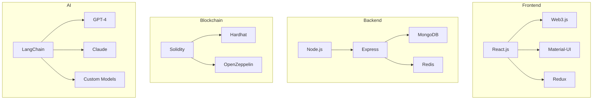

# Technical Implementation Guide

## System Architecture

### Technology Stack


## Implementation Details

### 1. Frontend Architecture

#### React Application Structure
```typescript
// App structure
src/
├── components/
│   ├── common/
│   │   ├── Button.tsx
│   │   ├── Input.tsx
│   │   └── Card.tsx
│   ├── dashboard/
│   │   ├── ProjectList.tsx
│   │   ├── TeamView.tsx
│   │   └── Analytics.tsx
│   └── hackathon/
│       ├── OpportunityList.tsx
│       ├── ProjectDetails.tsx
│       └── SubmissionForm.tsx
├── pages/
│   ├── Dashboard.tsx
│   ├── Projects.tsx
│   └── Teams.tsx
└── services/
    ├── ai.ts
    ├── blockchain.ts
    └── api.ts
```

#### Key Components
```typescript
// Project component example
interface Project {
    id: string;
    name: string;
    status: ProjectStatus;
    team: Team[];
    deadline: Date;
    budget: number;
}

const ProjectCard: React.FC<Project> = ({
    id,
    name,
    status,
    team,
    deadline,
    budget
}) => {
    // Component implementation
};
```

### 2. Smart Contract Implementation

#### Core Contracts
```solidity
// Treasury contract
contract Treasury is ITreasury, AccessControl {
    mapping(address => uint256) public balances;
    mapping(address => bool) public approvedProjects;
    
    function allocateFunds(
        address project,
        uint256 amount
    ) external override onlyRole(ADMIN_ROLE) {
        require(approvedProjects[project], "Project not approved");
        require(balances[address(this)] >= amount, "Insufficient funds");
        
        balances[project] += amount;
        balances[address(this)] -= amount;
        
        emit FundsAllocated(project, amount);
    }
}
```

#### Project Management
```solidity
// Project contract
contract ProjectManagement is IProjectManagement {
    struct ProjectData {
        string name;
        uint256 deadline;
        Status status;
        address[] team;
        uint256 budget;
        mapping(address => bool) teamApproved;
    }
    
    mapping(uint256 => ProjectData) public projects;
    
    function createProject(
        string memory name,
        uint256 deadline
    ) external override returns (uint256) {
        // Implementation
    }
}
```

### 3. AI System Implementation

#### Agent Framework
```python
# AI agent base class
class AIAgent:
    def __init__(self, model: str, role: str):
        self.model = model
        self.role = role
        self.context = []
    
    async def process_input(self, input_data: dict) -> dict:
        # Process input and generate response
        response = await self.generate_response(input_data)
        self.update_context(input_data, response)
        return response
    
    async def generate_response(self, input_data: dict) -> dict:
        # Generate response using AI model
        pass

# Specialized agent example
class HackathonDiscoveryAgent(AIAgent):
    def __init__(self):
        super().__init__("gpt-4", "hackathon_discovery")
        self.opportunity_db = OpportunityDatabase()
    
    async def search_opportunities(self) -> List[Opportunity]:
        # Implementation
        pass
```

### 4. Database Schema

#### MongoDB Collections
```typescript
// Project schema
interface ProjectSchema {
    _id: ObjectId;
    name: string;
    status: string;
    team: {
        members: Array<{
            userId: ObjectId;
            role: string;
            joinedAt: Date;
        }>;
        size: number;
    };
    hackathon: {
        id: string;
        name: string;
        deadline: Date;
        prize: number;
    };
    repository: {
        url: string;
        branch: string;
    };
    created: Date;
    updated: Date;
}

// Team schema
interface TeamSchema {
    _id: ObjectId;
    name: string;
    members: Array<{
        userId: ObjectId;
        role: string;
        skills: string[];
        reputation: number;
    }>;
    projects: ObjectId[];
    stats: {
        completedProjects: number;
        successRate: number;
        averageRating: number;
    };
}
```

### 5. API Implementation

#### REST Endpoints
```typescript
// Project routes
router.post('/api/projects', async (req, res) => {
    try {
        const project = await ProjectService.create(req.body);
        res.status(201).json(project);
    } catch (error) {
        res.status(500).json({ error: error.message });
    }
});

// Team routes
router.get('/api/teams/:id/performance', async (req, res) => {
    try {
        const stats = await TeamService.getPerformanceStats(req.params.id);
        res.json(stats);
    } catch (error) {
        res.status(500).json({ error: error.message });
    }
});
```

### 6. Integration Points

#### Web3 Integration
```typescript
// Web3 service
class Web3Service {
    private web3: Web3;
    private contracts: {
        treasury: Contract;
        governance: Contract;
        projects: Contract;
    };
    
    constructor() {
        this.web3 = new Web3(window.ethereum);
        this.initializeContracts();
    }
    
    async connectWallet(): Promise<string[]> {
        try {
            const accounts = await window.ethereum.request({
                method: 'eth_requestAccounts'
            });
            return accounts;
        } catch (error) {
            throw new Error('User denied wallet connection');
        }
    }
    
    async submitProject(projectData: ProjectSubmission): Promise<string> {
        // Implementation
    }
}
```

#### AI Integration
```typescript
// AI service
class AIService {
    private agents: {
        discovery: HackathonDiscoveryAgent;
        project: ProjectManagementAgent;
        community: CommunityAgent;
    };
    
    constructor() {
        this.initializeAgents();
    }
    
    async processUserQuery(
        query: string,
        context: QueryContext
    ): Promise<AIResponse> {
        // Implementation
    }
    
    async reviewCode(
        code: string,
        requirements: CodeRequirements
    ): Promise<CodeReview> {
        // Implementation
    }
}
```

### 7. Security Implementation

#### Authentication
```typescript
// Auth middleware
const authMiddleware = async (
    req: Request,
    res: Response,
    next: NextFunction
) => {
    try {
        const token = req.headers.authorization?.split(' ')[1];
        if (!token) throw new Error('No token provided');
        
        const decoded = jwt.verify(token, process.env.JWT_SECRET);
        req.user = decoded;
        next();
    } catch (error) {
        res.status(401).json({ error: 'Unauthorized' });
    }
};
```

#### Smart Contract Security
```solidity
// Security module
contract SecurityModule is ISecurity {
    using SafeMath for uint256;
    
    mapping(bytes32 => bool) public validatedTransactions;
    mapping(address => SecurityReport) public contractAudits;
    
    function validateTransaction(
        bytes32 txHash
    ) external override returns (bool) {
        // Implementation
    }
    
    function auditContract(
        address contractAddress
    ) external override returns (Report) {
        // Implementation
    }
}
```

### 8. Monitoring & Logging

#### System Monitoring
```typescript
// Monitoring service
class MonitoringService {
    private metrics: {
        performance: PerformanceMetrics;
        security: SecurityMetrics;
        usage: UsageMetrics;
    };
    
    constructor() {
        this.initializeMetrics();
    }
    
    async trackMetric(
        metricType: MetricType,
        value: number
    ): Promise<void> {
        // Implementation
    }
    
    async generateReport(
        timeRange: TimeRange
    ): Promise<MonitoringReport> {
        // Implementation
    }
}
```

## Deployment Configuration

### Infrastructure Setup
```yaml
# Docker compose configuration
version: '3.8'
services:
  frontend:
    build: ./frontend
    ports:
      - "3000:3000"
    environment:
      - NODE_ENV=production
      - API_URL=http://api:4000
  
  api:
    build: ./backend
    ports:
      - "4000:4000"
    environment:
      - MONGODB_URI=mongodb://db:27017
      - REDIS_URL=redis://cache:6379
  
  ai:
    build: ./ai
    ports:
      - "5000:5000"
    environment:
      - AI_MODEL_PATH=/models
      - GPU_ENABLED=true
  
  db:
    image: mongo:latest
    volumes:
      - mongodb_data:/data/db
  
  cache:
    image: redis:latest
    volumes:
      - redis_data:/data

volumes:
  mongodb_data:
  redis_data:
```

### Scaling Configuration
```yaml
# Kubernetes deployment
apiVersion: apps/v1
kind: Deployment
metadata:
  name: web4-platform
spec:
  replicas: 3
  selector:
    matchLabels:
      app: web4-platform
  template:
    metadata:
      labels:
        app: web4-platform
    spec:
      containers:
      - name: frontend
        image: web4/frontend:latest
        resources:
          limits:
            cpu: "1"
            memory: "1Gi"
      - name: api
        image: web4/api:latest
        resources:
          limits:
            cpu: "2"
            memory: "2Gi"
      - name: ai
        image: web4/ai:latest
        resources:
          limits:
            cpu: "4"
            memory: "8Gi"
``` 