# 📂 BAD DAO UI - Project Management Component File Structure

## 📋 Table of Contents
- [🏗️ Component Structure](#component-structure)
- [📄 File Descriptions](#file-descriptions)
- [🔄 Component Relationships](#component-relationships)
- [📊 Size Metrics](#size-metrics)

## 🏗️ Component Structure

```
project/
├── src/
│   ├── components/
│   │   ├── common/          # Common components used across the application
│   │   ├── layout/          # Layout components
│   │   ├── projects/        # Project management specific components
│   │   │   ├── Board/
│   │   │   │   ├── Board.tsx
│   │   │   │   ├── Column.tsx
│   │   │   │   ├── TaskCard.tsx
│   │   │   │   └── index.ts
│   │   │   ├── TaskDetail/
│   │   │   │   ├── TaskDetail.tsx
│   │   │   │   ├── TaskComments.tsx
│   │   │   │   ├── TaskAttachments.tsx
│   │   │   │   ├── TaskSubtasks.tsx
│   │   │   │   ├── TaskAssignees.tsx
│   │   │   │   └── index.ts
│   │   │   ├── TaskForm/
│   │   │   │   ├── TaskForm.tsx
│   │   │   │   ├── TaskMetadata.tsx
│   │   │   │   ├── TaskRelationships.tsx
│   │   │   │   └── index.ts
│   │   │   ├── ProjectSettings/
│   │   │   │   ├── ProjectSettings.tsx
│   │   │   │   ├── MemberManagement.tsx
│   │   │   │   ├── ProjectMetadata.tsx
│   │   │   │   ├── IntegrationSettings.tsx
│   │   │   │   └── index.ts
│   │   │   ├── ProjectTemplates/
│   │   │   │   ├── TemplateList.tsx
│   │   │   │   ├── TemplateDetail.tsx
│   │   │   │   ├── TemplateForm.tsx
│   │   │   │   └── index.ts
│   │   │   ├── Timeline/
│   │   │   │   ├── Timeline.tsx
│   │   │   │   ├── GanttChart.tsx
│   │   │   │   ├── MilestoneMarker.tsx
│   │   │   │   └── index.ts
│   │   │   ├── ProjectFilters/
│   │   │   │   ├── FilterBar.tsx
│   │   │   │   ├── FilterItem.tsx
│   │   │   │   ├── SortingOptions.tsx
│   │   │   │   └── index.ts
│   │   │   ├── DashboardWidgets/
│   │   │   │   ├── TaskStats.tsx
│   │   │   │   ├── RecentActivity.tsx
│   │   │   │   ├── TeamPerformance.tsx
│   │   │   │   └── index.ts
│   │   │   └── index.ts    # Exports all project components
│   │   ├── daos/           # DAO/Community components
│   │   │   ├── DAOCard/
│   │   │   │   ├── DAOCard.tsx
│   │   │   │   ├── DAOMetrics.tsx
│   │   │   │   ├── MemberCounter.tsx
│   │   │   │   └── index.ts
│   │   │   ├── DAOProfile/
│   │   │   │   ├── DAOHeader.tsx
│   │   │   │   ├── DAOTabs.tsx
│   │   │   │   ├── CategorySection.tsx
│   │   │   │   ├── AboutSection.tsx
│   │   │   │   ├── MemberPreview.tsx
│   │   │   │   └── index.ts
│   │   │   ├── DAOSettings/
│   │   │   │   ├── DAOSettings.tsx
│   │   │   │   ├── GeneralSettings.tsx
│   │   │   │   ├── CategoryManagement.tsx
│   │   │   │   ├── BrandingSettings.tsx
│   │   │   │   └── index.ts
│   │   │   ├── DAOFilters/
│   │   │   │   ├── DAOSearchBar.tsx
│   │   │   │   ├── DAOFilter.tsx
│   │   │   │   └── index.ts
│   │   │   └── index.ts    # Exports all DAO components
│   │   ├── bounties/       # Bounty components
│   │   │   ├── BountyCard/
│   │   │   │   ├── BountyCard.tsx
│   │   │   │   ├── RewardDisplay.tsx
│   │   │   │   ├── SkillTags.tsx
│   │   │   │   └── index.ts
│   │   │   ├── BountyDetail/
│   │   │   │   ├── BountyHeader.tsx
│   │   │   │   ├── BountyDescription.tsx
│   │   │   │   ├── ActivityStream.tsx
│   │   │   │   ├── ParticipantList.tsx
│   │   │   │   ├── RoleReservation.tsx
│   │   │   │   └── index.ts
│   │   │   ├── BountyFilters/
│   │   │   │   ├── FilterSidebar.tsx
│   │   │   │   ├── SkillFilter.tsx
│   │   │   │   ├── SortingOptions.tsx
│   │   │   │   ├── LanguageFilter.tsx
│   │   │   │   └── index.ts
│   │   │   ├── BountyForm/
│   │   │   │   ├── BountyForm.tsx
│   │   │   │   ├── RewardInput.tsx
│   │   │   │   ├── SkillSelector.tsx
│   │   │   │   └── index.ts
│   │   │   └── index.ts    # Exports all bounty components
│   │   ├── contributors/   # Contributor components
│   │   │   ├── ContributorCard/
│   │   │   │   ├── ContributorCard.tsx
│   │   │   │   ├── ReputationDisplay.tsx
│   │   │   │   ├── SkillList.tsx
│   │   │   │   └── index.ts
│   │   │   ├── ContributorProfile/
│   │   │   │   ├── ProfileHeader.tsx
│   │   │   │   ├── ReputationMetrics.tsx
│   │   │   │   ├── PortfolioSection.tsx
│   │   │   │   ├── OrganizationList.tsx
│   │   │   │   ├── ReviewSection.tsx
│   │   │   │   ├── ContributionHistory.tsx
│   │   │   │   └── index.ts
│   │   │   ├── RevenueControls/
│   │   │   │   ├── RevenueToggle.tsx
│   │   │   │   ├── SharingSettings.tsx
│   │   │   │   └── index.ts
│   │   │   ├── ReviewSystem/
│   │   │   │   ├── ReviewForm.tsx
│   │   │   │   ├── StarRating.tsx
│   │   │   │   ├── ReviewList.tsx
│   │   │   │   └── index.ts
│   │   │   └── index.ts    # Exports all contributor components
│   │   ├── governance/     # Existing governance components
│   │   └── treasury/       # Existing treasury components
│   ├── context/
│   │   ├── ProjectContext.tsx        # Project-specific context
│   │   ├── TaskContext.tsx           # Task-specific context
│   │   ├── ProjectTemplateContext.tsx # Template-specific context
│   │   ├── DAOContext.tsx            # DAO-specific context
│   │   ├── BountyContext.tsx         # Bounty-specific context
│   │   └── ContributorContext.tsx    # Contributor-specific context
│   ├── hooks/
│   │   ├── useProjects.ts
│   │   ├── useTasks.ts
│   │   ├── useProjectMembers.ts
│   │   ├── useProjectTemplates.ts
│   │   ├── useTaskComments.ts
│   │   ├── useDAOs.ts
│   │   ├── useDAOCategories.ts
│   │   ├── useBounties.ts
│   │   ├── useBountyActivity.ts
│   │   ├── useContributors.ts
│   │   ├── useContributorReviews.ts
│   │   └── useContributorPortfolio.ts
│   ├── pages/
│   │   ├── Projects.tsx               # Main projects dashboard
│   │   ├── ProjectDetail.tsx          # Single project view
│   │   ├── ProjectSettings.tsx        # Project settings page
│   │   ├── ProjectTemplates.tsx       # Templates listing page
│   │   ├── CreateProject.tsx          # Project creation page
│   │   ├── TaskDetail.tsx             # Detailed task view
│   │   ├── DAOs.tsx                   # DAO directory page
│   │   ├── DAODetail.tsx              # Single DAO view
│   │   ├── DAOSettings.tsx            # DAO settings page
│   │   ├── CreateDAO.tsx              # DAO creation page
│   │   ├── Bounties.tsx               # Bounty marketplace
│   │   ├── BountyDetail.tsx           # Single bounty view
│   │   ├── CreateBounty.tsx           # Bounty creation page
│   │   ├── Contributors.tsx           # Contributor directory
│   │   ├── ContributorProfile.tsx     # Single contributor view
│   │   └── ContributorSettings.tsx    # Contributor settings page
│   ├── services/
│   │   ├── database.ts                # Updated with PM models
│   │   ├── projectService.ts          # Project-specific API methods
│   │   ├── taskService.ts             # Task-specific API methods
│   │   ├── daoService.ts              # DAO-specific API methods
│   │   ├── bountyService.ts           # Bounty-specific API methods
│   │   └── contributorService.ts      # Contributor-specific API methods
│   ├── utils/
│   │   ├── projectHelpers.ts          # Project-specific utilities
│   │   ├── taskHelpers.ts             # Task-specific utilities
│   │   ├── templateHelpers.ts         # Template-specific utilities
│   │   ├── daoHelpers.ts              # DAO-specific utilities
│   │   ├── bountyHelpers.ts           # Bounty-specific utilities
│   │   └── contributorHelpers.ts      # Contributor-specific utilities
│   ├── types/
│   │   └── project-management.ts      # Type definitions for PM
│   └── App.tsx                        # Updated with PM routes
└── README.md
```

## 📄 File Descriptions

### Pages

#### `Projects.tsx`
Main dashboard for project management. Shows all projects accessible to the user, with filtering options, and links to create new projects. Implements layout similar to the space listing seen in screenshots.

#### `ProjectDetail.tsx`
Displays a specific project, with task board, members, and project stats. Main interface for task management, similar to the kanban board view from screenshots.

#### `ProjectSettings.tsx`
Configuration page for a specific project. Includes member management, project metadata, integrations with governance and treasury.

#### `ProjectTemplates.tsx`
Lists available project templates for creating new projects. Users can browse, preview, and select templates.

#### `CreateProject.tsx`
Form for creating a new project, either from scratch or from a template. Similar to the "Create" modal seen in screenshots.

#### `TaskDetail.tsx`
Detailed view of a specific task, showing all metadata, comments, attachments, and related items.

#### `DAOs.tsx`
Main directory for browsing DAOs and communities. Shows all available DAOs with filtering options, member counts, and descriptions. Implements the grid layout seen in the Top DAOs screenshot.

#### `DAODetail.tsx`
Detailed view of a specific DAO, with tabs for different categories, about section, contributor/member list, and bounty organization. Similar to the peaq network profile seen in the screenshot.

#### `DAOSettings.tsx`
Configuration page for a DAO. Includes general settings, branding options, category management, and integration settings.

#### `CreateDAO.tsx`
Form for creating a new DAO or community with name, description, logo upload, and initial category setup.

#### `Bounties.tsx`
Marketplace for browsing all available bounties across DAOs. Includes comprehensive filtering by skills, sorting options, and clean card layout as seen in the Open Bounties screenshot.

#### `BountyDetail.tsx`
Detailed view of a specific bounty, showing reward, description, activity stream, and participant list as seen in the task detail screenshot.

#### `CreateBounty.tsx`
Form for creating a new bounty, with fields for title, description, skills required, reward amount, and role reservation options.

#### `Contributors.tsx`
Directory of all contributors across the platform, with reputation scores, skills, and specializations as seen in the Contributors page screenshot.

#### `ContributorProfile.tsx`
Detailed profile view for a specific contributor, showing reputation, portfolio, reviews, and contribution history as seen in the profile page screenshot.

#### `ContributorSettings.tsx`
Settings page for contributor to manage their profile, portfolio, skills, and revenue sharing preferences.

### Components

#### Board Components
- `Board.tsx` - Main kanban board component
- `Column.tsx` - Individual status column in board
- `TaskCard.tsx` - Card representation of a task in columns

#### Task Detail Components
- `TaskDetail.tsx` - Container for task details view
- `TaskComments.tsx` - Comments section for tasks
- `TaskAttachments.tsx` - Attachments management
- `TaskSubtasks.tsx` - Subtasks management
- `TaskAssignees.tsx` - User assignment interface

#### Task Form Components
- `TaskForm.tsx` - Form for creating/editing tasks
- `TaskMetadata.tsx` - Fields for task metadata
- `TaskRelationships.tsx` - Link tasks to other entities

#### Project Settings Components
- `ProjectSettings.tsx` - Container for settings
- `MemberManagement.tsx` - User/role management
- `ProjectMetadata.tsx` - Basic project info
- `IntegrationSettings.tsx` - Integration configuration

#### Project Templates Components
- `TemplateList.tsx` - Browse available templates
- `TemplateDetail.tsx` - Preview a template
- `TemplateForm.tsx` - Create/edit templates

#### Timeline Components
- `Timeline.tsx` - Container for timeline visualization
- `GanttChart.tsx` - Gantt chart implementation
- `MilestoneMarker.tsx` - Milestone visualization

#### Project Filters Components
- `FilterBar.tsx` - Container for filters
- `FilterItem.tsx` - Individual filter control
- `SortingOptions.tsx` - Sorting controls

#### Dashboard Widgets Components
- `TaskStats.tsx` - Task statistics widget
- `RecentActivity.tsx` - Recent project activity
- `TeamPerformance.tsx` - Team performance metrics

#### DAO Components

##### DAO Card Components
- `DAOCard.tsx` - Card representation of a DAO in listings
- `DAOMetrics.tsx` - Display key DAO metrics (members, etc.)
- `MemberCounter.tsx` - Visual counter for community size

##### DAO Profile Components
- `DAOHeader.tsx` - Header banner for DAO profiles
- `DAOTabs.tsx` - Tab navigation for DAO sections
- `CategorySection.tsx` - Section for category-organized content
- `AboutSection.tsx` - DAO description and details
- `MemberPreview.tsx` - Preview of DAO members/contributors

##### DAO Settings Components
- `DAOSettings.tsx` - Container for settings
- `GeneralSettings.tsx` - Basic DAO configuration
- `CategoryManagement.tsx` - Manage DAO categories
- `BrandingSettings.tsx` - Logos and visual identity

##### DAO Filters Components
- `DAOSearchBar.tsx` - Search component for DAOs
- `DAOFilter.tsx` - Filtering controls for DAO listings

#### Bounty Components

##### Bounty Card Components
- `BountyCard.tsx` - Card representation of a bounty
- `RewardDisplay.tsx` - Display bounty compensation
- `SkillTags.tsx` - Visual tags for required skills

##### Bounty Detail Components
- `BountyHeader.tsx` - Header for bounty details
- `BountyDescription.tsx` - Bounty content and requirements
- `ActivityStream.tsx` - Timeline of bounty interactions
- `ParticipantList.tsx` - List of users involved
- `RoleReservation.tsx` - Controls for role reservation

##### Bounty Filters Components
- `FilterSidebar.tsx` - Sidebar with filter controls
- `SkillFilter.tsx` - Filter bounties by skill
- `SortingOptions.tsx` - Options for ordering bounties
- `LanguageFilter.tsx` - Filter by language requirements

##### Bounty Form Components
- `BountyForm.tsx` - Form for creating/editing bounties
- `RewardInput.tsx` - Input for bounty compensation
- `SkillSelector.tsx` - Controls for selecting skills

#### Contributor Components

##### Contributor Card Components
- `ContributorCard.tsx` - Card representation of a contributor
- `ReputationDisplay.tsx` - Visual indicator of reputation
- `SkillList.tsx` - List of contributor skills

##### Contributor Profile Components
- `ProfileHeader.tsx` - Header for contributor profiles
- `ReputationMetrics.tsx` - Detailed reputation display
- `PortfolioSection.tsx` - Showcase of previous work
- `OrganizationList.tsx` - Affiliated organizations
- `ReviewSection.tsx` - Reviews and feedback
- `ContributionHistory.tsx` - History of contributions

##### Revenue Controls Components
- `RevenueToggle.tsx` - Toggle for revenue sharing
- `SharingSettings.tsx` - Configure revenue distribution

##### Review System Components
- `ReviewForm.tsx` - Form for submitting reviews
- `StarRating.tsx` - Rating input component
- `ReviewList.tsx` - List of user reviews

### Context

#### `ProjectContext.tsx`
Provides project state and operations to components.

#### `TaskContext.tsx`
Provides task state and operations to components.

#### `ProjectTemplateContext.tsx`
Provides template state and operations to components.

#### `DAOContext.tsx`
Provides DAO state and operations to components.

#### `BountyContext.tsx`
Provides bounty state and operations to components.

#### `ContributorContext.tsx`
Provides contributor state and operations to components.

### Hooks

#### `useProjects.ts`
Hook for fetching and manipulating projects.

#### `useTasks.ts`
Hook for fetching and manipulating tasks.

#### `useProjectMembers.ts`
Hook for managing project members.

#### `useProjectTemplates.ts`
Hook for managing project templates.

#### `useTaskComments.ts`
Hook for managing task comments.

#### `useDAOs.ts`
Hook for fetching and manipulating DAOs.

#### `useDAOCategories.ts`
Hook for managing DAO categories.

#### `useBounties.ts`
Hook for fetching and manipulating bounties.

#### `useBountyActivity.ts`
Hook for managing bounty activity streams.

#### `useContributors.ts`
Hook for fetching and manipulating contributors.

#### `useContributorReviews.ts`
Hook for managing contributor reviews.

#### `useContributorPortfolio.ts`
Hook for managing contributor portfolio items.

### Services

#### `database.ts` (updated)
Extends existing database service with PM models.

#### `projectService.ts`
Project-specific database operations.

#### `taskService.ts`
Task-specific database operations.

#### `daoService.ts`
DAO-specific database operations.

#### `bountyService.ts`
Bounty-specific database operations.

#### `contributorService.ts`
Contributor-specific database operations.

### Utils

#### `projectHelpers.ts`
Utility functions for projects.

#### `taskHelpers.ts`
Utility functions for tasks.

#### `templateHelpers.ts`
Utility functions for templates.

#### `daoHelpers.ts`
Utility functions for DAOs.

#### `bountyHelpers.ts`
Utility functions for bounties.

#### `contributorHelpers.ts`
Utility functions for contributors.

### Types

#### `project-management.ts`
TypeScript interfaces and types for project management.

## 🔄 Component Relationships

```mermaid
graph TD
    App[App.tsx] --> Projects[Projects.tsx]
    App --> ProjectDetail[ProjectDetail.tsx]
    App --> DAOs[DAOs.tsx]
    App --> DAODetail[DAODetail.tsx]
    App --> Bounties[Bounties.tsx]
    App --> BountyDetail[BountyDetail.tsx]
    App --> Contributors[Contributors.tsx]
    App --> ContributorProfile[ContributorProfile.tsx]
    
    Projects --> ProjectContext[ProjectContext]
    ProjectDetail --> ProjectContext
    ProjectDetail --> TaskContext[TaskContext]
    
    DAOs --> DAOContext[DAOContext]
    DAODetail --> DAOContext
    DAODetail --> BountyContext[BountyContext]
    
    Bounties --> BountyContext
    BountyDetail --> BountyContext
    BountyDetail --> ActivityStream[ActivityStream Component]
    
    Contributors --> ContributorContext[ContributorContext]
    ContributorProfile --> ContributorContext
    
    DAOContext --> useDAOs[useDAOs]
    BountyContext --> useBounties[useBounties]
    ContributorContext --> useContributors[useContributors]
    
    useDAOs --> daoService[daoService]
    useBounties --> bountyService[bountyService]
    useContributors --> contributorService[contributorService]
    
    daoService --> database[database]
    bountyService --> database
    contributorService --> database
    
    DAOs --> DAOCard[DAOCard Component]
    DAODetail --> DAOHeader[DAOHeader Component]
    DAODetail --> DAOTabs[DAOTabs Component]
    
    Bounties --> FilterSidebar[FilterSidebar Component]
    Bounties --> BountyCard[BountyCard Component]
    BountyDetail --> BountyHeader[BountyHeader Component]
    
    Contributors --> ContributorCard[ContributorCard Component]
    ContributorProfile --> ProfileHeader[ProfileHeader Component]
    ContributorProfile --> ReviewSection[ReviewSection Component]
    
    style App fill:#f9f,stroke:#333,stroke-width:2px
    style DAOs fill:#bbf,stroke:#333,stroke-width:2px
    style Bounties fill:#bbf,stroke:#333,stroke-width:2px
    style Contributors fill:#bbf,stroke:#333,stroke-width:2px
```



## 📊 Size Metrics

### Estimated Component Count
- Pages: 16 (6 project + 4 DAO + 3 bounty + 3 contributor)
- React Components: ~75 (30 project + 15 DAO + 15 bounty + 15 contributor)
- Context Providers: 6
- Custom Hooks: 12
- Service Files: 6
- Utility Files: 6
- Type Definition Files: 1

### Estimated Code Size
- TypeScript files: ~120
- Total lines of code: ~12,000
- CSS/SCSS: Reusing existing styles with additions for new components

### Complexity Assessment

#### Core Components (high complexity):
- Board.tsx
- TaskDetail.tsx
- DAODetail.tsx
- BountyDetail.tsx
- ContributorProfile.tsx
- ActivityStream.tsx
- GanttChart.tsx

#### Medium Complexity:
- TaskForm.tsx
- MemberManagement.tsx
- FilterSidebar.tsx
- PortfolioSection.tsx
- ReviewSection.tsx
- DAOTabs.tsx

#### Lower Complexity:
- TaskCard.tsx
- DAOCard.tsx
- BountyCard.tsx
- ContributorCard.tsx
- RewardDisplay.tsx
- SkillTags.tsx

### Reusability Potential

#### High Reusability:
- TaskCard.tsx
- FilterItem.tsx
- SkillTags.tsx
- StarRating.tsx
- RewardDisplay.tsx
  
#### Medium Reusability:
- Board.tsx
- DAOCard.tsx
- BountyCard.tsx
- ContributorCard.tsx
- ActivityStream.tsx
  
#### Project-Specific:
- IntegrationSettings.tsx
- DAODetail.tsx
- ContributorProfile.tsx 