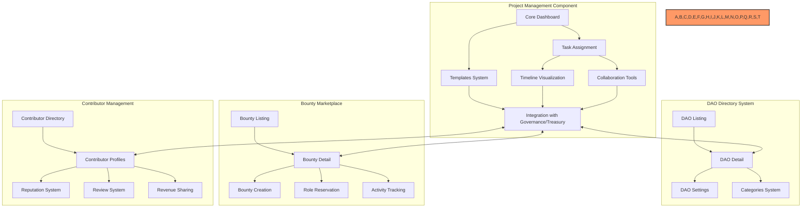
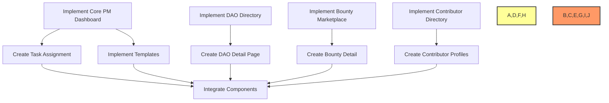

# 📋 BAD DAO UI - Project Management Component Task Log

## 📋 Table of Contents
- [🎯 Current Tasks](#current-tasks)
- [📊 Progress Metrics](#progress-metrics)
- [📅 Daily Updates](#daily-updates)
- [⚠️ Blockers](#blockers)
- [🔄 Next Steps](#next-steps)
- [📝 Task Progress Updates](#task-progress-updates)

## 🎯 Current Tasks

### 🏗️ Project Management Component
- 🔴 Not Started - Core Project Management Dashboard
  - Description: Create main PM dashboard with kanban boards, task tracking, and analytics
  - Dependencies: None
  - Estimated Time: 1 week

- 🔴 Not Started - Project Templates System 
  - Description: Implement predefined project templates for different DAO types
  - Dependencies: Core PM Dashboard
  - Estimated Time: 3 days

- 🔴 Not Started - Task Assignment & Tracking
  - Description: Build user assignment, status tracking, and notification systems
  - Dependencies: Core PM Dashboard
  - Estimated Time: 5 days

- 🔴 Not Started - Timeline & Milestone Visualization
  - Description: Create Gantt chart and milestone tracking visualizations
  - Dependencies: Core PM Dashboard, Task Assignment
  - Estimated Time: 4 days

- 🔴 Not Started - DAO Collaboration Tools
  - Description: Implement discussion boards, comments, and voting systems for tasks
  - Dependencies: Core PM Dashboard, Task Assignment
  - Estimated Time: 4 days

- 🔴 Not Started - Integration with Governance & Treasury
  - Description: Connect PM systems with existing Governance and Treasury components
  - Dependencies: All PM components
  - Estimated Time: 1 week

### 🏛️ DAO Directory System
- 🔴 Not Started - DAO Listing Page
  - Description: Create browsable directory of DAOs with search and filtering
  - Dependencies: None
  - Estimated Time: 4 days

- 🔴 Not Started - DAO Detail Page
  - Description: Build detailed DAO profile with tabs, metrics, and member display
  - Dependencies: DAO Listing Page
  - Estimated Time: 5 days

- 🔴 Not Started - DAO Creation & Settings
  - Description: Implement DAO creation form and settings management
  - Dependencies: DAO Detail Page
  - Estimated Time: 3 days

- 🔴 Not Started - DAO Categories System
  - Description: Create category management for organizing DAO content
  - Dependencies: DAO Detail Page
  - Estimated Time: 2 days

### 💰 Bounty Marketplace
- 🔴 Not Started - Bounty Listing Page
  - Description: Create browsable marketplace of bounties with advanced filtering
  - Dependencies: None
  - Estimated Time: 4 days

- 🔴 Not Started - Bounty Detail Page
  - Description: Build detailed bounty view with activity stream and participants
  - Dependencies: Bounty Listing Page
  - Estimated Time: 3 days

- 🔴 Not Started - Bounty Creation & Editing
  - Description: Implement bounty creation form with reward and skill settings
  - Dependencies: Bounty Detail Page
  - Estimated Time: 2 days

- 🔴 Not Started - Role Reservation System
  - Description: Create role-based reservation controls for bounties
  - Dependencies: Bounty Detail Page
  - Estimated Time: 2 days

- 🔴 Not Started - Activity Tracking System
  - Description: Build comprehensive activity logging for bounty interactions
  - Dependencies: Bounty Detail Page
  - Estimated Time: 3 days

### 👥 Contributor Management
- 🔴 Not Started - Contributor Directory
  - Description: Create browsable directory of contributors with skill filtering
  - Dependencies: None
  - Estimated Time: 3 days

- 🔴 Not Started - Contributor Profiles
  - Description: Build detailed contributor profiles with portfolio and reviews
  - Dependencies: Contributor Directory
  - Estimated Time: 4 days

- 🔴 Not Started - Reputation System
  - Description: Implement contributor reputation tracking and display
  - Dependencies: Contributor Profiles
  - Estimated Time: 3 days

- 🔴 Not Started - Review & Rating System
  - Description: Create system for reviewing and rating contributors
  - Dependencies: Contributor Profiles
  - Estimated Time: 3 days

- 🔴 Not Started - Revenue Sharing Controls
  - Description: Implement revenue distribution settings and management
  - Dependencies: Contributor Profiles
  - Estimated Time: 2 days
  
### 🧪 Testing & Quality Assurance
- 🔴 Not Started - Unit Testing
  - Description: Create comprehensive unit tests for all PM components
  - Dependencies: Component implementation
  - Estimated Time: Ongoing

- 🔴 Not Started - Integration Testing
  - Description: Test integration between PM, Governance, and Treasury
  - Dependencies: Integration implementation
  - Estimated Time: 3 days

- 🔴 Not Started - User Acceptance Testing
  - Description: Conduct UAT with stakeholders
  - Dependencies: All implementations
  - Estimated Time: 2 days

### 📚 Documentation
- 🟢 Completed - Initial Documentation Setup
  - Status: Completed
  - Date: Current Date
  - Details: Created task-log.md, dev-notes.md, file-tree.md

- 🟢 Completed - DAO, Bounty, and Contributor Documentation
  - Status: Completed
  - Date: Current Date
  - Details: Extended documentation to include additional UI pages

- 🔴 Not Started - User Documentation
  - Description: Create user guides for the PM component
  - Dependencies: Feature implementation
  - Estimated Time: 3 days

- 🔴 Not Started - Developer Documentation
  - Description: Create technical documentation for developers
  - Dependencies: Feature implementation
  - Estimated Time: 3 days

## 📊 Progress Metrics

### Implementation Progress

### Task Completion Rate
- Total Tasks: 29
- Completed: 2
- In Progress: 0
- Not Started: 27
- Completion Rate: 6.90%

## 📅 Daily Updates

### Current Date
- ✅ Created initial documentation structure
- ✅ Analyzed existing UI screenshots and components
- ✅ Identified key PM components from screenshots
- ✅ Established initial task breakdown
- ✅ Added documentation for DAO, Bounty, and Contributor pages 
- ✅ Added Project Management links to sidebar navigation
- ✅ Created routes for Project Management pages
- ✅ Added mock data files for DAOs, Bounties, Contributors, and Tasks
- ✅ Fixed CSS and styling for KanbanBoard and TaskCard components
- ✅ Improved UI for ContributorDirectory and ContributorCard
- ✅ Enhanced ProjectManagementPage with better layout and tab navigation
- ✅ Implemented GitHub-style task management with detailed templates
- ✅ Added TaskDetail view matching GitHub issues structure
- ✅ Created TaskTemplate component for creating structured tasks
- ✅ Added proper routing for task details and creation
- 🎯 Next step: Integrate with GitHub Issues API for backend synchronization

### GitHub-Style Task Management Implementation

#### Core Features Implemented
- Structured task templates similar to GitHub issue templates
- Support for multiple task types (feature, bug, documentation)
- Detailed task view with sections for:
  - Feature Description 
  - Requirements
  - Implementation Steps
  - Technical Specifications
  - Testing Requirements
  - Documentation Requirements
  - Performance Requirements
  - Security Considerations
  - Acceptance Criteria
- Task creation with structured templates
- Status tracking and progress monitoring
- Comment system on tasks
- Custom task IDs and numbering (BAD-XXX)
- Task filtering, searching, and categorization

#### Routing Structure
- `/project-management` - Main task board with Kanban view
- `/project-management/task/:taskId` - Detailed task view
- `/project-management/daos` - DAO directory
- `/project-management/bounties` - Bounty marketplace 
- `/project-management/contributors` - Contributor directory
- `/project-management/new-task` - Task creation form

#### Next Steps
- Integrate with GitHub Issues API for backend synchronization
- Add drag-and-drop functionality for tasks
- Implement real-time updates for collaborative work
- Add automatic task status updates based on GitHub PR status
- Integrate with communication platforms (Discord, Telegram, etc.)

### CSS and UI Improvements - Project Management Components
- Updated KanbanBoard with dark theme styling and improved layout
- Enhanced TaskCard with better visual hierarchy and styling
- Fixed ContributorDirectory with responsive grid and improved filters
- Updated ContributorCard with modern dark theme styling
- Added better navigation between tabs and URL-based tab selection
- Implemented responsive layouts for all components
- Added loading states and empty state handling

### UI and Code Fixes - Project Management Page
- Fixed critical error with Tabs components not rendering correctly
- Resolved "Tabs components must be used within a Tabs provider" error by restructuring UI
- Changed from TabsContent components to conditional rendering approach for better stability
- Fixed import paths for mock data files
- Improved page layout and structure
- Enhanced tab navigation and component mounting

## ⚠️ Blockers
- None currently identified

## 🔄 Next Steps

1. Implement Core PM Dashboard
   - Create kanban board views
   - Implement basic task creation
   - Build analytics dashboard

2. Implement DAO Directory
   - Create DAO card components
   - Implement search functionality
   - Build filtering system

3. Implement Bounty Marketplace
   - Create bounty listing page
   - Implement filter sidebar
   - Build skill tagging system

4. Implement Contributor Directory
   - Create contributor card components
   - Build reputation display
   - Implement pagination

## 📝 Task Progress Updates

### Task Progress - Current Date

#### Current Implementation
🎯 Task: Project Management Component Documentation
📊 Progress: 6.90% (2/29 tasks complete)

#### Changes Made
- ✅ Created documentation structure
- ✅ Analyzed UI screenshots
- ✅ Identified implementation requirements
- ✅ Added documentation for DAO, Bounty, and Contributor pages
- ✅ Updated file structure with new components

#### Technical Metrics
- Development Starting Point: UI Screenshots Analysis
- Documentation Coverage: Complete for All Components

#### Next Steps
1. Begin Core PM Dashboard implementation
2. Start DAO Directory implementation 
3. Design database schema for all PM data models 