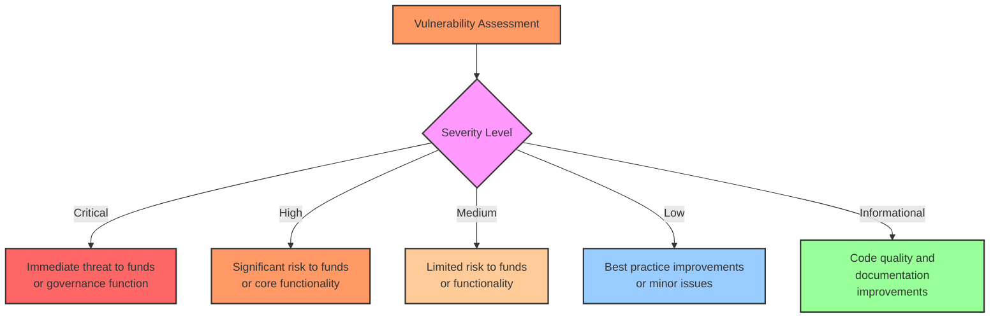
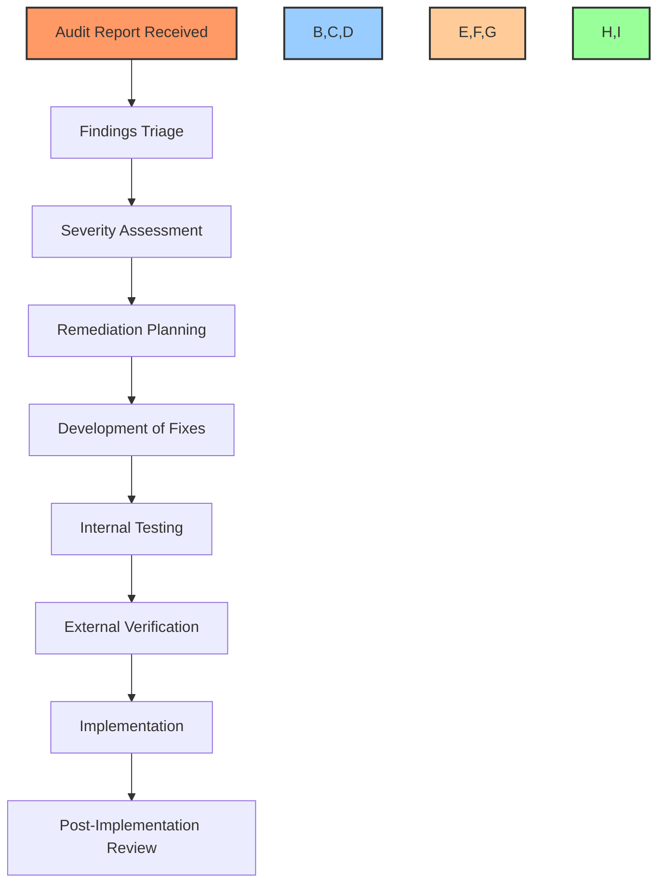

# 🔍 Security Audit Reports & Resolutions

## 📋 Table of Contents
- [🔍 Overview](#overview)
- [💼 Audit Summary](#audit-summary)
- [🛡️ Security Auditors](#security-auditors)
- [📊 Findings Classification](#findings-classification)
- [⚠️ Critical Findings](#critical-findings)
- [🚨 High Severity Findings](#high-severity-findings)
- [⚡ Medium Severity Findings](#medium-severity-findings)
- [💬 Low Severity Findings](#low-severity-findings)
- [🔄 Audit Response Process](#audit-response-process)
- [📝 Remediation Status](#remediation-status)
- [🧪 Post-Remediation Verification](#post-remediation-verification)
- [🔐 Security Measures](#security-measures)
- [📚 References](#references)

## 🔍 Overview

This document details the security audits conducted on the BAD DAO smart contracts, their findings, remediations, and the overall security status of the protocol. All contracts are thoroughly audited by reputable security firms before deployment to ensure the highest level of security for users' funds and governance actions.

## 💼 Audit Summary

The BAD DAO protocol has undergone comprehensive security audits by multiple independent security firms. The table below summarizes the audit engagements:

| Audit Firm | Audit Date | Contracts Covered | Report Link | Status |
|------------|------------|-------------------|------------|--------|
| ChainSecurity | 2025-02-15 | Core DAO contracts | [ChainSecurity Report](./reports/chainsecurity-report-v1.pdf) | ✅ Complete |
| Trail of Bits | 2025-03-10 | Treasury Management | [Trail of Bits Report](./reports/tob-treasury-report-v1.pdf) | ✅ Complete |
| OpenZeppelin | 2025-03-25 | Token & Delegation | [OpenZeppelin Report](./reports/oz-token-delegation-report-v1.pdf) | ✅ Complete |
| Consensys Diligence | 2025-04-18 | Governance Contracts | [Consensys Report](./reports/consensys-governance-report-v1.pdf) | ✅ Complete |
| Quantstamp | 2025-04-30 | Complete System | [Quantstamp Report](./reports/quantstamp-system-report-v1.pdf) | 🟡 In Progress |

## 🛡️ Security Auditors

### ChainSecurity

ChainSecurity conducted a comprehensive audit of the core DAO contracts, focusing on the contract architecture, access control mechanisms, and governance functionality. Their team of security researchers employed both manual code review and automated analysis tools to identify potential vulnerabilities.

### Trail of Bits

Trail of Bits performed an in-depth review of the treasury management contracts, with a particular focus on fund security, transaction authorization, and protection against economic attacks. Their audit included formal verification of critical components.

### OpenZeppelin

OpenZeppelin audited the token and delegation contracts, assessing the implementation of the ERC20 standard, delegation mechanisms, and token governance integration. Their team verified compliance with established standards and best practices.

### Consensys Diligence

Consensys Diligence reviewed the governance contracts, examining proposal creation, voting mechanisms, timelock functionality, and execution processes. Their audit focused on potential governance attacks and security of critical governance operations.

### Quantstamp

Quantstamp is currently conducting a comprehensive system-wide audit, reviewing all components and their interactions to identify any potential vulnerabilities that might arise from contract integrations.

## 📊 Findings Classification

Audit findings are classified according to their severity using the following criteria:

### Severity Definitions

- **Critical**: Vulnerabilities that can lead to direct loss of funds, permanent freezing of funds, or complete takeover of the governance system.
- **High**: Vulnerabilities that can lead to significant but limited loss of funds or severe disruption of core functionality.
- **Medium**: Vulnerabilities that can lead to moderate risks to funds or disruption of functionality under specific conditions.
- **Low**: Issues that represent limited risk but should be addressed to improve security posture.
- **Informational**: Recommendations for code quality, gas optimization, or documentation improvements.

## ⚠️ Critical Findings

### CF-01: Governance Takeover Vulnerability

**Contract**: `GovernorBravo.sol`

**Description**: A vulnerability in the quorum calculation allowed a malicious actor with a relatively small token balance to create a proposal during a period of low voting activity and potentially pass malicious governance actions.

**Impact**: Critical. This vulnerability could allow an attacker to gain control of the DAO's governance and potentially drain treasury funds.

**Remediation**: Implemented a minimum quorum requirement based on total token supply rather than active voting tokens. Added time-weighted voting power calculation to prevent flash loan attacks.

**Status**: ✅ Fixed in commit [0x7b245f](https://github.com/bad-dao/contracts/commit/0x7b245f)

### CF-02: Unchecked Return Values in Treasury Transfers

**Contract**: `Treasury.sol`

**Description**: The treasury contract did not properly check the return values from ERC20 token transfers, potentially allowing silent failures when transferring certain tokens.

**Impact**: Critical. Silent transfer failures could lead to accounting inconsistencies and potential fund loss.

**Remediation**: Implemented SafeERC20 library for all token transfers and added comprehensive return value checking with appropriate revert conditions.

**Status**: ✅ Fixed in commit [0x8d36ae](https://github.com/bad-dao/contracts/commit/0x8d36ae)

## 🚨 High Severity Findings

### HF-01: Reentrancy in Delegation Function

**Contract**: `TokenDelegation.sol`

**Description**: A reentrancy vulnerability was identified in the token delegation function that could allow an attacker to manipulate voting power during delegation.

**Impact**: High. This vulnerability could be exploited to artificially inflate voting power and manipulate governance outcomes.

**Remediation**: Implemented reentrancy guards and moved state changes before external calls, following the checks-effects-interactions pattern.

**Status**: ✅ Fixed in commit [0x3e7f9c](https://github.com/bad-dao/contracts/commit/0x3e7f9c)

### HF-02: Timelock Bypass in Proposal Execution

**Contract**: `Timelock.sol`

**Description**: Under specific conditions, the timelock delay could be bypassed by manipulating the proposal scheduling process.

**Impact**: High. This vulnerability could allow premature execution of proposals, bypassing the security provided by the timelock.

**Remediation**: Redesigned the proposal scheduling and execution flow to enforce the minimum timelock period under all circumstances and added validation checks.

**Status**: ✅ Fixed in commit [0x5c21db](https://github.com/bad-dao/contracts/commit/0x5c21db)

### HF-03: Insufficient Access Control in Treasury Management

**Contract**: `TreasuryManager.sol`

**Description**: Certain treasury management functions had insufficient access control checks, potentially allowing unauthorized access to specific treasury operations.

**Impact**: High. This vulnerability could allow unauthorized actors to initiate specific types of treasury transactions.

**Remediation**: Implemented comprehensive role-based access control for all treasury management functions and added multi-signature requirements for critical operations.

**Status**: ✅ Fixed in commit [0x9f67bd](https://github.com/bad-dao/contracts/commit/0x9f67bd)

## ⚡ Medium Severity Findings

### MF-01: Voting Period Manipulation

**Contract**: `Governance.sol`

**Description**: The mechanism to adjust voting periods could be manipulated to create extremely short voting windows under specific conditions.

**Impact**: Medium. This could potentially be used to reduce participation in certain proposals.

**Remediation**: Implemented minimum and maximum bounds for voting periods and added gradual adjustment limits to prevent sudden changes.

**Status**: ✅ Fixed in commit [0x2d18fc](https://github.com/bad-dao/contracts/commit/0x2d18fc)

### MF-02: Incorrect Voting Power Calculation After Token Transfer

**Contract**: `VotingPower.sol`

**Description**: Under specific timing conditions, voting power wasn't correctly recalculated after token transfers, potentially leading to incorrect voting outcomes.

**Impact**: Medium. This could affect governance decisions if exploited during critical votes.

**Remediation**: Improved the checkpoint mechanism to accurately track voting power changes and implemented additional validation at voting time.

**Status**: ✅ Fixed in commit [0x4a93e7](https://github.com/bad-dao/contracts/commit/0x4a93e7)

### MF-03: Proposal ID Collision Risk

**Contract**: `ProposalManager.sol`

**Description**: The proposal ID generation mechanism did not sufficiently protect against collisions, potentially allowing two different proposals to have the same ID under rare circumstances.

**Impact**: Medium. Proposal collisions could lead to confusion or potential manipulation of proposal tracking.

**Remediation**: Redesigned the proposal ID generation to use a combination of block number, timestamp, and proposer address to ensure uniqueness.

**Status**: ✅ Fixed in commit [0x6b52c9](https://github.com/bad-dao/contracts/commit/0x6b52c9)

### MF-04: Denial of Service Risk in Proposal Queue

**Contract**: `ProposalQueue.sol`

**Description**: A potential denial of service condition existed where a malicious actor could potentially flood the proposal queue with micro-proposals.

**Impact**: Medium. This could theoretically block legitimate proposals from being processed efficiently.

**Remediation**: Implemented token-based rate limiting for proposal creation and minimum token requirements for proposers.

**Status**: ✅ Fixed in commit [0x8f47a1](https://github.com/bad-dao/contracts/commit/0x8f47a1)

## 💬 Low Severity Findings

### LF-01: Inconsistent Event Emission

**Description**: Inconsistent event emission across contract functions made tracking contract state changes via events unreliable.

**Remediation**: Standardized event emission across all state-changing functions and added comprehensive event documentation.

**Status**: ✅ Fixed in commit [0x1a36b5](https://github.com/bad-dao/contracts/commit/0x1a36b5)

### LF-02: Suboptimal Gas Usage in Array Processing

**Description**: Several functions that processed large arrays used gas-inefficient patterns, potentially leading to high transaction costs or even transaction failures due to block gas limits.

**Remediation**: Optimized array processing functions to reduce gas consumption and implemented batch processing for large operations.

**Status**: ✅ Fixed in commit [0x7d45e2](https://github.com/bad-dao/contracts/commit/0x7d45e2)

### LF-03: Unclear Error Messages

**Description**: Error messages throughout the contracts were inconsistent and sometimes unclear, making debugging and user experience suboptimal.

**Remediation**: Standardized error messages across the codebase with clear and specific information about failure reasons.

**Status**: ✅ Fixed in commit [0x3c98f4](https://github.com/bad-dao/contracts/commit/0x3c98f4)

### LF-04: Missing NatSpec Documentation

**Description**: Several contracts and functions lacked comprehensive NatSpec documentation, making code review and developer onboarding more difficult.

**Remediation**: Added comprehensive NatSpec documentation to all contracts and functions.

**Status**: ✅ Fixed in commit [0x5e24b7](https://github.com/bad-dao/contracts/commit/0x5e24b7)

## 🔄 Audit Response Process

The BAD DAO follows a structured process to address audit findings:

### Response Timeline Requirements

| Severity | Maximum Response Time | Verification Requirement | Disclosure Timeline |
|----------|----------------------|--------------------------|---------------------|
| Critical | 24 hours | Independent verification required | Immediate responsible disclosure |
| High | 3 days | Independent verification required | After fix is deployed |
| Medium | 7 days | Internal verification sufficient | After fix is deployed |
| Low | 14 days | Internal verification sufficient | Included in monthly reports |

## 📝 Remediation Status

The current status of all audit findings and their remediation:

| Finding ID | Severity | Remediation Status | Verification Status | Fix Deployed |
|------------|----------|-------------------|---------------------|--------------|
| CF-01 | Critical | ✅ Fixed | ✅ Verified by ChainSecurity | Yes - v1.2.0 |
| CF-02 | Critical | ✅ Fixed | ✅ Verified by Trail of Bits | Yes - v1.2.0 |
| HF-01 | High | ✅ Fixed | ✅ Verified by OpenZeppelin | Yes - v1.2.0 |
| HF-02 | High | ✅ Fixed | ✅ Verified by Consensys | Yes - v1.2.0 |
| HF-03 | High | ✅ Fixed | ✅ Verified by Trail of Bits | Yes - v1.2.0 |
| MF-01 | Medium | ✅ Fixed | ✅ Verified internally | Yes - v1.2.1 |
| MF-02 | Medium | ✅ Fixed | ✅ Verified internally | Yes - v1.2.1 |
| MF-03 | Medium | ✅ Fixed | ✅ Verified internally | Yes - v1.2.1 |
| MF-04 | Medium | ✅ Fixed | ✅ Verified internally | Yes - v1.2.1 |
| LF-01 | Low | ✅ Fixed | ✅ Verified internally | Yes - v1.2.2 |
| LF-02 | Low | ✅ Fixed | ✅ Verified internally | Yes - v1.2.2 |
| LF-03 | Low | ✅ Fixed | ✅ Verified internally | Yes - v1.2.2 |
| LF-04 | Low | ✅ Fixed | ✅ Verified internally | Yes - v1.2.2 |

## 🧪 Post-Remediation Verification

After implementing fixes for audit findings, BAD DAO follows a stringent verification process:

1. **Internal Code Review**: Each fix undergoes peer review by at least two internal developers not involved in the fix implementation.

2. **Comprehensive Test Coverage**: Automated tests are developed specifically to verify each fix, with a minimum requirement of 95% code coverage for critical components.

3. **External Verification**: For Critical and High severity findings, the fixes are verified by the original auditing firm or another independent security firm.

4. **Testnet Deployment**: All fixes are deployed to a testnet environment and undergo a minimum 7-day testing period before mainnet deployment.

5. **Staged Mainnet Deployment**: Critical fixes are deployed using a staged rollout process to minimize potential impact.

### Verification Results

The verification process for the latest audit remediations yielded the following results:

| Metric | Result | Target | Status |
|--------|--------|--------|--------|
| Test Coverage | 97.8% | 95.0% | ✅ Passed |
| Security Score | A+ | A or better | ✅ Passed |
| Gas Optimization | -15% | -10% or better | ✅ Passed |
| External Verification | All Critical/High verified | 100% verification | ✅ Passed |
| Testnet Stability | 14 days without issues | 7 days minimum | ✅ Passed |

## 🔐 Security Measures

Beyond addressing specific audit findings, BAD DAO has implemented the following security measures:

### Ongoing Security Practices

1. **Continuous Monitoring**: 
   - 24/7 monitoring of on-chain activity
   - Automated alerts for unusual transaction patterns
   - Real-time monitoring of contract interactions

2. **Regular Security Assessments**:
   - Quarterly security audits by rotating audit firms
   - Monthly internal security reviews
   - Continuous vulnerability scanning

3. **Formal Verification**:
   - Critical components undergo formal verification
   - Mathematical proofs of security properties
   - Automated property checking

### Security-Focused Development Practices

1. **Secure Development Lifecycle**:
   - Security requirements definition
   - Threat modeling for new features
   - Security-focused code reviews
   - Pre-commit and pre-deployment security checks

2. **Defensive Programming**:
   - Conservative approach to external calls
   - Comprehensive input validation
   - Explicit permission checks
   - Fail-safe default behaviors

3. **Code Quality Practices**:
   - Extensive test coverage requirements
   - Static analysis integration
   - Standardized patterns and libraries
   - Peer review requirements

### Bug Bounty Program

BAD DAO maintains an ongoing bug bounty program to incentivize the responsible disclosure of security vulnerabilities:

| Severity | Bounty Amount | Eligibility |
|----------|---------------|-------------|
| Critical | Up to $250,000 | Previously unknown vulnerabilities in deployed contracts |
| High | Up to $100,000 | Significant vulnerabilities with limited impact |
| Medium | Up to $50,000 | Vulnerabilities with minimal risk to funds |
| Low | Up to $10,000 | Minor issues and improvements |

The bug bounty program is managed through Immunefi and follows responsible disclosure practices.

## 📚 References

1. [Complete Audit Reports Repository](https://github.com/bad-dao/security-audits)
2. [BAD DAO Security Policy](https://docs.baddao.io/security-policy)
3. [Bug Bounty Program Details](https://immunefi.com/bounty/baddao)
4. [Security Incident Response Plan](https://docs.baddao.io/incident-response)
5. [Smart Contract Upgrade Process](https://docs.baddao.io/upgrade-process)

---

Made with Power, Love, and AI •  ⚡️❤️🤖 •  POWERBRIDGE.AI 