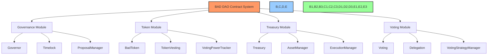
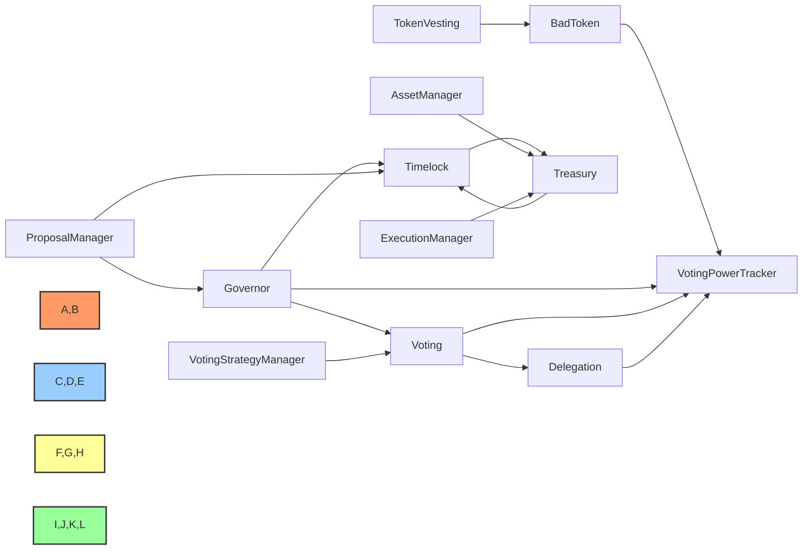
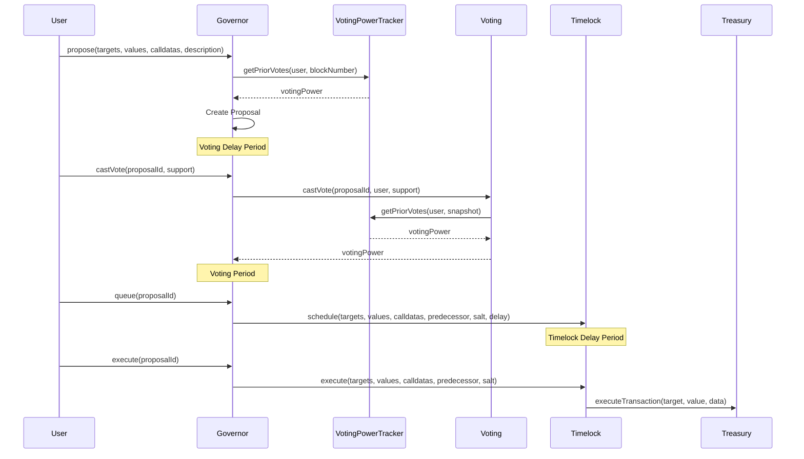
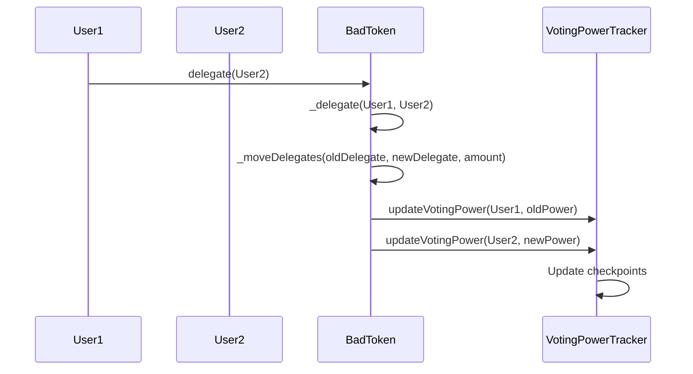
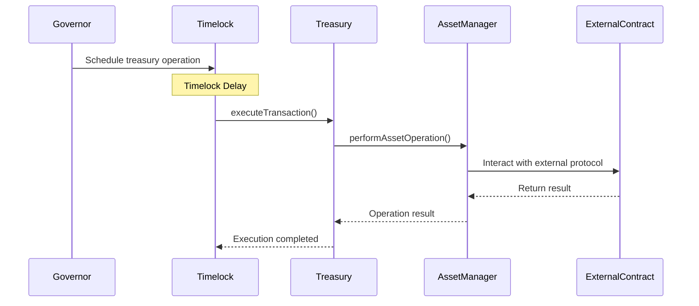
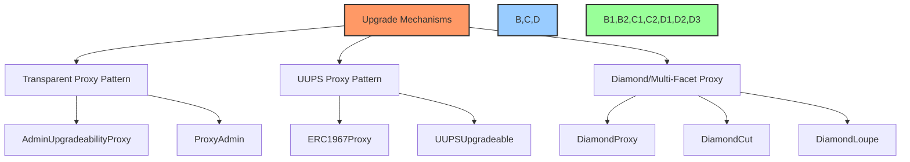
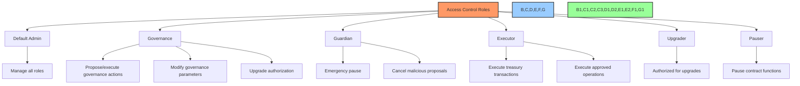

# 🏗️ Smart Contract Architecture & Relationships

## 📋 Table of Contents
- [🔍 Overview](#overview)
- [🎯 Purpose](#purpose)
- [🏗️ Contract Architecture](#contract-architecture)
- [🧩 Core Contract Components](#core-contract-components)
- [🔄 Contract Interactions](#contract-interactions)
- [⚙️ Upgrade Mechanisms](#upgrade-mechanisms)
- [🔐 Access Control System](#access-control-system)
- [💾 Data Storage Patterns](#data-storage-patterns)
- [🔄 Event System](#event-system)
- [📊 Implementation Status](#implementation-status)

## 🔍 Overview

This document provides a comprehensive description of the BAD DAO smart contract architecture, detailing the relationships between contracts, upgrade patterns, access control mechanisms, and data flow within the system.

## 🎯 Purpose

The contract architecture documentation aims to:
- Define the overall structure of the smart contract system
- Explain the purpose and interactions of each contract
- Document the upgrade mechanisms and governance controls
- Establish security boundaries and access control patterns
- Provide a reference for developers and auditors

## 🏗️ Contract Architecture

### System Architecture Diagram



### Architecture Design Principles

1. **Modularity**: Contracts are designed as specialized components with clear responsibilities
2. **Upgradability**: Strategic use of proxy patterns for upgradable components
3. **Access Control**: Fine-grained permission system for contract functions
4. **Security First**: Defense in depth with multiple security layers
5. **Gas Efficiency**: Optimized data structures and operations
6. **Governance-Driven**: Changes controlled through DAO governance

### Contract Dependency Graph



## 🧩 Core Contract Components

### Governance Module

| Contract | Purpose | Upgradable | Dependencies |
|----------|---------|------------|--------------|
| Governor | Primary governance contract that processes proposals | Yes | Timelock, VotingPowerTracker, Voting |
| Timelock | Time-delayed execution of governance decisions | No | None |
| ProposalManager | Handles proposal creation, cancellation, and metadata | Yes | Governor, Timelock |

#### Governor Contract

The Governor contract serves as the main governance mechanism, handling proposal lifecycle and voting:

```solidity
// SPDX-License-Identifier: MIT
pragma solidity ^0.8.17;

import "@openzeppelin/contracts-upgradeable/governance/GovernorUpgradeable.sol";
import "@openzeppelin/contracts-upgradeable/governance/extensions/GovernorSettingsUpgradeable.sol";
import "@openzeppelin/contracts-upgradeable/governance/extensions/GovernorTimelockControlUpgradeable.sol";
import "@openzeppelin/contracts-upgradeable/proxy/utils/Initializable.sol";
import "@openzeppelin/contracts-upgradeable/proxy/utils/UUPSUpgradeable.sol";

contract BADGovernor is 
    Initializable, 
    GovernorUpgradeable, 
    GovernorSettingsUpgradeable,
    GovernorTimelockControlUpgradeable,
    UUPSUpgradeable 
{
    // Contract implementation
    
    function initialize(
        IVotingPowerTracker _token,
        TimelockControllerUpgradeable _timelock
    ) public initializer {
        __Governor_init("BADGovernor");
        __GovernorSettings_init(
            1 days,    // Voting delay
            7 days,    // Voting period
            100e18     // Proposal threshold
        );
        __GovernorTimelockControl_init(_timelock);
        __UUPSUpgradeable_init();
    }
    
    function _authorizeUpgrade(address newImplementation) internal override onlyGovernance {}
    
    // Additional governance functionality
}
```

### Token Module

| Contract | Purpose | Upgradable | Dependencies |
|----------|---------|------------|--------------|
| BadToken | ERC20 governance token | No | None |
| TokenVesting | Manages token vesting schedules | Yes | BadToken |
| VotingPowerTracker | Tracks voting power including delegations | Yes | BadToken |

#### BadToken Contract

The BadToken implements the ERC20 standard with voting and delegation capabilities:

```solidity
// SPDX-License-Identifier: MIT
pragma solidity ^0.8.17;

import "@openzeppelin/contracts/token/ERC20/extensions/ERC20Votes.sol";
import "@openzeppelin/contracts/access/AccessControl.sol";

contract BadToken is ERC20Votes, AccessControl {
    bytes32 public constant MINTER_ROLE = keccak256("MINTER_ROLE");
    
    constructor(
        string memory name,
        string memory symbol,
        uint256 initialSupply,
        address initialHolder
    ) ERC20(name, symbol) ERC20Permit(name) {
        _setupRole(DEFAULT_ADMIN_ROLE, msg.sender);
        _setupRole(MINTER_ROLE, msg.sender);
        
        _mint(initialHolder, initialSupply);
    }
    
    function mint(address to, uint256 amount) external onlyRole(MINTER_ROLE) {
        _mint(to, amount);
    }
    
    // Additional token functionality
}
```

### Treasury Module

| Contract | Purpose | Upgradable | Dependencies |
|----------|---------|------------|--------------|
| Treasury | Stores and manages DAO assets | Yes | Timelock |
| AssetManager | Handles asset allocation and investment strategies | Yes | Treasury |
| ExecutionManager | Executes financial transactions after approval | Yes | Treasury, Timelock |

#### Treasury Contract

The Treasury contract manages all DAO assets and provides secure transaction execution:

```solidity
// SPDX-License-Identifier: MIT
pragma solidity ^0.8.17;

import "@openzeppelin/contracts-upgradeable/proxy/utils/Initializable.sol";
import "@openzeppelin/contracts-upgradeable/proxy/utils/UUPSUpgradeable.sol";
import "@openzeppelin/contracts-upgradeable/access/AccessControlUpgradeable.sol";
import "@openzeppelin/contracts-upgradeable/token/ERC20/utils/SafeERC20Upgradeable.sol";

contract Treasury is 
    Initializable, 
    AccessControlUpgradeable, 
    UUPSUpgradeable 
{
    using SafeERC20Upgradeable for IERC20Upgradeable;
    
    bytes32 public constant EXECUTOR_ROLE = keccak256("EXECUTOR_ROLE");
    bytes32 public constant GOVERNANCE_ROLE = keccak256("GOVERNANCE_ROLE");
    
    function initialize(address _governance, address _executor) public initializer {
        __AccessControl_init();
        __UUPSUpgradeable_init();
        
        _setupRole(GOVERNANCE_ROLE, _governance);
        _setupRole(EXECUTOR_ROLE, _executor);
        _setupRole(DEFAULT_ADMIN_ROLE, _governance);
    }
    
    function executeTransaction(
        address to,
        uint256 value,
        bytes memory data
    ) external onlyRole(EXECUTOR_ROLE) returns (bool success, bytes memory result) {
        // Transaction execution logic
        (success, result) = to.call{value: value}(data);
        require(success, "Transaction execution failed");
    }
    
    function _authorizeUpgrade(address newImplementation) internal override onlyRole(GOVERNANCE_ROLE) {}
    
    // Additional treasury functionality
}
```

### Voting Module

| Contract | Purpose | Upgradable | Dependencies |
|----------|---------|------------|--------------|
| Voting | Manages the voting process | Yes | VotingPowerTracker |
| Delegation | Handles vote delegation | Yes | VotingPowerTracker |
| VotingStrategyManager | Pluggable voting strategies | Yes | Voting |

#### Voting Contract

The Voting contract implements the core voting functionality:

```solidity
// SPDX-License-Identifier: MIT
pragma solidity ^0.8.17;

import "@openzeppelin/contracts-upgradeable/proxy/utils/Initializable.sol";
import "@openzeppelin/contracts-upgradeable/proxy/utils/UUPSUpgradeable.sol";
import "@openzeppelin/contracts-upgradeable/access/AccessControlUpgradeable.sol";

contract Voting is 
    Initializable, 
    AccessControlUpgradeable, 
    UUPSUpgradeable 
{
    bytes32 public constant GOVERNOR_ROLE = keccak256("GOVERNOR_ROLE");
    
    IVotingPowerTracker public votingPowerTracker;
    
    struct Vote {
        uint8 support; // 0 = against, 1 = for, 2 = abstain
        uint256 votingPower;
        address voter;
        uint256 timestamp;
    }
    
    mapping(uint256 => mapping(address => Vote)) private _proposalVotes;
    
    function initialize(address _governor, address _votingPowerTracker) public initializer {
        __AccessControl_init();
        __UUPSUpgradeable_init();
        
        _setupRole(GOVERNOR_ROLE, _governor);
        _setupRole(DEFAULT_ADMIN_ROLE, _governor);
        
        votingPowerTracker = IVotingPowerTracker(_votingPowerTracker);
    }
    
    function castVote(
        uint256 proposalId,
        address voter,
        uint8 support
    ) external onlyRole(GOVERNOR_ROLE) returns (uint256) {
        // Voting logic implementation
    }
    
    function _authorizeUpgrade(address newImplementation) internal override onlyRole(GOVERNOR_ROLE) {}
    
    // Additional voting functionality
}
```

## 🔄 Contract Interactions

### Proposal Flow Sequence



### Token Delegation Flow



### Treasury Operation Flow



## ⚙️ Upgrade Mechanisms

### Upgrade Pattern Architecture



### Upgrade Control Flow

The BAD DAO system uses the UUPS (Universal Upgradeable Proxy Standard) pattern for most upgradeable contracts:

```solidity
// Upgrade control example
function _authorizeUpgrade(address newImplementation) internal override {
    // Ensure only governance can upgrade
    require(msg.sender == address(timelock), "Only governance can upgrade");
    
    // Optional: Additional validation of the new implementation
    // IUpgradeValidation(newImplementation).validateUpgrade();
}
```

### Upgrade Security

1. **Timelock Protection**: All upgrades must pass through the timelock
2. **Governance Approval**: Upgrades require a successful governance vote
3. **Implementation Validation**: New implementations can be validated before upgrade
4. **Emergency Recovery**: Guardian role can pause but not upgrade contracts
5. **Transparent Announcements**: All upgrade proposals are publicly announced and discussed

## 🔐 Access Control System

### Role-Based Access Control

The contract system implements a role-based access control system using OpenZeppelin's AccessControl:

```solidity
// Role definitions
bytes32 public constant GOVERNANCE_ROLE = keccak256("GOVERNANCE_ROLE");
bytes32 public constant GUARDIAN_ROLE = keccak256("GUARDIAN_ROLE");
bytes32 public constant EXECUTOR_ROLE = keccak256("EXECUTOR_ROLE");
bytes32 public constant UPGRADER_ROLE = keccak256("UPGRADER_ROLE");
bytes32 public constant PAUSER_ROLE = keccak256("PAUSER_ROLE");
```

### Permission Structure



### Privilege Delegation

In the normal operating flow, privileges flow from governance to execution:

1. **Governance (DAO)** → Controls all system parameters and upgrades
2. **Timelock** → Schedules and executes governance-approved actions
3. **Executor** → Has permission to call specific functions after governance approval
4. **Module-Specific Roles** → Limited to specific domains of functionality

## 💾 Data Storage Patterns

### Storage Layout

The system uses careful storage management to facilitate upgrades:

```solidity
// Storage layout example for upgradeable contract
contract TreasuryStorage {
    // Storage slot 0
    address private _admin;
    
    // Storage slot 1
    mapping(address => bool) private _authorized;
    
    // Storage slot 2
    uint256 private _totalAssets;
    
    // Storage slot 3
    mapping(address => uint256) private _assetBalances;
    
    // Gap for future storage variables
    uint256[50] private __gap;
}
```

### Eternal Storage Pattern

For critical data that must persist across upgrades, the system uses the eternal storage pattern:

```solidity
contract EternalStorage {
    mapping(bytes32 => uint256) private uintStorage;
    mapping(bytes32 => string) private stringStorage;
    mapping(bytes32 => address) private addressStorage;
    mapping(bytes32 => bytes) private bytesStorage;
    mapping(bytes32 => bool) private boolStorage;
    mapping(bytes32 => int256) private intStorage;
    
    // Getters and setters for each type
    function getUint(bytes32 key) external view returns (uint256) {
        return uintStorage[key];
    }
    
    function setUint(bytes32 key, uint256 value) external onlyAuthorized {
        uintStorage[key] = value;
    }
    
    // Additional getters and setters
}
```

### Proxy Storage Patterns

For proxied contracts, the system carefully manages storage to avoid collisions:

1. **Unstructured Storage**: Uses ERC-1967 storage slots for proxy-specific data
2. **Namespaced Storage**: Uses hashed keys to prevent storage collisions
3. **Storage Gaps**: Reserves space for future variable additions

## 🔄 Event System

### Core Events

Each contract emits events to facilitate off-chain tracking and UI updates:

```solidity
// Governor events
event ProposalCreated(
    uint256 proposalId,
    address proposer,
    address[] targets,
    uint256[] values,
    string[] signatures,
    bytes[] calldatas,
    uint256 startBlock,
    uint256 endBlock,
    string description
);

event ProposalExecuted(uint256 proposalId);
event ProposalQueued(uint256 proposalId, uint256 eta);
event ProposalCanceled(uint256 proposalId);
event VoteCast(address indexed voter, uint256 proposalId, uint8 support, uint256 weight);

// Treasury events
event TransactionExecuted(address indexed target, uint256 value, bytes data, bytes result);
event FundsReceived(address indexed sender, uint256 amount);
event AssetTransferred(address indexed token, address indexed recipient, uint256 amount);

// Token events
event DelegateChanged(address indexed delegator, address indexed fromDelegate, address indexed toDelegate);
event DelegateVotesChanged(address indexed delegate, uint256 previousBalance, uint256 newBalance);
```

### Event-Based Indexing

The event system is designed to enable comprehensive off-chain indexing:

1. **Indexed Parameters**: Key parameters are indexed for efficient filtering
2. **Comprehensive Data**: Events contain all necessary data for off-chain reconstruction
3. **Chronological Tracking**: Events follow the lifecycle of system objects
4. **Relationship Tracking**: Events include IDs to track relationships between actions

## 📊 Implementation Status

| Contract | Development | Testing | Audit | Documentation |
|----------|-------------|---------|-------|---------------|
| Governor | 🟢 Complete | 🟢 Complete | 🟢 Complete | 🟢 Complete |
| Timelock | 🟢 Complete | 🟢 Complete | 🟢 Complete | 🟢 Complete |
| ProposalManager | 🟢 Complete | 🟡 In Progress | 🔴 Not Started | 🟢 Complete |
| BadToken | 🟢 Complete | 🟢 Complete | 🟢 Complete | 🟢 Complete |
| TokenVesting | 🟢 Complete | 🟢 Complete | 🟡 In Progress | 🟢 Complete |
| VotingPowerTracker | 🟢 Complete | 🟡 In Progress | 🔴 Not Started | 🟢 Complete |
| Treasury | 🟢 Complete | 🟡 In Progress | 🟡 In Progress | 🟢 Complete |
| AssetManager | 🟡 In Progress | 🔴 Not Started | 🔴 Not Started | 🟢 Complete |
| ExecutionManager | 🟡 In Progress | 🔴 Not Started | 🔴 Not Started | 🟡 In Progress |
| Voting | 🟢 Complete | 🟡 In Progress | 🔴 Not Started | 🟢 Complete |
| Delegation | 🟢 Complete | 🟡 In Progress | 🔴 Not Started | 🟢 Complete |
| VotingStrategyManager | 🟡 In Progress | 🔴 Not Started | 🔴 Not Started | 🟡 In Progress |

### 🔄 Next Implementation Steps

1. Complete the AssetManager implementation
2. Finalize ExecutionManager development
3. Complete VotingStrategyManager implementation
4. Finish testing of Voting and Delegation contracts
5. Schedule audits for remaining contracts

---

Made with Power, Love, and AI •  ⚡️❤️🤖 •  POWERBRIDGE.AI 