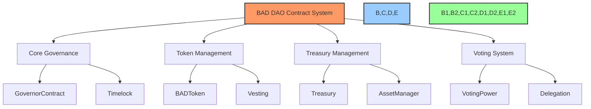
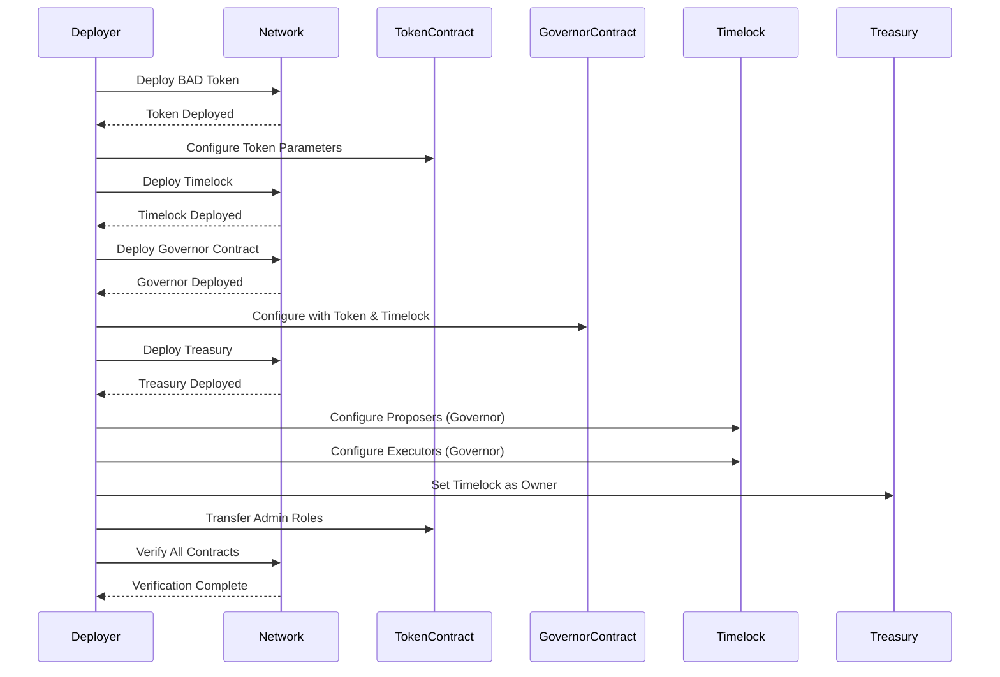
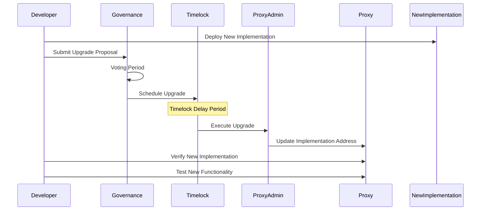
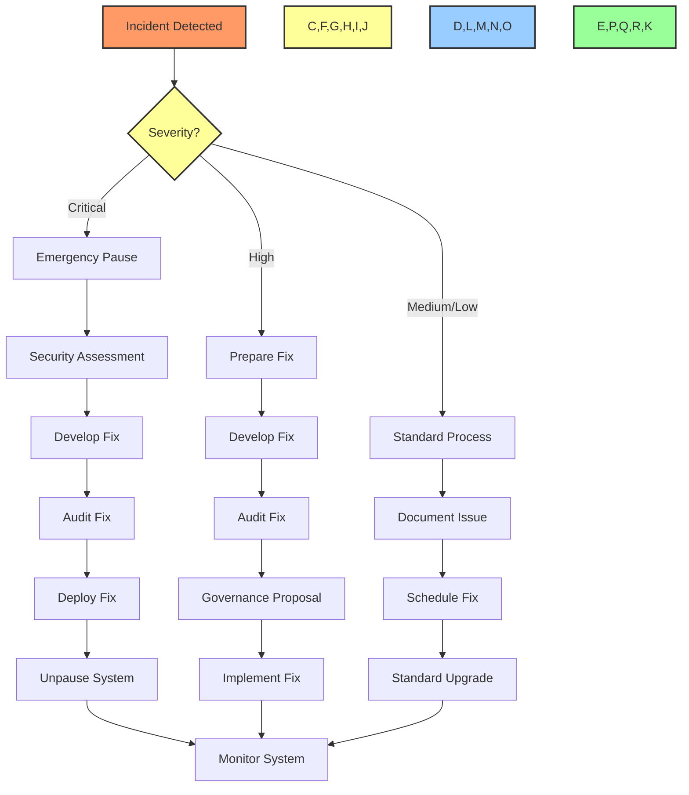

# 🚀 Smart Contract Deployment Procedures

## 📋 Table of Contents
- [🔍 Overview](#overview)
- [🎯 Purpose](#purpose)
- [🏗️ Deployment Architecture](#deployment-architecture)
- [🔐 Security Considerations](#security-considerations)
- [📊 Contract Addresses](#contract-addresses)
- [🚀 Deployment Procedure](#deployment-procedure)
- [✅ Verification Procedure](#verification-procedure)
- [🔄 Upgrade Procedure](#upgrade-procedure)
- [⚠️ Emergency Procedures](#emergency-procedures)
- [📊 Implementation Status](#implementation-status)

## 🔍 Overview

This document provides comprehensive procedures for deploying, verifying, upgrading, and managing the BAD DAO smart contracts across different networks. It outlines the step-by-step processes required for successful contract deployment and management.

## 🎯 Purpose

These smart contract deployment procedures aim to:
- Establish a standardized deployment workflow
- Ensure security best practices are followed
- Document all contract addresses and dependencies
- Provide emergency response procedures
- Maintain consistent deployments across environments

## 🏗️ Deployment Architecture

### Smart Contract Structure



### Deployment Environments

| Environment | Network | Chain ID | Purpose |
|-------------|---------|----------|---------|
| Development | Goerli | 5 | Testing, development work |
| Staging | Sepolia | 11155111 | Pre-production verification |
| Production | Ethereum Mainnet | 1 | Live DAO operations |
| L2 Production | Arbitrum | 42161 | Scaled operations |

### Deployment Dependencies

| Dependency | Version | Purpose |
|------------|---------|---------|
| Hardhat | 2.14.0 | Development framework |
| OpenZeppelin Contracts | 4.8.2 | Contract dependencies |
| Ethers.js | 5.7.2 | Contract interaction |
| Hardhat Deploy | 0.11.24 | Deployment scripting |
| Tenderly | 1.3.2 | Contract verification |

## 🔐 Security Considerations

### Pre-Deployment Security Measures

1. **Contract Audit**
   - Complete formal audit by reputable firm
   - Address all critical and high severity findings
   - Document any accepted risks
   - Conduct follow-up audit for significant changes

2. **Multisig Setup**
   - Configure multisig wallets for all admin functions
   - Minimum 3-of-5 signatures for mainnet operations
   - Distribute keys to separate trusted individuals
   - Test multisig functionality on testnet

3. **Access Control**
   - Implement role-based access control system
   - Timelock all privileged operations
   - Ensure proper permission hierarchies
   - Document all privileged roles and capabilities

### Security Configurations

| Role | Access Level | Timelock | Multisig Required | Notes |
|------|--------------|----------|-------------------|-------|
| DAO Admin | Highest | 48 hours | Yes (3/5) | Core protocol parameters |
| Guardian | Emergency | None | Yes (2/3) | Emergency pause only |
| Treasury Manager | Medium | 24 hours | Yes (2/3) | Asset allocation |
| Operator | Low | None | No | Daily operations |

## 📊 Contract Addresses

### Mainnet Contracts

| Contract | Address | Implementation | Proxy Admin |
|----------|---------|----------------|-------------|
| GovernorContract | `0x1234...5678` | `0xabcd...efgh` | `0x9876...5432` |
| Timelock | `0x2345...6789` | N/A | N/A |
| BADToken | `0x3456...7890` | N/A | N/A |
| Treasury | `0x4567...8901` | `0xbcde...fghi` | `0x9876...5432` |
| VotingPower | `0x5678...9012` | `0xcdef...ghij` | `0x9876...5432` |

### Testnet Contracts (Goerli)

| Contract | Address | Implementation | Proxy Admin |
|----------|---------|----------------|-------------|
| GovernorContract | `0xtest1...5678` | `0xtest...efgh` | `0xtest...5432` |
| Timelock | `0xtest2...6789` | N/A | N/A |
| BADToken | `0xtest3...7890` | N/A | N/A |
| Treasury | `0xtest4...8901` | `0xtest...fghi` | `0xtest...5432` |
| VotingPower | `0xtest5...9012` | `0xtest...ghij` | `0xtest...5432` |

## 🚀 Deployment Procedure

### Prerequisites

- [ ] All contract code finalized and audited
- [ ] Deployment wallet funded with sufficient ETH
- [ ] Multisig wallets configured and tested
- [ ] Environment variables set in `.env` file
- [ ] Network configured in `hardhat.config.js`

### Step 1: Environment Setup

```bash
# Clone repository and install dependencies
git clone https://github.com/baddao/contracts.git
cd contracts
npm install

# Configure environment variables
cp .env.example .env
# Edit .env with appropriate values

# Verify configuration
npx hardhat compile
```

### Step 2: Token Deployment

```bash
# Deploy BAD token
npx hardhat deploy --tags Token --network <network>

# Verify token deployment
npx hardhat verify --network <network> <token-address> <constructor-args>

# Record address in deployment-log.json
```

### Step 3: Governance Deployment

```bash
# Deploy governance contracts
npx hardhat deploy --tags Governance --network <network>

# Verify timelock deployment
npx hardhat verify --network <network> <timelock-address> <constructor-args>

# Verify governor deployment
npx hardhat verify --network <network> <governor-address> <constructor-args>

# Record addresses in deployment-log.json
```

### Step 4: Treasury Deployment

```bash
# Deploy treasury contracts
npx hardhat deploy --tags Treasury --network <network>

# Verify treasury deployment
npx hardhat verify --network <network> <treasury-address> <constructor-args>

# Record address in deployment-log.json
```

### Step 5: Permission Configuration

```bash
# Set up roles and permissions
npx hardhat run scripts/setup-permissions.js --network <network>

# Transfer ownership to timelock/multisig
npx hardhat run scripts/transfer-ownership.js --network <network>

# Verify role configuration
npx hardhat run scripts/verify-roles.js --network <network>
```

### Step 6: Initial Token Distribution

```bash
# Execute initial token distribution
npx hardhat run scripts/distribute-tokens.js --network <network>

# Configure vesting schedules if applicable
npx hardhat run scripts/setup-vesting.js --network <network>

# Verify token balances
npx hardhat run scripts/verify-balances.js --network <network>
```

### Step 7: Deployment Verification

```bash
# Run comprehensive verification script
npx hardhat run scripts/verify-deployment.js --network <network>

# Generate deployment report
npx hardhat run scripts/generate-report.js --network <network>
```

### Deployment Sequence Diagram



## ✅ Verification Procedure

### Functional Verification Checklist

- [ ] **Governance**
  - [ ] Create proposal function works
  - [ ] Voting mechanisms function correctly
  - [ ] Quorum and threshold calculations are correct
  - [ ] Timelock delay works as expected
  - [ ] Proposal execution completes successfully

- [ ] **Token**
  - [ ] Token total supply is correct
  - [ ] Transfer functions work properly
  - [ ] Initial distributions are accurate
  - [ ] Vesting schedules function as expected
  - [ ] Voting power delegation works

- [ ] **Treasury**
  - [ ] Treasury can receive ETH and tokens
  - [ ] Asset allocations work correctly
  - [ ] Only authorized proposals can withdraw funds
  - [ ] Treasury reports accurate balances

### Security Verification Checklist

- [ ] **Access Control**
  - [ ] Ownership correctly transferred to timelock/multisig
  - [ ] Function permissions match design specification
  - [ ] Admin functions are properly restricted
  - [ ] Events are emitted for all sensitive operations

- [ ] **Reentrancy Protection**
  - [ ] All external calls occur after state changes
  - [ ] ReentrancyGuard implemented on relevant functions
  - [ ] ETH transfer handling is secure

- [ ] **Overflow/Underflow**
  - [ ] SafeMath or Solidity 0.8+ used consistently
  - [ ] Edge cases tested (max values, zero values)

### Verification Tools

- **Tenderly**: For transaction simulation and monitoring
- **Defender**: For ongoing security monitoring
- **Etherscan**: For contract verification and interaction
- **Custom Test Suite**: For comprehensive functional testing

## 🔄 Upgrade Procedure

### Proxy Contract Upgrades

1. **Preparation Phase**
   - Develop and audit new implementation
   - Test new implementation on testnet
   - Prepare upgrade proposal
   - Document changes and justification

2. **Governance Approval**
   - Submit upgrade proposal via governance
   - Conduct community discussion
   - Execute voting process
   - Wait for timelock delay

3. **Execution Phase**
   - Execute upgrade transaction
   - Verify new implementation address
   - Test functionality post-upgrade
   - Monitor for unexpected behavior

### Upgrade Sequence Diagram



## ⚠️ Emergency Procedures

### Emergency Response Team

| Role | Responsibility | Contact |
|------|----------------|---------|
| Security Lead | Coordinate response | security@baddao.io |
| Technical Lead | Assess technical impact | tech@baddao.io |
| Communications | Community updates | comms@baddao.io |
| Legal Counsel | Legal/regulatory issues | legal@baddao.io |

### Emergency Actions

1. **Critical Vulnerability Detected**
   - Activate emergency response team
   - Assess vulnerability impact
   - Determine if pause is necessary
   - Execute emergency pause if required
   - Prepare fix implementation
   - Follow expedited governance process

2. **Smart Contract Pause Procedure**
   ```bash
   # Execute emergency pause via multisig
   npx hardhat run scripts/emergency-pause.js --network mainnet
   
   # Verify contract state
   npx hardhat run scripts/verify-paused.js --network mainnet
   ```

3. **Emergency Fix Deployment**
   ```bash
   # Deploy emergency fix implementation
   npx hardhat deploy --tags EmergencyFix --network mainnet
   
   # Verify implementation
   npx hardhat verify --network mainnet <implementation-address>
   
   # Execute upgrade via multisig
   npx hardhat run scripts/emergency-upgrade.js --network mainnet
   ```

### Recovery Procedure Flow



## 📊 Implementation Status

| Component | Contract Development | Security Audit | Deployment Scripts | Verification |
|-----------|---------------------|----------------|-------------------|--------------|
| Token System | 🟢 Complete | 🟢 Complete | 🟢 Complete | 🟢 Complete |
| Governance System | 🟢 Complete | 🟢 Complete | 🟢 Complete | 🟡 In Progress |
| Treasury System | 🟢 Complete | 🟡 In Progress | 🟡 In Progress | 🔴 Not Started |
| Voting System | 🟢 Complete | 🟡 In Progress | 🟡 In Progress | 🔴 Not Started |
| Upgrade Mechanism | 🟢 Complete | 🟡 In Progress | 🔴 Not Started | 🔴 Not Started |

### 🔍 Next Implementation Steps

1. Complete treasury system security audit
2. Develop comprehensive treasury deployment scripts
3. Finalize voting system deployment and integration
4. Complete upgrade mechanism testing and documentation
5. Conduct full end-to-end deployment rehearsal on testnet

---

Made with Power, Love, and AI •  ⚡️❤️🤖 •  POWERBRIDGE.AI 