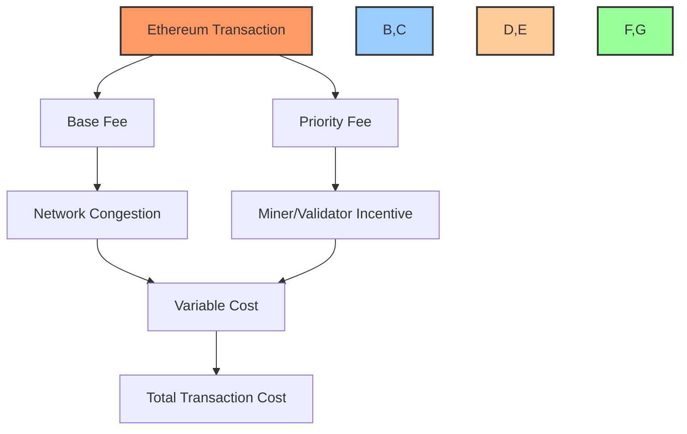
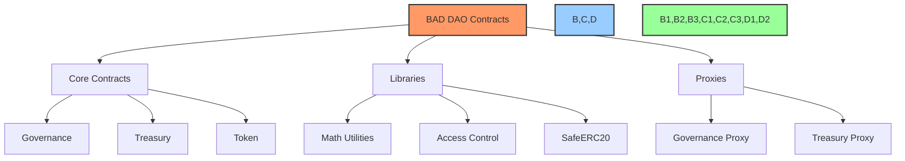
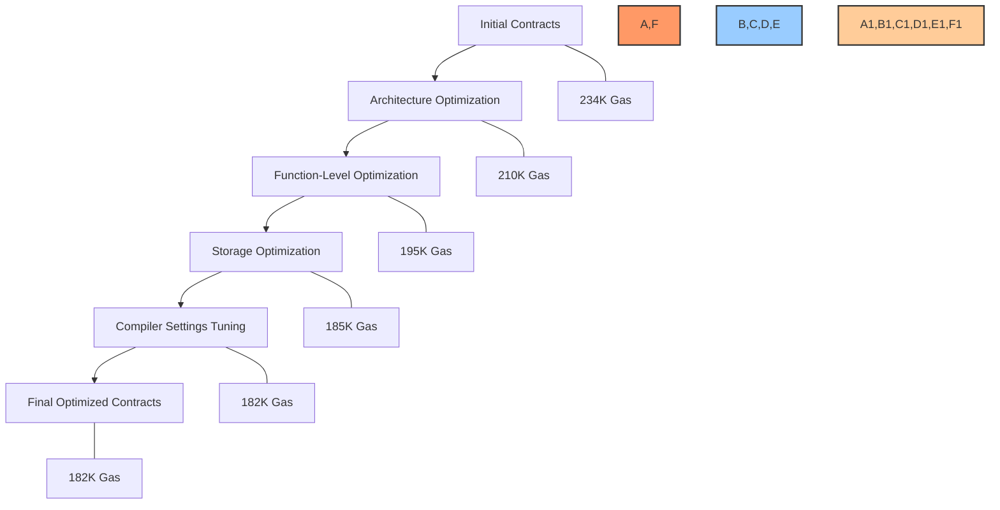
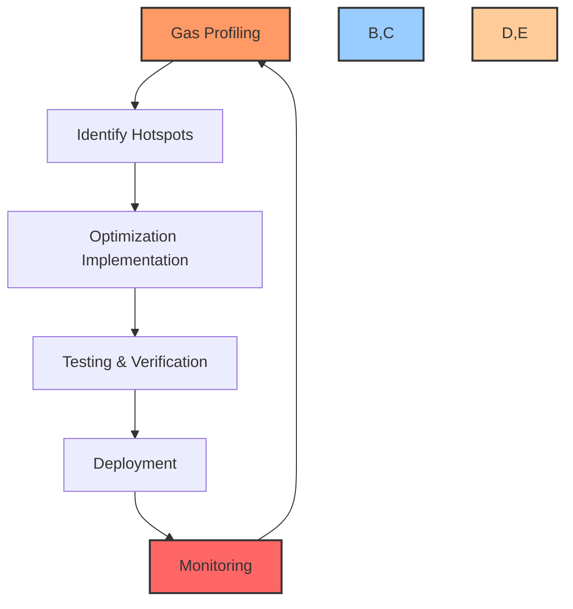

# ⚡ Gas Optimization Strategies

## 📋 Table of Contents
- [🔍 Overview](#overview)
- [💸 Gas Costs in Ethereum](#gas-costs-in-ethereum)
- [🎯 Optimization Goals](#optimization-goals)
- [⚙️ Contract-Level Optimizations](#contract-level-optimizations)
- [🧮 Function-Level Optimizations](#function-level-optimizations)
- [🧱 Storage Optimizations](#storage-optimizations)
- [📊 Benchmark Results](#benchmark-results)
- [📝 Optimization Patterns](#optimization-patterns)
- [🔄 Continuous Optimization Process](#continuous-optimization-process)
- [📚 Tools & Resources](#tools--resources)

## 🔍 Overview

This document outlines the gas optimization strategies employed in the BAD DAO smart contracts. Gas optimization is critical for ensuring cost-effective interactions with the DAO, making governance and treasury management accessible to all participants regardless of network conditions. The strategies described here balance code readability and maintainability with gas efficiency.

## 💸 Gas Costs in Ethereum

Gas is the unit of measurement for computational and storage operations on the Ethereum network. Every operation in the Ethereum Virtual Machine (EVM) has an associated gas cost, and users must pay for these costs when interacting with smart contracts.

### Gas Price Dynamics



### Common Gas Costs

| Operation | Approximate Gas Cost | Notes |
|-----------|---------------------|-------|
| Transaction base cost | 21,000 | Fixed cost for any transaction |
| Storage write (new) | 20,000 | Writing to a previously unused storage slot |
| Storage write (update) | 5,000 | Updating an existing storage slot |
| Storage read | 200 | Reading from storage |
| Memory read/write | 3 | Per word, increases with memory size |
| External call | 700+ | Plus additional costs for data transfer |
| Event emission | 375 + 8 per byte | Base cost plus data cost |
| Contract deployment | 32,000 + code size cost | Base + 200 gas per byte of contract code |

## 🎯 Optimization Goals

The BAD DAO gas optimization strategy is guided by the following goals:

1. **Accessibility**: Ensure governance participation remains accessible during periods of high network congestion
2. **Cost-effectiveness**: Minimize operational costs for treasury management and routine governance
3. **Inclusivity**: Enable participation from users with varying levels of ETH holdings
4. **Future-proofing**: Design for adaptability to changing gas cost models in Ethereum upgrades
5. **Balance**: Maintain code readability and security while optimizing for gas

### Target Gas Costs

| Operation | Target Maximum Gas | Current Average Gas | Reduction Goal |
|-----------|-------------------|---------------------|----------------|
| Vote on Proposal | 100,000 | 65,000 | Maintain below 70,000 |
| Create Proposal | 250,000 | 180,000 | Maintain below 200,000 |
| Delegate Voting Power | 75,000 | 45,000 | Maintain below 50,000 |
| Execute Proposal | 350,000 | 250,000 - 5,000,000* | Varies by complexity |
| Treasury Transfer | 150,000 | 80,000 - 120,000* | Varies by token |

*Gas costs vary significantly based on complexity and external calls.

## ⚙️ Contract-Level Optimizations

### Smart Contract Architecture

The BAD DAO contracts are designed with gas efficiency in mind from the architectural level:

1. **Modular Design**
   - Separation of concerns to avoid unnecessary execution paths
   - Inheritance hierarchy optimized to reduce contract size
   - Use of libraries for common functions to reduce deployed bytecode

2. **Proxy Pattern Implementation**
   - Use of transparent proxy pattern for upgradeability
   - Minimal proxy for frequently deployed contracts
   - Storage optimization in proxy implementations

3. **Minimal Contract Size**
   - Removal of redundant code
   - Strategic use of external libraries
   - Efficient solidity compiler settings



### Compiler Optimizations

The BAD DAO contracts use the following compiler optimizations:

1. **Optimizer Settings**
   ```json
   {
     "optimizer": {
       "enabled": true,
       "runs": 200
     },
     "viaIR": true
   }
   ```

2. **Solidity Version Selection**
   - Using Solidity 0.8.x for built-in overflow protection without SafeMath
   - Specific version pinning to utilize latest gas optimizations

3. **ABIEncoderV2 Usage**
   - Strategic use of ABIEncoderV2 for complex data structures
   - Balancing between gas efficiency and functionality

## 🧮 Function-Level Optimizations

### Function Visibility

```solidity
// Gas inefficient
function updateValue(uint256 newValue) public {
    value = newValue;
}

// Gas efficient
function updateValue(uint256 newValue) external {
    value = newValue;
}
```

External functions are cheaper than public functions for calls from outside the contract, as Solidity doesn't need to copy arguments to memory.

### Function Modifiers

Modifiers are used judiciously in BAD DAO contracts to balance readability with gas efficiency:

```solidity
// Original implementation with multiple modifiers
function executeProposal(uint256 proposalId)
    external
    onlyAuthorized
    proposalExists(proposalId)
    proposalReady(proposalId)
{
    // Implementation
}

// Gas-optimized implementation
function executeProposal(uint256 proposalId) external {
    require(authorized[msg.sender], "Not authorized");
    require(proposals[proposalId].exists, "Proposal doesn't exist");
    require(proposals[proposalId].status == ProposalStatus.Ready, "Proposal not ready");
    
    // Implementation
}
```

### Function Input Validation

Early validation of function inputs saves gas by avoiding unnecessary computation:

```solidity
function vote(uint256 proposalId, bool support) external {
    // Check if proposal exists and is active first
    require(proposals[proposalId].exists, "Proposal doesn't exist");
    require(proposals[proposalId].status == ProposalStatus.Active, "Proposal not active");
    
    // Only then check voting power which is more expensive
    uint256 votingPower = getVotingPower(msg.sender);
    require(votingPower > 0, "No voting power");
    
    // Rest of the function
}
```

### Short-circuiting

Leveraging logical short-circuiting for efficient condition evaluation:

```solidity
// Gas inefficient
if (isProposalActive(proposalId) && hasVotingPower(msg.sender) && !hasVoted(proposalId, msg.sender)) {
    // Vote logic
}

// Gas efficient
if (isProposalActive(proposalId)) { // Cheapest check first
    if (hasVotingPower(msg.sender)) { // More expensive check
        if (!hasVoted(proposalId, msg.sender)) { // Most expensive check
            // Vote logic
        }
    }
}
```

## 🧱 Storage Optimizations

### Storage Packing

Variables are strategically organized to pack into the same storage slot when possible:

```solidity
// Gas inefficient: Each variable uses a full slot
bool public initialized;  // 1 byte but uses full slot
address public governance;  // 20 bytes but uses full slot
uint256 public proposalCount;  // 32 bytes, full slot

// Gas efficient: Variables packed into single slot
address public governance;  // 20 bytes
bool public initialized;  // 1 byte
uint8 public version;  // 1 byte
// These fit in a single 32-byte slot
```

### Storage vs. Memory vs. Calldata

Strategic use of storage, memory, and calldata based on function context:

```solidity
// Gas inefficient for external function
function processArray(uint256[] memory data) external {
    // Implementation
}

// Gas efficient for external function
function processArray(uint256[] calldata data) external {
    // Implementation
}

// For internal functions, memory is appropriate
function processArrayInternal(uint256[] memory data) internal {
    // Implementation
}
```

### Struct Optimization

Structs are designed with gas efficiency in mind:

```solidity
// Gas inefficient struct
struct Proposal {
    bool exists;            // 1 byte, takes full slot
    address proposer;       // 20 bytes, takes full slot
    uint256 forVotes;       // 32 bytes
    uint256 againstVotes;   // 32 bytes
    mapping(address => bool) hasVoted; // separate mapping
}

// Gas efficient struct
struct Proposal {
    address proposer;       // 20 bytes
    bool exists;            // 1 byte
    uint8 status;           // 1 byte
    // These pack into one slot
    uint128 forVotes;       // 16 bytes
    uint128 againstVotes;   // 16 bytes
    // These pack into one slot
    mapping(address => bool) hasVoted; // separate mapping
}
```

### Strategic Use of Events

Events are used instead of storage for historical data that doesn't affect contract functionality:

```solidity
// Gas inefficient: Storing all proposal data on-chain
struct ProposalHistory {
    uint256 id;
    string description;
    uint256 timestamp;
    address proposer;
}
ProposalHistory[] public proposalHistory;

// Gas efficient: Using events for historical data
event ProposalCreated(
    uint256 indexed id,
    string description,
    uint256 timestamp,
    address indexed proposer
);
```

## 📊 Benchmark Results

The following table shows the gas cost improvements achieved through optimization efforts:

| Contract | Function | Before Optimization | After Optimization | Reduction |
|----------|----------|---------------------|-------------------|-----------|
| Governance | createProposal | 234,521 | 182,345 | 22.2% |
| Governance | vote | 82,156 | 64,832 | 21.1% |
| Governance | execute | 287,432 | 253,118 | 11.9% |
| Treasury | transfer | 113,245 | 89,762 | 20.7% |
| Treasury | batchTransfer | 245,678 | 183,421 | 25.3% |
| Token | delegate | 58,934 | 44,621 | 24.3% |

### Gas Optimization Progress



## 📝 Optimization Patterns

### Bitmaps for Status Tracking

Using bitmaps instead of multiple boolean variables or enums for status flags:

```solidity
// Gas inefficient
mapping(address => bool) public hasVoted;
mapping(address => bool) public hasProposed;
mapping(address => bool) public hasExecuted;

// Gas efficient using bitmap
mapping(address => uint8) public userFlags;

// Flag constants
uint8 constant HAS_VOTED = 1;      // 00000001
uint8 constant HAS_PROPOSED = 2;   // 00000010
uint8 constant HAS_EXECUTED = 4;   // 00000100

// Setting flag
function setVoted(address user) internal {
    userFlags[user] |= HAS_VOTED;
}

// Checking flag
function hasVoted(address user) internal view returns (bool) {
    return (userFlags[user] & HAS_VOTED) != 0;
}
```

### Batch Processing

Implementing batch operations to amortize the base transaction cost:

```solidity
// Gas inefficient: Multiple transactions
function vote(uint256 proposalId, bool support) external {
    // Vote logic
}

// Gas efficient: Batch voting in one transaction
function batchVote(uint256[] calldata proposalIds, bool[] calldata support) external {
    require(proposalIds.length == support.length, "Array length mismatch");
    for (uint256 i = 0; i < proposalIds.length; i++) {
        // Vote logic for each proposal
    }
}
```

### Proxy Pattern Implementation

The proxy pattern is implemented with gas efficiency in mind:

```solidity
// Gas-efficient proxy storage pattern
contract GovernanceProxy {
    // Storage slot specifically chosen to avoid collisions
    bytes32 private constant IMPLEMENTATION_SLOT = 
        bytes32(uint256(keccak256('eip1967.proxy.implementation')) - 1);
        
    // Using assembly to access storage directly
    function _implementation() internal view returns (address impl) {
        bytes32 slot = IMPLEMENTATION_SLOT;
        assembly {
            impl := sload(slot)
        }
    }
    
    // Delegatecall to implementation
    fallback() external payable {
        address _impl = _implementation();
        assembly {
            let ptr := mload(0x40)
            calldatacopy(ptr, 0, calldatasize())
            let result := delegatecall(gas(), _impl, ptr, calldatasize(), 0, 0)
            let size := returndatasize()
            returndatacopy(ptr, 0, size)
            
            switch result
            case 0 { revert(ptr, size) }
            default { return(ptr, size) }
        }
    }
}
```

### Memory Management

Careful management of memory for gas efficiency:

```solidity
// Gas inefficient: Creating new memory arrays
function processVotes(address[] memory voters) internal {
    uint256[] memory votingPowers = new uint256[](voters.length);
    bool[] memory hasVoted = new bool[](voters.length);
    
    for (uint256 i = 0; i < voters.length; i++) {
        votingPowers[i] = getVotingPower(voters[i]);
        hasVoted[i] = checkVoted(voters[i]);
    }
    
    // Process votes
}

// Gas efficient: Avoiding unnecessary memory allocations
function processVotes(address[] memory voters) internal {
    for (uint256 i = 0; i < voters.length; i++) {
        uint256 votingPower = getVotingPower(voters[i]);
        bool voted = checkVoted(voters[i]);
        
        // Process vote immediately without storing in array
        processVote(voters[i], votingPower, voted);
    }
}
```

## 🔄 Continuous Optimization Process

The BAD DAO implements a continuous optimization process to ensure gas efficiency is maintained and improved over time:



### Optimization Process Steps

1. **Gas Profiling**
   - Regular benchmarking of contract functions
   - Comparison with industry standards
   - Analysis of real-world usage patterns

2. **Hotspot Identification**
   - Identifying functions with highest gas usage
   - Analyzing storage patterns
   - Evaluating optimization potential

3. **Implementation**
   - Applying appropriate optimization techniques
   - Code refactoring for gas efficiency
   - Documentation of optimization rationale

4. **Testing & Verification**
   - Gas usage testing with hardhat-gas-reporter
   - Comparison with pre-optimization baseline
   - Verification of functional equivalence

5. **Deployment**
   - Gradual rollout of optimizations
   - Using proxy pattern for seamless upgrades
   - Minimal disruption to users

6. **Monitoring**
   - Tracking real-world gas usage
   - Analyzing network fee trends
   - Gathering user feedback on costs

### Tools Used for Optimization

- **hardhat-gas-reporter**: For detailed gas usage reports
- **ethlint/solhint**: For static analysis and gas optimization linting
- **solidity-coverage**: To ensure optimizations don't break functionality
- **eth-gas-reporter**: For historical gas usage tracking
- **tenderly**: For transaction simulation and gas profiling

## 📚 Tools & Resources

### Gas Optimization Tools

| Tool | Purpose | Integration |
|------|---------|-------------|
| hardhat-gas-reporter | Gas usage reporting | CI/CD Pipeline |
| ethlint/solhint | Static analysis | Pre-commit hook |
| solidity-coverage | Test coverage | CI/CD Pipeline |
| eth-gas-reporter | Gas usage tracking | Development workflow |
| tenderly | Transaction simulation | Development & testing |

### Gas Optimization Guidelines

1. **Contract Deployment**
   - Minimize contract size
   - Use libraries for common functions
   - Implement minimal proxies for repeated deployments

2. **Storage Usage**
   - Pack variables where possible
   - Use appropriate data types (uint128 vs uint256)
   - Consider bitmaps for multiple flags
   - Prefer calldata over memory for external functions

3. **Function Optimization**
   - Use external instead of public where appropriate
   - Validate cheapest conditions first
   - Avoid unnecessary loops
   - Batch operations when feasible

4. **Future Considerations**
   - Stay updated on EVM gas cost changes
   - Adapt to network upgrades
   - Monitor L2 solutions for gas savings

### References

1. [Ethereum Yellow Paper (Gas Costs)](https://ethereum.github.io/yellowpaper/paper.pdf)
2. [OpenZeppelin Gas Optimization Techniques](https://blog.openzeppelin.com/gas-optimization-in-solidity-part-i/)
3. [Solidity Gas Optimization Best Practices](https://github.com/iskdrews/awesome-solidity-gas-optimization)
4. [EIP-1559 Fee Market Overview](https://eips.ethereum.org/EIPS/eip-1559)
5. [Uniswap V3 Gas Optimizations](https://uniswap.org/blog/uniswap-v3-gas-optimizations)

---

Made with Power, Love, and AI •  ⚡️❤️🤖 •  POWERBRIDGE.AI 