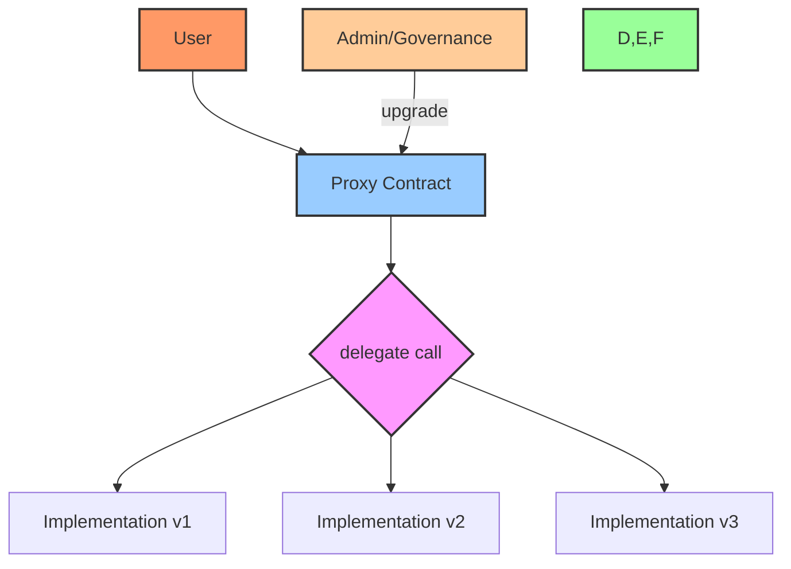
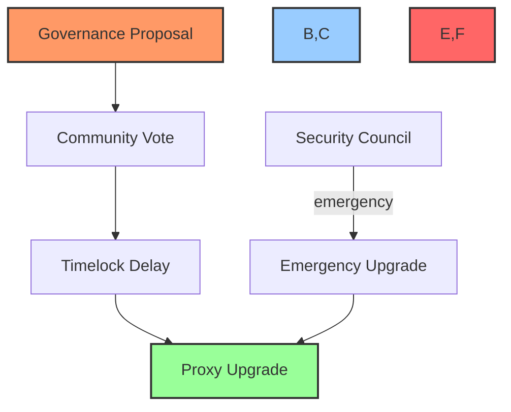
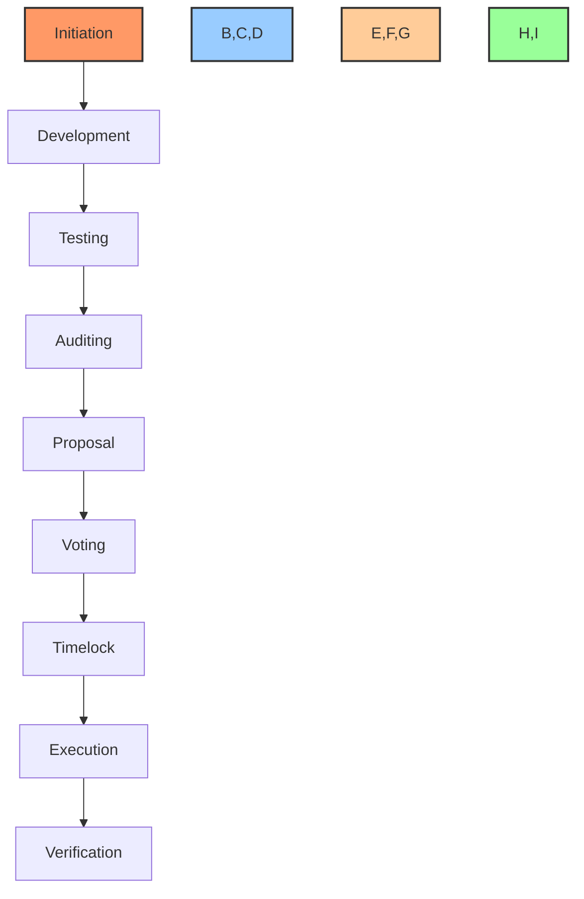
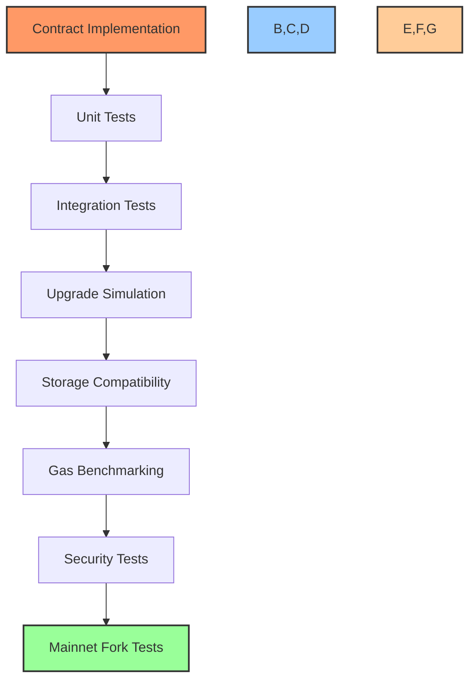
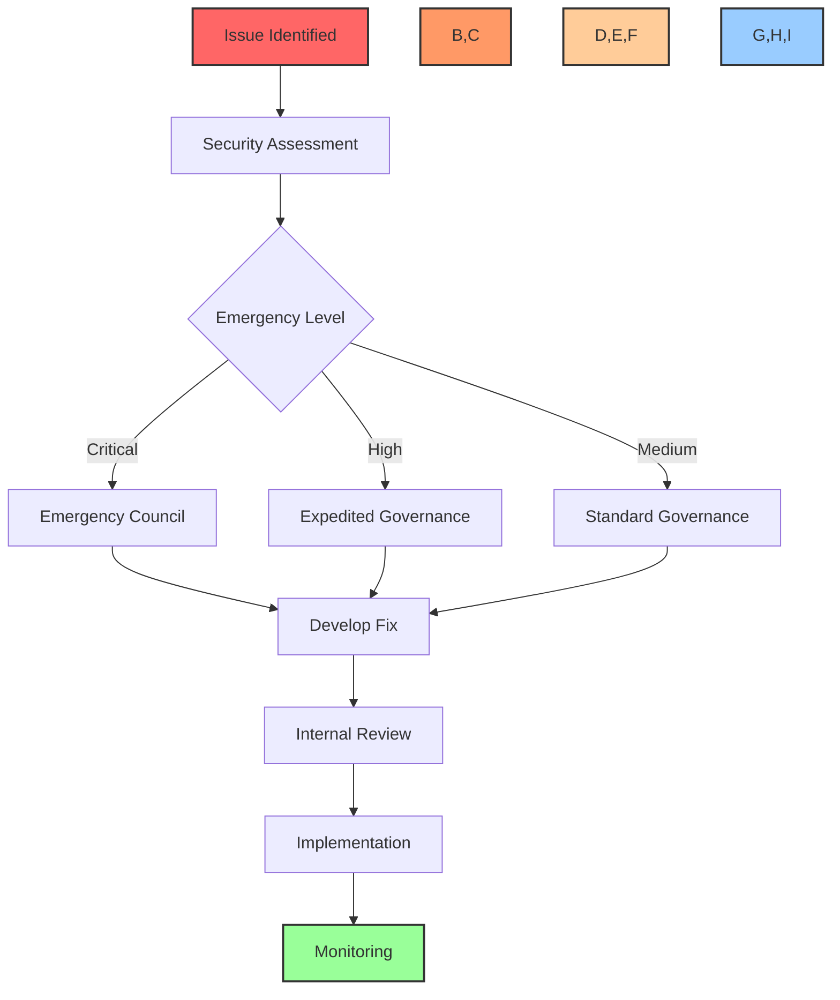

# 🔄 Contract Upgrade Procedures

## 📋 Table of Contents
- [🔍 Overview](#overview)
- [🏗️ Upgrade Architecture](#upgrade-architecture)
- [🔐 Security Considerations](#security-considerations)
- [🔄 Upgrade Types](#upgrade-types)
- [📝 Upgrade Proposal Process](#upgrade-proposal-process)
- [🧪 Testing Framework](#testing-framework)
- [📦 Deployment Procedure](#deployment-procedure)
- [⚠️ Emergency Procedures](#emergency-procedures)
- [📊 Verification & Validation](#verification--validation)
- [📚 Upgrade History](#upgrade-history)
- [🛠️ Tools & Resources](#tools--resources)

## 🔍 Overview

This document outlines the procedures and best practices for upgrading the BAD DAO smart contracts. Contract upgrades are necessary to implement new features, fix bugs, improve security, and optimize gas usage. The upgrade process is designed to be transparent, secure, and minimize disruption to users while maintaining the integrity of the protocol.

## 🏗️ Upgrade Architecture

BAD DAO smart contracts implement a proxy-based upgrade pattern to allow for contract upgrades without changing the addresses that users interact with.

### Proxy Pattern Implementation



### Storage Management

The BAD DAO contracts use an unstructured storage pattern to maintain storage compatibility across upgrades:

```solidity
// Storage layout definition in DAO storage contract
contract DAOStorage {
    // Reserved storage gap for future variables
    uint256[50] private __gap;
    
    // Version tracking
    uint256 public version;
    
    // Core DAO state
    address public governor;
    address public treasury;
    address public token;
    
    // Additional storage vars
    // ...
}
```

### Upgrade Compatibility

To ensure upgrade compatibility, the BAD DAO follows these principles:

1. **Storage Immutability**: Existing storage variables cannot be removed or reordered
2. **Storage Extension**: New variables can only be added at the end of storage layout
3. **Storage Gaps**: Reserved storage slots (`__gap` arrays) for future extensions
4. **Function Selectors**: Maintaining function signatures across upgrades
5. **Return Values**: Preserving return value types and semantics

## 🔐 Security Considerations

### Access Control

The BAD DAO uses a Timelock-controlled upgrade pattern to ensure security:



### Multi-Signature Requirements

Critical contract upgrades require multi-signature approval from the security council:

| Component | Required Signatures | Total Signers | Timelock |
|-----------|---------------------|---------------|----------|
| Core DAO | 4 | 7 | 48 hours |
| Treasury | 5 | 7 | 72 hours |
| Token | 4 | 7 | 48 hours |
| Governance | 4 | 7 | 48 hours |
| Emergency | 3 | 7 | None |

### Upgrade Protections

The following protections are implemented for the upgrade process:

1. **Timelock Delay**: Enforced delay between upgrade approval and execution
2. **Implementation Verification**: Hash verification of new implementation
3. **Function Selector Validation**: Automatic validation of function selectors
4. **Post-Upgrade Testing**: Automated test execution after deployment
5. **Rollback Capability**: Ability to revert to previous implementation

## 🔄 Upgrade Types

The BAD DAO differentiates between several types of upgrades, each with its own process and requirements:

### Feature Upgrades

Feature upgrades introduce new functionality to the protocol:

- Require full governance approval
- Complete audit required
- Standard timelock period
- Comprehensive testing suite
- Community announcement and documentation

### Security Upgrades

Security upgrades address critical security vulnerabilities:

- Expedited governance process
- Security council review required
- Variable timelock based on severity
- Focused security testing
- Responsible disclosure process

### Optimization Upgrades

Optimization upgrades improve gas efficiency or performance:

- Standard governance process
- Gas optimization audit required
- Standard timelock period
- Gas benchmarking tests
- Performance impact documentation

### Emergency Fixes

Emergency fixes address critical issues requiring immediate attention:

- Security council approval
- Minimal or no timelock
- Post-implementation audit
- Incident response documentation
- Immediate disclosure after deployment

## 📝 Upgrade Proposal Process

### Upgrade Lifecycle



### 1. Upgrade Proposal Creation

To propose a contract upgrade, follow these steps:

1. **Create Upgrade Specification**:
   - Document the purpose of the upgrade
   - Detail the specific changes being made
   - Include technical specifications
   - Reference any related issues or vulnerabilities

2. **Submit Development Proposal**:
   - Create a proposal in the development forum
   - Include the upgrade specification
   - Request community feedback
   - Address concerns from the community

3. **Formal Governance Proposal**:
   - Create a formal on-chain governance proposal
   - Include implementation details
   - Reference audit reports
   - Specify upgrade timeline

### 2. Governance Voting Process

Once the upgrade proposal is submitted, it goes through the governance voting process:

1. **Discussion Period**: 3 days for community discussion
2. **Voting Period**: 5 days for token holders to vote
3. **Quorum Requirement**: Minimum 4% of total token supply participation
4. **Approval Threshold**: >50% of votes must approve the proposal

### 3. Timelock Period

After approval, the upgrade enters the timelock period:

- Standard upgrades: 48-hour timelock
- Major upgrades: 72-hour timelock
- Critical security fixes: Variable timelock based on severity
- Emergency fixes: Minimal or no timelock (security council only)

### 4. Execution Process

Once the timelock period has elapsed, the upgrade can be executed:

1. **Final Code Review**: Technical team performs final code review
2. **Deployment Preparation**: Deployment scripts are prepared and tested
3. **Execution Transaction**: The upgrade transaction is submitted to the network
4. **Verification**: Contract code is verified on block explorers

## 🧪 Testing Framework

### Comprehensive Testing Protocol

All contract upgrades undergo rigorous testing before deployment:



### Test Coverage Requirements

| Test Type | Minimum Coverage | Key Focus Areas |
|-----------|------------------|----------------|
| Unit Tests | 95% | Individual function behavior |
| Integration Tests | 90% | Component interactions |
| Storage Tests | 100% | Storage compatibility |
| Security Tests | 100% | Known vulnerabilities |
| Upgrade Tests | 100% | Upgrade procedure |

### Upgrade Simulation

Each upgrade is simulated on a mainnet fork before deployment:

```javascript
// Example upgrade simulation test
describe("Governance Upgrade", function() {
  it("should maintain state across upgrade", async function() {
    // Deploy current implementation
    const currentImpl = await deployGovernance();
    const proxy = await deployProxy(currentImpl.address);
    const governor = await ethers.getContractAt("Governance", proxy.address);
    
    // Create proposal in current implementation
    await governor.propose(targets, values, signatures, calldatas, description);
    const proposalId = await governor.latestProposalIds(proposer.address);
    
    // Perform upgrade
    const newImpl = await deployGovernanceV2();
    await proxy.upgradeTo(newImpl.address);
    const governorV2 = await ethers.getContractAt("GovernanceV2", proxy.address);
    
    // Verify state is maintained
    expect(await governorV2.latestProposalIds(proposer.address)).to.equal(proposalId);
    
    // Verify new functionality
    expect(await governorV2.hasNewFeature()).to.be.true;
  });
});
```

## 📦 Deployment Procedure

### Pre-Deployment Checklist

Before executing an upgrade, complete the following checklist:

- [ ] All tests passing (unit, integration, upgrade)
- [ ] Security audit completed and issues addressed
- [ ] Governance approval obtained
- [ ] Timelock period observed
- [ ] Gas costs estimated and acceptable
- [ ] Documentation updated
- [ ] Community notified
- [ ] Rollback plan prepared

### Deployment Steps

The deployment process follows these steps:

1. **Preparation Phase**
   - Review deployment scripts
   - Verify contract artifacts
   - Check network conditions
   - Prepare monitoring systems

2. **Deployment Phase**
   - Deploy new implementation contract
   - Verify implementation contract code
   - Submit upgrade transaction to proxy
   - Monitor transaction confirmation

3. **Verification Phase**
   - Verify proxy points to new implementation
   - Execute function calls to test functionality
   - Verify state consistency
   - Monitor for any unexpected events

4. **Announcement Phase**
   - Update official documentation
   - Announce successful upgrade
   - Provide new contract addresses
   - Update block explorer information

### Deployment Script Example

```javascript
async function deployUpgrade() {
  console.log("Deploying GovernanceV2 implementation...");
  const GovernanceV2Factory = await ethers.getContractFactory("GovernanceV2");
  const implementationV2 = await GovernanceV2Factory.deploy();
  await implementationV2.deployed();
  console.log("GovernanceV2 implementation deployed to:", implementationV2.address);
  
  // Verify implementation
  await hre.run("verify:verify", {
    address: implementationV2.address,
    constructorArguments: [],
  });
  
  // Prepare upgrade transaction
  console.log("Preparing upgrade transaction...");
  const proxyAdmin = await ethers.getContractAt(
    "ProxyAdmin",
    PROXY_ADMIN_ADDRESS
  );
  
  // Execute upgrade
  console.log("Executing upgrade...");
  const upgradeTx = await proxyAdmin.upgrade(
    GOVERNANCE_PROXY_ADDRESS,
    implementationV2.address
  );
  console.log("Upgrade transaction submitted:", upgradeTx.hash);
  await upgradeTx.wait();
  console.log("Upgrade completed successfully");
  
  // Verify upgrade
  console.log("Verifying upgrade...");
  const proxy = await ethers.getContractAt(
    "GovernanceV2",
    GOVERNANCE_PROXY_ADDRESS
  );
  const version = await proxy.version();
  console.log("New version:", version.toString());
  
  return {
    proxy: GOVERNANCE_PROXY_ADDRESS,
    implementation: implementationV2.address,
    txHash: upgradeTx.hash
  };
}
```

## ⚠️ Emergency Procedures

### Emergency Upgrade Conditions

Emergency upgrades may be initiated under the following conditions:

1. **Critical Vulnerability**: A vulnerability that poses immediate risk to funds or governance
2. **Protocol Halt**: A condition preventing core protocol functionality
3. **External Dependency Failure**: Failure of a critical external dependency
4. **Network Emergency**: Network-level emergency affecting protocol operation

### Emergency Process Flow



### Emergency Response Team

The Emergency Response Team consists of:

- Security Council members (7 members)
- Core developers (3 members)
- Security advisors (2 members)
- Communications lead (1 member)

Contact the Emergency Response Team at: security@baddao.io

### Emergency Upgrade Authorization

| Emergency Level | Required Authorization | Timelock | Disclosure |
|-----------------|------------------------|----------|------------|
| Critical | 3-of-7 Security Council | None | After deployment |
| High | 4-of-7 Security Council | 6 hours | Before deployment |
| Medium | 4-of-7 Security Council & 5% token holder vote | 24 hours | Before deployment |

### Post-Emergency Procedures

After an emergency upgrade:

1. **Full Audit**: Complete post-implementation audit
2. **Public Disclosure**: Detailed disclosure of the issue and resolution
3. **Post-Mortem**: Analysis of the incident and response
4. **Process Improvement**: Identification of process improvements
5. **Governance Ratification**: Retroactive governance vote to ratify the upgrade

## 📊 Verification & Validation

### Implementation Verification

After deployment, the following verification steps are performed:

1. **Code Verification**
   - Verify source code on block explorers
   - Confirm implementation address in proxy
   - Validate contract bytecode

2. **Functional Verification**
   - Execute basic functionality tests
   - Verify access control mechanisms
   - Test critical functions

3. **State Verification**
   - Verify critical state variables
   - Confirm balance consistency
   - Check permissions and roles

### Automated Verification

Automated verification scripts perform the following checks:

```javascript
// Example verification script
async function verifyUpgrade(proxyAddress, expectedImpl, deploymentTx) {
  console.log("Verifying upgrade...");
  
  // Verify implementation address
  const proxy = await ethers.getContractAt("ITransparentUpgradeableProxy", proxyAddress);
  const implementation = await getProxyImplementation(proxy);
  assert.equal(
    implementation.toLowerCase(),
    expectedImpl.toLowerCase(),
    "Implementation address mismatch"
  );
  
  // Verify contract code is deployed
  const code = await ethers.provider.getCode(implementation);
  assert(code.length > 2, "No contract code at implementation address");
  
  // Verify functionality
  const contract = await ethers.getContractAt("GovernanceV2", proxyAddress);
  const version = await contract.version();
  assert.equal(version.toString(), "2", "Incorrect version number");
  
  // Verify event emission
  const receipt = await ethers.provider.getTransactionReceipt(deploymentTx);
  const upgradeEvents = receipt.logs.filter(
    log => log.topics[0] === ethers.utils.id("Upgraded(address)")
  );
  assert(upgradeEvents.length > 0, "No Upgraded event emitted");
  
  console.log("Verification successful!");
  return true;
}
```

### Monitoring Period

After each upgrade, an enhanced monitoring period is established:

- Duration: 7 days minimum
- Metrics: Transaction success rate, gas usage, error rates
- Alerts: Abnormal patterns, function reverts, high gas usage
- Response: 24/7 on-call technical team

## 📚 Upgrade History

### Historical Upgrades

| Version | Date | Type | Description | Proposal | Commit |
|---------|------|------|-------------|----------|--------|
| v1.0.0 | 2025-01-15 | Initial | Initial deployment | N/A | [0x1a2b3c](https://github.com/bad-dao/contracts/commit/0x1a2b3c) |
| v1.1.0 | 2025-02-20 | Feature | Added delegation features | [BAD-7](https://forum.baddao.io/proposals/7) | [0x4d5e6f](https://github.com/bad-dao/contracts/commit/0x4d5e6f) |
| v1.2.0 | 2025-03-05 | Security | Fixed critical vulnerabilities | [BAD-12](https://forum.baddao.io/proposals/12) | [0x7g8h9i](https://github.com/bad-dao/contracts/commit/0x7g8h9i) |
| v1.2.1 | 2025-03-25 | Optimization | Gas optimization for voting | [BAD-15](https://forum.baddao.io/proposals/15) | [0xj0k1l](https://github.com/bad-dao/contracts/commit/0xj0k1l) |
| v1.2.2 | 2025-04-10 | Fix | Fixed minor issues | [BAD-18](https://forum.baddao.io/proposals/18) | [0xm2n3o](https://github.com/bad-dao/contracts/commit/0xm2n3o) |
| v1.3.0 | 2025-05-01 | Feature | Enhanced treasury management | [BAD-22](https://forum.baddao.io/proposals/22) | [0xp4q5r](https://github.com/bad-dao/contracts/commit/0xp4q5r) |

### Upcoming Upgrades

| Version | Planned Date | Type | Description | Status | Proposal |
|---------|--------------|------|-------------|--------|----------|
| v1.4.0 | 2025-06-15 | Feature | Governance improvements | Development | [BAD-25](https://forum.baddao.io/proposals/25) |
| v1.4.1 | 2025-07-01 | Optimization | Gas optimizations for proposals | Planning | [BAD-28](https://forum.baddao.io/proposals/28) |
| v2.0.0 | 2025-Q3 | Major | Multi-chain governance | Research | TBD |

## 🛠️ Tools & Resources

### Upgrade Tools

| Tool | Purpose | Repository |
|------|---------|------------|
| OpenZeppelin Upgrades | Contract upgrade management | [Link](https://github.com/OpenZeppelin/openzeppelin-upgrades) |
| Hardhat Upgrades | Hardhat plugin for upgrades | [Link](https://github.com/OpenZeppelin/openzeppelin-upgrades/tree/master/packages/plugin-hardhat) |
| Defender Admin | Upgrade management & monitoring | [Link](https://defender.openzeppelin.com) |
| Tenderly | Upgrade simulation & verification | [Link](https://tenderly.co) |
| Slither Upgradeability | Upgradeability checks | [Link](https://github.com/crytic/slither/wiki/Upgradeability-Checks) |

### Reference Documentation

1. [OpenZeppelin Proxy Upgrade Pattern](https://docs.openzeppelin.com/upgrades-plugins/1.x/proxies)
2. [EIP-1967: Standard Proxy Storage Slots](https://eips.ethereum.org/EIPS/eip-1967)
3. [Compound Governance Documentation](https://compound.finance/docs/governance)
4. [Uniswap Governance](https://docs.uniswap.org/protocol/concepts/governance/overview)
5. [BAD DAO Governance Documentation](https://docs.baddao.io/governance)

### Upgrade Training Resources

- [Smart Contract Upgrade Workshop](https://github.com/bad-dao/upgrade-workshop)
- [BAD DAO Developer Documentation](https://docs.baddao.io/developers)
- [Upgrade Best Practices Guide](https://docs.baddao.io/upgrades/best-practices)

---

Made with Power, Love, and AI •  ⚡️❤️🤖 •  POWERBRIDGE.AI 