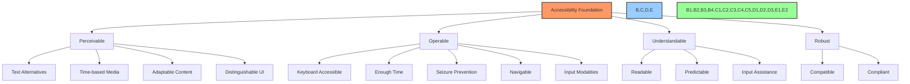
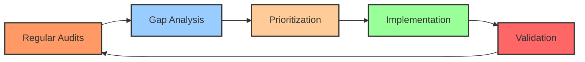

# ♿ Accessibility Standards & Implementation

## 📋 Table of Contents
- [🔍 Overview](#overview)
- [🎯 Purpose](#purpose)
- [🧩 Accessibility Standards](#accessibility-standards)
- [📊 WCAG Compliance Matrix](#wcag-compliance-matrix)
- [🎨 Accessible Design Principles](#accessible-design-principles)
- [🛠️ Implementation Guidelines](#implementation-guidelines)
- [📱 Responsive Accessibility](#responsive-accessibility)
- [🧪 Testing & Validation](#testing--validation)
- [🔄 Continuous Improvement](#continuous-improvement)
- [📝 Documentation & Resources](#documentation--resources)

## 🔍 Overview

This document outlines the accessibility standards, guidelines, and implementation approaches for the BAD DAO UI application. It aims to ensure that the platform is accessible to all users, including those with disabilities, in compliance with international standards and best practices.

## 🎯 Purpose

The accessibility documentation aims to:
- Define the accessibility standards and compliance targets for the BAD DAO UI
- Provide designers and developers with clear guidelines for implementing accessible features
- Establish testing methodologies to validate accessibility compliance
- Document tools and resources for accessibility implementation and verification
- Outline a continuous improvement approach for accessibility enhancements

## 🧩 Accessibility Standards

The BAD DAO UI adheres to the Web Content Accessibility Guidelines (WCAG) 2.1 Level AA standards as a minimum requirement, with specific features targeting Level AAA compliance where feasible.



### Regulatory Compliance

The BAD DAO UI aims to comply with relevant accessibility regulations, including:

1. **Americans with Disabilities Act (ADA)** - Ensuring digital accessibility for people with disabilities
2. **Section 508** - Federal accessibility requirements for electronic and information technology
3. **European Accessibility Act** - EU requirements for accessible products and services
4. **EN 301 549** - European standard for digital accessibility

## 📊 WCAG Compliance Matrix

The following matrix outlines the specific WCAG 2.1 criteria and the BAD DAO UI's current compliance status:

| Principle | Guideline | Level | Status | Implementation Notes |
|-----------|-----------|-------|--------|----------------------|
| **Perceivable** | 1.1.1 Non-text Content | A | ✅ | All images have alt text, icons have aria-labels |
| | 1.2.1 Audio-only & Video-only | A | ✅ | Alternatives provided for all media content |
| | 1.2.2 Captions | A | ✅ | All video content includes captions |
| | 1.2.3 Audio Description | A | ✅ | Audio descriptions available for videos |
| | 1.2.4 Captions (Live) | AA | ✅ | Live events include real-time captions |
| | 1.2.5 Audio Description | AA | ✅ | Extended audio descriptions available |
| | 1.3.1 Info and Relationships | A | ✅ | Semantic HTML with appropriate ARIA markup |
| | 1.3.2 Meaningful Sequence | A | ✅ | Logical reading order preserved |
| | 1.3.3 Sensory Characteristics | A | ✅ | Instructions don't rely solely on sensory characteristics |
| | 1.3.4 Orientation | AA | ✅ | Content not restricted to single orientation |
| | 1.3.5 Identify Input Purpose | AA | ✅ | Input fields have clear purpose identification |
| | 1.4.1 Use of Color | A | ✅ | Color not used as the sole means of conveying information |
| | 1.4.2 Audio Control | A | ✅ | Audio can be paused, stopped, or volume controlled |
| | 1.4.3 Contrast (Minimum) | AA | ✅ | Text meets 4.5:1 contrast ratio |
| | 1.4.4 Resize Text | AA | ✅ | Text can be resized up to 200% without loss of content |
| | 1.4.5 Images of Text | AA | ✅ | Real text used instead of images of text |
| | 1.4.10 Reflow | AA | ✅ | Content reflows on zoom without horizontal scrolling |
| | 1.4.11 Non-text Contrast | AA | ✅ | UI components have 3:1 minimum contrast |
| | 1.4.12 Text Spacing | AA | ✅ | No loss of content with adjusted text spacing |
| | 1.4.13 Content on Hover/Focus | AA | ✅ | Hover/focus content dismissible and persistent |
| **Operable** | 2.1.1 Keyboard | A | ✅ | All functionality available via keyboard |
| | 2.1.2 No Keyboard Trap | A | ✅ | Keyboard focus can be moved away from components |
| | 2.1.4 Character Key Shortcuts | A | ✅ | Single character shortcuts can be turned off |
| | 2.2.1 Timing Adjustable | A | ✅ | Time limits can be extended |
| | 2.2.2 Pause, Stop, Hide | A | ✅ | Moving content can be paused |
| | 2.3.1 Three Flashes | A | ✅ | No content flashes more than three times per second |
| | 2.4.1 Bypass Blocks | A | ✅ | Skip links provided for navigation |
| | 2.4.2 Page Titled | A | ✅ | Pages have descriptive titles |
| | 2.4.3 Focus Order | A | ✅ | Focus order preserves meaning and operability |
| | 2.4.4 Link Purpose | A | ✅ | Link purpose clear from text or context |
| | 2.4.5 Multiple Ways | AA | ✅ | Multiple ways to locate content provided |
| | 2.4.6 Headings and Labels | AA | ✅ | Descriptive headings and labels used |
| | 2.4.7 Focus Visible | AA | ✅ | Keyboard focus indicator clearly visible |
| | 2.5.1 Pointer Gestures | A | ✅ | Multipoint gestures have single-point alternative |
| | 2.5.2 Pointer Cancellation | A | ✅ | No execution on down-event |
| | 2.5.3 Label in Name | A | ✅ | Visible labels included in accessible name |
| | 2.5.4 Motion Actuation | A | ✅ | Motion-operated functions have UI alternatives |
| **Understandable** | 3.1.1 Language of Page | A | ✅ | Page language identified in HTML |
| | 3.1.2 Language of Parts | AA | ✅ | Content language changes identified |
| | 3.2.1 On Focus | A | ✅ | Focus doesn't trigger context changes |
| | 3.2.2 On Input | A | ✅ | Input doesn't trigger unexpected changes |
| | 3.2.3 Consistent Navigation | AA | ✅ | Navigation patterns consistent across site |
| | 3.2.4 Consistent Identification | AA | ✅ | Components with same function identified consistently |
| | 3.3.1 Error Identification | A | ✅ | Input errors clearly identified |
| | 3.3.2 Labels or Instructions | A | ✅ | Labels/instructions provided for user input |
| | 3.3.3 Error Suggestion | AA | ✅ | Error correction suggestions provided |
| | 3.3.4 Error Prevention | AA | ✅ | Legal/financial submissions can be reviewed/corrected |
| **Robust** | 4.1.1 Parsing | A | ✅ | Valid HTML with complete start/end tags |
| | 4.1.2 Name, Role, Value | A | ✅ | ARIA properties used appropriately |
| | 4.1.3 Status Messages | AA | ✅ | Status messages identified without focus |

## 🎨 Accessible Design Principles

The BAD DAO UI follows these core accessible design principles:

### Color & Contrast

- **Color palette** meets WCAG 2.1 Level AA contrast requirements (4.5:1 for normal text, 3:1 for large text)
- **Enhanced contrast mode** available for users who need higher contrast (7:1 ratio)
- **Color is never used alone** to convey information
- **Color-blindness testing** performed on all UI components

```css
/* Example accessible color variables */
:root {
  /* Primary colors with accessible alternatives */
  --primary: #0056b3;
  --primary-light: #007bff;
  --primary-dark: #004494;
  
  /* Text colors with sufficient contrast on white */
  --text-primary: #222222;
  --text-secondary: #444444;
  
  /* Focus states */
  --focus-outline: 3px solid #ffbf47;
  
  /* Error states */
  --error: #d32f2f;
  --error-light: #ef5350;
}

/* High contrast mode */
.high-contrast {
  --primary: #0000ff;
  --text-primary: #000000;
  --background: #ffffff;
}
```

### Typography

- **Legible font families** with good character distinction
- **Scalable text** that can be resized up to 200% without loss of functionality
- **Minimum text size** of 16px for body text
- **Adequate line spacing** (minimum 1.5 times the font size)
- **Sufficient letter spacing** (minimum 0.12 times the font size)

```css
/* Example accessible typography */
body {
  font-family: 'Open Sans', Arial, sans-serif;
  font-size: 16px;
  line-height: 1.5;
  letter-spacing: 0.12em;
}

h1 {
  font-size: 2em;
  line-height: 1.2;
  margin-bottom: 0.5em;
}

/* Ensure text can be resized */
html {
  font-size: 100%;
}
```

### Layout & Navigation

- **Responsive layout** that adapts to different screen sizes and zoom levels
- **Logical tab order** following visual layout
- **Skip navigation links** to bypass repetitive elements
- **Breadcrumb navigation** for complex flows
- **Consistent navigation patterns** across the application
- **Visible focus indicators** for all interactive elements

### Forms & Controls

- **Labeled input fields** with explicit associations
- **Error identification** with clear error messages
- **Grouped related inputs** using fieldsets and legends
- **Sufficient touch targets** (minimum 44x44px)
- **Multiple selection methods** (mouse, keyboard, touch, voice)

## 🛠️ Implementation Guidelines

### Semantic HTML

The BAD DAO UI uses semantic HTML elements to ensure proper structure and meaning:

```html
<!-- Example of semantic structure -->
<header>
  <h1>BAD DAO Governance</h1>
  <nav aria-label="Main navigation">
    <ul>
      <li><a href="#proposals">Proposals</a></li>
      <li><a href="#voting">Voting</a></li>
    </ul>
  </nav>
</header>

<main>
  <section aria-labelledby="proposal-title">
    <h2 id="proposal-title">Active Proposals</h2>
    <ul class="proposal-list" role="list">
      <!-- Proposal items -->
    </ul>
  </section>
</main>

<footer>
  <p>© 2025 BAD DAO</p>
</footer>
```

### ARIA Implementation

ARIA attributes are used judiciously to enhance accessibility when HTML semantics alone are insufficient:

```html
<!-- Example of ARIA usage for a custom dropdown -->
<div class="custom-select" role="combobox" aria-expanded="false" aria-haspopup="listbox" aria-owns="options-list">
  <button class="select-button" aria-labelledby="selected-option">
    <span id="selected-option">Select an option</span>
    <svg aria-hidden="true" class="select-icon" focusable="false">
      <!-- Icon SVG -->
    </svg>
  </button>
  <ul id="options-list" role="listbox" class="options-list">
    <li role="option" id="option-1" aria-selected="false">Option 1</li>
    <li role="option" id="option-2" aria-selected="false">Option 2</li>
  </ul>
</div>
```

### Keyboard Navigation

All interactive elements must be keyboard accessible:

```javascript
// Example of keyboard navigation handler for a custom component
function handleKeyDown(event) {
  const KEY = {
    ENTER: 13,
    SPACE: 32,
    ESCAPE: 27,
    UP: 38,
    DOWN: 40
  };

  switch (event.keyCode) {
    case KEY.ENTER:
    case KEY.SPACE:
      // Activate current option
      activateOption(event.target);
      event.preventDefault();
      break;
    case KEY.ESCAPE:
      // Close dropdown
      closeDropdown();
      event.preventDefault();
      break;
    case KEY.UP:
      // Navigate to previous option
      navigateToPreviousOption();
      event.preventDefault();
      break;
    case KEY.DOWN:
      // Navigate to next option
      navigateToNextOption();
      event.preventDefault();
      break;
  }
}
```

### Focus Management

Proper focus management is critical for keyboard users:

```javascript
// Example of focus management for a modal dialog
function openModal() {
  // Store the element that had focus before opening the modal
  previousFocus = document.activeElement;
  
  // Show the modal
  modal.setAttribute('aria-hidden', 'false');
  modal.style.display = 'block';
  
  // Set focus on the first focusable element in the modal
  const focusableElements = modal.querySelectorAll(
    'button, [href], input, select, textarea, [tabindex]:not([tabindex="-1"])'
  );
  
  if (focusableElements.length > 0) {
    focusableElements[0].focus();
  }
  
  // Trap focus within the modal
  modal.addEventListener('keydown', trapFocus);
}

function closeModal() {
  // Hide the modal
  modal.setAttribute('aria-hidden', 'true');
  modal.style.display = 'none';
  
  // Restore focus to the element that had focus before opening the modal
  if (previousFocus) {
    previousFocus.focus();
  }
  
  // Remove focus trap
  modal.removeEventListener('keydown', trapFocus);
}

function trapFocus(event) {
  // Trap focus within the modal when it's open
  const focusableElements = modal.querySelectorAll(
    'button, [href], input, select, textarea, [tabindex]:not([tabindex="-1"])'
  );
  
  const firstElement = focusableElements[0];
  const lastElement = focusableElements[focusableElements.length - 1];
  
  // Trap focus in modal
  if (event.key === 'Tab') {
    if (event.shiftKey && document.activeElement === firstElement) {
      lastElement.focus();
      event.preventDefault();
    } else if (!event.shiftKey && document.activeElement === lastElement) {
      firstElement.focus();
      event.preventDefault();
    }
  }
}
```

### Error States & Form Validation

Accessible error handling is implemented as follows:

```html
<!-- Example of accessible form validation -->
<form novalidate>
  <div class="form-group">
    <label for="token-amount">Token Amount</label>
    <input 
      type="number" 
      id="token-amount" 
      aria-describedby="amount-error amount-help"
      aria-invalid="false"
    >
    <div id="amount-help" class="help-text">Enter the number of tokens to delegate.</div>
    <div id="amount-error" class="error-message" role="alert" hidden>
      Please enter a valid token amount greater than 0.
    </div>
  </div>
  
  <button type="submit">Submit</button>
</form>

<script>
function validateForm() {
  const tokenInput = document.getElementById('token-amount');
  const errorElement = document.getElementById('amount-error');
  
  if (!tokenInput.value || parseFloat(tokenInput.value) <= 0) {
    // Show error state
    tokenInput.setAttribute('aria-invalid', 'true');
    errorElement.hidden = false;
    
    // Announce error to screen readers
    errorElement.focus();
    
    return false;
  } else {
    // Clear error state
    tokenInput.setAttribute('aria-invalid', 'false');
    errorElement.hidden = true;
    return true;
  }
}
</script>
```

## 📱 Responsive Accessibility

The BAD DAO UI ensures accessibility across all device types and screen sizes:

### Mobile Accessibility

- **Touch targets** minimum size of 44x44px
- **Pinch-to-zoom** enabled, no maximum-scale restrictions
- **Orientation** support for both portrait and landscape
- **Touch gestures** have keyboard and button alternatives
- **Mobile-specific patterns** tested with screen readers (VoiceOver, TalkBack)

### Screen Size Adaptability

- **Responsive breakpoints** that maintain readability and functionality
- **Content reflow** to avoid horizontal scrolling at 320px width
- **Priority content** visible without scrolling on smaller screens
- **Scalable UI elements** that maintain relationships at different sizes

```css
/* Example of accessible responsive design */
@media screen and (max-width: 768px) {
  /* Increase touch target size on mobile */
  .button, 
  .nav-link,
  .form-control {
    min-height: 44px;
    min-width: 44px;
    padding: 12px 16px;
  }
  
  /* Simplify complex layouts */
  .dashboard-grid {
    display: flex;
    flex-direction: column;
  }
  
  /* Ensure text remains readable */
  body {
    font-size: 16px; /* Maintain minimum text size */
  }
  
  /* Adjust spacing for readability */
  .container {
    padding: 16px;
  }
}
```

## 🧪 Testing & Validation

The BAD DAO UI undergoes rigorous accessibility testing to ensure compliance:

### Automated Testing

- **Linting** with eslint-plugin-jsx-a11y during development
- **Jest unit tests** for accessibility features
- **Lighthouse accessibility audits** in CI/CD pipeline
- **Axe Core integration** for automated accessibility testing

```javascript
// Example of automated accessibility test
describe('Proposal Card Component', () => {
  it('should have appropriate ARIA attributes', () => {
    const { getByRole } = render(<ProposalCard title="Test Proposal" />);
    
    // Check for proper heading role
    const heading = getByRole('heading');
    expect(heading).toHaveTextContent('Test Proposal');
    
    // Check for proper button roles
    const voteButton = getByRole('button', { name: /vote/i });
    expect(voteButton).toBeInTheDocument();
    
    // Run axe accessibility tests
    const results = axe.run();
    expect(results.violations.length).toBe(0);
  });
});
```

### Manual Testing

- **Keyboard navigation testing** for all user flows
- **Screen reader testing** with NVDA, JAWS, VoiceOver
- **Zoom testing** at 200% and 400% zoom levels
- **High contrast mode testing**
- **Reduced motion preference testing**

### User Testing

- **Accessibility expert reviews** conducted quarterly
- **User testing with people with disabilities**
- **Feedback mechanisms** for reporting accessibility issues

## 🔄 Continuous Improvement

Accessibility is maintained and improved through an ongoing process:



### Accessibility Roadmap

| Timeline | Goal | Tasks | Status |
|----------|------|-------|--------|
| Q2 2025 | WCAG 2.1 Level AA compliance | Complete audit, fix critical issues | ✅ Completed |
| Q3 2025 | Enhanced user preferences | Add user-controllable theme, text size, and motion settings | 🟡 In Progress |
| Q4 2025 | WCAG 2.2 compliance | Implement new WCAG 2.2 success criteria | 🔴 Not Started |
| Q1 2026 | User testing with disabled users | Conduct testing sessions with diverse users | 🔴 Not Started |
| Q2 2026 | Accessibility certification | Obtain third-party accessibility certification | 🔴 Not Started |

### Monitoring & Reporting

- **Monthly accessibility scans** with detailed reporting
- **Accessibility issue tracking** in the project management system
- **Accessibility metrics** included in product dashboards
- **Regular stakeholder updates** on accessibility progress

## 📝 Documentation & Resources

### Accessibility Checklist

Developers and designers should use this checklist when implementing new features:

- [ ] Semantic HTML elements used appropriately
- [ ] Proper heading structure (h1-h6) maintained
- [ ] Sufficient color contrast for text and UI components
- [ ] Color not used as the sole means of conveying information
- [ ] All interactive elements accessible via keyboard
- [ ] Visible focus indicators for interactive elements
- [ ] ARIA attributes used correctly where needed
- [ ] Form fields have associated labels
- [ ] Images have appropriate alt text
- [ ] Dynamic content changes announced to screen readers
- [ ] Touch targets at least 44x44px on mobile
- [ ] Content remains usable at 200% zoom
- [ ] Captions provided for video content
- [ ] No content flashes more than 3 times per second
- [ ] Page language set in HTML

### Tools & Resources

#### Development Tools

- **Axe DevTools** - Browser extension for accessibility testing
- **eslint-plugin-jsx-a11y** - ESLint plugin for accessibility linting
- **React-axe** - Accessibility auditing for React applications
- **Lighthouse** - Automated web app quality tool
- **WAVE** - Web accessibility evaluation tool

#### Testing Tools

- **NVDA** - Free screen reader for Windows
- **VoiceOver** - Built-in screen reader for macOS and iOS
- **JAWS** - Professional screen reader for Windows
- **TalkBack** - Screen reader for Android devices
- **Color Contrast Analyzer** - Tool for checking color contrast

#### Learning Resources

- [W3C Web Accessibility Initiative (WAI)](https://www.w3.org/WAI/)
- [WebAIM](https://webaim.org/)
- [The A11Y Project](https://a11yproject.com/)
- [MDN Accessibility Guide](https://developer.mozilla.org/en-US/docs/Web/Accessibility)
- [Inclusive Components](https://inclusive-components.design/)

### Component-Specific Guidelines

The design system includes detailed accessibility guidelines for each component:

- [Buttons Accessibility Guidelines](./component-library.md#buttons-accessibility)
- [Form Controls Accessibility Guidelines](./component-library.md#form-controls-accessibility)
- [Modal Dialogs Accessibility Guidelines](./component-library.md#modal-dialogs-accessibility)
- [Navigation Components Accessibility Guidelines](./component-library.md#navigation-accessibility)
- [Tables and Data Accessibility Guidelines](./component-library.md#tables-accessibility)

---

Made with Power, Love, and AI •  ⚡️❤️🤖 •  POWERBRIDGE.AI 