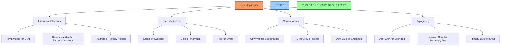
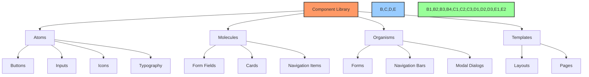

# 🎨 UI/UX Design System Specifications

## 📋 Table of Contents
- [🔍 Overview](#overview)
- [🎯 Purpose](#purpose)
- [🎨 Color Palette](#color-palette)
- [🔠 Typography](#typography)
- [📐 Layout & Grid System](#layout--grid-system)
- [🧩 UI Components](#ui-components)
- [🖼️ Iconography](#iconography)
- [🔄 Motion & Animation](#motion--animation)
- [🌐 Responsive Design](#responsive-design)
- [⚙️ Implementation Guidelines](#implementation-guidelines)

## 🔍 Overview

This document defines the comprehensive design system for the BAD DAO UI. It establishes the visual language, component specifications, and design principles that ensure consistency, accessibility, and quality throughout the user interface.

## 🎯 Purpose

The BAD DAO UI Design System aims to:
- Create a unified and consistent user experience
- Accelerate UI development through standardized components
- Ensure accessibility compliance across the application
- Establish clear guidelines for visual elements and interactions
- Provide a foundation for scalable and maintainable design

## 🎨 Color Palette

### Primary Colors
| Color | Hex | RGB | Usage |
|-------|-----|-----|-------|
| Primary Blue | `#2E5BFF` | `46, 91, 255` | Main actions, links, highlights |
| Secondary Blue | `#6E8EFA` | `110, 142, 250` | Secondary elements, highlights |
| Dark Blue | `#1A2B63` | `26, 43, 99` | Backgrounds, dark mode elements |

### Secondary Colors
| Color | Hex | RGB | Usage |
|-------|-----|-----|-------|
| Accent Gold | `#F5A623` | `245, 166, 35` | Highlights, notifications, warnings |
| Accent Green | `#28C96F` | `40, 201, 111` | Success states, positive indicators |
| Accent Red | `#FF4D4D` | `255, 77, 77` | Error states, alerts, destructive actions |

### Neutral Colors
| Color | Hex | RGB | Usage |
|-------|-----|-----|-------|
| Dark Grey | `#1E1E1E` | `30, 30, 30` | Text, icons in light mode |
| Medium Grey | `#6E6E6E` | `110, 110, 110` | Secondary text, disabled states |
| Light Grey | `#E5E5E5` | `229, 229, 229` | Borders, dividers, subtle UI elements |
| Off White | `#F9F9F9` | `249, 249, 249` | Backgrounds, containers |

### Color Usage Guidelines


## 🔠 Typography

### Font Families
- **Heading Font**: Inter, sans-serif
- **Body Font**: Inter, sans-serif
- **Monospace Font**: Roboto Mono, monospace (for code, data)

### Type Scale
| Name | Size | Weight | Line Height | Usage |
|------|------|--------|-------------|-------|
| Heading 1 | 32px | 700 | 40px | Main page headings |
| Heading 2 | 24px | 700 | 32px | Section headings |
| Heading 3 | 20px | 600 | 28px | Subsection headings |
| Heading 4 | 18px | 600 | 24px | Card headings |
| Body Large | 16px | 400 | 24px | Primary content |
| Body | 14px | 400 | 22px | Standard content |
| Body Small | 12px | 400 | 18px | Secondary content, captions |
| Label | 14px | 600 | 20px | Form labels, emphasis |
| Button | 14px | 600 | 20px | Button text |
| Caption | 12px | 400 | 16px | Supporting text, metadata |

### Typography Rules
- Maintain a minimum contrast ratio of 4.5:1 for normal text
- Use no more than 3 font weights per screen
- Limit line length to 70-80 characters for optimal readability
- Use proper hierarchical structure (H1 → H2 → H3)
- Apply consistent text alignment (left-aligned for LTR languages)

## 📐 Layout & Grid System

### Spacing Scale
```scss
// Spacing variables (in pixels)
$spacing-xs: 4px;
$spacing-sm: 8px;
$spacing-md: 16px;
$spacing-lg: 24px;
$spacing-xl: 32px;
$spacing-2xl: 48px;
$spacing-3xl: 64px;
```

### Grid System
- 12-column grid layout
- Gutter width: 24px
- Margin width: 24px (desktop), 16px (tablet), 16px (mobile)
- Responsive breakpoints:
  - Mobile: < 576px
  - Tablet: 576px - 992px
  - Desktop: 992px - 1440px
  - Large Desktop: > 1440px

### Layout Examples
```
Desktop Layout (12 columns)
+--+--+--+--+--+--+--+--+--+--+--+--+
|     Header (12 columns)            |
+--+--+--+--+--+--+--+--+--+--+--+--+
|  Sidebar  |      Main Content      |
|  (3 col)  |      (9 columns)       |
+--+--+--+--+--+--+--+--+--+--+--+--+
|     Footer (12 columns)            |
+--+--+--+--+--+--+--+--+--+--+--+--+

Mobile Layout (4 columns)
+--+--+--+--+
|  Header   |
+--+--+--+--+
|   Main    |
| Content   |
+--+--+--+--+
|  Footer   |
+--+--+--+--+
```

## 🧩 UI Components

### Component Hierarchy


### Core Components
1. **Buttons**
   - Primary
   - Secondary
   - Tertiary
   - Icon Button
   - Loading Button

2. **Form Controls**
   - Text Input
   - Select Dropdown
   - Checkbox
   - Radio Button
   - Switch/Toggle
   - Textarea

3. **Navigation**
   - Header
   - Sidebar
   - Tabs
   - Breadcrumbs
   - Pagination

4. **Data Display**
   - Card
   - Table
   - List
   - Chart
   - Badge
   - Avatar

5. **Feedback**
   - Alert
   - Notification
   - Progress Indicators
   - Skeleton Loaders
   - Toast Messages

See [component-library.md](./component-library.md) for detailed component specifications.

## 🖼️ Iconography

### Icon System
- **Style**: Line icons with consistent 2px stroke weight
- **Size**: 24px × 24px default with 16px and 32px variants
- **Grid**: 24px × 24px with 1px alignment
- **Format**: SVG for scalability and accessibility

### Icon Categories
- **Navigation**: Home, menu, arrow, search
- **Actions**: Edit, delete, add, remove, save
- **Communication**: Message, email, notification
- **Media**: Play, pause, volume, download
- **Commerce**: Cart, wallet, transaction
- **Social**: Share, like, comment
- **Status**: Success, warning, error, info

### Icon Usage Guidelines
- Maintain visual consistency in stroke weight and corner radius
- Use semantic colors for interactive and status icons
- Include text labels for primary actions
- Ensure touch targets are at least 44px × 44px

## 🔄 Motion & Animation

### Animation Principles
- **Purpose**: Animations should guide users and provide feedback
- **Duration**: Keep animations brief (150-300ms)
- **Easing**: Use standard easing functions for consistency
- **Restraint**: Avoid excessive or distracting animations

### Standard Durations
```scss
// Animation durations
$duration-fast: 150ms;
$duration-medium: 250ms;
$duration-slow: 350ms;
```

### Easing Functions
```scss
// Easing curves
$ease-standard: cubic-bezier(0.4, 0.0, 0.2, 1); // Standard
$ease-in-out: cubic-bezier(0.4, 0.0, 0.6, 1);   // Acceleration and deceleration
$ease-in: cubic-bezier(0.0, 0.0, 0.2, 1);       // Acceleration
$ease-out: cubic-bezier(0.4, 0.0, 1, 1);        // Deceleration
```

### Animation Types
- **Transitions**: For UI state changes (hover, focus, etc.)
- **Feedback**: For user actions (clicks, submissions)
- **Loading**: For progress indication
- **Entrance/Exit**: For adding/removing elements

## 🌐 Responsive Design

### Breakpoint System
```scss
// Breakpoints
$breakpoints: (
  xs: 0,
  sm: 576px,
  md: 768px,
  lg: 992px,
  xl: 1200px,
  xxl: 1400px
);
```

### Responsive Rules
- **Mobile-First**: Design for mobile, then enhance for larger screens
- **Critical Content**: Prioritize critical content on smaller screens
- **Touch Targets**: Minimum size of 44px × 44px for interactive elements
- **Flexible Images**: Use responsive image techniques (max-width: 100%)
- **Complex Tables**: Provide alternative views for tables on small screens

### Responsive Patterns
- **Stack**: Convert horizontal layouts to vertical for mobile
- **Reveal/Hide**: Show/hide content based on screen size
- **Reposition**: Move elements to different locations in the layout
- **Replace**: Swap complex components with simpler versions on mobile

## ⚙️ Implementation Guidelines

### Design Tokens
All design system values should be implemented as design tokens:

```js
// Color tokens
export const colors = {
  primary: {
    blue: '#2E5BFF',
    blueLight: '#6E8EFA',
    blueDark: '#1A2B63',
  },
  accent: {
    gold: '#F5A623',
    green: '#28C96F',
    red: '#FF4D4D',
  },
  neutral: {
    dark: '#1E1E1E',
    medium: '#6E6E6E',
    light: '#E5E5E5',
    offWhite: '#F9F9F9',
  },
};

// Typography tokens
export const typography = {
  fontFamily: {
    heading: 'Inter, sans-serif',
    body: 'Inter, sans-serif',
    mono: 'Roboto Mono, monospace',
  },
  // Additional typography tokens...
};

// Spacing tokens
export const spacing = {
  xs: '4px',
  sm: '8px',
  md: '16px',
  lg: '24px',
  xl: '32px',
  '2xl': '48px',
  '3xl': '64px',
};
```

### CSS Implementation
Use CSS variables or a CSS-in-JS solution:

```css
:root {
  /* Colors */
  --color-primary-blue: #2E5BFF;
  --color-primary-blue-light: #6E8EFA;
  --color-primary-blue-dark: #1A2B63;
  
  /* Typography */
  --font-family-heading: 'Inter', sans-serif;
  --font-size-h1: 32px;
  --font-weight-h1: 700;
  --line-height-h1: 40px;
  
  /* Spacing */
  --spacing-xs: 4px;
  --spacing-sm: 8px;
  --spacing-md: 16px;
  
  /* Animation */
  --duration-fast: 150ms;
  --ease-standard: cubic-bezier(0.4, 0.0, 0.2, 1);
}
```

### Dark Mode Support
The design system includes dark mode variants for all colors:

| Light Mode | Dark Mode | Element |
|------------|-----------|---------|
| `#F9F9F9` | `#121212` | Background |
| `#1E1E1E` | `#F9F9F9` | Text |
| `#E5E5E5` | `#333333` | Borders |
| `#2E5BFF` | `#6E8EFA` | Primary Action |

## 📊 Implementation Status

| Component | Design Tokens | Component Library | Documentation |
|-----------|---------------|-------------------|---------------|
| Colors | 🟢 Complete | 🟢 Complete | 🟢 Complete |
| Typography | 🟢 Complete | 🟡 In Progress | 🟢 Complete |
| Spacing | 🟢 Complete | 🟢 Complete | 🟢 Complete |
| Layout | 🟢 Complete | 🟡 In Progress | 🟢 Complete |
| Components | 🟡 In Progress | 🟡 In Progress | 🟡 In Progress |
| Icons | 🟡 In Progress | 🔴 Not Started | 🟡 In Progress |
| Motion | 🟢 Complete | 🔴 Not Started | 🟢 Complete |

---

Made with Power, Love, and AI •  ⚡️❤️🤖 •  POWERBRIDGE.AI 