# 🌐 Localization & Internationalization Strategy

## 📋 Table of Contents
- [🔍 Overview](#overview)
- [🎯 Localization Goals](#localization-goals)
- [🗣️ Supported Languages](#supported-languages)
- [🏗️ Technical Architecture](#technical-architecture)
- [📝 Content Management](#content-management)
- [🧩 UI/UX Considerations](#uiux-considerations)
- [🔤 Text & Typography](#text--typography)
- [🖼️ Images & Media](#images--media)
- [🔢 Numbers, Dates & Currencies](#numbers-dates--currencies)
- [🧪 Testing & QA](#testing--qa)
- [📈 Localization Metrics](#localization-metrics)
- [📚 Reference Materials](#reference-materials)

## 🔍 Overview

This document outlines the localization and internationalization (i18n) strategy for the BAD DAO UI. It provides guidelines for developing a globally accessible application that can be easily adapted to different languages, regions, and cultural preferences while maintaining consistency in functionality and user experience.

## 🎯 Localization Goals

The BAD DAO UI aims to achieve the following localization goals:

1. **Global Accessibility**: Make the application accessible to a global audience regardless of language or region
2. **Seamless UX**: Provide a consistent and intuitive user experience across all localized versions
3. **Cultural Sensitivity**: Respect cultural differences in design, content, and functionality
4. **Scalable Architecture**: Build a foundation that allows for easy addition of new languages
5. **Community Participation**: Enable community-driven translation and localization
6. **Comprehensive Coverage**: Localize all aspects of the application, including UI elements, documentation, and error messages

### Target Metrics

| Metric | Target | Timeline |
|--------|--------|----------|
| Language Coverage | 10+ languages | By Q3 2025 |
| Translation Accuracy | >98% | Ongoing |
| Content Coverage | 100% of UI elements | Ongoing |
| RTL Support | Full implementation | By Q4 2025 |
| Community Translations | Support for community contributions | By Q2 2025 |

## 🗣️ Supported Languages

### Phase 1 Languages (Launch)

The initial release will support the following languages:

1. **English (en-US)** - Primary development language
2. **Spanish (es)** - Second most widely spoken language globally
3. **Chinese (zh-CN)** - Significant crypto community
4. **Russian (ru)** - Large crypto adoption
5. **Korean (ko)** - Strong crypto presence

### Phase 2 Languages (Post-Launch)

The following languages will be added in the second phase:

6. **Japanese (ja)**
7. **German (de)**
8. **French (fr)**
9. **Portuguese (pt-BR)**
10. **Turkish (tr)**

### Future Language Support

Additional languages will be prioritized based on:

- User demographics data
- Community requests
- Strategic market expansion
- Community translation contributions

### Language Implementation Status

```mermaid
graph TD
    A[Language Implementation] --> B[Phase 1]
    A --> C[Phase 2]
    A --> D[Community Driven]
    
    B --> B1[English - ✅ 100%]
    B --> B2[Spanish - ✅ 100%]
    B --> B3[Chinese - ✅ 100%]
    B --> B4[Russian - ✅ 100%]
    B --> B5[Korean - ✅ 100%]
    
    C --> C1[Japanese - 🟡 75%]
    C --> C2[German - 🟡 80%]
    C --> C3[French - 🟡 85%]
    C --> C4[Portuguese - 🟡 70%]
    C --> C5[Turkish - 🟡 65%]
    
    D --> D1[Italian - 🔴 20%]
    D --> D2[Vietnamese - 🔴 15%]
    D --> D3[Indonesian - 🔴 10%]
    
    style A fill:#f96,stroke:#333,stroke-width:2px
    style B,C,D fill:#9cf,stroke:#333,stroke-width:2px
    style B1,B2,B3,B4,B5 fill:#9f9,stroke:#333,stroke-width:2px
    style C1,C2,C3,C4,C5 fill:#fc9,stroke:#333,stroke-width:2px
    style D1,D2,D3 fill:#f66,stroke:#333,stroke-width:2px
```



## 🏗️ Technical Architecture

### i18n Framework

The BAD DAO UI uses a comprehensive internationalization framework with the following components:

1. **React-i18next**: Core translation library
2. **i18next**: Foundation for i18n functionality
3. **i18next-http-backend**: Dynamic loading of translation resources
4. **i18next-browser-languagedetector**: Automatic language detection

### Implementation Architecture


### Key Technical Features

1. **Namespace Organization**:
   - `common`: Shared translation keys
   - `governance`: Governance-related translations
   - `treasury`: Treasury management translations
   - `account`: User account translations
   - `errors`: Error messages and notifications

2. **Lazy Loading**:
   - On-demand loading of translation files
   - Reduces initial bundle size
   - Optimized for performance

3. **Language Detection**:
   - Browser language detection
   - User preference persistence
   - URL parameter support
   - Fallback mechanism

4. **Pluralization Support**:
   - Proper handling of singular/plural forms
   - Support for complex pluralization rules
   - Language-specific pluralization

5. **Right-to-Left (RTL) Support**:
   - Complete RTL layout support
   - RTL-specific styling
   - Dynamic direction switching

### Code Implementation

Basic setup of i18n in the application:

```javascript
// i18n.js
import i18n from 'i18next';
import { initReactI18next } from 'react-i18next';
import LanguageDetector from 'i18next-browser-languagedetector';
import Backend from 'i18next-http-backend';

i18n
  // Load translations from server
  .use(Backend)
  // Detect user language
  .use(LanguageDetector)
  // Pass i18n to react-i18next
  .use(initReactI18next)
  // Initialize i18next
  .init({
    fallbackLng: 'en',
    debug: process.env.NODE_ENV === 'development',
    
    defaultNS: 'common',
    ns: ['common', 'governance', 'treasury', 'account', 'errors'],
    
    interpolation: {
      escapeValue: false, // React already escapes values
    },
    
    react: {
      useSuspense: true,
    },
    
    backend: {
      loadPath: '/locales/{{lng}}/{{ns}}.json',
    },
  });

export default i18n;
```

Usage example in React components:

```jsx
// Component example
import React from 'react';
import { useTranslation } from 'react-i18next';

const GovernanceCard = ({ proposal }) => {
  const { t, i18n } = useTranslation(['common', 'governance']);
  
  return (
    <div className="proposal-card">
      <h2>{t('governance:proposalTitle', { id: proposal.id })}</h2>
      <p>{t('governance:proposalDescription')}</p>
      <div className="status">
        {t('common:status')}: {t(`governance:status.${proposal.status}`)}
      </div>
      <button>
        {t('common:actions.vote')}
      </button>
    </div>
  );
};

export default GovernanceCard;
```

## 📝 Content Management

### Translation Workflow


### Translation Management System

The BAD DAO uses Lokalise as its translation management platform with the following workflow:

1. **Content Extraction**:
   - Automated extraction from codebase
   - JSON format for translation files
   - Key-based organization

2. **Translation Assignment**:
   - Professional translators for core content
   - Community contributors for specialized content
   - Specialized reviewers for technical terminology

3. **Quality Assurance**:
   - Multi-stage review process
   - Context provision for translators
   - Screenshot references

4. **Continuous Integration**:
   - Automated import/export with CI/CD
   - Version tracking for translations
   - Change history and rollback capability

### Translation File Structure

```
/public
  /locales
    /en
      common.json
      governance.json
      treasury.json
      account.json
      errors.json
    /es
      common.json
      governance.json
      treasury.json
      account.json
      errors.json
    /zh-CN
      ...
```

Example translation file (`en/governance.json`):

```json
{
  "proposalTitle": "Proposal #{{id}}",
  "proposalDescription": "Description",
  "status": {
    "active": "Active",
    "pending": "Pending",
    "executed": "Executed",
    "defeated": "Defeated",
    "expired": "Expired",
    "canceled": "Canceled"
  },
  "actions": {
    "vote": "Vote",
    "execute": "Execute",
    "cancel": "Cancel"
  }
}
```

### Translation Guidelines

To ensure high-quality translations, the following guidelines are enforced:

1. **Maintain Context**:
   - Provide adequate context for translators
   - Explain technical terms
   - Include screenshots where necessary

2. **Consistent Terminology**:
   - Maintain glossary of technical terms
   - Use consistent translations for recurring terms
   - Version control terminology updates

3. **Cultural Sensitivity**:
   - Avoid idioms and culturally specific references
   - Consider cultural implications of colors and symbols
   - Adapt examples to be culturally relevant

4. **Variable Handling**:
   - Clearly mark variables in translation strings
   - Consider word order differences in translation
   - Provide fallback for missing translations

## 🧩 UI/UX Considerations

### Layout Adaptation

The UI is designed to accommodate differences in text length and reading direction:

1. **Flexible Layout Components**:
   - Auto-expanding containers
   - Relative sizing
   - Grid-based layouts

2. **RTL Support**:
   - Full RTL layout for Hebrew and Arabic
   - Mirrored navigation and UI elements
   - Correct text alignment and flow

3. **Content Expansion**:
   - Accommodate 30-40% text expansion in translations
   - Prevent truncation of translated text
   - Avoid fixed-width containers for text

### Layout Examples

#### Left-to-Right (LTR) Implementation:
```jsx
// LTR layout example
<div className={`container ${i18n.dir() === 'rtl' ? 'rtl' : 'ltr'}`}>
  <div className="sidebar">
    <Navigation />
  </div>
  <div className="main-content">
    <Header />
    <Content />
  </div>
</div>
```

#### RTL Implementation:
```css
/* RTL style adjustments */
.container.rtl {
  direction: rtl;
}

.container.rtl .icon-forward {
  transform: scaleX(-1);
}

.container.rtl .sidebar {
  border-right: none;
  border-left: 1px solid var(--border-color);
}
```

### Design Considerations

1. **Component Architecture**:
   - Separation of content and presentation
   - Content-agnostic layouts
   - Dynamic component sizing

2. **Visual Elements**:
   - Culture-neutral icons
   - Adaptable data visualizations
   - Scalable interface elements

3. **Navigation**:
   - Consistent navigation patterns
   - Localizable navigation labels
   - Adaptive menu systems

## 🔤 Text & Typography

### Font Selection

The BAD DAO UI uses a font strategy that supports multiple languages:

1. **Primary Font**: Inter - Extensive language support
2. **CJK Font**: Noto Sans CJK - For Chinese, Japanese, Korean
3. **RTL Font**: Noto Sans Arabic - For Arabic language support

### Font Loading Strategy

```javascript
// Font loading
import WebFont from 'webfontloader';

WebFont.load({
  google: {
    families: [
      'Inter:400,500,600,700',
      'Noto Sans:400,500,600,700',
      'Noto Sans CJK JP:400,500,700',
      'Noto Sans Arabic:400,500,700'
    ]
  },
  timeout: 2000
});
```

### Typography Guidelines

1. **Font Size**:
   - Minimum 14px base font size
   - Relative units (rem) for scaling
   - Adjust line height for each language

2. **Text Direction**:
   - Support for LTR and RTL text
   - Bidirectional text rendering
   - Mixed direction content support

3. **Character Sets**:
   - Full Unicode support
   - Special character handling
   - Font fallback chains

### Specific Language Adjustments

| Language | Font Adjustments | Line Height | Special Considerations |
|----------|------------------|------------|------------------------|
| Chinese | +2px base size | 1.6 | Character spacing |
| Japanese | +2px base size | 1.6 | No word breaks in certain contexts |
| Arabic | +0px base size | 1.8 | Full RTL implementation |
| Korean | +1px base size | 1.5 | Word break adjustments |
| Russian | +0px base size | 1.4 | Longer words on average |

## 🖼️ Images & Media

### Graphics Localization

1. **Text in Images**:
   - Avoid text in images where possible
   - Use overlay text approach for necessary captions
   - Maintain separate localized versions when needed

2. **Cultural Considerations**:
   - Neutral imagery selection
   - Cultural sensitivity review
   - Avoidance of culturally specific references

3. **Icons & Symbols**:
   - Universal icon design
   - Tooltip translations for icons
   - Direction-aware iconography

### Image Management

```javascript
// Dynamic image loading based on locale
const getLocalizedImage = (imageName, fallback) => {
  const currentLang = i18n.language;
  
  try {
    // Attempt to load localized version
    return require(`../assets/images/${currentLang}/${imageName}`);
  } catch (e) {
    // Fall back to default
    return require(`../assets/images/en/${fallback || imageName}`);
  }
};
```

## 🔢 Numbers, Dates & Currencies

### Number Formatting

Numbers are formatted according to local conventions:

```javascript
// Number formatting
const formatNumber = (number, options = {}) => {
  return new Intl.NumberFormat(i18n.language, options).format(number);
};

// Usage
formatNumber(1000000); // "1,000,000" in en-US, "1.000.000" in de-DE
```

### Date & Time Formatting

Dates and times use the Intl.DateTimeFormat API:

```javascript
// Date formatting
const formatDate = (date, options = {}) => {
  return new Intl.DateTimeFormat(i18n.language, options).format(date);
};

// Usage examples
formatDate(new Date(), { dateStyle: 'full' });
formatDate(new Date(), { dateStyle: 'medium', timeStyle: 'short' });
```

### Currency Display

Cryptocurrency amounts are displayed with appropriate formatting:

```javascript
// Currency formatting
const formatCrypto = (amount, symbol = 'ETH', options = {}) => {
  const formatted = new Intl.NumberFormat(i18n.language, {
    maximumFractionDigits: 6,
    minimumFractionDigits: 2,
    ...options
  }).format(amount);
  
  return `${formatted} ${symbol}`;
};

// Usage
formatCrypto(1.234567, 'ETH'); // "1.23 ETH" in en-US
```

### Time Zone Handling

```javascript
// Display time in user's local time zone
const formatLocalTime = (timestamp, options = {}) => {
  const date = new Date(timestamp);
  return new Intl.DateTimeFormat(i18n.language, {
    timeZone: Intl.DateTimeFormat().resolvedOptions().timeZone,
    ...options
  }).format(date);
};
```

## 🧪 Testing & QA

### Localization Testing Process


### Automated Testing

1. **Missing Translation Detection**:
   - Script to identify untranslated strings
   - Validation of translation file integrity
   - Detection of unused translations

2. **Layout Testing**:
   - Automated screenshot comparison
   - Text overflow detection
   - RTL layout validation

3. **Functionality Testing**:
   - End-to-end tests in multiple languages
   - Date/time format verification
   - Number formatting validation

### Manual QA Process

1. **Visual Inspection**:
   - Native speaker review
   - UI/UX consistency verification
   - Cultural appropriateness review

2. **Linguistic Testing**:
   - Context accuracy
   - Terminology consistency
   - Grammar and spelling verification

3. **Functional Testing**:
   - Task completion in different languages
   - Language switching
   - Form submission with localized input

### Testing Tools

- **Jest & React Testing Library**: Unit testing
- **Cypress**: End-to-end testing
- **LinguiJS**: Automated extraction and validation
- **i18next-parser**: Translation validation
- **Lokalise CLI**: Translation management

## 📈 Localization Metrics

### Key Performance Indicators

The following metrics are tracked to measure localization effectiveness:

1. **Translation Coverage**:
   - Percentage of application content translated
   - Untranslated string count
   - Missing translation trends

2. **User Engagement**:
   - Language preference distribution
   - Session duration by language
   - Conversion rates by language

3. **Quality Metrics**:
   - Translation error rate
   - Community feedback by language
   - Support tickets related to localization

### Reporting Dashboard

A centralized dashboard tracks these metrics with:

- Weekly translation coverage updates
- Monthly quality reviews
- Quarterly user engagement analysis
- Language addition prioritization based on data

## 📚 Reference Materials

### Language-Specific Guidelines

Detailed guidelines for each supported language are available in the following locations:

- [English Style Guide](https://docs.baddao.io/localization/en-style-guide)
- [Spanish Style Guide](https://docs.baddao.io/localization/es-style-guide)
- [Chinese Style Guide](https://docs.baddao.io/localization/zh-style-guide)
- [Russian Style Guide](https://docs.baddao.io/localization/ru-style-guide)
- [Korean Style Guide](https://docs.baddao.io/localization/ko-style-guide)

### Terminology Glossary

A standardized terminology glossary ensures consistent translation of technical terms:

| English Term | Spanish | Chinese | Russian | Korean |
|--------------|---------|---------|---------|--------|
| Governance | Gobernanza | 治理 | Управление | 거버넌스 |
| Proposal | Propuesta | 提案 | Предложение | 제안 |
| Treasury | Tesorería | 国库 | Казначейство | 재무부 |
| Delegate | Delegar | 委托 | Делегировать | 위임하다 |
| Vote | Votar | 投票 | Голосовать | 투표 |
| Quorum | Quórum | 法定人数 | Кворум | 정족수 |
| Snapshot | Instantánea | 快照 | Снимок | 스냅샷 |

### Internal Resources

- [Complete Localization Handbook](https://internal.baddao.io/localization)
- [Translation Request Process](https://internal.baddao.io/translation-requests)
- [Bug Reporting for Localization Issues](https://internal.baddao.io/localization/bugs)

### External References

1. [W3C Internationalization Guidelines](https://www.w3.org/International/techniques/developing-specs)
2. [Mozilla Localization Guide](https://mozilla-l10n.github.io/localizer-documentation/)
3. [React-i18next Documentation](https://react.i18next.com/)
4. [Unicode CLDR Project](http://cldr.unicode.org/)
5. [Designing for Global Audiences](https://material.io/design/usability/internationalization.html)

---

Made with Power, Love, and AI •  ⚡️❤️🤖 •  POWERBRIDGE.AI 