# 📱 Mobile & Responsive Design Strategy

## 📋 Table of Contents
- [🔍 Overview](#overview)
- [🎯 Responsive Design Goals](#responsive-design-goals)
- [📐 Breakpoint System](#breakpoint-system)
- [📱 Mobile-First Approach](#mobile-first-approach)
- [🧩 Component Adaptability](#component-adaptability)
- [🖼️ Layout Strategies](#layout-strategies)
- [📊 Data Visualization](#data-visualization)
- [🔄 Progressive Enhancement](#progressive-enhancement)
- [⚡ Performance Optimization](#performance-optimization)
- [🧪 Testing & Validation](#testing--validation)
- [📏 Design Guidelines](#design-guidelines)
- [🛠️ Implementation Tools](#implementation-tools)

## 🔍 Overview

This document details the mobile and responsive design strategy for the BAD DAO UI. The application is built with a mobile-first approach, ensuring that all features are fully functional and accessible across a wide range of devices and screen sizes. The responsive design system ensures a consistent user experience while optimizing for different form factors and interaction methods.

## 🎯 Responsive Design Goals

The BAD DAO UI responsive design strategy aims to achieve the following goals:

1. **Universal Access**: Ensure all features and functions are accessible on any device
2. **Optimized Experience**: Tailor the user experience to each device's capabilities and constraints
3. **Consistent Branding**: Maintain visual identity and design language across all breakpoints
4. **Efficient Development**: Implement responsive patterns that reduce development and maintenance overhead
5. **Future Proofing**: Design with flexibility to accommodate new device types and screen sizes
6. **Inclusivity**: Support users with different abilities and contexts of use

### Success Metrics

| Metric | Target | Current Status |
|--------|--------|----------------|
| Mobile Usability (Google) | Pass all checks | 92% passing |
| Mobile Session Duration | >4 minutes | 3.7 minutes |
| Mobile Conversion Rate | >2.5% | 2.2% |
| Core Performance Metrics | All "Good" on mobile | 4/6 metrics "Good" |
| Cross-Browser Compatibility | 99% parity | 97% parity |
| Mobile Feature Parity | 100% of desktop features | 95% implemented |

## 📐 Breakpoint System

The BAD DAO UI uses a comprehensive breakpoint system that targets common device dimensions while remaining flexible for future device types.

### Primary Breakpoints


Our breakpoint system defines the following primary screen sizes:

| Breakpoint Name | Width Range | Typical Devices |
|-----------------|-------------|-----------------|
| xs (mobile) | <480px | Mobile phones |
| sm (tablet-small) | 480px - 767px | Small tablets, large phones |
| md (tablet) | 768px - 1023px | Tablets, iPad minis |
| lg (desktop) | 1024px - 1439px | Small desktops, laptops |
| xl (desktop-large) | ≥1440px | Large desktops, high-res displays |

### Breakpoint Implementation

The responsive design is implemented using CSS custom properties and media queries:

```scss
:root {
  --breakpoint-xs: 0;
  --breakpoint-sm: 480px;
  --breakpoint-md: 768px;
  --breakpoint-lg: 1024px;
  --breakpoint-xl: 1440px;
}

// Media query mixins
@mixin media-breakpoint-up($breakpoint) {
  @if $breakpoint == xs {
    @content;
  } @else if $breakpoint == sm {
    @media (min-width: 480px) { @content; }
  } @else if $breakpoint == md {
    @media (min-width: 768px) { @content; }
  } @else if $breakpoint == lg {
    @media (min-width: 1024px) { @content; }
  } @else if $breakpoint == xl {
    @media (min-width: 1440px) { @content; }
  }
}

// Usage example
.container {
  padding: 1rem;
  
  @include media-breakpoint-up(md) {
    padding: 2rem;
  }
  
  @include media-breakpoint-up(lg) {
    padding: 3rem;
  }
}
```

### Component-Specific Breakpoints

In addition to the primary breakpoints, certain components have their own breakpoints for optimal user experience:

| Component | Custom Breakpoints | Reason |
|-----------|-------------------|---------|
| DataTable | 600px, 900px | Column visibility adjustments |
| Governance Card | 520px, 820px | Content reorganization |
| Navigation | 850px | Switch between mobile and desktop |
| Chart Components | 550px, 920px | Detail level adjustments |

## 📱 Mobile-First Approach

The BAD DAO UI is developed using a strict mobile-first methodology, where:

1. **Base Styling**: All components are first designed and styled for mobile devices
2. **Progressive Enhancement**: Additional features and layouts are added for larger screens
3. **Performance Priority**: Mobile optimization is considered from the beginning, not as an afterthought
4. **Testing Flow**: QA begins with mobile views before moving to larger screen sizes

### Mobile-First Implementation

```scss
// Mobile-first component example
.proposal-card {
  // Mobile base styles (default)
  display: flex;
  flex-direction: column;
  padding: 1rem;
  
  // Tablet adjustments
  @include media-breakpoint-up(md) {
    flex-direction: row;
    padding: 1.5rem;
  }
  
  // Desktop enhancements
  @include media-breakpoint-up(lg) {
    padding: 2rem;
    border-radius: 8px;
  }
}
```

### Development Workflow


## 🧩 Component Adaptability

Each component in the BAD DAO UI is designed to adapt to different screen sizes and capabilities while maintaining its core functionality.

### Responsive Component Patterns


### Key Component Adaptations

| Component | Mobile Adaptation | Tablet Adaptation | Desktop Enhancement |
|-----------|-------------------|-------------------|---------------------|
| Navigation | Bottom navbar | Sidebar (collapsible) | Persistent sidebar |
| Proposal List | Card-based vertical list | Grid with 2 columns | Grid with 3+ columns |
| Voting Interface | Sequential view | Dual panel | Multi-panel with details |
| Data Tables | Card view per row | Horizontal scroll | Full table view |
| Charts | Simplified view | Interactive with tooltips | Fully interactive with drill-down |

### Component Examples

#### Navigation Component

```jsx
// Responsive navigation component
const Navigation = () => {
  const { isTablet, isDesktop } = useMediaQuery();
  
  if (isDesktop) {
    return <DesktopNavigation />;
  } else if (isTablet) {
    return <TabletNavigation />;
  } else {
    return <MobileNavigation />;
  }
};

// Media query hook
const useMediaQuery = () => {
  const [windowSize, setWindowSize] = useState({
    width: typeof window !== 'undefined' ? window.innerWidth : 0,
    height: typeof window !== 'undefined' ? window.innerHeight : 0,
  });
  
  useEffect(() => {
    const handleResize = () => {
      setWindowSize({
        width: window.innerWidth,
        height: window.innerHeight,
      });
    };
    
    window.addEventListener('resize', handleResize);
    return () => window.removeEventListener('resize', handleResize);
  }, []);
  
  return {
    isMobile: windowSize.width < 768,
    isTablet: windowSize.width >= 768 && windowSize.width < 1024,
    isDesktop: windowSize.width >= 1024,
  };
};
```

#### Data Display Component

```jsx
// Responsive data table component
const DataTable = ({ data, columns }) => {
  const { isMobile, isTablet } = useMediaQuery();
  
  if (isMobile) {
    return (
      <div className="data-cards">
        {data.map(item => (
          <MobileDataCard key={item.id} data={item} columns={columns} />
        ))}
      </div>
    );
  }
  
  const visibleColumns = columns.filter(column => {
    // Show all columns on desktop
    if (!isTablet) return true;
    // On tablet, show only priority columns
    return column.priority <= (isTablet ? 2 : 1);
  });
  
  return (
    <table className="data-table">
      <thead>
        <tr>
          {visibleColumns.map(column => (
            <th key={column.id}>{column.header}</th>
          ))}
        </tr>
      </thead>
      <tbody>
        {data.map(item => (
          <tr key={item.id}>
            {visibleColumns.map(column => (
              <td key={`${item.id}-${column.id}`}>
                {column.render ? column.render(item) : item[column.accessor]}
              </td>
            ))}
          </tr>
        ))}
      </tbody>
    </table>
  );
};
```

## 🖼️ Layout Strategies

The BAD DAO UI employs several layout strategies to ensure content is displayed optimally across different screen sizes.

### Responsive Grid System

The application uses a flexible grid system based on CSS Grid and Flexbox:

```scss
.grid-container {
  display: grid;
  grid-template-columns: repeat(auto-fit, minmax(300px, 1fr));
  gap: 1rem;
  
  @include media-breakpoint-up(md) {
    grid-template-columns: repeat(auto-fit, minmax(350px, 1fr));
    gap: 1.5rem;
  }
  
  @include media-breakpoint-up(lg) {
    grid-template-columns: repeat(auto-fit, minmax(400px, 1fr));
    gap: 2rem;
  }
}
```

### Layout Patterns

The application implements the following responsive layout patterns:

1. **Mostly Fluid**: Grid-based layouts that adjust column count based on screen width
2. **Column Drop**: Multi-column layouts that stack vertically on smaller screens
3. **Layout Shifter**: Components that rearrange rather than simply scale or stack
4. **Off Canvas**: Secondary content moved off-screen on mobile, accessible via gestures or buttons

### Layout Examples

#### Dashboard Layout

```jsx
// Responsive dashboard layout
const DashboardLayout = ({ children }) => {
  const { isMobile, isTablet, isDesktop } = useMediaQuery();
  
  return (
    <div className={`dashboard-layout ${isMobile ? 'mobile' : ''} ${isTablet ? 'tablet' : ''}`}>
      <aside className={`sidebar ${isMobile ? 'hidden' : ''}`}>
        <Navigation />
      </aside>
      <main className="main-content">
        <Header />
        <div className="dashboard-grid">
          {/* Grid adjusts to 1, 2, or 3 columns based on screen size */}
          {children}
        </div>
      </main>
      {isMobile && (
        <nav className="mobile-nav">
          <MobileNavigation />
        </nav>
      )}
    </div>
  );
};
```

#### Responsive Card Layout

```jsx
// Responsive card layout with different content arrangement
const ProposalDetail = ({ proposal }) => {
  const { isMobile } = useMediaQuery();
  
  return (
    <div className="proposal-detail">
      <div className="header">
        <h1>{proposal.title}</h1>
        {!isMobile && <VoteButtons proposal={proposal} />}
      </div>
      
      <div className={`content ${isMobile ? 'stacked' : 'side-by-side'}`}>
        <div className="description">
          <Markdown content={proposal.description} />
        </div>
        
        <div className="meta-information">
          <ProposalStats proposal={proposal} />
          <ProposalTimeline proposal={proposal} />
        </div>
      </div>
      
      {isMobile && (
        <div className="mobile-actions">
          <VoteButtons proposal={proposal} />
        </div>
      )}
    </div>
  );
};
```

## 📊 Data Visualization

Data visualization components are critical for the BAD DAO UI and require special responsive design considerations.

### Responsive Chart Strategies

1. **Simplified Mobile Views**: Reduce data points and complexity on smaller screens
2. **Interaction Adaptation**: Touch-optimized controls for mobile, mouse-optimized for desktop
3. **Progressive Detail**: Show more details as screen size increases
4. **Alternate Visualizations**: Use different chart types depending on screen size

### Chart Implementation

```jsx
// Responsive chart component
import { BarChart, LineChart, PieChart } from 'recharts';

const ResponsiveVoteChart = ({ data }) => {
  const { isMobile, isTablet } = useMediaQuery();
  
  // Reduce data points for mobile
  const chartData = isMobile 
    ? data.filter((_, index) => index % 3 === 0) // Show every 3rd data point
    : data;
  
  // Different chart types based on screen size
  if (isMobile) {
    return (
      <PieChart width={300} height={300} data={chartData}>
        {/* Pie chart configuration */}
      </PieChart>
    );
  }
  
  if (isTablet) {
    return (
      <BarChart width={600} height={400} data={chartData}>
        {/* Bar chart configuration */}
      </BarChart>
    );
  }
  
  return (
    <LineChart width={800} height={500} data={chartData}>
      {/* Line chart configuration with additional details */}
    </LineChart>
  );
};
```

### Data Density Adjustments

| Device | Data Density | Interaction Method | Detail Level |
|--------|-------------|-------------------|--------------|
| Mobile | Low (essential data only) | Touch-optimized, larger hit targets | Summary view |
| Tablet | Medium (key data points) | Touch/mouse hybrid | Expanded view with tooltips |
| Desktop | High (complete dataset) | Mouse-optimized | Detailed view with drill-down |

## 🔄 Progressive Enhancement

The BAD DAO UI uses progressive enhancement to ensure baseline functionality for all users while providing enhanced experiences on more capable devices.

### Feature Layering


### Progressive Enhancement Strategy

1. **Functional Core**: Ensure all essential features work on basic devices and browsers
2. **Visual Enhancements**: Add advanced visuals where supported (animations, transitions)
3. **Interactive Elements**: Implement advanced interactions on capable devices
4. **Advanced Features**: Enable cutting-edge features with appropriate fallbacks

### Implementation Example

```jsx
// Progressive enhancement example
const ProposalCard = ({ proposal }) => {
  const { hasHover, supportsAnimations } = useDeviceCapabilities();
  
  return (
    <div 
      className={`
        proposal-card
        ${supportsAnimations ? 'with-animations' : ''}
        ${hasHover ? 'with-hover' : ''}
      `}
    >
      <div className="content">
        <h3>{proposal.title}</h3>
        <p>{proposal.summary}</p>
      </div>
      
      {/* Progressive enhancement for interaction */}
      {hasHover ? (
        <HoverDetailPanel proposal={proposal} />
      ) : (
        <ExpandableDetailPanel proposal={proposal} />
      )}
      
      {/* Apply advanced transitions conditionally */}
      <style jsx>{`
        .proposal-card {
          transition: ${supportsAnimations ? 'transform 0.3s ease, box-shadow 0.3s ease' : 'none'};
        }
        
        .with-hover:hover {
          transform: ${supportsAnimations ? 'translateY(-5px)' : 'none'};
          box-shadow: ${supportsAnimations ? '0 5px 15px rgba(0,0,0,0.1)' : 'none'};
        }
      `}</style>
    </div>
  );
};

// Detect device capabilities
const useDeviceCapabilities = () => {
  const [capabilities, setCapabilities] = useState({
    hasHover: false,
    supportsAnimations: false,
    supportsTouchEvents: false,
  });
  
  useEffect(() => {
    // Detect hover capability
    const hasHover = window.matchMedia('(hover: hover)').matches;
    
    // Detect animation support
    const supportsAnimations = CSS.supports('animation-name: test');
    
    // Detect touch support
    const supportsTouchEvents = 'ontouchstart' in window;
    
    setCapabilities({
      hasHover,
      supportsAnimations,
      supportsTouchEvents,
    });
  }, []);
  
  return capabilities;
};
```

## ⚡ Performance Optimization

Mobile performance is a critical aspect of the responsive design strategy, as mobile devices often have less processing power and potentially slower network connections.

### Performance Targets

| Metric | Mobile Target | Desktop Target | Measurement Tool |
|--------|--------------|----------------|------------------|
| First Contentful Paint | <1.8s | <1.2s | Lighthouse |
| Time to Interactive | <3.8s | <2.5s | Lighthouse |
| Speed Index | <3.4s | <2.0s | Lighthouse |
| Total Blocking Time | <300ms | <200ms | Lighthouse |
| Largest Contentful Paint | <2.5s | <1.8s | Lighthouse |
| Cumulative Layout Shift | <0.1 | <0.1 | Lighthouse |

### Mobile Optimization Techniques

1. **Asset Optimization**:
   - Responsive images with appropriate sizes for each device
   - Lazy loading for off-screen content
   - Critical CSS inlining

2. **Code Optimizations**:
   - Component code splitting
   - Reduced JavaScript payload for mobile
   - Deferred non-critical functionality

3. **Network Optimizations**:
   - Reduced API payload for mobile
   - Optimized caching strategy
   - Preloading critical resources

### Implementation Examples

#### Responsive Images

```jsx
// Responsive image component
const ResponsiveImage = ({ src, alt, sizes = '100vw' }) => {
  const generateSrcSet = (baseSrc) => {
    const extension = baseSrc.split('.').pop();
    const basePath = baseSrc.replace(`.${extension}`, '');
    
    return [300, 600, 900, 1200, 1800]
      .map(width => `${basePath}-${width}w.${extension} ${width}w`)
      .join(', ');
  };
  
  return (
    
  );
};

// Usage
<ResponsiveImage
  src="/images/proposal-header.jpg"
  alt="Governance Proposal Header"
  sizes="(max-width: 768px) 100vw, 50vw"
/>
```

#### Component Loading Optimization

```jsx
// Optimized component loading based on device
import dynamic from 'next/dynamic';
import { useMediaQuery } from '../hooks/useMediaQuery';

// Simple component for mobile
const SimpleChart = ({ data }) => (
  <div className="simple-chart">
    {/* Simplified chart implementation */}
  </div>
);

// Dynamically import advanced chart only when needed
const AdvancedChart = dynamic(
  () => import('../components/AdvancedChart'),
  { 
    loading: () => <div className="chart-loading">Loading advanced chart...</div>,
    ssr: false
  }
);

const DashboardChart = ({ data }) => {
  const { isMobile } = useMediaQuery();
  
  // Use simple chart for mobile to reduce bundle size
  if (isMobile) {
    return <SimpleChart data={data} />;
  }
  
  // Use advanced interactive chart for larger screens
  return <AdvancedChart data={data} />;
};
```

## 🧪 Testing & Validation

The BAD DAO UI includes a comprehensive testing strategy to ensure the responsive design works across all target devices and browsers.

### Device Testing Matrix

| Device Category | Screen Sizes | Browsers | Testing Frequency |
|-----------------|-------------|----------|------------------|
| Mobile Phones | 320px - 480px | Chrome, Safari | Every PR |
| Tablets | 481px - 1024px | Chrome, Safari, Firefox | Every PR |
| Laptops | 1025px - 1440px | Chrome, Firefox, Edge | Every PR |
| Desktops | 1441px+ | Chrome, Firefox, Edge, Safari | Every PR |

### Automated Testing

The following automated tests are used to validate responsive behavior:

1. **Visual Regression Testing**:
   - Snapshot comparison at each breakpoint
   - Component rendering validation

2. **Responsive Behavior Testing**:
   - Screen resize simulations
   - Orientation change tests
   - Input method tests (touch vs. mouse)

3. **Performance Testing**:
   - Mobile performance benchmarks
   - Load time analysis
   - Resource usage monitoring

### Testing Tools

- **Jest & React Testing Library**: Component testing
- **Cypress**: End-to-end testing with viewport simulation
- **Storybook**: Component visualization at different breakpoints
- **Lighthouse**: Performance and mobile usability testing
- **BrowserStack**: Cross-browser and device testing

### Testing Code Example

```jsx
// Responsive component test
import { render } from '@testing-library/react';
import { useMediaQuery } from '../hooks/useMediaQuery';
import ResponsiveComponent from './ResponsiveComponent';

// Mock the media query hook
jest.mock('../hooks/useMediaQuery');

describe('ResponsiveComponent', () => {
  it('renders mobile version on small screens', () => {
    useMediaQuery.mockReturnValue({ isMobile: true, isTablet: false, isDesktop: false });
    
    const { getByTestId } = render(<ResponsiveComponent />);
    
    expect(getByTestId('mobile-view')).toBeInTheDocument();
    expect(getByTestId('desktop-view')).not.toBeInTheDocument();
  });
  
  it('renders desktop version on large screens', () => {
    useMediaQuery.mockReturnValue({ isMobile: false, isTablet: false, isDesktop: true });
    
    const { getByTestId } = render(<ResponsiveComponent />);
    
    expect(getByTestId('desktop-view')).toBeInTheDocument();
    expect(getByTestId('mobile-view')).not.toBeInTheDocument();
  });
});
```

## 📏 Design Guidelines

To ensure consistency in the responsive implementation, the following design guidelines are established for the BAD DAO UI.

### Touch Target Guidelines

```mermaid
graph LR
    A[Touch Target Size] --> B[Minimum 44x44px]
    A --> C[Spacing ≥ 8px]
    
    style A fill:#f96,stroke:#333,stroke-width:2px
    style B,C fill:#9cf,stroke:#333,stroke-width:2px
```



- **Minimum Touch Target Size**: 44px × 44px for all interactive elements
- **Target Spacing**: Minimum 8px between touch targets
- **Hit Area Expansion**: Use invisible hit areas to expand small visual controls

### Typography Guidelines

| Screen Size | Base Font Size | Heading Scale | Line Height |
|-------------|----------------|--------------|------------|
| Mobile | 16px | 1.2-1.8x | 1.5 |
| Tablet | 16px | 1.25-2x | 1.5 |
| Desktop | 16px | 1.25-2.5x | 1.6 |

### Spacing System

The application uses a consistent spacing system based on a 4px grid:

```scss
:root {
  --spacing-unit: 4px;
  --spacing-xs: calc(var(--spacing-unit) * 1);  /* 4px */
  --spacing-sm: calc(var(--spacing-unit) * 2);  /* 8px */
  --spacing-md: calc(var(--spacing-unit) * 4);  /* 16px */
  --spacing-lg: calc(var(--spacing-unit) * 6);  /* 24px */
  --spacing-xl: calc(var(--spacing-unit) * 8);  /* 32px */
  --spacing-xxl: calc(var(--spacing-unit) * 12); /* 48px */
  
  // Responsive adjustments
  @include media-breakpoint-up(lg) {
    --spacing-lg: calc(var(--spacing-unit) * 8);  /* 32px */
    --spacing-xl: calc(var(--spacing-unit) * 12); /* 48px */
    --spacing-xxl: calc(var(--spacing-unit) * 16); /* 64px */
  }
}
```

### Visual Hierarchy Guidelines

1. **Content Priority**:
   - Primary actions at thumb reach on mobile
   - Critical information above the fold
   - Progressive disclosure for secondary information

2. **Navigation Patterns**:
   - Bottom navigation on mobile
   - Side navigation on desktop
   - Context-sensitive actions within thumb reach

3. **Form Factors**:
   - Single column forms on mobile
   - Multi-column forms on desktop
   - Inline validation for all devices

## 🛠️ Implementation Tools

The BAD DAO UI uses the following tools and libraries to implement the responsive design strategy:

### Core Responsive Libraries

1. **CSS Framework**: Custom framework with utility classes based on Tailwind principles
2. **CSS-in-JS**: Styled Components with ThemeProvider for responsive theming
3. **Responsive Hooks**: Custom React hooks for detecting screen size and device capabilities
4. **Grid System**: CSS Grid with Flexbox for complex layouts

### Development Environment

1. **Storybook**: Development and documentation of responsive components
2. **Device Simulator**: Chrome DevTools device simulation
3. **Responsive Testing**: Cypress with viewport configuration
4. **Performance Analysis**: Lighthouse integration in CI/CD pipeline

### Helper Libraries

```jsx
// Example responsive hook implementation
import { useState, useEffect } from 'react';

export const useResponsive = () => {
  // Define breakpoints
  const breakpoints = {
    xs: 0,
    sm: 480,
    md: 768,
    lg: 1024,
    xl: 1440,
  };
  
  const [windowSize, setWindowSize] = useState({
    width: typeof window !== 'undefined' ? window.innerWidth : 0,
    height: typeof window !== 'undefined' ? window.innerHeight : 0,
  });
  
  const [screenClass, setScreenClass] = useState('xs');
  
  useEffect(() => {
    const handleResize = () => {
      const width = window.innerWidth;
      setWindowSize({
        width,
        height: window.innerHeight,
      });
      
      // Determine screen class
      if (width >= breakpoints.xl) {
        setScreenClass('xl');
      } else if (width >= breakpoints.lg) {
        setScreenClass('lg');
      } else if (width >= breakpoints.md) {
        setScreenClass('md');
      } else if (width >= breakpoints.sm) {
        setScreenClass('sm');
      } else {
        setScreenClass('xs');
      }
    };
    
    // Initial call
    handleResize();
    
    // Add event listener
    window.addEventListener('resize', handleResize);
    
    // Cleanup
    return () => window.removeEventListener('resize', handleResize);
  }, []);
  
  return {
    width: windowSize.width,
    height: windowSize.height,
    screenClass,
    isMobile: screenClass === 'xs' || screenClass === 'sm',
    isTablet: screenClass === 'md',
    isDesktop: screenClass === 'lg' || screenClass === 'xl',
    isMinWidth: (breakpoint) => windowSize.width >= breakpoints[breakpoint],
    isMaxWidth: (breakpoint) => windowSize.width < breakpoints[breakpoint],
  };
};
```

### Complete Tech Stack

| Category | Tools |
|----------|-------|
| Frameworks | React, Next.js |
| Styling | Styled Components, CSS Modules |
| Layout | CSS Grid, Flexbox |
| Media Queries | Custom hook implementation |
| Image Handling | Next.js Image, responsive images |
| Performance | Code splitting, lazy loading |
| Testing | Jest, React Testing Library, Cypress |
| Documentation | Storybook, Markdown |

---

Made with Power, Love, and AI •  ⚡️❤️🤖 •  POWERBRIDGE.AI 