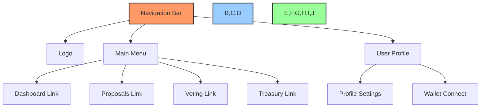
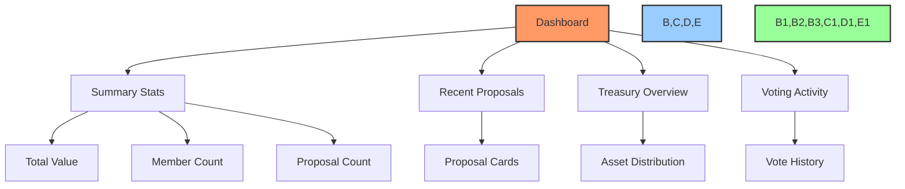
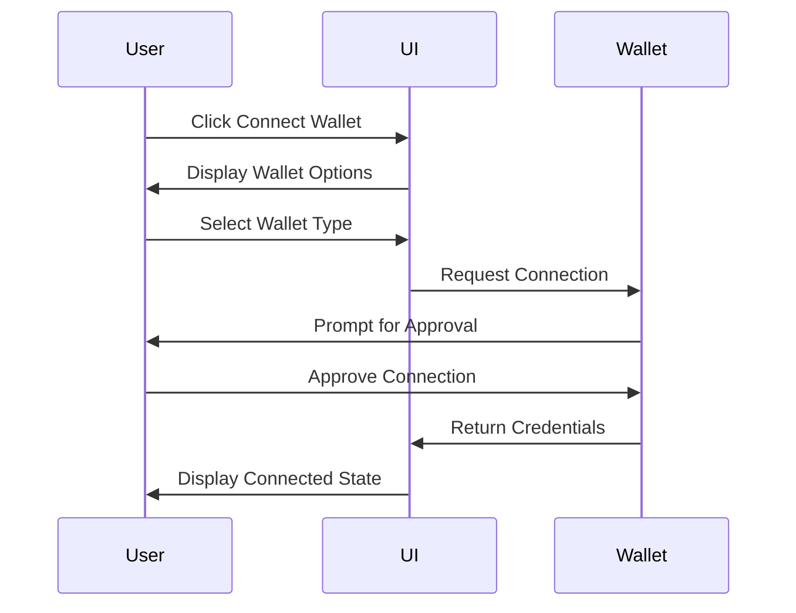
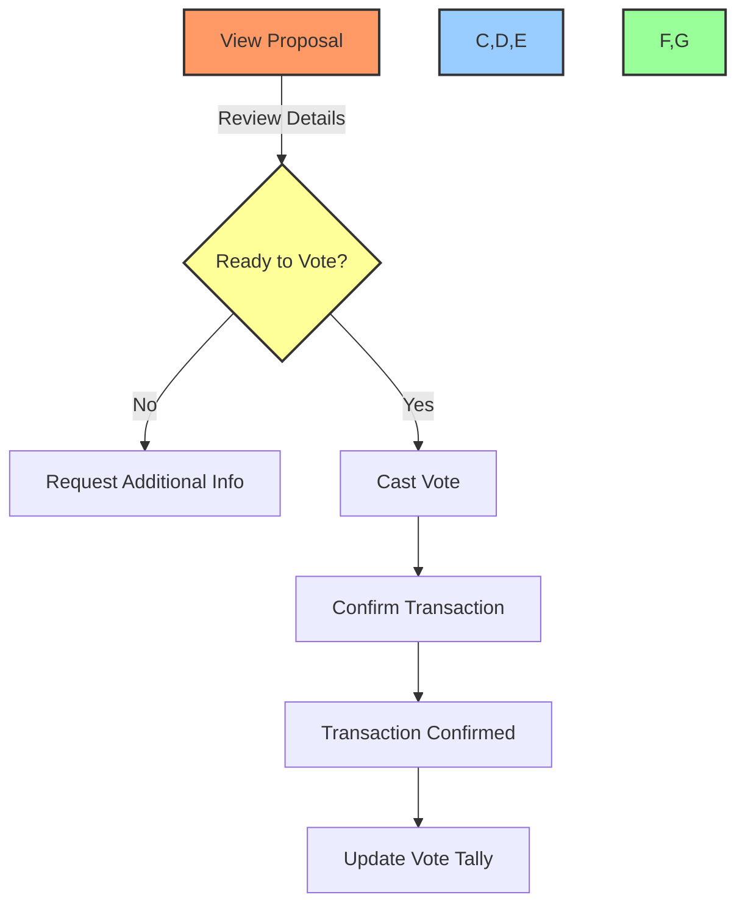

# 🖼️ UI Wireframes and Mockups

## 📋 Table of Contents
- [🔍 Overview](#overview)
- [🎯 Purpose](#purpose)
- [🧩 Component Wireframes](#component-wireframes)
- [📱 Page Layouts](#page-layouts)
- [🔄 User Interaction Flows](#user-interaction-flows)
- [🎨 Design Evolution](#design-evolution)
- [📊 Implementation Status](#implementation-status)

## 🔍 Overview

This document contains the wireframes and mockups for the BAD DAO UI. It serves as a visual blueprint for the user interface implementation, providing developers and designers with a clear reference for layout, component placement, and user interaction patterns.

## 🎯 Purpose

These wireframes and mockups aim to:
- Establish a consistent visual language across the application
- Define component placement and hierarchy
- Visualize user flows and interaction patterns
- Provide a reference for implementing the UI components
- Serve as a communication tool between designers and developers

## 🧩 Component Wireframes

### 🔷 Navigation Component


### 📊 Dashboard Widgets


### 🗳️ Voting Interface
- 🔴 Not Started
- Detailed wireframe to be designed

## 📱 Page Layouts

### 🏠 Homepage Layout
```
+---------------------------------------+
|              HEADER/NAV               |
+---------------------------------------+
|                                       |
|           HERO SECTION                |
|           - Value prop                |
|           - Call to action            |
|                                       |
+---------------------------------------+
|                                       |
|         DASHBOARD PREVIEW             |
|         - Key metrics                 |
|         - Activity summary            |
|                                       |
+---------------------------------------+
|                                       |
|         FEATURE HIGHLIGHTS            |
|         - 3-4 key features            |
|         - Icons & descriptions        |
|                                       |
+---------------------------------------+
|                                       |
|           TESTIMONIALS                |
|                                       |
+---------------------------------------+
|              FOOTER                   |
+---------------------------------------+
```

### 📊 Dashboard Layout
```
+---------------------------------------+
|              HEADER/NAV               |
+---------------------------------------+
|                                       |
|           SUMMARY METRICS             |
|                                       |
+------------------+--------------------+
|                  |                    |
|   ACTIVE         |    TREASURY        |
|   PROPOSALS      |    OVERVIEW        |
|                  |                    |
+------------------+--------------------+
|                                       |
|           VOTING HISTORY              |
|                                       |
+---------------------------------------+
|                                       |
|        RECENT TRANSACTIONS            |
|                                       |
+---------------------------------------+
|              FOOTER                   |
+---------------------------------------+
```

### 📑 Proposal View
- 🟡 In Progress
- Detailed layout to be finalized

## 🔄 User Interaction Flows

### 🔑 Connect Wallet Flow


### 🗳️ Voting Flow


## 🎨 Design Evolution

This section will track the evolution of key designs as they move from wireframe to final implementation:

### 📱 Dashboard Evolution
- 🔴 Initial Wireframe - Not Started
- 🔴 Low-fidelity Mockup - Not Started
- 🔴 High-fidelity Mockup - Not Started
- 🔴 Implementation - Not Started

### 🗳️ Voting Interface Evolution
- 🔴 Initial Wireframe - Not Started
- 🔴 Low-fidelity Mockup - Not Started
- 🔴 Low-fidelity Mockup - Not Started
- 🔴 Implementation - Not Started

## 📊 Implementation Status

| Component | Wireframe | Mockup | Implementation |
|-----------|-----------|--------|----------------|
| Navigation | 🟢 Complete | 🟡 In Progress | 🔴 Not Started |
| Dashboard | 🟢 Complete | 🟡 In Progress | 🔴 Not Started |
| Proposal List | 🟡 In Progress | 🔴 Not Started | 🔴 Not Started |
| Proposal Detail | 🟡 In Progress | 🔴 Not Started | 🔴 Not Started |
| Voting Interface | 🔴 Not Started | 🔴 Not Started | 🔴 Not Started |
| Treasury View | 🔴 Not Started | 🔴 Not Started | 🔴 Not Started |
| User Profile | 🔴 Not Started | 🔴 Not Started | 🔴 Not Started |

---

Made with Power, Love, and AI •  ⚡️❤️🤖 •  POWERBRIDGE.AI 