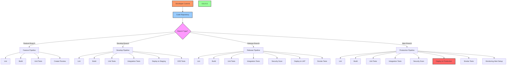
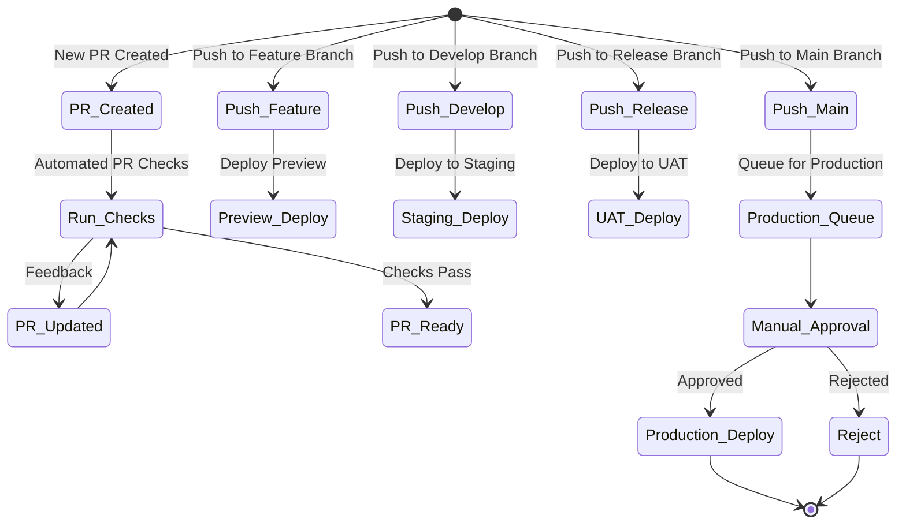
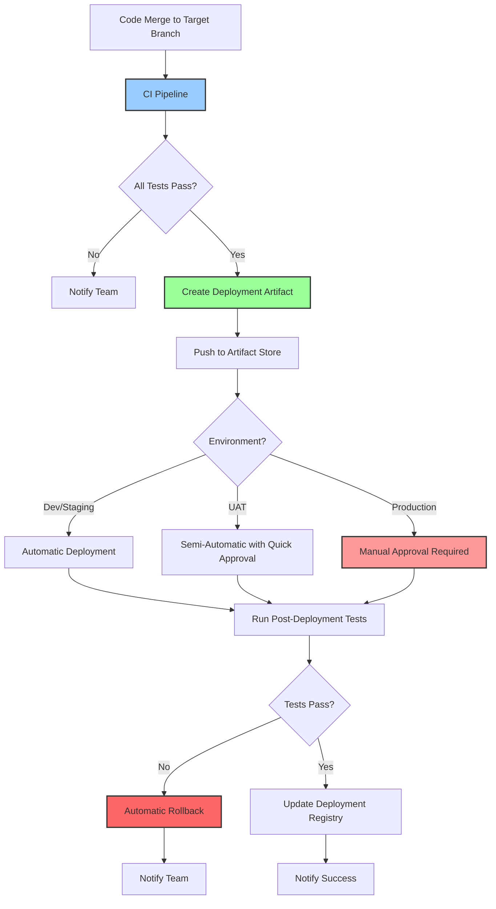
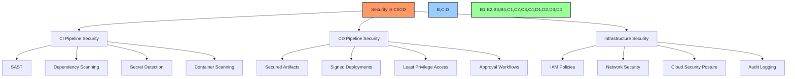
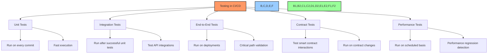
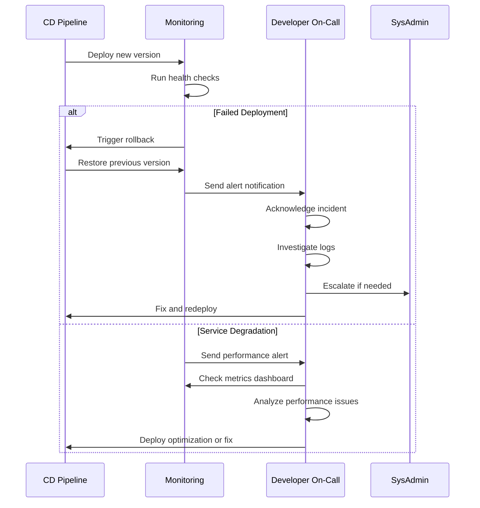

# 🔄 Continuous Integration & Deployment

## 📋 Table of Contents
- [🔍 Overview](#overview)
- [🎯 Purpose](#purpose)
- [🏗️ CI/CD Architecture](#cicd-architecture)
- [🔧 Tools & Infrastructure](#tools--infrastructure)
- [🔀 CI Workflow](#ci-workflow)
- [📦 CD Workflow](#cd-workflow)
- [🛡️ Security & Compliance](#security--compliance)
- [📊 Monitoring & Metrics](#monitoring--metrics)
- [🧪 Testing Strategy](#testing-strategy)
- [🚨 Incident Response](#incident-response)
- [📑 Best Practices](#best-practices)

## 🔍 Overview

This document outlines the Continuous Integration and Continuous Deployment (CI/CD) processes for the BAD DAO UI application. It details the automated workflows, tools, and practices implemented to ensure reliable, efficient, and secure delivery of code changes from development to production environments.

## 🎯 Purpose

The CI/CD implementation aims to:
- Automate the build, test, and deployment processes
- Catch issues early in the development lifecycle
- Ensure consistent deployment across environments
- Provide rapid, reliable feedback to developers
- Minimize manual intervention in the deployment process
- Support infrastructure as code principles
- Enable safe rollbacks and versioning
- Maintain audit trails for all deployments

## 🏗️ CI/CD Architecture

The overall CI/CD architecture is designed to support multiple environments with appropriate gates and validations between stages.



### Environment Strategy

| Environment | Purpose | Branch | Deployment | Access |
|-------------|---------|--------|------------|--------|
| Development | Feature testing | Feature branches | Automatic on PR | Development team |
| Staging | Integration testing | develop | Automatic on merge | Development & QA team |
| UAT | User acceptance testing | release-* | Automatic on merge | Stakeholders & QA team |
| Production | Live application | main | Manual approval | Public |

## 🔧 Tools & Infrastructure

### Core Tools

1. **GitHub Actions**
   - Primary CI/CD platform
   - Handles build, test, and deployment pipelines
   - Integrated with GitHub repository

2. **Docker**
   - Application containerization
   - Ensures consistent environments
   - Used in both CI and deployment

3. **AWS**
   - Primary cloud provider
   - Services used:
     - S3 for static assets
     - CloudFront for CDN
     - Route53 for DNS
     - Lambda for serverless functions
     - WAF for security

4. **Terraform**
   - Infrastructure as Code (IaC)
   - Manages cloud infrastructure
   - Version controlled in separate repository

### Artifact Management

- Docker images stored in Amazon ECR
- Front-end builds stored in S3
- Smart contract artifacts stored in IPFS

### Configuration Management

- Environment variables managed through AWS Parameter Store
- Secrets managed through AWS Secrets Manager
- Environment-specific configurations stored in code repository

## 🔀 CI Workflow

### Workflow Triggers



### CI Pipeline Stages

1. **Code Quality**
   - Linting (ESLint, Prettier)
   - Static code analysis (SonarQube)
   - Code style enforcement

2. **Build**
   - Dependency installation
   - Compilation and bundling
   - Asset optimization
   - Docker image creation

3. **Testing**
   - Unit tests (Jest)
   - Integration tests
   - Component tests (React Testing Library)
   - Contract tests (Hardhat)

4. **Security Scanning**
   - Dependency vulnerability scanning (npm audit)
   - SAST (Static Application Security Testing)
   - Docker image scanning

### Example GitHub Actions Workflow

```yaml
# CI workflow for BAD DAO UI
name: CI Pipeline

on:
  push:
    branches: [ main, develop, 'release-*', 'feature/*' ]
  pull_request:
    branches: [ main, develop, 'release-*' ]

jobs:
  lint:
    runs-on: ubuntu-latest
    steps:
      - uses: actions/checkout@v3
      - name: Setup Node.js
        uses: actions/setup-node@v3
        with:
          node-version: '16'
          cache: 'npm'
      - name: Install dependencies
        run: npm ci
      - name: Lint code
        run: npm run lint
      - name: Check formatting
        run: npm run format:check

  build:
    needs: lint
    runs-on: ubuntu-latest
    steps:
      - uses: actions/checkout@v3
      - name: Setup Node.js
        uses: actions/setup-node@v3
        with:
          node-version: '16'
          cache: 'npm'
      - name: Install dependencies
        run: npm ci
      - name: Build application
        run: npm run build
      - name: Upload build artifacts
        uses: actions/upload-artifact@v3
        with:
          name: build-artifacts
          path: build/

  test:
    needs: build
    runs-on: ubuntu-latest
    steps:
      - uses: actions/checkout@v3
      - name: Setup Node.js
        uses: actions/setup-node@v3
        with:
          node-version: '16'
          cache: 'npm'
      - name: Install dependencies
        run: npm ci
      - name: Run unit tests
        run: npm test -- --coverage
      - name: Run integration tests
        run: npm run test:integration
      - name: Upload test coverage
        uses: actions/upload-artifact@v3
        with:
          name: coverage-report
          path: coverage/

  security-scan:
    needs: build
    runs-on: ubuntu-latest
    steps:
      - uses: actions/checkout@v3
      - name: Setup Node.js
        uses: actions/setup-node@v3
        with:
          node-version: '16'
          cache: 'npm'
      - name: Install dependencies
        run: npm ci
      - name: Run npm audit
        run: npm audit --audit-level=high
      - name: Run SAST scan
        uses: github/codeql-action/analyze@v2
      - name: Container security scan
        uses: aquasecurity/trivy-action@master
        with:
          image-ref: 'badao-ui:${{ github.sha }}'
          format: 'table'
          exit-code: '1'
          ignore-unfixed: true
          severity: 'CRITICAL,HIGH'
```

## 📦 CD Workflow

### Deployment Strategy



### Deployment Methods

1. **Blue-Green Deployment**
   - Two identical production environments
   - One active, one idle
   - Switch traffic after successful deployment
   - Easy rollback by switching back

2. **Canary Releases**
   - Gradual rollout to a subset of users
   - Monitor performance and errors
   - Increase percentage if metrics are good
   - Rollback if issues detected

3. **Feature Flags**
   - Decouple deployment from release
   - Control feature visibility
   - A/B testing capabilities
   - Targeted rollouts to specific users

### Example Deployment Workflow

```yaml
# CD workflow for BAD DAO UI
name: Deploy to Environment

on:
  workflow_dispatch:
    inputs:
      environment:
        description: 'Environment to deploy to'
        required: true
        default: 'staging'
        type: choice
        options:
          - staging
          - uat
          - production
      version:
        description: 'Version to deploy'
        required: true
        type: string

jobs:
  prepare-deployment:
    runs-on: ubuntu-latest
    steps:
      - name: Get deployment approval for production
        if: ${{ github.event.inputs.environment == 'production' }}
        uses: trstringer/manual-approval@v1
        with:
          secret: ${{ secrets.GITHUB_TOKEN }}
          approvers: tech-lead,product-manager
          minimum-approvals: 2
          issue-title: "Deploying to production"
          issue-body: "Please approve the deployment of version ${{ github.event.inputs.version }} to production"
          exclude-workflow-initiator-as-approver: false
          
      - name: Checkout code
        uses: actions/checkout@v3
        
      - name: Download artifact
        uses: actions/download-artifact@v3
        with:
          name: badao-ui-${{ github.event.inputs.version }}
          path: ./deployment
          
      - name: Configure AWS credentials
        uses: aws-actions/configure-aws-credentials@v1
        with:
          aws-access-key-id: ${{ secrets.AWS_ACCESS_KEY_ID }}
          aws-secret-access-key: ${{ secrets.AWS_SECRET_ACCESS_KEY }}
          aws-region: us-east-1
          
      - name: Deploy to S3
        run: |
          aws s3 sync ./deployment s3://badao-ui-${{ github.event.inputs.environment }} --delete
          
      - name: Invalidate CloudFront cache
        run: |
          aws cloudfront create-invalidation --distribution-id ${{ secrets.CLOUDFRONT_DISTRIBUTION_ID }} --paths "/*"
          
      - name: Create deployment record
        run: |
          echo '{
            "version": "${{ github.event.inputs.version }}",
            "environment": "${{ github.event.inputs.environment }}",
            "deployedAt": "'$(date -u +"%Y-%m-%dT%H:%M:%SZ")'",
            "deployedBy": "${{ github.actor }}",
            "commit": "${{ github.sha }}"
          }' > deployment-record.json
          aws s3 cp deployment-record.json s3://badao-deployments/${{ github.event.inputs.environment }}/latest.json
          
      - name: Run smoke tests
        run: |
          BASE_URL="https://${{ github.event.inputs.environment == 'production' && 'app.baddao.io' || github.event.inputs.environment == 'uat' && 'uat.baddao.io' || 'staging.baddao.io' }}"
          npm run test:smoke -- --base-url=$BASE_URL
        env:
          NODE_ENV: ${{ github.event.inputs.environment }}
```

## 🛡️ Security & Compliance

### Security Gates

1. **Dependency Scanning**
   - Regular scanning of all dependencies
   - Block deployments with critical vulnerabilities
   - Automated dependency updates via Dependabot

2. **Secret Detection**
   - Pre-commit hooks to detect secrets
   - CI pipeline checks for leaked credentials
   - Regular secret rotation

3. **Compliance Checks**
   - License compliance scanning
   - Accessibility testing (WCAG)
   - Data protection validation

### Security Measures in CI/CD



## 📊 Monitoring & Metrics

### Pipeline Metrics

| Metric | Description | Target | Alert Threshold |
|--------|-------------|--------|-----------------|
| Pipeline Duration | Total time from commit to deployment | < 15 minutes | > 30 minutes |
| Build Success Rate | Percentage of successful builds | > 95% | < 90% |
| Test Coverage | Code coverage percentage | > 80% | < 70% |
| Deployment Frequency | How often code is deployed | Daily | < Weekly |
| Change Failure Rate | Percentage of deployments causing incidents | < 5% | > 10% |
| Mean Time to Recovery | Average time to recover from failures | < 1 hour | > 4 hours |

### Deployment Monitoring

1. **Pre-deployment Checks**
   - Environment validation
   - Dependency verification
   - Resource availability checks

2. **Post-deployment Validation**
   - Smoke tests
   - Health checks
   - Performance baseline comparison

3. **Continuous Monitoring**
   - Error rate tracking
   - Performance metrics
   - User behavior analysis

### Examples of Monitoring Integrations

```typescript
// Example application health check endpoint
app.get('/api/health', (req, res) => {
  const healthStatus = {
    status: 'ok',
    version: process.env.APP_VERSION,
    timestamp: new Date().toISOString(),
    services: {
      database: checkDatabaseConnection(),
      redis: checkRedisConnection(),
      blockchain: checkBlockchainConnection()
    },
    uptime: process.uptime()
  };
  
  const allServicesHealthy = Object.values(healthStatus.services)
    .every(status => status === 'ok');
  
  res.status(allServicesHealthy ? 200 : 503).json(healthStatus);
});

// Deployment notification webhook integration
function notifyDeployment(environment, version, status) {
  const webhookUrl = process.env.SLACK_WEBHOOK_URL;
  
  fetch(webhookUrl, {
    method: 'POST',
    headers: {
      'Content-Type': 'application/json'
    },
    body: JSON.stringify({
      text: `Deployment to ${environment} - Version: ${version} - Status: ${status}`,
      blocks: [
        {
          type: 'section',
          text: {
            type: 'mrkdwn',
            text: `*Deployment Notification*`
          }
        },
        {
          type: 'section',
          fields: [
            {
              type: 'mrkdwn',
              text: `*Environment:* ${environment}`
            },
            {
              type: 'mrkdwn',
              text: `*Version:* ${version}`
            },
            {
              type: 'mrkdwn',
              text: `*Status:* ${status}`
            },
            {
              type: 'mrkdwn',
              text: `*Time:* ${new Date().toISOString()}`
            }
          ]
        }
      ]
    })
  });
}
```

## 🧪 Testing Strategy

### Test Types in CI/CD



### Test Execution Strategy

1. **Test Pyramid Implementation**
   - Many unit tests (fast, focused)
   - Fewer integration tests (service interactions)
   - Small number of E2E tests (critical paths)

2. **Test Environment Management**
   - Ephemeral test environments
   - Containerized dependencies
   - Data reset between test runs

3. **Test Data Strategy**
   - Fixtures for common data patterns
   - Data generation scripts
   - Mock data services

### Test Examples

```typescript
// Unit test example (Jest + React Testing Library)
describe('ProposalCard Component', () => {
  it('renders proposal title and details correctly', () => {
    const mockProposal = {
      id: '1',
      title: 'Test Proposal',
      description: 'This is a test proposal',
      votes: {
        for: '100',
        against: '50',
        abstain: '10'
      }
    };
    
    const { getByText } = render(<ProposalCard proposal={mockProposal} />);
    
    expect(getByText('Test Proposal')).toBeInTheDocument();
    expect(getByText('This is a test proposal')).toBeInTheDocument();
    expect(getByText('100')).toBeInTheDocument(); // For votes
  });
  
  it('triggers vote function when vote button clicked', () => {
    const mockProposal = { id: '1', title: 'Test Proposal' };
    const mockVoteFunction = jest.fn();
    
    const { getByText } = render(
      <ProposalCard 
        proposal={mockProposal} 
        onVote={mockVoteFunction} 
      />
    );
    
    fireEvent.click(getByText('Vote For'));
    
    expect(mockVoteFunction).toHaveBeenCalledWith('1', 'for');
  });
});

// E2E test example (Cypress)
describe('Governance Flow', () => {
  beforeEach(() => {
    cy.intercept('GET', '/api/proposals', { fixture: 'proposals.json' }).as('getProposals');
    cy.login(); // Custom command for authentication
    cy.visit('/governance');
    cy.wait('@getProposals');
  });
  
  it('allows user to view proposal details', () => {
    cy.contains('Test Proposal').click();
    cy.url().should('include', '/proposals/1');
    cy.contains('h1', 'Test Proposal').should('be.visible');
    cy.contains('Voting Period').should('be.visible');
  });
  
  it('allows user to cast a vote', () => {
    cy.intercept('POST', '/api/vote', { status: 200 }).as('castVote');
    
    cy.contains('Test Proposal').click();
    cy.get('[data-testid="vote-for-button"]').click();
    cy.get('[data-testid="confirm-vote-button"]').click();
    
    cy.wait('@castVote');
    cy.contains('Vote successfully cast').should('be.visible');
  });
});
```

## 🚨 Incident Response

### Deployment Failures

1. **Automated Rollback**
   - Triggered by failing smoke tests
   - Returns to last known good state
   - Preserves environment stability

2. **Failure Classification**
   - Build failures
   - Deployment failures
   - Runtime failures
   - Performance degradation

3. **Notification System**
   - Immediate alerts to responsible team
   - Escalation for critical failures
   - Status page updates

### Incident Process



### Failure Response Protocol

| Failure Type | Response | SLA | Documentation Required |
|--------------|----------|-----|------------------------|
| Build Failure | Fix code and rebuild | 1 hour | Issue in GitHub |
| Deployment Failure | Investigate, fix, redeploy | 2 hours | Post-mortem document |
| Critical Service Outage | Rollback, emergency fix | 30 minutes | Incident report |
| Performance Degradation | Scale, optimize, monitor | 4 hours | Performance analysis |

## 📑 Best Practices

### Code Management

1. **Branch Protection Rules**
   - Require status checks to pass before merging
   - Require code review approvals
   - Prevent force-pushing to protected branches
   - Automatically delete merged branches

2. **Commit Conventions**
   - Semantic commit messages
   - Linked issues in commits
   - Squash commits on merge

3. **PR Templates**
   - Description of changes
   - Testing procedures
   - Screenshots/videos where applicable
   - Checklist of requirements

### Pipeline Optimization

1. **Parallel Execution**
   - Run independent jobs concurrently
   - Split test suites for faster execution
   - Balance workloads across runners

2. **Caching Strategy**
   - Cache dependencies between runs
   - Cache build artifacts
   - Reuse test results when possible

3. **Self-healing Pipelines**
   - Retry flaky tests automatically
   - Clean up resources after job completion
   - Monitor runner health

### Deployment Checklist

1. **Pre-deployment**
   - All tests pass
   - Security scans complete
   - Required approvals received
   - Change management process followed

2. **Deployment Process**
   - Environment configuration validated
   - Database migrations planned
   - Backup strategy in place
   - Rollback procedure documented

3. **Post-deployment**
   - Smoke tests complete
   - Monitoring active
   - Documentation updated
   - Success metrics reported

---

Made with Power, Love, and AI •  ⚡️❤️🤖 •  POWERBRIDGE.AI 