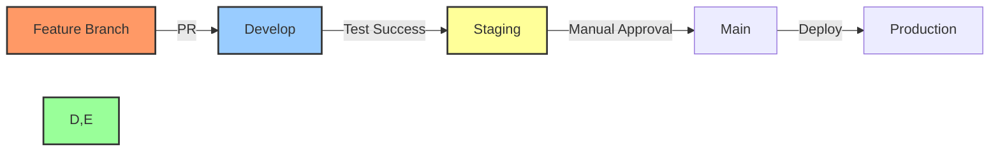

# 📝 Coding Standards and Conventions

## 📋 Table of Contents
- [🔍 Overview](#overview)
- [🎯 Purpose](#purpose)
- [🧰 Development Stack](#development-stack)
- [📊 Code Organization](#code-organization)
- [🔠 Naming Conventions](#naming-conventions)
- [🖌️ Formatting Guidelines](#formatting-guidelines)
- [⚡ Performance Best Practices](#performance-best-practices)
- [🧪 Testing Standards](#testing-standards)
- [📊 Documentation Standards](#documentation-standards)
- [🔒 Security Guidelines](#security-guidelines)
- [🚀 CI/CD Integration](#cicd-integration)

## 🔍 Overview

This document establishes the coding standards and conventions for the BAD DAO UI project. It provides guidance on code style, organization, testing, and other development practices to ensure consistency, quality, and maintainability across the codebase.

## 🎯 Purpose

These coding standards aim to:
- Create a consistent and uniform codebase
- Improve code readability and maintainability
- Reduce onboarding time for new developers
- Prevent common bugs and security issues
- Facilitate effective code reviews
- Ensure optimal performance and accessibility

## 🧰 Development Stack

### Core Technologies

| Category | Technologies |
|----------|--------------|
| Frontend Framework | React 18 |
| State Management | Redux Toolkit, React Context |
| UI Components | Chakra UI, Tailwind CSS |
| Build Tools | Vite |
| Language | TypeScript 5.0+ |
| Testing | Jest, React Testing Library, Cypress |
| API Communication | Apollo Client (GraphQL), TanStack Query |
| Blockchain Integration | ethers.js, wagmi |

### Development Tools

| Tool | Version | Purpose |
|------|---------|---------|
| ESLint | 8.38+ | Code linting |
| Prettier | 2.8+ | Code formatting |
| TypeScript | 5.0+ | Type checking |
| Husky | 8.0+ | Git hooks |
| lint-staged | 13.2+ | Pre-commit linting |
| Storybook | 7.0+ | Component documentation |
| Plop | 3.1+ | Code generation |

## 📊 Code Organization

### Project Structure

```
src/
├── assets/            # Static assets (images, fonts, etc.)
├── components/        # Reusable UI components
│   ├── atoms/         # Basic building blocks
│   ├── molecules/     # Combinations of atoms
│   ├── organisms/     # Complex components
│   └── templates/     # Page layouts
├── config/            # Application configuration
├── constants/         # Application constants
├── contexts/          # React contexts
├── features/          # Feature-based modules
│   ├── governance/    # Governance feature
│   ├── treasury/      # Treasury feature
│   └── voting/        # Voting feature
├── hooks/             # Custom React hooks
├── layouts/           # Layout components
├── lib/               # Third-party library wrappers
├── pages/             # Application pages
├── services/          # API/external services
├── store/             # Global state management
├── styles/            # Global styles
├── types/             # TypeScript type definitions
└── utils/             # Utility functions
```

### Feature-Based Organization

Each feature directory follows this structure:
```
features/feature-name/
├── components/        # Feature-specific components
├── hooks/             # Feature-specific hooks
├── services/          # Feature-specific services
├── types/             # Feature-specific types
├── utils/             # Feature-specific utilities
├── constants.ts       # Feature constants
├── context.tsx        # Feature context (if needed)
└── index.ts           # Feature entry point
```

### Import Order

Follow this order for imports:
1. External libraries
2. Internal absolute imports (components, hooks, etc.)
3. Relative imports
4. CSS/SCSS imports

```tsx
// 1. External libraries
import React, { useState, useEffect } from 'react';
import { useDispatch, useSelector } from 'react-redux';

// 2. Internal absolute imports
import { Button } from '@/components/atoms';
import { useAuth } from '@/hooks/useAuth';

// 3. Relative imports
import { VotingCard } from '../components';
import { formatVotes } from '../utils';

// 4. CSS/SCSS imports
import './ProposalList.scss';
```

## 🔠 Naming Conventions

### General Rules

- Use meaningful, descriptive names
- Avoid abbreviations unless widely recognized
- Be consistent in terminology
- Prioritize clarity over brevity

### Specific Conventions

| Type | Convention | Example |
|------|------------|---------|
| Files | PascalCase for components | `ProposalCard.tsx` |
| Files | kebab-case for utilities | `format-address.ts` |
| Components | PascalCase | `ProposalCard` |
| Interfaces | Prefix with 'I' | `IProposalData` |
| Types | PascalCase | `ProposalStatus` |
| Enums | PascalCase | `VoteDirection` |
| Constants | UPPER_SNAKE_CASE | `MAX_TOKENS` |
| Functions | camelCase | `formatAddress()` |
| Variables | camelCase | `userVotes` |
| Boolean variables | Prefix with 'is', 'has', 'should' | `isLoading`, `hasVoted` |
| CSS Classes | kebab-case | `proposal-card` |
| Redux Actions | domain/action format | `proposals/vote` |

### Component Naming

- **Prefix UI components** with their type:
  - `Button` → `PrimaryButton`, `SecondaryButton`
  - `Card` → `ProposalCard`, `TreasuryCard`
- **Suffix containers/providers** with their role:
  - `ProposalProvider`, `VotingContainer`
- **Suffix HOCs** with `with`:
  - `withAuthentication`, `withVotingPower`

## 🖌️ Formatting Guidelines

### Code Style

- Use 2 spaces for indentation
- Maximum line length: 100 characters
- Use semicolons at the end of statements
- Use single quotes for strings
- Always use curly braces for blocks
- Always use explicit return types for functions

### ESLint Configuration

```js
// .eslintrc.js
module.exports = {
  extends: [
    'eslint:recommended',
    'plugin:react/recommended',
    'plugin:@typescript-eslint/recommended',
    'plugin:jsx-a11y/recommended',
    'plugin:react-hooks/recommended',
    'prettier'
  ],
  rules: {
    'react/react-in-jsx-scope': 'off',
    'react/prop-types': 'off',
    '@typescript-eslint/explicit-function-return-type': ['error', {
      allowExpressions: true,
      allowTypedFunctionExpressions: true
    }],
    '@typescript-eslint/no-unused-vars': ['error', {
      argsIgnorePattern: '^_',
      varsIgnorePattern: '^_'
    }]
  }
};
```

### Prettier Configuration

```js
// .prettierrc.js
module.exports = {
  semi: true,
  singleQuote: true,
  trailingComma: 'es5',
  printWidth: 100,
  tabWidth: 2,
  arrowParens: 'avoid',
  bracketSpacing: true
};
```

### Git Commit Messages

Follow the [Conventional Commits](https://www.conventionalcommits.org/) format:

```
<type>[optional scope]: <description>

[optional body]

[optional footer(s)]
```

Types:
- `feat`: New feature
- `fix`: Bug fix
- `docs`: Documentation only changes
- `style`: Changes that do not affect code functionality
- `refactor`: Code change that neither fixes a bug nor adds a feature
- `perf`: Code change that improves performance
- `test`: Adding missing or correcting existing tests
- `chore`: Changes to the build process or auxiliary tools

## ⚡ Performance Best Practices

### React Performance

- Use `React.memo()` for component memoization when appropriate
- Implement `useMemo()` and `useCallback()` for expensive calculations and callbacks
- Avoid inline function definitions in render
- Use virtualization for long lists with `react-window` or `react-virtualized`
- Implement code splitting with `React.lazy()` and `Suspense`

```tsx
// Good practice
const MemoizedComponent = React.memo(({ data }) => {
  const processedData = useMemo(() => expensiveOperation(data), [data]);
  const handleClick = useCallback(() => {
    // Handle click
  }, []);
  
  return <div onClick={handleClick}>{processedData}</div>;
});
```

### Resource Loading

- Implement lazy loading for images
- Use SVG for icons where possible
- Compress and optimize assets
- Implement code splitting at the route level
- Preload critical resources

```tsx
// Route-based code splitting
const Governance = React.lazy(() => import('./pages/Governance'));
const Treasury = React.lazy(() => import('./pages/Treasury'));

function App(): JSX.Element {
  return (
    <Suspense fallback={<LoadingSpinner />}>
      <Routes>
        <Route path="/governance" element={<Governance />} />
        <Route path="/treasury" element={<Treasury />} />
      </Routes>
    </Suspense>
  );
}
```

### State Management

- Keep component state as local as possible
- Use context API for shared state that doesn't change often
- Use Redux for complex global state with frequent updates
- Normalize complex data structures
- Use selectors to compute derived state

## 🧪 Testing Standards

### Test Types and Coverage

| Test Type | Tool | Target Coverage | Focus Areas |
|-----------|------|----------------|-------------|
| Unit Tests | Jest | 80%+ | Utilities, hooks, reducers |
| Component Tests | RTL | 70%+ | UI components, interactions |
| Integration Tests | Cypress | 60%+ | User flows, feature interaction |
| E2E Tests | Cypress | Key flows | Critical user journeys |

### Test Naming

Follow this pattern: `describe('ComponentName', () => { it('should behavior when condition', () => {}) })`

```tsx
// Example test
describe('ProposalCard', () => {
  it('should display proposal title', () => {
    // Test implementation
  });
  
  it('should show voting buttons when proposal is active', () => {
    // Test implementation
  });
});
```

### Test Structure

Each test should follow the AAA pattern:
- **Arrange**: Set up test data and conditions
- **Act**: Perform the action being tested
- **Assert**: Verify the expected outcome

```tsx
it('should update vote count when user votes', () => {
  // Arrange
  const proposal = { id: '1', title: 'Test Proposal', votesFor: 10 };
  render(<ProposalCard proposal={proposal} />);
  
  // Act
  fireEvent.click(screen.getByRole('button', { name: /vote for/i }));
  
  // Assert
  expect(screen.getByText('Votes: 11')).toBeInTheDocument();
});
```

### Mocking

- Use Jest mock functions for external dependencies
- Create mock services for API calls
- Use MSW (Mock Service Worker) for network request mocking
- Create test data factories for consistent test data

## 📊 Documentation Standards

### Code Documentation

- Document all public functions and interfaces
- Use JSDoc-style comments for functions
- Add comments for complex logic
- Document non-obvious side effects

```tsx
/**
 * Calculates user's voting power based on token balance and delegation
 * 
 * @param address - User's wallet address
 * @param blockNumber - Optional block number to get historical voting power
 * @returns Total voting power as BigNumber
 */
export async function calculateVotingPower(
  address: string, 
  blockNumber?: number
): Promise<BigNumber> {
  // Implementation
}
```

### Component Documentation

Use Storybook to document components:
- Create stories for all component variants
- Include prop documentation
- Add usage examples
- Document accessibility considerations

```tsx
// Button.stories.tsx
import { Button } from './Button';

export default {
  title: 'Atoms/Button',
  component: Button,
  argTypes: {
    variant: { control: 'select', options: ['primary', 'secondary', 'tertiary'] },
    size: { control: 'select', options: ['small', 'medium', 'large'] },
    isDisabled: { control: 'boolean' },
  },
};

const Template = (args) => <Button {...args} />;

export const Primary = Template.bind({});
Primary.args = {
  variant: 'primary',
  children: 'Primary Button',
  size: 'medium',
};
```

## 🔒 Security Guidelines

### Data Handling

- Never store sensitive data (private keys, etc.) in client-side storage
- Sanitize user inputs before processing
- Use environment variables for API keys and config
- Implement proper error handling to avoid leaking sensitive information

### Web3 Security

- Always validate signatures server-side
- Use reputable libraries for crypto operations
- Never expose private keys in frontend code
- Implement proper error handling for all blockchain operations
- Use appropriate timeouts for blockchain operations

```tsx
// Good practice
try {
  const tx = await contract.vote(proposalId, voteDirection);
  await tx.wait(1); // Wait for 1 confirmation
  
  onSuccess(tx.hash);
} catch (error) {
  if (error.code === 'ACTION_REJECTED') {
    onUserRejection();
  } else {
    onError('Transaction failed: ' + getErrorMessage(error));
    logError(error);
  }
}
```

### Authentication

- Implement proper wallet connection flow
- Use message signing for authentication
- Validate session tokens regularly
- Implement proper session expiry
- Use secure, HTTP-only cookies for sensitive data

## 🚀 CI/CD Integration

### Pre-commit Hooks

Use Husky and lint-staged for pre-commit validation:

```json
// package.json
{
  "husky": {
    "hooks": {
      "pre-commit": "lint-staged",
      "commit-msg": "commitlint -E HUSKY_GIT_PARAMS"
    }
  },
  "lint-staged": {
    "*.{ts,tsx}": [
      "eslint --fix",
      "prettier --write",
      "jest --findRelatedTests"
    ]
  }
}
```

### GitHub Actions Workflow

```yaml
# .github/workflows/ci.yml
name: CI

on:
  push:
    branches: [ main, develop ]
  pull_request:
    branches: [ main, develop ]

jobs:
  validate:
    runs-on: ubuntu-latest
    steps:
      - uses: actions/checkout@v3
      - uses: actions/setup-node@v3
        with:
          node-version: '18'
          cache: 'yarn'
      - run: yarn install --frozen-lockfile
      - run: yarn type-check
      - run: yarn lint
      - run: yarn test
      - run: yarn build
```

### Deployment Process

1. **Development**: Automatic deploy on push to `develop`
2. **Staging**: Automatic deploy on merge to `staging`
3. **Production**: Manual approval after merge to `main`



## 🔍 Documentation Status

| Section | Status | Last Updated |
|---------|--------|--------------|
| Code Organization | 🟢 Complete | 2023-05-10 |
| Naming Conventions | 🟢 Complete | 2023-05-10 |
| Formatting Guidelines | 🟢 Complete | 2023-05-10 |
| Performance Best Practices | 🟢 Complete | 2023-05-10 |
| Testing Standards | 🟢 Complete | 2023-05-10 |
| Documentation Standards | 🟢 Complete | 2023-05-10 |
| Security Guidelines | 🟢 Complete | 2023-05-10 |
| CI/CD Integration | 🟢 Complete | 2023-05-10 |

---

Made with Power, Love, and AI •  ⚡️❤️🤖 •  POWERBRIDGE.AI 