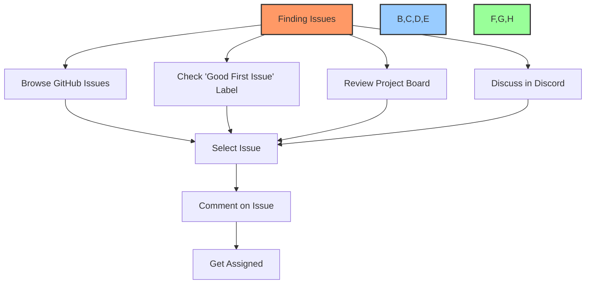
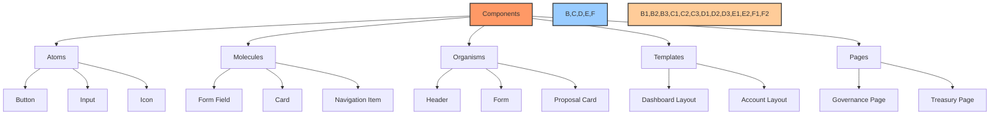
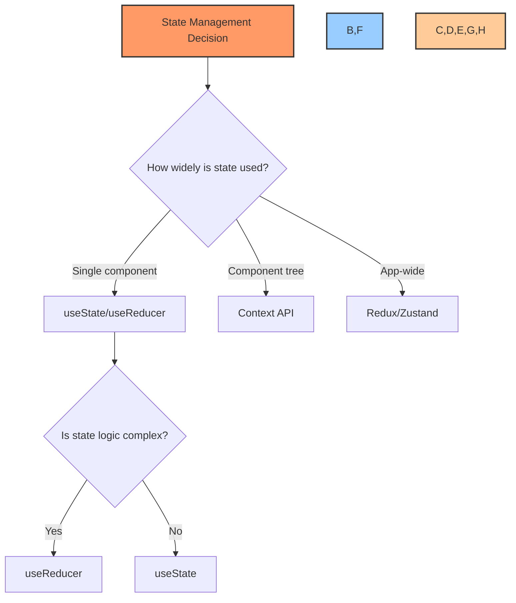
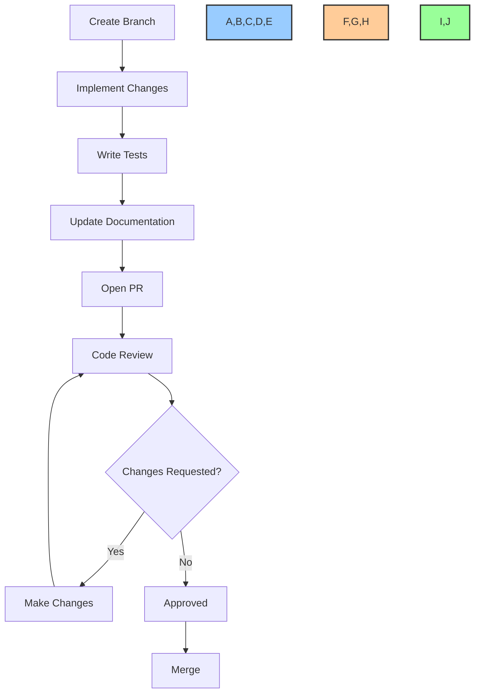
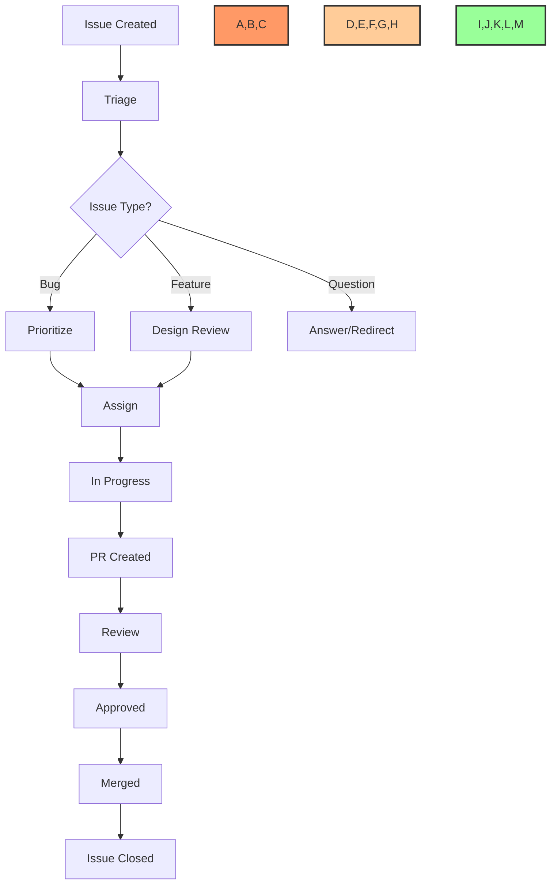

# 🤝 Contribution Guidelines

## 📋 Table of Contents
- [🔍 Overview](#overview)
- [🌱 Getting Started](#getting-started)
- [🏗️ Development Environment](#development-environment)
- [📝 Code Standards](#code-standards)
- [🧩 Component Guidelines](#component-guidelines)
- [🔄 Git Workflow](#git-workflow)
- [📦 Pull Request Process](#pull-request-process)
- [🧪 Testing Requirements](#testing-requirements)
- [📄 Documentation](#documentation)
- [🌐 Internationalization](#internationalization)
- [♿ Accessibility](#accessibility)
- [🔒 Security Guidelines](#security-guidelines)
- [🗣️ Communication](#communication)
- [📊 Project Management](#project-management)

## 🔍 Overview

This document provides comprehensive guidelines for contributors to the BAD DAO UI project. Whether you're fixing a bug, adding a feature, or improving documentation, this guide will help you understand our development process and expectations. We value all contributions and aim to make the process as smooth and enjoyable as possible.

## 🌱 Getting Started

### First-Time Contributors

Welcome to the BAD DAO UI project! We're excited to have you join our community of contributors. Here's how to get started:

1. **Familiarize yourself** with the project by exploring the documentation
2. **Join our community** on Discord to connect with other contributors
3. **Find a good first issue** labeled as `good-first-issue` in our issue tracker
4. **Ask for help** when needed - we're here to support you

### Prerequisites

Before contributing, make sure you have:

- Basic understanding of React and TypeScript
- Familiarity with Git and GitHub
- Understanding of blockchain fundamentals (helpful but not required)
- Node.js (v16+) and npm/yarn installed

### Finding Issues to Work On



1. Explore our [GitHub Issues](https://github.com/bad-dao/ui/issues) to find open tasks
2. Filter by labels:
   - `good-first-issue`: Perfect for newcomers
   - `bug`: Fixing issues
   - `enhancement`: Adding features
   - `documentation`: Improving docs
3. If you find an issue you'd like to work on, comment to express interest
4. Wait for a maintainer to assign the issue to you before starting work

## 🏗️ Development Environment

### Setting Up Your Environment

```bash
# Clone the repository
git clone https://github.com/bad-dao/ui.git
cd ui

# Install dependencies
npm install

# Set up environment variables
cp .env.example .env.local
# Edit .env.local with your settings

# Start the development server
npm run dev
```

### Environment Variables

| Variable | Description | Required | Default |
|----------|-------------|----------|---------|
| `NEXT_PUBLIC_CHAIN_ID` | Primary blockchain network ID | Yes | 1 (Ethereum Mainnet) |
| `NEXT_PUBLIC_RPC_URL` | RPC endpoint for blockchain connection | Yes | - |
| `NEXT_PUBLIC_API_URL` | Backend API URL | Yes | - |
| `NEXT_PUBLIC_IPFS_GATEWAY` | IPFS Gateway for content retrieval | No | `https://ipfs.io/ipfs/` |
| `NEXT_PUBLIC_GA_ID` | Google Analytics ID | No | - |

### Available Scripts

| Command | Description |
|---------|-------------|
| `npm run dev` | Starts development server on http://localhost:3000 |
| `npm run build` | Builds the app for production |
| `npm run start` | Starts the production server |
| `npm run test` | Runs all tests |
| `npm run test:watch` | Runs tests in watch mode |
| `npm run lint` | Runs ESLint on the codebase |
| `npm run format` | Formats code with Prettier |
| `npm run storybook` | Starts Storybook component explorer |

### Development Tools

We recommend the following tools for the best development experience:

1. **VSCode Extensions**:
   - ESLint
   - Prettier
   - TypeScript Error Translator
   - GitLens
   - Jest

2. **Browser Extensions**:
   - React Developer Tools
   - Redux DevTools
   - MetaMask

3. **Additional Tools**:
   - [Hardhat](https://hardhat.org/) for local blockchain development
   - [MockServiceWorker](https://mswjs.io/) for API mocking

## 📝 Code Standards

### TypeScript and React Guidelines

```typescript
// ✅ Good example - Functional component with proper types
import React from 'react';
import { Button } from 'components/ui';

interface UserProfileProps {
  userId: string;
  isEditable?: boolean;
  onSave: (userData: UserData) => Promise<void>;
}

interface UserData {
  name: string;
  bio: string;
}

export const UserProfile: React.FC<UserProfileProps> = ({ 
  userId, 
  isEditable = false, 
  onSave 
}) => {
  const [userData, setUserData] = React.useState<UserData | null>(null);
  
  // Component logic
  
  return (
    <div className="user-profile">
      {/* Component JSX */}
    </div>
  );
};

// ❌ Bad example - Avoid these patterns
// No explicit return type
const BadUserProfile = (props) => {
  // Using any type
  const [userData, setUserData] = React.useState<any>({});
  
  // ...
};
```

### Coding Style

We follow these principles in our codebase:

1. **Readability**:
   - Write clear, self-documented code
   - Use meaningful variable and function names
   - Break complex logic into smaller, focused functions

2. **Functional Programming**:
   - Prefer pure functions and immutability
   - Use map, filter, reduce over imperative loops
   - Avoid side effects when possible

3. **React Best Practices**:
   - Use functional components with hooks
   - Implement proper component memoization
   - Follow the React component lifecycle

### Naming Conventions

| Type | Convention | Example |
|------|------------|---------|
| Component | PascalCase | `UserProfile.tsx` |
| Hook | camelCase with 'use' prefix | `useWalletConnection.ts` |
| Utility | camelCase | `formatCurrency.ts` |
| Context | PascalCase with 'Context' suffix | `WalletContext.tsx` |
| Types/Interfaces | PascalCase | `UserProfileProps` |
| Constants | UPPER_SNAKE_CASE | `MAX_RETRIES` |

### Code Formatting

We use [Prettier](https://prettier.io/) and [ESLint](https://eslint.org/) to maintain code consistency:

```bash
# Format all files
npm run format

# Check for linting issues
npm run lint

# Fix auto-fixable issues
npm run lint:fix
```

Our ESLint configuration extends from:
- `eslint:recommended`
- `plugin:react/recommended`
- `plugin:@typescript-eslint/recommended`
- `plugin:jsx-a11y/recommended`

## 🧩 Component Guidelines

### Component Structure

We follow an Atomic Design methodology:



### Component File Structure

Each component should follow this structure:

```
ComponentName/
├── ComponentName.tsx     # Main component
├── ComponentName.test.tsx # Unit tests
├── ComponentName.stories.tsx # Storybook stories
├── ComponentName.module.css # Component-specific styles (if needed)
├── index.ts              # Export file
└── types.ts              # Component type definitions (if complex)
```

### Reusability and Composition

1. **Design for Reusability**:
   - Components should accept well-defined props
   - Avoid hardcoded values
   - Use composition over inheritance

2. **Component API Design**:
   - Keep required props minimal
   - Provide sensible defaults
   - Document prop expectations

Example of a well-designed component:

```typescript
// Button.tsx
import React from 'react';
import styles from './Button.module.css';
import { ButtonProps } from './types';

export const Button: React.FC<ButtonProps> = ({
  children,
  variant = 'primary',
  size = 'medium',
  isFullWidth = false,
  isDisabled = false,
  isLoading = false,
  onClick,
  ...restProps
}) => {
  return (
    <button
      className={`
        ${styles.button}
        ${styles[variant]}
        ${styles[size]}
        ${isFullWidth ? styles.fullWidth : ''}
      `}
      disabled={isDisabled || isLoading}
      onClick={onClick}
      {...restProps}
    >
      {isLoading ? <LoadingSpinner size="small" /> : children}
    </button>
  );
};
```

### State Management

1. **Local State**: Use `useState` and `useReducer` for component-specific state
2. **Context API**: Use for state that needs to be accessed by multiple components
3. **Redux/Zustand**: Use for complex global state management

Select the right approach based on state scope:



## 🔄 Git Workflow

### Branch Naming

Follow this pattern for branch names:

- `feature/short-description` - New features
- `fix/issue-description` - Bug fixes
- `refactor/component-name` - Code refactoring
- `docs/what-changed` - Documentation updates
- `test/component-name` - Adding or updating tests

### Commit Messages

We follow the [Conventional Commits](https://www.conventionalcommits.org/) specification:

```
<type>[optional scope]: <description>

[optional body]

[optional footer(s)]
```

Types:
- `feat`: New feature
- `fix`: Bug fix
- `docs`: Documentation changes
- `style`: Code style changes (formatting, etc.)
- `refactor`: Code refactoring without functionality changes
- `perf`: Performance improvements
- `test`: Adding or updating tests
- `chore`: Updates to build process, tools, etc.

Examples:
```
feat(governance): add proposal creation form
fix(wallet): resolve connection issue with MetaMask
docs(readme): update installation instructions
```

### Git Best Practices

1. **Keep commits atomic**:
   - One logical change per commit
   - Easier to understand, review, and revert if needed

2. **Rebase before merging**:
   - Keep commit history clean and linear
   - Resolve conflicts locally before PR

3. **Reference issues**:
   - Include issue numbers in commit messages
   - Example: `fix(auth): resolve login redirect loop (#123)`

## 📦 Pull Request Process

### PR Lifecycle



### Opening a Pull Request

1. **Before submitting**:
   - Ensure all tests pass
   - Verify code meets style guidelines
   - Update documentation
   - Rebase on the latest main branch

2. **PR template**:
   - Fill out the PR template completely
   - Link to relevant issues
   - Include screenshots or videos for UI changes

3. **PR size**:
   - Keep PRs reasonably sized
   - Split large features into smaller, logical PRs
   - Aim for <500 lines of changed code when possible

### Code Review Process

1. **Review requirements**:
   - At least one approval from a maintainer
   - All CI checks passing
   - No unresolved conversations

2. **During review**:
   - Be responsive to feedback
   - Address all comments
   - Re-request review after making changes

3. **As a reviewer**:
   - Be respectful and constructive
   - Review code, not the person
   - Focus on substance over style
   - Use "suggestion" feature for minor changes

## 🧪 Testing Requirements

### Testing Standards

Each contribution should maintain or improve test coverage:

1. **Unit tests** for individual components and functions
2. **Integration tests** for component interactions
3. **End-to-end tests** for critical user flows

### Test Coverage Requirements

| Component Type | Minimum Coverage |
|----------------|------------------|
| UI Components | 85% |
| Hooks | 90% |
| Utilities | 95% |
| Pages/Containers | 80% |

### Writing Good Tests

```typescript
// Example test for a component
import { render, screen, fireEvent } from '@testing-library/react';
import { VoteButton } from './VoteButton';

describe('VoteButton', () => {
  it('should render correctly with default props', () => {
    render(<VoteButton proposalId="123" />);
    
    expect(screen.getByRole('button')).toBeInTheDocument();
    expect(screen.getByText('Vote')).toBeInTheDocument();
  });
  
  it('should show loading state when isLoading is true', () => {
    render(<VoteButton proposalId="123" isLoading={true} />);
    
    expect(screen.getByTestId('loading-spinner')).toBeInTheDocument();
    expect(screen.getByRole('button')).toBeDisabled();
  });
  
  it('should call onVote when clicked', () => {
    const mockOnVote = jest.fn();
    render(<VoteButton proposalId="123" onVote={mockOnVote} />);
    
    fireEvent.click(screen.getByRole('button'));
    
    expect(mockOnVote).toHaveBeenCalledWith('123');
  });
});
```

### Test Organization

1. **Test file location**: Place tests next to the code they test
2. **Test grouping**: Use describe blocks to group related tests
3. **Test naming**: Clearly describe the expected behavior
4. **Arrange-Act-Assert pattern**: Structure tests in a clear sequence

## 📄 Documentation

### Code Documentation

1. **Comments**:
   - Document "why", not "what"
   - Comment complex logic and edge cases
   - Keep comments up-to-date with code changes

2. **JSDoc**:
   - Add JSDoc comments for public functions and components
   - Include parameter and return type descriptions
   - Document thrown exceptions

Example:

```typescript
/**
 * Formats a token amount for display, adding appropriate symbols and decimals.
 * 
 * @param {number|string} amount - The raw token amount
 * @param {string} symbol - The token symbol (e.g., 'ETH')
 * @param {object} options - Formatting options
 * @param {number} [options.decimals=2] - Number of decimal places to show
 * @param {boolean} [options.includeSymbol=true] - Whether to include the token symbol
 * @returns {string} Formatted token amount string
 * 
 * @example
 * formatTokenAmount(1.234567, 'ETH') // Returns '1.23 ETH'
 * formatTokenAmount(1.234567, 'ETH', { decimals: 4 }) // Returns '1.2346 ETH'
 */
export function formatTokenAmount(
  amount: number | string,
  symbol: string,
  options: { decimals?: number; includeSymbol?: boolean } = {}
): string {
  // Implementation
}
```

### Component Documentation

1. Use Storybook to document components
2. Include:
   - Component description
   - Prop documentation
   - Usage examples
   - Visual variants

Example Storybook story:

```typescript
// Button.stories.tsx
import React from 'react';
import { Meta, Story } from '@storybook/react';
import { Button, ButtonProps } from './Button';

export default {
  title: 'UI/Button',
  component: Button,
  argTypes: {
    variant: {
      control: { type: 'select', options: ['primary', 'secondary', 'ghost'] },
      description: 'The visual style of the button',
    },
    size: {
      control: { type: 'select', options: ['small', 'medium', 'large'] },
      description: 'The size of the button',
    },
    isLoading: {
      control: 'boolean',
      description: 'Whether the button is in a loading state',
    },
    // ...other props
  },
} as Meta;

const Template: Story<ButtonProps> = (args) => <Button {...args} />;

export const Primary = Template.bind({});
Primary.args = {
  variant: 'primary',
  children: 'Primary Button',
};

export const Secondary = Template.bind({});
Secondary.args = {
  variant: 'secondary',
  children: 'Secondary Button',
};

export const Loading = Template.bind({});
Loading.args = {
  variant: 'primary',
  children: 'Loading Button',
  isLoading: true,
};
```

### Updating Documentation

When making code changes:

1. Update relevant documentation
2. Ensure examples match current implementation
3. Update type definitions and JSDoc comments
4. Check if README or other guides need updates

## 🌐 Internationalization

Our application supports multiple languages, and all contributions must maintain internationalization support.

### i18n Guidelines

1. **No hardcoded strings** in components:
   ```jsx
   // ❌ Bad
   <button>Submit</button>
   
   // ✅ Good
   <button>{t('common.submit')}</button>
   ```

2. **Use namespaces** to organize translations:
   ```jsx
   // Use appropriate namespaces
   const { t } = useTranslation(['common', 'governance']);
   
   // Reference them in strings
   <h1>{t('governance:proposal.title')}</h1>
   <button>{t('common:actions.submit')}</button>
   ```

3. **Handle plurals** correctly:
   ```jsx
   t('governance:proposal.voteCount', { count: votes, defaultValue_plural: '{{count}} votes', defaultValue: '{{count}} vote' })
   ```

4. **Format numbers, dates, and currencies** using i18n utilities:
   ```jsx
   <span>{formatNumber(amount, { notation: 'compact' })}</span>
   <span>{formatDate(timestamp, { dateStyle: 'full' })}</span>
   ```

### Adding New Strings

When adding new UI strings:

1. Add them to the English translation files first
2. Use clear, concise key names that reflect the string's purpose
3. Provide context in comments for translators when necessary
4. Don't concatenate strings for translation

## ♿ Accessibility

All contributions must maintain or improve accessibility.

### A11y Requirements

1. **Semantic HTML**:
   - Use appropriate HTML elements (`button` for buttons, etc.)
   - Maintain proper heading hierarchy
   - Use landmarks appropriately

2. **Keyboard Navigation**:
   - All interactive elements must be keyboard accessible
   - Maintain logical tab order
   - Provide visible focus indicators

3. **Screen Readers**:
   - Add descriptive `aria-label` where needed
   - Use `aria-live` for dynamic content
   - Ensure proper roles and states

4. **Color and Contrast**:
   - Maintain 4.5:1 contrast ratio for text
   - Don't rely solely on color to convey information
   - Support high contrast mode

### A11y Testing

Before submitting a PR:

1. Use the keyboard to navigate your changes
2. Test with a screen reader
3. Check color contrast
4. Run automated a11y tests via `npm run test:a11y`

## 🔒 Security Guidelines

### Security Best Practices

1. **Input Validation**:
   - Validate all user inputs
   - Use TypeScript to enforce type safety
   - Sanitize data from external sources

2. **Authentication & Authorization**:
   - Never expose private keys or secrets
   - Verify wallet signatures properly
   - Follow the principle of least privilege

3. **Smart Contract Interaction**:
   - Always validate transaction data
   - Implement proper error handling
   - Show clear warnings for irreversible actions

4. **Data Handling**:
   - Don't store sensitive data in local storage
   - Use secure connection methods
   - Limit third-party script usage

### Reporting Security Issues

If you discover a security vulnerability:

1. **DO NOT** create a public GitHub issue
2. Email security@baddao.io with details
3. Allow time for the issue to be addressed before disclosure

## 🗣️ Communication

### Community Channels

Join our community through these channels:

1. **Discord**: Main hub for real-time discussion
2. **GitHub Discussions**: Technical discussions and proposals
3. **Community Calls**: Bi-weekly video calls (see calendar)
4. **Twitter**: Announcements and public updates

### Getting Help

If you're stuck or have questions:

1. Check existing documentation first
2. Search GitHub issues for similar problems
3. Ask in the `#dev-help` Discord channel
4. For sensitive matters, email the maintainers directly

### Code of Conduct

All contributors are expected to adhere to our [Code of Conduct](CODE_OF_CONDUCT.md), which promotes:

- Inclusive language
- Respectful feedback
- Collaborative problem-solving
- Community well-being

Violations can be reported to conduct@baddao.io.

## 📊 Project Management

### Issue Lifecycle



### Project Boards

We use GitHub Projects to track work:

1. **Roadmap**: High-level feature planning
2. **Current Sprint**: Work planned for the current sprint
3. **Bug Tracker**: All reported bugs and their status

### Release Process

Our release cadence:

1. **Weekly releases** for bug fixes and minor features
2. **Monthly releases** for larger features
3. **Quarterly planning** for roadmap updates

All code merged to main will be deployed to staging automatically. Production deployments happen after QA approval.

---

Made with Power, Love, and AI •  ⚡️❤️🤖 •  POWERBRIDGE.AI 