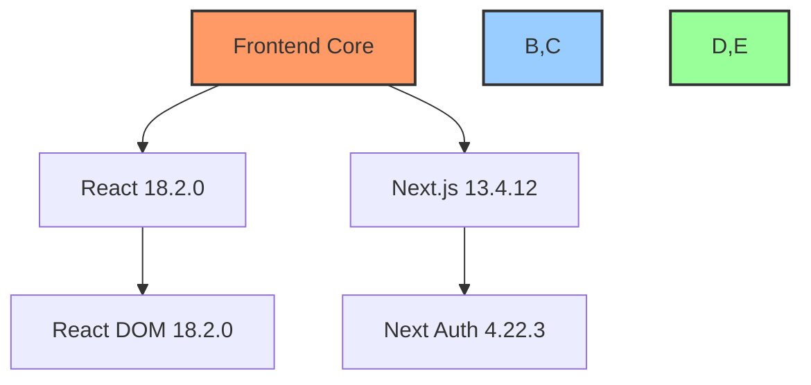
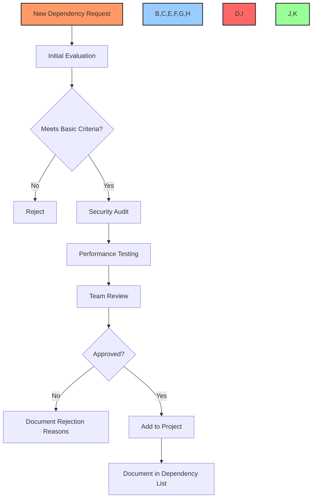
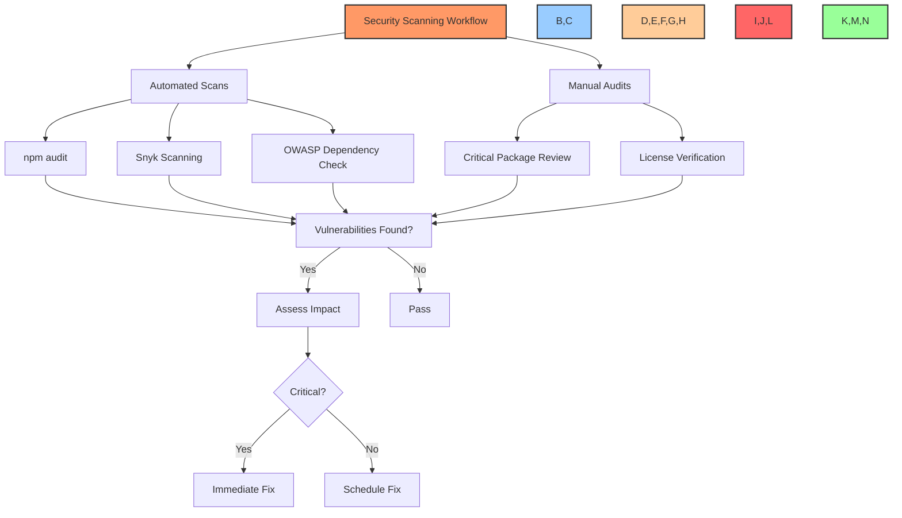
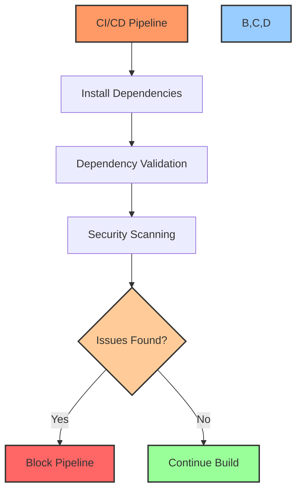

# 📦 Dependency Management

## 📋 Table of Contents
- [🔍 Overview](#overview)
- [🧩 Core Dependencies](#core-dependencies)
- [⚙️ Dependency Selection Criteria](#dependency-selection-criteria)
- [🔄 Version Management](#version-management)
- [🛡️ Security Practices](#security-practices)
- [🔧 Build Optimization](#build-optimization)
- [🧰 DevOps Integration](#devops-integration)
- [📊 Dependency Analytics](#dependency-analytics)
- [📝 Documentation Standards](#documentation-standards)
- [🔍 Troubleshooting](#troubleshooting)

## 🔍 Overview

This document outlines the dependency management strategy for the BAD DAO UI project. It provides guidelines for selecting, updating, and maintaining external dependencies to ensure application stability, security, and performance. The dependency management strategy is designed to minimize risks while enabling the development team to leverage quality open-source packages efficiently.

## 🧩 Core Dependencies

The BAD DAO UI relies on the following core dependencies:

### Frontend Framework



| Dependency | Version | Purpose | Selection Rationale |
|------------|---------|---------|---------------------|
| React | 18.2.0 | UI library | Industry standard, concurrent mode support |
| Next.js | 13.4.12 | React framework | SSR, routing, API routes, performance |
| TypeScript | 5.1.6 | Type safety | Enhanced developer experience, reduced runtime errors |
| ethers.js | 6.7.1 | Blockchain interactions | Robust library for Ethereum interactions |
| wagmi | 1.3.9 | React hooks for Ethereum | Simplified wallet connections and transactions |

### State Management

| Dependency | Version | Purpose | Selection Rationale |
|------------|---------|---------|---------------------|
| zustand | 4.3.9 | State management | Lightweight, hooks-based, minimal boilerplate |
| swr | 2.2.0 | Data fetching | Stale-while-revalidate caching, real-time updates |
| react-query | 3.39.3 | API state management | Cache management, background fetching |

### UI Components

| Dependency | Version | Purpose | Selection Rationale |
|------------|---------|---------|---------------------|
| tailwindcss | 3.3.3 | CSS framework | Utility-first approach, highly customizable |
| framer-motion | 10.13.0 | Animations | High-quality animations, React integration |
| shadcn/ui | N/A | Component library | Accessible, customizable, Tailwind-based |
| react-icons | 4.10.1 | Icon library | Comprehensive icon set |

### Development & Testing

| Dependency | Version | Purpose | Selection Rationale |
|------------|---------|---------|---------------------|
| jest | 29.6.1 | Testing framework | Industry standard, comprehensive testing |
| @testing-library/react | 14.0.0 | React testing | Component testing, user-centric tests |
| cypress | 12.17.2 | E2E testing | Reliable end-to-end testing |
| eslint | 8.45.0 | Linting | Code quality enforcement |
| prettier | 3.0.0 | Code formatting | Consistent code style |

## ⚙️ Dependency Selection Criteria

All dependencies added to the BAD DAO UI project must meet the following criteria:

### Required Criteria

1. **Active Maintenance**:
   - Regular updates within the last 3 months
   - Responsive to issues and pull requests
   - Clear roadmap or development plan

2. **Security**:
   - No known high or critical vulnerabilities
   - Regular security updates
   - Compatible with our security scanning tools

3. **Performance**:
   - Minimal bundle size impact
   - Efficient runtime performance
   - Support for tree-shaking

4. **License Compatibility**:
   - MIT, Apache 2.0, or BSD licenses preferred
   - License compatibility with our project
   - No restrictive licenses (GPL for frontend code)

5. **Community Support**:
   - Sufficient documentation
   - Active community or corporate backing
   - Established usage in production environments

### Evaluation Process



## 🔄 Version Management

### Versioning Strategy

The BAD DAO UI follows a conservative versioning strategy to balance stability with access to new features:

1. **Major Versions**: Upgrade only after thorough testing and when new features are required
2. **Minor Versions**: Upgrade regularly during development cycles
3. **Patch Versions**: Apply immediately for security fixes

### Version Pinning

```json
{
  "dependencies": {
    "react": "18.2.0",
    "next": "13.4.12",
    "ethers": "6.7.1"
  },
  "devDependencies": {
    "typescript": "5.1.6",
    "eslint": "8.45.0"
  }
}
```

We use exact version pinning (not using `^` or `~`) for core dependencies to ensure consistent builds and avoid unexpected changes.

### Update Frequency

| Dependency Type | Update Frequency | Approval Required |
|-----------------|------------------|-------------------|
| Core Framework | Quarterly | Tech Lead |
| UI Components | Monthly | UI Lead |
| Development Tools | Bi-weekly | Any Developer |
| Security Patches | Immediate | None (emergency process) |

### Deprecation Handling

1. **Monitoring**: Regularly check for deprecation notices
2. **Planning**: Create migration plan for deprecated dependencies
3. **Alternatives**: Research and test alternatives before deprecation deadlines
4. **Documentation**: Document migration strategies and lessons learned

## 🛡️ Security Practices

### Vulnerability Scanning



### Security Tools

The BAD DAO UI employs the following tools for dependency security:

1. **npm audit**: Runs on every build in CI/CD pipeline
2. **Snyk**: Weekly scans of dependencies
3. **Dependabot**: Automated security PRs for vulnerable packages
4. **Mend (WhiteSource)**: Deep license compliance checks

### Audit Process

1. **Regular Audits**: Monthly comprehensive security audit
2. **CI Integration**: Security checks run on every PR
3. **Peer Review**: Security findings reviewed by security team
4. **Remediation**: Clear process for addressing vulnerabilities

### Handling Vulnerabilities

| Severity | Response Time | Process |
|----------|--------------|---------|
| Critical | Immediate | Emergency patch, notify all developers |
| High | <24 hours | Schedule urgent update |
| Medium | <1 week | Include in next planned release |
| Low | <1 month | Document and address in normal cycle |

## 🔧 Build Optimization

### Bundle Size Management

The BAD DAO UI monitors and optimizes bundle size through:

1. **Import Optimization**:
   ```javascript
   // ❌ Bad - imports entire lodash
   import _ from 'lodash';
   
   // ✅ Good - imports only what's needed
   import debounce from 'lodash/debounce';
   ```

2. **Code Splitting**:
   ```javascript
   // Dynamic imports for route-based code splitting
   const DynamicComponent = dynamic(() => import('../components/Heavy'), {
     loading: () => <p>Loading...</p>,
   });
   ```

3. **Tree Shaking Verification**:
   - Select dependencies that support tree shaking
   - Configure webpack to optimize dead code elimination
   - Regularly audit bundles using tools like `webpack-bundle-analyzer`

### Performance Monitoring

Regular performance monitoring includes:

1. **Bundle Analysis**: Weekly analysis of bundle composition
2. **Dependency Impact**: Measuring performance impact of dependencies
3. **Lighthouse CI**: Tracking performance metrics over time

### Webpack Optimizations

```javascript
// webpack.config.js optimization example
module.exports = {
  // ...
  optimization: {
    minimize: true,
    splitChunks: {
      chunks: 'all',
      maxInitialRequests: Infinity,
      minSize: 0,
      cacheGroups: {
        vendor: {
          test: /[\\/]node_modules[\\/]/,
          name(module) {
            // Group packages by name for better caching
            const packageName = module.context.match(
              /[\\/]node_modules[\\/](.*?)([\\/]|$)/
            )[1];
            return `vendor.${packageName.replace('@', '')}`;
          },
        },
      },
    },
  },
};
```

## 🧰 DevOps Integration

### CI/CD Pipeline Integration



### Dependency Caching

Optimize build times with effective caching:

1. **CI Cache**:
   ```yaml
   # GitHub Actions example
   - name: Cache dependencies
     uses: actions/cache@v3
     with:
       path: |
         **/node_modules
         ~/.npm
       key: ${{ runner.os }}-modules-${{ hashFiles('**/package-lock.json') }}
       restore-keys: |
         ${{ runner.os }}-modules-
   ```

2. **Docker Layer Caching**:
   ```dockerfile
   # Dockerfile optimized for dependency caching
   FROM node:16-alpine AS deps
   WORKDIR /app
   COPY package.json package-lock.json ./
   RUN npm ci
   
   FROM node:16-alpine AS builder
   WORKDIR /app
   COPY --from=deps /app/node_modules ./node_modules
   COPY . .
   RUN npm run build
   ```

### Automated Updates

1. **Scheduled Updates**: Weekly automated PRs for non-breaking updates
2. **Update Grouping**: Group related dependency updates
3. **Test Integration**: Comprehensive testing of dependency updates

## 📊 Dependency Analytics

### Monitoring Metrics

The BAD DAO UI project monitors these dependency metrics:

1. **Health Score**: Calculated based on maintenance, security, and usage
2. **Dependency Age**: Time since last update
3. **Security Vulnerabilities**: Count by severity
4. **Bundle Impact**: Size contribution to final bundle
5. **Usage Coverage**: How much of the imported code is actually used

### Dependency Dashboard

A weekly generated dependency dashboard includes:

1. **Dependency Health Overview**:
   - Overall health score
   - Security status
   - Update recommendations

2. **Bundle Analysis**:
   - Size contribution
   - Import efficiency
   - Duplicate packages

3. **Maintenance Metrics**:
   - GitHub stars/activity
   - Issue response times
   - Release frequency

### Decision Support

Use analytics to support dependency decisions:

1. **Replacement Candidates**: Identify outdated or risky dependencies
2. **Consolidation Opportunities**: Find overlapping functionality
3. **Upgrade Priorities**: Prioritize updates based on impact

## 📝 Documentation Standards

### Required Documentation

All dependencies must be documented with:

1. **Purpose**: Why the dependency is used
2. **Usage Context**: Where and how it's implemented
3. **Version Constraints**: Any specific version requirements
4. **Alternatives Considered**: Other options evaluated

### Dependency Documentation Template

```markdown
## Dependency: [Name]

**Version:** [Current Version]
**Purpose:** [Brief description of why this dependency is used]
**Website:** [Official documentation link]
**GitHub:** [Repository link]

### Usage Context
- [Component/Feature where used]
- [Specific functionality it provides]

### Update Considerations
- [Version constraints]
- [Breaking changes to watch for]
- [Special update procedures]

### Alternatives Considered
- [Alternative 1]: [Reason not selected]
- [Alternative 2]: [Reason not selected]
```

### Changelog Management

For major dependency updates:

1. **Document Breaking Changes**: Note any API changes
2. **Migration Guide**: Step-by-step update process
3. **Rollback Plan**: Procedure to revert if issues arise

## 🔍 Troubleshooting

### Common Issues and Solutions

| Issue | Possible Causes | Resolution Steps |
|-------|-----------------|------------------|
| Dependency conflict | Version incompatibility between packages | Use resolution field in package.json, manually resolve in node_modules |
| Build failure after update | Breaking changes in dependency | Check changelog, revert to previous version, adapt code |
| Security vulnerability alerts | Vulnerable dependency version | Update to patched version, implement workaround, evaluate risk |
| Performance regression | Inefficient new code in dependency | Profile performance, implement lazy loading, evaluate alternatives |
| TypeScript errors | Type definition changes | Update types package, add custom type definitions, contact maintainers |

### Debug Process

When facing dependency issues:

1. **Isolate**: Determine if the issue is dependency-related
2. **Investigate**: Check recent changes and dependency versions
3. **Research**: Look for known issues in GitHub issues or documentation
4. **Test**: Create minimal reproduction case
5. **Resolve**: Update, downgrade, patch, or replace the dependency

### Support Resources

| Resource | Purpose | Link |
|----------|---------|------|
| GitHub Issues | Check for known problems | [GitHub](https://github.com) |
| npm Documentation | Official package info | [npm](https://www.npmjs.com) |
| Stack Overflow | Community solutions | [Stack Overflow](https://stackoverflow.com) |
| Discord Community | Real-time help | [BAD DAO Discord](https://discord.gg/baddao) |

---

Made with Power, Love, and AI •  ⚡️❤️🤖 •  POWERBRIDGE.AI 