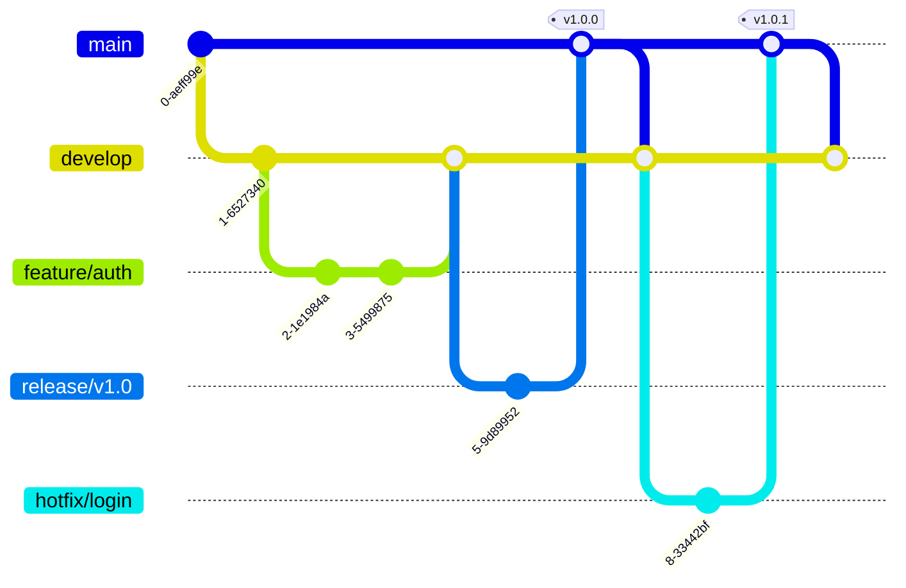

# 🔄 Git Workflow & Contribution Guidelines

## 📋 Table of Contents
- [🔍 Overview](#overview)
- [🎯 Purpose](#purpose)
- [🌳 Branch Structure](#branch-structure)
- [🧑‍💻 Development Workflow](#development-workflow)
- [📝 Commit Guidelines](#commit-guidelines)
- [🔄 Pull Request Process](#pull-request-process)
- [⚙️ CI/CD Integration](#cicd-integration)
- [📊 Release Management](#release-management)
- [🐛 Hotfix Process](#hotfix-process)
- [📚 Additional Resources](#additional-resources)

## 🔍 Overview

This document outlines the Git workflow and contribution guidelines for the BAD DAO UI project. It defines branching strategies, commit conventions, pull request processes, and release management procedures to ensure consistent and high-quality code contributions.

## 🎯 Purpose

The Git workflow documentation aims to:
- Establish a consistent branching strategy
- Define commit message conventions
- Document the pull request and code review process
- Outline release procedures and versioning
- Provide guidance for common Git operations
- Ensure code quality and project stability

## 🌳 Branch Structure

### Main Branches



| Branch | Purpose | Created From | Merged To | Naming Convention |
|--------|---------|--------------|-----------|-------------------|
| `main` | Production code | - | - | - |
| `develop` | Integration branch | `main` | `main` | - |
| `feature/*` | New features | `develop` | `develop` | `feature/feature-name` |
| `bugfix/*` | Non-critical fixes | `develop` | `develop` | `bugfix/issue-description` |
| `release/*` | Release preparation | `develop` | `main` & `develop` | `release/vX.Y.Z` |
| `hotfix/*` | Critical fixes | `main` | `main` & `develop` | `hotfix/issue-description` |

### Branch Protection Rules

1. **`main` branch**:
   - Requires pull request review before merging
   - Requires status checks to pass
   - Prohibits force pushes
   - Restricts deletions

2. **`develop` branch**:
   - Requires pull request review before merging
   - Requires status checks to pass
   - Allows force pushes by administrators
   - Restricts deletions

3. **`release/*` branches**:
   - Requires pull request review before merging
   - Requires status checks to pass

## 🧑‍💻 Development Workflow

### Standard Feature Development Flow


### Steps for Feature Development

1. **Setup**:
   ```bash
   # Ensure you're on develop branch
   git checkout develop
   
   # Pull latest changes
   git pull origin develop
   
   # Create feature branch
   git checkout -b feature/feature-name
   ```

2. **Development**:
   ```bash
   # Make changes and commit
   git add .
   git commit -m "feat: description of changes"
   
   # Push to remote
   git push -u origin feature/feature-name
   ```

3. **Stay Updated**:
   ```bash
   # Fetch latest changes from develop
   git fetch origin develop
   
   # Rebase your feature branch
   git rebase origin/develop
   
   # If conflicts, resolve them and continue
   git add .
   git rebase --continue
   
   # Force push if you've already pushed your branch
   git push -f origin feature/feature-name
   ```

4. **Complete Feature**:
   - Create a pull request from `feature/feature-name` to `develop`
   - Address review comments
   - Ensure CI checks pass
   - Get approval and merge

### Handling Merge Conflicts

```bash
# When merge conflicts occur during rebase
git rebase origin/develop

# If conflicts appear:
# 1. Resolve conflicts in your editor
# 2. Add resolved files
git add <resolved-files>

# 3. Continue rebase
git rebase --continue

# 4. Force push if necessary
git push -f origin feature/feature-name
```

## 📝 Commit Guidelines

### Conventional Commits Format

The BAD DAO UI project follows the [Conventional Commits](https://www.conventionalcommits.org/) specification for commit messages:

```
<type>[optional scope]: <description>

[optional body]

[optional footer(s)]
```

#### Types

| Type | Description |
|------|-------------|
| `feat` | A new feature |
| `fix` | A bug fix |
| `docs` | Documentation changes |
| `style` | Code style changes (formatting, etc.) |
| `refactor` | Code changes that neither fix bugs nor add features |
| `perf` | Performance improvements |
| `test` | Adding or correcting tests |
| `chore` | Changes to build process or auxiliary tools |
| `ci` | Changes to CI configuration |

#### Scopes

Scopes specify the area of the codebase affected:

- `auth` - Authentication components
- `gov` - Governance features
- `ui` - UI components
- `api` - API integration
- `contracts` - Smart contract integration
- `deps` - Dependencies
- `config` - Configuration

#### Examples

```
feat(auth): add wallet connection dialog

fix(gov): resolve proposal creation error when token balance is low

docs(api): update API documentation with new endpoints

refactor(ui): reorganize component structure for better maintainability

test(contracts): add tests for voting mechanism
```

### Commit Best Practices

1. **Atomic commits**:
   - Each commit should represent a single logical change
   - Don't mix unrelated changes in a single commit

2. **Complete description**:
   - Use imperative mood in the description ("add" not "added")
   - Keep first line under 72 characters
   - Provide more detail in the body if needed

3. **References**:
   - Reference issues with `#issue-number` in commit message
   - Use footers for breaking changes or issue closing:
     ```
     feat(api): change response format for proposals

     BREAKING CHANGE: Proposal API now returns a different structure

     Closes #123
     ```

4. **Tools**:
   - Use `commitizen` for standardized commits
   - Set up a commit message template to ensure consistency

## 🔄 Pull Request Process

### Pull Request Template

```markdown
## Description
[Describe the changes in this pull request]

## Related Issues
[Reference any related issues with #issue-number]

## Type of Change
- [ ] Bug fix
- [ ] New feature
- [ ] Breaking change
- [ ] Documentation update
- [ ] Code refactoring
- [ ] Performance improvement
- [ ] Tests
- [ ] Build/CI

## How Has This Been Tested?
[Describe the tests you ran]

## Screenshots (if appropriate)

## Checklist
- [ ] My code follows the project's style guidelines
- [ ] I have performed a self-review of my own code
- [ ] I have commented my code, particularly in hard-to-understand areas
- [ ] I have made corresponding changes to the documentation
- [ ] My changes generate no new warnings
- [ ] I have added tests that prove my fix is effective or that my feature works
- [ ] New and existing unit tests pass locally with my changes
```

### Pull Request Flow


### Code Review Guidelines

#### For Authors

1. **Keep PRs focused**:
   - Limit to 500 lines of changes when possible
   - Split large features into smaller PRs
   - Use draft PRs for work in progress

2. **Self-review**:
   - Review your own changes before requesting review
   - Use GitHub's "Files changed" view to catch issues
   - Run linters and tests locally before pushing

3. **Responsiveness**:
   - Address review comments promptly
   - Use suggestions where appropriate
   - Explain any disagreements respectfully

#### For Reviewers

1. **Review scope**:
   - Code correctness and functionality
   - Adherence to project standards
   - Security implications
   - Performance considerations
   - Test coverage

2. **Constructive feedback**:
   - Be specific about issues
   - Suggest solutions when possible
   - Use GitHub suggestions for small changes
   - Distinguish between required changes and preferences

3. **Approval criteria**:
   - All required changes addressed
   - Tests pass
   - Code meets quality standards
   - Documentation is updated

### Merging Strategy

The project uses **Squash and Merge** as the primary merge strategy:

- **Squash and Merge**: Combines all PR commits into a single commit on the target branch
  - Keeps history clean and linear
  - Commit message becomes the PR title and description
  - Feature branch history is preserved in the PR

In special cases (e.g., large features with well-structured commits), **Rebase and Merge** can be used:

- **Rebase and Merge**: Applies individual commits to the target branch
  - Preserves detailed commit history
  - Should only be used when commit history provides valuable context

## ⚙️ CI/CD Integration

### CI Workflow


### GitHub Actions Workflow

The project uses GitHub Actions for CI/CD with the following workflows:

1. **Pull Request Checks**:
   - Triggered on PR creation/update
   - Runs linting, tests, and builds
   - Generates deploy previews
   - Performs security scans

2. **Continuous Integration**:
   - Triggered on pushes to `develop` and feature branches
   - Runs comprehensive test suite
   - Performs code quality checks
   - Updates status badges

3. **Continuous Deployment**:
   - Triggered on merges to `develop` and `main`
   - Builds and deploys to staging/production
   - Runs post-deployment verification
   - Generates deployment reports

### Example GitHub Actions Workflow

```yaml
name: Pull Request Checks

on:
  pull_request:
    branches: [ develop, main ]

jobs:
  build-and-test:
    runs-on: ubuntu-latest
    steps:
      - uses: actions/checkout@v3
      
      - name: Setup Node.js
        uses: actions/setup-node@v3
        with:
          node-version: '16'
          cache: 'npm'
          
      - name: Install dependencies
        run: npm ci
        
      - name: Lint code
        run: npm run lint
        
      - name: Build project
        run: npm run build
        
      - name: Run tests
        run: npm test
        
      - name: Check coverage
        run: npm run test:coverage
        
  security-scan:
    runs-on: ubuntu-latest
    steps:
      - uses: actions/checkout@v3
      
      - name: Run security scanning
        uses: snyk/actions/node@master
        with:
          args: --severity-threshold=high
        env:
          SNYK_TOKEN: ${{ secrets.SNYK_TOKEN }}
          
  deploy-preview:
    runs-on: ubuntu-latest
    needs: [build-and-test, security-scan]
    steps:
      - uses: actions/checkout@v3
      
      - name: Setup Node.js
        uses: actions/setup-node@v3
        with:
          node-version: '16'
          
      - name: Install dependencies
        run: npm ci
        
      - name: Build project
        run: npm run build
        
      - name: Deploy preview
        uses: FirebaseExtended/action-hosting-deploy@v0
        with:
          repoToken: '${{ secrets.GITHUB_TOKEN }}'
          firebaseServiceAccount: '${{ secrets.FIREBASE_SERVICE_ACCOUNT }}'
          projectId: your-project-id
          channelId: pr-${{ github.event.number }}
```

## 📊 Release Management

### Versioning Scheme

The project follows [Semantic Versioning](https://semver.org/) (SemVer):

```
MAJOR.MINOR.PATCH
```

- **MAJOR**: Incompatible API changes
- **MINOR**: New functionality (backwards-compatible)
- **PATCH**: Bug fixes (backwards-compatible)

Additional labels for pre-release versions:
- `-alpha.1`: Alpha release (internal testing)
- `-beta.1`: Beta release (external testing)
- `-rc.1`: Release candidate

### Release Process


### Release Checklist

1. **Preparation**:
   - Review and prioritize issues/features for the release
   - Ensure develop branch is stable
   - Update dependencies if needed

2. **Release Branch Creation**:
   ```bash
   # Create release branch from develop
   git checkout develop
   git pull origin develop
   git checkout -b release/vX.Y.Z
   
   # Update version numbers in package.json, etc.
   # Commit version changes
   git add .
   git commit -m "chore(release): bump version to vX.Y.Z"
   
   # Push release branch
   git push origin release/vX.Y.Z
   ```

3. **Stabilization**:
   - Only bug fixes should be committed to the release branch
   - Run comprehensive testing
   - Create release notes draft

4. **Finalization**:
   ```bash
   # Create PR from release branch to main
   # After approval and merge to main, tag the release
   git checkout main
   git pull origin main
   git tag -a vX.Y.Z -m "Release vX.Y.Z"
   git push origin vX.Y.Z
   
   # Merge back to develop
   git checkout develop
   git pull origin develop
   git merge --no-ff main
   git push origin develop
   ```

5. **Publication**:
   - Publish release notes
   - Deploy to production
   - Announce release to stakeholders

### Changelog Management

The project maintains a `CHANGELOG.md` file following the [Keep a Changelog](https://keepachangelog.com/) format:

```markdown
# Changelog

All notable changes to this project will be documented in this file.

## [Unreleased]

## [1.1.0] - 2023-04-15
### Added
- New proposal creation wizard
- Mobile-responsive governance dashboard

### Changed
- Improved voting experience with real-time updates
- Updated dependencies to latest versions

### Fixed
- Issue with wallet disconnection
- Treasury display bugs on small screens

## [1.0.0] - 2023-03-01
### Added
- Initial release
```

## 🐛 Hotfix Process

### Emergency Fix Workflow


### Hotfix Steps

1. **Branch Creation**:
   ```bash
   # Create hotfix branch from main
   git checkout main
   git pull origin main
   git checkout -b hotfix/issue-description
   ```

2. **Fix Implementation**:
   ```bash
   # Implement fix
   git add .
   git commit -m "fix: description of the hotfix"
   
   # Push branch
   git push origin hotfix/issue-description
   ```

3. **Verification**:
   - Ensure comprehensive testing of the fix
   - Verify no regressions
   - Get expedited code review

4. **Deployment**:
   ```bash
   # Create PR to main
   # After approval and merge, tag with new version
   git checkout main
   git pull origin main
   git tag -a vX.Y.Z -m "Hotfix: description"
   git push origin vX.Y.Z
   
   # Merge to develop
   git checkout develop
   git pull origin develop
   git merge --no-ff main
   git push origin develop
   ```

### Post-Hotfix Analysis

After deploying a hotfix:
1. Document the issue, its impact, and resolution
2. Conduct root cause analysis
3. Implement measures to prevent similar issues
4. Update monitoring if applicable
5. Communicate with stakeholders

## 📚 Additional Resources

### Git Configuration

Recommended Git configuration for the project:

```bash
# Set your identity
git config --global user.name "Your Name"
git config --global user.email "your.email@example.com"

# Set default branch to main
git config --global init.defaultBranch main

# Set rebase as default pull strategy
git config --global pull.rebase true

# Set up Git aliases for common operations
git config --global alias.co checkout
git config --global alias.br branch
git config --global alias.ci commit
git config --global alias.st status
git config --global alias.unstage 'reset HEAD --'
git config --global alias.last 'log -1 HEAD'
git config --global alias.visual '!gitk'
```

### Useful Git Commands

#### Branch Management

```bash
# List all branches (local and remote)
git branch -a

# Create and switch to new branch
git checkout -b branch-name

# Delete local branch
git branch -d branch-name

# Delete remote branch
git push origin --delete branch-name

# Rename current branch
git branch -m new-name
```

#### Syncing & History

```bash
# Fetch remote changes without merging
git fetch origin

# Rebase current branch on another
git rebase branch-name

# Interactive rebase for cleaning history
git rebase -i HEAD~5

# Stash changes temporarily
git stash
git stash pop

# View commit history
git log --graph --oneline --decorate
```

#### Working with Remote

```bash
# Add remote repository
git remote add origin url

# Change remote URL
git remote set-url origin new-url

# List remote repositories
git remote -v

# Fetch specific branch
git fetch origin branch-name

# Push force with lease (safer than force push)
git push --force-with-lease origin branch-name
```

### Git Hooks

The project uses Git hooks to enforce standards:

1. **pre-commit**: Runs linting and formatting
2. **commit-msg**: Validates commit message format
3. **pre-push**: Runs tests before pushing

Example commit-msg hook:
```bash
#!/bin/sh

COMMIT_MSG_FILE=$1
COMMIT_MSG=$(cat $COMMIT_MSG_FILE)

# Regex for conventional commits
PATTERN="^(feat|fix|docs|style|refactor|perf|test|chore|ci|build|revert)(\([a-z-]+\))?!?: .+$"

if ! [[ $COMMIT_MSG =~ $PATTERN ]]; then
  echo "Error: Commit message does not follow conventional commits format."
  echo "Example: feat(ui): add new button component"
  exit 1
fi
```

### Recommended Git Tools

- **GitHub Desktop**: Visual Git client
- **GitLens**: VS Code extension for Git
- **Husky**: Git hooks automation
- **Commitizen**: Interactive commit message creation
- **Git Kraken**: Git GUI client

---

Made with Power, Love, and AI •  ⚡️❤️🤖 •  POWERBRIDGE.AI 