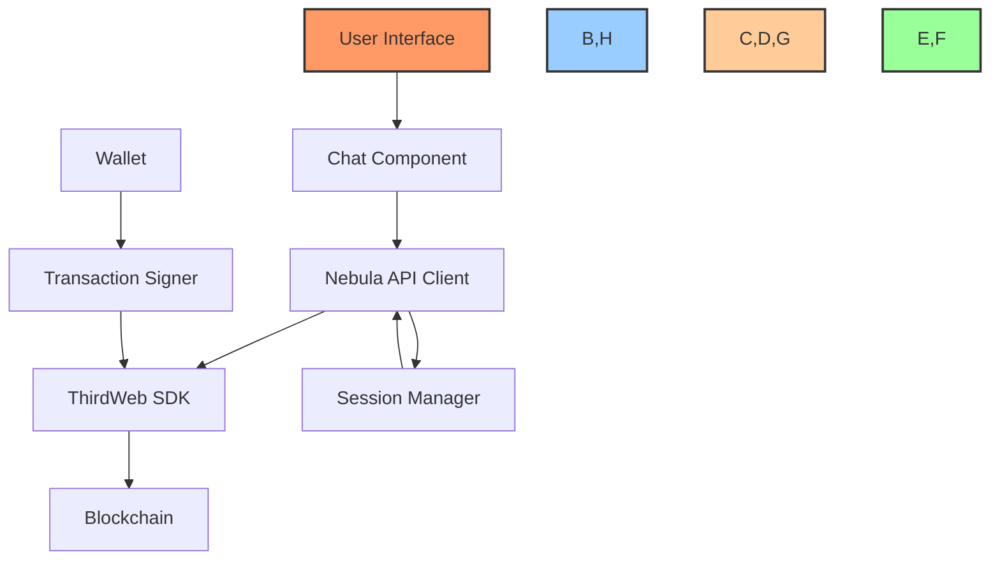

# 🤖 ThirdWeb Nebula AI Integration Guide

## 📋 Table of Contents
- [🔍 Overview](#overview)
- [🚀 Getting Started](#getting-started)
- [⚙️ Core Components](#core-components)
- [🔄 Integration Architecture](#integration-architecture)
- [💬 Prompt-Based Smart Contract Management](#prompt-based-smart-contract-management)
- [🧪 Implementation](#implementation)
- [🛡️ Security Considerations](#security-considerations)
- [📱 UI Integration](#ui-integration)
- [🔍 Troubleshooting](#troubleshooting)

## 🔍 Overview

This guide outlines how to integrate ThirdWeb SDK and Nebula AI into the BAD DAO UI to enable users to modify smart contracts through AI-powered natural language prompts. This integration will allow our application to leverage ThirdWeb's powerful blockchain tools while providing an intuitive interface for users to manage smart contracts without needing to write code.

Nebula is ThirdWeb's blockchain-specific AI model trained on EVM networks and over 1 million smart contracts. It provides advanced reasoning capabilities specifically for blockchain operations and can execute smart contract functions directly through natural language instructions.

## 🚀 Getting Started

### Prerequisites

1. **ThirdWeb Account**:
   - Create an account on [ThirdWeb](https://thirdweb.com/)
   - Generate API keys from the dashboard

2. **Access to Nebula**:
   - Join the waitlist for Nebula at [https://thirdweb.com/nebula](https://thirdweb.com/nebula)
   - Obtain a Secret Key from ThirdWeb dashboard

3. **Development Environment**:
   - Node.js v16 or higher
   - React framework (Next.js recommended)
   - Wallet connection setup

### Installation

```bash
# Install ThirdWeb SDK
npm install thirdweb

# Create environment file and add your keys
echo "NEXT_PUBLIC_TW_CLIENT_ID=your_client_id" > .env.local
echo "THIRDWEB_SECRET_KEY=your_secret_key" >> .env.local
```

## ⚙️ Core Components

The integration consists of these core components:

1. **ThirdWeb SDK**: Provides the fundamental blockchain connectivity and functions
2. **Nebula AI API**: Powers the natural language understanding and smart contract interactions
3. **Wallet Connectivity**: Enables transaction signing and user authorization
4. **Chat Interface**: Allows users to input prompts and receive responses
5. **Session Management**: Maintains context for ongoing interactions

## 🔄 Integration Architecture



## 💬 Prompt-Based Smart Contract Management

Nebula AI supports the following smart contract operations through prompts:

| Operation | Description | Example Prompts |
|-----------|-------------|----------------|
| **Analysis** | Understand smart contract details | "What functions does this contract have?" |
| **Deployment** | Deploy new contracts | "Deploy an ERC20 token called 'BAD Token' with symbol 'BAD'" |
| **Modification** | Suggest changes to contract code | "Add a function to pause transactions in this contract" |
| **Execution** | Call contract functions | "Execute setMaxSupply function with parameter 10000" |
| **Debugging** | Analyze errors and suggest fixes | "Why is this transaction failing?" |

### Prompt Engineering Guidelines

For optimal results when modifying smart contracts, structure prompts with:

1. **Clear Intent**: Explicitly state the action you want to perform
2. **Contract Context**: Include contract address or name 
3. **Specific Parameters**: Provide all necessary parameters for functions
4. **Function Signatures**: Include function names when possible
5. **Desired Outcome**: Describe what you expect to happen

## 🧪 Implementation

### 1. Set up Nebula API Client

Create a utility file `src/utils/nebula.js` for interacting with Nebula:

```javascript
const API_BASE_URL = "https://nebula-api.thirdweb.com";
const SECRET_KEY = process.env.THIRDWEB_SECRET_KEY;

// Utility function for API requests
export async function makeNebulaRequest(endpoint, method, body = {}) {
  const response = await fetch(`${API_BASE_URL}${endpoint}`, {
    method,
    headers: {
      "Content-Type": "application/json",
      "x-secret-key": SECRET_KEY,
    },
    body: Object.keys(body).length ? JSON.stringify(body) : undefined,
  });

  if (!response.ok) {
    const errorText = await response.text();
    console.error("Nebula API Error:", errorText);
    throw new Error(`API Error: ${response.statusText}`);
  }

  return response.json();
}

// Create a new session
export async function createSession(title = "BAD DAO Smart Contract Manager") {
  const response = await makeNebulaRequest("/session", "POST", { title });
  return response.result.id;
}

// Send message to Nebula
export async function sendMessage(message, sessionId, chainId, contractAddress) {
  const requestBody = {
    message,
    session_id: sessionId,
    context_filter: {
      chain_ids: [chainId.toString()],
      contract_addresses: contractAddress ? [contractAddress] : [],
    },
  };
  
  const response = await makeNebulaRequest("/chat", "POST", requestBody);
  return response;
}

// Execute smart contract operation
export async function executeOperation(
  message,
  signerWalletAddress,
  sessionId,
  chainId,
  contractAddress
) {
  const requestBody = {
    message,
    session_id: sessionId,
    execute_config: {
      mode: "client", // Using client mode for wallet-signed transactions
      signer_wallet_address: signerWalletAddress,
    },
    context_filter: {
      chain_ids: [chainId.toString()],
      contract_addresses: contractAddress ? [contractAddress] : [],
    },
  };

  const response = await makeNebulaRequest("/execute", "POST", requestBody);
  return response;
}
```

### 2. Create a Smart Contract Chat Component

```jsx
// src/components/SmartContractChat.jsx
import { useState, useEffect } from "react";
import { useActiveAccount } from "thirdweb/react";
import { sendAndConfirmTransaction, prepareTransaction, defineChain } from "thirdweb";
import { createSession, sendMessage, executeOperation } from "../utils/nebula";
import { client } from "../client"; // Import your ThirdWeb client

export function SmartContractChat({ contractAddress, chainId }) {
  const [sessionId, setSessionId] = useState(null);
  const [messages, setMessages] = useState([]);
  const [input, setInput] = useState("");
  const [isProcessing, setIsProcessing] = useState(false);
  
  // Get connected wallet
  const account = useActiveAccount();
  const walletAddress = account?.address;

  // Initialize session
  useEffect(() => {
    async function initSession() {
      try {
        const id = await createSession("BAD DAO Contract Manager");
        setSessionId(id);
        
        // Initial greeting
        setMessages([
          { role: "system", content: "Smart Contract AI Assistant is ready. What would you like to do with your smart contract?" }
        ]);
      } catch (error) {
        console.error("Failed to initialize Nebula session:", error);
        setMessages([
          { role: "system", content: "Failed to connect to AI Assistant. Please try again later." }
        ]);
      }
    }
    
    initSession();
  }, []);

  // Handle sending message
  const handleSendMessage = async () => {
    if (!input.trim() || !sessionId) return;

    const userMessage = input.trim();
    setMessages(prev => [...prev, { role: "user", content: userMessage }]);
    setInput("");
    setIsProcessing(true);

    try {
      // Check if this is an execution command
      if (userMessage.toLowerCase().includes("execute") || 
          userMessage.toLowerCase().includes("deploy") || 
          userMessage.toLowerCase().includes("transfer")) {
        await handleExecuteCommand(userMessage);
      } else {
        // Regular informational query
        const response = await sendMessage(userMessage, sessionId, chainId, contractAddress);
        setMessages(prev => [...prev, { role: "system", content: response.message }]);
      }
    } catch (error) {
      console.error("Error processing message:", error);
      setMessages(prev => [...prev, { 
        role: "system", 
        content: "Sorry, I encountered an error processing your request. Please try again." 
      }]);
    } finally {
      setIsProcessing(false);
    }
  };

  // Handle execution commands
  const handleExecuteCommand = async (message) => {
    if (!account?.address) {
      setMessages(prev => [...prev, { 
        role: "system", 
        content: "Please connect your wallet to execute commands." 
      }]);
      setIsProcessing(false);
      return;
    }

    try {
      // Ask for Nebula to prepare the transaction
      const executeResponse = await executeOperation(
        message,
        account.address,
        sessionId,
        chainId,
        contractAddress
      );

      // Add the AI response to chat
      if (executeResponse.message) {
        setMessages(prev => [...prev, { 
          role: "system", 
          content: executeResponse.message 
        }]);
      }

      // Check if there's a transaction to sign
      const action = executeResponse.actions?.find(a => a.type === "sign_transaction");
      
      if (action) {
        // Prepare transaction data
        const transactionData = JSON.parse(action.data);
        
        setMessages(prev => [...prev, { 
          role: "system", 
          content: "I've prepared a transaction for you to sign. Please review and confirm in your wallet." 
        }]);

        // Prepare and send transaction
        const preparedTransaction = prepareTransaction({
          to: transactionData.to,
          value: transactionData.value || 0,
          data: transactionData.data,
          chain: defineChain(parseInt(chainId)),
          client,
        });

        // Send transaction and wait for confirmation
        const receipt = await sendAndConfirmTransaction({
          transaction: preparedTransaction,
          account,
        });

        // Add transaction result to chat
        setMessages(prev => [...prev, { 
          role: "system", 
          content: `Transaction completed successfully! Transaction hash: ${receipt.transactionHash}` 
        }]);
      }
    } catch (error) {
      console.error("Transaction error:", error);
      setMessages(prev => [...prev, { 
        role: "system", 
        content: `Transaction failed: ${error.message || "Unknown error"}` 
      }]);
    }
  };

  return (
    <div className="flex flex-col h-[600px] rounded-lg border border-gray-200 bg-white">
      <div className="flex-1 overflow-y-auto p-4 space-y-4">
        {messages.map((msg, index) => (
          <div key={index} className={`flex ${msg.role === 'user' ? 'justify-end' : 'justify-start'}`}>
            <div className={`max-w-[75%] rounded-lg p-3 ${
              msg.role === 'user' 
                ? 'bg-blue-500 text-white' 
                : 'bg-gray-100 text-gray-800'
            }`}>
              {msg.content}
            </div>
          </div>
        ))}
        {isProcessing && (
          <div className="flex justify-start">
            <div className="bg-gray-100 text-gray-800 rounded-lg p-3 max-w-[75%]">
              <div className="flex space-x-2">
                <div className="w-2 h-2 rounded-full bg-gray-500 animate-bounce" style={{ animationDelay: '0ms' }}></div>
                <div className="w-2 h-2 rounded-full bg-gray-500 animate-bounce" style={{ animationDelay: '300ms' }}></div>
                <div className="w-2 h-2 rounded-full bg-gray-500 animate-bounce" style={{ animationDelay: '600ms' }}></div>
              </div>
            </div>
          </div>
        )}
      </div>
      <div className="p-4 border-t border-gray-200">
        <div className="flex space-x-2">
          <input
            type="text"
            value={input}
            onChange={e => setInput(e.target.value)}
            onKeyPress={e => e.key === 'Enter' && handleSendMessage()}
            placeholder="Ask about the contract or request changes..."
            className="flex-1 px-4 py-2 border border-gray-300 rounded-lg focus:outline-none focus:ring-2 focus:ring-blue-500"
          />
          <button
            onClick={handleSendMessage}
            disabled={isProcessing || !input.trim()}
            className="px-4 py-2 bg-blue-500 text-white rounded-lg disabled:opacity-50"
          >
            Send
          </button>
        </div>
      </div>
    </div>
  );
}
```

### 3. Set up ThirdWeb Client

Create a client setup file `src/client.js`:

```javascript
import { createThirdwebClient } from "thirdweb";

export const client = createThirdwebClient({
  clientId: process.env.NEXT_PUBLIC_TW_CLIENT_ID,
});
```

### 4. Add ThirdWeb Provider to Your App

```jsx
// pages/_app.jsx
import { ThirdwebProvider } from "thirdweb/react";
import { client } from "../client";

function MyApp({ Component, pageProps }) {
  return (
    <ThirdwebProvider client={client}>
      <Component {...pageProps} />
    </ThirdwebProvider>
  );
}

export default MyApp;
```

## 📱 UI Integration

This integration can be incorporated into the BAD DAO UI in several ways:

### Option 1: Smart Contract Management Section

```jsx
// pages/contract-manager.jsx
import { useState } from "react";
import { ConnectButton } from "thirdweb/react";
import { SmartContractChat } from "../components/SmartContractChat";
import { client } from "../client";

export default function ContractManagerPage() {
  const [contractAddress, setContractAddress] = useState("");
  const [chainId, setChainId] = useState("1"); // Default to Ethereum Mainnet
  const [isConnected, setIsConnected] = useState(false);
  
  const handleSubmit = (e) => {
    e.preventDefault();
    setIsConnected(true);
  };
  
  return (
    <div className="container mx-auto px-4 py-8">
      <div className="flex justify-between items-center mb-8">
        <h1 className="text-3xl font-bold">Smart Contract Manager</h1>
        <ConnectButton client={client} />
      </div>
      
      {!isConnected ? (
        <div className="max-w-md mx-auto">
          <form onSubmit={handleSubmit} className="space-y-4">
            <div>
              <label className="block text-sm font-medium text-gray-700 mb-1">
                Contract Address
              </label>
              <input
                type="text"
                value={contractAddress}
                onChange={(e) => setContractAddress(e.target.value)}
                className="w-full px-4 py-2 border border-gray-300 rounded-md"
                placeholder="0x..."
                required
              />
            </div>
            
            <div>
              <label className="block text-sm font-medium text-gray-700 mb-1">
                Chain
              </label>
              <select
                value={chainId}
                onChange={(e) => setChainId(e.target.value)}
                className="w-full px-4 py-2 border border-gray-300 rounded-md"
              >
                <option value="1">Ethereum Mainnet</option>
                <option value="137">Polygon</option>
                <option value="56">Binance Smart Chain</option>
                <option value="11155111">Ethereum Sepolia</option>
              </select>
            </div>
            
            <button
              type="submit"
              className="w-full py-2 px-4 bg-blue-600 text-white rounded-md hover:bg-blue-700"
            >
              Connect to Contract
            </button>
          </form>
        </div>
      ) : (
        <div className="max-w-4xl mx-auto">
          <div className="bg-gray-100 p-4 rounded-lg mb-4">
            <p className="font-medium">Contract: {contractAddress}</p>
            <p className="text-sm text-gray-600">Chain ID: {chainId}</p>
          </div>
          
          <SmartContractChat contractAddress={contractAddress} chainId={chainId} />
        </div>
      )}
    </div>
  );
}
```

### Option 2: Modal Integration

You can also create a modal component that can be triggered from anywhere in your app:

```jsx
// components/SmartContractModal.jsx
import { Dialog, Transition } from '@headlessui/react';
import { Fragment, useState } from 'react';
import { SmartContractChat } from './SmartContractChat';

export function SmartContractModal({ isOpen, setIsOpen, contractAddress, chainId }) {
  return (
    <Transition appear show={isOpen} as={Fragment}>
      <Dialog
        as="div"
        className="fixed inset-0 z-50 overflow-y-auto"
        onClose={() => setIsOpen(false)}
      >
        <div className="min-h-screen px-4 text-center">
          <Transition.Child
            as={Fragment}
            enter="ease-out duration-300"
            enterFrom="opacity-0"
            enterTo="opacity-100"
            leave="ease-in duration-200"
            leaveFrom="opacity-100"
            leaveTo="opacity-0"
          >
            <Dialog.Overlay className="fixed inset-0 bg-black opacity-30" />
          </Transition.Child>

          <span
            className="inline-block h-screen align-middle"
            aria-hidden="true"
          >
            &#8203;
          </span>
          
          <Transition.Child
            as={Fragment}
            enter="ease-out duration-300"
            enterFrom="opacity-0 scale-95"
            enterTo="opacity-100 scale-100"
            leave="ease-in duration-200"
            leaveFrom="opacity-100 scale-100"
            leaveTo="opacity-0 scale-95"
          >
            <div className="inline-block w-full max-w-4xl p-6 my-8 overflow-hidden text-left align-middle transition-all transform bg-white shadow-xl rounded-2xl">
              <Dialog.Title
                as="h3"
                className="text-lg font-medium leading-6 text-gray-900"
              >
                Smart Contract Assistant
              </Dialog.Title>
              
              <div className="mt-4 h-[500px]">
                <SmartContractChat
                  contractAddress={contractAddress}
                  chainId={chainId}
                />
              </div>
              
              <div className="mt-4">
                <button
                  type="button"
                  className="px-4 py-2 text-sm font-medium text-gray-700 bg-gray-100 border border-gray-300 rounded-md hover:bg-gray-200"
                  onClick={() => setIsOpen(false)}
                >
                  Close
                </button>
              </div>
            </div>
          </Transition.Child>
        </div>
      </Dialog>
    </Transition>
  );
}
```

## 🛡️ Security Considerations

When implementing Nebula AI for smart contract management, consider these security best practices:

1. **User Confirmation**: Always require explicit user confirmation before executing transactions
2. **Transaction Preview**: Show users what will happen before they sign transactions
3. **Wallet Permissions**: Use limited session keys where possible for recurring operations
4. **API Key Protection**: Store ThirdWeb Secret Keys securely, never in client-side code
5. **Input Validation**: Validate all user inputs before processing with Nebula
6. **Rate Limiting**: Implement rate limiting to prevent abuse of the AI system
7. **Access Control**: Restrict contract modification abilities to authorized users only
8. **Testing**: Test all AI-generated contract modifications thoroughly before deployment

## 🔍 Troubleshooting

### Common Issues and Solutions

| Issue | Possible Cause | Solution |
|-------|---------------|----------|
| API Authentication Errors | Invalid or expired secret key | Regenerate your ThirdWeb secret key and update environment variables |
| Failed Transactions | Incorrect gas settings or contract restrictions | Use the debug message from Nebula to identify and fix the issue |
| Unexpected Responses | Ambiguous or complex prompts | Refine your prompt to be more specific and structured |
| Session Expiration | Inactivity or session timeout | Implement auto-reconnection logic to create a new session |
| Execution Permissions | User lacks permission for operation | Check contract permissions and wallet connection status |

### Debugging Tips

1. Enable verbose logging for Nebula API calls
2. Use the ThirdWeb Dashboard to monitor API usage and errors
3. Test prompts in the Nebula playground before implementing in your app
4. Implement detailed error tracking for transaction failures
5. Use mock sessions during development to avoid API rate limits

---

This integration provides a powerful AI-powered interface for managing smart contracts without requiring users to write code. By combining ThirdWeb's SDK with Nebula's blockchain-specific AI capabilities, BAD DAO UI can offer a seamless experience for users to interact with and modify smart contracts through natural language.

Made with Power, Love, and AI •  ⚡️❤️🤖 •  POWERBRIDGE.AI 