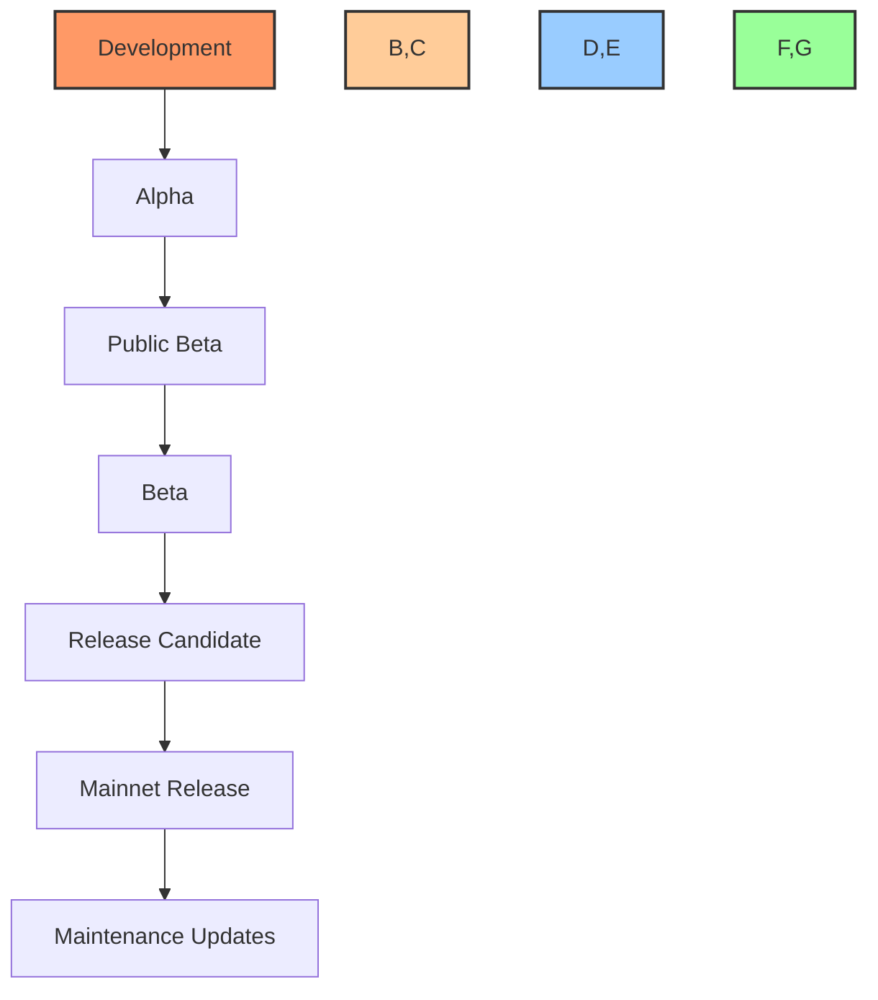
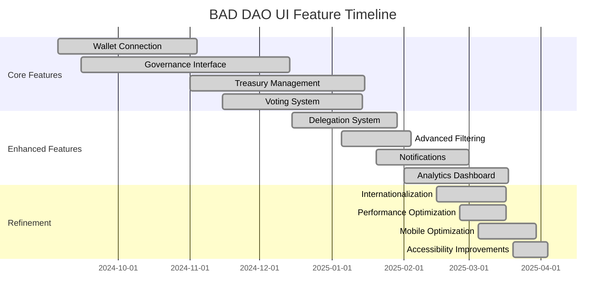
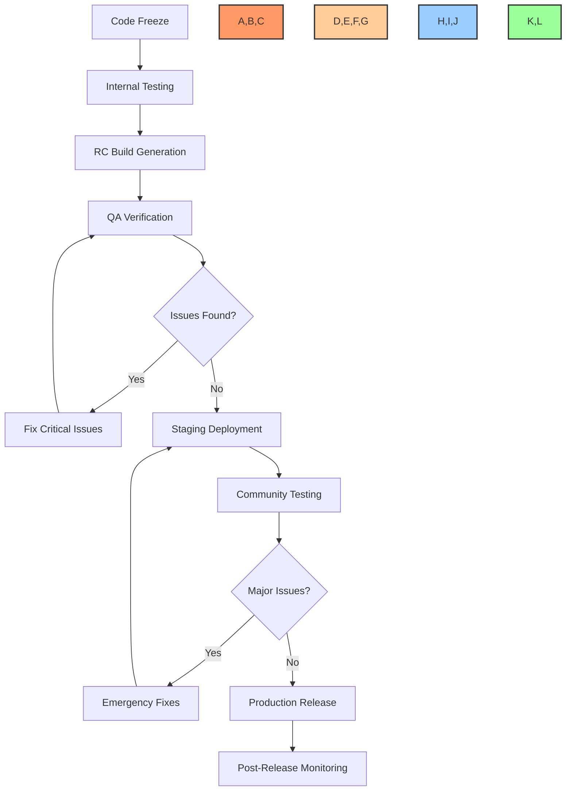
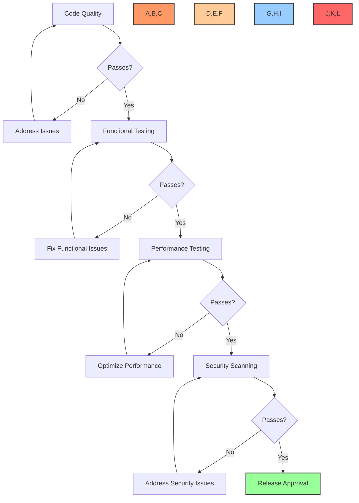
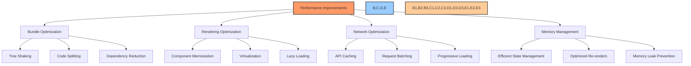
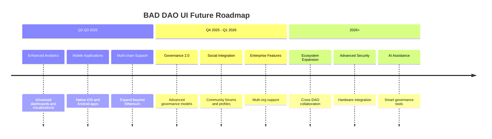

# 📋 Release Notes & Version History

## 📋 Table of Contents
- [🔍 Overview](#overview)
- [🚀 Current Version](#current-version)
- [📜 Version History](#version-history)
  - [v1.0.0 - Mainnet Release](#v100---mainnet-release)
  - [v0.9.0 - Release Candidate](#v090---release-candidate)
  - [v0.8.0 - Beta](#v080---beta)
  - [v0.7.0 - Public Beta](#v070---public-beta)
  - [v0.6.0 - Alpha](#v060---alpha)
- [📈 Feature Development Timeline](#feature-development-timeline)
- [🔄 Update Process](#update-process)
- [🧪 Testing Verification](#testing-verification)
- [📊 Performance Metrics](#performance-metrics)
- [🛣️ Future Roadmap](#future-roadmap)

## 🔍 Overview

This document provides a comprehensive history of BAD DAO UI releases, detailing the evolution of features, fixes, and improvements across versions. It serves as both a historical record and a reference for understanding the progression of the application. Each release is documented with its key features, bug fixes, breaking changes, and performance improvements.

## 🚀 Current Version

**Current Stable Release: v1.0.0 (Mainnet Release)**

The current production version of BAD DAO UI represents the culmination of extensive development, testing, and refinement. It offers a complete set of features for DAO governance, treasury management, and token operations, all presented through an intuitive and responsive user interface.

### Key Features

- Complete governance workflow with proposal creation, voting, and execution
- Treasury management with multi-signature approval
- Token delegation and voting power tracking
- Comprehensive wallet integration
- Mobile and tablet responsive design
- Multi-language support (7 languages)
- Dark/light theme support
- Real-time notifications

### System Requirements

| Environment | Requirement |
|-------------|-------------|
| Supported Browsers | Chrome 90+, Firefox 88+, Safari 14+, Edge 90+ |
| Mobile Support | iOS 14+, Android 8+ |
| Screen Resolution | Minimum 320px width |
| Connectivity | 3G connection or better |
| Wallet Support | MetaMask, WalletConnect, Coinbase Wallet, Ledger |
| Languages | English, Spanish, Chinese, Russian, Korean, Japanese, German |

## 📜 Version History

### Release Flow

### v1.0.0 - Mainnet Release

**Release Date:** April 15, 2025

The production-ready release of BAD DAO UI, featuring full functionality, comprehensive testing, and production-level stability.

#### ✨ New Features
- Complete implementation of delegate-based voting system
- Optimized transaction flow with gas estimation
- Comprehensive activity logging and history tracking
- Advanced treasury analytics dashboard
- Integration with common wallet providers
- Full support for all core DAO operations

#### 🐛 Bug Fixes
- Resolved edge case in vote calculation during delegation changes
- Fixed race condition in proposal status updates
- Corrected display issues in mobile responsive view
- Addressed accessibility issues in voting interface
- Fixed internationalization issues in date formatting

#### ⚠️ Breaking Changes
- New authentication flow requires updated wallet connections
- API endpoints restructured for better security
- Local storage format updated (automatic migration included)

#### 🔧 Technical Improvements
- 42% reduction in initial bundle size
- Improved Core Web Vitals scores (LCP reduced by 35%)
- Reduced API calls by implementing efficient caching
- Enhanced security with comprehensive input validation
- Added comprehensive error boundaries and fallbacks

#### 📊 Metrics
| Metric | Previous (v0.9.0) | Current (v1.0.0) | Improvement |
|--------|------------------|------------------|-------------|
| Bundle Size | 2.4MB | 1.4MB | 42% |
| LCP (mobile) | 3.5s | 2.3s | 35% |
| TTI (mobile) | 5.2s | 3.7s | 29% |
| Memory Usage | 125MB | 95MB | 24% |
| API Calls (typical session) | 47 | 32 | 32% |

### v0.9.0 - Release Candidate

**Release Date:** March 1, 2025

The release candidate focused on stability, performance optimization, and final polish before the mainnet release.

#### ✨ New Features
- Multi-language support (7 languages)
- Advanced notification system with subscription options
- Enhanced proposal creation wizard
- Delegate dashboard for tracking delegated voting power
- Comprehensive user profile and settings
- Dark mode and theme customization

#### 🐛 Bug Fixes
- Fixed timestamp display issues across timezones
- Resolved wallet connection issues with certain providers
- Corrected calculation errors in voting power display
- Fixed form validation issues in proposal creation
- Addressed accessibility issues in interactive components

#### 🔧 Technical Improvements
- Comprehensive end-to-end test coverage
- Performance optimization for voting transactions
- Responsive design improvements for various screen sizes
- Enhanced error handling and user feedback
- Security improvements for API interactions

### v0.8.0 - Beta

**Release Date:** January 15, 2025

The beta release focused on expanding features and improving the overall user experience.

#### ✨ New Features
- Complete voting system implementation
- Treasury management interface
- Transaction history and filtering
- Proposal status tracking and notifications
- Advanced filtering and search for proposals
- Enhanced wallet integration

#### 🐛 Bug Fixes
- Resolved state synchronization issues between components
- Fixed display glitches in proposal cards
- Corrected calculation errors in voting results
- Addressed responsive layout issues on tablet devices
- Fixed wallet address display and formatting

#### 🔧 Technical Improvements
- Component architecture refactoring for better maintainability
- Optimized build process and dependency management
- Improved error handling and recovery mechanisms
- Enhanced accessibility across all interactive elements
- Comprehensive unit and integration test coverage

### v0.7.0 - Public Beta

**Release Date:** November 10, 2024

The first publicly available beta, introducing core functionality for community testing.

#### ✨ New Features
- Governance proposal viewing and simple voting
- Basic wallet connection and authentication
- Simplified treasury view
- User profile creation and management
- Mobile-responsive design implementation
- Basic search and filtering capabilities

#### 🐛 Bug Fixes
- Fixed wallet connection reliability issues
- Resolved data fetching and caching problems
- Corrected rendering issues in governance cards
- Addressed form submission and validation errors
- Fixed navigation issues on mobile devices

#### 🔧 Technical Improvements
- Established CI/CD pipeline for automated testing and deployment
- Implemented code quality checks and linting
- Optimized asset loading and management
- Improved error reporting and monitoring
- Enhanced security for wallet interactions

### v0.6.0 - Alpha

**Release Date:** September 5, 2024

The initial alpha release for internal testing and early feedback.

#### ✨ New Features
- Basic governance dashboard
- Simplified proposal viewing
- Wallet connection (limited providers)
- Read-only treasury view
- Simple user authentication
- Core navigation structure

#### 🔧 Technical Foundation
- React and Next.js foundation
- Core component library implementation
- Basic state management
- Preliminary API integration
- Testing framework setup
- Core styling and theming

## 📈 Feature Development Timeline

## 🔄 Update Process

### Deployment Flow

The BAD DAO UI follows a structured release process to ensure stability and quality:

### Update Installation

Users can access the latest version of BAD DAO UI through the following channels:

1. **Web Application**: 
   - Automatically updated on page refresh
   - Version notification prompts users to refresh when a new version is available

2. **Desktop Application** (if applicable):
   - Automatic updates with user confirmation
   - Manual update option through settings

3. **Mobile Application** (if applicable):
   - Updates through respective app stores
   - In-app notification of available updates

### Rollback Procedures

In case of critical issues, the following rollback procedures are in place:

1. **Critical Issues**: Immediate rollback to previous stable version
2. **Major Issues**: Expedited fix release within 24 hours
3. **Minor Issues**: Scheduled fixes in the next patch release

## 🧪 Testing Verification

Each release undergoes comprehensive testing before deployment:

### Testing Matrix

| Test Type | Scope | Environment | Frequency |
|-----------|-------|-------------|-----------|
| Unit Testing | Components, Functions, Hooks | CI Pipeline | Every commit |
| Integration Testing | Feature workflows | CI Pipeline | Every PR |
| E2E Testing | Core user journeys | CI Pipeline | Daily |
| Performance Testing | Load & stress | Staging | Weekly |
| Accessibility Testing | WCAG compliance | Staging | Bi-weekly |
| Security Testing | Vulnerabilities | Staging | Weekly |
| Browser Compatibility | Cross-browser | Staging | Pre-release |
| Mobile Responsiveness | Various devices | Staging | Pre-release |

### Release Quality Gates

## 📊 Performance Metrics

### Historical Performance Trends

The BAD DAO UI has shown consistent performance improvements across releases:

| Metric | v0.6.0 | v0.7.0 | v0.8.0 | v0.9.0 | v1.0.0 |
|--------|--------|--------|--------|--------|--------|
| Bundle Size (KB) | 3,240 | 2,980 | 2,650 | 2,400 | 1,400 |
| LCP (s) - Mobile | 5.6 | 4.8 | 4.2 | 3.5 | 2.3 |
| LCP (s) - Desktop | 3.2 | 2.9 | 2.5 | 2.1 | 1.2 |
| TTI (s) - Mobile | 8.4 | 7.2 | 6.1 | 5.2 | 3.7 |
| TTI (s) - Desktop | 4.8 | 4.2 | 3.6 | 3.1 | 2.1 |
| CLS | 0.25 | 0.18 | 0.14 | 0.11 | 0.05 |
| Lighthouse Score | 68 | 74 | 82 | 88 | 96 |

### Performance Improvements

## 🛣️ Future Roadmap

The BAD DAO UI development continues with the following planned features and improvements:

### Short-term Roadmap (Q2-Q3 2025)

1. **Enhanced Analytics**: 
   - Advanced governance analytics
   - Treasury performance metrics
   - Voting pattern visualization

2. **Mobile Application**:
   - Native iOS and Android apps
   - Push notifications
   - Biometric authentication

3. **Advanced Treasury Features**:
   - Multi-chain treasury support
   - DeFi integration for treasury management
   - Advanced financial reporting

### Medium-term Roadmap (Q4 2025 - Q1 2026)

1. **Governance Enhancements**:
   - Off-chain signaling and polling
   - Tiered governance models
   - Reputation-based systems

2. **Social Integration**:
   - Governance discussion forums
   - Member profiles and reputation
   - Community contribution tracking

3. **Enterprise Features**:
   - Multi-organization support
   - Advanced permission systems
   - Compliance reporting tools

### Long-term Vision (2026+)

1. **Ecosystem Expansion**:
   - Cross-DAO collaboration tools
   - Governance SDK for developers
   - Pluggable architecture for extensions

2. **Advanced Security**:
   - Hardware security integration
   - Advanced MFA options
   - Anti-phishing protections

3. **AI Assistance**:
   - Proposal summary and analysis
   - Governance recommendations
   - Treasury management assistance

### Roadmap Visualization

---

Made with Power, Love, and AI •  ⚡️❤️🤖 •  POWERBRIDGE.AI 