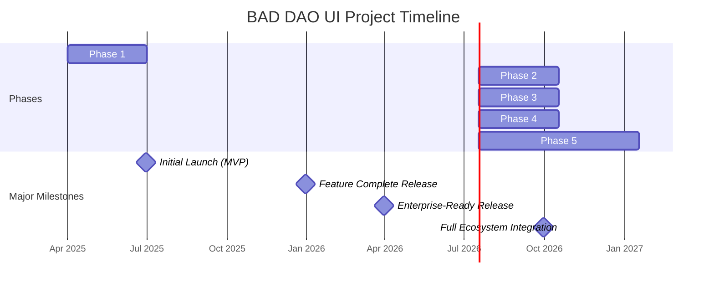
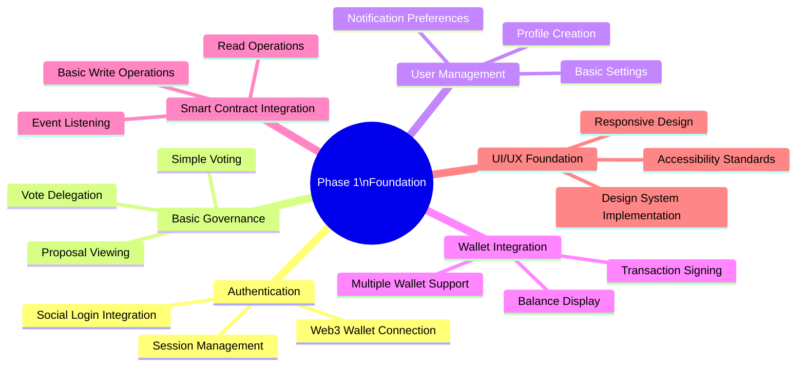
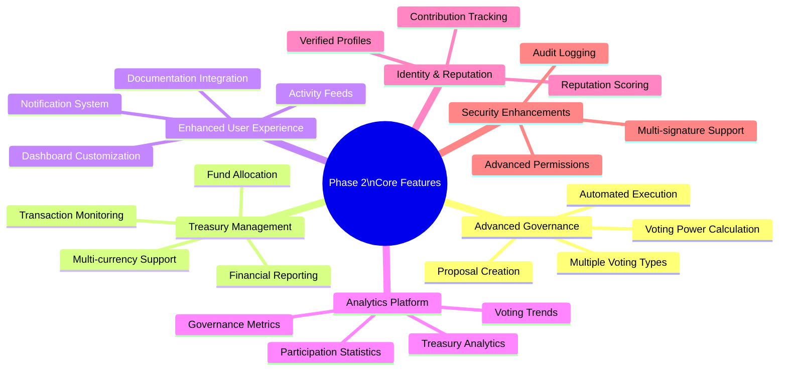
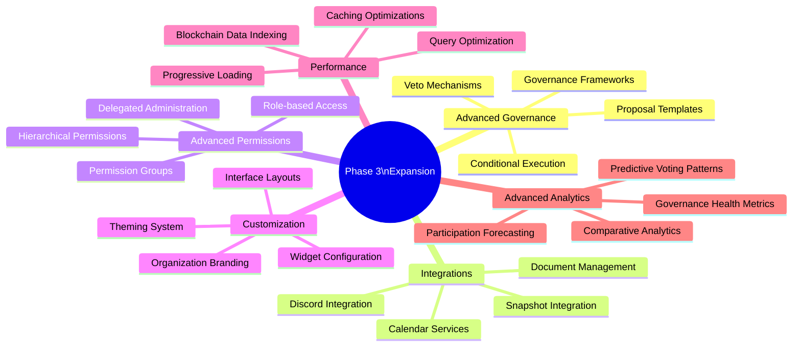
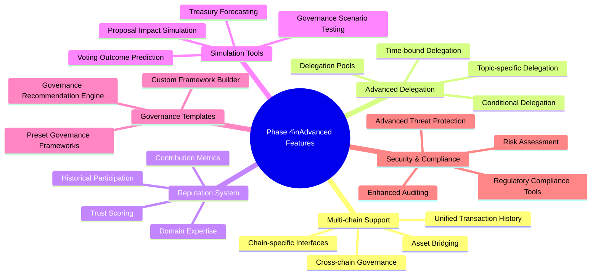
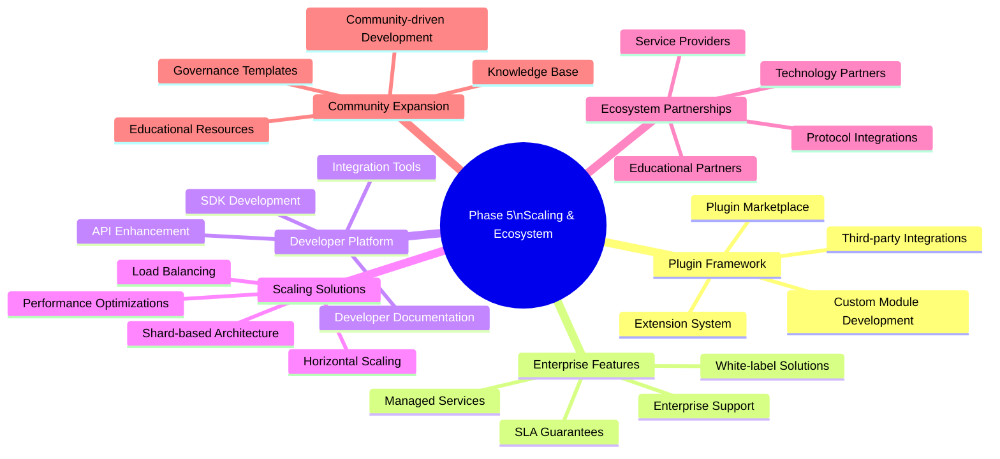
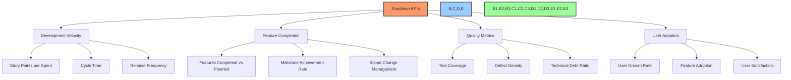
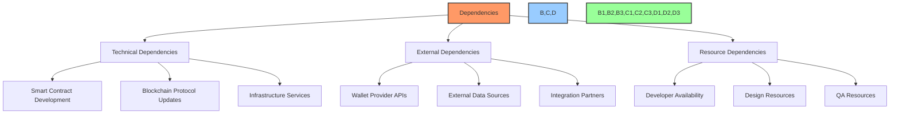

# 🗺️ Development Roadmap & Timeline

## 📋 Table of Contents
- [🔍 Overview](#overview)
- [🎯 Purpose](#purpose)
- [📈 Project Phases](#project-phases)
- [🏗️ Phase 1: Foundation (Q2 2025)](#phase-1-foundation-q2-2025)
- [🚀 Phase 2: Core Features (Q3 2025)](#phase-2-core-features-q3-2025)
- [🔄 Phase 3: Expansion (Q4 2025)](#phase-3-expansion-q4-2025)
- [⚡ Phase 4: Advanced Features (Q1 2026)](#phase-4-advanced-features-q1-2026)
- [🌐 Phase 5: Scaling & Ecosystem (Q2-Q3 2026)](#phase-5-scaling--ecosystem-q2-q3-2026)
- [📊 Progress Tracking](#progress-tracking)
- [❓ Dependencies & Risks](#dependencies--risks)
- [🔄 Roadmap Maintenance](#roadmap-maintenance)

## 🔍 Overview

This roadmap outlines the planned development trajectory for the BAD DAO UI project, detailing the features, milestones, and timeline for implementation. It serves as a strategic guide for stakeholders to understand the project's direction and progress.

## 🎯 Purpose

The roadmap aims to:
- Establish clear development priorities and timelines
- Communicate the product vision to all stakeholders
- Set realistic expectations for feature delivery
- Identify dependencies and potential bottlenecks
- Provide a framework for measuring progress
- Guide resource allocation decisions
- Facilitate coordination between development teams

## 📈 Project Phases

The development is organized into five strategic phases, each with specific objectives and deliverables.

### Roadmap Overview

| Phase | Timeline | Primary Focus | Key Deliverables |
|-------|----------|---------------|------------------|
| 1: Foundation | Q2 2025 | Core infrastructure, MVP features | Authentication, basic governance, wallet integration |
| 2: Core Features | Q3 2025 | Essential DAO functionality | Advanced voting, treasury management, proposal creation |
| 3: Expansion | Q4 2025 | Enhanced governance features | Analytics, integrations, advanced permissions |
| 4: Advanced Features | Q1 2026 | Advanced capabilities | Multi-chain support, delegation, reputation systems |
| 5: Scaling & Ecosystem | Q2-Q3 2026 | Ecosystem expansion | Plugin framework, marketplace, enterprise features |

## 🏗️ Phase 1: Foundation (Q2 2025)

Phase 1 focuses on establishing the core infrastructure and delivering a Minimum Viable Product (MVP) with essential functionality.

### Objectives
- Establish core application architecture
- Implement secure authentication system
- Develop basic governance features
- Create responsive, accessible UI foundation
- Integrate with blockchain wallet providers
- Deploy MVP for initial user testing

### Key Features

### Detailed Timeline

| Feature | Start Date | End Date | Status | Dependencies |
|---------|------------|----------|--------|--------------|
| Application scaffolding | 2025-04-01 | 2025-04-15 | 🟡 In Progress | None |
| Authentication system | 2025-04-10 | 2025-04-30 | 🟡 In Progress | Application scaffolding |
| Wallet integration | 2025-04-20 | 2025-05-15 | 🔴 Not Started | Authentication system |
| Smart contract integration | 2025-05-01 | 2025-05-20 | 🔴 Not Started | Wallet integration |
| Basic governance UI | 2025-05-15 | 2025-06-10 | 🔴 Not Started | Smart contract integration |
| User profile & settings | 2025-05-25 | 2025-06-15 | 🔴 Not Started | Authentication system |
| MVP deployment & testing | 2025-06-15 | 2025-06-30 | 🔴 Not Started | All Phase 1 features |

### Phase 1 Deliverables

1. **MVP Web Application**
   - Responsive web interface
   - Mobile-optimized views
   - Core wallet connectivity

2. **Basic Governance Functionality**
   - View active proposals
   - Cast votes on proposals
   - Track proposal outcomes

3. **Authentication System**
   - Web3 wallet authentication
   - Social login options
   - JWT-based sessions

4. **Technical Foundation**
   - CI/CD pipeline
   - Testing infrastructure
   - Monitoring setup
   - Development environment

### Success Criteria

- Successfully connect to user wallets
- View and interact with governance proposals
- Cast and record votes on blockchain
- Access basic user profile management
- Responsive design across devices
- Pass security assessment

## 🚀 Phase 2: Core Features (Q3 2025)

Phase 2 expands the MVP with essential DAO functionality to create a complete governance solution.

### Objectives
- Implement comprehensive proposal system
- Develop treasury management features
- Enhance voting mechanisms
- Improve user experience and engagement
- Implement comprehensive analytics
- Expand smart contract integrations

### Key Features

### Detailed Timeline

| Feature | Start Date | End Date | Status | Dependencies |
|---------|------------|----------|--------|--------------|
| Advanced proposal system | 2025-07-01 | 2025-07-25 | 🔴 Not Started | Phase 1 completion |
| Multi-type voting mechanisms | 2025-07-15 | 2025-08-10 | 🔴 Not Started | Advanced proposal system |
| Treasury management dashboard | 2025-07-20 | 2025-08-15 | 🔴 Not Started | Phase 1 completion |
| Analytics & reporting | 2025-08-01 | 2025-08-20 | 🔴 Not Started | Multi-type voting, Treasury dashboard |
| Notification system | 2025-08-10 | 2025-08-30 | 🔴 Not Started | Phase 1 completion |
| Identity & reputation features | 2025-08-15 | 2025-09-10 | 🔴 Not Started | Advanced proposal system |
| Security enhancements | 2025-08-25 | 2025-09-15 | 🔴 Not Started | Treasury management, Identity features |
| Integration testing & deployment | 2025-09-15 | 2025-09-30 | 🔴 Not Started | All Phase 2 features |

### Phase 2 Deliverables

1. **Comprehensive Governance System**
   - Multiple proposal types
   - Advanced voting mechanisms
   - Voting power calculations
   - Automated execution

2. **Treasury Management**
   - Asset overview dashboard
   - Transaction history
   - Financial reporting
   - Fund allocation requests

3. **User Engagement Features**
   - Customizable dashboard
   - Real-time notifications
   - Activity feeds
   - Comprehensive documentation

4. **Analytics Platform**
   - Governance metrics
   - Participation statistics
   - Voting trend analysis
   - Treasury performance

### Success Criteria

- Complete proposal lifecycle management
- Accurate treasury visualization and management
- Engaged user base with active participation
- Comprehensive analytics dashboard
- Enhanced security features
- Positive user feedback

## 🔄 Phase 3: Expansion (Q4 2025)

Phase 3 focuses on enhancing the governance capabilities, adding integrations, and implementing advanced permission systems.

### Objectives
- Implement advanced governance mechanisms
- Develop comprehensive permission system
- Add integrations with external tools
- Enhance customization options
- Improve performance and scalability
- Implement advanced analytics

### Key Features

### Detailed Timeline

| Feature | Start Date | End Date | Status | Dependencies |
|---------|------------|----------|--------|--------------|
| Advanced governance mechanisms | 2025-10-01 | 2025-10-25 | 🔴 Not Started | Phase 2 completion |
| Integration framework | 2025-10-10 | 2025-10-30 | 🔴 Not Started | Phase 2 completion |
| External service connectors | 2025-10-20 | 2025-11-15 | 🔴 Not Started | Integration framework |
| Advanced permission system | 2025-10-25 | 2025-11-20 | 🔴 Not Started | Phase 2 completion |
| Customization engine | 2025-11-01 | 2025-11-25 | 🔴 Not Started | Phase 2 completion |
| Performance optimizations | 2025-11-10 | 2025-11-30 | 🔴 Not Started | All Phase 3 features |
| Advanced analytics implementation | 2025-11-15 | 2025-12-10 | 🔴 Not Started | Performance optimizations |
| Testing & deployment | 2025-12-10 | 2025-12-31 | 🔴 Not Started | All Phase 3 features |

### Phase 3 Deliverables

1. **Advanced Governance Suite**
   - Proposal templates
   - Governance frameworks
   - Conditional execution
   - Veto mechanisms

2. **Integration Platform**
   - API-based integration framework
   - External service connectors
   - Webhook system
   - Data synchronization

3. **Enterprise-Grade Permissions**
   - Hierarchical role system
   - Fine-grained permission controls
   - Permission auditing
   - Delegated administration

4. **Customization Engine**
   - Theme management
   - Layout configuration
   - Brand customization
   - Interface preferences

### Success Criteria

- Successful implementation of advanced governance features
- Working integrations with key external services
- Comprehensive permission system in production
- Customization options available to users
- Performance improvements measured and verified
- Advanced analytics providing actionable insights

## ⚡ Phase 4: Advanced Features (Q1 2026)

Phase 4 focuses on implementing advanced capabilities that differentiate the BAD DAO UI platform in the market.

### Objectives
- Implement multi-chain support
- Develop advanced delegation system
- Create comprehensive reputation system
- Add simulation and forecasting tools
- Implement governance framework templates
- Enhance security and compliance features

### Key Features

### Detailed Timeline

| Feature | Start Date | End Date | Status | Dependencies |
|---------|------------|----------|--------|--------------|
| Multi-chain infrastructure | 2026-01-01 | 2026-01-25 | 🔴 Not Started | Phase 3 completion |
| Chain-specific adapters | 2026-01-15 | 2026-02-10 | 🔴 Not Started | Multi-chain infrastructure |
| Advanced delegation system | 2026-01-20 | 2026-02-15 | 🔴 Not Started | Phase 3 completion |
| Comprehensive reputation system | 2026-01-25 | 2026-02-20 | 🔴 Not Started | Advanced delegation system |
| Simulation and forecasting tools | 2026-02-01 | 2026-02-25 | 🔴 Not Started | Phase 3 completion |
| Governance framework templates | 2026-02-10 | 2026-03-05 | 🔴 Not Started | Simulation tools |
| Enhanced security features | 2026-02-15 | 2026-03-10 | 🔴 Not Started | Multi-chain infrastructure |
| Compliance tooling | 2026-02-20 | 2026-03-15 | 🔴 Not Started | Enhanced security features |
| Integration testing & deployment | 2026-03-15 | 2026-03-31 | 🔴 Not Started | All Phase 4 features |

### Phase 4 Deliverables

1. **Multi-chain Governance Platform**
   - Support for multiple blockchains
   - Cross-chain governance capabilities
   - Chain-specific adaptations
   - Unified transaction history

2. **Advanced Delegation Framework**
   - Conditional delegation
   - Delegation pools and grouping
   - Time-bound delegation
   - Topic-specific delegation

3. **Comprehensive Reputation System**
   - Contribution metrics
   - Trust scoring algorithm
   - Participation history analysis
   - Domain expertise recognition

4. **Governance Simulation Platform**
   - Proposal impact simulator
   - Voting outcome predictions
   - Treasury forecasting tools
   - Governance scenario testing

### Success Criteria

- Successful integration with multiple blockchains
- Working advanced delegation features
- Comprehensive reputation system providing value
- Accurate simulation and forecasting tools
- Preset governance frameworks in production
- Enhanced security features meeting enterprise requirements

## 🌐 Phase 5: Scaling & Ecosystem (Q2-Q3 2026)

Phase 5 focuses on scaling the platform and building an ecosystem around the BAD DAO UI.

### Objectives
- Develop plugin and extension framework
- Create marketplace for DAO tools
- Implement enterprise-grade features
- Enhance scalability and performance
- Develop advanced developer tools
- Build comprehensive ecosystem partnerships

### Key Features

### Detailed Timeline

| Feature | Start Date | End Date | Status | Dependencies |
|---------|------------|----------|--------|--------------|
| Plugin architecture | 2026-04-01 | 2026-04-30 | 🔴 Not Started | Phase 4 completion |
| Extension framework | 2026-04-15 | 2026-05-15 | 🔴 Not Started | Plugin architecture |
| Marketplace development | 2026-05-01 | 2026-06-15 | 🔴 Not Started | Extension framework |
| Enterprise feature set | 2026-05-15 | 2026-06-30 | 🔴 Not Started | Phase 4 completion |
| Developer SDK & tools | 2026-06-01 | 2026-07-15 | 🔴 Not Started | Phase 4 completion |
| Scaling infrastructure | 2026-06-15 | 2026-07-30 | 🔴 Not Started | Enterprise feature set |
| Partner integration program | 2026-07-01 | 2026-08-15 | 🔴 Not Started | Marketplace development |
| Community resources & education | 2026-07-15 | 2026-08-30 | 🔴 Not Started | All previous features |
| Final testing & ecosystem launch | 2026-09-01 | 2026-09-30 | 🔴 Not Started | All Phase 5 features |

### Phase 5 Deliverables

1. **Plugin Ecosystem**
   - Extensible plugin architecture
   - Developer SDK for plugin creation
   - Marketplace for plugins
   - Plugin management system

2. **Enterprise Solution**
   - White-label capabilities
   - Enterprise-grade support
   - Advanced security features
   - SLA guarantees

3. **Developer Platform**
   - Comprehensive API documentation
   - Integration tools and libraries
   - Developer sandbox
   - Example implementations

4. **Ecosystem Partnerships**
   - Technology partner program
   - Service provider network
   - Protocol integrations
   - Educational partnerships

### Success Criteria

- Successful launch of plugin marketplace
- Enterprise clients using white-label solution
- Active developer community building extensions
- Comprehensive ecosystem of partners
- Platform scaling to support large user base
- Positive community engagement with educational resources

## 📊 Progress Tracking

Progress will be tracked using a combination of metrics and reporting mechanisms.

### Key Performance Indicators (KPIs)

### Reporting Cadence

| Report Type | Frequency | Audience | Key Contents |
|-------------|-----------|----------|--------------|
| Sprint Review | Bi-weekly | Development Team, Product Owners | Sprint goal achievement, demo, velocity |
| Phase Progress Report | Monthly | Stakeholders, Leadership | Feature status, risks, adjustments |
| Milestone Report | Per Milestone | All Stakeholders | Milestone completion, metrics, next steps |
| Roadmap Review | Quarterly | Leadership, Investors | Strategic alignment, adjustments, forecasts |

### Progress Visualization

The project will use a combination of tools to visualize progress:

1. **GitHub Project Board**
   - User stories and tasks
   - Sprint planning
   - Issue tracking

2. **Roadmap Dashboard**
   - Phase progress indicators
   - Milestone tracking
   - Timeline visualization

3. **Metrics Dashboard**
   - Development metrics
   - Quality indicators
   - User adoption metrics

## ❓ Dependencies & Risks

### Critical Dependencies

### Risk Analysis

| Risk Category | Risk | Impact | Probability | Mitigation Strategy |
|---------------|------|--------|------------|---------------------|
| Technical | Smart contract vulnerabilities | High | Medium | Regular security audits, formal verification |
| Technical | Blockchain network congestion | Medium | High | Multiple blockchain support, optimistic updates |
| Technical | API changes from wallet providers | Medium | Medium | Adapter pattern, regular testing |
| External | Regulatory changes | High | Medium | Legal consultation, flexible architecture |
| External | Market conditions affecting adoption | Medium | Medium | User research, phased deployments |
| Resource | Developer availability | High | Low | Cross-training, documentation, knowledge sharing |
| Resource | Funding constraints | High | Low | Phased approach, priority optimization |

### Contingency Planning

1. **Technical Contingencies**
   - Fallback providers for critical services
   - Graceful degradation paths
   - Local caching and offline capabilities

2. **Timeline Contingencies**
   - Buffer periods between phases
   - Feature prioritization framework
   - Scope adjustment procedures

3. **Resource Contingencies**
   - Cross-functional training
   - External resource identification
   - Critical path resource allocation

## 🔄 Roadmap Maintenance

The roadmap is a living document that will be updated regularly.

### Update Process

1. **Regular Reviews**
   - Quarterly strategic reviews
   - Monthly progress assessments
   - Sprint-based tactical adjustments

2. **Change Management**
   - Formal change request process
   - Impact assessment requirements
   - Stakeholder approval workflow

3. **Communication Plan**
   - Roadmap update notifications
   - Stakeholder communication matrix
   - Public roadmap publications

### Version History

| Version | Date | Major Changes |
|---------|------|---------------|
| 1.0 | 2025-05-05 | Initial roadmap document |

---

Made with Power, Love, and AI •  ⚡️❤️🤖 •  POWERBRIDGE.AI 