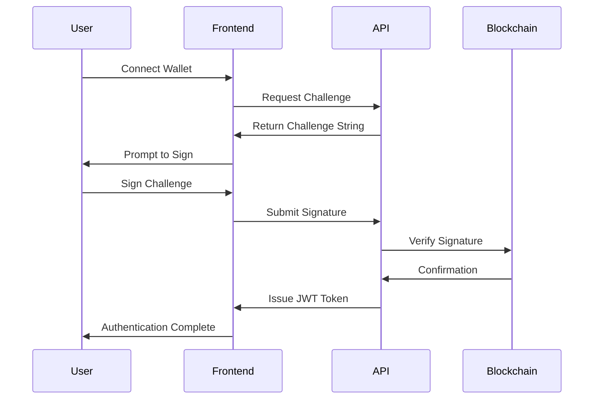
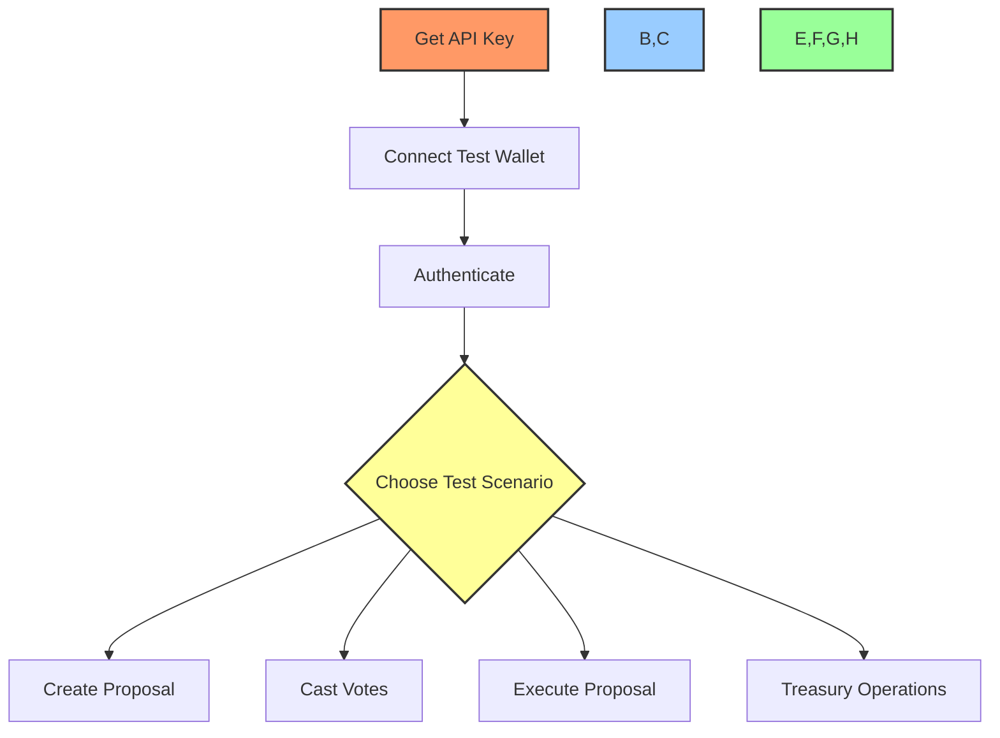

# 🌐 API Endpoints and Usage Guide

## 📋 Table of Contents
- [🔍 Overview](#overview)
- [🎯 Purpose](#purpose)
- [🔑 Authentication](#authentication)
- [🧩 Core API Endpoints](#core-api-endpoints)
- [💰 Treasury API](#treasury-api)
- [🗳️ Governance API](#governance-api)
- [👤 User API](#user-api)
- [📊 Data Models](#data-models)
- [🔄 Webhooks](#webhooks)
- [⚠️ Error Handling](#error-handling)
- [🧪 Testing](#testing)

## 🔍 Overview

This document provides comprehensive documentation for the BAD DAO UI API, detailing all available endpoints, request/response formats, authentication methods, and integration guidelines. The API follows RESTful design principles and uses JSON for data exchange.

## 🎯 Purpose

The BAD DAO UI API aims to:
- Provide programmatic access to the DAO's core functionality
- Enable seamless integration with the blockchain
- Support the UI with efficient data access
- Allow third-party integrations and extensions
- Maintain security and data integrity

## 🔑 Authentication

### Authentication Methods

The API supports multiple authentication methods:

1. **Web3 Wallet Authentication**
   - Sign message with wallet
   - Verify signature on server
   - Receive JWT token

2. **OAuth 2.0**
   - For third-party integrations
   - Supports authorization code flow
   - Refresh token mechanism

### Authentication Flow



### Authentication Endpoints

#### `POST /api/auth/challenge`
Request a challenge string for wallet signature.

**Request:**
```json
{
  "walletAddress": "0x1234...5678"
}
```

**Response:**
```json
{
  "challenge": "Sign this message to authenticate: 9a8b7c6d...",
  "expiresAt": "2023-05-01T12:00:00Z"
}
```

#### `POST /api/auth/verify`
Verify a signed challenge and issue a token.

**Request:**
```json
{
  "walletAddress": "0x1234...5678",
  "signature": "0xabcd...1234",
  "challenge": "Sign this message to authenticate: 9a8b7c6d..."
}
```

**Response:**
```json
{
  "token": "eyJhbGciOiJIUzI1NiIsInR5cCI6IkpXVCJ9...",
  "expiresAt": "2023-05-01T14:00:00Z",
  "user": {
    "id": "usr_123456",
    "walletAddress": "0x1234...5678",
    "roles": ["member"]
  }
}
```

## 🧩 Core API Endpoints

### Base URL

All API endpoints are available at the base URL:

**Production:** `https://api.baddao.io/v1`
**Staging:** `https://api-staging.baddao.io/v1`

### API Versioning

The API is versioned in the URL path. The current version is `v1`.

### Rate Limiting

- **Standard Tier**: 100 requests per minute
- **Enhanced Tier**: 500 requests per minute
- **Status Code**: 429 Too Many Requests

### Response Format

All API responses follow this standard format:

```json
{
  "success": true,
  "data": {
    // Response data here
  },
  "meta": {
    "pagination": {
      "total": 100,
      "page": 1,
      "perPage": 20,
      "totalPages": 5
    }
  }
}
```

Error responses:

```json
{
  "success": false,
  "error": {
    "code": "INVALID_PARAMETERS",
    "message": "The provided parameters are invalid",
    "details": {
      "walletAddress": "Must be a valid ethereum address"
    }
  }
}
```

## 💰 Treasury API

### Treasury Endpoints

#### `GET /api/treasury/overview`
Get an overview of the DAO treasury.

**Parameters:**
- `currency` (optional): Display currency (USD, ETH, etc.)

**Response:**
```json
{
  "success": true,
  "data": {
    "totalValue": 1250000.45,
    "currency": "USD",
    "assets": [
      {
        "symbol": "ETH",
        "amount": 450.5,
        "valueUSD": 850000.25,
        "percentage": 68
      },
      {
        "symbol": "USDC",
        "amount": 400000.20,
        "valueUSD": 400000.20,
        "percentage": 32
      }
    ],
    "lastUpdated": "2023-05-01T10:15:30Z"
  }
}
```

#### `GET /api/treasury/transactions`
Get a list of treasury transactions.

**Parameters:**
- `page` (optional): Page number (default: 1)
- `perPage` (optional): Items per page (default: 20)
- `sort` (optional): Sort field (default: date)
- `order` (optional): Sort order (asc/desc, default: desc)
- `type` (optional): Transaction type (deposit/withdrawal)

**Response:**
```json
{
  "success": true,
  "data": [
    {
      "id": "tx_123456",
      "type": "deposit",
      "amount": 10.5,
      "asset": "ETH",
      "valueUSD": 19845.75,
      "timestamp": "2023-04-28T14:25:10Z",
      "txHash": "0xabcd...1234",
      "from": "0x1234...5678",
      "to": "0x8765...4321"
    },
    // Additional transactions...
  ],
  "meta": {
    "pagination": {
      "total": 156,
      "page": 1,
      "perPage": 20,
      "totalPages": 8
    }
  }
}
```

## 🗳️ Governance API

### Proposal Endpoints

#### `GET /api/proposals`
Get a list of proposals.

**Parameters:**
- `page` (optional): Page number (default: 1)
- `perPage` (optional): Items per page (default: 20)
- `status` (optional): Filter by status (active/passed/failed/pending)
- `search` (optional): Search term
- `sort` (optional): Sort field (default: createdAt)
- `order` (optional): Sort order (asc/desc, default: desc)

**Response:**
```json
{
  "success": true,
  "data": [
    {
      "id": "prop_123456",
      "title": "Increase Treasury Allocation for Development",
      "description": "This proposal aims to increase the development budget...",
      "proposer": "0x1234...5678",
      "status": "active",
      "votingStartTime": "2023-04-25T00:00:00Z",
      "votingEndTime": "2023-05-02T00:00:00Z",
      "votesFor": 25000,
      "votesAgainst": 5000,
      "quorum": 20000,
      "executed": false
    },
    // Additional proposals...
  ],
  "meta": {
    "pagination": {
      "total": 42,
      "page": 1,
      "perPage": 20,
      "totalPages": 3
    }
  }
}
```

#### `GET /api/proposals/:id`
Get a single proposal by ID.

**Response:**
```json
{
  "success": true,
  "data": {
    "id": "prop_123456",
    "title": "Increase Treasury Allocation for Development",
    "description": "This proposal aims to increase the development budget...",
    "fullDescription": "# Full Proposal\n\nDetailed markdown content here...",
    "proposer": {
      "address": "0x1234...5678",
      "ensName": "user.eth"
    },
    "status": "active",
    "votingStartTime": "2023-04-25T00:00:00Z",
    "votingEndTime": "2023-05-02T00:00:00Z",
    "votesFor": 25000,
    "votesAgainst": 5000,
    "quorum": 20000,
    "executed": false,
    "transactions": [
      {
        "to": "0x9876...5432",
        "value": "0",
        "data": "0xabcdef...",
        "description": "Transfer 100,000 USDC to Development Fund"
      }
    ],
    "votes": [
      {
        "voter": "0x2345...6789",
        "vote": "for",
        "votingPower": 1500,
        "timestamp": "2023-04-26T14:30:00Z"
      }
      // Additional votes...
    ]
  }
}
```

#### `POST /api/proposals`
Create a new proposal.

**Request:**
```json
{
  "title": "Increase Treasury Allocation for Development",
  "description": "Brief summary of the proposal",
  "fullDescription": "# Full Proposal\n\nDetailed markdown content here...",
  "transactions": [
    {
      "to": "0x9876...5432",
      "value": "0",
      "data": "0xabcdef...",
      "description": "Transfer 100,000 USDC to Development Fund"
    }
  ]
}
```

**Response:**
```json
{
  "success": true,
  "data": {
    "id": "prop_123456",
    "title": "Increase Treasury Allocation for Development",
    "status": "pending",
    "createdAt": "2023-05-01T10:30:00Z"
  }
}
```

#### `POST /api/proposals/:id/vote`
Cast a vote on a proposal.

**Request:**
```json
{
  "vote": "for", // or "against"
  "reason": "I support this because..." // optional
}
```

**Response:**
```json
{
  "success": true,
  "data": {
    "proposalId": "prop_123456",
    "vote": "for",
    "votingPower": 1500,
    "timestamp": "2023-05-01T10:35:00Z"
  }
}
```

## 👤 User API

### User Endpoints

#### `GET /api/user/profile`
Get the current user's profile.

**Response:**
```json
{
  "success": true,
  "data": {
    "id": "usr_123456",
    "walletAddress": "0x1234...5678",
    "ensName": "user.eth",
    "roles": ["member"],
    "votingPower": 1500,
    "joinedAt": "2023-01-15T00:00:00Z",
    "proposals": {
      "created": 3,
      "voted": 12
    }
  }
}
```

#### `GET /api/user/votes`
Get the current user's voting history.

**Parameters:**
- `page` (optional): Page number (default: 1)
- `perPage` (optional): Items per page (default: 20)

**Response:**
```json
{
  "success": true,
  "data": [
    {
      "proposalId": "prop_123456",
      "proposalTitle": "Increase Treasury Allocation for Development",
      "vote": "for",
      "votingPower": 1500,
      "timestamp": "2023-04-26T14:30:00Z"
    },
    // Additional votes...
  ],
  "meta": {
    "pagination": {
      "total": 12,
      "page": 1,
      "perPage": 20,
      "totalPages": 1
    }
  }
}
```

## 📊 Data Models

### Core Data Models

#### Proposal
```typescript
interface Proposal {
  id: string;
  title: string;
  description: string;
  fullDescription: string;
  proposer: {
    address: string;
    ensName?: string;
  };
  status: 'pending' | 'active' | 'passed' | 'failed' | 'executed';
  votingStartTime: string; // ISO date
  votingEndTime: string; // ISO date
  votesFor: number;
  votesAgainst: number;
  quorum: number;
  executed: boolean;
  transactions: ProposalTransaction[];
  createdAt: string; // ISO date
  updatedAt: string; // ISO date
}

interface ProposalTransaction {
  to: string;
  value: string;
  data: string;
  description: string;
}
```

#### Vote
```typescript
interface Vote {
  proposalId: string;
  voter: string;
  vote: 'for' | 'against';
  votingPower: number;
  reason?: string;
  timestamp: string; // ISO date
}
```

#### User
```typescript
interface User {
  id: string;
  walletAddress: string;
  ensName?: string;
  roles: string[];
  votingPower: number;
  joinedAt: string; // ISO date
  proposals: {
    created: number;
    voted: number;
  };
}
```

#### Treasury
```typescript
interface Treasury {
  totalValue: number;
  currency: string;
  assets: TreasuryAsset[];
  lastUpdated: string; // ISO date
}

interface TreasuryAsset {
  symbol: string;
  amount: number;
  valueUSD: number;
  percentage: number;
}
```

## 🔄 Webhooks

### Webhook Configuration

The API supports webhooks for real-time notifications:

#### `POST /api/webhooks`
Create a new webhook subscription.

**Request:**
```json
{
  "url": "https://your-server.com/webhook",
  "events": ["proposal.created", "proposal.executed", "vote.cast"],
  "secret": "your_webhook_secret"
}
```

**Response:**
```json
{
  "success": true,
  "data": {
    "id": "wh_123456",
    "url": "https://your-server.com/webhook",
    "events": ["proposal.created", "proposal.executed", "vote.cast"],
    "createdAt": "2023-05-01T11:00:00Z"
  }
}
```

### Webhook Events

| Event | Description |
|-------|-------------|
| `proposal.created` | A new proposal has been created |
| `proposal.activated` | A proposal has become active for voting |
| `proposal.ended` | A proposal's voting period has ended |
| `proposal.executed` | A proposal has been executed |
| `vote.cast` | A vote has been cast on a proposal |
| `treasury.transaction` | A treasury transaction has occurred |

### Webhook Payload

```json
{
  "event": "proposal.created",
  "timestamp": "2023-05-01T12:00:00Z",
  "data": {
    // Event-specific data
  },
  "signature": "sha256=..." // HMAC signature of the payload
}
```

## ⚠️ Error Handling

### Error Codes

| Code | Description | HTTP Status |
|------|-------------|-------------|
| `AUTHENTICATION_REQUIRED` | Authentication is required | 401 |
| `INVALID_TOKEN` | The provided token is invalid | 401 |
| `FORBIDDEN` | User lacks permission | 403 |
| `RESOURCE_NOT_FOUND` | The requested resource was not found | 404 |
| `INVALID_PARAMETERS` | The provided parameters are invalid | 400 |
| `RATE_LIMIT_EXCEEDED` | Rate limit has been exceeded | 429 |
| `INTERNAL_ERROR` | An internal server error occurred | 500 |

### Error Response Example

```json
{
  "success": false,
  "error": {
    "code": "INVALID_PARAMETERS",
    "message": "The provided parameters are invalid",
    "details": {
      "title": "Title is required and must be less than 100 characters"
    }
  }
}
```

## 🧪 Testing

### Testing Endpoints

A sandbox environment is available for testing:

**Sandbox URL:** `https://api-sandbox.baddao.io/v1`

### Test Wallets

| Address | Private Key | Description |
|---------|-------------|-------------|
| `0xTest1...` | Available upon request | Standard member |
| `0xTest2...` | Available upon request | Admin member |
| `0xTest3...` | Available upon request | Member with high voting power |

### Mock Data

The sandbox environment includes pre-populated mock data:
- 20+ example proposals in various states
- 100+ mock votes
- Treasury with multiple assets
- Multiple user accounts with different roles

### Testing Flow


## 📊 Implementation Status

| API Category | Design | Implementation | Testing | Documentation |
|--------------|--------|----------------|---------|---------------|
| Authentication | 🟢 Complete | 🟡 In Progress | 🔴 Not Started | 🟢 Complete |
| Proposals | 🟢 Complete | 🟡 In Progress | 🔴 Not Started | 🟢 Complete |
| Voting | 🟢 Complete | 🟡 In Progress | 🔴 Not Started | 🟢 Complete |
| Treasury | 🟢 Complete | 🔴 Not Started | 🔴 Not Started | 🟢 Complete |
| User | 🟢 Complete | 🟡 In Progress | 🔴 Not Started | 🟢 Complete |
| Webhooks | 🟡 In Progress | 🔴 Not Started | 🔴 Not Started | 🟡 In Progress |

---

Made with Power, Love, and AI •  ⚡️❤️🤖 •  POWERBRIDGE.AI 