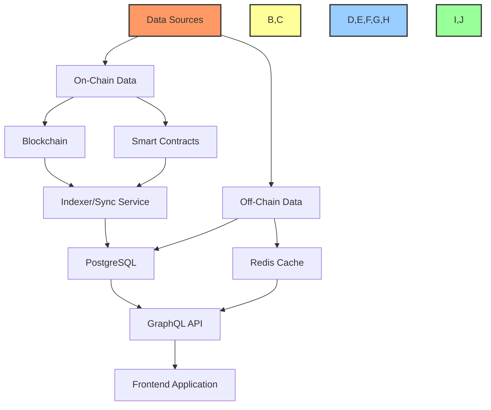
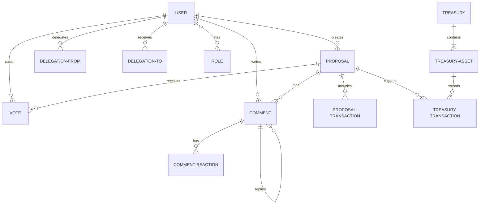
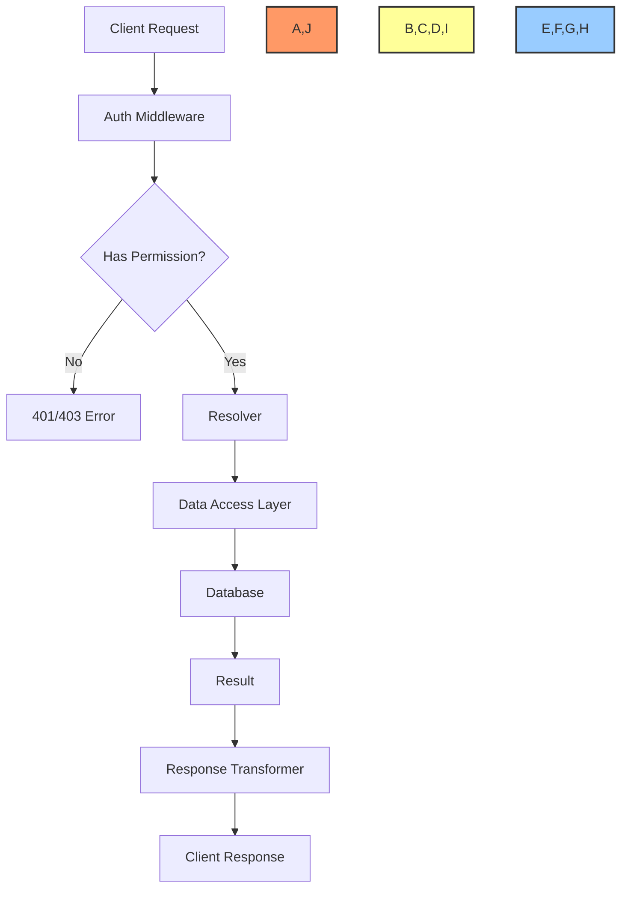

# 💾 Database Schema and Data Modeling

## 📋 Table of Contents
- [🔍 Overview](#overview)
- [🎯 Purpose](#purpose)
- [🏗️ Database Architecture](#database-architecture)
- [📊 Core Data Models](#core-data-models)
- [🔄 Relationships](#relationships)
- [🔍 Indexes and Queries](#indexes-and-queries)
- [🔒 Data Security](#data-security)
- [📈 Scalability Considerations](#scalability-considerations)
- [🔄 Data Synchronization](#data-synchronization)
- [📊 Implementation Status](#implementation-status)

## 🔍 Overview

This document details the database schema and data modeling approach for the BAD DAO UI. It covers the core data models, relationships, security considerations, and implementation details for both on-chain and off-chain data storage.

## 🎯 Purpose

The data modeling for BAD DAO UI aims to:
- Provide efficient data storage and retrieval for the application
- Balance on-chain and off-chain data storage for optimal performance
- Ensure data integrity and consistency across the system
- Support scalable growth as the DAO expands
- Implement proper security measures for sensitive information

## 🏗️ Database Architecture

### Overall Architecture



### Database Technology Stack

- **Primary Database**: PostgreSQL 14+
- **Caching Layer**: Redis
- **Data Indexer**: Custom Ethereum indexer service
- **API Layer**: GraphQL with Apollo Server
- **ORM**: Prisma

### Storage Strategy

| Data Type | Storage Location | Rationale |
|-----------|------------------|-----------|
| Core Governance Data | On-chain | Transparency and immutability |
| Treasury Transactions | On-chain | Financial integrity and auditability |
| User Profiles | Off-chain with option for on-chain | Balance between privacy and decentralization |
| Application Settings | Off-chain | Performance and cost efficiency |
| Activity Logs | Off-chain with blockchain references | Cost efficiency with auditability |
| Media & Content | IPFS with off-chain references | Decentralized storage with indexing |

## 📊 Core Data Models

### User Model

```typescript
// User Model
model User {
  id                 String           @id @default(cuid())
  walletAddress      String           @unique
  ensName            String?
  displayName        String?
  profileImageUrl    String?
  bio                String?
  joinedAt           DateTime         @default(now())
  lastActiveAt       DateTime?
  roles              Role[]           @relation("UserRoles")
  notificationSettings NotificationSettings?
  votes              Vote[]
  proposals          Proposal[]
  comments           Comment[]
  delegatedVotesFrom Delegation[]     @relation("DelegatedFrom")
  delegatedVotesTo   Delegation?      @relation("DelegatedTo")

  @@index([walletAddress])
}

model Role {
  id              String         @id @default(cuid())
  name            String         @unique
  permissions     Permission[]   @relation("RolePermissions")
  users           User[]         @relation("UserRoles")
}
```

### Proposal Model

```typescript
// Proposal Model
model Proposal {
  id                String          @id
  title             String
  description       String
  fullDescription   String          @db.Text
  proposer          User            @relation(fields: [proposerId], references: [id])
  proposerId        String
  status            ProposalStatus  @default(PENDING)
  votingStartTime   DateTime?
  votingEndTime     DateTime?
  votesFor          BigInt          @default(0)
  votesAgainst      BigInt          @default(0)
  quorum            BigInt
  executed          Boolean         @default(false)
  executedAt        DateTime?
  transactions      ProposalTransaction[]
  votes             Vote[]
  comments          Comment[]
  createdAt         DateTime        @default(now())
  updatedAt         DateTime        @updatedAt
  snapshotBlock     Int?
  ipfsHash          String?

  @@index([status])
  @@index([proposerId])
}

enum ProposalStatus {
  PENDING
  ACTIVE
  PASSED
  FAILED
  EXECUTED
  CANCELLED
}

model ProposalTransaction {
  id              String          @id @default(cuid())
  proposal        Proposal        @relation(fields: [proposalId], references: [id])
  proposalId      String
  to              String
  value           String          // BigNumber as string
  data            String
  description     String
  executed        Boolean         @default(false)
  executedAt      DateTime?
  executionTxHash String?

  @@index([proposalId])
}
```

### Vote Model

```typescript
// Vote Model
model Vote {
  id              String          @id @default(cuid())
  proposal        Proposal        @relation(fields: [proposalId], references: [id])
  proposalId      String
  voter           User            @relation(fields: [voterId], references: [id])
  voterId         String
  voteDirection   VoteDirection
  votingPower     BigInt
  reason          String?
  timestamp       DateTime        @default(now())
  transactionHash String?

  @@unique([proposalId, voterId])
  @@index([proposalId])
  @@index([voterId])
}

enum VoteDirection {
  FOR
  AGAINST
  ABSTAIN
}
```

### Treasury Model

```typescript
// Treasury Models
model Treasury {
  id                String          @id @default(cuid())
  totalValue        Float
  currency          String          @default("USD")
  assets            TreasuryAsset[]
  lastUpdated       DateTime        @default(now())
}

model TreasuryAsset {
  id                String          @id @default(cuid())
  treasury          Treasury        @relation(fields: [treasuryId], references: [id])
  treasuryId        String
  symbol            String
  name              String
  tokenAddress      String?
  amount            String          // BigNumber as string
  valueUSD          Float
  percentage        Float
  transactions      TreasuryTransaction[]

  @@index([treasuryId])
  @@index([symbol])
}

model TreasuryTransaction {
  id                String          @id @default(cuid())
  asset             TreasuryAsset   @relation(fields: [assetId], references: [id])
  assetId           String
  type              TransactionType
  amount            String          // BigNumber as string
  valueUSD          Float
  timestamp         DateTime
  transactionHash   String
  from              String
  to                String
  description       String?
  proposal          Proposal?       @relation(fields: [proposalId], references: [id])
  proposalId        String?

  @@index([assetId])
  @@index([type])
  @@index([timestamp])
}

enum TransactionType {
  DEPOSIT
  WITHDRAWAL
  TRANSFER
  SWAP
}
```

### Community Models

```typescript
// Community Models
model Comment {
  id                String          @id @default(cuid())
  content           String          @db.Text
  author            User            @relation(fields: [authorId], references: [id])
  authorId          String
  proposal          Proposal?       @relation(fields: [proposalId], references: [id])
  proposalId        String?
  parentComment     Comment?        @relation("CommentReplies", fields: [parentCommentId], references: [id])
  parentCommentId   String?
  replies           Comment[]       @relation("CommentReplies")
  createdAt         DateTime        @default(now())
  updatedAt         DateTime        @updatedAt
  reactions         CommentReaction[]

  @@index([authorId])
  @@index([proposalId])
  @@index([parentCommentId])
}

model CommentReaction {
  id                String          @id @default(cuid())
  comment           Comment         @relation(fields: [commentId], references: [id])
  commentId         String
  user              User            @relation(fields: [userId], references: [id])
  userId            String
  reactionType      String
  createdAt         DateTime        @default(now())

  @@unique([commentId, userId, reactionType])
  @@index([commentId])
  @@index([userId])
}

model Delegation {
  id                String          @id @default(cuid())
  delegator         User            @relation("DelegatedFrom", fields: [delegatorId], references: [id])
  delegatorId       String
  delegate          User            @relation("DelegatedTo", fields: [delegateId], references: [id])
  delegateId        String
  amount            String          // BigNumber as string
  createdAt         DateTime        @default(now())
  expiresAt         DateTime?
  active            Boolean         @default(true)
  transactionHash   String?

  @@unique([delegatorId, delegateId])
  @@index([delegatorId])
  @@index([delegateId])
}
```

## 🔄 Relationships

### Core Entity Relationships



### Data Flow Patterns

1. **Proposal Creation Flow**:
   - User creates proposal in frontend
   - Data saved to blockchain via smart contract
   - Indexer captures on-chain event
   - Proposal record created in PostgreSQL
   - GraphQL API notifies listeners of new proposal

2. **Voting Flow**:
   - User casts vote via frontend
   - Vote transaction sent to blockchain
   - Indexer captures vote event
   - Vote record created in PostgreSQL
   - Proposal vote counts updated
   - Redis cache invalidated for affected proposals

## 🔍 Indexes and Queries

### Key Indexes

| Model | Indexed Fields | Purpose |
|-------|----------------|---------|
| User | walletAddress | Fast user lookup by wallet |
| Proposal | status, proposerId | Filter active proposals, proposer history |
| Vote | proposalId, voterId | Query votes by proposal or user |
| TreasuryTransaction | assetId, type, timestamp | Financial reporting and filtering |
| Comment | proposalId, authorId, parentCommentId | Discussion thread organization |

### Common Query Patterns

#### Proposal Listing with Filters
```graphql
query Proposals($status: ProposalStatus, $sort: ProposalSortField, $limit: Int, $offset: Int) {
  proposals(status: $status, sort: $sort, limit: $limit, offset: $offset) {
    id
    title
    status
    votingEndTime
    votesFor
    votesAgainst
    proposer {
      displayName
      walletAddress
    }
  }
}
```

#### User Voting Power and Activity
```graphql
query UserVotingActivity($userId: ID!) {
  user(id: $userId) {
    walletAddress
    votingPower
    proposals {
      count
    }
    votes {
      count
      proposals {
        id
        title
        status
      }
    }
  }
}
```

#### Treasury Overview with Transactions
```graphql
query TreasuryOverview($period: TimePeriod) {
  treasury {
    totalValue
    assets {
      symbol
      amount
      valueUSD
      percentage
      transactions(period: $period) {
        type
        amount
        timestamp
      }
    }
  }
}
```

## 🔒 Data Security

### Data Classification

| Data Type | Sensitivity | Storage Approach | Encryption |
|-----------|-------------|------------------|------------|
| Public Address | Public | Plaintext | None |
| Proposal Content | Public | Plaintext | None |
| Voting Records | Public | Plaintext | None |
| User Profile Details | Moderate | Encrypted at Rest | AES-256 |
| Private Settings | Confidential | Encrypted at Rest | AES-256 |
| API Keys | Critical | Encrypted at Rest | AES-256 |

### Security Measures

- **Authentication**: JWT-based with wallet signatures
- **Authorization**: Role-based access control for all mutations
- **Encryption**: AES-256 for sensitive data at rest
- **Audit Logging**: All critical operations logged with user, timestamp, and IP
- **Input Validation**: GraphQL schema validation with custom directives
- **Rate Limiting**: Per-user rate limits on API endpoints

### Data Access Pattern



## 📈 Scalability Considerations

### Current Capacity
- Maximum of 10,000 DAO members
- Up to 500 active proposals per month
- Treasury with up to 100 asset types
- 1,000 concurrent users

### Scaling Strategy
1. **Database Partitioning**:
   - Proposal data partitioned by status and creation date
   - Vote data partitioned by proposal ID
   - Historical data archived after governance periods end

2. **Caching Strategy**:
   - Redis cache for frequently accessed data
   - Cache invalidation patterns for each data type
   - Time-based cache expiration for volatile data

3. **Read/Write Separation**:
   - Primary database for writes
   - Read replicas for complex queries and reporting
   - Event-sourced architecture for consistency

### Growth Projections

| Metric | Current | 6 Months | 12 Months |
|--------|---------|----------|-----------|
| Users | 1,000 | 10,000 | 50,000 |
| Proposals/Month | 50 | 200 | 500 |
| Votes/Day | 500 | 5,000 | 20,000 |
| Data Size | 10GB | 50GB | 200GB |

## 🔄 Data Synchronization

### Blockchain Synchronization
- **Indexing Service**: Custom event indexer for Ethereum
- **Sync Frequency**: Near real-time (15 second blocks)
- **Conflict Resolution**: Blockchain as source of truth
- **Fallback Mechanism**: Multiple node providers, retry logic

### IPFS Content Management
- **Content Addressing**: CID-based content references
- **Pinning Service**: Dedicated pinning for DAO content
- **Gateway Redundancy**: Multiple IPFS gateway providers
- **Content Verification**: Hash verification on retrieval

## 📊 Implementation Status

| Component | Schema Design | Database Setup | API Integration | Migration Tools |
|-----------|---------------|----------------|----------------|----------------|
| User Management | 🟢 Complete | 🟡 In Progress | 🟡 In Progress | 🟡 In Progress |
| Proposal System | 🟢 Complete | 🟡 In Progress | 🟡 In Progress | 🟡 In Progress |
| Voting System | 🟢 Complete | 🟡 In Progress | 🔴 Not Started | 🔴 Not Started |
| Treasury Tracking | 🟢 Complete | 🔴 Not Started | 🔴 Not Started | 🔴 Not Started |
| Community Features | 🟡 In Progress | 🔴 Not Started | 🔴 Not Started | 🔴 Not Started |

### 🔍 Next Implementation Steps
1. Complete user management database setup
2. Implement proposal and vote table migrations
3. Develop GraphQL resolvers for core entities
4. Set up blockchain indexing service
5. Implement caching layer for high-traffic queries

---

Made with Power, Love, and AI •  ⚡️❤️🤖 •  POWERBRIDGE.AI 