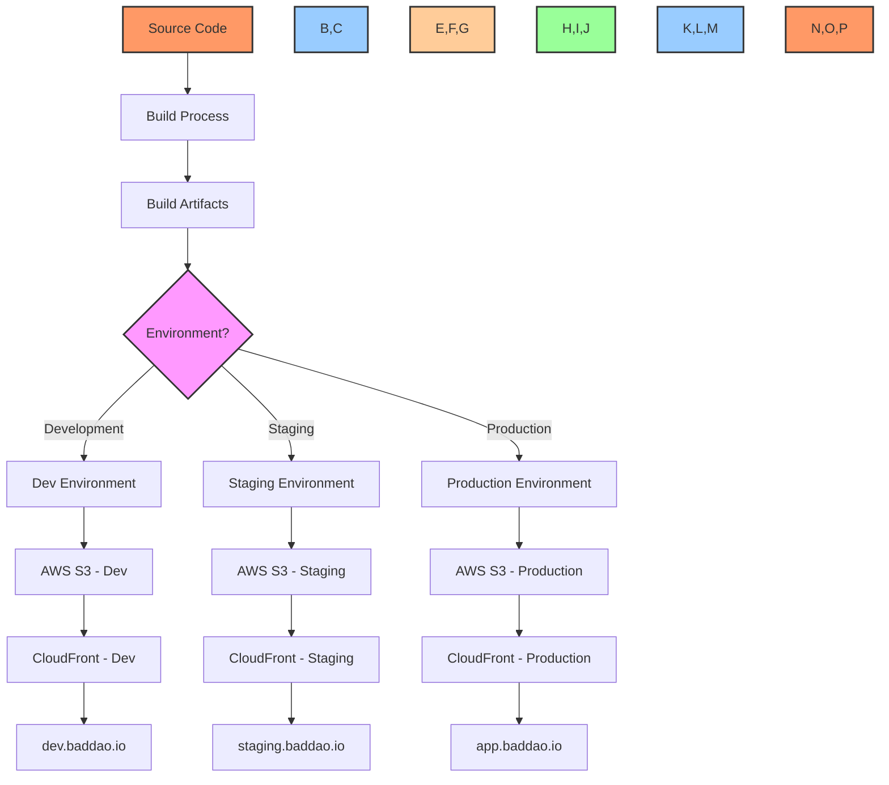
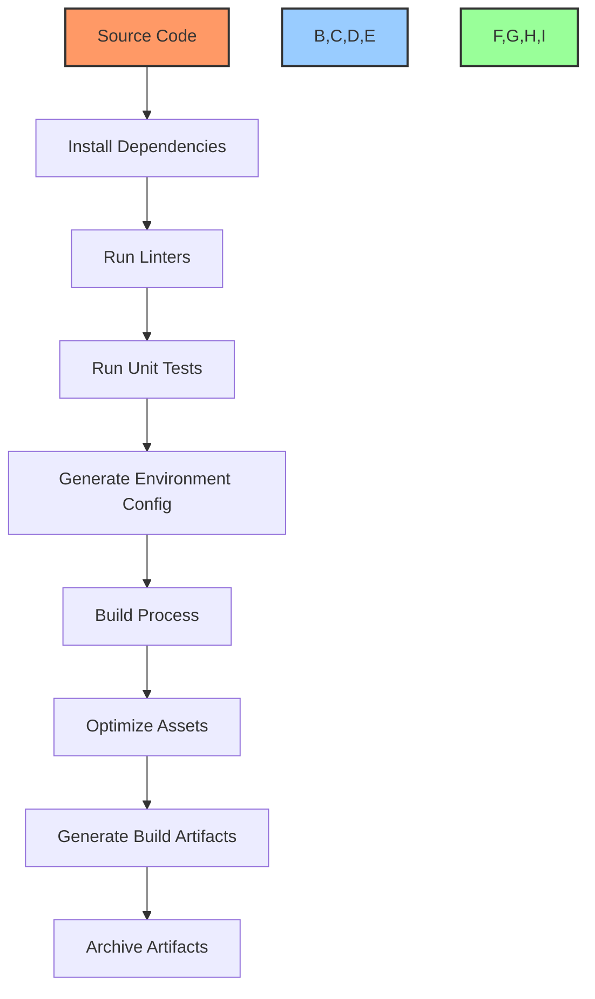
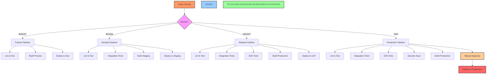
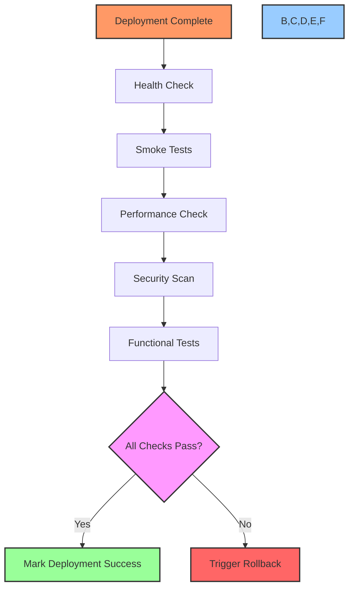
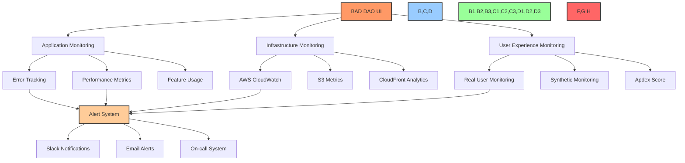

# 🚀 Deployment Procedures & Environments

## 📋 Table of Contents
- [🔍 Overview](#overview)
- [🎯 Purpose](#purpose)
- [🏗️ Deployment Architecture](#deployment-architecture)
- [🌐 Environment Configuration](#environment-configuration)
- [📦 Build Process](#build-process)
- [🔄 CI/CD Pipeline](#cicd-pipeline)
- [📤 Manual Deployment Procedures](#manual-deployment-procedures)
- [🧪 Post-Deployment Verification](#post-deployment-verification)
- [⏪ Rollback Procedures](#rollback-procedures)
- [📊 Monitoring & Alerting](#monitoring--alerting)
- [🛡️ Security Considerations](#security-considerations)
- [📝 Deployment Checklist](#deployment-checklist)

## 🔍 Overview

This document outlines the deployment procedures, environment configurations, and best practices for the BAD DAO UI application. It provides a comprehensive guide for deploying the application across different environments, ensuring consistency, reliability, and security throughout the deployment process.

## 🎯 Purpose

The deployment documentation aims to:
- Define standardized procedures for deploying the application
- Document environment-specific configurations and requirements
- Provide guidelines for build processes and artifacts
- Outline CI/CD pipeline implementation and workflow
- Establish verification and rollback procedures
- Define monitoring and alerting strategies
- Document security considerations for deployments

## 🏗️ Deployment Architecture

The BAD DAO UI follows a modern static web application deployment architecture, utilizing cloud services for hosting and delivery.



### Deployment Components

1. **Source Code Repository**
   - GitHub repository containing application source code
   - Branch structure: `main`, `develop`, `release/*`, `feature/*`

2. **Build Process**
   - Node.js-based build system
   - Webpack for bundling and optimization
   - Environment-specific configurations

3. **Hosting Infrastructure**
   - AWS S3 for static file hosting
   - CloudFront for content delivery
   - Route53 for DNS management
   - Certificate Manager for SSL certificates

4. **CI/CD Pipeline**
   - GitHub Actions for continuous integration
   - Automated testing and validation
   - Environment-specific deployments
   - Post-deployment verification

5. **Blockchain Integration**
   - RPC endpoints specific to each environment
   - Contract addresses configured per environment
   - Environment-specific blockchain parameters

## 🌐 Environment Configuration

The application is deployed across multiple environments, each with specific purposes and configurations.

### Environment Overview

| Environment | Purpose | URL | Access | Update Frequency |
|-------------|---------|-----|--------|------------------|
| Development | Feature testing, integration testing | https://dev.baddao.io | Team only | Continuous |
| Staging | UAT, pre-release testing | https://staging.baddao.io | Team & stakeholders | Weekly/As needed |
| Production | Live application | https://app.baddao.io | Public | Scheduled releases |

### Environment-Specific Configuration

Each environment uses configuration values specific to its purpose, controlled through environment variables and build parameters.

#### Development Environment

```javascript
// .env.development example
REACT_APP_ENVIRONMENT=development
REACT_APP_API_URL=https://api-dev.baddao.io
REACT_APP_BLOCKCHAIN_NETWORK=goerli
REACT_APP_RPC_URL=https://goerli.infura.io/v3/YOUR_KEY
REACT_APP_EXPLORER_URL=https://goerli.etherscan.io
REACT_APP_GOVERNOR_ADDRESS=0x1234...dev
REACT_APP_TOKEN_ADDRESS=0x5678...dev
REACT_APP_FEATURE_FLAGS={"newGovernance":true,"treasuryV2":true}
```

#### Staging Environment

```javascript
// .env.staging example
REACT_APP_ENVIRONMENT=staging
REACT_APP_API_URL=https://api-staging.baddao.io
REACT_APP_BLOCKCHAIN_NETWORK=sepolia
REACT_APP_RPC_URL=https://sepolia.infura.io/v3/YOUR_KEY
REACT_APP_EXPLORER_URL=https://sepolia.etherscan.io
REACT_APP_GOVERNOR_ADDRESS=0x1234...staging
REACT_APP_TOKEN_ADDRESS=0x5678...staging
REACT_APP_FEATURE_FLAGS={"newGovernance":true,"treasuryV2":false}
```

#### Production Environment

```javascript
// .env.production example
REACT_APP_ENVIRONMENT=production
REACT_APP_API_URL=https://api.baddao.io
REACT_APP_BLOCKCHAIN_NETWORK=mainnet
REACT_APP_RPC_URL=https://mainnet.infura.io/v3/YOUR_KEY
REACT_APP_EXPLORER_URL=https://etherscan.io
REACT_APP_GOVERNOR_ADDRESS=0x1234...prod
REACT_APP_TOKEN_ADDRESS=0x5678...prod
REACT_APP_FEATURE_FLAGS={"newGovernance":false,"treasuryV2":false}
```

### Secret Management

Sensitive configuration values (API keys, private endpoints) are managed through AWS Secrets Manager and are not stored in the codebase.

```bash
# Example of fetching secrets during build
aws secretsmanager get-secret-value --secret-id baddao/production/api-keys --query SecretString --output text > .env.production.local
```

## 📦 Build Process

The build process transforms the source code into optimized, deployable artifacts specific to each environment.

### Build Prerequisites

- Node.js v16 or later
- npm v8 or later
- Access to the GitHub repository
- AWS credentials (for deployment)
- Environment-specific configuration files

### Build Steps



### Build Script

```bash
#!/bin/bash
# build.sh - Build script for BAD DAO UI

# Set environment
ENV=${1:-production}
echo "Building for environment: $ENV"

# Install dependencies
npm ci

# Run linters and tests
npm run lint
npm test -- --watchAll=false

# Build application with environment-specific config
npm run build:$ENV

# Optimize assets (images, SVGs)
npm run optimize-assets

# Generate build report
npm run analyze-bundle

# Archive artifacts
TIMESTAMP=$(date +%Y%m%d%H%M%S)
tar -czf build-$ENV-$TIMESTAMP.tar.gz build/

echo "Build completed for $ENV environment"
```

### Build Artifacts

The build process generates the following artifacts:

- **Static Files**: HTML, CSS, JavaScript, and assets
- **Asset Manifest**: JSON file mapping original filenames to hash-versioned filenames
- **Bundle Analysis Report**: Visual representation of bundle sizes and dependencies
- **Build Metadata**: JSON file containing build timestamp, version, and environment

### Environment Injection

Environment-specific values are injected during the build process, resulting in environment-specific builds. Feature flags, API endpoints, and blockchain configurations are embedded in the build.

## 🔄 CI/CD Pipeline

The CI/CD pipeline automates the building, testing, and deployment of the application across environments.

### Pipeline Overview



### GitHub Actions Workflow

```yaml
# .github/workflows/deploy.yml example
name: Build and Deploy

on:
  push:
    branches: [main, develop, 'release/*']
  pull_request:
    branches: [main, develop]

jobs:
  test:
    runs-on: ubuntu-latest
    steps:
      - uses: actions/checkout@v3
      - name: Setup Node.js
        uses: actions/setup-node@v3
        with:
          node-version: '16'
          cache: 'npm'
      - name: Install dependencies
        run: npm ci
      - name: Lint code
        run: npm run lint
      - name: Run tests
        run: npm test -- --watchAll=false --coverage
      - name: Upload coverage
        uses: actions/upload-artifact@v3
        with:
          name: coverage
          path: coverage/

  build-dev:
    if: github.ref != 'refs/heads/main' && github.ref != 'refs/heads/release/*'
    needs: test
    runs-on: ubuntu-latest
    steps:
      - uses: actions/checkout@v3
      - name: Setup Node.js
        uses: actions/setup-node@v3
        with:
          node-version: '16'
          cache: 'npm'
      - name: Install dependencies
        run: npm ci
      - name: Build for development
        run: npm run build:development
      - name: Upload build
        uses: actions/upload-artifact@v3
        with:
          name: build-dev
          path: build/

  deploy-dev:
    if: github.ref == 'refs/heads/develop'
    needs: build-dev
    runs-on: ubuntu-latest
    steps:
      - name: Download build
        uses: actions/download-artifact@v3
        with:
          name: build-dev
          path: build
      - name: Configure AWS credentials
        uses: aws-actions/configure-aws-credentials@v1
        with:
          aws-access-key-id: ${{ secrets.AWS_ACCESS_KEY_ID }}
          aws-secret-access-key: ${{ secrets.AWS_SECRET_ACCESS_KEY }}
          aws-region: us-east-1
      - name: Deploy to S3
        run: aws s3 sync build/ s3://dev-baddao-ui --delete
      - name: Invalidate CloudFront
        run: aws cloudfront create-invalidation --distribution-id ${{ secrets.DEV_CLOUDFRONT_ID }} --paths "/*"

  # Additional jobs for staging and production environments
  # ...
```

### Deployment Triggers

| Environment | Trigger | Approval Required | Notes |
|-------------|---------|-------------------|-------|
| Development | Push to `develop` branch | No | Automatic deployment |
| Staging | Push to `develop` branch | No | Daily deployments |
| UAT | Push to `release/*` branch | Yes | Release manager approval |
| Production | Push to `main` branch | Yes | Multiple approvers required |

## 📤 Manual Deployment Procedures

While CI/CD is the preferred deployment method, manual deployments may be necessary in certain situations.

### Prerequisites for Manual Deployment

- AWS CLI installed and configured
- S3 bucket access permissions
- CloudFront distribution access
- Environment-specific configuration files

### Manual Deployment Steps

1. **Prepare the build**

```bash
# Checkout the appropriate branch
git checkout main  # for production

# Install dependencies
npm ci

# Create production build
npm run build:production
```

2. **Deploy to S3 bucket**

```bash
# Sync build files to S3 bucket
aws s3 sync build/ s3://baddao-ui-production --delete
```

3. **Invalidate CloudFront cache**

```bash
# Create invalidation for the CloudFront distribution
aws cloudfront create-invalidation --distribution-id DISTRIBUTION_ID --paths "/*"
```

4. **Verify deployment**

```bash
# Check the deployed version
curl -s https://app.baddao.io/version.json | jq
```

### Emergency Deployment Procedure

In case of critical issues requiring immediate fixes:

1. **Create a hotfix branch**

```bash
git checkout main
git pull
git checkout -b hotfix/critical-fix
```

2. **Make the necessary changes and test**

```bash
# Make changes...
npm test
```

3. **Build and deploy directly to production**

```bash
npm run build:production
aws s3 sync build/ s3://baddao-ui-production --delete
aws cloudfront create-invalidation --distribution-id PRODUCTION_DISTRIBUTION_ID --paths "/*"
```

4. **Create pull request for the hotfix**

```bash
# After emergency deployment, create PR for proper tracking
git add .
git commit -m "Hotfix: Critical issue description"
git push -u origin hotfix/critical-fix
```

## 🧪 Post-Deployment Verification

After deploying to any environment, verification steps ensure the application is functioning correctly.

### Automated Verification



### Verification Scripts

```bash
#!/bin/bash
# verify-deployment.sh - Post-deployment verification script

ENV=$1
BASE_URL=""

case $ENV in
  development)
    BASE_URL="https://dev.baddao.io"
    ;;
  staging)
    BASE_URL="https://staging.baddao.io"
    ;;
  production)
    BASE_URL="https://app.baddao.io"
    ;;
  *)
    echo "Unknown environment: $ENV"
    exit 1
    ;;
esac

echo "Running verification for $ENV environment: $BASE_URL"

# Run health check
echo "Checking application health..."
HEALTH_STATUS=$(curl -s -o /dev/null -w "%{http_code}" $BASE_URL/health)
if [ "$HEALTH_STATUS" != "200" ]; then
  echo "Health check failed with status code: $HEALTH_STATUS"
  exit 1
fi
echo "Health check passed"

# Run smoke tests
echo "Running smoke tests..."
npm run test:smoke -- --baseUrl=$BASE_URL

# Check performance metrics
echo "Checking performance metrics..."
npm run test:performance -- --url=$BASE_URL

# Check for security issues
echo "Running security scan..."
npm run security-scan -- --target=$BASE_URL

echo "Verification completed successfully"
```

### Manual Verification Checklist

For production deployments, additional manual verification is performed:

1. **Critical Path Testing**
   - Connect wallet functionality
   - Governance proposal listing
   - Voting mechanism
   - Treasury dashboard
   - Token delegation

2. **Cross-browser Testing**
   - Chrome, Firefox, Safari, Edge
   - Mobile browsers (iOS Safari, Chrome for Android)

3. **Feature Verification**
   - New features specific to the release
   - Fixed issues and bugs

4. **Performance Verification**
   - Page load times
   - Transaction responsiveness
   - UI animation smoothness

## ⏪ Rollback Procedures

In case of critical issues, rollback procedures ensure quick recovery to a stable state.

### Automated Rollback

The CI/CD pipeline includes automated rollback capabilities triggered by failed verification:

```yaml
# Excerpt from GitHub Actions workflow
jobs:
  verify-deployment:
    runs-on: ubuntu-latest
    needs: deploy-production
    steps:
      # ... verification steps ...
      - name: Check verification results
        id: check
        run: |
          if [ -f verification-failed ]; then
            echo "::set-output name=rollback::true"
            exit 1
          fi
          
  rollback:
    runs-on: ubuntu-latest
    needs: verify-deployment
    if: failure() && needs.verify-deployment.outputs.rollback == 'true'
    steps:
      - name: Configure AWS credentials
        uses: aws-actions/configure-aws-credentials@v1
        with:
          aws-access-key-id: ${{ secrets.AWS_ACCESS_KEY_ID }}
          aws-secret-access-key: ${{ secrets.AWS_SECRET_ACCESS_KEY }}
          aws-region: us-east-1
      - name: Download previous version
        run: aws s3 cp s3://baddao-backup/production/previous-version.tar.gz ./previous-version.tar.gz
      - name: Extract previous version
        run: tar -xzf previous-version.tar.gz
      - name: Deploy previous version
        run: aws s3 sync previous-version/ s3://baddao-ui-production --delete
      - name: Invalidate CloudFront
        run: aws cloudfront create-invalidation --distribution-id ${{ secrets.PROD_CLOUDFRONT_ID }} --paths "/*"
      - name: Notify rollback
        run: |
          curl -X POST -H 'Content-type: application/json' --data '{"text":"⚠️ ALERT: Production deployment failed, rollback initiated"}' ${{ secrets.SLACK_WEBHOOK_URL }}
```

### Manual Rollback Procedure

For situations where automated rollback fails:

1. **Access the backup artifacts**

```bash
# List available backups
aws s3 ls s3://baddao-backup/production/
```

2. **Download and extract the desired version**

```bash
# Download specific version
aws s3 cp s3://baddao-backup/production/build-production-[TIMESTAMP].tar.gz ./rollback-version.tar.gz

# Extract files
tar -xzf rollback-version.tar.gz
```

3. **Deploy the rollback version**

```bash
# Deploy to S3
aws s3 sync rollback-version/ s3://baddao-ui-production --delete

# Invalidate CloudFront cache
aws cloudfront create-invalidation --distribution-id PRODUCTION_DISTRIBUTION_ID --paths "/*"
```

4. **Verify the rollback**

```bash
# Check deployed version
curl -s https://app.baddao.io/version.json
```

5. **Document the rollback**

```bash
# Create rollback record
echo "Rollback performed at $(date) to version $(cat rollback-version/version.json | jq -r .buildId)" > rollback-record.txt
aws s3 cp rollback-record.txt s3://baddao-backup/production/rollbacks/
```

## 📊 Monitoring & Alerting

Comprehensive monitoring ensures early detection of deployment issues and application problems.

### Monitoring Systems



### Key Metrics

| Category | Metric | Threshold | Alert Severity |
|----------|--------|-----------|----------------|
| Performance | Page Load Time | > 3 seconds | Medium |
| Performance | First Contentful Paint | > 2 seconds | Medium |
| Performance | Time to Interactive | > 5 seconds | High |
| Error | Error Rate | > 1% | High |
| Error | 5xx Responses | > 0 | Critical |
| Infrastructure | S3 Availability | < 99.9% | Critical |
| Infrastructure | CloudFront Error Rate | > 0.1% | High |
| User Experience | Bounce Rate | > 60% | Medium |
| User Experience | Session Duration | < 30 seconds | Low |

### Alert Configurations

```json
// Sample alert configuration
{
  "alerts": [
    {
      "name": "High Error Rate",
      "metric": "error_rate",
      "threshold": 0.01,
      "duration": "5m",
      "severity": "critical",
      "channels": ["slack-dev", "pagerduty"],
      "message": "Error rate exceeded 1% for 5 minutes - Please investigate immediately",
      "runbook": "https://docs.internal/runbooks/high-error-rate"
    },
    {
      "name": "Slow Page Load",
      "metric": "page_load_time_p90",
      "threshold": 3.0,
      "duration": "10m",
      "severity": "medium",
      "channels": ["slack-dev"],
      "message": "Page load time (p90) exceeding 3 seconds for 10 minutes",
      "runbook": "https://docs.internal/runbooks/slow-page-load"
    }
  ]
}
```

### Post-Deployment Monitoring

After each deployment, heightened monitoring is enabled:

- Reduced alert thresholds for the first hour
- Increased metric sampling rate
- Real-time dashboard monitoring
- Automated comparison with pre-deployment baseline

### Error Budget

The system operates with an error budget defining the acceptable level of errors:

- 99.9% availability target
- 0.1% error budget per month
- Budget depletion triggers deployment freeze
- Budget reset at the start of each month

## 🛡️ Security Considerations

Security is integrated into the deployment process to protect the application and infrastructure.

### Security Scanning

Pre-deployment security scans include:

- Static Application Security Testing (SAST)
- Dependency vulnerability scanning
- Infrastructure as Code security analysis
- Secret detection

```yaml
# Security scanning job in CI/CD pipeline
jobs:
  security-scan:
    runs-on: ubuntu-latest
    steps:
      - uses: actions/checkout@v3
      - name: Scan for vulnerabilities
        uses: snyk/actions/node@master
        with:
          args: --severity-threshold=high
        env:
          SNYK_TOKEN: ${{ secrets.SNYK_TOKEN }}
      - name: Check for secrets
        uses: gitleaks/gitleaks-action@v1
        env:
          GITHUB_TOKEN: ${{ secrets.GITHUB_TOKEN }}
      - name: Scan infrastructure
        uses: bridgecrewio/checkov-action@master
        with:
          directory: infrastructure/
```

### Secure Configuration Management

- Environment variables are encrypted at rest
- Secrets are stored in AWS Secrets Manager
- Access to secrets is restricted by IAM roles
- Sensitive values are never logged or exposed

### Infrastructure Security

- S3 buckets configured with appropriate access policies
- CloudFront distributions use HTTPS only
- Web Application Firewall (WAF) protection
- SSL certificates with strong cipher suites

### Secure Deployment Practices

- Least privilege principle for deployment roles
- Multi-factor authentication for production deployments
- Signed commits and code reviews required
- Immutable deployments with versioned artifacts

## 📝 Deployment Checklist

A comprehensive checklist ensures all necessary steps are completed for each deployment.

### Pre-Deployment Checklist

- [ ] All tests passing (unit, integration, E2E)
- [ ] Security scan completed with no critical issues
- [ ] Performance benchmarks meet targets
- [ ] Feature flags configured correctly
- [ ] Documentation updated for new features
- [ ] Accessibility requirements met
- [ ] Proper versioning applied
- [ ] Release notes prepared
- [ ] Required approvals received
- [ ] Deployment window confirmed

### Deployment Execution Checklist

- [ ] Backup current version
- [ ] Build artifacts created successfully
- [ ] Environment configuration verified
- [ ] Database migrations applied (if applicable)
- [ ] Deploy to target environment
- [ ] Cache invalidated
- [ ] Health checks passing
- [ ] Smoke tests passing
- [ ] Monitoring alerts configured

### Post-Deployment Checklist

- [ ] Verify application functionality
- [ ] Check error rates
- [ ] Review performance metrics
- [ ] Confirm feature availability
- [ ] Validate integrations
- [ ] Update status page
- [ ] Notify stakeholders
- [ ] Document deployment
- [ ] Conduct post-deployment review

### Sample Deployment Log

```
DEPLOYMENT LOG: Production v1.5.2
Date: 2025-05-08 15:30 UTC
Deployer: Jane Smith
Build ID: 20250508-153042-main-5a7bc9d

PRE-DEPLOYMENT CHECKS:
✅ Tests: Passed
✅ Security Scan: No critical issues
✅ Performance: Within targets
✅ Approvals: Received from Product, Engineering

DEPLOYMENT STEPS:
✅ Backup: Completed (build-production-20250507.tar.gz)
✅ Build: Successful
✅ Configuration: Verified
✅ Deployment: Completed to s3://baddao-ui-production
✅ Cache: Invalidated (ID: E3X7WQPCOLZVA)

POST-DEPLOYMENT VERIFICATION:
✅ Health Checks: Passing
✅ Smoke Tests: Passing
✅ Error Rate: 0.01% (within normal range)
✅ Performance: Page load 1.8s (p90), improvement of 0.3s
✅ Features: All verified

NOTES:
- New governance voting UI now live
- Minor styling issues in Safari being addressed in next release
- Monitoring increased for next 24 hours

POST-DEPLOYMENT REVIEW:
Scheduled for 2025-05-09 10:00 UTC
```

---

Made with Power, Love, and AI •  ⚡️❤️🤖 •  POWERBRIDGE.AI 