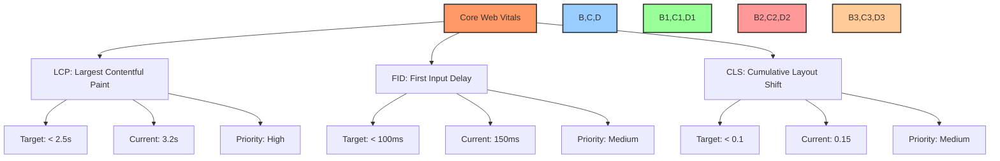
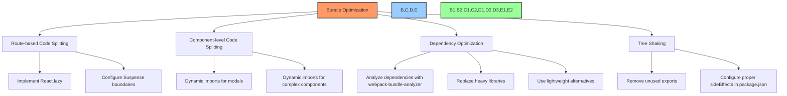
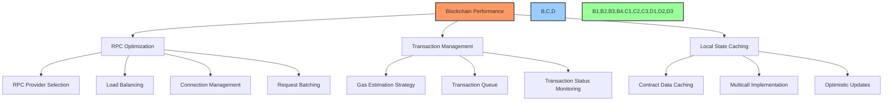
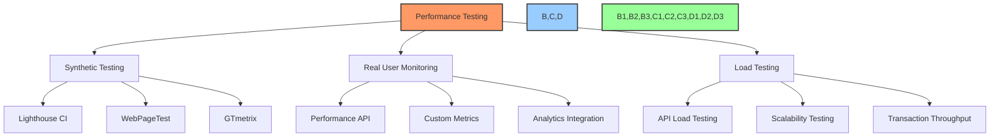

# ⚡ Performance Optimization Strategies

## 📋 Table of Contents
- [🔍 Overview](#overview)
- [🎯 Purpose](#purpose)
- [📊 Performance Metrics](#performance-metrics)
- [🖥️ Frontend Optimizations](#frontend-optimizations)
- [🔄 API & Backend Optimizations](#api--backend-optimizations)
- [⛓️ Blockchain Optimizations](#blockchain-optimizations)
- [📱 Mobile Optimizations](#mobile-optimizations)
- [🧪 Performance Testing](#performance-testing)
- [📈 Monitoring & Analysis](#monitoring--analysis)
- [🚀 Implementation Roadmap](#implementation-roadmap)

## 🔍 Overview

This document outlines the performance optimization strategies for the BAD DAO UI application. It covers optimizations across the frontend, backend, blockchain interactions, and mobile experience, providing a comprehensive approach to delivering a fast, responsive user experience while maintaining functionality.

## 🎯 Purpose

The performance optimization strategies aim to:
- Establish clear performance benchmarks and targets
- Document specific optimization techniques for each system layer
- Provide implementation guidelines for developers
- Define testing methodologies to verify improvements
- Establish monitoring processes to maintain performance
- Prioritize optimizations based on impact and implementation effort

## 📊 Performance Metrics

### Core Web Vitals



### Application-Specific Metrics

| Metric | Description | Target | Current | Priority |
|--------|-------------|--------|---------|----------|
| Initial Load Time | Time to initial render | < 2s | 2.8s | High |
| Time to Interactive | Time until fully interactive | < 3s | 4.1s | High |
| Proposal Load Time | Time to load proposal list | < 1s | 1.7s | High |
| Vote Transaction Time | Time to complete vote transaction | < 15s | 22s | Medium |
| Treasury Dashboard Load | Time to load treasury assets | < 1.5s | 2.3s | High |
| Bundle Size | Total JS bundle size | < 500KB | 780KB | High |
| API Response Time (P95) | 95th percentile API response time | < 300ms | 450ms | High |
| Memory Usage | Peak memory usage | < 100MB | 130MB | Medium |

### Performance Budget

```
JavaScript: 400KB
CSS: 50KB
Fonts: 100KB
Images: 300KB
Total Page Weight: 1MB
API Endpoints: 300ms max response time
Time to Interactive: 3s
```

## 🖥️ Frontend Optimizations

### Code Splitting & Bundle Optimization



#### Implementation Details

```tsx
// Route-based code splitting example
import React, { Suspense, lazy } from 'react';
import { BrowserRouter as Router, Routes, Route } from 'react-router-dom';
import LoadingFallback from './components/LoadingFallback';

// Code-split route components
const HomePage = lazy(() => import('./pages/HomePage'));
const GovernancePage = lazy(() => import('./pages/GovernancePage'));
const TreasuryPage = lazy(() => import('./pages/TreasuryPage'));
const ProposalDetailPage = lazy(() => import('./pages/ProposalDetailPage'));

const App = () => (
  <Router>
    <Suspense fallback={<LoadingFallback />}>
      <Routes>
        <Route path="/" element={<HomePage />} />
        <Route path="/governance" element={<GovernancePage />} />
        <Route path="/treasury" element={<TreasuryPage />} />
        <Route path="/proposals/:id" element={<ProposalDetailPage />} />
      </Routes>
    </Suspense>
  </Router>
);
```

### Rendering Optimizations

1. **Component Memoization**
   - Use `React.memo` for pure functional components
   - Implement proper dependency arrays in `useEffect`, `useMemo`, and `useCallback`
   - Create custom equality functions for complex props

```tsx
// Memoization example
import React, { memo, useCallback, useMemo } from 'react';

interface ProposalCardProps {
  proposal: Proposal;
  onVote: (proposalId: string, vote: VoteType) => void;
}

const ProposalCard = memo(({ proposal, onVote }: ProposalCardProps) => {
  // Memoize derived data
  const formattedDate = useMemo(() => {
    return formatDate(proposal.startDate);
  }, [proposal.startDate]);
  
  // Memoize callbacks
  const handleVote = useCallback((vote: VoteType) => {
    onVote(proposal.id, vote);
  }, [proposal.id, onVote]);
  
  return (
    <div className="proposal-card">
      <h3>{proposal.title}</h3>
      <p>Start Date: {formattedDate}</p>
      {/* Component content */}
      <VoteButtons onVote={handleVote} />
    </div>
  );
}, (prevProps, nextProps) => {
  // Custom equality function
  return prevProps.proposal.id === nextProps.proposal.id && 
         prevProps.proposal.lastUpdated === nextProps.proposal.lastUpdated;
});
```

2. **Virtual Lists**
   - Implement virtualization for long lists (proposals, treasury assets, etc.)
   - Use `react-window` or `react-virtualized` for efficient rendering
   - Configure proper overscan and item size calculations

```tsx
// Virtual list example with react-window
import { FixedSizeList } from 'react-window';
import AutoSizer from 'react-virtualized-auto-sizer';

const ProposalList = ({ proposals }) => (
  <div className="proposal-list-container" style={{ height: '500px' }}>
    <AutoSizer>
      {({ height, width }) => (
        <FixedSizeList
          height={height}
          width={width}
          itemCount={proposals.length}
          itemSize={120} // Height of each item
          overscanCount={5} // Number of items to render beyond visible area
        >
          {({ index, style }) => (
            <div style={style}>
              <ProposalCard proposal={proposals[index]} />
            </div>
          )}
        </FixedSizeList>
      )}
    </AutoSizer>
  </div>
);
```

### Asset Optimization

1. **Image Optimization**
   - Use WebP format with fallbacks
   - Implement responsive images with `srcset`
   - Lazy-load images below the fold
   - Optimize SVGs and icons

2. **Font Optimization**
   - Prefer system fonts where possible
   - Subset custom fonts to only required characters
   - Use font-display: swap
   - Preload critical fonts

```html
<!-- Font optimization example -->
<link rel="preconnect" href="https://fonts.googleapis.com">
<link rel="preconnect" href="https://fonts.gstatic.com" crossorigin>
<link href="https://fonts.googleapis.com/css2?family=Inter:wght@400;500;700&display=swap" rel="stylesheet">
<link rel="preload" href="/fonts/custom-font.woff2" as="font" type="font/woff2" crossorigin>
```

3. **CSS Optimization**
   - Remove unused CSS
   - Critical CSS extraction
   - CSS-in-JS optimizations (if applicable)
   - Minimize CSS specificity

### Network Optimizations

1. **Data Fetching**
   - Implement stale-while-revalidate pattern
   - Data prefetching for likely user journeys
   - Implement response compression
   - Optimize GraphQL queries (if applicable)

```tsx
// SWR data fetching example
import useSWR from 'swr';

const fetcher = (url) => fetch(url).then((res) => res.json());

function ProposalList() {
  const { data, error, isLoading } = useSWR('/api/proposals', fetcher, {
    revalidateOnFocus: false,
    revalidateIfStale: true,
    dedupingInterval: 60000, // 1 minute
  });

  if (isLoading) return <LoadingSkeleton />;
  if (error) return <ErrorMessage />;
  
  return (
    <div className="proposal-list">
      {data.proposals.map(proposal => (
        <ProposalCard key={proposal.id} proposal={proposal} />
      ))}
    </div>
  );
}
```

2. **Caching Strategy**
   - Implement service worker for caching assets
   - Configure appropriate cache headers
   - Local storage for user preferences and non-sensitive data
   - IndexedDB for larger datasets

```tsx
// Service worker registration
if ('serviceWorker' in navigator) {
  window.addEventListener('load', () => {
    navigator.serviceWorker.register('/service-worker.js')
      .then(registration => {
        console.log('ServiceWorker registration successful');
      })
      .catch(error => {
        console.log('ServiceWorker registration failed:', error);
      });
  });
}
```

## 🔄 API & Backend Optimizations

### API Performance

1. **Response Optimization**
   - Implement JSON response compression
   - Use pagination for large datasets
   - Apply field filtering for GraphQL/REST
   - Configure CORS appropriately

```typescript
// Express API response compression
import express from 'express';
import compression from 'compression';
import cors from 'cors';

const app = express();

// Enable GZIP compression
app.use(compression());

// Configure CORS
app.use(cors({
  origin: process.env.FRONTEND_URL,
  methods: ['GET', 'POST', 'PUT', 'DELETE'],
  allowedHeaders: ['Content-Type', 'Authorization']
}));

// Pagination example
app.get('/api/proposals', (req, res) => {
  const page = parseInt(req.query.page) || 1;
  const limit = parseInt(req.query.limit) || 10;
  const skip = (page - 1) * limit;
  
  // Query with pagination
  db.proposals.find()
    .sort({ createdAt: -1 })
    .skip(skip)
    .limit(limit)
    .toArray((err, proposals) => {
      if (err) return res.status(500).json({ error: err.message });
      
      db.proposals.countDocuments({}, (err, total) => {
        res.json({
          proposals,
          meta: {
            page,
            limit,
            total,
            pages: Math.ceil(total / limit)
          }
        });
      });
    });
});
```

2. **Caching Layer**
   - Implement Redis for frequently accessed data
   - Configure proper cache invalidation
   - Cache GraphQL responses
   - Use HTTP caching headers

```typescript
// Redis caching example
import Redis from 'ioredis';

const redis = new Redis({
  host: process.env.REDIS_HOST,
  port: process.env.REDIS_PORT
});

// Middleware for caching API responses
const cacheMiddleware = (duration) => {
  return async (req, res, next) => {
    const cacheKey = `api:${req.originalUrl}`;
    
    try {
      // Check if data exists in cache
      const cachedData = await redis.get(cacheKey);
      if (cachedData) {
        return res.json(JSON.parse(cachedData));
      }
      
      // Store original res.json method
      const originalJson = res.json;
      
      // Override res.json method to cache response
      res.json = function(data) {
        // Cache the API response
        redis.set(cacheKey, JSON.stringify(data), 'EX', duration);
        
        // Call the original method
        return originalJson.call(this, data);
      };
      
      next();
    } catch (err) {
      next();
    }
  };
};

// Apply to routes
app.get('/api/proposals', cacheMiddleware(300), getProposals); // Cache for 5 minutes
```

### Database Optimizations

1. **Query Optimization**
   - Create appropriate indexes
   - Optimize frequent queries
   - Use projections to limit returned fields
   - Monitor and tune slow queries

2. **Connection Pooling**
   - Configure appropriate pool size
   - Monitor connection usage
   - Implement connection timeout handling

```typescript
// MongoDB connection pooling example
import mongoose from 'mongoose';

mongoose.connect(process.env.MONGODB_URI, {
  maxPoolSize: 10,
  minPoolSize: 2,
  serverSelectionTimeoutMS: 5000,
  socketTimeoutMS: 45000,
  connectTimeoutMS: 10000
});

// Handle connection events
mongoose.connection.on('connected', () => {
  console.log('Connected to MongoDB');
});

mongoose.connection.on('error', (err) => {
  console.error('MongoDB connection error:', err);
});
```

## ⛓️ Blockchain Optimizations

### RPC Optimization



1. **Provider Optimization**
   - Use failover RPC providers
   - Implement connection health monitoring
   - Batch read requests when possible

```typescript
// RPC provider optimization with ethers.js
import { ethers } from 'ethers';

// Provider configuration with fallbacks
const providers = [
  new ethers.providers.JsonRpcProvider(process.env.PRIMARY_RPC_URL),
  new ethers.providers.JsonRpcProvider(process.env.SECONDARY_RPC_URL),
  new ethers.providers.JsonRpcProvider(process.env.TERTIARY_RPC_URL)
];

// Create fallback provider
const provider = new ethers.providers.FallbackProvider(
  providers.map((provider, index) => ({
    provider,
    priority: index, // Lower index = higher priority
    stallTimeout: 3000 // Time to wait before considering this provider stalled
  })),
  // Require at least 1 provider to respond
  1
);

// Health check function
async function checkProviderHealth() {
  try {
    const blockNumber = await provider.getBlockNumber();
    console.log(`Current block number: ${blockNumber}`);
    return true;
  } catch (error) {
    console.error('Provider health check failed:', error);
    return false;
  }
}
```

2. **Multicall Implementation**
   - Batch multiple contract read operations
   - Reduce RPC request count
   - Implement retry mechanism

```typescript
// Multicall implementation example
import { Contract } from 'ethers';
import { Interface } from '@ethersproject/abi';
import MulticallAbi from './abis/Multicall.json';

const multicallAddress = '0x1234...'; // Address of Multicall contract

async function multicall(provider, calls) {
  const multicall = new Contract(multicallAddress, MulticallAbi, provider);
  
  // Format calls for multicall
  const callData = calls.map(call => ({
    target: call.contract,
    callData: new Interface(call.abi).encodeFunctionData(call.function, call.params || [])
  }));
  
  // Execute multicall
  const { returnData } = await multicall.aggregate(callData);
  
  // Decode results
  return calls.map((call, i) => {
    const decodedResult = new Interface(call.abi).decodeFunctionResult(
      call.function,
      returnData[i]
    );
    return call.processResult ? call.processResult(decodedResult) : decodedResult;
  });
}

// Usage example
const results = await multicall(provider, [
  {
    contract: governorAddress,
    abi: GovernorAbi,
    function: 'proposals',
    params: [1],
    processResult: result => ({ id: result.id.toString(), ... })
  },
  {
    contract: tokenAddress,
    abi: TokenAbi,
    function: 'balanceOf',
    params: [userAddress],
    processResult: result => result[0].toString()
  }
]);
```

3. **Blockchain Data Caching**
   - Cache contract read results with appropriate TTL
   - Update cache on relevant events
   - Implement stale-while-revalidate for blockchain data

```typescript
// Cache contract reads with SWR
import useSWR from 'swr';
import { useContract } from './hooks/useContract';

function useProposal(proposalId) {
  const governorContract = useContract('Governor');
  
  // Create a unique key for this contract call
  const cacheKey = `governor:proposal:${proposalId}`;
  
  const fetcher = async () => {
    const proposal = await governorContract.proposals(proposalId);
    return {
      id: proposalId,
      title: proposal.title,
      description: proposal.description,
      // Transform contract data to app format
      status: getProposalStatus(proposal.state),
      votes: {
        for: ethers.utils.formatUnits(proposal.forVotes, 18),
        against: ethers.utils.formatUnits(proposal.againstVotes, 18),
        abstain: ethers.utils.formatUnits(proposal.abstainVotes, 18)
      }
    };
  };
  
  const { data: proposal, error, mutate } = useSWR(
    governorContract ? cacheKey : null,
    fetcher,
    {
      refreshInterval: 60000, // Refresh every minute
      dedupingInterval: 15000, // Avoid duplicate requests
      revalidateOnFocus: false,
      revalidateIfStale: true
    }
  );
  
  return {
    proposal,
    isLoading: !error && !proposal,
    isError: error,
    refresh: mutate
  };
}
```

### Transaction Management

1. **Gas Optimization**
   - Implement dynamic gas price estimation
   - Allow user configuration of gas preferences
   - Provide transaction speed options

2. **Transaction Status Tracking**
   - Monitor transaction confirmations
   - Implement receipt polling with backoff
   - Handle transaction replacement

```typescript
// Transaction service
class TransactionService {
  async estimateGas(tx) {
    try {
      // Get current gas price from provider
      const gasPrice = await this.provider.getGasPrice();
      
      // Calculate options for different speed preferences
      return {
        slow: gasPrice.mul(80).div(100), // 80% of current price
        medium: gasPrice,
        fast: gasPrice.mul(120).div(100), // 120% of current price
        rapid: gasPrice.mul(150).div(100) // 150% of current price
      };
    } catch (error) {
      console.error('Gas estimation error:', error);
      throw error;
    }
  }
  
  async sendTransaction(tx, speedPreference = 'medium') {
    try {
      // Estimate gas options
      const gasOptions = await this.estimateGas(tx);
      
      // Set gas price based on preference
      tx.gasPrice = gasOptions[speedPreference];
      
      // Send transaction
      const response = await this.signer.sendTransaction(tx);
      
      // Start monitoring
      this.monitorTransaction(response.hash);
      
      return response;
    } catch (error) {
      console.error('Transaction error:', error);
      throw error;
    }
  }
  
  async monitorTransaction(txHash) {
    let retries = 0;
    const maxRetries = 10;
    
    const checkReceipt = async () => {
      try {
        const receipt = await this.provider.getTransactionReceipt(txHash);
        
        if (receipt) {
          // Transaction confirmed
          this.emit('transactionConfirmed', { txHash, receipt });
          return receipt;
        }
        
        if (retries < maxRetries) {
          retries++;
          // Exponential backoff for polling
          const timeout = Math.min(1000 * 2 ** retries, 60000);
          setTimeout(checkReceipt, timeout);
        } else {
          // Max retries reached
          this.emit('transactionTimeout', { txHash });
        }
      } catch (error) {
        console.error('Receipt check error:', error);
        this.emit('transactionError', { txHash, error });
      }
    };
    
    // Start checking
    checkReceipt();
  }
}
```

## 📱 Mobile Optimizations

### Responsive Design Optimizations

1. **Mobile-First Approach**
   - Design UI components mobile-first
   - Optimize layout for touch interactions
   - Implement responsive typography

2. **Resource Loading**
   - Optimize image loading for mobile
   - Reduce network payload for mobile devices
   - Implement mobile-specific API endpoints

```css
/* Mobile-first CSS example */
.proposal-card {
  /* Base styles (mobile) */
  padding: 1rem;
  margin-bottom: 1rem;
  border-radius: 0.5rem;
  width: 100%;
}

/* Tablet styles */
@media (min-width: 768px) {
  .proposal-card {
    padding: 1.5rem;
    display: flex;
    align-items: center;
  }
}

/* Desktop styles */
@media (min-width: 1024px) {
  .proposal-card {
    padding: 2rem;
    margin-bottom: 1.5rem;
  }
}
```

### Performance Detection & Adaptation

1. **Network Detection**
   - Implement network quality detection
   - Adapt data loading based on connection speed
   - Reduce feature set for slow connections

```typescript
// Network quality detection
function detectNetworkQuality() {
  if (!navigator.connection) {
    return 'unknown';
  }
  
  const connection = navigator.connection;
  
  if (connection.saveData) {
    return 'saveData';
  }
  
  if (connection.effectiveType === 'slow-2g' || connection.effectiveType === '2g') {
    return 'slow';
  }
  
  if (connection.effectiveType === '3g') {
    return 'medium';
  }
  
  return 'fast';
}

// React hook to use network quality
function useNetworkQuality() {
  const [quality, setQuality] = useState(detectNetworkQuality());
  
  useEffect(() => {
    if (!navigator.connection) return;
    
    const handleChange = () => {
      setQuality(detectNetworkQuality());
    };
    
    navigator.connection.addEventListener('change', handleChange);
    return () => {
      navigator.connection.removeEventListener('change', handleChange);
    };
  }, []);
  
  return quality;
}

// Usage example
function DataList() {
  const networkQuality = useNetworkQuality();
  
  // Adapt based on network quality
  const pageSize = networkQuality === 'slow' ? 5 : 
                   networkQuality === 'medium' ? 10 : 20;
  
  // Fetch data with appropriate page size
  const { data } = useSWR(`/api/data?limit=${pageSize}`, fetcher);
  
  return (
    <div>
      {networkQuality === 'slow' && (
        <Banner>You're on a slow connection. Some features may be limited.</Banner>
      )}
      <List data={data} />
    </div>
  );
}
```

2. **Device Capability Adaptation**
   - Detect device capabilities
   - Optimize UI rendering for device performance
   - Reduce animations for low-end devices

```typescript
// Device performance detection
function detectDevicePerformance() {
  // Check if device has limited memory
  const hasLimitedMemory = navigator.deviceMemory && navigator.deviceMemory < 4;
  
  // Check if device has limited CPU
  const hasLimitedCPU = navigator.hardwareConcurrency && navigator.hardwareConcurrency < 4;
  
  // Check if device is in battery saving mode
  const isBatterySaving = navigator.getBattery && 
                           navigator.getBattery().then(battery => battery.saving);
  
  if (hasLimitedMemory && hasLimitedCPU) {
    return 'low';
  } else if (hasLimitedMemory || hasLimitedCPU) {
    return 'medium';
  } else {
    return 'high';
  }
}

// Apply performance optimizations based on device capabilities
function applyPerformanceOptimizations() {
  const performance = detectDevicePerformance();
  
  if (performance === 'low') {
    // Disable animations
    document.body.classList.add('reduce-animations');
    
    // Use simplified components
    window.APP_CONFIG.useSimplifiedUI = true;
    
    // Reduce data fetching
    window.APP_CONFIG.dataRefreshInterval = 60000; // 1 minute
  } else if (performance === 'medium') {
    // Reduce animations
    document.body.classList.add('reduce-motion');
    
    // Standard refresh rate
    window.APP_CONFIG.dataRefreshInterval = 30000; // 30 seconds
  } else {
    // Full experience
    window.APP_CONFIG.dataRefreshInterval = 15000; // 15 seconds
  }
}
```

## 🧪 Performance Testing

### Testing Methodology



1. **Automated Performance Testing**
   - Implement Lighthouse CI in CI/CD pipeline
   - Set performance budgets
   - Automated bundle size monitoring

```yaml
# Lighthouse CI configuration
name: Performance Testing

on:
  pull_request:
    branches: [ main, develop ]

jobs:
  lighthouse:
    runs-on: ubuntu-latest
    steps:
      - uses: actions/checkout@v2
      - name: Setup Node
        uses: actions/setup-node@v2
        with:
          node-version: '16'
      - name: Install dependencies
        run: npm ci
      - name: Build project
        run: npm run build
      - name: Run Lighthouse CI
        uses: treosh/lighthouse-ci-action@v8
        with:
          urls: |
            https://staging.baddao.io/
            https://staging.baddao.io/governance
            https://staging.baddao.io/treasury
          budgetPath: ./lighthouse-budget.json
          uploadArtifacts: true
          temporaryPublicStorage: true
```

2. **Custom Performance Metrics**
   - Track application-specific metrics
   - Implement Web Vitals tracking
   - Create performance dashboard

```typescript
// Custom performance metrics tracking
import { getLCP, getFID, getCLS } from 'web-vitals';

function sendToAnalytics(metric) {
  // Send metric to analytics
  const body = {
    name: metric.name,
    value: metric.value,
    id: metric.id,
    delta: metric.delta,
    page: window.location.pathname
  };
  
  navigator.sendBeacon('/api/analytics/vitals', JSON.stringify(body));
}

// Track core web vitals
getLCP(sendToAnalytics);
getFID(sendToAnalytics);
getCLS(sendToAnalytics);

// Track custom metrics
function trackAppSpecificMetrics() {
  // Track time to load proposals
  performance.mark('proposals-start');
  
  loadProposals().then(() => {
    performance.mark('proposals-end');
    performance.measure('proposals-load', 'proposals-start', 'proposals-end');
    
    const proposalsLoadMetric = performance.getEntriesByName('proposals-load')[0];
    sendToAnalytics({
      name: 'proposals-load',
      value: proposalsLoadMetric.duration,
      id: generateUniqueId()
    });
  });
}
```

## 📈 Monitoring & Analysis

### Performance Monitoring

1. **Real User Monitoring (RUM)**
   - Implement client-side performance tracking
   - Track key user interactions
   - Monitor by device type, geography, network

2. **Error Tracking Integration**
   - Track JavaScript errors and exceptions
   - Correlate errors with performance issues
   - Monitor API failures

```typescript
// Error tracking with performance context
class ErrorMonitor {
  captureError(error, context = {}) {
    // Add performance metrics to error context
    const performanceContext = {
      ...context,
      performanceMetrics: {
        LCP: this.getLatestMetric('LCP'),
        FID: this.getLatestMetric('FID'),
        CLS: this.getLatestMetric('CLS'),
        memory: performance.memory ? {
          usedJSHeapSize: performance.memory.usedJSHeapSize,
          totalJSHeapSize: performance.memory.totalJSHeapSize
        } : null,
        navigation: performance.getEntriesByType('navigation')[0] ? {
          loadTime: performance.getEntriesByType('navigation')[0].loadEventEnd,
          domContentLoaded: performance.getEntriesByType('navigation')[0].domContentLoadedEventEnd
        } : null
      }
    };
    
    // Send error with context to monitoring service
    this.sendToMonitoringService(error, performanceContext);
  }
  
  getLatestMetric(name) {
    const entries = performance.getEntriesByName(`web-vital-${name}`);
    return entries.length ? entries[entries.length - 1].value : null;
  }
  
  sendToMonitoringService(error, context) {
    // Implementation for sending to monitoring service
    console.log('Captured error with context:', error, context);
  }
}
```

3. **Performance Dashboard**
   - Create unified performance dashboard
   - Track trends over time
   - Set alerts for performance regressions

## 🚀 Implementation Roadmap

### Phase 1: Analysis & Quick Wins

| Optimization | Impact | Effort | Status |
|--------------|--------|--------|--------|
| Bundle Analysis | Medium | Low | 🟢 Completed |
| Image Optimization | High | Low | 🟢 Completed |
| Code Splitting | High | Medium | 🟡 In Progress |
| Performance Monitoring Setup | Medium | Medium | 🟡 In Progress |
| Lazy Loading Components | Medium | Low | 🔴 Not Started |

### Phase 2: Frontend Optimizations

| Optimization | Impact | Effort | Status |
|--------------|--------|--------|--------|
| Component Memoization | Medium | Medium | 🔴 Not Started |
| Virtual Lists | High | Medium | 🔴 Not Started |
| Service Worker Implementation | Medium | High | 🔴 Not Started |
| CSS Optimization | Medium | Medium | 🔴 Not Started |
| Font Optimization | Low | Low | 🔴 Not Started |

### Phase 3: API & Blockchain Optimizations

| Optimization | Impact | Effort | Status |
|--------------|--------|--------|--------|
| API Response Optimization | High | Medium | 🔴 Not Started |
| Caching Layer Implementation | High | High | 🔴 Not Started |
| Multicall Implementation | High | Medium | 🔴 Not Started |
| RPC Provider Optimization | Medium | Medium | 🔴 Not Started |
| Transaction Management | Medium | High | 🔴 Not Started |

### Phase 4: Mobile & Testing

| Optimization | Impact | Effort | Status |
|--------------|--------|--------|--------|
| Mobile-Specific Optimizations | High | Medium | 🔴 Not Started |
| Network/Device Adaptation | Medium | Medium | 🔴 Not Started |
| Automated Performance Testing | Medium | Medium | 🔴 Not Started |
| Performance Regression Alerts | Medium | Low | 🔴 Not Started |
| Final Performance Audit | High | Medium | 🔴 Not Started |

---

Made with Power, Love, and AI •  ⚡️❤️🤖 •  POWERBRIDGE.AI 