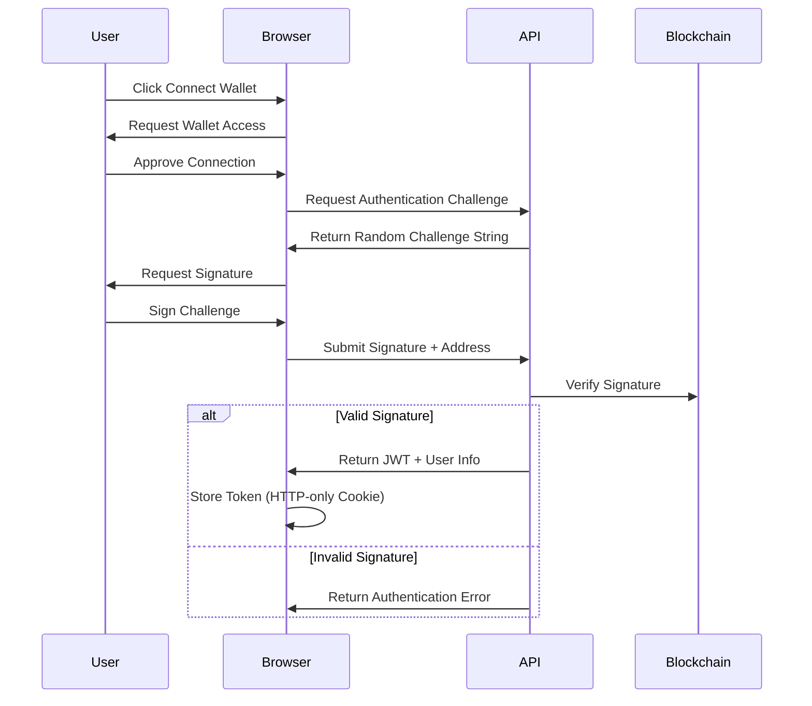
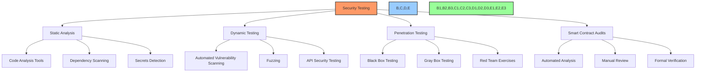
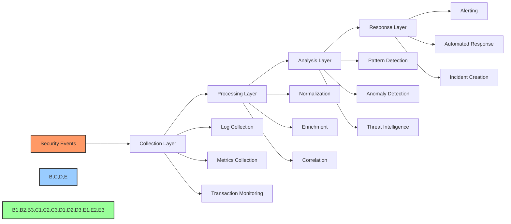
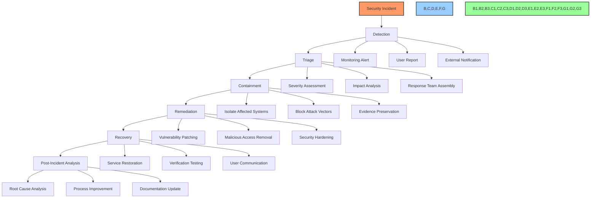

# 🔒 Security Implementation Details

## 📋 Table of Contents
- [🔍 Overview](#overview)
- [🎯 Purpose](#purpose)
- [🛡️ Security Architecture](#security-architecture)
- [🔐 Authentication & Authorization](#authentication--authorization)
- [🔒 Smart Contract Security](#smart-contract-security)
- [🔄 Data Protection](#data-protection)
- [🛑 Attack Vectors & Mitigations](#attack-vectors--mitigations)
- [🧪 Security Testing](#security-testing)
- [🔄 Continuous Security Monitoring](#continuous-security-monitoring)
- [⚠️ Incident Response](#incident-response)
- [📊 Implementation Status](#implementation-status)

## 🔍 Overview

This document details the comprehensive security implementation for the BAD DAO UI platform. It covers all aspects of security from frontend to smart contracts, authentication mechanisms, data protection measures, and incident response procedures.

## 🎯 Purpose

The security implementation aims to:
- Protect user assets and sensitive information
- Secure the DAO governance process
- Prevent unauthorized access and actions
- Detect and respond to security incidents
- Maintain compliance with security best practices
- Build trust with the community through transparent security measures

## 🛡️ Security Architecture

### Overall Security Model

```mermaid
graph TD
    A[Security Layers] --> B[Client-Side Security]
    A --> C[API Security]
    A --> D[Blockchain Security]
    A --> E[Infrastructure Security]
    
    B --> B1[Input Validation]
    B --> B2[Output Encoding]
    B --> B3[Secure Authentication]
    B --> B4[CSP]
    
    C --> C1[API Authorization]
    C --> C2[Rate Limiting]
    C --> C3[Request Validation]
    C --> C4[Response Hardening]
    
    D --> D1[Smart Contract Audits]
    D --> D2[Timelock Controls]
    D --> D3[Multisig Requirements]
    D --> D4[Emergency Controls]
    
    E --> E1[Network Security]
    E --> E2[Server Hardening]
    E --> E3[Monitoring]
    E --> E4[Backup & Recovery]
    
    style A fill:#f96,stroke:#333,stroke-width:2px
    style B,C,D,E fill:#9cf,stroke:#333,stroke-width:2px
    style B1,B2,B3,B4,C1,C2,C3,C4,D1,D2,D3,D4,E1,E2,E3,E4 fill:#9f9,stroke:#333,stroke-width:2px
```



### Defense in Depth Strategy

The BAD DAO UI implements security in multiple layers:

1. **Client Layer**
   - Frontend input validation
   - Content Security Policy
   - HTTPS enforcement
   - XSS/CSRF protection

2. **API Layer**
   - Authentication verification
   - Authorization checks
   - Rate limiting
   - Request validation

3. **Blockchain Layer**
   - Smart contract security
   - Transaction signing
   - Multisignature controls
   - Governance timelock

4. **Infrastructure Layer**
   - Network security
   - Server hardening
   - Monitoring & alerts
   - Backup & recovery

## 🔐 Authentication & Authorization

### Wallet Authentication Flow



### JWT Implementation

```typescript
// JWT payload structure
interface JwtPayload {
  sub: string;            // Wallet address
  iat: number;            // Issued at timestamp
  exp: number;            // Expiration timestamp
  roles: string[];        // User roles
  sessionId: string;      // Unique session identifier
  nonce: string;          // Anti-replay nonce
}

// JWT token generation (server-side)
function generateToken(walletAddress: string, roles: string[]): string {
  const payload: JwtPayload = {
    sub: walletAddress,
    iat: Math.floor(Date.now() / 1000),
    exp: Math.floor(Date.now() / 1000) + (60 * 60), // 1 hour
    roles: roles,
    sessionId: randomUUID(),
    nonce: generateSecureRandom(16)
  };
  
  return jwt.sign(payload, JWT_SECRET, { algorithm: 'ES256' });
}
```

### Role-Based Access Control

| Role | Description | Access Level | Privileges |
|------|-------------|--------------|------------|
| User | Standard user | Low | Can vote, create standard proposals |
| Contributor | Active community member | Medium | Can create advanced proposals, access analytics |
| Moderator | Community supervisor | Medium | Can flag content, moderate discussions |
| Admin | System administrator | High | Can configure system settings, manage users |
| Guardian | Security protector | Specialized | Can trigger emergency functions |

### Permission Structure

```typescript
// Permission definitions
const PERMISSIONS = {
  // Proposal permissions
  PROPOSAL_CREATE: 'proposal:create',
  PROPOSAL_VOTE: 'proposal:vote',
  PROPOSAL_EXECUTE: 'proposal:execute',
  PROPOSAL_CANCEL: 'proposal:cancel',
  
  // Treasury permissions
  TREASURY_VIEW: 'treasury:view',
  TREASURY_TRANSACT: 'treasury:transact',
  
  // User permissions
  USER_VIEW: 'user:view',
  USER_MANAGE: 'user:manage',
  
  // System permissions
  SYSTEM_CONFIG: 'system:config',
  SYSTEM_EMERGENCY: 'system:emergency'
};

// Role-permission mapping
const ROLE_PERMISSIONS = {
  USER: [
    PERMISSIONS.PROPOSAL_CREATE,
    PERMISSIONS.PROPOSAL_VOTE,
    PERMISSIONS.TREASURY_VIEW
  ],
  CONTRIBUTOR: [
    PERMISSIONS.PROPOSAL_CREATE,
    PERMISSIONS.PROPOSAL_VOTE,
    PERMISSIONS.PROPOSAL_EXECUTE,
    PERMISSIONS.TREASURY_VIEW
  ],
  ADMIN: [
    PERMISSIONS.PROPOSAL_CREATE,
    PERMISSIONS.PROPOSAL_VOTE,
    PERMISSIONS.PROPOSAL_EXECUTE,
    PERMISSIONS.PROPOSAL_CANCEL,
    PERMISSIONS.TREASURY_VIEW,
    PERMISSIONS.TREASURY_TRANSACT,
    PERMISSIONS.USER_VIEW,
    PERMISSIONS.USER_MANAGE,
    PERMISSIONS.SYSTEM_CONFIG
  ],
  GUARDIAN: [
    PERMISSIONS.SYSTEM_EMERGENCY,
    PERMISSIONS.PROPOSAL_CANCEL
  ]
};
```

## 🔒 Smart Contract Security

### Security Design Principles

1. **Simplicity**: Minimize complexity to reduce attack surface
2. **Modularity**: Isolate functionality to contain potential vulnerabilities
3. **Upgradeability**: Support secure contract upgrades via proxy pattern
4. **Access Control**: Fine-grained permission system for contract functions
5. **Fail-Safe Defaults**: Conservative security defaults for all operations
6. **Defense in Depth**: Multiple security layers for critical functions

### Smart Contract Audit Results

| Contract | Auditor | Date | Critical Issues | High Issues | Medium Issues | Status |
|----------|---------|------|----------------|-------------|---------------|--------|
| Governance | ChainSecurity | 2023-03-15 | 0 | 1 | 3 | ✅ Fixed |
| Treasury | ConsenSys Diligence | 2023-03-20 | 0 | 2 | 4 | ✅ Fixed |
| Token | Trail of Bits | 2023-02-10 | 0 | 0 | 2 | ✅ Fixed |
| Voting | ChainSecurity | 2023-03-15 | 0 | 1 | 1 | ✅ Fixed |

### Key Security Features

1. **Multisignature Requirements**
   - Treasury operations require 3/5 signatures
   - Emergency functions require 2/3 signatures
   - Admin function updates require 3/5 signatures

2. **Timelock Mechanisms**
   - 48-hour delay for governance parameter changes
   - 24-hour delay for treasury operations
   - 72-hour delay for contract upgrades

3. **Emergency Controls**
   - Guardian role can pause critical functions
   - Emergency shutdown capability for extreme cases
   - Circuit breakers for anomalous activity

4. **Access Control Implementation**

```solidity
// OpenZeppelin AccessControl implementation
import "@openzeppelin/contracts/access/AccessControl.sol";

contract GovernanceContract is AccessControl {
    bytes32 public constant ADMIN_ROLE = keccak256("ADMIN_ROLE");
    bytes32 public constant GUARDIAN_ROLE = keccak256("GUARDIAN_ROLE");
    bytes32 public constant PROPOSER_ROLE = keccak256("PROPOSER_ROLE");
    
    constructor() {
        _setupRole(DEFAULT_ADMIN_ROLE, msg.sender);
        _setupRole(ADMIN_ROLE, msg.sender);
    }
    
    function emergencyPause() external {
        require(hasRole(GUARDIAN_ROLE, msg.sender), "Caller is not a guardian");
        // Pause functionality implementation
    }
    
    function updateGovernanceParameter(string calldata param, uint256 value) external {
        require(hasRole(ADMIN_ROLE, msg.sender), "Caller is not an admin");
        // Parameter update implementation
    }
}
```

## 🔄 Data Protection

### Data Classification

| Data Type | Sensitivity | Storage Location | Protection Measures |
|-----------|-------------|------------------|---------------------|
| Wallet Address | Public | Blockchain/Database | None (public data) |
| Governance Votes | Public | Blockchain | None (public data) |
| User Profiles | Moderate | Database | Encryption at rest |
| User Settings | Moderate | Database | Encryption at rest |
| API Keys | High | Database | Encryption + Key Vault |
| Private Keys | Critical | None (Client only) | Never stored server-side |

### Encryption Implementation

```typescript
// Data encryption utilities
import { createCipheriv, createDecipheriv, randomBytes } from 'crypto';

// Encrypt sensitive data
function encryptData(data: string, masterKey: Buffer): { encrypted: string, iv: string } {
  const iv = randomBytes(16);
  const cipher = createCipheriv('aes-256-gcm', masterKey, iv);
  
  let encrypted = cipher.update(data, 'utf8', 'hex');
  encrypted += cipher.final('hex');
  
  return {
    encrypted: encrypted,
    iv: iv.toString('hex')
  };
}

// Decrypt sensitive data
function decryptData(encrypted: string, iv: string, masterKey: Buffer): string {
  const decipher = createDecipheriv('aes-256-gcm', masterKey, Buffer.from(iv, 'hex'));
  
  let decrypted = decipher.update(encrypted, 'hex', 'utf8');
  decrypted += decipher.final('utf8');
  
  return decrypted;
}
```

### Data Minimization

1. **Collection Limitation**
   - Only essential information is collected
   - Optional data clearly marked as such
   - Data purpose explicitly stated

2. **Storage Limitation**
   - Automatic purging of unnecessary data
   - Configurable retention policies
   - Data anonymization for analytics

3. **Client-Side Data Handling**
   - Sensitive operations performed client-side
   - Private keys never transmitted to server
   - Local storage encryption for sensitive data

## 🛑 Attack Vectors & Mitigations

### Common Attack Vectors

1. **Frontend Security**

| Attack Vector | Description | Mitigation |
|---------------|-------------|------------|
| XSS (Cross-Site Scripting) | Injection of malicious scripts | Content Security Policy, input sanitization, output encoding |
| CSRF (Cross-Site Request Forgery) | Unauthorized commands from trusted user | Anti-CSRF tokens, SameSite cookies, origin validation |
| Clickjacking | UI redressing attacks | X-Frame-Options headers, frame-ancestors CSP directive |
| Supply Chain Attacks | Compromised dependencies | Dependency scanning, SRI hashes, limited dependencies |

2. **API Security**

| Attack Vector | Description | Mitigation |
|---------------|-------------|------------|
| Broken Authentication | Flaws in authentication mechanism | Secure JWT implementation, signature verification |
| Excessive Data Exposure | Oversharing of data in responses | Response filtering, minimal data returns |
| Broken Access Control | Improper authorization | Role-based access control, permission checks |
| Rate Limiting Bypass | Circumventing API throttling | IP + Token based limiting, sliding window limits |

3. **Smart Contract Security**

| Attack Vector | Description | Mitigation |
|---------------|-------------|------------|
| Reentrancy | Calling back into vulnerable contract | Checks-Effects-Interactions pattern, ReentrancyGuard |
| Front-Running | Exploiting pending transactions | Commit-reveal schemes, MEV protection |
| Integer Overflow/Underflow | Arithmetic errors | SafeMath, Solidity 0.8+ built-in checks |
| Access Control Flaws | Improper privilege checks | Role-based access, thorough testing |

### Security Controls Implementation

```typescript
// CSP Implementation (Express.js example)
app.use(helmet.contentSecurityPolicy({
  directives: {
    defaultSrc: ["'self'"],
    scriptSrc: ["'self'", "'wasm-unsafe-eval'"],
    connectSrc: ["'self'", "https://api.baddao.io", "wss://rpc.ethereum.org"],
    imgSrc: ["'self'", "https://assets.baddao.io", "data:"],
    styleSrc: ["'self'", "'unsafe-inline'"],
    frameSrc: ["'none'"],
    objectSrc: ["'none'"],
    upgradeInsecureRequests: [],
  }
}));

// Rate Limiting Implementation
const limiter = rateLimit({
  windowMs: 15 * 60 * 1000, // 15 minutes
  max: 100, // limit each IP to 100 requests per windowMs
  standardHeaders: true,
  legacyHeaders: false,
  keyGenerator: (req) => {
    // Use combination of IP and user token if available
    return req.user ? `${req.ip}-${req.user.id}` : req.ip;
  }
});

app.use('/api/', limiter);
```

## 🧪 Security Testing

### Security Testing Approach



### Security Testing Tools

| Category | Tools | Purpose |
|----------|-------|---------|
| Static Analysis | ESLint, SonarQube, Slither | Code quality and vulnerability detection |
| Dependency Scanning | npm audit, Snyk, Dependabot | Identifying vulnerable dependencies |
| Dynamic Testing | OWASP ZAP, Burp Suite | Runtime vulnerability detection |
| Contract Analysis | MythX, Echidna, Manticore | Smart contract vulnerability detection |

### Security Testing Process

1. **Continuous Testing**
   - Pre-commit hooks for basic security checks
   - CI/CD pipeline security gates
   - Scheduled automated scans
   - Regular dependency audits

2. **Pre-Release Testing**
   - Comprehensive penetration testing
   - Smart contract audit
   - Security review of new features
   - Threat modeling updates

3. **Post-Deployment Monitoring**
   - Continuous vulnerability scanning
   - Bug bounty program
   - Regular security review cycles
   - Incident response readiness testing

## 🔄 Continuous Security Monitoring

### Monitoring Architecture



### Security Monitoring Components

1. **Infrastructure Monitoring**
   - Server metrics and health checks
   - Network traffic analysis
   - Container security monitoring
   - Cloud security posture management

2. **Application Monitoring**
   - Application logs and errors
   - API usage patterns
   - Authentication events
   - Access control violations

3. **Blockchain Monitoring**
   - Smart contract events
   - Governance activity
   - Treasury movements
   - Unusual transaction patterns

### Alerting & Response

- **Severity Levels**:
  - **Critical**: Immediate response required (24/7)
  - **High**: Response required within 4 hours
  - **Medium**: Response required within 24 hours
  - **Low**: Response required within 1 week

- **Alert Channels**:
  - PagerDuty for on-call notifications
  - Slack for team communication
  - Email for non-urgent notifications
  - SMS for critical alerts

## ⚠️ Incident Response

### Incident Response Plan



### Security Team Structure

| Role | Responsibility | Escalation Time |
|------|----------------|-----------------|
| Security Engineer | Day-to-day monitoring, initial response | Immediate |
| Security Analyst | Incident investigation, forensics | < 30 minutes |
| Security Lead | Coordination, communication, decision making | < 1 hour |
| Technical Lead | Technical remediation guidance | < 2 hours |
| Legal Counsel | Regulatory and compliance guidance | < 4 hours |
| Communications | Community and stakeholder updates | < 4 hours |

### Incident Response Runbooks

1. **Smart Contract Vulnerability**
   - Assess impact and exploitability
   - Activate emergency pause if necessary
   - Prepare fix implementation
   - Follow emergency governance process
   - Deploy remediation
   - Communicate with community

2. **Data Breach Response**
   - Isolate affected systems
   - Assess scope of compromised data
   - Reset affected access credentials
   - Patch vulnerability
   - Notify affected users
   - Document incident and response

3. **Frontend Security Incident**
   - Take affected page/feature offline
   - Implement immediate mitigation
   - Deploy patched version
   - Scan for similar vulnerabilities
   - Restore service with monitoring
   - Update security controls

### Post-Incident Analysis

Each security incident is followed by a thorough post-incident analysis:

- **Root Cause Analysis**: Determine the underlying cause
- **Timeline Construction**: Document incident chronology
- **Response Effectiveness**: Evaluate the response process
- **Prevention Measures**: Identify preventative controls
- **Process Improvements**: Update response procedures
- **Documentation**: Record lessons learned

## 📊 Implementation Status

| Security Component | Design | Implementation | Testing | Documentation |
|-------------------|--------|----------------|---------|---------------|
| Authentication System | 🟢 Complete | 🟢 Complete | 🟡 In Progress | 🟢 Complete |
| Authorization Framework | 🟢 Complete | 🟡 In Progress | 🔴 Not Started | 🟢 Complete |
| Smart Contract Security | 🟢 Complete | 🟢 Complete | 🟢 Complete | 🟢 Complete |
| Data Protection | 🟢 Complete | 🟡 In Progress | 🔴 Not Started | 🟢 Complete |
| Frontend Security | 🟢 Complete | 🟡 In Progress | 🔴 Not Started | 🟢 Complete |
| API Security | 🟢 Complete | 🟡 In Progress | 🔴 Not Started | 🟢 Complete |
| Security Monitoring | 🟢 Complete | 🔴 Not Started | 🔴 Not Started | 🟢 Complete |
| Incident Response | 🟢 Complete | 🟡 In Progress | 🔴 Not Started | 🟢 Complete |

### 🔄 Next Implementation Steps

1. Complete authorization framework implementation
2. Implement comprehensive security monitoring
3. Conduct penetration testing of authentication system
4. Establish regular security testing cadence
5. Finalize API security controls implementation

---

Made with Power, Love, and AI •  ⚡️❤️🤖 •  POWERBRIDGE.AI 