# 🧪 Test Cases & Scenarios

## 📋 Table of Contents
- [🔍 Overview](#overview)
- [🎯 Purpose](#purpose)
- [🧩 Test Case Categories](#test-case-categories)
- [👤 Authentication & User Management](#authentication--user-management)
- [🗳️ Governance & Proposals](#governance--proposals)
- [💰 Treasury Management](#treasury-management)
- [🪙 Token Operations](#token-operations)
- [⚙️ System Configuration](#system-configuration)
- [📱 Responsive Design](#responsive-design)
- [🔄 Integration Test Scenarios](#integration-test-scenarios)
- [🔍 Regression Test Suite](#regression-test-suite)

## 🔍 Overview

This document provides detailed test cases and scenarios for the BAD DAO UI application. It serves as a comprehensive guide for manual and automated testing across all core functionality areas, ensuring thorough test coverage and consistent quality.

## 🎯 Purpose

The test cases document aims to:
- Define specific test scenarios for all key features
- Provide clear steps and expected results for each test case
- Support both manual and automated testing efforts
- Ensure consistent testing coverage across releases
- Serve as a basis for regression testing
- Provide traceability between requirements and testing

## 🧩 Test Case Categories



```mermaid
graph TD
    A[Test Case Categories] --> B[Functional Tests]
    A --> C[Non-Functional Tests]
    A --> D[Integration Tests]
    A --> E[Regression Tests]
    
    B --> B1[Authentication]
    B --> B2[Governance]
    B --> B3[Treasury]
    B --> B4[Token Operations]
    B --> B5[System Configuration]
    
    C --> C1[Performance]
    C --> C2[Usability]
    C --> C3[Accessibility]
    C --> C4[Responsive Design]
    
    D --> D1[API Integration]
    D --> D2[Smart Contract Integration]
    D --> D3[External Service Integration]
    
    E --> E1[Smoke Tests]
    E --> E2[Critical Path Tests]
    E --> E3[Core Functionality Tests]
    
    style A fill:#f96,stroke:#333,stroke-width:2px
    style B,C,D,E fill:#9cf,stroke:#333,stroke-width:2px
    style B1,B2,B3,B4,B5,C1,C2,C3,C4,D1,D2,D3,E1,E2,E3 fill:#9f9,stroke:#333,stroke-width:2px
```

### Test Case Identifier System

Each test case follows a specific identification pattern:

```
[Category Prefix]-[Feature Area]-[Sequential Number]
```

| Category | Prefix | Example |
|----------|--------|---------|
| Authentication | AUTH | AUTH-CONN-001 |
| Governance | GOV | GOV-PROP-003 |
| Treasury | TREAS | TREAS-ASSET-002 |
| Token | TOK | TOK-DLGT-004 |
| System | SYS | SYS-CONFIG-001 |
| Responsive | RESP | RESP-MOBILE-002 |
| Integration | INT | INT-API-001 |
| Regression | REG | REG-CORE-005 |

## 👤 Authentication & User Management

### AUTH-CONN-001: Wallet Connection - Successful Connection

**Priority:** High  
**Type:** Functional  
**Automation Status:** Automated

**Preconditions:**
- User has a supported wallet installed (MetaMask, WalletConnect)
- User is not currently connected

**Test Steps:**
1. Navigate to the BAD DAO homepage
2. Click the "Connect Wallet" button in the header
3. Select a wallet from the connection modal
4. Approve the connection request in the wallet

**Expected Results:**
- Connection modal closes
- Wallet address is displayed in the header
- User profile shows connected status
- Connection event is logged
- Local storage updated with connection information

**Test Data:**
- Test wallet with ETH balance

---

### AUTH-CONN-002: Wallet Connection - Wallet Not Installed

**Priority:** Medium  
**Type:** Error Handling  
**Automation Status:** Automated

**Preconditions:**
- User does not have a supported wallet installed

**Test Steps:**
1. Navigate to the BAD DAO homepage
2. Click the "Connect Wallet" button in the header
3. Select a wallet from the connection modal

**Expected Results:**
- Appropriate error message displayed
- Instructions for installing a wallet provided
- External links to wallet providers shown
- Error event is logged

**Test Data:**
- N/A

---

### AUTH-CONN-003: Wallet Connection - Network Selection

**Priority:** High  
**Type:** Functional  
**Automation Status:** Automated

**Preconditions:**
- User has a supported wallet installed and connected
- User is on an unsupported network

**Test Steps:**
1. Navigate to the BAD DAO homepage
2. Connect wallet
3. Observe network warning message
4. Click "Switch Network" button

**Expected Results:**
- Network warning message displayed
- "Switch Network" button shown
- When clicked, wallet prompts for network change
- After approval, UI updates to show connected status
- Network change event is logged

**Test Data:**
- Test wallet configured on wrong network (e.g., Goerli when Ethereum Mainnet required)

---

### AUTH-SESS-001: Session Management - Session Persistence

**Priority:** Medium  
**Type:** Functional  
**Automation Status:** Automated

**Preconditions:**
- User has connected wallet
- User has active session

**Test Steps:**
1. Connect wallet
2. Refresh the page
3. Close and reopen the browser
4. Return to the site after 10 minutes of inactivity

**Expected Results:**
- Session is maintained after page refresh
- Session is maintained after browser restart
- Session is maintained after short period of inactivity
- User remains authenticated throughout

**Test Data:**
- Test wallet with valid connection

---

### AUTH-SESS-002: Session Management - Session Timeout

**Priority:** Low  
**Type:** Functional  
**Automation Status:** Automated

**Preconditions:**
- User has connected wallet
- User has active session

**Test Steps:**
1. Connect wallet
2. Wait for the session timeout period (30 minutes)
3. Attempt to perform an authenticated action

**Expected Results:**
- User is prompted to reconnect wallet
- Previous session data is cleared
- After reconnection, new session is established
- Timeout event is logged

**Test Data:**
- Test wallet with valid connection

## 🗳️ Governance & Proposals

### GOV-LIST-001: Proposal Listing - Default View

**Priority:** High  
**Type:** Functional  
**Automation Status:** Automated

**Preconditions:**
- User has connected wallet
- Multiple proposals exist in different states

**Test Steps:**
1. Navigate to the Governance page
2. Observe the proposal listing

**Expected Results:**
- Proposals are displayed in a list or grid
- Each proposal shows title, status, and voting progress
- Active proposals are displayed first
- Pagination controls available if more than 10 proposals
- Filter controls are accessible

**Test Data:**
- Mix of active, pending, closed, and executed proposals

---

### GOV-LIST-002: Proposal Listing - Filtering

**Priority:** Medium  
**Type:** Functional  
**Automation Status:** Automated

**Preconditions:**
- User has connected wallet
- Multiple proposals exist in different states

**Test Steps:**
1. Navigate to the Governance page
2. Click on filter controls
3. Filter by "Active" status
4. Filter by "Closed" status
5. Filter by "Executed" status
6. Clear all filters

**Expected Results:**
- Only proposals matching the selected filter are displayed
- Filter state is visually indicated
- Empty state shown when no proposals match filters
- Clearing filters shows all proposals
- URL parameters update with filter selections

**Test Data:**
- Mix of active, pending, closed, and executed proposals

---

### GOV-PROP-001: Proposal Creation - Form Validation

**Priority:** High  
**Type:** Functional  
**Automation Status:** Automated

**Preconditions:**
- User has connected wallet
- User has sufficient tokens to create a proposal

**Test Steps:**
1. Navigate to "Create Proposal" page
2. Submit form without entering required fields
3. Enter invalid data in fields
4. Enter valid data meeting minimum requirements
5. Submit the form

**Expected Results:**
- Validation errors shown for empty required fields
- Field-specific validation errors shown for invalid data
- Form cannot be submitted until all validation passes
- Success message shown when valid form submitted
- Form data is preserved if navigation occurs

**Test Data:**
- Empty fields
- Invalid inputs (e.g., too short title, malformed transaction data)
- Valid proposal data

---

### GOV-PROP-002: Proposal Creation - Transaction Builder

**Priority:** High  
**Type:** Functional  
**Automation Status:** Automated

**Preconditions:**
- User has connected wallet
- User has sufficient tokens to create a proposal

**Test Steps:**
1. Navigate to "Create Proposal" page
2. Select "Add Transaction" button
3. Enter contract address
4. Select function from ABI
5. Enter parameter values
6. Add another transaction
7. Remove a transaction
8. Submit the form

**Expected Results:**
- Contract functions are loaded when address entered
- Function parameters are dynamically displayed
- Validation occurs for each parameter
- Multiple transactions can be added
- Transactions can be removed
- Transaction preview shows correct data
- All transactions included in proposal submission

**Test Data:**
- Valid contract addresses
- Function parameters of different types (uint, address, string, etc.)

---

### GOV-VOTE-001: Proposal Voting - Cast Vote

**Priority:** Critical  
**Type:** Functional  
**Automation Status:** Automated

**Preconditions:**
- User has connected wallet
- User has voting power
- Active proposal exists

**Test Steps:**
1. Navigate to an active proposal
2. Click "Vote For" button
3. Confirm vote in modal
4. Submit transaction in wallet
5. Wait for transaction confirmation

**Expected Results:**
- Vote options (For, Against, Abstain) are displayed
- Confirmation modal shows voting power and selection
- Loading state shown during transaction
- Success message displayed after confirmation
- Proposal vote counts updated
- User's vote recorded and displayed
- Vote event logged

**Test Data:**
- Test wallet with voting power
- Active proposal

---

### GOV-VOTE-002: Proposal Voting - Change Vote

**Priority:** Medium  
**Type:** Functional  
**Automation Status:** Automated

**Preconditions:**
- User has connected wallet
- User has already voted on an active proposal
- Voting period still open

**Test Steps:**
1. Navigate to an active proposal where user has voted
2. Observe current vote
3. Click "Change Vote" button
4. Select different vote option
5. Confirm change in modal
6. Submit transaction in wallet
7. Wait for transaction confirmation

**Expected Results:**
- Current vote is displayed
- Change vote option is available
- Confirmation modal shows previous and new vote
- Loading state shown during transaction
- Success message displayed after confirmation
- Proposal vote counts updated correctly
- User's new vote recorded and displayed
- Vote change event logged

**Test Data:**
- Test wallet with previous vote
- Active proposal

---

### GOV-EXEC-001: Proposal Execution - Queue Proposal

**Priority:** High  
**Type:** Functional  
**Automation Status:** Automated

**Preconditions:**
- User has connected wallet
- Proposal has passed and voting period has ended
- Proposal has not been queued yet

**Test Steps:**
1. Navigate to a passed proposal that can be queued
2. Click "Queue Proposal" button
3. Confirm in modal
4. Submit transaction in wallet
5. Wait for transaction confirmation

**Expected Results:**
- Queue button only appears for eligible proposals
- Confirmation modal explains queuing process
- Loading state shown during transaction
- Success message displayed after confirmation
- Proposal status updated to "Queued"
- Execution time displayed (current time + timelock period)
- Queue event logged

**Test Data:**
- Test wallet with governance permissions
- Passed proposal ready for queuing

---

### GOV-EXEC-002: Proposal Execution - Execute Proposal

**Priority:** Critical  
**Type:** Functional  
**Automation Status:** Automated

**Preconditions:**
- User has connected wallet
- Proposal has been queued
- Timelock period has passed

**Test Steps:**
1. Navigate to a queued proposal eligible for execution
2. Click "Execute Proposal" button
3. Confirm in modal
4. Submit transaction in wallet
5. Wait for transaction confirmation

**Expected Results:**
- Execute button only appears for eligible proposals
- Confirmation modal explains execution process
- Loading state shown during transaction
- Success message displayed after confirmation
- Proposal status updated to "Executed"
- Transaction hash displayed and linked to block explorer
- Execution event logged

**Test Data:**
- Test wallet with governance permissions
- Queued proposal past timelock

## 💰 Treasury Management

### TREAS-DASH-001: Treasury Dashboard - Asset Overview

**Priority:** High  
**Type:** Functional  
**Automation Status:** Automated

**Preconditions:**
- User has connected wallet
- Treasury has multiple assets

**Test Steps:**
1. Navigate to Treasury Dashboard
2. Observe asset overview section
3. Toggle between different views (list, chart)
4. Filter by asset type

**Expected Results:**
- Total treasury value displayed in USD
- Asset allocation shown as chart
- Individual assets listed with balances
- Percentage allocation calculated correctly
- Asset USD values calculated using current prices
- Historical value chart available
- Data refreshes automatically every 5 minutes

**Test Data:**
- Treasury with ETH, ERC-20 tokens, and NFTs

---

### TREAS-ASSET-001: Asset Management - View Asset Details

**Priority:** Medium  
**Type:** Functional  
**Automation Status:** Automated

**Preconditions:**
- User has connected wallet
- Treasury has multiple assets

**Test Steps:**
1. Navigate to Treasury Dashboard
2. Click on a specific asset
3. View asset detail page
4. Check transaction history
5. View price chart

**Expected Results:**
- Detailed asset information displayed
- Current balance and USD value shown
- Transaction history available and paginated
- Price chart displays historical data
- External links to block explorer provided
- Navigation back to dashboard available

**Test Data:**
- Treasury with ETH and various ERC-20 tokens

---

### TREAS-TXN-001: Treasury Transactions - Transaction History

**Priority:** Medium  
**Type:** Functional  
**Automation Status:** Automated

**Preconditions:**
- User has connected wallet
- Treasury has transaction history

**Test Steps:**
1. Navigate to Treasury Transaction History
2. Apply date range filter
3. Filter by transaction type
4. Search by transaction hash
5. Click on a transaction

**Expected Results:**
- Transactions displayed in chronological order
- Each transaction shows date, type, amount, and status
- Filtering works correctly for all parameters
- Clicking transaction shows detailed view
- Pagination controls available
- Transaction linked to block explorer

**Test Data:**
- Various treasury transactions (deposits, withdrawals, swaps)

---

### TREAS-TXN-002: Treasury Transactions - Create Transaction Proposal

**Priority:** High  
**Type:** Functional  
**Automation Status:** Automated

**Preconditions:**
- User has connected wallet
- User has sufficient permissions

**Test Steps:**
1. Navigate to Treasury Dashboard
2. Click "Create Transaction" button
3. Select transaction type (transfer, swap, etc.)
4. Enter required parameters
5. Review transaction details
6. Submit as governance proposal

**Expected Results:**
- Transaction builder form displays correctly
- Form validates all inputs
- Transaction preview shows expected outcome
- Confirmation screen explains governance process
- Submission creates a new governance proposal
- Success confirmation shows proposal ID and link

**Test Data:**
- Valid recipient addresses
- Transaction amounts within treasury balance

## 🪙 Token Operations

### TOK-BAL-001: Token Balance - View Balance and Voting Power

**Priority:** High  
**Type:** Functional  
**Automation Status:** Automated

**Preconditions:**
- User has connected wallet
- User has token balance

**Test Steps:**
1. Navigate to token dashboard
2. Observe token balance display
3. View voting power calculation

**Expected Results:**
- Token balance displayed accurately
- Voting power calculation shown
- Distinction between owned and delegated power
- Historical balance chart available
- Token information (supply, etc.) displayed

**Test Data:**
- Test wallet with token balance

---

### TOK-DLGT-001: Token Delegation - Delegate Voting Power

**Priority:** High  
**Type:** Functional  
**Automation Status:** Automated

**Preconditions:**
- User has connected wallet
- User has token balance
- User has not delegated voting power

**Test Steps:**
1. Navigate to token dashboard
2. Click "Delegate" button
3. Enter delegate address or ENS name
4. Confirm delegation
5. Submit transaction in wallet
6. Wait for transaction confirmation

**Expected Results:**
- Delegation modal opens correctly
- Address validation works for both hex and ENS
- Confirmation shows delegation amount
- Loading state shown during transaction
- Success message after confirmation
- Updated delegation status shown
- Delegation event logged

**Test Data:**
- Valid delegate address/ENS
- Test wallet with token balance

---

### TOK-DLGT-002: Token Delegation - Change Delegation

**Priority:** Medium  
**Type:** Functional  
**Automation Status:** Automated

**Preconditions:**
- User has connected wallet
- User has token balance
- User has already delegated voting power

**Test Steps:**
1. Navigate to token dashboard
2. View current delegation
3. Click "Change Delegation" button
4. Enter new delegate address
5. Confirm delegation change
6. Submit transaction in wallet
7. Wait for transaction confirmation

**Expected Results:**
- Current delegation status visible
- Change delegation option available
- Confirmation shows old and new delegate
- Loading state shown during transaction
- Success message after confirmation
- Updated delegation status shown
- Delegation change event logged

**Test Data:**
- New valid delegate address
- Test wallet with existing delegation

---

### TOK-HIST-001: Token History - View Transaction History

**Priority:** Low  
**Type:** Functional  
**Automation Status:** Automated

**Preconditions:**
- User has connected wallet
- User has token transaction history

**Test Steps:**
1. Navigate to token dashboard
2. Click "Transaction History" tab
3. Apply date range filter
4. Filter by transaction type
5. Click on transaction details

**Expected Results:**
- Transaction history displayed chronologically
- Each transaction shows date, type, amount, counterparty
- Filtering works correctly
- Transaction details panel shows complete information
- Link to block explorer available
- Pagination works if many transactions

**Test Data:**
- Multiple token transactions (transfers, delegations, etc.)

## ⚙️ System Configuration

### SYS-CONFIG-001: Governance Configuration - View Parameters

**Priority:** Medium  
**Type:** Functional  
**Automation Status:** Automated

**Preconditions:**
- User has connected wallet
- User has admin access (optional for viewing)

**Test Steps:**
1. Navigate to System Configuration page
2. View Governance Parameters section
3. Expand parameter details

**Expected Results:**
- Governance parameters displayed correctly
- Each parameter shows current value and description
- Historical changes viewable
- Contract source references provided
- Edit controls available for admins only

**Test Data:**
- Governance parameters (voting delay, period, execution delay, etc.)

---

### SYS-CONFIG-002: Governance Configuration - Update Parameters

**Priority:** Medium  
**Type:** Functional  
**Automation Status:** Automated

**Preconditions:**
- User has connected wallet
- User has admin access

**Test Steps:**
1. Navigate to System Configuration page
2. View Governance Parameters section
3. Click edit on a parameter
4. Enter new value
5. Submit as governance proposal
6. Follow proposal through governance process

**Expected Results:**
- Edit option available for admins
- Input validation for parameter values
- Confirmation explains parameter change impact
- Creation of governance proposal successful
- Parameter updates after proposal execution
- Change event logged

**Test Data:**
- Parameter updates (e.g., voting period from 3 days to 7 days)

---

### SYS-NOTIF-001: Notification Settings - Configure Notifications

**Priority:** Low  
**Type:** Functional  
**Automation Status:** Automated

**Preconditions:**
- User has connected wallet

**Test Steps:**
1. Navigate to User Settings
2. Access Notification Configuration
3. Toggle various notification types
4. Save settings
5. Trigger a notification event
6. Clear notification history

**Expected Results:**
- Notification preferences saved correctly
- Changes reflected immediately
- Test notification delivered based on settings
- Notification history viewable
- Clear function removes all notifications
- Settings persist across sessions

**Test Data:**
- Various notification preferences (governance, treasury, token)

## 📱 Responsive Design

### RESP-MOB-001: Mobile Layout - Navigation

**Priority:** High  
**Type:** Responsive  
**Automation Status:** Automated

**Preconditions:**
- Mobile device or emulated mobile viewport
- Various screen sizes (375px, 414px, 768px)

**Test Steps:**
1. Load application on mobile device/viewport
2. Observe header and main navigation
3. Open hamburger menu
4. Navigate between sections
5. Test wallet connection workflow

**Expected Results:**
- Navigation adapts to screen size
- Hamburger menu appears at appropriate breakpoint
- Menu opens and closes smoothly
- All navigation items accessible
- Wallet connection works on mobile
- No horizontal overflow or cut content

**Test Data:**
- Multiple viewport sizes
- Portrait and landscape orientations

---

### RESP-MOB-002: Mobile Layout - Governance

**Priority:** High  
**Type:** Responsive  
**Automation Status:** Automated

**Preconditions:**
- Mobile device or emulated mobile viewport
- Various screen sizes (375px, 414px, 768px)

**Test Steps:**
1. Navigate to Governance page
2. View proposal list
3. Open proposal detail
4. Test voting interface
5. Test proposal creation form

**Expected Results:**
- Proposal list adapts to screen size
- Cards/rows resize appropriately
- Proposal detail is readable
- Voting interface is usable
- Creation form fields are accessible
- All functionality works on mobile

**Test Data:**
- Multiple viewport sizes
- Portrait and landscape orientations

---

### RESP-MOB-003: Mobile Layout - Treasury

**Priority:** High  
**Type:** Responsive  
**Automation Status:** Automated

**Preconditions:**
- Mobile device or emulated mobile viewport
- Various screen sizes (375px, 414px, 768px)

**Test Steps:**
1. Navigate to Treasury dashboard
2. View asset list and charts
3. Test transaction history interface
4. Test transaction creation form

**Expected Results:**
- Treasury dashboard adapts to screen size
- Charts resize and remain readable
- Asset list displays correctly
- Transaction history is navigable
- Creation form is usable on mobile
- No data visualization issues

**Test Data:**
- Multiple viewport sizes
- Portrait and landscape orientations

## 🔄 Integration Test Scenarios

### INT-API-001: API Integration - Error Handling

**Priority:** High  
**Type:** Integration  
**Automation Status:** Automated

**Preconditions:**
- User has connected wallet
- Application is configured for test API endpoints

**Test Steps:**
1. Cause a 400 Bad Request API error
2. Cause a 401 Unauthorized API error
3. Cause a 404 Not Found API error
4. Cause a 500 Server Error
5. Cause a network timeout

**Expected Results:**
- Appropriate error messages displayed for each error type
- User-friendly error descriptions
- Retry options where appropriate
- Fallback content shown where possible
- Errors logged to monitoring system
- No unhandled exceptions or blank screens

**Test Data:**
- Test endpoints that trigger various error responses

---

### INT-CONT-001: Contract Integration - Read Operations

**Priority:** Critical  
**Type:** Integration  
**Automation Status:** Automated

**Preconditions:**
- User has connected wallet
- Application is connected to test network

**Test Steps:**
1. Load governance data from contracts
2. Load treasury data from contracts
3. Load token data from contracts
4. Test with slow network conditions
5. Test with intermittent connectivity

**Expected Results:**
- Contract data loads correctly
- Loading states shown during data retrieval
- Data refreshes periodically
- Error handling for failed reads
- Caching used for performance
- Graceful degradation on network issues

**Test Data:**
- Test contracts with known state

---

### INT-CONT-002: Contract Integration - Write Operations

**Priority:** Critical  
**Type:** Integration  
**Automation Status:** Automated

**Preconditions:**
- User has connected wallet
- Application is connected to test network
- User has sufficient balance for gas fees

**Test Steps:**
1. Execute a vote transaction
2. Execute a delegate transaction
3. Create a proposal transaction
4. Test with varying gas prices
5. Test transaction rejection in wallet
6. Test network confirmation delays

**Expected Results:**
- Transactions formatted correctly
- Gas estimation works correctly
- Transaction status updates in real-time
- Success/failure states handled appropriately
- Retry options available for failed transactions
- Transaction receipt information displayed
- Block explorer links provided

**Test Data:**
- Test wallet with ETH for gas

## 🔍 Regression Test Suite

### REG-CORE-001: Core Functionality - Smoke Test

**Priority:** Critical  
**Type:** Regression  
**Automation Status:** Automated

**Preconditions:**
- Clean test environment
- Test wallet with required balances

**Test Steps:**
1. Connect wallet
2. Navigate to Governance and view proposals
3. Navigate to Treasury and view assets
4. View token balances and voting power
5. Access system configuration

**Expected Results:**
- All core navigation functions work
- Main data loads correctly in each section
- No console errors or warnings
- Performance meets baseline metrics
- All critical components render properly

**Test Data:**
- Test data covering governance, treasury, and token functions

---

### REG-CORE-002: Critical Paths - Full Flow Test

**Priority:** High  
**Type:** Regression  
**Automation Status:** Automated

**Preconditions:**
- Clean test environment
- Test wallet with required balances and permissions

**Test Steps:**
1. Connect wallet
2. Create a governance proposal
3. Cast a vote on an active proposal
4. View treasury assets
5. Delegate voting power
6. Update user preferences

**Expected Results:**
- All critical user flows complete successfully
- Data is properly updated after each action
- UI state reflects changes correctly
- No errors during any step
- Performance meets baseline for each operation

**Test Data:**
- Test data supporting complete workflows

---

### REG-CORE-003: Authentication - Session Recovery

**Priority:** Medium  
**Type:** Regression  
**Automation Status:** Automated

**Preconditions:**
- Test wallet with authenticated session

**Test Steps:**
1. Connect wallet and perform actions
2. Close browser and reopen
3. Return to application
4. Check if session is restored
5. Verify application state persistence

**Expected Results:**
- Session restored after browser restart
- User remains authenticated
- Last viewed page restored when possible
- Form data preserved when appropriate
- No unnecessary reconnection prompts

**Test Data:**
- Test wallet with persistent session data

---

### REG-PERF-001: Performance - Load Time Baseline

**Priority:** Medium  
**Type:** Performance  
**Automation Status:** Automated

**Preconditions:**
- Clean test environment
- Standard network conditions

**Test Steps:**
1. Measure initial page load time
2. Measure time to interactive
3. Measure navigation transitions
4. Measure data loading times
5. Compare against baseline metrics

**Expected Results:**
- Initial load under 2 seconds
- Time to interactive under 3 seconds
- Navigation transitions under 300ms
- Data loading with appropriate indicators
- Core Web Vitals meeting targets
- No significant performance regression

**Test Data:**
- Performance measurement baseline

---

Made with Power, Love, and AI •  ⚡️❤️🤖 •  POWERBRIDGE.AI 