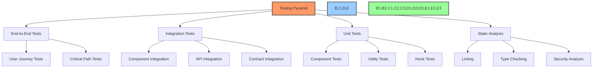
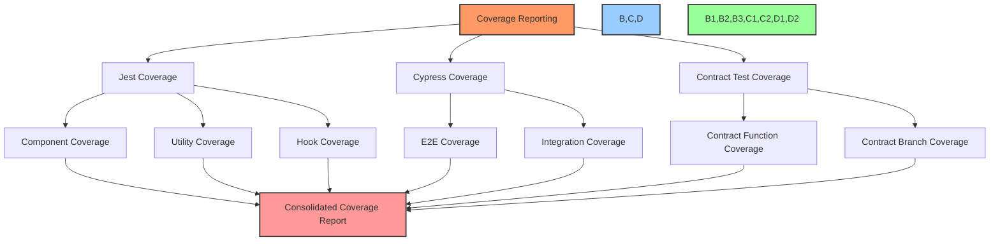
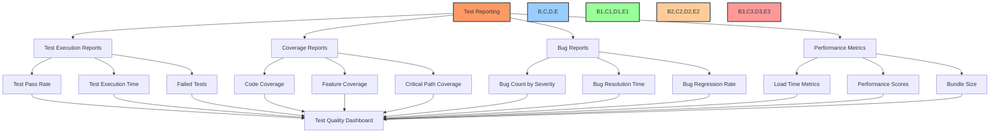
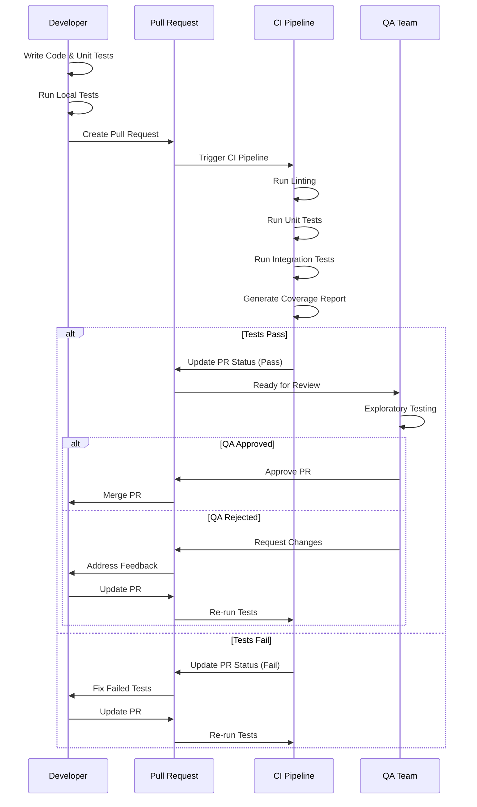
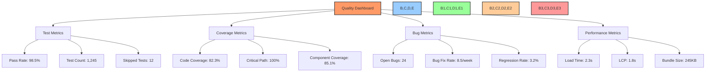
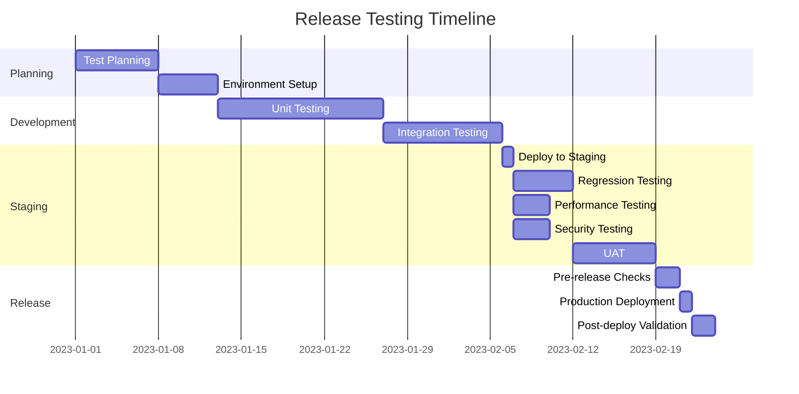

# 🧪 Test Plan & Strategy

## 📋 Table of Contents
- [🔍 Overview](#overview)
- [🎯 Purpose](#purpose)
- [🧪 Testing Approach](#testing-approach)
- [📊 Test Coverage](#test-coverage)
- [🧩 Test Types](#test-types)
- [🛠️ Testing Environment](#testing-environment)
- [📝 Test Documentation](#test-documentation)
- [🚀 Testing Process](#testing-process)
- [📈 Quality Metrics](#quality-metrics)
- [📆 Testing Schedule](#testing-schedule)
- [📚 Resources](#resources)

## 🔍 Overview

This document outlines the comprehensive testing strategy for the BAD DAO UI project. It covers all aspects of testing including unit, integration, and end-to-end testing approaches, as well as environment configurations, test documentation standards, and quality metrics.

## 🎯 Purpose

The test plan aims to:
- Define a structured approach to testing the application
- Ensure comprehensive test coverage across all components
- Establish clear testing processes and responsibilities
- Define quality gates and acceptance criteria
- Provide guidance for ongoing testing activities
- Ensure reliable and high-quality software delivery

## 🧪 Testing Approach

### Testing Pyramid



### Testing Principles

1. **Shift Left**: Testing begins early in the development cycle
2. **Automation First**: Prioritize automated tests over manual testing
3. **Risk-Based**: Focus testing efforts on high-risk areas
4. **Continuous**: Testing is integrated into the CI/CD pipeline
5. **Comprehensive**: Test both happy paths and edge cases
6. **Isolated**: Tests should be independent and deterministic

### Testing Quadrants

| | Business-Facing | Technology-Facing |
|---|---|---|
| **Supporting Team** | Q2: Functional Tests<br>Acceptance Tests<br>User Journey Tests | Q1: Unit Tests<br>Component Tests<br>Integration Tests |
| **Critique Product** | Q3: Exploratory Testing<br>Usability Testing<br>User Acceptance Testing | Q4: Performance Tests<br>Security Tests<br>Accessibility Tests |

## 📊 Test Coverage

### Target Coverage Metrics

| Component | Code Coverage Target | Critical Path Coverage |
|-----------|----------------------|------------------------|
| React Components | 80% | 100% |
| Utility Functions | 90% | 100% |
| API Integration | 85% | 100% |
| Contract Integration | 90% | 100% |
| State Management | 85% | 100% |
| User Flows | 75% | 100% |

### Coverage Tracking



### Critical Paths

The following critical paths must have 100% test coverage:

1. **User Authentication**
   - Wallet connection
   - Address verification
   - Session management

2. **Governance**
   - Proposal creation
   - Voting
   - Execution

3. **Treasury Management**
   - Asset balance viewing
   - Transaction history
   - Transaction execution

4. **Token Operations**
   - Token balance checking
   - Token delegation
   - Token transfer

## 🧩 Test Types

### Unit Testing

| Focus | Tools | Scope |
|-------|-------|-------|
| Component rendering | Jest, React Testing Library | UI components |
| Component behavior | Jest, React Testing Library | UI components |
| Utility functions | Jest | Helper functions |
| Hooks | React Testing Library | Custom hooks |
| Reducers | Jest | State management |
| API functions | Jest, MSW | API integration |

#### Component Test Example

```typescript
import { render, screen, fireEvent } from '@testing-library/react';
import { ProposalCard } from './ProposalCard';

describe('ProposalCard', () => {
  const mockProposal = {
    id: '1',
    title: 'Test Proposal',
    description: 'This is a test proposal',
    status: 'active',
    votes: {
      for: 100,
      against: 50,
      abstain: 10
    }
  };

  it('renders proposal details correctly', () => {
    render(<ProposalCard proposal={mockProposal} />);
    
    expect(screen.getByText('Test Proposal')).toBeInTheDocument();
    expect(screen.getByText('This is a test proposal')).toBeInTheDocument();
    expect(screen.getByText('Active')).toBeInTheDocument();
  });

  it('shows vote details when expanded', () => {
    render(<ProposalCard proposal={mockProposal} />);
    
    const expandButton = screen.getByRole('button', { name: /show details/i });
    fireEvent.click(expandButton);
    
    expect(screen.getByText('For: 100')).toBeInTheDocument();
    expect(screen.getByText('Against: 50')).toBeInTheDocument();
    expect(screen.getByText('Abstain: 10')).toBeInTheDocument();
  });

  it('calls onVote when vote button is clicked', () => {
    const onVoteMock = jest.fn();
    render(<ProposalCard proposal={mockProposal} onVote={onVoteMock} />);
    
    const voteButton = screen.getByRole('button', { name: /vote/i });
    fireEvent.click(voteButton);
    
    expect(onVoteMock).toHaveBeenCalledWith(mockProposal.id);
  });
});
```

### Integration Testing

| Focus | Tools | Scope |
|-------|-------|-------|
| Component integration | Jest, React Testing Library | Component trees |
| Page functionality | Jest, React Testing Library | Pages |
| API integration | MSW, Jest | API endpoints |
| Contract integration | Hardhat, Ethers.js | Smart contracts |
| State management | Jest, Redux | State flow |

#### API Integration Test Example

```typescript
import { rest } from 'msw';
import { setupServer } from 'msw/node';
import { render, screen, waitFor } from '@testing-library/react';
import { ProposalList } from './ProposalList';

const server = setupServer(
  rest.get('/api/proposals', (req, res, ctx) => {
    return res(
      ctx.json({
        proposals: [
          {
            id: '1',
            title: 'Test Proposal',
            description: 'This is a test proposal',
            status: 'active'
          }
        ]
      })
    );
  })
);

beforeAll(() => server.listen());
afterEach(() => server.resetHandlers());
afterAll(() => server.close());

describe('ProposalList', () => {
  it('fetches and displays proposals', async () => {
    render(<ProposalList />);
    
    // Loading state should be shown initially
    expect(screen.getByText('Loading proposals...')).toBeInTheDocument();
    
    // Wait for the proposals to load
    await waitFor(() => {
      expect(screen.getByText('Test Proposal')).toBeInTheDocument();
    });
  });

  it('handles API errors gracefully', async () => {
    server.use(
      rest.get('/api/proposals', (req, res, ctx) => {
        return res(ctx.status(500));
      })
    );
    
    render(<ProposalList />);
    
    await waitFor(() => {
      expect(screen.getByText('Failed to load proposals')).toBeInTheDocument();
    });
  });
});
```

### End-to-End Testing

| Focus | Tools | Scope |
|-------|-------|-------|
| User journeys | Cypress | Core workflows |
| Critical paths | Cypress | Key functionality |
| Cross-browser | Cypress, BrowserStack | Browser compatibility |
| Device testing | Cypress | Responsive design |

#### Cypress Test Example

```typescript
describe('Governance Flow', () => {
  beforeEach(() => {
    // Mock wallet connection
    cy.window().then(win => {
      win.ethereum = {
        request: () => Promise.resolve('0x123456789...'),
        on: () => {},
        removeListener: () => {}
      };
    });
    
    cy.visit('/governance');
  });

  it('allows users to create and vote on proposals', () => {
    // Connect wallet
    cy.findByRole('button', { name: /connect wallet/i }).click();
    cy.findByText('Connected: 0x1234...').should('be.visible');
    
    // Navigate to create proposal
    cy.findByRole('button', { name: /create proposal/i }).click();
    
    // Fill out proposal form
    cy.findByLabelText('Title').type('Test Proposal');
    cy.findByLabelText('Description').type('This is a test proposal');
    cy.findByLabelText('Actions').within(() => {
      cy.findByRole('button', { name: /add action/i }).click();
      cy.findByLabelText('Contract Address').type('0xabcdef123456...');
      cy.findByLabelText('Function').type('transfer');
      cy.findByLabelText('Parameters').type('["0x123", 100]');
    });
    
    // Submit proposal
    cy.findByRole('button', { name: /submit proposal/i }).click();
    
    // Verify proposal was created
    cy.findByText('Proposal created successfully').should('be.visible');
    cy.findByText('Test Proposal').should('be.visible');
    
    // Cast vote
    cy.findByText('Test Proposal').click();
    cy.findByRole('button', { name: /vote for/i }).click();
    cy.findByRole('button', { name: /confirm vote/i }).click();
    
    // Verify vote was cast
    cy.findByText('Vote cast successfully').should('be.visible');
    cy.contains('Your vote: For').should('be.visible');
  });
});
```

### Special Testing Types

1. **Accessibility Testing**
   - Tools: axe-core, Lighthouse
   - Focus: WCAG 2.1 compliance, screen reader compatibility
   - Integration: Automated checks in CI/CD pipeline

2. **Performance Testing**
   - Tools: Lighthouse, WebPageTest
   - Focus: Page load times, rendering performance, bundle size
   - Metrics: LCP, FID, CLS (Core Web Vitals)

3. **Security Testing**
   - Tools: OWASP ZAP, npm audit, Snyk
   - Focus: Common vulnerabilities, dependency scanning
   - Integration: Regular scans in CI/CD pipeline

4. **Contract Testing**
   - Tools: Hardhat, Waffle
   - Focus: Smart contract interaction, transaction simulation
   - Approach: Mock contract responses for UI testing

## 🛠️ Testing Environment

### Environment Configuration

| Environment | Purpose | Infrastructure | Data | Access |
|-------------|---------|---------------|------|--------|
| Development | Day-to-day testing | Local | Mock data | Developers |
| Integration | Feature integration | CI Pipeline | Test data | Team |
| Staging | Pre-release testing | Cloud (UAT) | Sanitized production data | Team + Stakeholders |
| Production | Live monitoring | Cloud (Production) | Production data | Public |

### Testing Networks

| Network | Purpose | Smart Contracts | Features |
|---------|---------|----------------|----------|
| Local Hardhat | Development testing | Deployed locally | Fast, customizable |
| Goerli Testnet | Integration testing | Test deployments | Network conditions |
| Mainnet Fork | Staging testing | Production contracts | Real state, forked |
| Mainnet | Production | Production contracts | Real transactions |

### Environment Variables

```typescript
// Testing environment variables
{
  // API configuration
  "REACT_APP_API_URL": "https://api.test.baddao.io",
  "REACT_APP_API_TIMEOUT": "30000",
  
  // Blockchain configuration
  "REACT_APP_CHAIN_ID": "5", // Goerli
  "REACT_APP_RPC_URL": "https://goerli.infura.io/v3/your-api-key",
  "REACT_APP_BLOCK_EXPLORER": "https://goerli.etherscan.io",
  
  // Contract addresses
  "REACT_APP_GOVERNOR_ADDRESS": "0x...",
  "REACT_APP_TOKEN_ADDRESS": "0x...",
  "REACT_APP_TREASURY_ADDRESS": "0x...",
  
  // Testing configuration
  "REACT_APP_TEST_WALLET": "0x...",
  "REACT_APP_TEST_PRIVATE_KEY": "0x...",
  "CYPRESS_MNEMONIC": "test test test...",
  
  // Feature flags
  "REACT_APP_ENABLE_DELEGATIONS": "true",
  "REACT_APP_ENABLE_PROPOSALS": "true"
}
```

### Mock Data

```typescript
// Mock data for testing
export const mockProposals = [
  {
    id: '1',
    title: 'Upgrade Treasury Implementation',
    description: 'This proposal aims to upgrade the Treasury contract to v2',
    status: 'active',
    startBlock: 12345678,
    endBlock: 12345678 + 40320, // ~7 days
    proposer: '0x123456...',
    actions: [
      {
        target: '0xabcdef...',
        value: '0',
        signature: 'upgrade(address)',
        callData: '0x...'
      }
    ],
    votes: {
      for: 1000000,
      against: 500000,
      abstain: 100000
    }
  },
  // Additional mock proposals...
];

export const mockUsers = [
  {
    address: '0x123456...',
    ensName: 'alice.eth',
    votingPower: 1500000,
    delegatedPower: 500000,
    delegatedTo: null
  },
  // Additional mock users...
];
```

## 📝 Test Documentation

### Test Case Template

```markdown
## Test Case: TC-[ID]

### Overview
- **Title:** [Test Case Title]
- **Priority:** [High/Medium/Low]
- **Type:** [Unit/Integration/E2E]
- **Component:** [Component Name]

### Preconditions
- [List any preconditions that must be met]

### Test Steps
1. [First Step]
2. [Second Step]
3. [Third Step]
...

### Expected Results
- [Expected outcome after test steps are executed]

### Data Requirements
- [Test data needed]

### Notes
- [Any additional information]
```

### Bug Report Template

```markdown
## Bug Report: BUG-[ID]

### Overview
- **Title:** [Bug Title]
- **Severity:** [Critical/High/Medium/Low]
- **Priority:** [High/Medium/Low]
- **Found In:** [Version or Environment]
- **Component:** [Affected Component]

### Description
[Detailed description of the bug]

### Steps to Reproduce
1. [First Step]
2. [Second Step]
3. [Third Step]
...

### Expected Behavior
[What should happen]

### Actual Behavior
[What actually happens]

### Screenshots/Videos
[If applicable]

### Environment
- **Browser:** [Browser and Version]
- **OS:** [Operating System]
- **Device:** [Device Type]
- **Connection:** [Network Condition]

### Additional Context
[Any other relevant information]
```

### Test Reporting



## 🚀 Testing Process

### Pre-Development Testing

1. **Requirements Review**
   - Analyze requirements for testability
   - Identify test scenarios
   - Define acceptance criteria

2. **Test Planning**
   - Create test cases
   - Define test data
   - Set up test environment

3. **Testing Environment Setup**
   - Configure test tools
   - Set up mock APIs/services
   - Prepare test data

### Development Testing



### Continuous Testing

1. **CI Pipeline Integration**
   - Automated test execution on code changes
   - Test result reporting
   - Coverage analysis

2. **Nightly Test Runs**
   - Extended test suites
   - Performance testing
   - Security scanning

3. **Manual Testing Sessions**
   - Exploratory testing
   - User acceptance testing
   - Usability testing

### Release Testing

1. **Regression Testing**
   - Run full test suite
   - Verify critical paths
   - Cross-browser testing

2. **Pre-release Verification**
   - Deployment validation
   - Configuration verification
   - Smoke testing

3. **Post-release Monitoring**
   - Production monitoring
   - Error tracking
   - Performance monitoring

## 📈 Quality Metrics

### Key Performance Indicators

| Metric | Target | Measurement |
|--------|--------|-------------|
| Test Pass Rate | >98% | Passing tests / Total tests |
| Code Coverage | >80% | Covered lines / Total lines |
| Critical Path Coverage | 100% | Covered critical paths / Total critical paths |
| Bug Escape Rate | <5% | Production bugs / Total bugs |
| Test Execution Time | <10 minutes | CI pipeline duration |
| Time to Fix | <2 days | Time from bug report to fix |

### Quality Dashboard



### Quality Gates

| Stage | Requirements to Pass |
|-------|----------------------|
| PR Approval | - All tests pass<br>- Code coverage maintained or improved<br>- No critical or high severity issues |
| Release to Staging | - All integration tests pass<br>- Critical path tests pass<br>- Performance benchmarks met<br>- Security scan passes |
| Release to Production | - Staging validation complete<br>- UAT sign-off<br>- No open critical or high bugs<br>- Load testing successful |

## 📆 Testing Schedule

### Release Testing Timeline



### Testing Milestones

| Milestone | Target Date | Deliverables |
|-----------|-------------|--------------|
| Test Planning Complete | Week 1 | Test plan, Test cases, Environment configuration |
| Automation Framework Ready | Week 2 | Test framework, CI integration, Mock services |
| Component Test Suite Complete | Week 4 | Unit tests, Component tests, Coverage report |
| Integration Test Suite Complete | Week 6 | Integration tests, API tests, Contract tests |
| E2E Test Suite Complete | Week 8 | User journey tests, Critical path tests |
| Performance Baseline Established | Week 9 | Performance test suite, Benchmark results |
| Release Candidate Testing | Week 10 | Regression test results, UAT sign-off |

## 📚 Resources

### Test Tooling

| Category | Tools | Purpose |
|----------|-------|---------|
| Unit Testing | Jest, React Testing Library | Component and function testing |
| E2E Testing | Cypress | User journey and integration testing |
| Contract Testing | Hardhat, Waffle, Ethers.js | Smart contract interaction testing |
| Performance Testing | Lighthouse, WebPageTest | Web performance analysis |
| Security Testing | OWASP ZAP, npm audit | Security vulnerability scanning |
| Visual Testing | Percy | Visual regression testing |
| Mocking | MSW, Mock Service Worker | API mocking and interception |
| CI Integration | GitHub Actions, CircleCI | Continuous integration |

### Testing Guidelines

1. **Test Naming Convention**
   - Format: `describe('ComponentName', () => { it('should behavior when condition', () => {});`
   - Example: `describe('ProposalCard', () => { it('should display vote counts when expanded', () => {});`

2. **Test File Structure**
   - Location: Same directory as the component
   - Naming: `Component.test.tsx` or `Component.spec.tsx`

3. **Testing Best Practices**
   - Test behavior, not implementation
   - Keep tests independent
   - Use meaningful assertions
   - Maintain test data separately
   - Isolate tests from external dependencies

### Reference Documentation

- [Jest Documentation](https://jestjs.io/docs/en/getting-started)
- [React Testing Library](https://testing-library.com/docs/react-testing-library/intro/)
- [Cypress Documentation](https://docs.cypress.io/guides/overview/why-cypress)
- [Hardhat Testing](https://hardhat.org/hardhat-runner/docs/guides/test-contracts)
- [Testing Trophy](https://kentcdodds.com/blog/the-testing-trophy-and-testing-classifications)

---

Made with Power, Love, and AI •  ⚡️❤️🤖 •  POWERBRIDGE.AI 