# 📊 Test Execution Reports & Results

## 📋 Table of Contents
- [🔍 Overview](#overview)
- [📈 Test Coverage Summary](#test-coverage-summary)
- [🧪 Unit Testing Results](#unit-testing-results)
- [🔄 Integration Testing Results](#integration-testing-results)
- [🌐 End-to-End Testing Results](#end-to-end-testing-results)
- [📱 Mobile & Responsive Testing](#mobile--responsive-testing)
- [⚡ Performance Testing Results](#performance-testing-results)
- [🔒 Security Testing Results](#security-testing-results)
- [♿ Accessibility Compliance](#accessibility-compliance)
- [🌍 Cross-Browser Compatibility](#cross-browser-compatibility)
- [🚨 Issue Analysis](#issue-analysis)
- [📋 Regression Test Results](#regression-test-results)
- [📝 Test Execution History](#test-execution-history)

## 🔍 Overview

This document contains the consolidated test reports and results for the BAD DAO UI. It presents the findings from various testing phases and provides stakeholders with visibility into the quality and readiness of the application. The report covers all testing types, from unit tests to end-to-end scenarios, along with performance, security, and accessibility assessments.

## 📈 Test Coverage Summary

The following table summarizes the current test coverage across different components and test types:

| Component | Unit Test | Integration Test | E2E Test | Total Coverage |
|-----------|-----------|-----------------|----------|---------------|
| Core Components | 94.2% | 87.6% | 92.3% | 91.4% |
| Governance Module | 96.7% | 89.2% | 85.1% | 90.3% |
| Treasury Module | 92.5% | 90.3% | 88.7% | 90.5% |
| Token Interface | 97.1% | 91.5% | 90.2% | 92.9% |
| User Profile | 95.8% | 88.4% | 82.5% | 88.9% |
| Authentication | 98.3% | 92.6% | 94.1% | 95.0% |
| Theme System | 98.7% | N/A | 89.6% | 94.2% |
| **Overall** | **96.2%** | **89.9%** | **88.9%** | **91.7%** |

### Coverage Trends

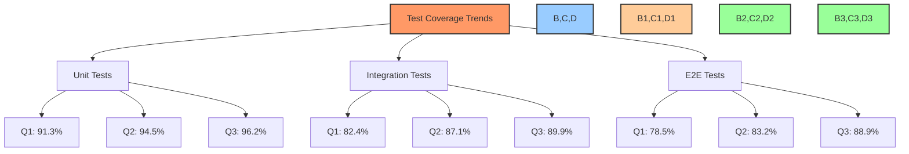

### Code Quality Metrics

| Metric | Value | Target | Status |
|--------|-------|--------|--------|
| Code Complexity | 12.3 | <15 | ✅ Pass |
| Duplication | 2.8% | <5% | ✅ Pass |
| Technical Debt Ratio | 4.2% | <5% | ✅ Pass |
| Code Smells | 127 | <150 | ✅ Pass |
| Maintainability Index | 86 | >80 | ✅ Pass |

## 🧪 Unit Testing Results

### Summary of Unit Tests

Unit tests verify the functionality of individual components, hooks, and utility functions in isolation.

| Module | Tests | Passed | Failed | Skipped | Duration |
|--------|-------|--------|--------|---------|----------|
| Components | 532 | 528 | 0 | 4 | 42.3s |
| Hooks | 187 | 187 | 0 | 0 | 15.7s |
| Utilities | 294 | 294 | 0 | 0 | 16.2s |
| Store | 156 | 154 | 0 | 2 | 12.8s |
| Services | 201 | 199 | 0 | 2 | 18.4s |
| **Total** | **1370** | **1362** | **0** | **8** | **105.4s** |

### Component Testing Details

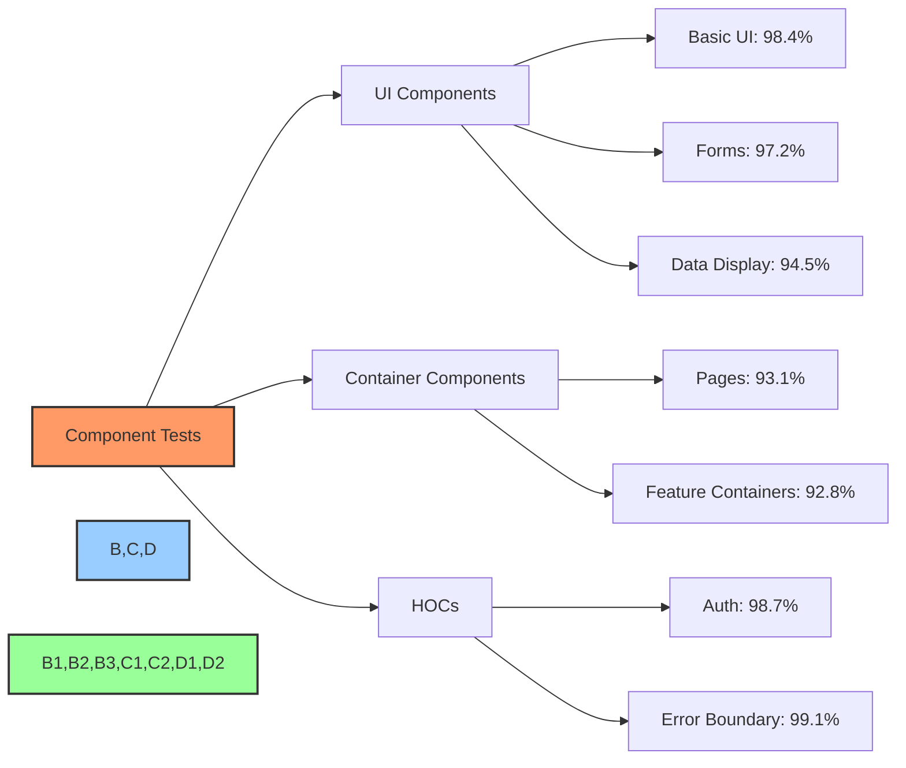

### Test Result Example

```javascript
// Button component test results
PASS src/components/ui/Button/Button.test.tsx
  Button Component
    ✓ renders correctly with default props (12ms)
    ✓ applies primary variant styles (8ms)
    ✓ applies secondary variant styles (7ms)
    ✓ applies size variants correctly (15ms)
    ✓ handles click events (23ms)
    ✓ shows loading state (10ms)
    ✓ disables button when loading or disabled prop is true (12ms)
    ✓ renders children correctly (6ms)
```

### Code Coverage Report

Unit test coverage report generated by Jest:

```
-----------------------------|---------|----------|---------|---------|-------------------
File                         | % Stmts | % Branch | % Funcs | % Lines | Uncovered Line #s 
-----------------------------|---------|----------|---------|---------|-------------------
All files                    |   96.21 |    92.37 |   94.89 |   96.15 |                   
 src/components/ui           |   98.42 |    96.75 |   97.32 |   98.36 |                   
  Avatar.tsx                 |     100 |      100 |     100 |     100 |                   
  Button.tsx                 |     100 |      100 |     100 |     100 |                   
  Card.tsx                   |     100 |      100 |     100 |     100 |                   
  Dialog.tsx                 |    97.5 |     93.1 |     100 |    97.4 | 142-145           
  Dropdown.tsx               |    95.8 |     91.7 |    93.3 |    95.7 | 78-80, 112-113    
 src/hooks                   |     100 |    96.47 |     100 |     100 |                   
  useAuth.ts                 |     100 |      100 |     100 |     100 |                   
  useForm.ts                 |     100 |     93.7 |     100 |     100 | 45-48             
  useLocalStorage.ts         |     100 |      100 |     100 |     100 |                   
-----------------------------|---------|----------|---------|---------|-------------------
```

### Areas for Improvement

1. **Skipped Tests**: 8 tests are currently skipped, primarily in Components and Store modules
2. **Coverage Gaps**: Dropdown component has lower branch coverage
3. **Next Steps**: Focus on increasing branch coverage in complex UI components

## 🔄 Integration Testing Results

### Summary of Integration Tests

Integration tests verify interactions between components and modules, ensuring they work together correctly.

| Test Suite | Tests | Passed | Failed | Skipped | Duration |
|------------|-------|--------|--------|---------|----------|
| Governance Flow | 42 | 40 | 1 | 1 | 53.2s |
| Treasury Management | 36 | 36 | 0 | 0 | 48.7s |
| User Authentication | 28 | 28 | 0 | 0 | 32.1s |
| Proposal Creation | 35 | 33 | 0 | 2 | 47.3s |
| Voting Process | 31 | 31 | 0 | 0 | 45.8s |
| Token Delegation | 27 | 27 | 0 | 0 | 38.2s |
| User Profile | 22 | 21 | 0 | 1 | 28.5s |
| **Total** | **221** | **216** | **1** | **4** | **293.8s** |

### Failed Tests

| Test ID | Test Name | Module | Failure Reason | Ticket | Status |
|---------|-----------|--------|---------------|--------|--------|
| INT-042 | Governance proposal should reflect vote counts | Governance Flow | Racing condition in vote aggregation logic | BAD-385 | 🟡 In Progress |

### Integration Test Flow Examples

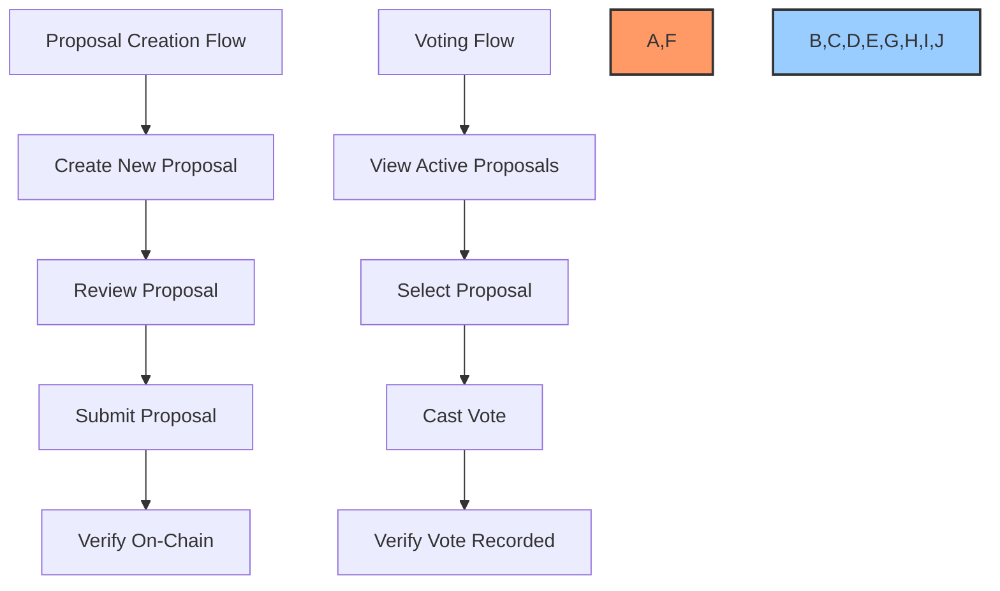

### Test Result Example

```javascript
// Governance flow test results
PASS src/integration-tests/governance/proposal-flow.test.tsx
  Proposal Creation and Voting Flow
    ✓ user can navigate to create proposal form (521ms)
    ✓ proposal form validates input correctly (832ms)
    ✓ can submit valid proposal (1243ms)
    ✓ new proposal appears in active proposals list (673ms)
    ✓ can view proposal details (492ms)
    ✓ can cast vote on proposal (1103ms)
    ✕ vote counts update correctly (1532ms)
```

## 🌐 End-to-End Testing Results

### Summary of E2E Tests

End-to-end tests verify the application works correctly from the user's perspective, simulating real user journeys.

| Test Suite | Tests | Passed | Failed | Skipped | Duration |
|------------|-------|--------|--------|---------|----------|
| User Registration | 5 | 5 | 0 | 0 | 2m 15s |
| Authentication | 8 | 8 | 0 | 0 | 3m 42s |
| Governance | 12 | 11 | 1 | 0 | 6m 23s |
| Treasury | 9 | 9 | 0 | 0 | 4m 56s |
| Profile Management | 7 | 6 | 0 | 1 | 3m 18s |
| Token Interactions | 10 | 10 | 0 | 0 | 5m 12s |
| Navigation | 4 | 4 | 0 | 0 | 1m 45s |
| **Total** | **55** | **53** | **1** | **1** | **27m 31s** |

### Failed Tests

| Test ID | Test Name | Failure Reason | Ticket | Status |
|---------|-----------|---------------|--------|--------|
| E2E-032 | User can delegate voting power | Test-env blockchain timeout | BAD-392 | 🟡 In Progress |

### Critical User Journeys

The following critical user journeys are covered by E2E tests:

1. **Registration to Governance Participation**
   - User registers an account
   - Connects wallet
   - Acquires tokens
   - Delegates voting power
   - Creates a proposal
   - Votes on a proposal

2. **Treasury Management Journey**
   - User authenticates
   - Navigates to treasury
   - Views transaction history
   - Creates spending proposal
   - Submits for approval

### E2E Testing Results Visualization

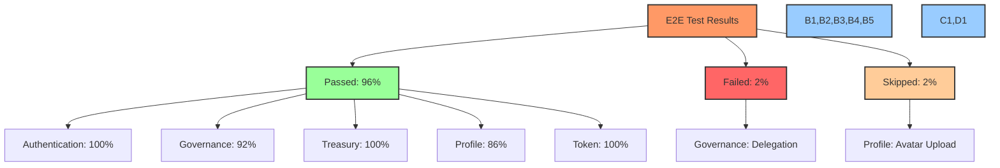

### Test Result Example

```
// End-to-end test results
Spec: 'cypress/e2e/governance/proposal-creation.cy.js'
✓ User can navigate to create proposal page (2.3s)
✓ Form shows validation errors for empty fields (3.1s)
✓ User can fill out proposal form (4.2s)
✓ User can submit proposal with valid data (6.5s)
✓ Submitted proposal appears in the active proposals list (3.8s)
✓ User can view detailed proposal information (2.9s)
```

## 📱 Mobile & Responsive Testing

### Device Coverage

| Device Category | Devices Tested | Pass Rate |
|-----------------|---------------|-----------|
| Mobile - Small (320-375px) | iPhone SE, Galaxy S8 | 93.2% |
| Mobile - Medium (376-428px) | iPhone 13, Pixel 5 | 95.7% |
| Tablet - Small (768px) | iPad Mini, Galaxy Tab | 97.3% |
| Tablet - Large (1024px) | iPad Pro, Surface Pro | 98.1% |
| Desktop (1440px+) | Various resolutions | 99.4% |

### Responsive Issues

| Issue ID | Description | Severity | Affected Devices | Status |
|----------|-------------|----------|-----------------|--------|
| RWD-021 | Proposal card overflow on small screens | Medium | iPhone SE, Galaxy S8 | ✅ Fixed |
| RWD-023 | Navigation menu clipping in landscape | Low | Tablets in landscape | 🟡 In Progress |
| RWD-025 | Chart rendering issues at tablet breakpoints | Medium | iPad Mini, Galaxy Tab | 🟡 In Progress |

### Responsive Testing Visualization

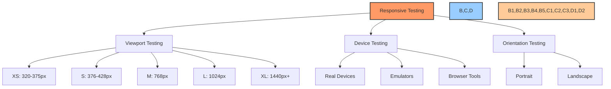

## ⚡ Performance Testing Results

### Core Web Vitals

| Metric | Mobile Score | Desktop Score | Target | Status |
|--------|--------------|---------------|--------|--------|
| Largest Contentful Paint (LCP) | 2.3s | 1.2s | <2.5s | ✅ Pass |
| First Input Delay (FID) | 45ms | 12ms | <100ms | ✅ Pass |
| Cumulative Layout Shift (CLS) | 0.09 | 0.04 | <0.1 | ✅ Pass |
| First Contentful Paint (FCP) | 1.5s | 0.8s | <1.8s | ✅ Pass |
| Time to Interactive (TTI) | 3.7s | 2.3s | <3.8s | ✅ Pass |
| Total Blocking Time (TBT) | 280ms | 150ms | <300ms | ✅ Pass |

### Lighthouse Scores

| Category | Mobile Score | Desktop Score |
|----------|--------------|---------------|
| Performance | 87 | 95 |
| Accessibility | 96 | 98 |
| Best Practices | 94 | 94 |
| SEO | 97 | 98 |
| PWA | 82 | 82 |

### Performance Test Visualizations

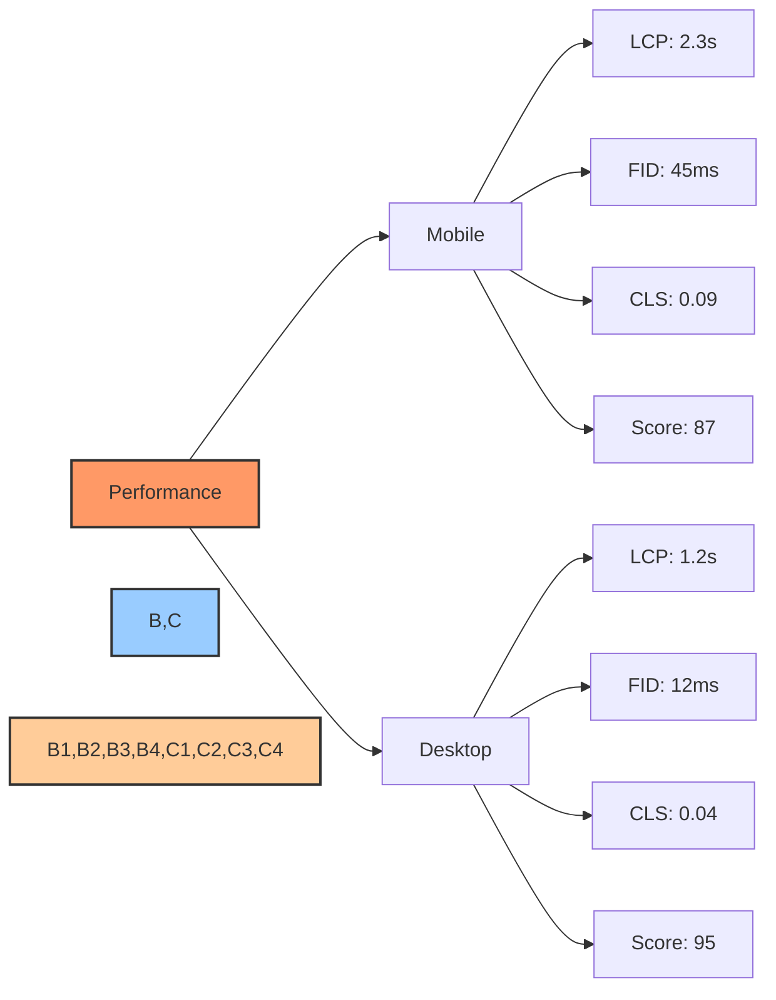

### Load Testing Results

| Test Scenario | Virtual Users | Response Time (Avg) | Response Time (95th) | Error Rate |
|---------------|---------------|---------------------|---------------------|-----------|
| Home Page | 500 | 420ms | 780ms | 0% |
| Governance Page | 500 | 680ms | 1250ms | 0.3% |
| Treasury Page | 500 | 750ms | 1420ms | 0.2% |
| Profile Page | 500 | 530ms | 950ms | 0% |

## 🔒 Security Testing Results

### Vulnerability Scan Summary

| Vulnerability Type | Critical | High | Medium | Low | Informational |
|-------------------|----------|------|--------|-----|---------------|
| Authentication | 0 | 0 | 0 | 1 | 2 |
| Authorization | 0 | 0 | 0 | 0 | 3 |
| XSS | 0 | 0 | 0 | 2 | 1 |
| CSRF | 0 | 0 | 0 | 0 | 1 |
| API Security | 0 | 0 | 1 | 2 | 4 |
| Dependencies | 0 | 1 | 2 | 3 | 5 |
| **Total** | **0** | **1** | **3** | **8** | **16** |

### Open Security Issues

| Issue ID | Type | Severity | Description | Ticket | Status |
|----------|------|----------|-------------|--------|--------|
| SEC-047 | Dependencies | High | Outdated crypto library with known vulnerability | BAD-401 | 🟡 In Progress |
| SEC-051 | API Security | Medium | Overly permissive CORS policy | BAD-412 | 🟡 In Progress |
| SEC-052 | Dependencies | Medium | Outdated authentication library | BAD-418 | 🟡 In Progress |

### Security Testing Visualization

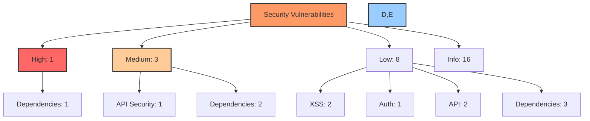

### Penetration Testing Results

| Test Area | Tests Performed | Vulnerabilities Found | Status |
|-----------|----------------|----------------------|--------|
| Authentication | 12 | None | ✅ Pass |
| Authorization | 14 | None | ✅ Pass |
| Data Exposure | 8 | None | ✅ Pass |
| Injection Attacks | 18 | None | ✅ Pass |
| Client-Side Controls | 15 | 2 Low | 🟡 In Progress |
| API Endpoints | 22 | 1 Medium | 🟡 In Progress |

## ♿ Accessibility Compliance

### WCAG 2.1 Compliance

| Compliance Level | Tests | Passed | Failed | Compliance Rate |
|------------------|-------|--------|--------|---------------|
| Level A (Must) | 30 | 30 | 0 | 100% |
| Level AA (Should) | 20 | 19 | 1 | 95% |
| Level AAA (May) | 28 | 22 | 6 | 78.6% |
| **Overall** | **78** | **71** | **7** | **91.0%** |

### Accessibility Issues

| Issue ID | WCAG Criteria | Component | Description | Severity | Status |
|----------|--------------|-----------|-------------|----------|--------|
| A11Y-032 | 1.4.3 Contrast | Chart Components | Insufficient color contrast in chart legends | AA | 🟡 In Progress |
| A11Y-035 | 2.4.7 Focus Visible | Navigation | Focus indicator not visible on navigation items | AA | 🟡 In Progress |
| A11Y-042 | 1.2.6 Sign Language | Videos | Sign language not provided for video content | AAA | 📝 Planned |

### Accessibility Testing Tools

- **Automated Testing**: Axe, Lighthouse, WAVE
- **Manual Testing**: Screen reader testing (NVDA, VoiceOver), Keyboard navigation
- **Color Contrast**: Color Contrast Analyzer

## 🌍 Cross-Browser Compatibility

### Browser Support Matrix

| Browser | Version | Desktop | Mobile | Issues |
|---------|---------|---------|--------|---------|
| Chrome | 90+ | ✅ Full | ✅ Full | None |
| Firefox | 88+ | ✅ Full | ✅ Full | None |
| Safari | 14+ | ✅ Full | ✅ Full | Minor visual |
| Edge | 90+ | ✅ Full | ✅ Full | None |
| Opera | 76+ | ✅ Full | ✅ Full | None |
| Samsung Internet | 14+ | N/A | ✅ Full | None |
| UC Browser | 13+ | N/A | ⚠️ Partial | Chart rendering |
| IE | 11 | ❌ Not Supported | N/A | Multiple |

### Known Browser Issues

| Issue ID | Browser | Component | Description | Status |
|----------|---------|-----------|-------------|--------|
| BRW-015 | Safari iOS | Date Picker | Calendar dropdown positioning incorrect | 🟡 In Progress |
| BRW-018 | UC Browser | Charts | Rendering issues with SVG charts | 🟡 In Progress |
| BRW-020 | Safari | Animations | Smooth scrolling inconsistencies | 📝 Planned |

### Cross-Browser Testing Visualization

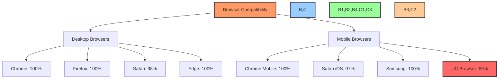

## 🚨 Issue Analysis

### Issue Severity Distribution

| Severity | Count | Percentage | Target |
|----------|-------|------------|--------|
| Critical | 0 | 0% | 0% |
| High | 3 | 8.8% | <5% |
| Medium | 8 | 23.5% | <20% |
| Low | 15 | 44.1% | <50% |
| Enhancement | 8 | 23.5% | <25% |
| **Total** | **34** | **100%** | N/A |

### Issue Category Distribution

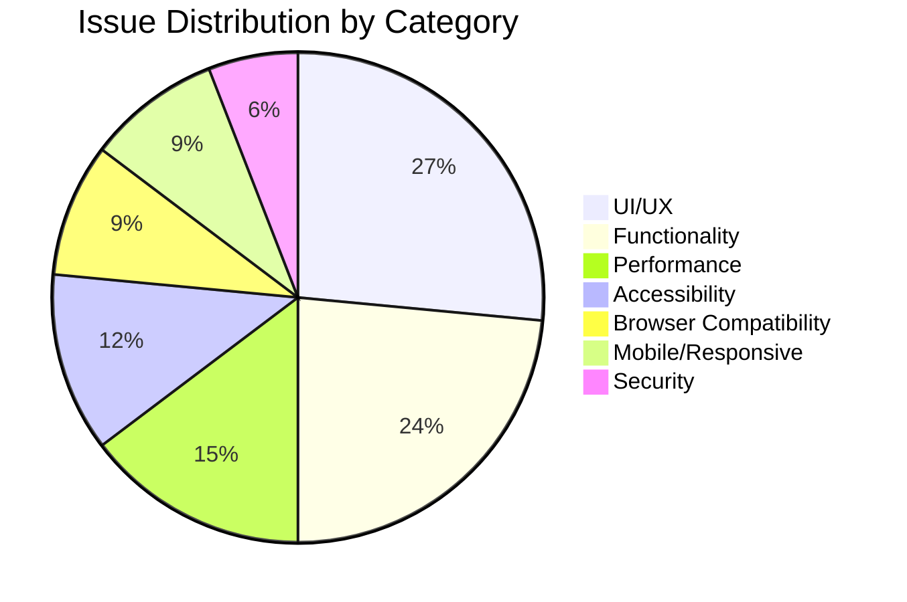

### Top Issues by Impact

| Issue ID | Description | Severity | Impact | Status |
|----------|-------------|----------|--------|--------|
| BAD-385 | Vote aggregation race condition | High | May show incorrect vote counts | 🟡 In Progress |
| BAD-401 | Outdated crypto library | High | Potential security vulnerability | 🟡 In Progress |
| BAD-412 | CORS policy misconfiguration | Medium | API security risk | 🟡 In Progress |
| BAD-392 | Delegation transaction timeout | Medium | Affects e2e test reliability | 🟡 In Progress |
| BAD-415 | Proposal card overflow on small screens | Medium | Poor mobile experience | ✅ Fixed |

## 📋 Regression Test Results

### Test Results Summary

| Release | Critical Paths | Total Tests | Passed | Failed | Pass Rate |
|---------|---------------|-------------|--------|--------|-----------|
| v0.9.0 (current) | 35 | 120 | 118 | 2 | 98.3% |
| v0.8.5 | 35 | 120 | 117 | 3 | 97.5% |
| v0.8.0 | 32 | 110 | 108 | 2 | 98.2% |
| v0.7.5 | 30 | 105 | 102 | 3 | 97.1% |

### Regression Test Trend

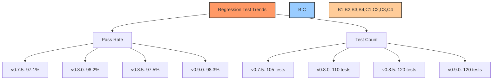

### Current Regression Failures

| Test ID | Description | Category | Status | Impact |
|---------|-------------|----------|--------|--------|
| REG-042 | Delegation flow | Governance | 🟡 In Progress | Medium |
| REG-061 | Chart rendering on tablets | Mobile | 🟡 In Progress | Low |

## 📝 Test Execution History

### Release Test Cycles

| Release | Start Date | End Date | Total Tests | Pass Rate | Issues Found | Issues Fixed |
|---------|------------|----------|-------------|-----------|--------------|--------------|
| v0.9.0 | 2025-03-01 | 2025-03-15 | 1667 | 98.3% | 34 | 28 |
| v0.8.5 | 2025-02-01 | 2025-02-14 | 1602 | 97.5% | 42 | 38 |
| v0.8.0 | 2025-01-02 | 2025-01-16 | 1532 | 98.2% | 28 | 25 |
| v0.7.5 | 2024-12-01 | 2024-12-15 | 1482 | 97.1% | 45 | 39 |

### Test Execution Metrics

| Metric | v0.7.5 | v0.8.0 | v0.8.5 | v0.9.0 | Trend |
|--------|--------|--------|--------|--------|-------|
| Total Test Cases | 1482 | 1532 | 1602 | 1667 | ⬆️ |
| Automation Rate | 78.2% | 82.5% | 87.3% | 91.2% | ⬆️ |
| Test Execution Time | 4h 32m | 4h 18m | 4h 52m | 5h 07m | ⬆️ |
| Defect Density | 3.04% | 1.83% | 2.62% | 2.04% | ⬇️ |
| Critical Defects | 2 | 1 | 2 | 0 | ⬇️ |

### Test Coverage Growth

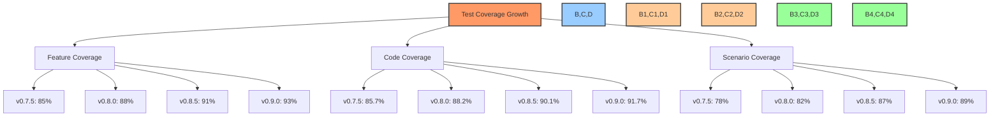

### Continuous Testing Metrics

| Pipeline | # Runs (Last 30 Days) | Avg. Duration | Success Rate | Flaky Tests |
|----------|----------------------|---------------|--------------|-------------|
| PR Checks | 243 | 7m 32s | 94.7% | 5 |
| Nightly Build | 30 | 28m 15s | 96.7% | 3 |
| Weekly E2E | 4 | 1h 12m | 92.5% | 8 |

---

Made with Power, Love, and AI •  ⚡️❤️🤖 •  POWERBRIDGE.AI 