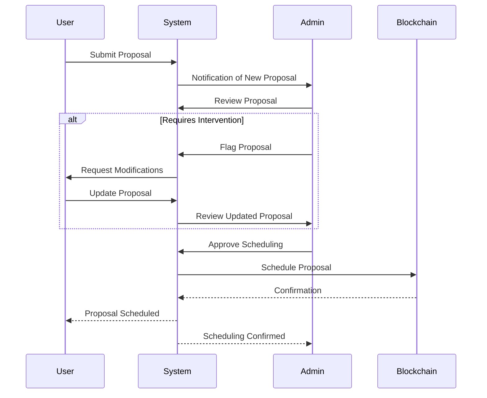
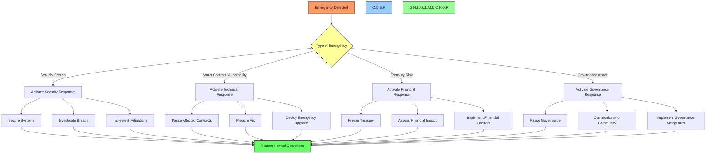

# 👑 BAD DAO UI - Administrator Guide

## 📋 Table of Contents
- [🔍 Overview](#overview)
- [🎯 Purpose](#purpose)
- [🔐 Administrator Access](#administrator-access)
- [🧰 Admin Dashboard](#admin-dashboard)
- [👥 User Management](#user-management)
- [🗳️ Proposal Administration](#proposal-administration)
- [💰 Treasury Management](#treasury-management)
- [⚙️ System Configuration](#system-configuration)
- [📊 Analytics & Reporting](#analytics--reporting)
- [🔄 Maintenance Tasks](#maintenance-tasks)
- [🛡️ Security Management](#security-management)
- [⚠️ Emergency Procedures](#emergency-procedures)

## 🔍 Overview

This guide provides comprehensive instructions for administrators of the BAD DAO UI platform. It covers all administrative functions, configuration options, and management procedures required to effectively operate and maintain the decentralized governance system.

## 🎯 Purpose

The administrator guide aims to:
- Define administrator roles and responsibilities
- Detail all administrative functions and their proper use
- Provide procedures for common administrative tasks
- Outline security protocols and emergency procedures
- Establish best practices for DAO governance oversight

## 🔐 Administrator Access

### Administrator Roles

```mermaid
graph TD
    A[Administrator Roles] --> B[Super Admin]
    A --> C[Treasury Admin]
    A --> D[Governance Admin]
    A --> E[Content Admin]
    A --> F[Analytics Admin]
    
    B --> B1[Complete system access]
    B --> B2[User role management]
    B --> B3[Emergency controls]
    
    C --> C1[Treasury operations]
    C --> C2[Asset management]
    C --> C3[Financial reporting]
    
    D --> D1[Proposal oversight]
    D --> D2[Voting management]
    D --> D3[Governance parameters]
    
    E --> E1[Content moderation]
    E --> E2[Documentation management]
    E --> E3[Announcements/Notices]
    
    F --> F1[Analytics dashboard]
    F --> F2[Reporting tools]
    F --> F3[Data exports]
    
    style A fill:#f96,stroke:#333,stroke-width:2px
    style B,C,D,E,F fill:#9cf,stroke:#333,stroke-width:2px
    style B1,B2,B3,C1,C2,C3,D1,D2,D3,E1,E2,E3,F1,F2,F3 fill:#9f9,stroke:#333,stroke-width:2px
```



### Access Provisioning

1. **Initial Super Admin Setup**
   - Super Admin is set during contract deployment
   - Requires multi-signature approval (3/5 signatures)
   - Credentials stored in secure hardware wallet

2. **Administrator Onboarding**
   - Super Admin initiates onboarding via Admin Dashboard
   - New admin registers wallet address
   - Signs verification message
   - Granted role-specific permissions
   - Completes security training

3. **Authentication Method**
   - Connect wallet (MetaMask, WalletConnect, etc.)
   - Sign authentication challenge
   - Authenticate with role-based permissions
   - Session timeout after 30 minutes of inactivity

### Security Protocols

- **Multi-Factor Authentication**: Required for all admin accounts
- **IP Restriction**: Optional IP allowlisting for admin access
- **Activity Logging**: All admin actions are logged with timestamps
- **Session Management**: Ability to view and terminate active sessions
- **Access Reviews**: Quarterly review of all admin accounts

## 🧰 Admin Dashboard

### Dashboard Overview

```
+---------------------------------------+
|            ADMIN HEADER               |
+---------------------------------------+
|                                       |
|         SYSTEM HEALTH METRICS         |
|                                       |
+------------------+--------------------+
|                  |                    |
|   PENDING        |   RECENT           |
|   ACTIONS        |   ACTIVITY         |
|                  |                    |
+------------------+--------------------+
|                                       |
|        CRITICAL ALERTS                |
|                                       |
+---------------+-----+------------------
|               |     |                |
| USER STATS    | GOV | TREASURY       |
|               |     |                |
+---------------+-----+----------------+
```

### Core Admin Functions

1. **Quick Actions**
   - Approve/reject pending proposals
   - Pause/unpause voting
   - Issue system announcements
   - Initiate emergency procedures

2. **Navigation Menu**
   - Dashboard (home)
   - User Management
   - Proposal Administration
   - Treasury Management
   - System Configuration
   - Analytics & Reporting
   - Security Settings
   - Audit Logs

3. **System Notifications**
   - Critical alerts
   - Pending approvals
   - System health alerts
   - Security notifications

### Admin API Access

- **API Endpoint**: `https://api.baddao.io/v1/admin`
- **Authentication**: JWT token with admin scope
- **Rate Limits**: 1000 requests per minute
- **Documentation**: Available at `https://docs.baddao.io/admin-api`

## 👥 User Management

### User Overview Dashboard

- **Active Users**: View and search all registered users
- **User Growth**: Track user acquisition metrics
- **Voting Power Distribution**: Analyze governance token distribution
- **User Activity**: Monitor engagement metrics

### User Administration Functions

1. **User Lookup**
   - Search by wallet address, ENS, or username
   - View complete profile and activity history
   - Export user data in CSV/JSON format

2. **User Role Management**
   - Assign/revoke admin roles
   - Create custom role definitions
   - Configure role permissions
   - Set delegation restrictions

3. **Moderation Actions**
   - Flag suspicious accounts
   - Restrict proposal creation privileges
   - Mute users from community forums
   - Note: Cannot restrict voting rights (decentralized)

```tsx
// Example user management interface
interface UserManagementProps {
  // Component implementation
}

const UserManagement: React.FC<UserManagementProps> = () => {
  const [users, setUsers] = useState<User[]>([]);
  const [selectedUser, setSelectedUser] = useState<User | null>(null);
  
  // Component implementation
  
  return (
    <AdminLayout title="User Management">
      <UserSearchPanel onUserSelect={setSelectedUser} />
      {selectedUser && (
        <UserDetailPanel 
          user={selectedUser}
          onRoleUpdate={handleRoleUpdate}
          onModerationAction={handleModerationAction}
        />
      )}
      <UserAnalyticsPanel users={users} />
    </AdminLayout>
  );
};
```

## 🗳️ Proposal Administration

### Proposal Monitoring

- **Active Proposals**: View all current governance proposals
- **Proposal Queue**: Monitor pending and scheduled proposals
- **Historical Proposals**: Access archive of past proposals
- **Flagged Content**: Review proposals flagged by users

### Administrative Controls

1. **Proposal Review**
   - Review proposal details and on-chain actions
   - Validate technical specifications
   - Add administrative notes (visible to other admins)
   - Flag potential issues for community attention

2. **Proposal Scheduling**
   - Adjust proposal timing to prevent congestion
   - Schedule high-impact proposals during optimal periods
   - Set priority levels for execution queue
   - Configure voting duration extensions

3. **Emergency Actions**
   - Pause specific proposals in emergency situations
   - Cancel malicious proposals (requires multi-sig)
   - Override execution delay for critical fixes
   - Issue governance alerts to all users



## 💰 Treasury Management

### Treasury Monitoring

- **Asset Overview**: Complete view of all DAO assets
- **Transaction History**: Record of all treasury movements
- **Financial Metrics**: Treasury growth, runway, diversification
- **Risk Assessment**: Exposure analysis and risk metrics

### Treasury Administration

1. **Asset Management**
   - View detailed asset information
   - Monitor asset allocation percentages
   - Track asset performance over time
   - Configure treasury alerts (low balance, volatility)

2. **Transaction Oversight**
   - Review pending treasury transactions
   - Validate transaction parameters
   - Verify recipient addresses
   - Add administrative annotations

3. **Financial Reporting**
   - Generate treasury reports
   - Configure regular financial snapshots
   - Export data for external analysis
   - Schedule automated reports

4. **Risk Management**
   - Set exposure limits for asset types
   - Configure diversification requirements
   - Establish reserve policies
   - Monitor regulatory compliance

### Treasury Security

- **Multi-signature Requirements**: Configure signature thresholds
- **Transaction Limits**: Set maximum transaction sizes
- **Timelock Controls**: Adjust timelock duration for withdrawals
- **Allowlist Management**: Maintain safe address allowlist

## ⚙️ System Configuration

### Global Settings

1. **Governance Parameters**
   - Proposal threshold requirements
   - Voting period duration
   - Quorum percentages
   - Execution delay timeframes

2. **User Experience Settings**
   - Default display preferences
   - Notification defaults
   - Content visibility rules
   - Language and localization

3. **Integration Configuration**
   - API key management
   - Webhook endpoints
   - Notification services
   - External data sources

### Contract Management

1. **Contract Directory**
   - View all system smart contracts
   - Contract addresses by network
   - Implementation/proxy relationships
   - Verified source code links

2. **Upgrade Management**
   - View available upgrades
   - Schedule upgrade proposals
   - Monitor upgrade status
   - Verify implementation integrity

```tsx
// System configuration interface
const SystemConfiguration: React.FC = () => {
  const [activeTab, setActiveTab] = useState('governance');
  const { config, updateConfig, resetConfig } = useSystemConfig();
  
  return (
    <AdminLayout title="System Configuration">
      <TabNavigation
        tabs={[
          { id: 'governance', label: 'Governance Parameters' },
          { id: 'ux', label: 'User Experience' },
          { id: 'integration', label: 'Integrations' },
          { id: 'contracts', label: 'Contract Management' }
        ]}
        activeTab={activeTab}
        onChange={setActiveTab}
      />
      
      {activeTab === 'governance' && (
        <GovernanceParametersForm
          config={config.governance}
          onUpdate={(values) => updateConfig('governance', values)}
          onReset={() => resetConfig('governance')}
        />
      )}
      
      {/* Other configuration tabs */}
    </AdminLayout>
  );
};
```

## 📊 Analytics & Reporting

### Analytics Dashboard

- **Governance Analytics**: Voting patterns, participation rates
- **Treasury Analytics**: Asset performance, financial health
- **User Analytics**: Growth, engagement, retention
- **System Analytics**: Performance, security, reliability

### Report Generation

1. **Standard Reports**
   - Governance activity report
   - Treasury status report
   - User growth report
   - Security audit report

2. **Custom Reports**
   - Report builder interface
   - Metric selection and filtering
   - Visualization options
   - Scheduling and distribution

3. **Data Export**
   - CSV/JSON/Excel formats
   - Automated export scheduling
   - Data retention configuration
   - Anonymization options

### Monitoring & Alerts

- **Custom Alert Configuration**: Set thresholds for key metrics
- **Alert Delivery**: Email, webhook, in-app notifications
- **Alert History**: Review previously triggered alerts
- **Alert Response**: Document actions taken for each alert

## 🔄 Maintenance Tasks

### Routine Maintenance

1. **Data Management**
   - Archive old proposals and votes
   - Clean up unused assets
   - Optimize database performance
   - Validate data integrity

2. **System Updates**
   - Frontend application updates
   - API service maintenance
   - Infrastructure scaling
   - Performance optimization

3. **Documentation Maintenance**
   - Update admin documentation
   - Maintain knowledge base
   - Track system changes
   - Document procedural updates

### Scheduled Maintenance

```
+------------------------+-------------------+---------------+
| Task                   | Frequency         | Responsibility|
+------------------------+-------------------+---------------+
| Security audit         | Quarterly         | Security Admin|
| Database optimization  | Monthly           | System Admin  |
| Contract review        | Quarterly         | Gov Admin     |
| User role audit        | Quarterly         | Super Admin   |
| Treasury audit         | Monthly           | Treasury Admin|
| Performance testing    | Monthly           | System Admin  |
| Backup verification    | Weekly            | System Admin  |
| Documentation review   | Monthly           | Content Admin |
+------------------------+-------------------+---------------+
```

### Maintenance Procedures

1. **Backup & Recovery**
   - Configure automated backups
   - Test restoration procedures
   - Secure backup storage
   - Document recovery processes

2. **System Health Checks**
   - Monitor system resource usage
   - Check error logs and alerts
   - Verify contract operation
   - Validate API performance

3. **Version Control**
   - Track system versions
   - Document upgrade history
   - Manage release notes
   - Coordinate deployment schedules

## 🛡️ Security Management

### Security Dashboard

- **Threat Monitoring**: Active security threats and vulnerabilities
- **Access Logs**: Review administrator access history
- **Failed Attempts**: Track authentication failures
- **Contract Monitoring**: Smart contract security status

### Security Administration

1. **Access Control**
   - Review and modify permission settings
   - Audit user roles and access levels
   - Manage API key permissions
   - Configure IP-based restrictions

2. **Security Alerts**
   - Configure security notification thresholds
   - Review triggered security alerts
   - Document incident response actions
   - Coordinate with security team

3. **Compliance Management**
   - Track regulatory requirements
   - Document compliance status
   - Schedule compliance reviews
   - Generate compliance reports

### Security Audit Log

The system maintains a comprehensive audit log of all administrative actions:

```
+----------------------+---------------+---------------+--------------------+
| Action               | Administrator | Timestamp     | IP Address         |
+----------------------+---------------+---------------+--------------------+
| Login                | 0x1234...5678 | 2023-05-01    | 192.168.1.1        |
| User role modified   | 0x1234...5678 | 2023-05-01    | 192.168.1.1        |
| Config changed       | 0x9876...5432 | 2023-05-02    | 10.0.0.5           |
| API key created      | 0x1234...5678 | 2023-05-03    | 192.168.1.1        |
| Proposal flagged     | 0x5678...9012 | 2023-05-04    | 172.16.254.1       |
+----------------------+---------------+---------------+--------------------+
```

## ⚠️ Emergency Procedures

### Emergency Response Plan



### Emergency Controls

1. **System Pause Functions**
   - Pause all proposals
   - Pause specific contract functions
   - Pause treasury operations
   - Pause user registration

2. **Emergency Communications**
   - Send system-wide alert
   - Update status page
   - Issue official statement
   - Contact core team members

3. **Recovery Operations**
   - Execute recovery procedures
   - Deploy emergency fixes
   - Restore from backups
   - Perform system verification

### Emergency Contact Information

- **Security Team**: security@baddao.io
- **Emergency Hotline**: +1-555-123-4567
- **Response Team Chat**: https://chat.baddao.io/emergency
- **Multisig Signers**: Contact information in secure document

## 📊 Implementation Status

| Feature | Implementation | Documentation | Testing |
|---------|----------------|---------------|---------|
| Admin Dashboard | 🟡 In Progress | 🟢 Complete | 🔴 Not Started |
| User Management | 🟡 In Progress | 🟢 Complete | 🔴 Not Started |
| Proposal Administration | 🟡 In Progress | 🟢 Complete | 🔴 Not Started |
| Treasury Management | 🔴 Not Started | 🟢 Complete | 🔴 Not Started |
| System Configuration | 🔴 Not Started | 🟢 Complete | 🔴 Not Started |
| Analytics & Reporting | 🔴 Not Started | 🟢 Complete | 🔴 Not Started |
| Security Management | 🟡 In Progress | 🟢 Complete | 🔴 Not Started |
| Emergency Procedures | 🟢 Complete | 🟢 Complete | 🟡 In Progress |

---

Made with Power, Love, and AI •  ⚡️❤️🤖 •  POWERBRIDGE.AI 