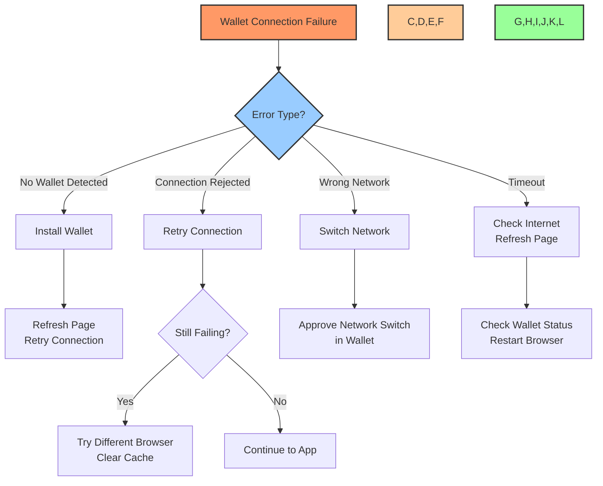
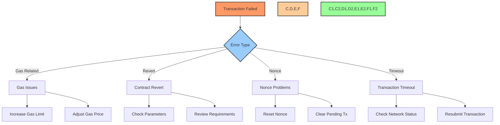

# 🔧 Troubleshooting Guide

## 📋 Table of Contents
- [🔍 Overview](#overview)
- [🌐 Connection Issues](#connection-issues)
- [👤 Authentication Problems](#authentication-problems)
- [🗳️ Governance & Voting Troubleshooting](#governance--voting-troubleshooting)
- [💰 Treasury Management Issues](#treasury-management-issues)
- [🪙 Token & Delegation Problems](#token--delegation-problems)
- [📱 Mobile & Responsive Issues](#mobile--responsive-issues)
- [🔄 Transaction Failures](#transaction-failures)
- [🌡️ Performance Problems](#performance-problems)
- [🖥️ Browser Compatibility](#browser-compatibility)
- [🚨 Error Messages Reference](#error-messages-reference)

## 🔍 Overview

This troubleshooting guide provides solutions for common issues encountered when using the BAD DAO UI. Each section addresses specific problem areas with step-by-step resolution procedures and explanations of underlying causes.

## 🌐 Connection Issues

### Unable to Connect to Network

**Symptoms:**
- "Network Error" message displayed
- Spinners that never complete loading
- "Cannot connect to blockchain" error

**Possible Causes:**
1. Internet connection issues
2. RPC endpoint failures
3. Network congestion
4. Firewall or security settings blocking connections

**Resolution Steps:**

1. **Check your internet connection**
   - Verify you have stable internet access
   - Try opening other websites to confirm connectivity
   - Reset your router if necessary

2. **Switch RPC providers**
   - Go to Settings > Network
   - Select a different RPC provider from the dropdown
   - Click "Save and Reconnect"

3. **Check for network status**
   - Visit [https://status.baddao.io](https://status.baddao.io) for current network status
   - Check if others are reporting similar issues on Discord or Twitter

4. **Disable VPN or proxy**
   - Some VPNs may block blockchain connections
   - Try temporarily disabling your VPN or proxy

### Website Not Loading

**Symptoms:**
- Blank screen
- Partial loading of interface
- "Failed to fetch" errors in console

**Resolution Steps:**

1. **Refresh the page**
   - Try a hard refresh (Ctrl+F5 or Cmd+Shift+R)
   - Clear browser cache and cookies

2. **Check browser compatibility**
   - Ensure you're using a supported browser (Chrome, Firefox, Brave, Edge)
   - Update your browser to the latest version

3. **Try an alternative access method**
   - Use a different browser
   - Try accessing via mobile device
   - Use a different internet connection

4. **Check for browser extensions**
   - Disable ad blockers or privacy extensions
   - Try opening in incognito/private browsing mode

## 👤 Authentication Problems

### Wallet Connection Failures

**Symptoms:**
- "No wallet detected" error
- Wallet connection window doesn't appear
- Connection attempt times out
- Wallet prompts but connection fails

**Resolution Steps:**

1. **Ensure wallet is installed and unlocked**
   - Check that your wallet extension is installed
   - Make sure your wallet is unlocked
   - Verify the wallet extension is enabled in your browser

2. **Check for wallet updates**
   - Update your wallet to the latest version
   - Check if the wallet provider has reported any issues

3. **Reset wallet connection**
   - Click "Disconnect" if available
   - In MetaMask, go to Settings > Advanced > Reset Account
   - Refresh the page and try reconnecting

4. **Try alternative connection method**
   - If using MetaMask, try WalletConnect instead
   - Use a different device or browser
   - Try mobile wallet app with built-in browser

### Account Access Issues

**Symptoms:**
- Previously connected wallet not recognized
- "Wrong account" or "No permissions" errors
- Session expired messages

**Resolution Steps:**

1. **Reconnect your wallet**
   - Click "Connect Wallet" again
   - Verify you're selecting the correct account in your wallet

2. **Check wallet address**
   - Confirm you're using the same wallet address as before
   - Verify you have the correct account selected in your wallet

3. **Clear local storage**
   - Go to Settings > Privacy > Clear Session Data
   - Refresh the page and reconnect your wallet

4. **Check for multiple wallet extensions**
   - Disable conflicting wallet extensions
   - Ensure only one wallet is active at a time

## 🗳️ Governance & Voting Troubleshooting

### Unable to Create Proposals

**Symptoms:**
- "Insufficient voting power" error
- Proposal creation form doesn't submit
- Transaction fails when creating proposal

**Resolution Steps:**

1. **Check token requirements**
   - Verify you have sufficient tokens to create a proposal
   - BAD DAO requires holding at least X% of total supply to create proposals
   - Check if your tokens are properly delegated

2. **Verify proposal parameters**
   - Ensure all required fields are completed
   - Check that your proposal description meets length requirements
   - Verify that any on-chain actions have valid parameters

3. **Check for existing similar proposals**
   - The system may prevent duplicate proposals
   - Review existing proposals to ensure yours is unique

4. **Review gas settings**
   - Ensure you have enough ETH for gas fees
   - Try increasing gas limit for complex proposals

### Voting Issues

**Symptoms:**
- Vote transaction fails
- "Already voted" error despite not voting
- Vote not being counted correctly

**Resolution Steps:**

1. **Check voting eligibility**
   - Verify you held tokens before the proposal snapshot
   - Ensure your tokens are not locked or staked elsewhere
   - Check if the voting period is still active

2. **Review previous transactions**
   - Check your wallet transaction history
   - Verify if a previous vote transaction was successful but not reflected

3. **Clear proposal cache**
   - Go to Settings > Cache > Clear Governance Data
   - Refresh the page and try voting again

4. **Try alternative voting method**
   - If voting through the UI fails, try using a block explorer to interact directly with the contract
   - Contact support for guidance on manual voting procedures

## 💰 Treasury Management Issues

### Treasury Assets Not Displaying

**Symptoms:**
- Treasury page shows loading indefinitely
- "Failed to load treasury data" error
- Assets appear but with missing values or icons

**Resolution Steps:**

1. **Refresh treasury data**
   - Click the refresh button on the treasury page
   - Try switching between different time periods
   - Clear browser cache and reload

2. **Check for indexer issues**
   - Treasury data relies on blockchain indexers
   - Check status.baddao.io for indexer status
   - Wait 15-30 minutes if indexer is syncing

3. **Try alternative views**
   - Switch between chart and list views
   - Try filtering by asset type
   - View treasury on block explorer directly

4. **Network congestion**
   - During high congestion, data may be delayed
   - Try switching to a different RPC provider in settings

### Treasury Transaction Creation Failures

**Symptoms:**
- Transaction builder form doesn't submit
- "Invalid parameters" error
- Transaction simulation fails

**Resolution Steps:**

1. **Check transaction parameters**
   - Verify all address fields use valid addresses
   - Ensure amount fields have proper formatting (no commas, correct decimals)
   - Check that transaction doesn't exceed available treasury balance

2. **Review contract interactions**
   - For complex transactions, verify the contract ABI is correct
   - Ensure function parameters match expected types
   - Try simplifying the transaction (split into multiple smaller transactions)

3. **Check gas settings**
   - Treasury transactions may require higher gas limits
   - Ensure you have sufficient ETH for gas
   - Try setting a higher gas price during network congestion

4. **Permissions check**
   - Verify your role has permission to create treasury transactions
   - Check if the treasury is currently locked by another operation

## 🪙 Token & Delegation Problems

### Token Balance Issues

**Symptoms:**
- Token balance shows zero despite owning tokens
- Balance doesn't update after transfers
- Inconsistent balance across different pages

**Resolution Steps:**

1. **Verify on blockchain explorer**
   - Check your balance on Etherscan or similar explorer
   - Confirm the tokens are in the correct wallet address
   - Verify the contract address matches official BAD token

2. **Refresh token data**
   - Click the refresh button next to your balance
   - Try disconnecting and reconnecting your wallet
   - Clear cache and reload the application

3. **Check for pending transactions**
   - Look for pending transactions in your wallet
   - Verify no transactions are stuck that might affect balance
   - Check for token approvals that might lock tokens

4. **Network issues**
   - Ensure you're connected to the correct network
   - Try switching RPC providers in settings
   - Wait for network congestion to clear

### Delegation Problems

**Symptoms:**
- "Delegation failed" error
- Voting power not updating after delegation
- Previous delegation still showing despite changes

**Resolution Steps:**

1. **Check delegation transaction**
   - Verify if the delegation transaction was successful
   - Check blockchain explorer for transaction status
   - Look for error messages in transaction details

2. **Verify delegation status**
   - Go to Profile > Delegation History
   - Check current delegation status and timestamp
   - Compare with blockchain data

3. **Clear delegation cache**
   - Go to Settings > Cache > Clear Delegation Data
   - Refresh the page and check delegation status again

4. **Try manual delegation**
   - Use block explorer to interact directly with the contract
   - Call the `delegate` function with the target address
   - Check voting power after transaction confirms

## 📱 Mobile & Responsive Issues

### Mobile Display Problems

**Symptoms:**
- Elements overlapping or cut off
- Controls not responding to touch
- Text too small or unreadable
- Horizontal scrolling required

**Resolution Steps:**

1. **Try different orientation**
   - Switch between portrait and landscape
   - Check if responsive design adapts correctly

2. **Update browser or app**
   - Ensure you're using the latest version of your mobile browser
   - Check for OS updates that might affect browser rendering

3. **Clear cache and cookies**
   - Clear browser cache and cookies
   - Try opening in private/incognito mode

4. **Browser compatibility**
   - Try an alternative browser (Chrome, Safari, Firefox)
   - Check if the issue is browser-specific

### Mobile Wallet Connection Issues

**Symptoms:**
- QR code doesn't scan
- WalletConnect pairing fails
- Connection times out on mobile

**Resolution Steps:**

1. **WalletConnect troubleshooting**
   - Ensure you have the latest WalletConnect version
   - Try disconnecting all existing sessions
   - Scan the QR code in good lighting
   - Make sure camera permissions are enabled

2. **In-app browser approach**
   - Open the BAD DAO website directly in your wallet's browser
   - Use the connect button within the wallet browser
   - Follow wallet-specific connection prompts

3. **Network connectivity**
   - Ensure stable internet connection
   - Try switching from Wi-Fi to cellular data or vice versa
   - Check if your mobile network blocks required ports

4. **Device compatibility**
   - Verify your device meets minimum requirements
   - Check if your OS version is supported
   - Try with a different mobile device if available

## 🔄 Transaction Failures

### Common Transaction Errors

**Common Error Types and Solutions:**

1. **Insufficient Gas**
   - **Error:** "Transaction underpriced" or "Out of gas"
   - **Solution:** Increase gas limit and/or gas price
   
2. **Contract Reverted**
   - **Error:** "Transaction reverted" or "Execution reverted"
   - **Solution:** Check transaction parameters, verify conditions (e.g., voting period active)
   
3. **Nonce Issues**
   - **Error:** "Nonce too low" or "Nonce too high"
   - **Solution:** Reset account nonce in wallet settings or clear pending transactions
   
4. **Slippage/Deadline**
   - **Error:** "Transaction expired" or "Slippage tolerance exceeded"
   - **Solution:** Increase slippage tolerance or adjust deadline
   
5. **Approval Required**
   - **Error:** "Not enough allowance"
   - **Solution:** Approve token spending before transaction

### Gas Optimization

**Tips for reducing gas costs:**

1. **Transaction timing**
   - Execute transactions during low network congestion periods
   - Check [https://etherscan.io/gastracker](https://etherscan.io/gastracker) for current gas prices
   
2. **Gas settings**
   - Use "Advanced" gas settings in your wallet
   - Set a reasonable gas limit (avoid setting unnecessarily high)
   - Choose appropriate gas price based on urgency
   
3. **Batch operations**
   - Group multiple similar operations into a single transaction when possible
   - Use multicall functionality for reading data
   
4. **Clear pending transactions**
   - Cancel or speed up stuck transactions before submitting new ones
   - Reset nonce if you have multiple pending transactions

## 🌡️ Performance Problems

### Slow Loading Times

**Symptoms:**
- Pages take a long time to load
- UI feels sluggish or unresponsive
- Interactions have noticeable delay

**Resolution Steps:**

1. **Check network speed**
   - Run a speed test to check your internet connection
   - Try a different network if available
   
2. **Optimize browser**
   - Close unnecessary tabs and applications
   - Clear browser cache and cookies
   - Disable unnecessary extensions
   
3. **Review device resources**
   - Check CPU and memory usage
   - Close resource-intensive applications
   - Restart your device if it's been running for a long time
   
4. **Application settings**
   - Go to Settings > Performance
   - Enable "Lite Mode" for better performance
   - Reduce animation effects
   - Disable real-time updates

### High Resource Usage

**Symptoms:**
- Browser warning about high memory usage
- Fan spinning at high speed
- Battery draining quickly
- Device heating up

**Resolution Steps:**

1. **Identify resource-intensive components**
   - Check which sections of the app cause high usage
   - Avoid keeping transaction history or analytics open for extended periods
   
2. **Update graphics drivers**
   - Ensure your graphics drivers are up to date
   - Enable hardware acceleration if available
   
3. **Application settings**
   - Reduce data refresh rates in settings
   - Disable auto-playing charts and animations
   - Use simplified view options
   
4. **Browser optimization**
   - Try a different browser
   - Ensure browser is updated to the latest version
   - Disable unnecessary extensions

## 🖥️ Browser Compatibility

### Supported Browsers

| Browser | Minimum Version | Recommended Version | Notes |
|---------|----------------|---------------------|-------|
| Chrome | 80+ | Latest | Best experience, recommended |
| Firefox | 78+ | Latest | Fully supported |
| Brave | 1.20+ | Latest | Fully supported |
| Edge | 80+ | Latest | Fully supported |
| Safari | 14+ | Latest | Mostly supported, minor visual differences |
| Opera | 67+ | Latest | Fully supported |

### Handling Browser-Specific Issues

**Chrome Issues:**
- If wallet connection fails, check that extensions are enabled in incognito mode
- Clear site data specifically for baddao.io domain
- Try disabling hardware acceleration for rendering issues

**Firefox Issues:**
- Enable "Enhanced Tracking Protection" exceptions for baddao.io
- Check if privacy extensions are blocking required scripts
- Increase content process limit in about:config

**Safari Issues:**
- Enable JavaScript in Safari preferences
- Allow all cookies for baddao.io
- Check if Intelligent Tracking Prevention is blocking functionality

**Mobile Browser Tips:**
- Use landscape mode for complex interfaces
- Chrome for Android and Safari for iOS provide best experience
- Mobile wallet browsers may provide better integration

## 🚨 Error Messages Reference

### Common Error Codes

| Error Code | Message | Cause | Resolution |
|------------|---------|-------|------------|
| ERR_CONN_01 | "Failed to connect wallet" | Wallet extension issue or permission denied | Refresh page, check wallet is unlocked |
| ERR_CONN_02 | "Unsupported network" | Connected to wrong blockchain network | Switch to supported network |
| ERR_GOV_01 | "Insufficient voting power" | Not enough tokens to perform action | Acquire more tokens or check delegation |
| ERR_GOV_02 | "Proposal already executed" | Attempting to vote on executed proposal | No action needed, proposal complete |
| ERR_VOTE_01 | "Voting period ended" | Proposal voting deadline passed | No action needed, voting closed |
| ERR_TXN_01 | "Transaction underpriced" | Gas price too low | Increase gas price and retry |
| ERR_TXN_02 | "Gas estimation failed" | Transaction would fail on-chain | Check parameters, contract state |
| ERR_API_01 | "API request failed" | Backend service unavailable | Retry later, check status page |
| ERR_TREAS_01 | "Insufficient treasury balance" | Treasury action exceeds available funds | Modify transaction amount |
| ERR_TREAS_02 | "Invalid asset address" | Incorrect token contract address | Verify token contract address |

### Interpreting Blockchain Errors

**Execution Reverted:**
This error occurs when a smart contract rejects the transaction. Common causes include:
- Failing to meet requirements (e.g., token threshold)
- Attempting an action during invalid state (e.g., voting on inactive proposal)
- Invalid parameters or inputs
- Contract safety checks failing

**How to troubleshoot:**
1. Check transaction parameters carefully
2. Review documentation for specific function requirements
3. Verify current state (e.g., is proposal active?)
4. Look for specific error message in transaction trace

**Gas-Related Errors:**
- "Out of gas" - Transaction ran out of computational resources
- "Gas limit reached" - Transaction hit the block gas limit
- "Fee cap too low" - Max fee lower than current base fee

**How to troubleshoot:**
1. Increase gas limit for complex transactions
2. During high congestion, increase max fee and priority fee
3. Consider simplifying transaction (breaking into multiple steps)
4. Wait for lower network congestion

### Contacting Support

If you've tried the troubleshooting steps and still encounter issues:

1. **Gather information**
   - Error messages and codes
   - Transaction hashes (if applicable)
   - Screenshots of the issue
   - Steps to reproduce
   - Browser and wallet versions
   - Device information

2. **Contact support through:**
   - Discord support channel: [discord.gg/baddao](https://discord.gg/baddao)
   - Email: support@baddao.io
   - Support ticket: [support.baddao.io](https://support.baddao.io)

3. **Security concerns:**
   For urgent security issues, please contact security@baddao.io directly.

---

Made with Power, Love, and AI •  ⚡️❤️🤖 •  POWERBRIDGE.AI 