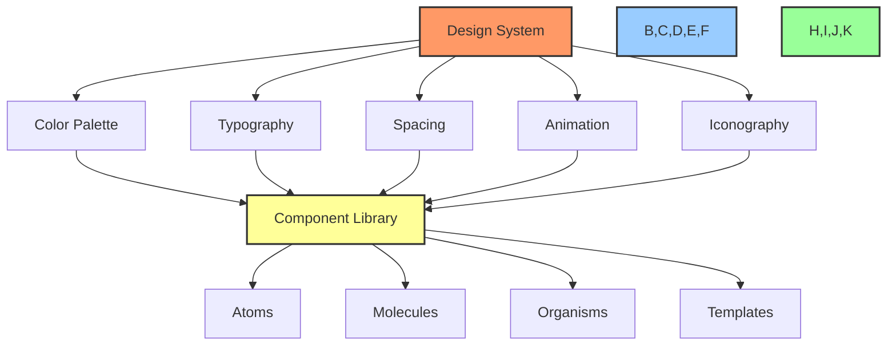

# 🧩 Reusable UI Component Documentation

## 📋 Table of Contents
- [🔍 Overview](#overview)
- [🎯 Purpose](#purpose)
- [🎨 Design System Integration](#design-system-integration)
- [📦 Core Components](#core-components)
- [📱 Responsive Behavior](#responsive-behavior)
- [♿ Accessibility](#accessibility)
- [🧪 Testing Guidelines](#testing-guidelines)
- [📊 Implementation Status](#implementation-status)

## 🔍 Overview

This document catalogs the reusable UI components for the BAD DAO UI, providing comprehensive documentation on component usage, properties, styling, and implementation best practices. The component library serves as the foundation for consistent UI development across the application.

## 🎯 Purpose

This component library documentation aims to:
- Create a single source of truth for UI components
- Standardize component usage across the application
- Accelerate development through reusable components
- Ensure consistency in UI/UX implementation
- Provide clear guidelines for component extension

## 🎨 Design System Integration

All components adhere to the design system defined in [design-system.md](./design-system.md). This includes:

- **Color Palettes**: Consistent use of primary, secondary, and accent colors
- **Typography**: Standard font families, sizes, and weights
- **Spacing System**: Consistent margins, padding, and layout spacing
- **Animation**: Standard transitions and motion patterns
- **Iconography**: Unified icon system and usage guidelines



## 📦 Core Components

### 🔘 Button Component
```tsx
// Button.tsx
interface ButtonProps {
  variant: 'primary' | 'secondary' | 'tertiary';
  size: 'small' | 'medium' | 'large';
  label: string;
  icon?: React.ReactNode;
  disabled?: boolean;
  loading?: boolean;
  onClick?: () => void;
}

const Button: React.FC<ButtonProps> = ({
  variant = 'primary',
  size = 'medium',
  label,
  icon,
  disabled = false,
  loading = false,
  onClick,
}) => {
  // Component implementation
}
```

#### Button Usage
```tsx
<Button 
  variant="primary"
  size="medium"
  label="Connect Wallet"
  onClick={() => connectWallet()}
  disabled={isConnecting}
  loading={isConnecting}
/>
```

#### Variants
| Variant | Usage | Preview |
|---------|-------|---------|
| Primary | Main actions | 🟢 Implemented |
| Secondary | Alternative actions | 🟡 In Progress |
| Tertiary | Subtle actions | 🔴 Not Started |

### 🗃️ Card Component
```tsx
// Card.tsx
interface CardProps {
  title?: string;
  subtitle?: string;
  children: React.ReactNode;
  variant?: 'default' | 'outlined' | 'elevated';
  onClick?: () => void;
}

const Card: React.FC<CardProps> = ({
  title,
  subtitle,
  children,
  variant = 'default',
  onClick,
}) => {
  // Component implementation
}
```

#### Card Usage
```tsx
<Card
  title="Proposal #123"
  subtitle="Treasury allocation"
  variant="elevated"
  onClick={() => viewProposalDetails(123)}
>
  <ProposalSummary proposal={proposal} />
</Card>
```

#### Variants
| Variant | Usage | Preview |
|---------|-------|---------|
| Default | Regular content cards | 🟢 Implemented |
| Outlined | Subtle container | 🟡 In Progress |
| Elevated | Prominent card with shadow | 🟡 In Progress |

### 📊 Data Visualization Components
- 🟡 In Progress
- Implementation for charts, graphs, and data tables in development

## 📱 Responsive Behavior

All components are designed with responsive behavior using these breakpoints:

```scss
// Breakpoints
$breakpoints: (
  xs: 0,
  sm: 576px,
  md: 768px,
  lg: 992px,
  xl: 1200px,
  xxl: 1400px
);
```

### Responsive Component Example
```tsx
// ResponsiveNavigation.tsx
const ResponsiveNavigation: React.FC = () => {
  const isMobile = useMediaQuery('(max-width: 768px)');
  
  return (
    <nav>
      {isMobile ? (
        <MobileNavigation />
      ) : (
        <DesktopNavigation />
      )}
    </nav>
  );
};
```

### Mobile-First Approach
All components follow a mobile-first approach, where:
- Base styles are for mobile devices
- Media queries enhance the experience for larger screens
- Touch targets are appropriately sized for mobile interactions
- Layouts adapt to different screen sizes

## ♿ Accessibility

All components adhere to WCAG 2.1 AA standards including:

| Requirement | Implementation |
|-------------|----------------|
| Keyboard Navigation | Focus states, tab order, keyboard shortcuts |
| Screen Reader Support | ARIA labels, semantic HTML, role attributes |
| Color Contrast | Minimum 4.5:1 for normal text, 3:1 for large text |
| Text Resizing | Supports zoom up to 200% without breaking layouts |
| Reduced Motion | Respects prefers-reduced-motion media query |

### Accessibility Example
```tsx
// Accessible Button
<button
  aria-label={ariaLabel || label}
  aria-disabled={disabled}
  onClick={onClick}
  className={`btn btn-${variant} btn-${size} ${disabled ? 'disabled' : ''}`}
  disabled={disabled}
>
  {icon && <span className="btn-icon" aria-hidden="true">{icon}</span>}
  <span className="btn-text">{label}</span>
  {loading && <Spinner aria-hidden="true" />}
</button>
```

## 🧪 Testing Guidelines

### Component Testing Strategy
- **Unit Tests**: For individual component functionality
- **Visual Tests**: For appearance and layout using Storybook
- **Integration Tests**: For component interactions
- **Accessibility Tests**: Using axe-core and manual testing

### Test Example
```tsx
// Button.test.tsx
describe('Button Component', () => {
  it('renders correctly', () => {
    render(<Button label="Test Button" />);
    expect(screen.getByText('Test Button')).toBeInTheDocument();
  });
  
  it('handles click events', () => {
    const onClick = jest.fn();
    render(<Button label="Clickable Button" onClick={onClick} />);
    fireEvent.click(screen.getByText('Clickable Button'));
    expect(onClick).toHaveBeenCalledTimes(1);
  });
  
  it('shows loading state', () => {
    render(<Button label="Loading Button" loading={true} />);
    expect(screen.getByRole('status')).toBeInTheDocument();
  });
});
```

## 📊 Implementation Status

| Component Category | Design | Implementation | Testing | Documentation |
|-------------------|--------|----------------|---------|---------------|
| Buttons | 🟢 Complete | 🟡 In Progress | 🔴 Not Started | 🟢 Complete |
| Cards | 🟢 Complete | 🟡 In Progress | 🔴 Not Started | 🟢 Complete |
| Forms | 🟡 In Progress | 🔴 Not Started | 🔴 Not Started | 🟡 In Progress |
| Navigation | 🟢 Complete | 🟡 In Progress | 🔴 Not Started | 🟡 In Progress |
| Data Visualization | 🟡 In Progress | 🔴 Not Started | 🔴 Not Started | 🔴 Not Started |
| Modals & Dialogs | 🟢 Complete | 🔴 Not Started | 🔴 Not Started | 🟡 In Progress |
| Loaders & Feedback | 🟢 Complete | 🟡 In Progress | 🔴 Not Started | 🟡 In Progress |

### 🔄 Next Steps
1. Complete implementation of primary button variants
2. Finalize form component designs
3. Begin implementation of data visualization components
4. Setup Storybook documentation for all completed components
5. Implement component testing framework

### 📝 Integration Notes
- All components should follow naming conventions from [code-standards.md](../development/code-standards.md)
- Component props should use TypeScript interfaces
- Each component should have corresponding story in Storybook
- Components should be exported from a central index file for easy imports

---

Made with Power, Love, and AI •  ⚡️❤️🤖 •  POWERBRIDGE.AI 