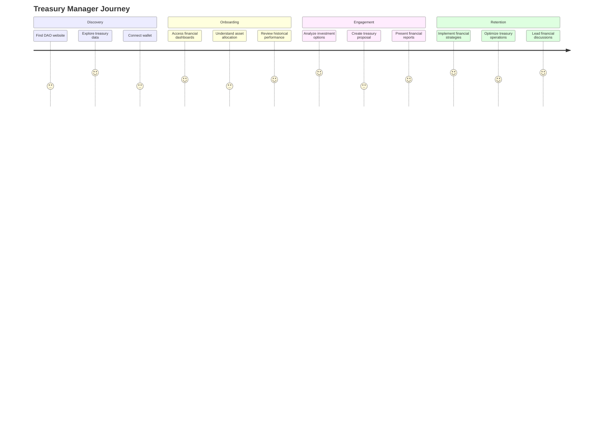
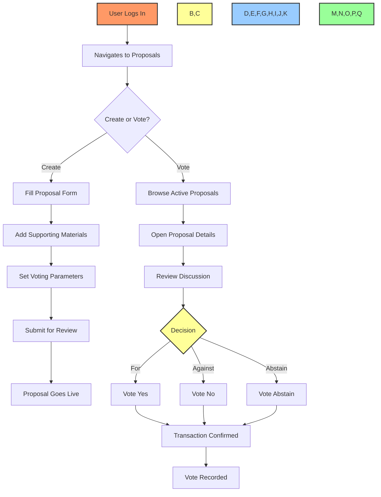
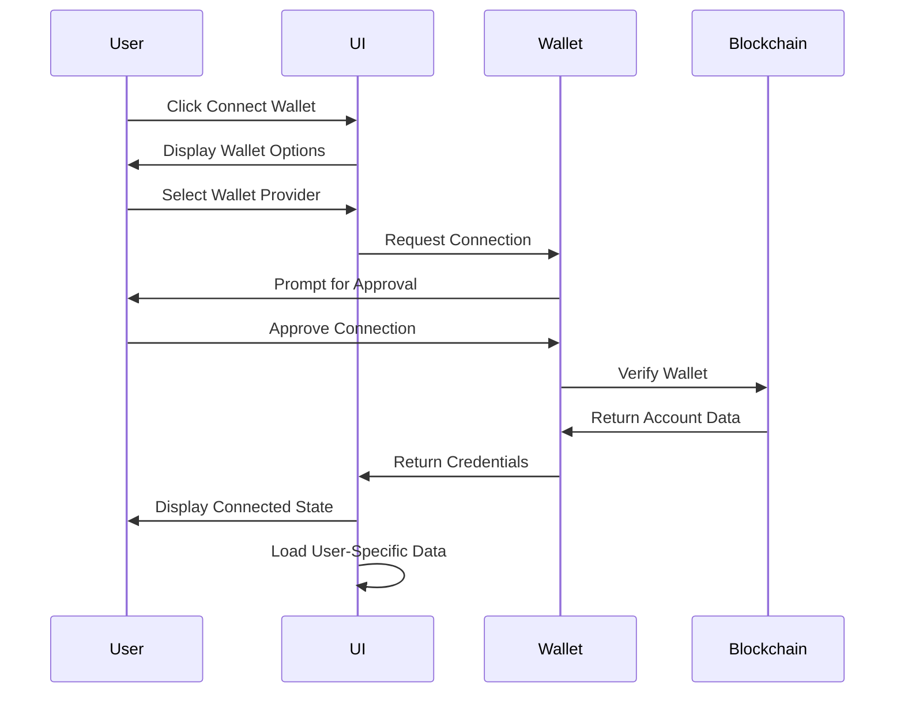
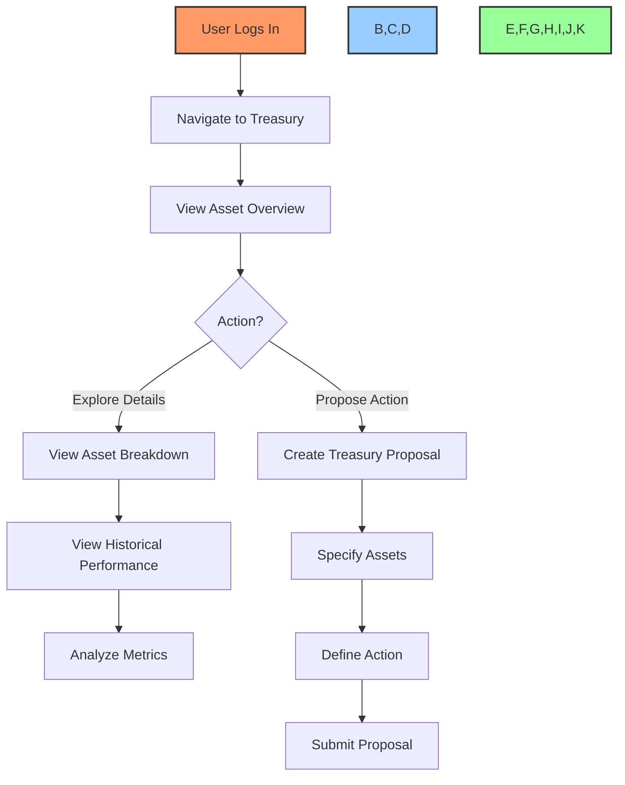

# 🔄 User Journey Maps and Flows

## 📋 Table of Contents
- [🔍 Overview](#overview)
- [🎯 Purpose](#purpose)
- [👤 User Personas](#user-personas)
- [🗺️ Journey Maps](#journey-maps)
- [📊 Key User Flows](#key-user-flows)
- [📈 Analytics Integration](#analytics-integration)
- [🔄 Implementation Status](#implementation-status)

## 🔍 Overview

This document outlines the user journey maps and flows for the BAD DAO UI, providing a comprehensive visualization of how different user types interact with the platform throughout their experience lifecycle.

## 🎯 Purpose

These user flows and journey maps aim to:
- Define the complete user experience from first contact to regular usage
- Identify key touchpoints and potential friction points
- Guide development priorities based on user needs
- Establish metrics for measuring user success
- Serve as a reference for UX design decisions

## 👤 User Personas

### 🧑‍💼 Governance Participant
- **Profile**: Regular DAO member interested in governance
- **Goals**: Vote on proposals, track DAO progress, participate in discussions
- **Pain Points**: Complexity of governance, tracking proposal status
- **Usage Frequency**: Weekly
- **Technical Proficiency**: Moderate

### 💰 Treasury Manager
- **Profile**: Financially-focused DAO contributor
- **Goals**: Monitor treasury assets, analyze financial health, propose allocations
- **Pain Points**: Lack of financial tools, complex reporting
- **Usage Frequency**: Daily
- **Technical Proficiency**: High

### 🚀 Proposal Creator
- **Profile**: Innovative community member with ideas
- **Goals**: Create proposals, gather support, track voting outcomes
- **Pain Points**: Difficulty expressing complex ideas, gathering feedback
- **Usage Frequency**: Monthly
- **Technical Proficiency**: Varies

### 🔎 Observer
- **Profile**: Potential member or interested party
- **Goals**: Understand DAO operations, assess health before joining
- **Pain Points**: Limited transparency, complex jargon
- **Usage Frequency**: Sporadic
- **Technical Proficiency**: Low to moderate

## 🗺️ Journey Maps

### 🧑‍💼 Governance Participant Journey

### 💰 Treasury Manager Journey

## 📊 Key User Flows

### 🗳️ Proposal Creation & Voting Flow

### 🔑 Wallet Connection Flow

### 💰 Treasury Dashboard Flow

## 📈 Analytics Integration

This section outlines how user flows are instrumented with analytics to measure success:

### 🎯 Key Performance Indicators
- **Voting Participation Rate**: % of eligible voters who cast votes
- **Proposal Completion Rate**: % of proposal creators who complete submission
- **Session Duration**: Average time spent in governance sections
- **Feature Adoption**: % of users utilizing each core feature
- **Retention Rate**: % of users returning within 30 days

### 📊 Flow Success Metrics
| User Flow | Success Metric | Target | Current |
|-----------|----------------|--------|---------|
| Wallet Connection | Completion Rate | 90% | 🟡 75% |
| Proposal Creation | Submission Rate | 80% | 🔴 62% |
| Voting Process | Vote Confirmation | 95% | 🟢 96% |
| Treasury Review | Engagement Time | 3min | 🟡 2.5min |

## 🔄 Implementation Status

| User Flow | Design | Development | Testing |
|-----------|--------|-------------|---------|
| Wallet Connection | 🟢 Complete | 🟡 In Progress | 🔴 Not Started |
| Proposal Creation | 🟢 Complete | 🔴 Not Started | 🔴 Not Started |
| Proposal Voting | 🟡 In Progress | 🔴 Not Started | 🔴 Not Started |
| Treasury Management | 🟡 In Progress | 🔴 Not Started | 🔴 Not Started |
| User Profile | 🔴 Not Started | 🔴 Not Started | 🔴 Not Started |
| Notification Flow | 🔴 Not Started | 🔴 Not Started | 🔴 Not Started |

### 📝 Integration Notes
- User flows should be implemented in order of priority: Wallet Connection → Proposal Voting → Treasury Management
- Each flow should include appropriate error handling and recovery paths
- All flows should include analytics tracking to measure success metrics
- Accessibility considerations must be integrated throughout all user journeys

---

Made with Power, Love, and AI •  ⚡️❤️🤖 •  POWERBRIDGE.AI 