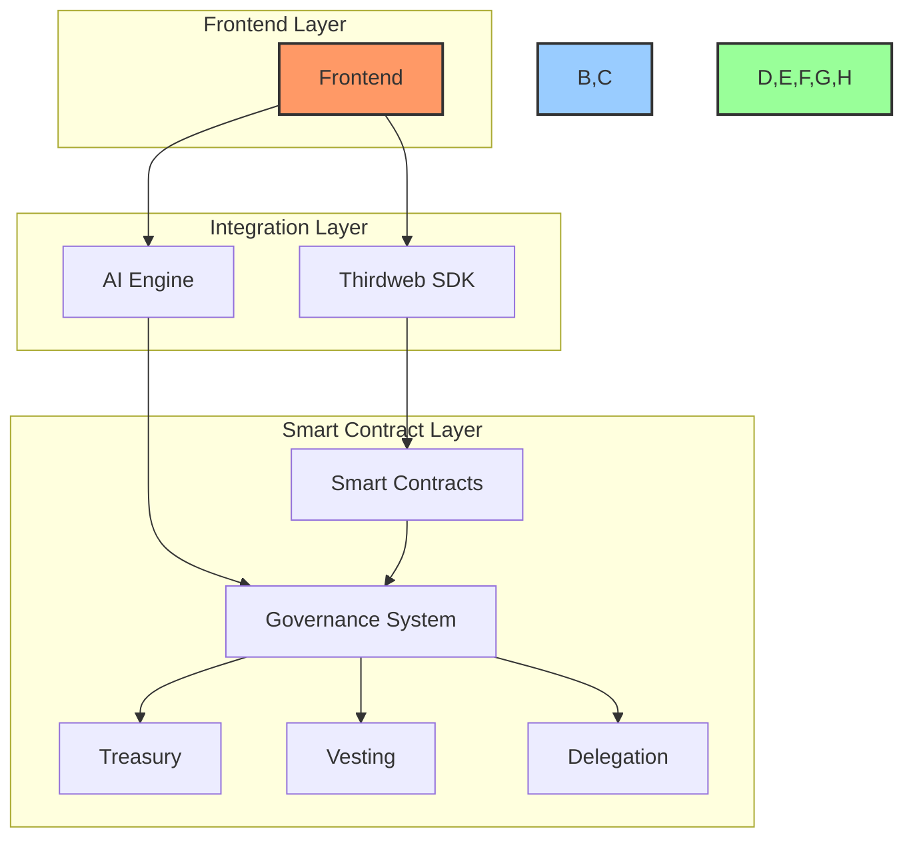
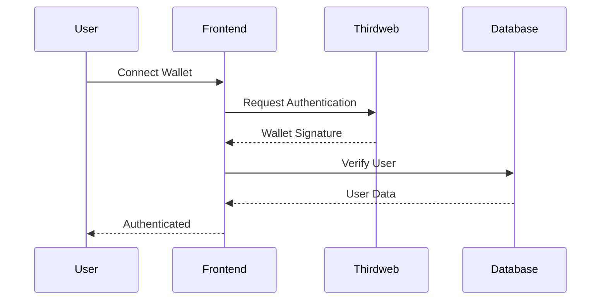
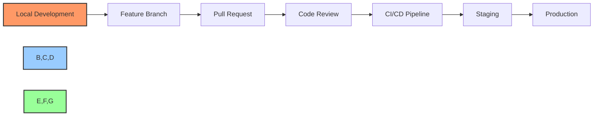

# 🛠️ BAD DAO UI - Development Notes

## 🔧 System Architecture

### Component Overview



## ⚙️ Technical Specifications

### Frontend Stack
- Framework: Next.js 14
- UI Library: React
- State Management: Redux Toolkit
- Styling: Tailwind CSS
- Component Library: Shadcn/ui
- Testing: Jest + React Testing Library

### Backend Integration
- Thirdweb SDK v4
- Smart Contract Templates:
  - Governance
  - Vesting
  - Delegation
  - Treasury Management

### AI Integration
- OpenAI API
- Custom NLP Pipeline
- Voice Recognition: Web Speech API
- Chat Interface: Custom implementation

## 📦 Dependencies

```json
{
  "dependencies": {
    "next": "^14.0.0",
    "react": "^18.2.0",
    "react-dom": "^18.2.0",
    "@thirdweb-dev/react": "^4.0.0",
    "@thirdweb-dev/sdk": "^4.0.0",
    "@reduxjs/toolkit": "^2.0.0",
    "tailwindcss": "^3.3.0",
    "shadcn/ui": "^0.0.1",
    "openai": "^4.0.0"
  }
}
```

## 🔌 API Endpoints

### Thirdweb Integration
```typescript
// Smart Contract Deployment
POST /api/deploy-contract
{
  contractType: "governance" | "vesting" | "delegation",
  params: object
}

// Contract Interaction
POST /api/contract-interaction
{
  contractAddress: string,
  method: string,
  params: object
}
```

### AI Integration
```typescript
// Proposal Generation
POST /api/generate-proposal
{
  prompt: string,
  context: object
}

// Voice Command Processing
POST /api/process-voice
{
  audio: Blob,
  context: object
}
```

## 🗄️ Database Schema

### User Management
```sql
CREATE TABLE users (
  id UUID PRIMARY KEY,
  wallet_address VARCHAR(42) UNIQUE,
  role VARCHAR(50),
  created_at TIMESTAMP,
  updated_at TIMESTAMP
);

CREATE TABLE dao_members (
  user_id UUID REFERENCES users(id),
  dao_id UUID,
  role VARCHAR(50),
  voting_power DECIMAL,
  PRIMARY KEY (user_id, dao_id)
);
```

### DAO Configuration
```sql
CREATE TABLE daos (
  id UUID PRIMARY KEY,
  name VARCHAR(255),
  contract_address VARCHAR(42),
  created_at TIMESTAMP,
  updated_at TIMESTAMP
);

CREATE TABLE governance_rules (
  dao_id UUID REFERENCES daos(id),
  rule_type VARCHAR(50),
  parameters JSONB,
  PRIMARY KEY (dao_id, rule_type)
);
```

## 🔒 Security Implementation

### Authentication Flow


### Access Control
- Role-based permissions
- Multi-signature requirements
- Time-based restrictions
- Transaction limits

## 📊 Performance Requirements

### Response Times
- UI Load: < 2s
- Contract Interaction: < 5s
- AI Processing: < 3s
- Voice Command: < 2s

### Throughput
- Transactions: 1000 TPS
- AI Requests: 100 RPS
- Voice Processing: 50 RPS

## 🧪 Testing Strategy

### Unit Tests
- Component testing
- Contract testing
- AI processing testing
- Security testing

### Integration Tests
- End-to-end flows
- Contract interactions
- AI integration
- Performance testing

## 🔄 Development Workflow



## 📝 Implementation Notes

### Smart Contract Integration
- Use Thirdweb's pre-built contracts
- Custom extensions for AI features
- Gas optimization strategies
- Security best practices

### AI Implementation
- Natural language processing pipeline
- Context-aware responses
- Voice command processing
- Proposal generation logic

### UI/UX Considerations
- Responsive design
- Accessibility standards
- Dark/light mode
- Mobile optimization

## 🔄 Cross-References

- See [project-overview.md](./project-overview.md) for project scope
- See [file-tree.md](./file-tree.md) for project structure
- See [task-log.md](./task-log.md) for progress tracking
