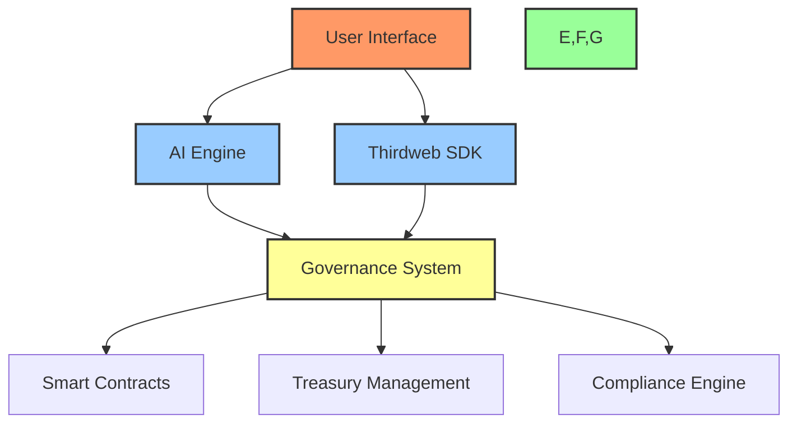
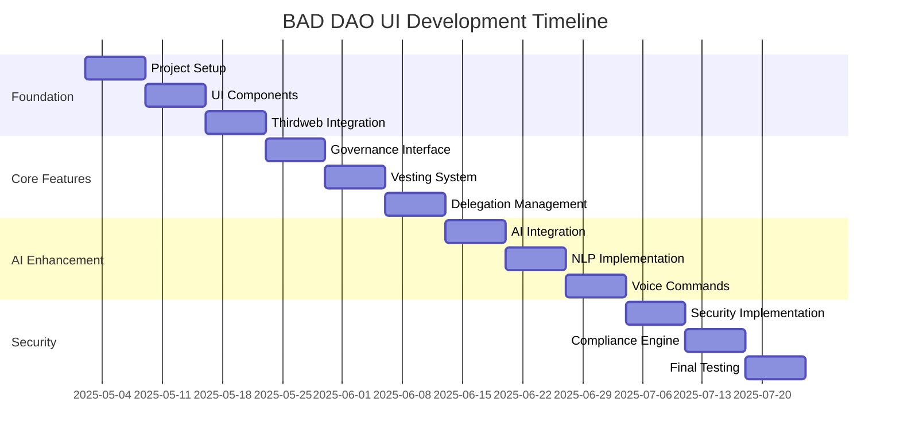

# 🏗️ BAD DAO UI - Project Overview

## 🔍 Executive Summary

BAD DAO UI is a no-code/low-code interface for designing, deploying, and managing decentralized autonomous organizations (DAOs) with integrated AI capabilities. The platform leverages Thirdweb's infrastructure for smart contract deployment and management, with a focus on governance, vesting, delegation, and treasury management.

## 🎯 Project Scope

### Core Features
- 🖥️ No-code/low-code DAO creation interface
- 🤖 AI-powered governance and proposal management
- 💰 Treasury management and protection
- 👥 Role-based access and delegation
- 📜 Compliance and regulation engine
- 🗳️ Voting and proposal system
- 🔒 Security and access control

### Technical Stack
- Frontend: React/Next.js
- Backend: Thirdweb SDK
- Smart Contracts: Thirdweb contracts
- AI Integration: Custom AI engine
- Deployment: Vercel
- CI/CD: GitHub Actions

## 📋 Key Deliverables

1. 🎨 UI/UX Design System
   - Component library
   - Design tokens
   - Responsive layouts

2. 🤖 AI Integration Layer
   - Natural language processing
   - Voice command support
   - Chat interface
   - Proposal generation

3. 📜 Smart Contract Interface
   - Contract deployment
   - Governance management
   - Vesting schedules
   - Delegation system

4. 🔒 Security Framework
   - Role-based access control
   - Treasury protection
   - Compliance engine
   - Audit logging

## ⚙️ Technical Approach

### Architecture Overview

### Development Phases

1. 🚀 Phase 1: Foundation (Week 1)
   - Project setup
   - Basic UI components
   - Thirdweb integration
   - Smart contract templates

2. 🏗️ Phase 2: Core Features (Week 2)
   - Governance interface
   - Vesting system
   - Delegation management
   - Basic AI integration

3. 🤖 Phase 3: AI Enhancement (Week 3)
   - Advanced AI features
   - Natural language processing
   - Voice commands
   - Proposal generation

4. 🔒 Phase 4: Security & Compliance (Week 4)
   - Security implementation
   - Compliance engine
   - Treasury protection
   - Audit system

## 📊 Success Metrics

- 🎯 User Adoption
  - Number of DAOs created
  - Active users
  - Transaction volume

- ⚡ Performance
  - Response time
  - Transaction speed
  - AI processing time

- 🔒 Security
  - Audit results
  - Vulnerability fixes
  - Compliance status

## ⚠️ Risk Assessment

| Risk | Impact | Mitigation |
|------|--------|------------|
| Smart Contract Vulnerabilities | High | Regular audits, security testing |
| AI Integration Complexity | Medium | Phased implementation, testing |
| Thirdweb API Limitations | Medium | Fallback mechanisms, monitoring |
| Compliance Requirements | High | Regular updates, legal review |

## 📅 Timeline

## 🔄 Cross-References

- See [dev-notes.md](./dev-notes.md) for technical implementation details
- See [file-tree.md](./file-tree.md) for project structure
- See [task-log.md](./task-log.md) for progress tracking 