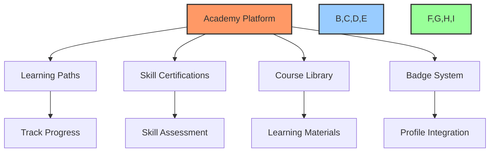
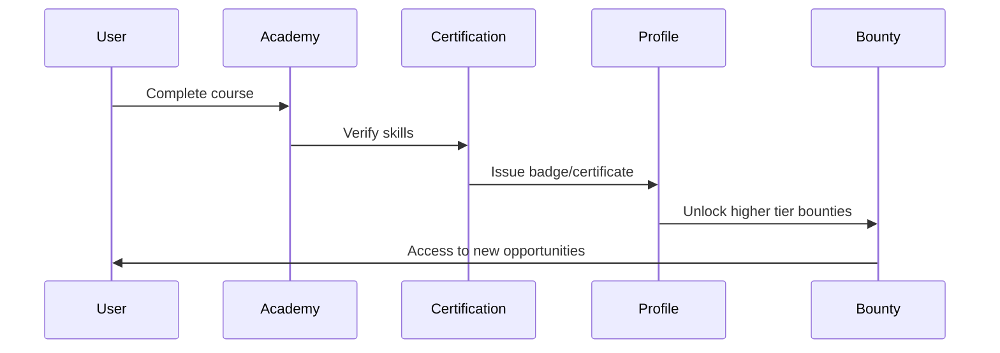

# 📚 Build a DAO Academy

## 🎯 Purpose & Vision

The Build a DAO Academy is an integrated learning platform designed to upskill contributors in blockchain and DAO-related technologies. The academy provides structured learning paths, skill certifications, and integration with the contributor profile system to track progress and demonstrate expertise.

## 🏗️ Core Components



### 1. Learning Paths 🛤️

Structured educational paths to guide contributors from beginner to expert in key areas:

- **Blockchain Fundamentals**
  - Cryptocurrency Basics
  - Blockchain Architecture
  - Consensus Mechanisms
  - Tokenomics

- **Smart Contract Development**
  - Solidity Programming
  - Smart Contract Security
  - Testing & Deployment
  - Auditing Techniques

- **DAO Governance**
  - Governance Mechanisms
  - Proposal Systems
  - Treasury Management
  - Voting Mechanisms

- **Web3 Development**
  - Frontend dApp Development
  - Web3 Libraries
  - DeFi Integration
  - NFT Development

- **AI Integration**
  - AI Tools for Web3
  - LLM Integration
  - Bot Development
  - Data Analysis for DAOs

### 2. Skill Certification System 🎓

- **Assessment Types**:
  - Multiple-choice exams
  - Coding challenges
  - Project submissions
  - Peer reviews

- **Certification Levels**:
  - Level 1: Beginner (Foundational knowledge)
  - Level 2: Intermediate (Practical application)
  - Level 3: Advanced (Complex implementation)
  - Level 4: Expert (Mastery and innovation)
  - Level 5: Authority (Teaching and contribution)

- **Validation Process**:
  - Automated assessment for basic skills
  - Expert review for advanced certifications
  - On-chain credential verification
  - Time-based renewal requirements

### 3. Badge & Achievement System 🏆

- **Badge Categories**:
  - Skill Proficiency (by technology)
  - Course Completion
  - Challenge Achievements
  - Contribution Recognition
  - Teaching/Mentoring

- **Badge Properties**:
  - Visual indicators for proficiency level
  - Acquisition date
  - Verification status
  - Expiration/renewal status

- **Integration Points**:
  - Displayed on contributor profiles
  - Visible in marketplace for job matching
  - Required for advanced bounty access
  - Factors into reputation scoring

### 4. Content Delivery 📱

- **Course Formats**:
  - Video lectures
  - Interactive tutorials
  - Hands-on coding exercises
  - Documentation and guides
  - Live workshops and webinars

- **Technology Stack**:
  - React-based frontend
  - Interactive code editors
  - Sandboxed execution environments
  - Progress tracking database
  - Certificate generation system

## 🔄 Integration with Contributor System



### Key Integration Points

1. **Profile Enhancement**:
   - Courses completed displayed on profile
   - Skill certifications shown as badges
   - Learning journey milestones highlighted

2. **Reputation Impact**:
   - Skill proficiency increases reputation score
   - Advanced certifications boost contributor ranking
   - Teaching/mentoring activities add multipliers

3. **Opportunity Access**:
   - Skill requirements for advanced bounties
   - Certification prerequisites for specialized roles
   - Fast-track options for verified experts

4. **Economic Incentives**:
   - Reduced fees for certified contributors
   - Higher revenue share based on expertise level
   - Premium access for teachers/mentors

## 💻 Technical Implementation

### Frontend Components

- **Academy Dashboard**: Overview of available courses, progress tracking, and recommendations
- **Course Viewer**: Interactive learning interface with multimedia content
- **Skill Assessment**: Testing interface with different question types and feedback
- **Achievement Gallery**: Visual display of earned badges and certifications
- **Learning Path Navigator**: Guided progression through related courses

### Backend Services

- **Content Management System**: Store and serve educational materials
- **Progress Tracking Service**: Monitor and persist user advancement
- **Assessment Engine**: Evaluate user knowledge and skills
- **Certification Service**: Issue and verify credentials
- **Badge Management**: Create, assign, and display achievement badges

### Data Models

```typescript
interface Course {
  id: string;
  title: string;
  description: string;
  difficulty: 'beginner' | 'intermediate' | 'advanced' | 'expert';
  categories: string[];
  prerequisites: string[];
  duration: number; // in minutes
  modules: Module[];
  badgeReward?: Badge;
}

interface Module {
  id: string;
  title: string;
  content: ContentBlock[];
  assessment?: Assessment;
}

interface ContentBlock {
  id: string;
  type: 'video' | 'text' | 'code' | 'quiz' | 'project';
  content: string;
  duration?: number;
}

interface Assessment {
  id: string;
  questions: Question[];
  passingScore: number;
  timeLimit?: number;
}

interface Badge {
  id: string;
  name: string;
  description: string;
  image: string;
  level: 1 | 2 | 3 | 4 | 5;
  category: string;
  requirements: string[];
  dateIssued?: Date;
  expiration?: Date;
}

interface UserProgress {
  userId: string;
  courseId: string;
  completed: boolean;
  progress: number; // percentage
  moduleStatus: Record<string, 'not_started' | 'in_progress' | 'completed'>;
  assessmentResults: Record<string, number>;
  badgesEarned: Badge[];
  lastAccessed: Date;
}
```

## 🚀 Implementation Roadmap

### Phase 1: Foundation (Weeks 1-4)
- Create Academy page and navigation
- Implement basic course viewer
- Design learning path structure
- Setup progress tracking

### Phase 2: Content & Assessment (Weeks 5-8)
- Develop initial courses for each learning path
- Build assessment engine
- Create skill certification process
- Implement basic badge system

### Phase 3: Integration (Weeks 9-12)
- Connect with contributor profiles
- Implement reputation impact
- Setup access control for bounties
- Create badge showcase

### Phase 4: Advanced Features (Weeks 13-16)
- Add interactive coding environments
- Implement peer review system
- Create teaching/mentoring tools
- Develop on-chain credential verification

## 🔐 Access & Permissions

- **Public Content**: Basic courses available to all users
- **Member Content**: Intermediate content requires basic registration
- **Premium Content**: Advanced courses for paying members or active contributors
- **Expert Content**: Specialized material for certified experts or mentors

## 📊 Success Metrics

- **Engagement**: Course completion rates, time spent learning
- **Skill Growth**: Certification attainment, skill level advancement
- **Contribution Impact**: Correlation between training and bounty completion
- **Community Growth**: Increase in qualified contributors
- **Economic Return**: Value generated from skilled contributions

## 📝 Next Steps

1. Finalize Academy page design and core components
2. Develop content structure for initial learning paths
3. Implement badge and certification integration
4. Connect with bounty access requirements
5. Develop assessment mechanisms for skill verification 