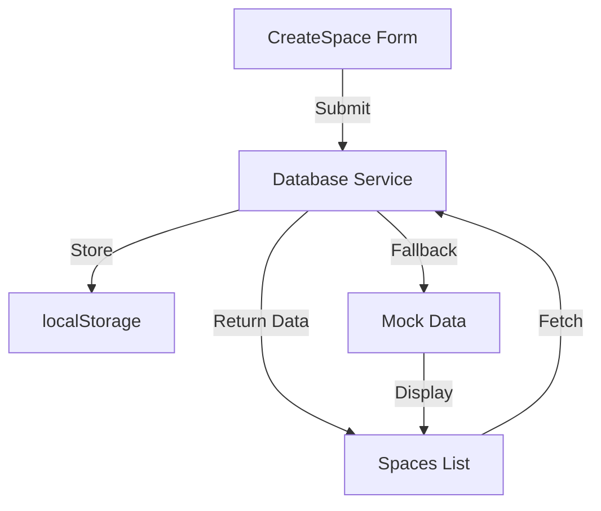
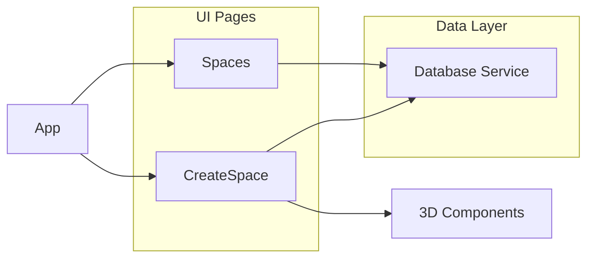

# 📂 Project Structure

## Core Components

### 🤖 Database and Services
- `src/services/`
  - `database.ts` - Browser storage service for storing space data ✅
    - Contains localStorage implementation, space interface, and CRUD operations
    - Handles storage initialization and error management

### 🖼️ UI Pages
- `src/pages/`
  - `CreateSpace.tsx` - Space creation wizard with 3D background ✅
    - Contains steps for name, description, categories, visibility
    - Integrates with database service to store new spaces
  - `Spaces.tsx` - Spaces listing page with filtering ✅
    - Loads spaces from localStorage with fallback to mock data
    - Includes filtering, searching, and UI display logic

### 🎮 3D Components
- `src/pages/CreateSpace.tsx` (embedded components)
  - `AnimatedBackgroundShapes` - Background 3D elements ✅
    - Renders geometric shapes with slow animation
  - `FloatingTitle` - 3D text element for step titles ✅
    - Positioned for optimal mobile and desktop display
  - `SpaceModel` - Interactive 3D space visualization ✅
    - Central object with orbiting elements
  - `AIAssistant` - Helper character with speech bubble ✅
    - Provides context-aware guidance

### 📱 Mobile Optimizations
- Improved camera positions
- Left-aligned floating elements
- Responsive container sizing
- Touch-friendly controls

## Documentation
- `src/dev/`
  - `task-log.md` - Progress tracking and task status ✅
  - `dev-notes.md` - Technical implementation details ✅
  - `file-tree.md` - Project structure documentation ✅

## Data Flow

## Component Relationships

