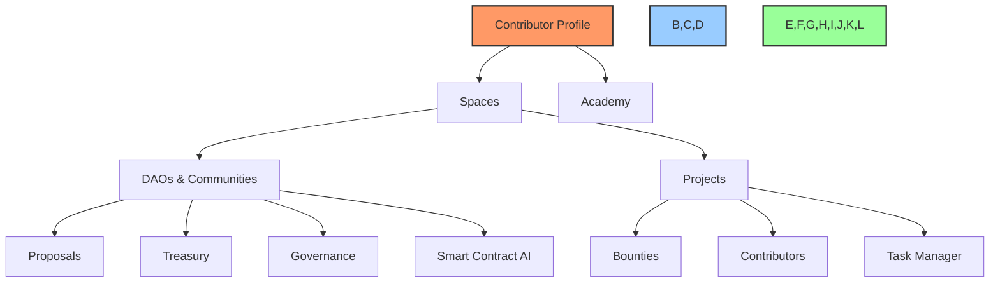

# 📝 UI Layout Structure - Version 2

## 🎯 Overview

This document outlines the updated hierarchical structure for the BAD DAO platform UI. The structure has been redesigned to better reflect the user journey, organizational relationship between components, and the natural progression from contributor to more specialized roles.

## 🏗️ Core Hierarchy

## 📋 Structural Definitions

### 1. Contributor Profile
- Entry point for all users
- Everyone starts as a contributor
- Contains personal information, skills, and achievements
- Links to Academy for upskilling
- Shows history of contributions across spaces and projects

### 2. Spaces
- Container for organizational activities
- Created after profile setup
- Houses multiple DAOs and projects
- Provides a dashboard view of all activities
- Acts as a personal/organizational hub

### 3. DAOs & Communities
- Nested inside Spaces
- Represent decentralized autonomous organizations
- Contain governance tools (proposals, treasury, etc.)
- Include voting mechanisms and community guidelines

### 4. Projects
- Nested inside Spaces
- Contain specific initiatives and work streams
- Houses bounties, contributors, and task management
- Provides project-specific dashboards and metrics

### 5. Academy
- Nested under Contributor Profile
- Learning platform for upskilling
- Provides courses, certifications, and badges
- Enables access to higher-tier bounties and roles
- Tracks learning progress and achievements

### 6. DAO Tools
- Nested inside DAOs
- Includes:
  - Proposals system
  - Treasury management
  - Governance mechanisms
  - Smart Contract AI tools

## 🔄 User Roles & Progression

1. **Contributor** - Default starting role for all users
   - Access to bounties and tasks
   - Can join projects and contribute
   - Can upskill through Academy

2. **Specialized Roles** (obtained after contribution)
   - Delegate
   - Board of Directors
   - Core Team
   - Each requires specific qualifications and achievements

## 📱 Navigation Structure

### Primary Navigation
- Profile (Contributor Profile)
- Spaces
- Academy

### Spaces Navigation (contextual)
- Space Dashboard
- DAOs & Communities
- Projects

### Project Navigation (contextual)
- Project Dashboard
- Bounties
- Contributors
- Tasks

### DAO Navigation (contextual)
- DAO Dashboard
- Proposals
- Treasury
- Governance
- Smart Contract AI

## 💡 Implementation Guidelines

1. **Context-aware Navigation**
   - Sidebar should adapt based on current context
   - Show relevant sub-navigation when inside a space, project, or DAO

2. **Breadcrumb Navigation**
   - Implement breadcrumbs to show hierarchical position
   - Example: Profile > Spaces > [Space Name] > Projects > [Project Name] > Bounties

3. **Role-based Access Control**
   - Different UI elements visible based on user role
   - Progression path visible to encourage advancement

4. **Dashboard Customization**
   - Each level (Space, Project, DAO) should have customizable dashboards
   - Show relevant metrics and activities based on context

## 🚀 Migration Plan

1. Phase 1: Update navigation structure
2. Phase 2: Implement contextual navigation
3. Phase 3: Connect profile to Academy
4. Phase 4: Reorganize DAO tools within DAOs
5. Phase 5: Implement role-based UI elements

## 📊 Success Metrics

1. Reduced navigation confusion
2. Increased engagement with Academy
3. More intuitive progression from contributor to specialized roles
4. Clearer relationship between spaces, projects, and DAOs 