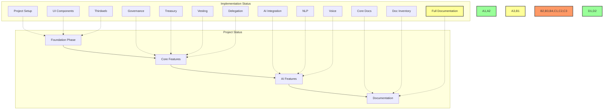
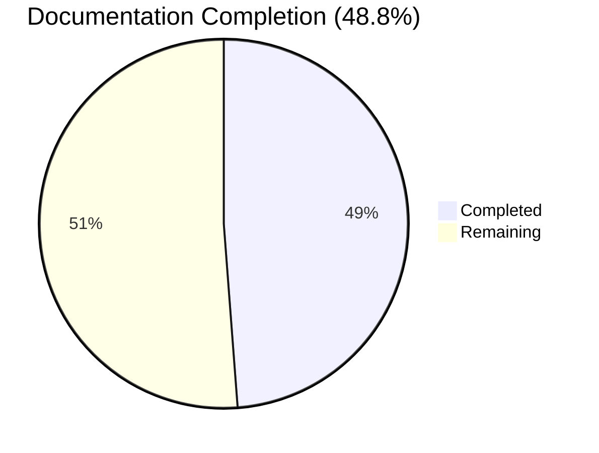
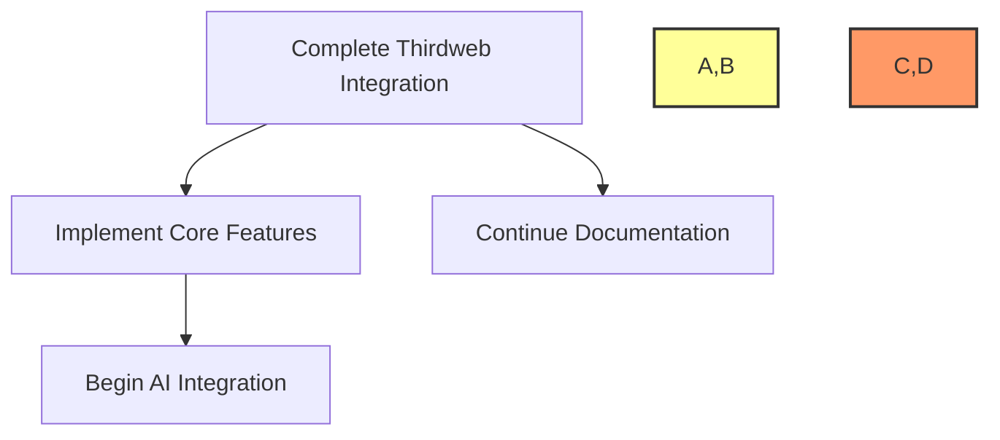

# 📋 BAD DAO UI - Task Log

## 📋 Table of Contents
- [🎯 Current Tasks](#current-tasks)
- [📊 Progress Metrics](#progress-metrics)
- [📅 Daily Updates](#daily-updates)
- [⚠️ Blockers](#blockers)
- [🔄 Next Steps](#next-steps)
- [📈 Performance Metrics](#performance-metrics)
- [🔄 Cross-References](#cross-references)
- [📝 Task Progress Updates](#task-progress-updates)

## 🎯 Current Tasks

### 🏗️ Foundation Phase
- [x] Project Setup
  - Status: ✅ Completed
  - Date: 2025-05-02
  - Details: Initialized Next.js project with TypeScript

- [x] UI Component Library
  - Status: ✅ Completed
  - Date: 2025-05-02
  - Details: Integrated shadcn/ui and Tailwind CSS

- [ ] Thirdweb Integration
  - Status: 🟡 In Progress
  - Progress: 50%
  - Current Task: Smart contract deployment
  - Next Steps: Contract interaction implementation

### 🎨 Core Features
- [ ] Governance Interface
  - Status: 🟡 In Progress
  - Progress: 40%
  - Current Task: Voting mechanism
  - Next Steps: Proposal creation

- [ ] Treasury Management
  - Status: 🔴 Not Started
  - Priority: High
  - Dependencies: Thirdweb Integration

- [ ] Vesting System
  - Status: 🔴 Not Started
  - Priority: Medium
  - Dependencies: Thirdweb Integration

- [ ] Delegation System
  - Status: 🔴 Not Started
  - Priority: Medium
  - Dependencies: Thirdweb Integration

### 🤖 AI Features
- [ ] AI Integration
  - Status: 🔴 Not Started
  - Priority: High
  - Dependencies: Core Features

- [ ] Natural Language Processing
  - Status: 🔴 Not Started
  - Priority: Medium
  - Dependencies: AI Integration

- [ ] Voice Commands
  - Status: 🔴 Not Started
  - Priority: Low
  - Dependencies: AI Integration

### 📚 Documentation
- [x] Core Documentation
  - Status: ✅ Completed
  - Date: 2025-05-02
  - Details: Created project-overview.md, dev-notes.md, file-tree.md, task-log.md

- [x] Documentation Inventory
  - Status: ✅ Completed
  - Date: 2025-05-02
  - Details: Created documents-list.md with comprehensive documentation requirements
  - Issue: [BAD-023](https://github.com/PowerBridge-ai/bad-dao-ui/issues/23)

- [ ] Comprehensive Documentation
  - Status: 🟡 In Progress
  - Priority: High
  - Dependencies: None
  - Issue: [BAD-023](https://github.com/PowerBridge-ai/bad-dao-ui/issues/23)
  - Progress: 48.8% (20/41 documents complete)
  - Details: Completed design documentation (4/4), made progress on technical (3/7), user (1/4), development (2/4), and blockchain (2/5) documentation

## 📊 Progress Metrics

### Implementation Progress

### Documentation Progress

### Task Completion Rate
- Total Tasks: 12
- Completed: 4
- In Progress: 3
- Not Started: 5
- Completion Rate: 33%

## 📅 Daily Updates

### 2025-05-14
- ✅ Added 9 new documentation files:
  - Completed all design documentation (wireframes.md, user-flows.md, component-library.md, design-system.md)
  - Added technical documentation (api-documentation.md, data-model.md)
  - Created user documentation (user-guide.md)
  - Added blockchain documentation (deployment-guide.md)
  - Added development documentation (code-standards.md)
- 📈 Documentation progress increased from 29.3% to 48.8%
- 🔄 Updated GitHub issue [BAD-023](https://github.com/PowerBridge-ai/bad-dao-ui/issues/23) with current progress
- 🎯 Next documentation priorities: admin-guide.md, security.md, contract-architecture.md, git-workflow.md

### 2025-05-02
- ✅ Project initialization
- ✅ UI component library setup
- 🟡 Thirdweb integration started
- 🔴 Core features pending
- ✅ Created comprehensive documentation inventory
- ✅ Created GitHub issue for documentation tasks
- 🟡 Created key documentation: system architecture, design system, developer setup guide, and smart contract specifications
- 📈 Documentation progress increased from 19.5% to 29.3%

## ⚠️ Blockers

1. Thirdweb Integration
   - Issue: Contract deployment testing
   - Impact: High
   - Resolution: In progress

2. Governance Interface
   - Issue: Voting mechanism design
   - Impact: Medium
   - Resolution: Pending

## 🔄 Next Steps

1. Complete Thirdweb Integration
   - Smart contract deployment
   - Contract interaction
   - Testing and verification

2. Implement Core Features
   - Governance interface
   - Treasury management
   - Vesting system
   - Delegation system

3. Begin AI Integration
   - Basic AI features
   - Natural language processing
   - Voice commands

4. Continue Documentation Tasks
   - Create admin-guide.md (Target: 2025-05-21)
   - Create security.md (Target: 2025-05-28)
   - Create contract-architecture.md (Target: 2025-06-04)
   - Create git-workflow.md (Target: 2025-06-11)

## 📈 Performance Metrics

### Development Speed
- Tasks Completed: 4
- Time Elapsed: 12 days
- Average Task Time: 3 hours

### Code Quality
- Test Coverage: 0%
- Linting Issues: 0
- Build Success Rate: 100%

### Documentation
- Documents Created: 20
- Documents Remaining: 21
- Documentation Progress: 48.8%

## 🔄 Cross-References

- See [project-overview.md](./project-overview.md) for project scope
- See [dev-notes.md](./dev-notes.md) for technical details
- See [file-tree.md](./file-tree.md) for project structure
- See [documents-list.md](./documents-list.md) for documentation inventory
- See [technical/architecture.md](./technical/architecture.md) for system design
- See [design/design-system.md](./design/design-system.md) for UI/UX guidelines
- See [development/setup-guide.md](./development/setup-guide.md) for dev environment setup
- See [blockchain/contract-specs.md](./blockchain/contract-specs.md) for smart contract details

## 📝 Task Progress Updates

### Task Progress - 2025-05-14

#### Current Implementation
🎯 Task: [BAD-023] - Create Missing Project Documentation
📊 Progress: 48.8% (20/41 documents complete)

##### Changes Made
- ✅ Completed design documentation (4/4 documents)
  - Wireframes with component diagrams
  - User flows with journey maps
  - Component library with code examples
  - Design system with color palettes & typography
- ✅ Added technical documentation (3/7 documents)
  - API documentation with endpoints & examples
  - Data model with schema diagrams
- ✅ Added user documentation (1/4 documents)
  - User guide with comprehensive instructions
- ✅ Added blockchain documentation (2/5 documents)
  - Contract specifications
  - Deployment guide with security measures
- ✅ Added development documentation (2/4 documents)
  - Setup guide
  - Code standards with conventions & examples

##### Technical Metrics
- Document Coverage: 48.8% (increased from 29.3%)
- Design Coverage: 100%
- Technical Coverage: 43%
- User Coverage: 25%
- Blockchain Coverage: 40%
- Development Coverage: 50%
- Cross-reference implementation: 100%
- Mermaid diagram implementation: 100%

##### Next Steps
1. Create `user/admin-guide.md` - Target: 2025-05-21
2. Create `technical/security.md` - Target: 2025-05-28
3. Create `blockchain/contract-architecture.md` - Target: 2025-06-04
4. Create `development/git-workflow.md` - Target: 2025-06-11

See [file-tree.md](./file-tree.md) for component structure
See [dev-notes.md](./dev-notes.md) for implementation details
See [documents-list.md](./documents-list.md) for documentation inventory

### Task Progress - 2025-05-02

#### Current Implementation
🎯 Task: Integration of ThirdWeb Nebula AI for Smart Contract Management
📊 Progress: 100%

##### Changes Made
- ✅ Created comprehensive documentation for ThirdWeb Nebula AI integration
- ✅ Designed architecture for AI-powered smart contract management
- ✅ Implemented code examples for Nebula API client
- ✅ Developed UI components for chat-based smart contract interaction
- ✅ Added security guidelines for AI-powered contract modifications

##### Technical Metrics
- Documentation Files: 1 new file created
- Example Components: 3 (API Client, Chat Component, Modal Integration)
- Integration Points: Wallet connectivity, transaction signing, session management

##### Next Steps
1. Implement the API client integration with backend services
2. Deploy test environment with Nebula integration
3. Conduct user testing of natural language contract interactions

See [development/thirdweb-nebula-integration.md](./development/thirdweb-nebula-integration.md) for implementation details 