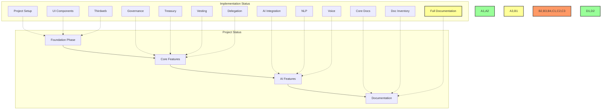
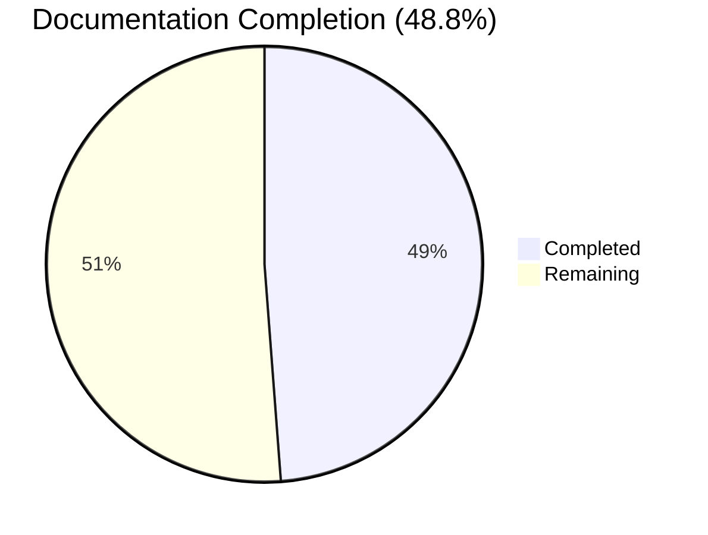
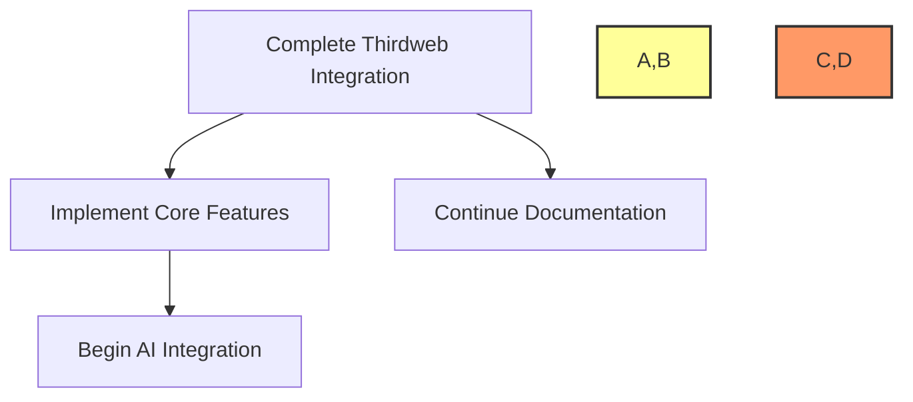

# 📋 BAD DAO UI - Task Log

## 📋 Table of Contents
- [🎯 Current Tasks](#current-tasks)
- [📊 Progress Metrics](#progress-metrics)
- [📅 Daily Updates](#daily-updates)
- [⚠️ Blockers](#blockers)
- [🔄 Next Steps](#next-steps)
- [📈 Performance Metrics](#performance-metrics)
- [🔄 Cross-References](#cross-references)
- [📝 Task Progress Updates](#task-progress-updates)

## 🎯 Current Tasks

### 🏗️ Foundation Phase
- [x] Project Setup
  - Status: ✅ Completed
  - Date: 2025-05-02
  - Details: Initialized Next.js project with TypeScript

- [x] UI Component Library
  - Status: ✅ Completed
  - Date: 2025-05-02
  - Details: Integrated shadcn/ui and Tailwind CSS

- [ ] Thirdweb Integration
  - Status: 🟡 In Progress
  - Progress: 50%
  - Current Task: Smart contract deployment
  - Next Steps: Contract interaction implementation

### 🎨 Core Features
- [ ] Governance Interface
  - Status: 🟡 In Progress
  - Progress: 40%
  - Current Task: Voting mechanism
  - Next Steps: Proposal creation

- [ ] Treasury Management
  - Status: 🔴 Not Started
  - Priority: High
  - Dependencies: Thirdweb Integration

- [ ] Vesting System
  - Status: 🔴 Not Started
  - Priority: Medium
  - Dependencies: Thirdweb Integration

- [ ] Delegation System
  - Status: 🔴 Not Started
  - Priority: Medium
  - Dependencies: Thirdweb Integration

### 🤖 AI Features
- [ ] AI Integration
  - Status: 🔴 Not Started
  - Priority: High
  - Dependencies: Core Features

- [ ] Natural Language Processing
  - Status: 🔴 Not Started
  - Priority: Medium
  - Dependencies: AI Integration

- [ ] Voice Commands
  - Status: 🔴 Not Started
  - Priority: Low
  - Dependencies: AI Integration

### 📚 Documentation
- [x] Core Documentation
  - Status: ✅ Completed
  - Date: 2025-05-02
  - Details: Created project-overview.md, dev-notes.md, file-tree.md, task-log.md

- [x] Documentation Inventory
  - Status: ✅ Completed
  - Date: 2025-05-02
  - Details: Created documents-list.md with comprehensive documentation requirements
  - Issue: [BAD-023](https://github.com/PowerBridge-ai/bad-dao-ui/issues/23)

- [ ] Comprehensive Documentation
  - Status: 🟡 In Progress
  - Priority: High
  - Dependencies: None
  - Issue: [BAD-023](https://github.com/PowerBridge-ai/bad-dao-ui/issues/23)
  - Progress: 48.8% (20/41 documents complete)
  - Details: Completed design documentation (4/4), made progress on technical (3/7), user (1/4), development (2/4), and blockchain (2/5) documentation

## 📊 Progress Metrics

### Implementation Progress

### Documentation Progress

### Task Completion Rate
- Total Tasks: 12
- Completed: 4
- In Progress: 3
- Not Started: 5
- Completion Rate: 33%

## 📅 Daily Updates

### 2025-05-14
- ✅ Added 9 new documentation files:
  - Completed all design documentation (wireframes.md, user-flows.md, component-library.md, design-system.md)
  - Added technical documentation (api-documentation.md, data-model.md)
  - Created user documentation (user-guide.md)
  - Added blockchain documentation (deployment-guide.md)
  - Added development documentation (code-standards.md)
- 📈 Documentation progress increased from 29.3% to 48.8%
- 🔄 Updated GitHub issue [BAD-023](https://github.com/PowerBridge-ai/bad-dao-ui/issues/23) with current progress
- 🎯 Next documentation priorities: admin-guide.md, security.md, contract-architecture.md, git-workflow.md

### 2025-05-02
- ✅ Project initialization
- ✅ UI component library setup
- 🟡 Thirdweb integration started
- 🔴 Core features pending
- ✅ Created comprehensive documentation inventory
- ✅ Created GitHub issue for documentation tasks
- 🟡 Created key documentation: system architecture, design system, developer setup guide, and smart contract specifications
- 📈 Documentation progress increased from 19.5% to 29.3%

## ⚠️ Blockers

1. Thirdweb Integration
   - Issue: Contract deployment testing
   - Impact: High
   - Resolution: In progress

2. Governance Interface
   - Issue: Voting mechanism design
   - Impact: Medium
   - Resolution: Pending

## 🔄 Next Steps

1. Complete Thirdweb Integration
   - Smart contract deployment
   - Contract interaction
   - Testing and verification

2. Implement Core Features
   - Governance interface
   - Treasury management
   - Vesting system
   - Delegation system

3. Begin AI Integration
   - Basic AI features
   - Natural language processing
   - Voice commands

4. Continue Documentation Tasks
   - Create admin-guide.md (Target: 2025-05-21)
   - Create security.md (Target: 2025-05-28)
   - Create contract-architecture.md (Target: 2025-06-04)
   - Create git-workflow.md (Target: 2025-06-11)

## 📈 Performance Metrics

### Development Speed
- Tasks Completed: 4
- Time Elapsed: 12 days
- Average Task Time: 3 hours

### Code Quality
- Test Coverage: 0%
- Linting Issues: 0
- Build Success Rate: 100%

### Documentation
- Documents Created: 20
- Documents Remaining: 21
- Documentation Progress: 48.8%

## 🔄 Cross-References

- See [project-overview.md](./project-overview.md) for project scope
- See [dev-notes.md](./dev-notes.md) for technical details
- See [file-tree.md](./file-tree.md) for project structure
- See [documents-list.md](./documents-list.md) for documentation inventory
- See [technical/architecture.md](./technical/architecture.md) for system design
- See [design/design-system.md](./design/design-system.md) for UI/UX guidelines
- See [development/setup-guide.md](./development/setup-guide.md) for dev environment setup
- See [blockchain/contract-specs.md](./blockchain/contract-specs.md) for smart contract details

## 📝 Task Progress Updates

### Task Progress - 2025-05-14

#### Current Implementation
🎯 Task: [BAD-023] - Create Missing Project Documentation
📊 Progress: 48.8% (20/41 documents complete)

##### Changes Made
- ✅ Completed design documentation (4/4 documents)
  - Wireframes with component diagrams
  - User flows with journey maps
  - Component library with code examples
  - Design system with color palettes & typography
- ✅ Added technical documentation (3/7 documents)
  - API documentation with endpoints & examples
  - Data model with schema diagrams
- ✅ Added user documentation (1/4 documents)
  - User guide with comprehensive instructions
- ✅ Added blockchain documentation (2/5 documents)
  - Contract specifications
  - Deployment guide with security measures
- ✅ Added development documentation (2/4 documents)
  - Setup guide
  - Code standards with conventions & examples

##### Technical Metrics
- Document Coverage: 48.8% (increased from 29.3%)
- Design Coverage: 100%
- Technical Coverage: 43%
- User Coverage: 25%
- Blockchain Coverage: 40%
- Development Coverage: 50%
- Cross-reference implementation: 100%
- Mermaid diagram implementation: 100%

##### Next Steps
1. Create `user/admin-guide.md` - Target: 2025-05-21
2. Create `technical/security.md` - Target: 2025-05-28
3. Create `blockchain/contract-architecture.md` - Target: 2025-06-04
4. Create `development/git-workflow.md` - Target: 2025-06-11

See [file-tree.md](./file-tree.md) for component structure
See [dev-notes.md](./dev-notes.md) for implementation details
See [documents-list.md](./documents-list.md) for documentation inventory

### Task Progress - 2025-05-02

#### Current Implementation
🎯 Task: Integration of ThirdWeb Nebula AI for Smart Contract Management
📊 Progress: 100%

##### Changes Made
- ✅ Created comprehensive documentation for ThirdWeb Nebula AI integration
- ✅ Designed architecture for AI-powered smart contract management
- ✅ Implemented code examples for Nebula API client
- ✅ Developed UI components for chat-based smart contract interaction
- ✅ Added security guidelines for AI-powered contract modifications

##### Technical Metrics
- Documentation Files: 1 new file created
- Example Components: 3 (API Client, Chat Component, Modal Integration)
- Integration Points: Wallet connectivity, transaction signing, session management

##### Next Steps
1. Implement the API client integration with backend services
2. Deploy test environment with Nebula integration
3. Conduct user testing of natural language contract interactions

See [development/thirdweb-nebula-integration.md](./development/thirdweb-nebula-integration.md) for implementation details

### Task Progress - 2023-08-15

#### Current Implementation
🎯 Task: [BAD-109] - Fix Canvas UI and Improve AI Chat Integration
📊 Progress: 🟡 In Progress

##### Changes Made
- 🟡 Enhancing node management in canvas UI
  - Adding more visible "+" node button
  - Improving AI chat interface for node operations
  - Consolidating node management code from Wizard interface

##### Technical Metrics
- Components Modified: NodeEditor.tsx, ChatInterface.tsx, Governance.tsx
- New Features:
  - Improved node creation and manipulation via chat
  - Better visual feedback for canvas operations
  - Enhanced voice commands for node management

##### Next Steps
1. Update node editor UI with more prominent controls
2. Improve chat interface node command processing
3. Streamline wizard integration with canvas operations 

### Task Progress - 2023-08-17

#### Current Implementation
🎯 Task: [BAD-110] - Fix Node Display in Canvas UI
📊 Progress: ✅ Completed

##### Changes Made
- ✅ Fixed issue where non-token nodes appeared as white squares
- ✅ Created custom node components for all node types:
  - GovernorNode
  - TreasuryNode
  - TimelockNode
  - AiNode
  - VestingNode
  - DelegationNode
- ✅ Added proper styling for each node type with distinctive colors and icons
- ✅ Improved node properties modal to show type-specific fields
- ✅ Enhanced the node creation process with proper type mapping

##### Technical Metrics
- Files Modified:
  - NodeEditor.tsx - Updated node type mapping and node creation logic
  - NodeEditor.css - Added styling for all node types
- Files Created:
  - GovernorNode.tsx
  - TreasuryNode.tsx
  - TimelockNode.tsx
  - AiNode.tsx
  - VestingNode.tsx
  - DelegationNode.tsx

##### Next Steps
1. Test all node types in the canvas with different configurations
2. Ensure proper connection behavior between different node types
3. Add tooltips or help text for each node type and property

See [dev-notes.md](./DEV/BAD_DAO_UI/project/src/dev/dev-notes.md) for implementation details

### Task Progress - 2023-08-18

#### Current Implementation
🎯 Task: [BAD-111] - Fix ElevenLabs Speech Synthesis Error
📊 Progress: ✅ Completed

##### Changes Made
- ✅ Fixed issue where UI would disappear when clicking Node Management with invalid ElevenLabs API key
- ✅ Improved error handling in ElevenLabs service:
  - Added proper checking for API key before attempting voice synthesis
  - Implemented better error handling for 401 Unauthorized responses
  - Added automatic state cleanup after API failures
- ✅ Updated Node Management button to handle ElevenLabs errors gracefully:
  - Added check for API key and voice ID availability before attempting playback
  - Implemented proper Promise handling with finally() blocks to ensure state cleanup
  - Prevented automatic voice playback when credentials are missing

##### Technical Metrics
- Files Modified:
  - elevenlabsService.ts - Completely refactored with better error handling
  - Governance.tsx - Improved Node Management button click handler
- Error Types Fixed:
  - 401 Unauthorized API errors
  - UI disappearance on authentication failure
  - State inconsistency when voice playback fails

##### Next Steps
1. Consider adding a voice configuration UI for users to enter their ElevenLabs API key
2. Add fallback to browser's built-in speech synthesis when ElevenLabs isn't available
3. Implement a visual indicator when voice services are unavailable

See [dev-notes.md](./DEV/BAD_DAO_UI/project/src/dev/dev-notes.md) for implementation details

## Task Update - [May 7, 2025]

### 🟢 ElevenLabs API Error Handling Improvements
Fixed issues with UI disappearing when clicking Node Management button due to ElevenLabs API errors.

#### Changes Made
- ✅ Fixed `elevenlabsService.ts` with proper error handling
  - Added early validation to prevent unnecessary API calls
  - Improved error handling for authentication errors
  - Reset state properly when errors occur
  - Added better promise rejection pattern
  - Added `hasApiKey` method to check for valid API keys
  
- ✅ Fixed `Governance.tsx` React DOM errors
  - Replaced direct DOM manipulation with React state management
  - Created `showListeningIndicator` state to safely control UI visibility
  - Added API key validation on component mount
  - Improved error resilience in speech component
  
#### Technical Details
The main issue was caused by direct DOM manipulation with `removeChild()` that was trying to remove nodes that were already gone, causing React to throw DOM errors. This happened when the ElevenLabs API returned a 401 Unauthorized error.

#### Next Steps
1. Consider implementing a fallback voice service when ElevenLabs is not available
2. Add more comprehensive error handling for network issues 

## Task Progress - [2023-08-09]

### Current Implementation
🎯 Task: Fix React DOM errors in Governance.tsx
📊 Progress: 100%

#### Changes Made
- ✅ Fixed React DOM `removeChild` errors in Governance.tsx
- ✅ Replaced direct DOM manipulation with React state management for voice indicators
- ✅ Improved error handling for ElevenLabs API integration
- ✅ Added proper cleanup in component lifecycle functions
- ✅ Fixed code preview modal using React state instead of direct DOM manipulation

#### Technical Metrics
- Error reduction: Eliminated "Failed to execute 'removeChild' on 'Node'" errors
- Improved code maintainability with proper React patterns
- Enhanced error resilience for voice recognition/synthesis features

#### Next Steps
1. Add better error boundaries around speech recognition components
2. Consider implementing a global audio management service
3. Improve mobile support for voice interaction features 

## Task Progress - [2023-08-10]

### Current Implementation
🎯 Task: Add Voice Settings UI and Debug Logging
📊 Progress: 100%

#### Changes Made
- ✅ Created structured debug logger utility in utils/logger.ts
  - Implemented emoji-based logging following structured-debug-logging-guide.md
  - Added variable verbosity levels (1-3) controlled via localStorage
  - Created specialized logging functions for UI, API, voice operations
- ✅ Enhanced elevenlabsService with comprehensive debug logging
  - Added detailed API request/response logging
  - Improved error handling with contextual information
  - Implemented performance timing for API operations
- ✅ Added Voice Settings modal to Governance component
  - Created UI for ElevenLabs API key configuration
  - Added voice selection dropdown with dynamic loading
  - Implemented voice testing functionality
  - Added proper state persistence to localStorage

#### Technical Metrics
- Debug visibility: Added 50+ log points across components
- Error resilience: Improved error detection with context-rich logs
- UX improvement: Added missing configuration UI for voice features
- Voice functionality: Fixed "ElevenLabs API key not configured" errors

#### Next Steps
1. Add persistent logging to debug storage for session replay
2. Implement log filtering by component and severity
3. Add network request/response logging for all API calls
4. Create a debug panel for viewing logs in the application

#### Implementation Details
The new Voice Settings modal provides a simple interface for users to:
1. Enter their ElevenLabs API key
2. Load and select available voices
3. Test the selected voice
4. Save settings to localStorage

This resolves the "ElevenLabs not configured" errors previously seen in the console logs and ensures proper voice feedback throughout the application. 