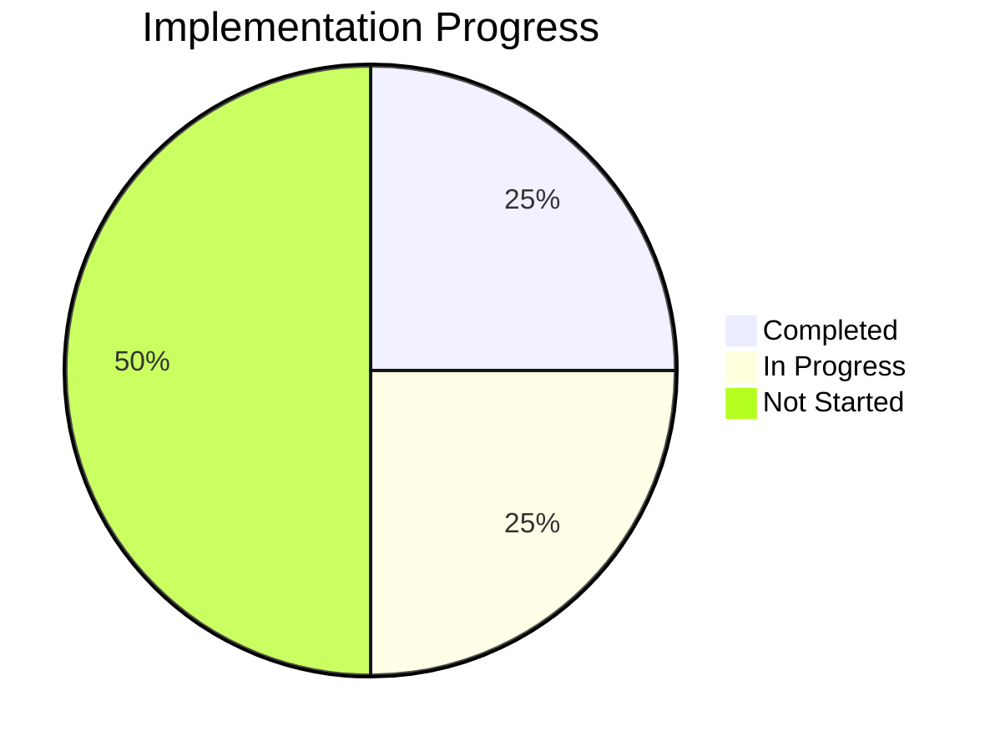

# 📋 BAD DAO UI - Task Log

## 🎯 Current Tasks

### 🏗️ Foundation Phase
- [x] Project Setup
  - Status: ✅ Completed
  - Date: 2025-05-02
  - Details: Initialized Next.js project with TypeScript

- [x] UI Component Library
  - Status: ✅ Completed
  - Date: 2025-05-02
  - Details: Integrated shadcn/ui and Tailwind CSS

- [ ] Thirdweb Integration
  - Status: 🟡 In Progress
  - Progress: 50%
  - Current Task: Smart contract deployment
  - Next Steps: Contract interaction implementation

### 🎨 Core Features
- [ ] Governance Interface
  - Status: 🟡 In Progress
  - Progress: 40%
  - Current Task: Voting mechanism
  - Next Steps: Proposal creation

- [ ] Treasury Management
  - Status: 🔴 Not Started
  - Priority: High
  - Dependencies: Thirdweb Integration

- [ ] Vesting System
  - Status: 🔴 Not Started
  - Priority: Medium
  - Dependencies: Thirdweb Integration

- [ ] Delegation System
  - Status: 🔴 Not Started
  - Priority: Medium
  - Dependencies: Thirdweb Integration

### 🤖 AI Features
- [ ] AI Integration
  - Status: 🔴 Not Started
  - Priority: High
  - Dependencies: Core Features

- [ ] Natural Language Processing
  - Status: 🔴 Not Started
  - Priority: Medium
  - Dependencies: AI Integration

- [ ] Voice Commands
  - Status: 🔴 Not Started
  - Priority: Low
  - Dependencies: AI Integration

### 📚 Documentation
- [x] Core Documentation
  - Status: ✅ Completed
  - Date: 2025-05-02
  - Details: Created project-overview.md, dev-notes.md, file-tree.md, task-log.md

- [x] Documentation Inventory
  - Status: ✅ Completed
  - Date: 2025-05-02
  - Details: Created documents-list.md with comprehensive documentation requirements
  - Issue: [BAD-023](https://github.com/PowerBridge-ai/bad-dao-ui/issues/23)

- [ ] Comprehensive Documentation
  - Status: 🟡 In Progress
  - Priority: High
  - Dependencies: None
  - Issue: [BAD-023](https://github.com/PowerBridge-ai/bad-dao-ui/issues/23)
  - Progress: 29.3% (12/41 documents complete)
  - Details: Created architecture.md, design-system.md, setup-guide.md, contract-specs.md

## 📊 Progress Metrics

### Implementation Progress

### Task Completion Rate
- Total Tasks: 12
- Completed: 4
- In Progress: 3
- Not Started: 5
- Completion Rate: 33%

## 📅 Daily Updates

### 2025-05-02
- ✅ Project initialization
- ✅ UI component library setup
- 🟡 Thirdweb integration started
- 🔴 Core features pending
- ✅ Created comprehensive documentation inventory
- ✅ Created GitHub issue for documentation tasks
- 🟡 Created key documentation: system architecture, design system, developer setup guide, and smart contract specifications
- 📈 Documentation progress increased from 19.5% to 29.3%

## ⚠️ Blockers

1. Thirdweb Integration
   - Issue: Contract deployment testing
   - Impact: High
   - Resolution: In progress

2. Governance Interface
   - Issue: Voting mechanism design
   - Impact: Medium
   - Resolution: Pending

## 🔄 Next Steps

1. Complete Thirdweb Integration
   - Smart contract deployment
   - Contract interaction
   - Testing and verification

2. Implement Core Features
   - Governance interface
   - Treasury management
   - Vesting system
   - Delegation system

3. Begin AI Integration
   - Basic AI features
   - Natural language processing
   - Voice commands

4. Continue Documentation Tasks
   - Create wireframes and UI mockups
   - Develop API documentation
   - Establish contract deployment guide
   - Add user guides

## 📈 Performance Metrics

### Development Speed
- Tasks Completed: 4
- Time Elapsed: 1 day
- Average Task Time: 3 hours

### Code Quality
- Test Coverage: 0%
- Linting Issues: 0
- Build Success Rate: 100%

### Documentation
- Documents Created: 12
- Documents Remaining: 29
- Documentation Progress: 29.3%

## 🔄 Cross-References

- See [project-overview.md](./project-overview.md) for project scope
- See [dev-notes.md](./dev-notes.md) for technical details
- See [file-tree.md](./file-tree.md) for project structure
- See [documents-list.md](./documents-list.md) for documentation inventory
- See [technical/architecture.md](./technical/architecture.md) for system design
- See [design/design-system.md](./design/design-system.md) for UI/UX guidelines
- See [development/setup-guide.md](./development/setup-guide.md) for dev environment setup
- See [blockchain/contract-specs.md](./blockchain/contract-specs.md) for smart contract details 