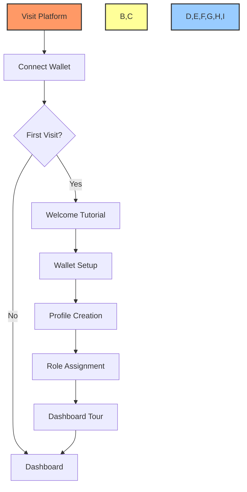
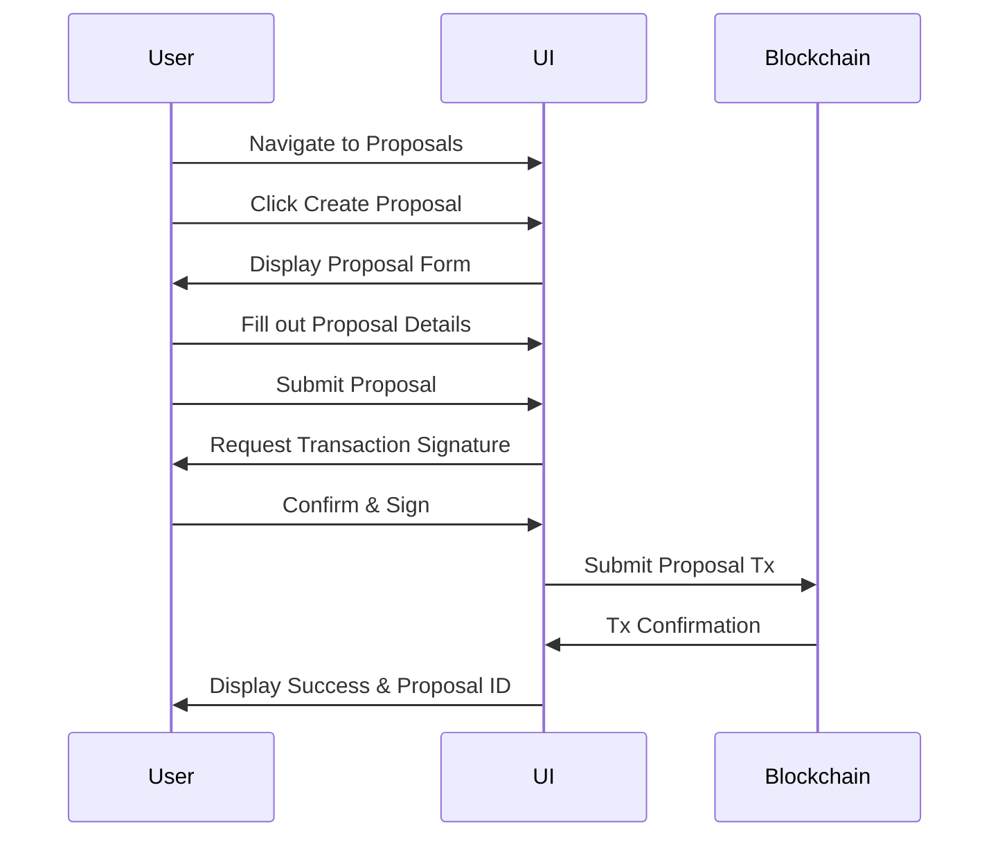
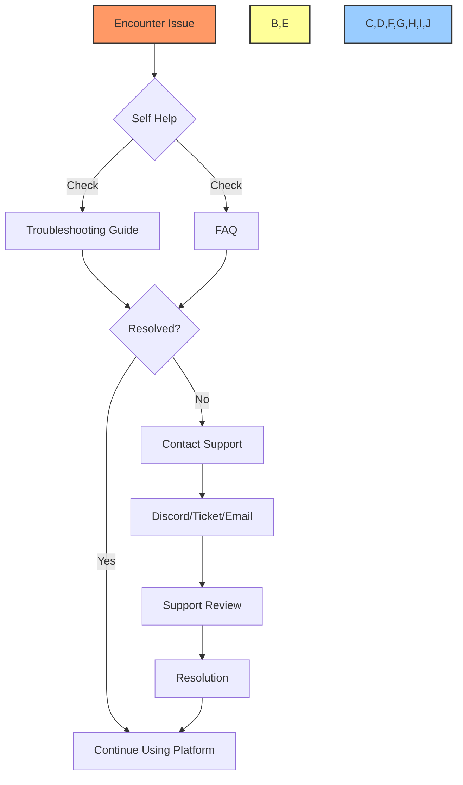

# 📘 BAD DAO UI - User Guide

## 📋 Table of Contents
- [🔍 Introduction](#introduction)
- [🚀 Getting Started](#getting-started)
- [🔐 Account & Wallet Management](#account--wallet-management)
- [🏠 Dashboard Navigation](#dashboard-navigation)
- [🗳️ Proposal Management](#proposal-management)
- [🗳️ Voting](#voting)
- [💰 Treasury Monitoring](#treasury-monitoring)
- [👥 Community Engagement](#community-engagement)
- [📊 Analytics & Reporting](#analytics--reporting)
- [🔔 Notifications](#notifications)
- [🛠️ Settings & Preferences](#settings--preferences)
- [❓ Troubleshooting](#troubleshooting)

## 🔍 Introduction

This user guide provides comprehensive instructions for using the BAD DAO UI - a decentralized governance platform designed to facilitate transparent decision-making, resource allocation, and community engagement for decentralized autonomous organizations.

The BAD DAO UI gives you the tools to:
- Participate in decentralized governance
- Create and vote on proposals
- Monitor treasury assets and transactions
- Engage with the community
- Track governance metrics and analytics

## 🚀 Getting Started

### System Requirements
- **Browser**: Chrome, Firefox, Edge, or Brave (latest versions)
- **Wallet**: MetaMask, WalletConnect, or Coinbase Wallet
- **Network**: Stable internet connection

### Accessing the Platform
1. Visit [https://app.baddao.io](https://app.baddao.io)
2. Click the "Connect Wallet" button in the top-right corner
3. Select your preferred wallet provider
4. Approve the connection request in your wallet
5. Complete any required onboarding steps

### Onboarding Process


## 🔐 Account & Wallet Management

### Connecting Your Wallet
1. Click "Connect Wallet" in the top-right corner
2. Select your wallet provider from the list:
   - MetaMask
   - WalletConnect
   - Coinbase Wallet
   - Ledger (via WalletConnect)
3. Approve the connection request in your wallet interface
4. Your address and token balance will appear in the header

### Managing Your Profile
1. Click on your address in the top-right corner
2. Select "Profile" from the dropdown menu
3. Customize your profile with:
   - Display name/ENS
   - Profile picture (NFT or avatar)
   - Bio/Description
   - Social links

### Security Settings
- **Session Management**: Review and revoke active sessions
- **Transaction Signing**: Configure confirmation preferences
- **Notification Settings**: Control security alerts
- **Connected Apps**: Manage third-party application access

## 🏠 Dashboard Navigation

### Dashboard Overview
The dashboard is your command center with these key sections:

```
+---------------------------------------+
|            HEADER/NAV                 |
+---------------------------------------+
|                                       |
|        OVERVIEW METRICS PANEL         |
|                                       |
+------------------+--------------------+
|                  |                    |
|   ACTIVE         |   YOUR VOTING      |
|   PROPOSALS      |   ACTIVITY         |
|                  |                    |
+------------------+--------------------+
|                                       |
|        TREASURY SNAPSHOT              |
|                                       |
+---------------------------------------+
|                                       |
|        RECENT ACTIVITY                |
|                                       |
+---------------------------------------+
```

### Navigation Menu
- **Dashboard**: Home screen with key metrics
- **Proposals**: Browse, create, and vote on proposals
- **Treasury**: View assets and transaction history
- **Community**: Access forums and discussions
- **Analytics**: View governance metrics and reports
- **Documentation**: Access guides and resources

### Key Metrics Display
- **Governance Power**: Your voting weight in the DAO
- **Active Proposals**: Number of proposals open for voting
- **Treasury Value**: Total value of DAO assets
- **Your Participation Rate**: Your voting participation percentage
- **DAO Health Score**: Overall governance health indicator

## 🗳️ Proposal Management

### Types of Proposals
1. **Treasury Proposals**: Request funds or allocate resources
2. **Governance Proposals**: Change rules or parameters
3. **Social Proposals**: Non-binding community decisions
4. **Technical Proposals**: Smart contract or system changes

### Creating a Proposal
1. Navigate to the Proposals section
2. Click the "Create Proposal" button
3. Select the proposal type
4. Complete the proposal form:
   - Title
   - Summary
   - Detailed description (supports Markdown)
   - Funding request (if applicable)
   - On-chain actions (if applicable)
   - Voting options
   - Voting period
5. Preview your proposal
6. Submit and sign the transaction



### Managing Your Proposals
- **Draft Proposals**: Save and edit before submission
- **Active Proposals**: Monitor voting progress
- **Completed Proposals**: View results and outcomes
- **Editing**: Permitted only during draft phase
- **Cancellation**: Available to creator before execution

## 🗳️ Voting

### Voting Process
1. Navigate to the Proposals section
2. Select an active proposal
3. Review the proposal details
4. Click "Vote"
5. Choose your voting option:
   - For
   - Against
   - Abstain
6. Add an optional comment or reason
7. Submit and sign your vote transaction

### Voting Power
- **Calculation**: Based on token holdings and/or NFT ownership
- **Delegation**: Ability to delegate voting power to other addresses
- **History**: Record of your past voting activity

### Vote Privacy Options
- **Public Voting**: Your vote is visible to all
- **Private Voting**: Your vote direction is hidden until voting ends
- **Anonymous Voting**: Your address is hidden (if supported by the DAO)

## 💰 Treasury Monitoring

### Treasury Dashboard
```
+---------------------------------------+
|                                       |
|        TOTAL TREASURY VALUE           |
|              $1,250,000               |
|                                       |
+---------------------------------------+
|                                       |
|         ASSET ALLOCATION              |
|      [Pie Chart or Asset Breakdown]   |
|                                       |
+---------------------------------------+
|                                       |
|         FINANCIAL METRICS             |
|  Monthly Burn | Runway | Growth Rate  |
|                                       |
+---------------------------------------+
|                                       |
|         RECENT TRANSACTIONS           |
|                                       |
+---------------------------------------+
```

### Viewing Assets
- **Asset List**: View all tokens and NFTs held by the DAO
- **Historical Chart**: Track treasury value over time
- **Asset Details**: View detailed information for each asset

### Transaction History
- **Inflows**: Deposits and revenue
- **Outflows**: Spending and allocations
- **Filters**: Filter by date, amount, asset, or category
- **Export**: Download transaction data in CSV format

## 👥 Community Engagement

### Forum Participation
- **Topics**: Browse discussion topics by category
- **Posting**: Create new discussions
- **Commenting**: Respond to existing threads
- **Reactions**: Express agreement or disagreement

### Governance Calendar
- **Upcoming Votes**: See scheduled proposal votes
- **Events**: Community calls and meetings
- **Milestones**: Project and development deadlines
- **Notifications**: Set reminders for important dates

### Contributor Directory
- **Member Profiles**: View active contributors
- **Leaderboards**: See top governance participants
- **Roles & Badges**: Identify team members and specialists
- **Contact**: Reach out to contributors (if permitted)

## 📊 Analytics & Reporting

### Governance Analytics
- **Voting Participation**: Historical voting rates
- **Proposal Success Rate**: Percentage of passed proposals
- **Member Growth**: New member acquisition over time
- **Governance Power Distribution**: Token concentration metrics

### Treasury Analytics
- **Asset Performance**: Value changes over time
- **Income vs. Spending**: Financial sustainability metrics
- **Category Analysis**: Spending by purpose or department
- **Projection Models**: Estimated runway and growth

### Personal Analytics
- **Your Participation**: Personal voting history
- **Contribution Metrics**: Your activity in the DAO
- **Governance Power**: Changes in your voting weight
- **Impact Score**: Measure of your DAO influence

## 🔔 Notifications

### Notification Types
- **Proposal Alerts**: New proposals, voting reminders
- **Voting Results**: Outcomes of proposals you voted on
- **Treasury Updates**: Significant treasury movements
- **Community Activity**: Responses to your posts/comments
- **Security Alerts**: Unusual account activity

### Notification Settings
1. Navigate to Settings > Notifications
2. Configure preferences for each notification type:
   - In-app notifications
   - Email notifications
   - Browser push notifications
   - Webhook integrations (for developers)

## 🛠️ Settings & Preferences

### Application Settings
- **Theme**: Light/Dark/System
- **Language**: UI language preference
- **Display Units**: Currency display (USD, EUR, ETH, etc.)
- **Time Format**: 12/24 hour format
- **Date Format**: Regional date formatting

### Privacy Settings
- **Public Profile**: What information is publicly visible
- **Voting Privacy**: Default voting privacy preferences
- **Activity Tracking**: Analytics and usage data options
- **Data Export**: Download your DAO activity data

## ❓ Troubleshooting

### Common Issues
| Issue | Solution |
|-------|----------|
| Wallet Not Connecting | Ensure your wallet is unlocked and on the correct network |
| Transaction Failing | Check gas settings and network congestion |
| Proposal Not Displaying | Try refreshing or clearing cache |
| Voting Error | Verify you have sufficient voting power and eligibility |
| Missing Funds | Confirm transaction history and network status |

### Support Resources
- **Help Center**: [https://help.baddao.io](https://help.baddao.io)
- **Discord Support**: [https://discord.gg/baddao](https://discord.gg/baddao)
- **Email Support**: support@baddao.io
- **Office Hours**: Community support calls (Tuesdays 14:00-15:00 UTC)

### Technical Support Process


---

Made with Power, Love, and AI •  ⚡️❤️🤖 •  POWERBRIDGE.AI 