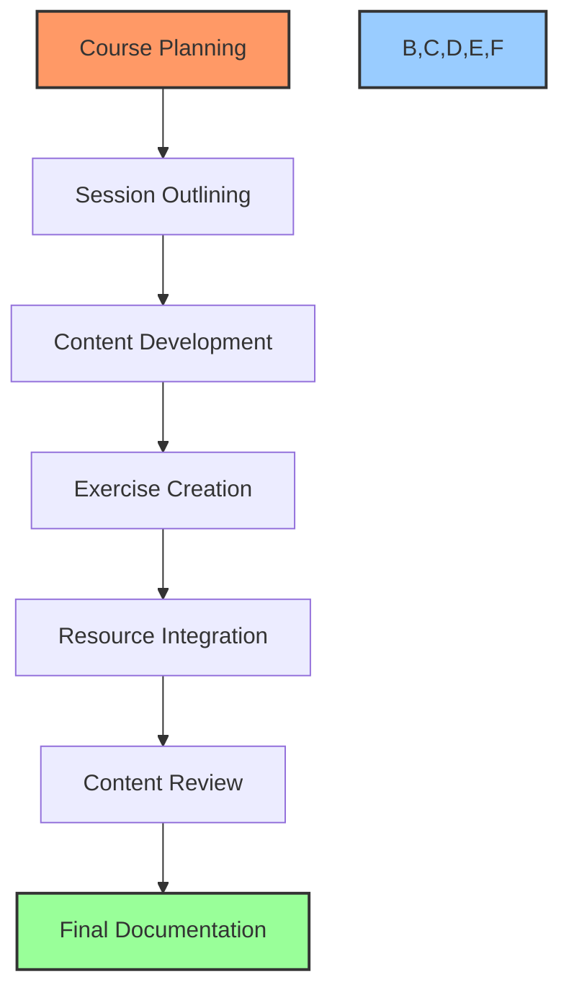

# 📝 Content Creation Workflow

## 🎯 Purpose
This workflow provides a standardized process for creating high-quality, structured course content for PowerBridge.AI courses. It ensures that all content is comprehensive, accurate, engaging, and aligned with learning objectives.

## 📋 Workflow Overview



## 📝 Step-by-Step Process

### Phase 1: Planning & Structure

#### Step 1: Course Planning
- Review validated course concept and objectives
- Define specific learning outcomes for the course
- Identify key skills students will develop
- Map the course progression logic
- Define the project deliverable requirements
- Create competency framework for the course
- Document prerequisites and target audience

#### Step 2: Session Outlining
- Break course into 8 logical sessions
- Define clear learning objectives for each session
- Structure each session with 30/90 theory/practical split
- Create detailed outlines for each session:
  - Introduction and context (5 minutes)
  - Theory component (25 minutes)
  - Practical demonstration (30 minutes)
  - Hands-on exercise (45 minutes)
  - Review and Q&A (15 minutes)
- Map progression between sessions
- Identify technical requirements for each session

### Phase 2: Content Development

#### Step 3: Content Development
- Create comprehensive content for each session:
  - Detailed speaker notes
  - Step-by-step technical instructions
  - Code examples and snippets
  - Diagrams and visual aids
  - Reference links and resources
  - Terminology definitions
- Ensure all content references validated claims only
- Incorporate appropriate caveats and context
- Include real-world examples and case studies

#### Step 4: Exercise Creation
- Develop practical exercises for each session:
  - Clear objective and success criteria
  - Step-by-step instructions
  - Starter templates or code
  - Expected outcomes
  - Common pitfalls and solutions
  - Challenge extensions
- Create project milestones for each session
- Ensure exercises build toward final deliverable
- Develop assessment criteria for exercises

#### Step 5: Resource Integration
- Compile comprehensive resources for each topic:
  - Documentation links
  - Tutorial references
  - Tool guides
  - Community forums
  - Alternative approaches
  - Advanced reading
- Create resource index with annotations
- Organize resources by topic and difficulty
- Include validated case studies and examples

### Phase 3: Review & Finalization

#### Step 6: Content Review
- Validate all content against research validation reports
- Check for technical accuracy and currency
- Verify code examples are functional
- Ensure content alignment with learning objectives
- Validate practical exercises are achievable
- Review for completeness and clarity
- Identify and fill any content gaps

#### Step 7: Final Documentation
- Finalize all course documents:
  - curriculum.md: Complete course overview
  - session-1.md through session-8.md: Detailed session content
  - resource-index.md: Comprehensive resource library
  - references.md: Citations and attributions
  - exercises.md: All exercises and projects
  - validation.md: Validation status of all claims
- Prepare content for video script creation
- Document any special requirements for interactive elements

## 📚 Document Templates

### Session Content Template

```markdown
# Session [Number]: [Title]

## 🎯 Learning Objectives
- [Objective 1]
- [Objective 2]
- [Objective 3]

## 📋 Session Overview
- Duration: 2 hours
- Format: Theory (30 min) + Practical (90 min)
- Project Milestone: [Specific milestone for this session]

## 📝 Theory Component (30 minutes)

### Introduction (5 minutes)
- [Context setting]
- [Connection to previous session]
- [Why this topic matters]

### Main Content (25 minutes)
#### Topic 1: [Title]
- [Key point 1]
- [Key point 2]
- [Supporting details]

#### Topic 2: [Title]
- [Key point 1]
- [Key point 2]
- [Supporting details]

#### Topic 3: [Title]
- [Key point 1]
- [Key point 2]
- [Supporting details]

## 🛠️ Practical Component (90 minutes)

### Demonstration (30 minutes)
- [Step-by-step walkthrough]
- [Code examples]
- [Technical implementation]

### Exercise (45 minutes)
- **Objective**: [Clear objective statement]
- **Requirements**:
  - [Requirement 1]
  - [Requirement 2]
  - [Requirement 3]
- **Instructions**:
  1. [Step 1]
  2. [Step 2]
  3. [Step 3]
- **Success Criteria**:
  - [Criterion 1]
  - [Criterion 2]
  - [Criterion 3]
- **Challenge Extension**: [Additional challenge for advanced students]

### Review & Q&A (15 minutes)
- [Common issues and solutions]
- [Alternative approaches]
- [Connection to next session]

## 📚 Resources
- [Resource 1]: [Description and URL]
- [Resource 2]: [Description and URL]
- [Resource 3]: [Description and URL]

## 📝 Notes
- [Implementation notes]
- [Technical requirements]
- [Special considerations]
```

### Exercise Template

```markdown
# Exercise: [Title]

## 🎯 Objective
[Clear statement of what the student will accomplish]

## 📋 Context
[Background information and why this exercise matters]

## 📊 Requirements
- [Requirement 1]
- [Requirement 2]
- [Requirement 3]

## 📝 Instructions
1. [Step 1 with detailed explanation]
2. [Step 2 with detailed explanation]
3. [Step 3 with detailed explanation]

## 💻 Starter Code
```[language]
[Code snippet or template to start with]
```

## ✅ Expected Result
[Description of what the completed exercise should look like/do]

## 🔍 Success Criteria
- [Criterion 1]: [Explanation]
- [Criterion 2]: [Explanation]
- [Criterion 3]: [Explanation]

## 🧩 Hints
- [Hint 1]: [Helpful guidance without giving away the solution]
- [Hint 2]: [Helpful guidance without giving away the solution]

## 🌟 Challenge Extension
[Additional challenge for students who complete the main exercise quickly]
```

## 📊 Content Requirements

### Quality Standards
1. **Accuracy**: All technical information must be correct and current
2. **Clarity**: Content must be clearly explained with appropriate examples
3. **Completeness**: All necessary information must be included
4. **Progression**: Content must build logically from basic to advanced
5. **Practicality**: All exercises must have real-world applications
6. **Engagement**: Content must be engaging and interesting

### Technical Requirements
1. **Code Examples**: Must be tested and functional
2. **Tool Instructions**: Must be current with latest versions
3. **Screenshots**: Must be high resolution and annotated
4. **Diagrams**: Must clearly illustrate concepts
5. **Resources**: Must include official documentation and tutorials

### Validation Integration
1. All claims must be cross-referenced with validation.md
2. Revenue projections must include full distribution data
3. Skill requirements must be explicitly stated
4. Timeline expectations must be realistic
5. Prerequisite knowledge must be clearly defined

## 🔄 Content Creation Process

### Research-First Approach
1. Begin with validated claims from research-validation-workflow
2. Reference resource-index.md for comprehensive sources
3. Build content based on verified information only
4. Document all sources used in references.md

### Iterative Development Process
1. Create initial outline for review
2. Develop first draft content
3. Review against validation requirements
4. Revise based on feedback
5. Finalize content and exercises

### Documentation Integration
1. Update curriculum.md with session details
2. Create individual session-n.md files
3. Compile all exercises in exercises.md
4. Update resource-index.md with all resources
5. Complete references.md with all citations

## 📈 Success Criteria

Successful content creation meets these criteria:

1. **Completeness**: All 8 sessions fully developed
2. **Validation**: All content claims validated
3. **Exercises**: Practical exercises for each session
4. **Resources**: Comprehensive resource index
5. **Project**: Clear path to complete project deliverable
6. **References**: Complete attribution of all sources
7. **Quality**: Content meets all quality standards

## 🔄 Continuation Prompts

### Continue Content Creation

```
I'd like to continue content creation for [Course Name]. Please read the checkpoint and continue developing content from where we left off.
```

### Start New Session Development

```
I'd like to start developing content for Session [Number] of the [Course Name] course. Please help me implement the content creation workflow for this session.
```

### Review Content Status

```
What's the current content development status for [Course Name]? Please provide an overview of completed and remaining sessions.
```

---

*This workflow provides a standardized process for creating high-quality course content. Follow this workflow for each course to ensure comprehensive, accurate, and engaging educational materials.* 